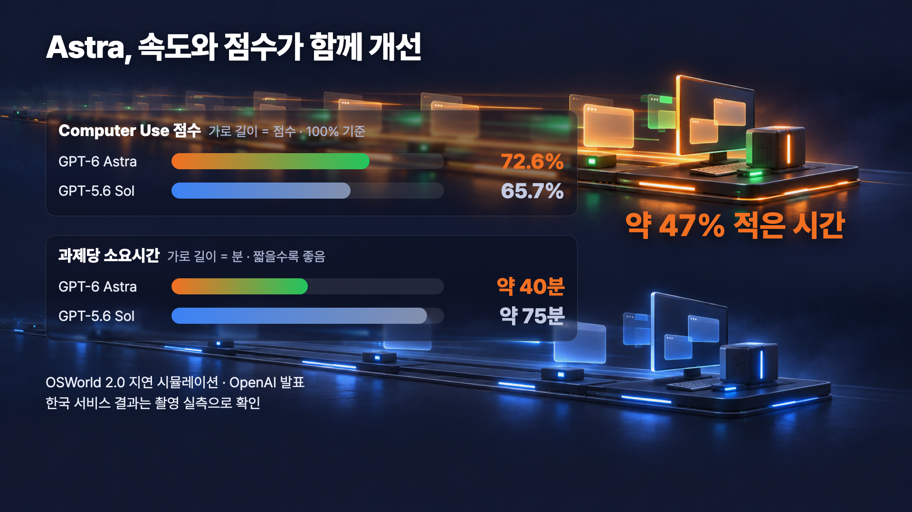
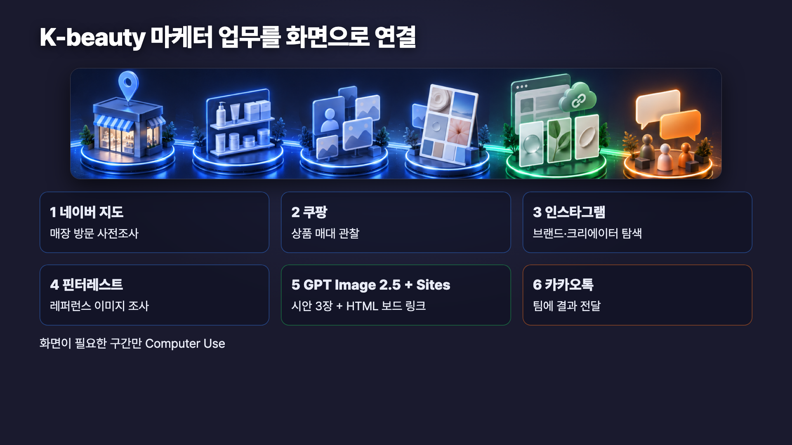

# GPT-6 Astra 컴퓨터 유즈 실전 가이드 — 화면을 열어야만 끝나던 일을 AI에게 넘기는 법


연동할 API도 없고, 플러그인도 없고, 결국 사람이 브라우저를 열어서 검색하고 클릭하고 옮겨 적어야 끝나는 일이 있습니다. 네이버 지도에서 매장 찾기, 쿠팡에서 경쟁 상품 훑기, 인스타그램에서 계정 정리하기 같은 일이요.

**컴퓨터 유즈(Computer Use)는 바로 그 구간을 위한 기능입니다.** AI가 컴퓨터 화면을 직접 보면서 검색하고, 클릭하고, 입력하고, 스크롤해서 일을 진행합니다. 이 가이드는 대본의 실습 흐름을 바탕으로 정리한 **복붙용 프롬프트 6개**, 각 입력 파일의 **역할과 본인 데이터로 바꾸는 법**, 그리고 결과를 믿기 전에 **사람이 반드시 확인해야 할 항목**을 담았습니다.

> 📌 **공개 범위 안내.** 이 가이드에는 영상에서 사용한 실습 데이터 파일(엑셀·CSV 원본), 브랜드 자산, 완성 산출물은 포함하지 않습니다. 대신 각 파일의 **구조와 역할**을 설명해 두었으니 같은 형식으로 본인 데이터를 준비하면 동일한 흐름을 재현할 수 있습니다.

> ⚠️ **먼저 알아두세요.** 컴퓨터 유즈는 Astra에서 처음 나온 기능이 아닙니다. 이전부터 있었고 이번에 성능이 올라간 것입니다. 그리고 **화면 조작은 사이트 구조와 계정 상태에 따라 결과가 달라집니다.** 아래 프롬프트를 그대로 넣어도 여러분 화면에서는 다르게 동작할 수 있습니다.

---

## 목차

- [1. 언제 켜고 언제 끄나 — 고속도로와 마지막 골목](#1-언제-켜고-언제-끄나--고속도로와-마지막-골목)
- [2. 공식 발표로 확인된 것과 직접 봐야 하는 것](#2-공식-발표로-확인된-것과-직접-봐야-하는-것)
- [3. 이번 실습의 전체 흐름](#3-이번-실습의-전체-흐름)
- [4. 입력 파일의 역할과 본인 값으로 바꾸는 법](#4-입력-파일의-역할과-본인-값으로-바꾸는-법)
- [5. 모든 프롬프트에 공통으로 깔린 원칙](#5-모든-프롬프트에-공통으로-깔린-원칙)
- [6. 복붙 프롬프트 6개](#6-복붙-프롬프트-6개)
- [7. 참고 자료](#7-참고-자료)

---

## 1. 언제 켜고 언제 끄나 — 고속도로와 마지막 골목


MCP, CLI와 같은 연동 도구를 **고속도로**라고 생각하면 이해가 쉽습니다. API·CLI·MCP는 넓고 빠르고 정확하고 반복에 강합니다. 갈 수만 있다면 무조건 그쪽이 낫습니다.

문제는 고속도로가 목적지 **바로 앞까지는 안 간다**는 점입니다. 마지막 골목은 결국 사람이 화면을 보고 걸어 들어가야 합니다. 컴퓨터 유즈는 그 마지막 골목을 대신 걸어주는 기능입니다.

| 상황 | 쓸 도구 | 이유 |
|---|---|---|
| 공식 API·플러그인·MCP가 있다 | **연동 도구** | 빠르고 정확하고 반복에 강하다 |
| 연동이 없고 화면에만 정보가 있다 | **컴퓨터 유즈** | 사람이 보던 화면을 그대로 본다 |
| 여러 앱을 하나의 흐름으로 이어야 한다 | **컴퓨터 유즈 + 전문 도구** | 화면 구간만 조작하고 나머지는 전문 도구로 |
| 이미지·파일·코드를 만들어야 한다 | **전문 도구** | 화면을 볼 필요가 없는 생성 작업이다 |

> 💡 **핵심.** 전부를 컴퓨터 유즈에 맡기는 게 아닙니다. **화면을 봐야만 되는 구간에만** 켜고, 나머지는 각자 잘하는 도구에 넘기는 하이브리드 구조가 기본입니다.

---

## 2. 공식 발표로 확인된 것과 직접 봐야 하는 것



OpenAI가 공개한 수치입니다.

| 구분 | GPT-6 Astra | GPT-5.6 Sol |
|---|---|---|
| 컴퓨터 유즈 점수 | **72.6%** | 65.7% |
| 과제당 소요 | **약 40분** | 약 75분 |

기준은 **OSWorld 2.0 지연 시뮬레이션**이고 **OpenAI가 발표한 값**입니다. 점수와 시간이 같이 좋아졌다는 방향은 읽을 수 있지만, 여기서 주의할 점이 있습니다.

> ⚠️ **이 수치가 보장하지 않는 것.** 벤치마크 환경과 여러분이 실제로 쓰는 한국 서비스 화면은 다릅니다. 본인 환경에서 직접 돌려보고 판단하셔야 합니다.

---

## 3. 이번 실습의 전체 흐름



가상의 K-beauty 브랜드를 하나 만들고, 캠페인 준비 업무를 **하나의 연속 작업**으로 요청했습니다. 여섯 단계인데 **전부 컴퓨터 유즈가 하는 게 아닙니다.**

| # | 단계 | 하는 일 | 담당 |
|---:|---|---|---|
| 1 | 네이버 지도 | 매장 방문 사전조사 | 컴퓨터 유즈 |
| 2 | 쿠팡 | 상품 매대 관찰 | 컴퓨터 유즈 |
| 3 | 인스타그램 | 브랜드·크리에이터 탐색 | 컴퓨터 유즈 |
| 4 | 핀터레스트 | 레퍼런스 이미지 조사 | 컴퓨터 유즈 |
| 5 | GPT Image 2.5 + HTML 보드 | 시안 3장 + 검토 보드 | 전문 도구 |
| 6 | 카카오톡 | 팀에 결과 전달 | 컴퓨터 유즈 |

5번이 컴퓨터 유즈가 아니라는 점이 중요합니다. 이미지 생성과 파일·코드 작성은 화면을 볼 필요가 없으니 각각의 전문 도구가 맡습니다. 화면 조작은 **필요한 구간에만** 켭니다.

---

## 4. 입력 파일의 역할과 본인 값으로 바꾸는 법

아래 프롬프트에는 예시 브랜드·검색어·폴더명이 그대로 들어 있습니다. 본인 상황에 맞게 바꿔서 쓰세요.

| 프롬프트 속 값 | 무슨 역할인가 | 본인은 이렇게 바꾸세요 |
|---|---|---|
| `성동구 올리브영` | 1번 단계 검색어 | 본인이 방문할 지역·매장 이름 |
| `톤업 선크림` | 2·3번 단계 검색어 | 본인 제품 카테고리 |
| `Lumière Lab` 톤업 선크림 브리프 | 5번 단계 브랜드 브리프 | 본인 브랜드명과 제품 설명 |
| `인스타그램 계정`, `마케팅팀 대화방` | 조사와 결과 전달에 사용할 대상 | **현재 사용할 계정과 대상 대화방** |
| `실행 시점` | 관찰한 시점 | 본인이 실행한 시점 |
| `korean sunscreen campaign` 등 | 4번 단계 핀터레스트 검색어 | 본인 제품에 맞는 영문 검색어 2~3개 |

### 만들어지는 산출물 구조

```
research/
  01-oliveyoung-seongdong.md    매장 후보 표 + 방문 순서
  02-coupang-shelf.xlsx         매대 관찰 표 (최대 20행)
  02-coupang-insight.md         가격대·표현 패턴·광고 비중 요약
  03-brands.xlsx                브랜드 계정 워크북
  03-creators.xlsx              크리에이터 계정 워크북
  03-unclassified.md            분류 보류 계정과 사유
  04-visual-directions.md       비주얼 방향 3개
assets/                         4:5 시안 3장
board/index.html                전체 조사 결과 검토 보드

```

> 💡 **왜 파일로 남기나.** 화면에서 읽은 값은 시간이 지나면 달라집니다. 파일에 **출처 URL과 관찰 시각**을 같이 남겨야 나중에 다시 대조할 수 있습니다.

---

## 5. 모든 프롬프트에 공통으로 깔린 원칙

프롬프트 6개에는 아래 원칙이 공통으로 들어가 있습니다. 본인 프롬프트를 새로 만들 때도 같은 뼈대를 쓰시면 됩니다.

| 원칙 | 내용 |
|---|---|
| 첫 문장 고정 | 컴퓨터 유즈 작업은 `Computer Use 를 사용해서` 로 시작하고 대상 앱·화면·흐름을 정확히 쓴다 |
| 한 번에 하나 | 한 프롬프트에 하나의 대상 앱·흐름만 준다 |
| 연동 우선 | 전용 플러그인이나 MCP가 있으면 그쪽을 먼저 쓰고, 화면을 봐야 하는 구간에만 컴퓨터 유즈를 쓴다 |
| 요청한 일은 끝까지 | 조회·정리·저장·전송·예약·결제처럼 요청에 분명히 포함된 작업은 중간에 멈추지 않고 완료까지 진행한다 |
| 사소한 공백은 가정 | 결과가 달라지지 않는 빈칸은 합리적으로 가정하고 그 가정을 기록한다 |
| 애매하면 한 번만 | 대상·금액·날짜·범위·메시지 내용처럼 결과를 바꾸는 값이 불분명할 때만 짧게 한 번 묻는다 |
| HTML 보드는 브라우저로 | 직접 만든 HTML 보드는 브라우저로 열어 먼저 검증한다 |
| 안 보이면 확인 불가 | 화면에서 읽은 수치는 추정하지 않는다. 안 보이면 `확인 불가` 로 적는다 |
| 끝나면 다시 열어본다 | 완료 전에 화면과 저장된 파일을 다시 열어 검증한다 |

프롬프트 구조는 OpenAI 공식 가이드의 **`목표 / 맥락 / 제약 / 완료 조건`** 네 요소를 참고했습니다. 다만 제약을 길게 나열하지 않고, 결과 정확도에 필요한 `기록 기준`만 남겼습니다.

---

## 6. 복붙 프롬프트 6개

> 📌 아래는 대본의 실습 흐름을 시청자가 바로 따라 할 수 있게 정리한 버전입니다. [4번 표](#4-입력-파일의-역할과-본인-값으로-바꾸는-법)를 보고 검색어·브랜드·계정만 본인 것으로 바꿔서 쓰세요.

### 프롬프트 1 — 네이버 지도 현장조사 사전 작업

```text
Computer Use 를 사용해서 Chrome 에서 네이버 지도와 올리브영 공식 매장찾기 화면을 조작해줘.

목표
다음 주 성수동 현장 방문 전에, 실행 시점에 확인 가능한 올리브영 매장 후보와 이동 동선을 정리한다.

대상 앱·화면
Chrome 브라우저 한 흐름. 네이버 지도 검색 화면과 올리브영 공식 매장찾기 화면 두 곳만 사용한다.

입력·맥락
검색어는 성동구 올리브영 이다.
검색 결과를 올리브영 공식 매장찾기 화면과 교차 확인한다.

결과물
research/01-oliveyoung-seongdong.md 에 후보 표를 저장한다.
각 행의 항목은 매장명, 주소, 영업시간 표시 여부, 기준 지점(성수역·연무장길 등), 방문 우선순위, 확인 시각, 근거 URL 이다.
표 아래에 방문 순서 제안과, 누락·폐점·이전이 의심되는 항목을 따로 적는다.
네이버 지도에 "성동구 시장조사" 카테고리를 신설하고, 해당 매장들을 추가한다.

기록 기준
전부 수집했다고 쓰지 않는다. 실행 시점에 확인 가능한 후보라고만 적는다.
두 경로의 결과가 다르면 임의로 합치지 말고 차이를 그대로 남긴다.
화면에서 안 보이는 값은 확인 불가로 적는다.

완료 조건
중복이 제거된 후보 표, 방문 순서 제안, 의심 항목 표시가 파일에 저장되어 있다.
정리한 후보는 네이버 지도 리스트로 저장해두어 바로 열어볼 수 있다.

검증
저장한 파일을 다시 열고, 각 후보의 근거 URL 을 다시 방문해 매장명과 주소가 일치하는지 확인한다.
리스트를 저장했으면 저장된 리스트를 다시 열어 매장 수와 이름을 확인한다.
```

> 💡 **이 프롬프트의 포인트.** 검색 경로를 **두 개** 쓰고 서로 교차 확인시킵니다. 결과가 다르면 합치지 말고 차이를 남기라고 지시한 게 핵심입니다. 한 경로만 믿으면 폐점·이전된 매장을 걸러낼 수 없습니다.

### 프롬프트 2 — 쿠팡 매대 관찰

```text
Computer Use 를 사용해서 Chrome 에서 쿠팡 검색 화면을 조작해줘.

목표
톤업 선크림 경쟁 상품이 온라인 매대에서 어떻게 보이는지 파악한다.

대상 앱·화면
Chrome 브라우저 한 흐름. 쿠팡 검색 결과 첫 화면만 본다.

입력·맥락
검색어는 톤업 선크림 하나만 사용한다.

결과물
research/02-coupang-shelf.xlsx 에 관찰 표를 저장한다.
열은 observed_order, sponsored, brand_product, capacity, price, rating, review_count, delivery_badge, visible_claim, url, observed_at 이다.
research/02-coupang-insight.md 에 가격대, 반복되는 표현 패턴, 광고 비중을 요약한다.

기록 기준
첫 검색 화면에 보이는 상품 카드 최대 20개만 관찰한다.
광고·스폰서 노출과 일반 노출을 반드시 분리해서 표기한다.
쿠팡 판매순위나 Top 20 이라고 쓰지 않는다. 이 계정·이 검색어·이 시점에서 관찰한 상위 노출 후보라고 적는다.
화면에서 안 보이는 값은 확인 불가로 적는다. 추정하지 않는다.
사람이 보는 화면 그대로 조작한다. 접근 제한 우회나 대량 자동 수집은 하지 않는다.

완료 조건
최대 20행 표와 요약 파일이 저장되어 있고, 각 행에 광고 여부와 관측 시각이 있다.

검증
저장한 XLSX 의 각 행을 화면과 다시 대조한다.
```

### 프롬프트 3 — 인스타그램 브랜드·크리에이터 후보

```text
Computer Use 를 사용해서 현재 로그인된 탭의 인스타그램 공개 화면을 조작해줘.

목표
톤업 선크림 캠페인의 브랜드 benchmark 와 협업을 검토할 크리에이터 후보를 만들고, 공개 화면에서 확인 가능한 지표만 모아 엑셀 워크북 두 개로 정리한다.

대상 앱·화면
Chrome 브라우저 한 흐름. 로그인된 인스타그램 공개 화면을 사용한다.

입력·맥락
K-beauty, 선케어 관련 검색어와 해시태그를 저빈도로 살펴본다.

결과물
research/03-brands.xlsx 와 research/03-creators.xlsx 를 실제 엑셀 파일로 만든다.
두 워크북 모두 account_summary 시트와 post_samples 시트를 가진다.

account_summary 공통 열
account, account_type, classification_evidence, follower_count, posts_sampled,
likes_visible_posts, comments_visible_posts, avg_likes_visible_posts, avg_comments_visible_posts,
sample_rule, metrics_note, url, observed_at

브랜드 워크북 account_summary 추가 열
visual_pattern, hook, cta, format_mix

크리에이터 워크북 account_summary 추가 열
skincare_fit_evidence, content_format, sponsorship_disclosure_pattern, audience_fit_evidence, public_contact_route

post_samples 열 (두 워크북 공통)
account, post_url, published_at_visible, format, is_pinned,
likes_visible, likes, comments_visible, comments, observed_at

분류되지 않은 계정은 research/03-unclassified.md 에 계정과 사유만 적는다.

계정 분류 기준
각 계정을 워크북에 넣기 전에 먼저 분류한다.
brand 는 공식 기업·제품·커머스 브랜드 계정이다. 공개 프로필명, 소개글, 연결된 공식 사이트나 스토어, 눈에 보이는 브랜드 아이덴티티로 뒷받침되어야 한다.
creator 는 개인이 운영하며 주로 개인 제작 콘텐츠를 올리는 계정이다. 공개 소개글과 게시물 패턴으로 뒷받침되어야 한다.
근거가 부족하거나 하이브리드로 모호하면 uncertain 으로 둔다. 억지로 brand 나 creator 로 밀어 넣지 마라.
brand 는 research/03-brands.xlsx 에만, creator 는 research/03-creators.xlsx 에만 저장한다.
uncertain 은 research/03-unclassified.md 에 적고 최대 5개 정원에 포함하지 않는다.
account_summary 에 account_type 과 classification_evidence 를 반드시 채운다.

게시물 표본·지표 계산 기준
follower_count 는 관찰 시점에 프로필에 공개로 표시될 때만 기록한다.
각 계정의 최신 고정 게시물을 제외한 피드 게시물을 최대 6개까지 표본으로 잡는다.
6개보다 적으면 있는 만큼만 쓰고 posts_sampled 에 실제 개수를 적는다.
sample_rule 에는 최근 고정 게시물 제외 최대 6개 라고 적는다.
표본 게시물마다 형식, URL, 좋아요와 댓글이 보이는지 여부, 보이는 좋아요 수, 보이는 댓글 수, 관찰 시각을 post_samples 에 기록한다.
숨겨졌거나 확인할 수 없는 수치는 0 이 아니라 확인 불가다.
평균 좋아요는 좋아요가 실제로 보이는 게시물만으로 계산한다.
평균 댓글은 댓글이 실제로 보이는 게시물만으로 계산한다.
그 분모를 likes_visible_posts 와 comments_visible_posts 에 각각 적는다.
숨겨진 수치를 추론하지 마라.
이 평균만으로 성과가 좋다고 말하거나 브랜드와 크리에이터의 우열을 매기지 마라.

수식 규칙
평균과 분모 칸은 워크북 생성 경로가 수식을 지원하는 한 post_samples 의 해당 행을 참조하는 실제 엑셀 수식으로 넣는다.
파일을 열 때 재계산되도록 표시한다.
현재 환경에서 수식 계산 결과를 실질적으로 확인할 수 없으면 수식을 그대로 두고 Excel 또는 LibreOffice 에서 재계산 필요 라고 적는다. 캐시된 결과를 지어내지 마라.
확인 불가 라는 문자열을 수식이 참조하는 숫자 칸에 섞지 마라. 숫자 칸은 비워 두고 보이는지 여부는 별도 열로 표시한 뒤 metrics_note 에 설명한다.

기록 기준
브랜드 5개, 크리에이터 5개.
성과 좋은 인플루언서라고 단정하지 않는다. 공개 화면에서 캠페인 적합성을 검토할 후보라고 적는다.
수치가 화면에 안 보이거나 시점에 따라 달라지면 확인 불가 또는 실행 시점 표시값으로 적는다.

완료 조건
두 워크북이 실제 엑셀 파일로 저장되어 있고, 각각 account_summary 와 post_samples 시트를 가진다.
account_summary 의 모든 행에 account_type, classification_evidence, sample_rule, posts_sampled 가 채워져 있다.
평균 칸에는 분모가 함께 적혀 있다.
uncertain 계정은 별도 파일에 정리되어 있다.

검증
저장한 워크북을 다시 열어 시트 이름과 열 구성이 위 계약과 일치하는지 확인한다.
post_samples 의 각 행을 화면과 다시 대조한다.
평균 칸의 수식이 참조하는 행 범위가 해당 계정의 표본과 맞는지 확인한다.
단정적 표현이 섞이지 않았는지 문장 단위로 확인한다.
```

### 프롬프트 4 — 핀터레스트 비주얼 패턴

```text
Computer Use 를 사용해서 Chrome 에서 핀터레스트 공개 화면을 조작해줘.

목표
인스타그램 4:5 포스트를 만들기 위한 오리지널 비주얼 방향을 정한다.

대상 앱·화면
Chrome 브라우저 한 흐름. 핀터레스트 검색 화면만 사용한다.

입력·맥락
검색어는 두세 개만 쓴다. 예를 들어 korean sunscreen campaign, beauty product flat lay, sunlight skincare editorial.

결과물
research/04-visual-directions.md 에 비주얼 방향 3개를 저장한다.
각 방향마다 색감, 여백, 구도, 질감, 타이포 위치를 서술하고, 참고한 Pin 의 출처 URL 과 관찰 시각을 남긴다.

기록 기준
공개 Pin 최대 12개만 관찰한다.
참고한 Pin 은 출처 URL 과 함께 내부 참고용으로 저장해도 된다.
다만 특정 이미지 한 장을 그대로 따라 만들지는 않는다. 가져오는 것은 색감·여백·구도·질감·타이포 위치 같은 속성이다.

완료 조건
3개 방향이 서로 구분되고, 각 방향이 특정 이미지 한 장의 복제가 아님을 설명할 수 있다.

검증
저장한 파일을 다시 읽고 특정 브랜드명·제품명·카피 문구가 들어가지 않았는지 확인한다.
```

### 프롬프트 5 — GPT Image 2.5 시안 3장 + HTML 보드

```text
GPT Image 2.5 를 사용해서 직전 Pinterest 레퍼런스 조사 결과를 바탕으로 인스타그램 4:5 시안 3장을 만들고, 전체 조사 결과를 한 번에 검토할 수 있는 HTML 보드까지 완성해줘.

입력
research/ 아래에 지금까지 저장한 산출물 전부.
직전 단계에서 만든 Pinterest 비주얼 방향 문서와, 저장해 둔 참고 이미지가 있으면 그것도 함께.
가상 브랜드 Lumière Lab 의 톤업 선크림 브리프.

맡기는 판단
레퍼런스 중에서 쓸 만한 것을 네가 골라라.
서로 확실히 다른 비주얼 방향 3개를 정하고, 각 방향으로 4:5 시안을 한 장씩 만들어라.
HTML 보드의 정보 구조와 레이아웃도 네가 설계해라.
레퍼런스는 색감·구도·무드 같은 상위 속성만 참고하고 특정 이미지를 따라 그리지 마라.

결과물
assets/ 아래에 오리지널 4:5 시안 3장.
board/index.html 과 board/assets/.
보드에는 현장조사, 쿠팡 관찰, 인스타그램 브랜드·크리에이터 결과, Pinterest 레퍼런스, 비주얼 방향 3개, 시안 3장과 캡션 초안·CTA, 출처 링크, 관찰 시각, 확인 불가 항목이 들어가야 한다.

보드를 @site로 공유 가능한 링크로 만들고 그 링크를 알려줘라.

기록 기준
특정 Pinterest 이미지 한 장을 그대로 재현하지 마라.
확인하지 못한 값은 임의로 채우지 말고 확인 불가로 둬라.

검증
시안 3장이 서로 다르고 특정 레퍼런스의 복제가 아닌지 확인해라.
내장 브라우저로 board/index.html 을 열어 이미지 경로, 한글 표시, 데스크톱과 모바일 레이아웃, 출처 링크가 정상인지 확인해라.
공유 링크를 만들었으면 그 링크도 실제로 열어 확인해라.
문제가 있으면 한 번 고치고 다시 열어라.
```

> 💡 **여기서 컴퓨터 유즈를 쓰지 않습니다.** 이미지 생성과 HTML 작성은 화면을 볼 필요가 없는 작업입니다. 대신 **만든 페이지를 직접 열어 확인**하게 했습니다. 만들어 놓고 안 열어보면 이미지 경로가 깨져 있어도 모릅니다. 공유 링크까지 만들었다면 그 링크도 열어봐야 합니다.

### 프롬프트 6 — 카카오톡 결과 전달

```text
Computer Use 를 사용해서 카카오톡 데스크톱 앱의 마케팅팀 대화방을 열고 메시지를 보내줘.

목표
오늘 조사 결과를 마케팅팀 대화방에 전달한다.

대상 앱·화면
카카오톡 데스크톱 앱. 마케팅팀 대화방 하나만 연다.

입력·맥락
board/index.html 의 내용과 오늘 조사 요약을 사용한다.
직전 단계에서 보드 공유 링크를 만들었으면 그 링크를 함께 넣는다.

결과물
아래 구성의 메시지를 대화방에 전송한다.
- 오늘 조사 요약
- 보드 링크
- 확인이 필요한 결정 2개

순서
1. 대상 대화방을 연다.
2. 메시지를 작성한다.
3. 대화방과 보낼 내용이 분명하면 그대로 한 번 전송한다.
4. 이름이 비슷한 방이 여럿이라 대상이 헷갈리거나, 넣을 링크나 문구가 비어 있으면 그 한 가지만 짧게 묻고 답을 받은 뒤 전송한다.

완료 조건
메시지가 의도한 대화방에 한 번 전송되어 있다.

검증
전송 후 대화방 이름과 올라간 메시지 전문을 화면에서 다시 읽고, 한 번만 전송됐는지 확인해서 보고한다.
```

> 💡 **애매할 때만 한 번 묻는 구조입니다.** 대화방과 보낼 내용이 분명하면 그대로 전송하고, 이름이 비슷한 방이 여럿이거나 링크·문구가 비어 있을 때만 그 한 가지를 묻습니다. 단계마다 확인을 받으면 자동화가 아니라 수동 작업이 됩니다.
>
> 대신 **전송 뒤에 대화방 이름과 올라간 메시지 전문을 다시 읽어 확인**하게 했습니다. 보냈다는 보고만 믿지 않고 화면으로 대조하는 절차입니다.

---

## 7. 참고 자료

| 문서 | 링크 |
|---|---|
| GPT-6 Astra 공식 발표 | https://openai.com/index/gpt-6-astra |
| Codex Computer Use 공식 문서 | https://developers.openai.com/codex/computer-use |
| Codex 프롬프트 Best practices | https://developers.openai.com/codex/learn/best-practices |
| Codex Models — end-to-end 작업 권장 | https://developers.openai.com/codex/models |
| 최신 모델 가이드 (빈칸 처리 원칙) | https://developers.openai.com/api/docs/guides/latest-model |
| ChatGPT Images 2.5 공개 | https://openai.com/index/introducing-chatgpt-images-2-5 |
| 이미지 프롬프팅 가이드 | https://developers.openai.com/api/docs/guides/image-prompting |
| 이미지 생성 API 가이드 | https://developers.openai.com/api/docs/guides/image-generation |
| ChatGPT Images 2.5 시스템 카드 | https://deploymentsafety.openai.com/chatgpt-images-2-5 |

---

**채널 구독** — https://www.youtube.com/@citizendev9c?sub_confirmation=1
