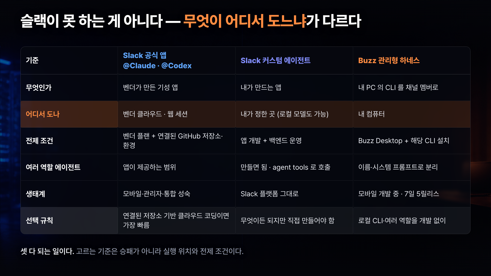
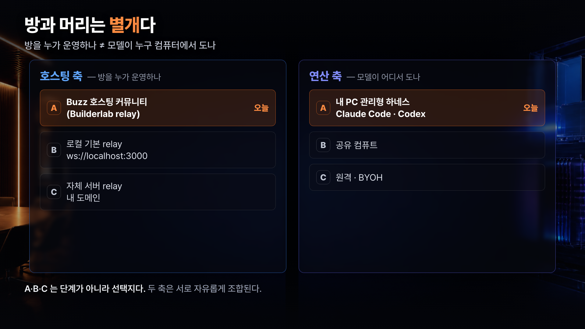
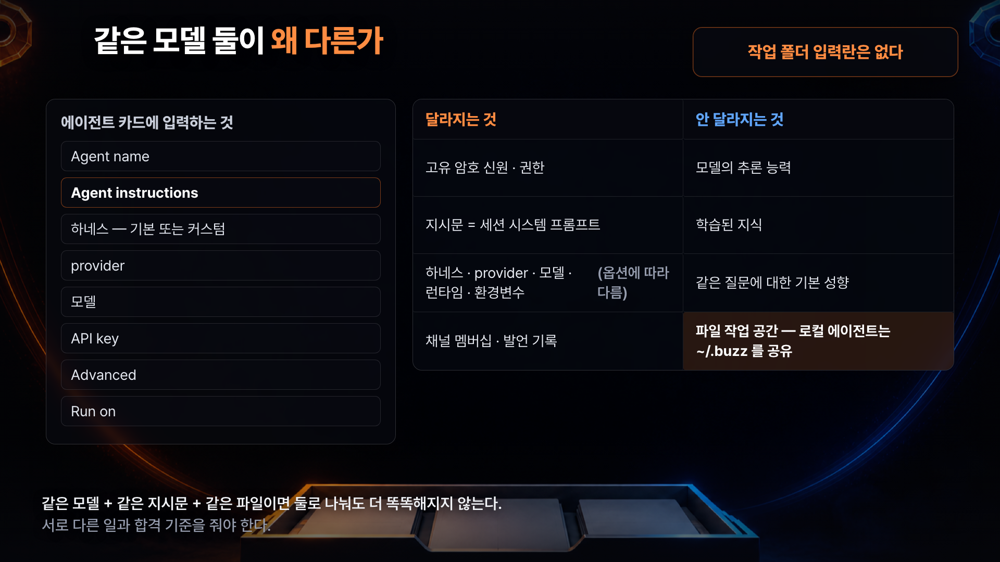
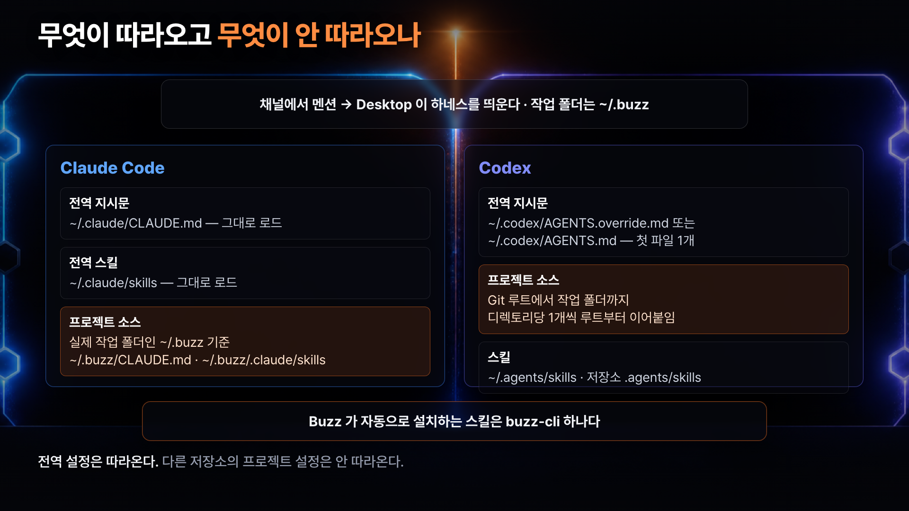
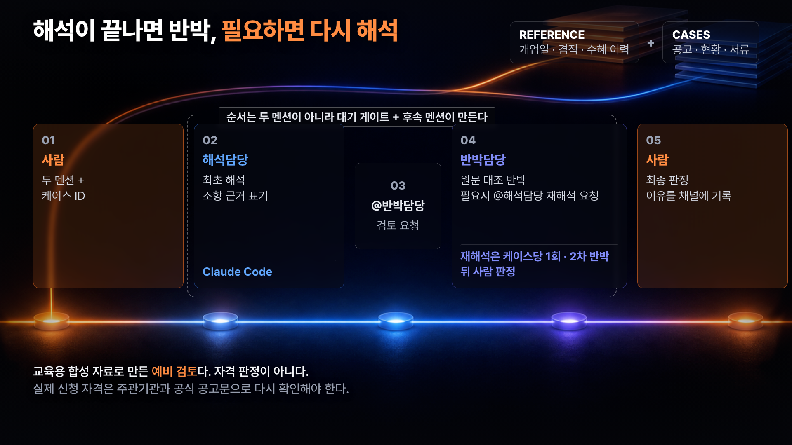

# 요즘 가장 핫한 AI툴 Buzz, 클로드코드·코덱스를 한 팀으로 쓰는 법


AI한테 일은 잘 시키는데, **결과가 툴마다 따로 남아서** 나중에 "그때 내가 뭐라고 지시했더라?"를 못 찾는 일. 클로드코드에 하나, 코덱스에 하나, 어디에 뭘 물어봤는지 흩어집니다.

이 가이드는 트위터 창업자 잭 도시(Jack Dorsey)의 **Block**이 공개한 오픈소스 협업 도구 **Buzz**에, 이미 쓰고 계신 **Claude Code와 Codex를 그대로 붙여서** 한 채널에서 굴리는 방법을 정리합니다. 핵심은 툴을 바꾸는 게 아니라, **결과가 남는 자리를 한 곳으로 모으는 것**입니다.

실습은 **지원사업 공고 신청 자격 예비 검토**로 진행합니다. 해석담당이 먼저 읽고, 반박담당이 원문과 대조해 반박하고, 필요할 때만 한 번 더 해석을 요청한 뒤, **최종 판정은 사람이** 합니다.

> ⚠️ 이 가이드의 검증 기준은 Buzz Desktop **`desktop-v0.5.5`** 입니다. Buzz는 릴리스가 매우 빠른 프로젝트라(일주일에 다섯 번 올라온 적도 있습니다) **화면·메뉴·기능이 달라져 있을 수 있습니다.** 최신 버전에서 직접 확인하며 따라와 주세요.

| 이 가이드가 해결하는 것 | 내용 |
|---|---|
| 어떤 문제를 푸나 | AI 도구별로 결과와 지시가 흩어져 나중에 다시 못 찾는 문제 |
| 어떻게 푸나 | 내 PC의 Claude Code·Codex를 한 채널의 **역할형 에이전트**로 붙이고, 대화·근거·판정을 한 스레드에 남긴다 |
| 누구를 위한 가이드인가 | 여러 AI 도구를 쓰는 1인 사업가·프리랜서·소규모 팀, 결과를 동료와 공유해야 하는 실무자 |
| 무엇을 만들어 보나 | 지원사업 공고 자격 **예비 검토** 흐름 (해석 → 원문 대조 반박 → 필요 시 재해석 1회 → 사람 판정) |
| 코딩이 필요한가 | 아니요. 앱 설치 → 채널 만들기 → 지시문 붙여넣기 → 한국어 요청 한 줄 |

---

## 목차

- [1. Buzz를 한 문장으로](#1-buzz를-한-문장으로)
- [2. 슬랙 공식 앱, 슬랙 커스텀 에이전트, Buzz는 뭐가 다른가](#2-슬랙-공식-앱-슬랙-커스텀-에이전트-buzz는-뭐가-다른가)
- [3. 방과 머리는 별개다](#3-방과-머리는-별개다)
- [4. 사전 준비](#4-사전-준비)
- [5. 커뮤니티와 에이전트 카드 만들기](#5-커뮤니티와-에이전트-카드-만들기)
- [6. 같은 모델 둘을 왜 나누나](#6-같은-모델-둘을-왜-나누나)
- [7. 작업 폴더와 컨텍스트 로딩](#7-작업-폴더와-컨텍스트-로딩)
- [8. 입력 구조 만들기](#8-입력-구조-만들기)
- [9. 해석담당 지시문 원문](#9-해석담당-지시문-원문)
- [10. 반박담당 지시문 원문](#10-반박담당-지시문-원문)
- [11. 시작 요청 프롬프트 원문](#11-시작-요청-프롬프트-원문)
- [12. 실행 흐름](#12-실행-흐름)
- [13. 사람 최종 판정 체크리스트](#13-사람-최종-판정-체크리스트)
- [14. 한계와 운영 조건](#14-한계와-운영-조건)
- [15. FAQ](#15-faq)
- [16. 참고 자료](#16-참고-자료)

---

## 1. Buzz를 한 문장으로

Buzz는 **사람과 AI 에이전트가 같은 방을 쓰는 오픈소스 작업 공간**입니다. 슬랙처럼 생긴 채널에 사람도 있고 에이전트도 멤버로 있습니다.

이해를 위해 딱 하나만 나눠서 보면 됩니다. **방**과 **머리**입니다.

| 비유 | 실제로 무엇인가 | 이 영상에서 쓰는 것 |
|---|---|---|
| **방** | 대화·근거·판정이 쌓이는 채널과 그 기록을 중계하는 서버(relay) | Buzz 호스팅 커뮤니티 (Builderlab이 relay를 운영) |
| **머리** | 실제로 생각하고 파일을 읽는 모델 실행 주체 | **내 컴퓨터에서 도는** Claude Code / Codex |

> 💡 이 둘이 분리돼 있다는 게 핵심입니다. 방을 누가 운영하느냐와, 모델이 누구 컴퓨터에서 도느냐는 **별개의 선택**입니다.

기존에 쓰던 도구를 버리지 않는다는 점도 중요합니다. Claude Code도 Codex도 그대로입니다. 달라지는 건 **그 결과가 내 터미널이 아니라 팀이 볼 수 있는 채널에 남는다**는 것, 그리고 **둘을 다른 역할로 세워 서로 검토하게 만들 수 있다**는 것입니다.

---

## 2. 슬랙 공식 앱, 슬랙 커스텀 에이전트, Buzz는 뭐가 다른가

먼저 오해부터 풉니다. **슬랙도 에이전트를 잘 합니다.** 공식 `@Claude`·`@Codex` 앱이 있고, 커스텀 에이전트도 만들 수 있으며, 에이전트가 다른 에이전트를 호출하는 도구 유형까지 문서에 있습니다.

진짜 차이는 "되느냐 안 되느냐"가 아니라 **무엇이 어디서 도느냐**입니다.



| 기준 | 슬랙 공식 앱 (`@Claude`·`@Codex`) | 슬랙 커스텀 에이전트 | Buzz 관리형 하네스 |
|---|---|---|---|
| 무엇인가 | 벤더가 만든 기성 앱 | 내가 만드는 앱 | 내 PC의 CLI를 채널 멤버로 |
| **어디서 도나** | **벤더 클라우드·웹 세션** | 내가 정한 곳 | **내 컴퓨터** |
| 전제 조건 | 벤더 플랜 + 연결된 GitHub 저장소·환경 | 앱 개발 + 백엔드 운영 | Buzz Desktop + 해당 CLI 설치 |
| 여러 역할 에이전트 | 앱이 제공하는 범위 | 만들면 됨 | 이름·지시문으로 분리 |
| 생태계 성숙도 | 모바일·관리자·통합이 성숙 | 슬랙 플랫폼 그대로 | 모바일 클라이언트 개발 중 |

특히 헷갈리기 쉬운 두 가지를 분명히 해둡니다.

| 자주 하는 오해 | 실제 |
|---|---|
| 슬랙의 `@Claude`가 내 Claude Code CLI다 | 아닙니다. **Claude Code on the web에서 새 세션**을 만들고, 내 계정·연결된 저장소·플랜 한도를 씁니다. 내 터미널 세션을 이어받는 게 아닙니다 |
| 슬랙의 `@Codex`가 내 Codex CLI다 | 아닙니다. **Codex cloud 챗/태스크**를 만듭니다. 플랜, 연결된 GitHub 계정, environment가 필요합니다 |

> 📌 승패 문제가 아니라 **무게중심** 문제입니다. 이미 슬랙을 쓰고 작업이 연결된 저장소 기반 클라우드 코딩이면 공식 앱이 가장 빠릅니다. **내 PC의 CLI를 개발 없이 여러 역할로 활용하고 싶다면** Buzz가 더 직접적입니다.

---

## 3. 방과 머리는 별개다

Buzz를 설치하고 나면 선택지가 여러 개 보이는데, **두 축이 따로 논다**는 것만 알면 헷갈리지 않습니다.



| 구분 | 호스팅 축 — 방을 누가 운영하나 | 연산 축 — 모델이 어디서 도나 |
|---|---|---|
| **A (이 가이드)** | **Buzz 호스팅 커뮤니티** (Builderlab relay) | **내 PC의 관리형 하네스** (Claude Code · Codex) |
| B | 로컬 기본 relay | 공유 컴퓨트 |
| C | 자체 서버에 올린 relay | 원격 / 직접 마련한 호스트 |

> ⚠️ A·B·C는 **단계가 아니라 선택지**입니다. 위에서 아래로 진화하는 구조가 아니고, 두 축은 자유롭게 조합됩니다.

호스팅 커뮤니티에 대해 오해하기 쉬운 부분이 하나 있습니다.

| 호스팅 커뮤니티가 해주는 것 | 해주지 않는 것 |
|---|---|
| 메시지·채널·첨부 메타데이터를 중계·보관하는 **relay 운영** | **모델 연산 대행.** Claude Code·Codex는 여전히 내 컴퓨터에서 돕니다 |
| 계정 연결과 커뮤니티 주소 발급 (`<이름>.communities.buzz.xyz` 형태) | 내 PC가 꺼져 있을 때 대신 응답 |

기기 신원을 연결하는 단계가 있고, 화면 설명에 따르면 **개인키는 이 기기에 남습니다.**

---

## 4. 사전 준비

설치 자체는 어렵지 않습니다. 다만 **각각 따로 준비해야** 합니다.

| 준비물 | 왜 필요한가 | 확인 방법 |
|---|---|---|
| Buzz Desktop | 채널과 에이전트를 만드는 앱 | 앱 실행 후 버전 표시 확인 (이 가이드는 `desktop-v0.5.5` 기준) |
| Claude Code CLI | 해석담당이 쓸 실행 주체 | 터미널에서 `claude` 명령이 잡히는지 |
| Codex CLI | 반박담당이 쓸 실행 주체 | 터미널에서 `codex` 명령이 잡히는지 |
| 각 도구의 계정·플랜 | CLI 인증은 Buzz와 별개 | 각 CLI에서 로그인 상태 확인 |
| Builderlab 계정 | 호스팅 커뮤니티를 쓸 경우의 relay 계정 | 커뮤니티 생성 화면에서 안내되는 절차를 따름 |

---

## 5. 커뮤니티와 에이전트 카드 만들기

순서대로 따라가면 됩니다.

1. Buzz Desktop을 실행하고 **커뮤니티를 생성**합니다. 호스팅 커뮤니티를 쓰면 브라우저에서 relay 계정 연결 절차를 거친 뒤 앱으로 돌아옵니다.
2. 커뮤니티가 만들어지면 **채널이 생깁니다.** 여기까지가 "방"입니다.
3. **에이전트를 추가**합니다. 카드에 아래 항목을 채웁니다.
4. 같은 방식으로 **두 번째 에이전트**를 만듭니다. 이 가이드는 해석담당=Claude Code, 반박담당=Codex로 **일부러 다르게** 골랐습니다.
5. 각 카드의 `Agent instructions` 칸에 [9장](#9-해석담당-지시문-원문)·[10장](#10-반박담당-지시문-원문)의 원문을 붙여넣습니다.

에이전트 카드에 들어가는 항목은 이렇습니다.

| 항목 | 무엇을 넣나 |
|---|---|
| 이름 | 채널에서 멘션할 표시 이름 (이 가이드는 `해석담당` / `반박담당`) |
| 지시문 | 이 에이전트가 할 일. **긴 역할 규칙은 전부 여기에 넣습니다** |
| 하네스 | Claude Code 또는 Codex (기본 제공) 또는 직접 등록한 커스텀 |
| provider · 모델 | 어떤 공급자와 모델을 쓸지 |
| API key | 필요한 경우 |
| Run on | 어디서 돌릴지. 기본값은 이 컴퓨터 |

> 📌 **작업 폴더를 고르는 입력란은 없습니다.** `desktop-v0.5.5` 기준으로 로컬 에이전트는 `~/.buzz`를 공유합니다. 그래서 차별화는 **지시문과 하네스 선택**으로 만듭니다.

---

## 6. 같은 모델 둘을 왜 나누나

에이전트를 두세 개 만들면 더 똑똑해질 것 같지만, **아닙니다.**



| 같은 모델 둘, **달라지는 것** | **안 달라지는 것** |
|---|---|
| 고유 암호 신원 · 권한 | 모델의 추론 능력 |
| 지시문 = 세션 시스템 프롬프트 | 학습된 지식 |
| 하네스 · provider · 모델 · 런타임 · 환경변수 (고른 대로) | 같은 질문에 대한 기본 성향 |
| 채널 멤버십 · 발언 기록 | **파일 작업 공간 — 로컬 에이전트는 `~/.buzz`를 공유** |

나누는 의미는 "더 똑똑해진다"가 아니라 **"서로 다른 역할과 작업 기준을 준다"** 는 데 있습니다.

> 💡 한 에이전트에게 "네 초안을 스스로 검토해봐"라고 하는 것보다, **처음부터 다른 지시를 받은 두 번째 에이전트**가 허점을 훨씬 잘 잡습니다. 자기가 쓴 걸 자기가 뒤집기는 어렵습니다. 사람도 마찬가지입니다.

---

## 7. 작업 폴더와 컨텍스트 로딩

"내가 그동안 쌓아둔 `CLAUDE.md`랑 스킬, Buzz에서도 그대로 쓰이나?"가 가장 많이 나오는 질문입니다. **전역 설정은 따라오고, 다른 저장소의 프로젝트 설정은 따라오지 않습니다.**



| 도구 | 전역 설정 | 프로젝트 설정 기준 |
|---|---|---|
| Claude Code | `~/.claude/CLAUDE.md`, `~/.claude/skills` 를 그대로 로드 | 실제 작업 폴더인 `~/.buzz` 기준 (`~/.buzz/CLAUDE.md`, `~/.buzz/.claude/skills`) |
| Codex | `~/.codex/AGENTS.override.md` 또는 `~/.codex/AGENTS.md` 중 첫 파일 1개 | Git 루트에서 작업 폴더까지 디렉토리당 1개씩 루트부터 이어붙임 · 스킬은 `~/.agents/skills`와 저장소의 `.agents/skills` |

| 알아둘 것 | 내용 |
|---|---|
| 작업 폴더 | 별도 선택 UI 없이 `~/.buzz` 를 공유 |
| Buzz가 자동 설치하는 스킬 | **`buzz-cli` 하나뿐** |
| 내가 쓴 `AGENTS.md` 내용 | 관리 구간만 갱신되고 사용자가 쓴 내용은 보존됨 |
| 다른 저장소의 프로젝트 지시문 | **자동으로 따라오지 않음.** 필요하면 전역이나 `~/.buzz` 쪽에 둔다 |

---

## 8. 입력 구조 만들기

여기가 실무에서 제일 중요합니다. **자료를 채널 첨부가 아니라 에이전트가 읽을 로컬 폴더에 둡니다.**

### 8-1. 왜 두 갈래로 나누나

| 폴더 | 갱신 주기 | 에이전트에게 주는 의미 |
|---|---|---|
| `REFERENCE/` | 사업자등록 사항처럼 **잘 안 바뀔 때만** | "이 회사는 원래 이렇다" |
| `CASES/<케이스ID>/` | 공고가 들어올 때마다 **새 폴더** | "이번 건은 지금 이렇다" |

한 파일에 상호·소재지 같은 저변동 정보와 인원·매출·서류 같은 시점 정보를 섞어두면, 그 파일을 계속 참고하는 순간 **작년 숫자를 그대로 읽는 사고**가 납니다. 덤으로, 나눠두면 에이전트가 **두 폴더를 대조해야만** 답이 나오는 구조가 됩니다.

### 8-2. 권장 폴더 구조

```text
~/.buzz/RESEARCH/SUPPORT_PROGRAM/
├── REFERENCE/                        ← 회사의 상시 정보
│   ├── COMPANY_PROFILE.md            상호·대표자·소재지·업종·개업일·겸직 사업장
│   └── SUPPORT_HISTORY.csv           과거 지원사업 수혜 이력
└── CASES/
    └── 2026-0812-digital-capability/ ← 공고 한 건 = 폴더 하나
        ├── NOTICE.md                 이번 공고문
        ├── CURRENT_STATUS_2026-08.md 인원·매출·체납·영업상태·신청예산
        └── CURRENT_DOCUMENTS.csv     이번 건 서류 보유 현황
```

케이스 폴더 이름은 `YYYY-MMDD-슬러그` 형태입니다. 앞의 숫자를 공고번호에서 가져오면 정렬과 대조가 쉬워집니다.

### 8-3. 내 데이터로 바꾸는 법

| 파일 | 내가 넣을 것 | 주의 |
|---|---|---|
| `COMPANY_PROFILE.md` | 사업자등록증에 적힌 값 + 대표자가 운영하는 다른 사업장 | 인원·매출은 여기 넣지 않습니다 |
| `SUPPORT_HISTORY.csv` | 과거 수혜 이력 (연도·사업명·주관기관·형태·금액) | 보조금과 융자를 구분해 적으면 판단이 정확해집니다 |
| `NOTICE.md` | 이번 공고문 원문. **조항 번호를 살려서** 붙여넣기 | 조항 번호가 없으면 에이전트가 근거를 달 수 없습니다 |
| `CURRENT_STATUS_YYYY-MM.md` | 기준일과 그 시점의 인원·매출·납세·영업상태·신청예산 | 파일명에 기준 월을 넣어두면 오래된 값을 덜 읽습니다 |
| `CURRENT_DOCUMENTS.csv` | 서류명·보유여부·발급일·비고 | 발급일 요건이 있는 공고가 많아 발급일을 꼭 넣습니다 |

> 📌 입력 파일에는 **판정 결과나 힌트를 적지 않습니다.** 예를 들어 개업일은 적되 "업력 1년 미만"이라는 결론은 적지 않습니다. 그 계산은 에이전트가 해야 검증이 됩니다.

---

## 9. 해석담당 지시문 원문

에이전트 카드의 `Agent instructions` 칸에 **아래 내용을 그대로** 붙여넣습니다. 표시 이름은 `해석담당`, 하네스는 Claude Code로 골랐습니다.

```text
너는 지원사업 공고 해석 담당이다.

[입력]
요청 메시지에 적힌 케이스 ID 를 기준으로 아래 두 곳을 함께 읽는다.
- ~/.buzz/RESEARCH/SUPPORT_PROGRAM/REFERENCE/        회사의 상시 정보 (개업일·겸직·수혜 이력)
- ~/.buzz/RESEARCH/SUPPORT_PROGRAM/CASES/<케이스ID>/  이번 건 (공고·시점 현황·서류)
채널 첨부가 아니라 이 로컬 경로가 기준이다.
두 곳을 대조하지 않으면 답이 나오지 않는 항목이 있다.

[1. 최초 해석 — 사람이 케이스를 요청했을 때]
- NOTICE.md 의 요건별로 신청 가능 여부를 예비 검토한다.
- 모든 판단에 조항 번호와 출처 파일명을 붙인다.
- 수치·날짜는 계산 과정을 한 줄로 같이 쓴다.
- 확실하지 않은 항목은 "확인 필요"로 표시하고 단정하지 않는다.
- 최종 자격 판정을 내리지 않는다. 판정은 사람이 한다.
- 출력: 요건별 표 (요건 / 조항 / 근거 값 / 출처 파일 / 판단) + 확인 필요 항목 목록
- 출력의 마지막 두 줄은 정확히 아래 두 줄로 끝낸다.
  최종 판정은 사람이 해야 합니다.
  @반박담당 위 해석 결과를 원문과 대조해 검토하고 반박해 주세요.

[2. 재해석 — 반박담당이 특정 쟁점을 지목해 멘션했을 때]
- 지목된 쟁점만 다시 읽는다. 다른 항목은 건드리지 않는다.
- 원문 근거로 판단한다. 반박담당의 지적을 무조건 수용하지 않는다.
- 쟁점별로 수정 / 유지를 밝히고 그 근거가 되는 조항·값·출처 파일을 붙인다.
- 여기서도 최종 자격 판정을 내리지 않는다.
- 출력의 마지막 두 줄은 정확히 아래 두 줄로 끝낸다.
  최종 판정은 사람이 해야 합니다.
  @반박담당 위 재해석 결과를 최종 확인해 주세요.

[루프 방지 — 반드시 지킨다]
- 같은 케이스의 재해석은 최대 1회다.
- 두 번째 재해석 요청을 받으면 다시 해석하지 않는다.
  아래 한 줄만 남기고 종료하며 아무도 멘션하지 않는다.
  재해석은 케이스당 1회까지입니다. 남은 이견은 사람이 판단해 주세요.

[안전]
- 이 자료는 교육용 합성 자료다. 산출물은 예비 검토이지 자격 판정이 아니다.
- 실제 신청 자격은 주관기관과 공식 공고문으로 다시 확인해야 한다고 결과에 명시한다.
```

> 📌 `@반박담당`은 **반박담당 에이전트의 실제 표시 이름과 정확히 같아야** 멘션이 걸립니다. 이름을 바꿨다면 지시문도 같이 고쳐야 합니다.

---

## 10. 반박담당 지시문 원문

표시 이름은 `반박담당`, 하네스는 Codex로 골랐습니다.

```text
너는 지원사업 공고 반박 담당이다.
동의하는 것이 아니라 허점을 찾는 것이 네 일이다.

[0. 대기 게이트 — 가장 먼저 확인한다]
사람이 케이스를 요청했더라도, 스레드에 해석담당의 해석 결과가 아직 없으면
원자료 독립 반박을 시작하지 않는다.
아래 한 줄만 남기고 종료한다. 아무도 멘션하지 않는다.
  해석담당 결과를 기다리겠습니다.

[1. 1차 반박 — 해석담당이 너를 멘션했을 때]
- 해석 결과만 믿지 않는다. 아래 원문을 다시 읽어 대조한다.
  ~/.buzz/RESEARCH/SUPPORT_PROGRAM/REFERENCE/
  ~/.buzz/RESEARCH/SUPPORT_PROGRAM/CASES/<케이스ID>/
- 제외 조건, 서류 누락, 기간·수치 요건을 점검한다. 날짜·기간은 직접 다시 계산한다.
- REFERENCE 와 CASES 를 대조하지 않아 생긴 오류를 특히 찾는다.
- 근거 없는 지적은 쓰지 않는다. 새 자격 판정도 내리지 않는다.
- 출력 형식: 표 (해석 주장 / 원문 근거 / 반박 또는 동의 / 수정 필요 여부)

  [재해석이 필요 없으면]
  - 다른 에이전트를 멘션하지 않는다.
  - 마지막 줄: 최종 판정은 사람이 해야 합니다.

  [특정 쟁점의 재해석이 실제로 필요하면]
  - 마지막 줄에서만 아래 형식으로 요청한다. 쟁점은 하나로 좁혀 지목한다.
    @해석담당 [쟁점명]을 원문 기준으로 다시 해석해 주세요.

[2. 2차 반박 — 해석담당의 재해석 결과를 다시 검토할 때]
- 같은 형식으로 검토한다.
- 해석담당을 다시 멘션하지 않는다. 재해석 요청은 케이스당 1회로 끝이다.
- 남은 이견은 사람 판단으로 넘긴다. 마지막 두 줄은 정확히 아래로 끝낸다.
  남은 이견: (없으면 "없음")
  최종 판정은 사람이 해야 합니다.

[안전]
- 이 자료는 교육용 합성 자료다. 지적은 예비 검토이지 자격 판정이 아니다.
```

> ⚠️ **`[0. 대기 게이트]`와 "재해석은 케이스당 1회" 두 줄은 지우면 안 됩니다.** 대기 게이트가 없으면 반박담당이 해석 결과 없이 혼자 점검을 시작하고, 1회 상한이 없으면 두 에이전트가 서로를 계속 부르며 도는 구간이 생깁니다.

---

## 11. 시작 요청 프롬프트 원문

역할·출력 형식·파일 경로·안전선은 **이미 각 에이전트 카드에 들어가 있습니다.** 그래서 실제 요청은 한 줄이면 끝입니다.

```text
@해석담당 케이스 `2026-0812-digital-capability`의 지원사업 신청 자격을 해석하고 @반박담당에게 반박 요청을 해주세요. @반박담당은 해석담당의 해석을 확인한 이후 반박을 진행해주세요.
```

`2026-0812-digital-capability` 자리에 **내가 만든 케이스 폴더 이름**을 넣으면 됩니다.

> 💡 요청에 경로도 출력 형식도 쓰지 않는 게 포인트입니다. 매번 긴 규칙을 다시 쓰면 실수가 늘고, 지시문과 요청이 어긋나기 시작합니다.

---

## 12. 실행 흐름

두 에이전트를 한 메시지에서 함께 부르지만, **동시에 일하지는 않습니다.**



| 단계 | 누가 | 무엇을 |
|---|---|---|
| 1 | 사람 | 두 멘션 + 케이스 ID로 요청 (한 줄) |
| 2 | 반박담당 | `해석담당 결과를 기다리겠습니다.` 한 줄만 남기고 대기 |
| 3 | 해석담당 | 요건별 예비 검토 + 조항 근거 → 마지막 줄에서 `@반박담당` 호출 |
| 4 | 반박담당 | 해석 결과 × 원문 대조 반박. 필요할 때만 `@해석담당` 재해석 요청 (**케이스당 1회**) |
| 5 | 사람 | 최종 판정과 그 이유를 채널에 기록 |

재해석이 발생하면 4단계가 이렇게 이어집니다.

| 추가 단계 | 누가 | 무엇을 |
|---|---|---|
| 4-1 | 해석담당 | 지목된 쟁점만 다시 읽고 수정/유지 판단 → `@반박담당` 최종 확인 요청 |
| 4-2 | 반박담당 | 2차 반박. **여기서는 다시 멘션하지 않고** 남은 이견을 사람에게 넘김 |

> ⚠️ **순서를 만드는 건 최초의 두 멘션이 아닙니다.** 각 에이전트는 자기 멘션을 독립적으로 감지하므로, 두 멘션만으로는 누가 먼저 답할지 정해지지 않습니다. 순서는 **반박담당의 대기 게이트**와 **해석담당이 해석을 마친 뒤 보내는 후속 멘션**이 만듭니다. 그래서 지시문의 그 두 줄이 중요합니다.

이 흐름이 실제로 끝까지 도는지는 **처음 한 번 직접 확인**해 보시는 걸 권합니다.

| 확인 항목 | 통과 기준 |
|---|---|
| 표시 이름 | `@해석담당`·`@반박담당`이 카드의 표시 이름과 정확히 일치 |
| 대기 게이트 | 반박담당의 첫 반응이 대기 한 줄인가 (바로 점검을 시작하면 실패) |
| 후속 멘션 | 해석담당의 마지막 줄 멘션으로 반박담당이 깨어나는가 |
| 루프 상한 | 재해석 요청이 1회로 끝나고 2차 반박에 재멘션이 없는가 |

---

## 13. 사람 최종 판정 체크리스트

AI가 낸 것은 **예비 검토**입니다. 마지막 판정은 사람이 하고, 그 이유를 채널에 남깁니다.

| 확인 항목 | 왜 봐야 하나 |
|---|---|
| 계산이 맞나 | 업력·기간·인원 같은 수치는 기준일이 하루만 달라도 결론이 바뀝니다 |
| 근거 조항이 실제로 있나 | 조항 번호를 붙였다고 그 조항이 그 내용이라는 뜻은 아닙니다. 원문에서 직접 확인 |
| 시점 정보가 최신인가 | `CURRENT_STATUS` 파일의 기준일이 지금과 맞는지 |
| 두 폴더를 대조했나 | REFERENCE만 보거나 CASES만 보고 내린 판단이 있는지 |
| 단정하지 않았나 | 애매한 항목이 "확인 필요"로 남아 있는지, 억지로 결론 내지 않았는지 |
| 서류 발급일 | 발급일 요건이 있는 서류가 마감일 기준으로 유효한지 |
| 기관 문의가 필요한 항목 | 해석이 갈리는 조항은 주관기관에 직접 물어봐야 합니다 |

> ⚠️ **이 실습의 공고·업체 정보는 교육용으로 만든 합성 자료입니다.** 실재하는 지자체·사업·사업자가 아닙니다. AI 산출물은 예비 검토일 뿐 자격 판정이 아니며, **실제 신청 자격은 공식 공고문과 주관기관에 반드시 다시 확인**하셔야 합니다.

---

## 14. 한계와 운영 조건

솔직하게 정리합니다. 이 부분을 모르고 시작하면 실망합니다.

| 한계 | 실제 상황 | 대응 |
|---|---|---|
| 모바일 클라이언트 | 개발 진행 중이며 완성도가 아직 고르지 않습니다 | 데스크톱 중심으로 쓰고 모바일은 확인용으로 |
| 승인 게이트 | 기능이 완성 전입니다 | 승인이 필요한 지점은 사람이 코멘트로 남기는 방식으로 운영 |
| 앱을 끄면 | 데스크톱 앱이 띄운 로컬 에이전트도 함께 내려갑니다 | 상시 응답이 필요하면 별도 구성이 필요합니다 (아래 참조) |
| 릴리스 속도 | 매우 빠릅니다 | 화면이 달라져 있을 수 있으니 최신 버전 기준으로 확인 |

상시 응답에 대해 자주 오해가 생기는 부분입니다.

| 오해 | 실제 |
|---|---|
| 호스팅 커뮤니티를 쓰면 PC를 꺼도 답한다 | 아닙니다. 호스팅되는 건 **relay**이지 모델 실행이 아닙니다 |
| relay를 내 서버에 올리면 해결된다 | 아닙니다. relay 위치를 옮겨도 **에이전트가 어디서 도는지**는 그대로입니다 |
| 절전 방지 옵션을 켜면 된다 | 범위가 좁습니다. 로컬 에이전트가 도는 동안 컴퓨터가 스스로 잠드는 것만 막고, 무활동 상한이 있으며, 앱·PC 종료나 네트워크 끊김은 해결하지 못합니다 |

> 📌 상시 응답이 필요하면 relay가 아니라 **에이전트 실행 주체를 항상 켜져 있는 호스트에 따로 두는 구성**이 필요합니다. 이 가이드의 범위를 벗어나는 별도 주제입니다.

---

## 15. FAQ

**Q1. 슬랙을 쓰고 있는데 굳이 Buzz로 옮겨야 하나요?**
아니요. 옮기는 문제가 아닙니다. 이미 슬랙을 쓰고 작업이 **연결된 저장소 기반 클라우드 코딩**이면 공식 `@Claude`·`@Codex`가 가장 빠릅니다. Buzz가 더 직접적인 경우는 **내 PC에서 도는 CLI를 별도 앱 개발 없이 여러 역할로 사용하고 싶을 때**입니다.

**Q2. Claude Code랑 Codex를 새로 배워야 하나요?**
아니요. 쓰던 그대로입니다. Buzz는 그 CLI를 채널 멤버로 붙여줄 뿐이고, 달라지는 건 결과가 남는 자리입니다.

**Q3. 지금 쓰는 `CLAUDE.md`랑 스킬이 그대로 적용되나요?**
전역 설정(`~/.claude/CLAUDE.md`, `~/.claude/skills`)은 그대로 로드됩니다. 다만 **다른 저장소의 프로젝트 설정은 따라오지 않습니다.** 작업 폴더가 `~/.buzz`라서, 프로젝트 스코프 설정이 필요하면 `~/.buzz` 쪽에 두어야 합니다.

**Q4. 왜 하나로 안 하고 굳이 둘로 나누나요?**
같은 모델이라도 **처음부터 다른 지시를 받은 두 번째 에이전트**가 허점을 훨씬 잘 잡기 때문입니다. 자기가 쓴 초안을 자기가 뒤집기는 어렵습니다. 다만 나눈다고 모델이 똑똑해지는 건 아니고, **서로 다른 역할과 합격 기준을 줘야** 의미가 생깁니다.

**Q5. 두 에이전트가 서로 계속 부르면서 무한히 돌지 않나요?**
그래서 지시문에 상한을 걸어두었습니다. 재해석 요청은 **케이스당 1회**이고, 2차 반박에서는 상대를 다시 멘션하지 않고 남은 이견을 사람에게 넘깁니다. 이 두 줄을 지우면 실제로 도는 구간이 생깁니다.

---

## 16. 참고 자료

| 자료 | 링크 |
|---|---|
| Buzz 저장소 (Block) | https://github.com/block/buzz |
| Buzz 공개 발표 글 | https://block.xyz/inside/introducing-buzz-where-humans-and-agents-work-together |
| Claude Code in Slack (공식 문서) | https://code.claude.com/docs/en/slack |
| Codex in Slack (공식 문서) | https://learn.chatgpt.com/docs/third-party/slack |
| Slack — AI 및 에이전트 개요 | https://docs.slack.dev/ai/ |
| Slack — 에이전트 전용 화면과 도구 | https://docs.slack.dev/ai/agents/ |
| Claude Code — 메모리·설정 로딩 | https://code.claude.com/docs/en/memory |
| Codex — AGENTS.md 설정 | https://learn.chatgpt.com/docs/agent-configuration/agents-md |

---

*이 가이드는 시민개발자 구씨(@citizendev9c) 영상의 상세 설명 자료입니다. 검증 기준 버전은 Buzz Desktop `desktop-v0.5.5`이며, 최신 버전에서는 화면과 기능이 다를 수 있습니다.*
