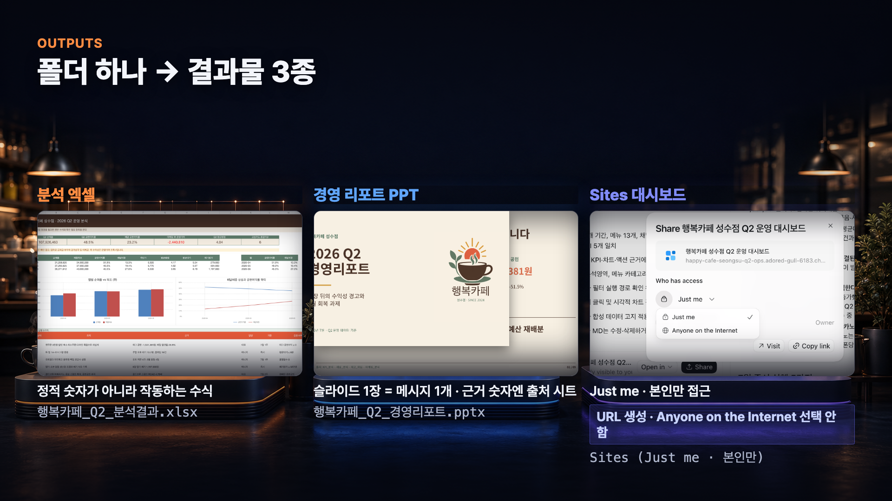

# ChatGPT Work 실전 가이드 — 폴더 하나로 엑셀·PPT·Sites 대시보드 만들기


비개발자도 ChatGPT Work에 업무 폴더 하나를 건네면 **데이터 분석 엑셀 → 핵심 인사이트 → 경영 리포트 PPT → Sites 대시보드**까지 만들 수 있을까요?

이 가이드는 영상에서 사용한 가상의 카페 운영 데이터 구성과 전체 실습 흐름을 정리한 문서입니다. 공개 가이드에는 전체 데모 데이터팩 대신 **영상에서 사용한 입력 파일의 종류·복붙용 프롬프트·검증 방법**을 담았습니다. 자신의 업무 데이터에 적용할 때는 폴더명과 파일명, 분석 질문을 상황에 맞게 바꿔 사용하세요.

> ⚠️ **먼저 알아두세요.** ChatGPT Work와 Sites는 업데이트가 빠른 기능입니다. 메뉴 이름·모델·가용 플랜·공유 옵션은 계정, 지역, 워크스페이스 설정에 따라 달라질 수 있습니다. 현재 화면이 이 문서와 다르면 [OpenAI 공식 Work 가이드](https://learn.chatgpt.com/docs/get-started-with-work)와 [Sites 가이드](https://learn.chatgpt.com/docs/sites)를 먼저 확인하세요.

| 이 가이드가 해결하는 것 | 내용 |
|---|---|
| 어떤 문제를 푸나 | 여러 시트의 운영 데이터를 읽고 엑셀·PPT·대시보드로 정리하는 일 |
| 누구를 위한 가이드인가 | 엑셀 분석이나 개발 경험이 많지 않은 대표·실무자·1인 사업가 |
| 무엇을 만들어 보나 | 분석 엑셀, 핵심 인사이트 문서, 8~10장 PPT, 본인만 접근하는 Sites 대시보드 |
| 무엇이 핵심인가 | 결과 생성보다 **실제 수식·숫자·누락·권한을 사람이 검증하는 것** |
| 영상 속 입력 데이터 | 실제 상호·개인정보가 없는 합성 데이터. 공개 가이드에는 파일 종류와 역할만 안내 |

---

## 목차

1. [ChatGPT Work는 무엇이 다른가](#1-chatgpt-work는-무엇이-다른가)
2. [한 장으로 보는 전체 실습](#2-한-장으로-보는-전체-실습)
3. [사전 준비와 영상에서 사용한 입력 파일](#3-사전-준비와-영상에서-사용한-입력-파일)
4. [좋은 Work 프롬프트의 구조](#4-좋은-work-프롬프트의-구조)
5. [1단계 — 운영 데이터 분석](#5-1단계--운영-데이터-분석)
6. [1단계 보완 — 7월 실행 액션 다시 정리](#6-1단계-보완--7월-실행-액션-다시-정리)
7. [2단계 — 경영 리포트 PPT 만들기](#7-2단계--경영-리포트-ppt-만들기)
8. [3단계 — Sites 대시보드 만들기](#8-3단계--sites-대시보드-만들기)
9. [결과물 3종 검증 체크리스트](#9-결과물-3종-검증-체크리스트)
10. [참고 자료](#10-참고-자료)

---

## 1. ChatGPT Work는 무엇이 다른가

ChatGPT Work는 질문에 답만 해주는 챗봇보다 **파일을 읽고 실제 산출물을 만들어 오는 업무 대행 에이전트**에 가깝습니다. 신입 직원에게 업무 폴더를 건네고, 원하는 결과와 검수 기준, 건드리면 안 되는 경계를 알려주는 장면을 떠올리면 쉽습니다.


| 구분 | 일반적인 대화형 요청 | Work에 맡기는 업무 |
|---|---|---|
| 입력 | 질문·텍스트 중심 | 폴더·파일·업무 브리프 |
| 주된 결과 | 설명·아이디어·답변 | 엑셀·문서·PPT·사이트 같은 실제 파일 |
| 지시 방식 | 답변 내용을 구체적으로 요청 | 결과·품질·안전 경계를 고정하고 세부 구조는 맡김 |
| 완료 기준 | 답변이 그럴듯한가 | 파일이 열리고 수식·숫자·누락·권한까지 검증되는가 |
| 사람의 역할 | 답변을 읽고 선택 | AI가 만든 산출물을 감독하고 승인 |

> 💡 **핵심 비유:** Work는 초안을 빠르게 만들어 오는 신입 직원입니다. 일을 맡길 수는 있지만 최종 숫자와 공개 여부는 사람이 확인해야 합니다.

---

## 2. 한 장으로 보는 전체 실습

이번 실습은 `demo-input` 폴더에서 시작해 네 단계로 진행합니다.


| 단계 | 입력 | 요청 | 결과 |
|---|---|---|---|
| 1. 분석 | Q2 운영 데이터·운영 브리프 | 데이터 품질 확인, 수식 기반 분석 | `행복카페_Q2_분석결과.xlsx`, `행복카페_Q2_핵심인사이트.md` |
| 1B. 수정 | 분석 엑셀·핵심 인사이트 | 7월 액션을 영향·실행성·비용 기준으로 재정렬 | 수정된 핵심 인사이트 문서 |
| 2. PPT | 분석 엑셀·핵심 인사이트·브랜드 자산 | 경영진이 판단할 수 있는 8~10장 보고서 | `행복카페_Q2_경영리포트.pptx` |
| 3. Sites | 같은 분석 결과 | KPI·원인·액션을 보는 대시보드 | `Just me` 접근의 Sites URL |
| 4. 검증 | 생성된 모든 산출물 | 수식·숫자·누락·링크·권한 대조 | 사람이 승인한 최종 초안 |

---

## 3. 사전 준비와 영상에서 사용한 입력 파일

### 3-1. 준비물

| 준비물 | 설명 |
|---|---|
| ChatGPT 데스크톱 앱 | 로컬 폴더를 연결해 Work를 사용하는 환경. UI와 가용성은 계정에 따라 다를 수 있음 |
| Work 사용 가능 계정 | 앱에서 Work를 선택할 수 있는지 먼저 확인 |
| 스프레드시트 앱 | 생성된 `.xlsx`를 열고 수식·재계산 결과를 확인할 Excel 또는 호환 앱 |
| 프레젠테이션 앱 | `.pptx` 열림·글자 잘림·차트·숫자를 확인할 PowerPoint 또는 호환 앱 |
| 테스트용 폴더 | 실제 회사 원본이 아닌 복사본 또는 직접 만든 가상 데이터 사용 권장 |

### 3-2. 영상에서 사용한 입력 파일

영상에서는 실제 상호·개인정보가 없는 **행복카페 성수점 합성 데이터**를 사용했습니다. 전체 데이터팩은 공개 가이드에 포함하지 않으며, 어떤 입력을 Work에 전달했는지만 아래에 정리합니다.

| 영상 속 파일 | 어떤 내용이 들어 있었나 | Work에서 맡은 역할 |
|---|---|---|
| `행복카페_Q2_운영데이터.xlsx` | 매출·메뉴·매입·재고·후기·인력·캠페인·KPI·데이터 사전으로 구성된 9개 시트 | 숫자 분석과 엑셀 결과물의 원본 데이터 |
| `행복카페_운영브리프.md` | 사업 배경, 분석 목적, 대표가 확인하고 싶은 운영 질문 | 분석 방향과 의사결정 맥락 제공 |
| `행복카페_브랜드가이드.pdf` | 브랜드 색상·폰트·PPT·대시보드 디자인 원칙 | 산출물의 시각적 기준 제공 |
| `행복카페_로고.png` | 실습용 가상 브랜드 로고 | PPT와 대시보드 브랜드 표현에 사용 |

영상에서는 네 파일을 아래처럼 `demo-input` 폴더 하나에 넣어 Work에 연결했습니다.

```text
demo-input/
├── 행복카페_Q2_운영데이터.xlsx
├── 행복카페_운영브리프.md
├── 행복카페_브랜드가이드.pdf
└── 행복카페_로고.png
```

### 3-3. Work에 폴더 연결하기

1. ChatGPT 데스크톱 앱을 엽니다.
2. 새 Work 세션을 시작합니다.
3. 자신의 데이터로 실습하려면 위 네 역할에 해당하는 파일을 준비합니다.
4. 로컬 폴더를 선택하는 화면에서 작업 폴더를 연결합니다.
5. 아래 프롬프트의 `demo-input`과 파일명을 자신의 폴더·파일명에 맞게 바꿔 붙여넣습니다.

> 📌 메뉴 이름과 위치는 앱 버전에 따라 달라질 수 있습니다. 중요한 것은 **Work 세션이 분석 원본·업무 브리프·브랜드 기준·로고를 읽을 수 있는 상태**인지 확인하는 것입니다.


## 4. 좋은 Work 프롬프트의 구조

OpenAI 공식 가이드는 세부 작업 순서를 모두 지시하기보다, **원하는 결과·사용할 자료·제약·좋은 결과의 기준·사람이 검토할 지점**을 알려주는 방식을 권장합니다.

| 구성 요소 | 이번 실습에서 넣은 내용 | 이유 |
|---|---|---|
| Goal | 7월 운영 결정을 위한 Q2 분석 | 작업의 목적을 고정 |
| Sources | `demo-input`의 운영 데이터·브리프·브랜드 자산 | 숫자와 디자인의 근거를 제한 |
| Output | 분석 엑셀·인사이트·PPT·Sites | 완료 파일을 명확히 정의 |
| Quality | 실제 수식, 숫자 일치, 출처 시트, 파일 열림 | 보기 좋은 오류를 막는 검수 기준 |
| Boundaries | 원본 수정·삭제·외부 전송 금지 | 되돌리기 어려운 행동 차단 |
| Autonomy Zone | 시트 구성·차트·분석 관점은 Work가 설계 | 데이터를 보고 더 적합한 구조를 찾게 함 |
| Review Point | 수식·KPI·누락·공유 권한을 사람이 확인 | 최종 판단은 사용자에게 남김 |

> 💡 **짧게 정리하면:** “무엇을 만들어야 하는지, 무엇을 근거로 써야 하는지, 어떻게 검증할지, 어디부터는 멈춰야 하는지”만 선명하게 적습니다.

---

## 5. 1단계 — 운영 데이터 분석

Work에 `demo-input` 폴더가 연결된 상태에서 아래 프롬프트를 그대로 붙여넣습니다.

```text
이 폴더(demo-input)의 2026년 Q2 운영 데이터와 운영브리프를 모두 읽고, 먼저 데이터 품질을 점검한 다음 행복카페 성수점 대표가 7월 운영 결정을 내릴 수 있는 분석 결과를 만들어줘.

산출물은 다음 두 개로 만들어줘.

1. 행복카페_Q2_분석결과.xlsx
2. 행복카페_Q2_핵심인사이트.md

엑셀의 시트 구성과 차트는 데이터 구조와 발견한 문제에 맞게 직접 설계해줘. 경영 요약, 핵심 KPI와 수익성, 주요 원인 분석, 데이터 품질, 7월 실행 액션은 반드시 포함하고, 의미 있는 분석이 더 있으면 알아서 확장해줘.

합계, 비율, 성장률 등 계산이 들어가는 셀은 정적 숫자가 아니라 실제 엑셀 수식으로 만들어줘. 모든 숫자는 원본 파일에서 직접 계산하고, 근거가 없거나 계산할 수 없으면 추정하지 말고 '확인 필요'라고 표시해줘.

완료하기 전에 수식 오류, 합계와 비율, 시트 간 숫자 일치 여부를 검산하고, 핵심 인사이트에는 근거가 된 시트나 항목을 적어줘.

원본 파일은 수정하지 말고, 파일 삭제나 외부 전송도 하지 마. 먼저 짧은 작업 계획을 세운 다음 별도의 승인 대기 없이 분석과 파일 생성을 진행해줘.
```

### 생성 후 바로 확인할 것

| 확인 항목 | 확인 방법 | 합격 기준 |
|---|---|---|
| 파일 2개 | 생성된 파일 목록 확인 | `.xlsx`와 `.md`가 모두 존재 |
| 실제 수식 | 요약 셀을 클릭해 수식 입력줄 확인 | 결과 숫자만 박혀 있지 않고 `SUM`, 비율 계산 등이 작동 |
| 파일 열림 | 엑셀을 직접 열고 재계산 | 손상 경고 없이 열리고 수식 오류가 없음 |
| 숫자 근거 | 핵심 인사이트의 출처 시트 확인 | 숫자마다 원본 시트 또는 분석 시트를 추적 가능 |
| 데이터 품질 | 누락·중복·이상치 기록 확인 | 문제를 숨기지 않고 별도 표시 |
| 추정 방지 | 근거 없는 항목 확인 | 임의 숫자 대신 `확인 필요` 사용 |

### 영상 실측값으로 빠르게 대조하기

이번 합성 데이터에서 영상으로 공개한 핵심 값은 아래와 같습니다. 

| 지표 | 검산값 |
|---|---:|
| Q2 순매출 | 107,926,463원 |
| Q2 공헌이익 | 52,375,190원 |
| Q2 공헌이익률 | 48.5% |
| 월별 공헌이익률 | 4월 51.9% → 5월 49.0% → 6월 45.5% |
| 월별 배달 비중 | 4월 13.3% → 5월 19.5% → 6월 27.0% |

> ⚠️ 시트가 많거나 차트가 예쁘다고 분석이 정확한 것은 아닙니다. **수식이 작동하고 핵심 숫자가 원본과 맞는지**가 먼저입니다.

---

## 6. 1단계 보완 — 7월 실행 액션 다시 정리

첫 결과를 검증한 뒤, 핵심 인사이트의 액션 플랜만 다시 정리합니다. AI가 자기 산출물을 근거 중심으로 고쳐 쓰는지 확인하는 단계입니다.

```text
방금 만든 '행복카페_Q2_핵심인사이트.md'에서 7월 실행 액션 부분만 다시 정리해줘.
5개 액션을 우선순위 순서대로 재배열하고, 순서를 그렇게 매긴 이유도 적어줘.

- 우선순위 기준: (1) 7월 공헌이익률에 주는 영향이 큰 것,
  (2) 7월 안에 실행 가능한 것, (3) 추가 비용이 적게 드는 것.
- 액션마다 이렇게 적어줘:
  [무엇을] / [왜 — 근거 숫자와 출처 시트] / [언제까지] / [무엇으로 성공을 확인하나]
- 근거 숫자는 '행복카페_Q2_분석결과.xlsx'에 실제로 있는 값만 써.
  새로 추정하지 말고, 파일에 없으면 '확인 필요'라고 적어줘.

수정이 끝나면 5개 액션 모두에 근거 숫자와 출처 시트, 기한, 성공 확인 지표가
있는지 확인하고, 빠진 항목은 '확인 필요'로 표시해줘.

'행복카페_Q2_핵심인사이트.md'의 액션 플랜 섹션만 고쳐서 저장하고,
다른 섹션과 다른 파일은 건드리지 마. 파일 삭제나 외부 전송은 하지 마.
```

| 액션마다 있어야 할 것 | 질문 |
|---|---|
| 무엇을 | 실제로 바꿀 행동이 한 문장으로 보이는가 |
| 왜 | 분석 엑셀의 근거 숫자와 출처 시트가 있는가 |
| 언제까지 | 7월 안에 실행 가능한 기한인가 |
| 성공 기준 | 실행 후 어떤 KPI가 바뀌면 성공인지 보이는가 |
| 확인 필요 | 근거가 없을 때 AI가 지어내지 않고 멈췄는가 |

---

## 7. 2단계 — 경영 리포트 PPT 만들기

분석 엑셀과 핵심 인사이트를 바탕으로 경영 리포트 PPT를 요청합니다.

```text
방금 만든 '행복카페_Q2_분석결과.xlsx'와 '행복카페_Q2_핵심인사이트.md'를 바탕으로
경영진용 '행복카페_Q2_경영리포트.pptx'를 8~10장 분량으로 만들어줘.

- 반드시 답해야 할 것: Q2 핵심 성과와 변화 / 공헌이익률이 떨어진 원인 /
  메뉴·채널·운영·캠페인에서 중요한 문제 / 7월 우선 실행 액션.
- 슬라이드 순서와 차트 종류·레이아웃은 위 내용을 가장 잘 전달하도록 직접 설계해줘.
- demo-input의 행복카페_브랜드가이드.pdf 색상·원칙과 행복카페_로고.png를 반영해줘.
- 슬라이드마다 메시지는 하나, 근거 숫자에는 출처 시트를 작게 표기해줘.
- 여백 넓게, KPI 숫자는 크게, 차트는 1장 1메시지. 과한 장식은 빼줘.
- 숫자는 '행복카페_Q2_분석결과.xlsx'에 있는 값을 그대로 써. 새로 추정하지 말고,
  파일에 없으면 '확인 필요'라고 적어줘.

완료 전에 PPT 숫자가 분석 엑셀과 일치하는지, 숫자마다 출처 시트가 있는지,
슬라이드 간 숫자·메시지가 충돌하지 않는지, 파일이 정상적으로 열리는지 확인해줘.

짧은 구성안을 세운 다음 별도 승인 대기 없이 로컬 PPT 초안까지 만들어줘.
파일 삭제나 외부 전송은 하지 마.
```

### PPT 검수 기준

| 항목 | 확인 방법 | 불합격 예시 |
|---|---|---|
| 열림 | PowerPoint 또는 호환 앱으로 전체 슬라이드 열기 | 손상 경고·빈 슬라이드 |
| 숫자 | KPI를 분석 엑셀과 대조 | 같은 지표가 슬라이드마다 다름 |
| 출처 | 숫자 옆 작은 출처 시트 표기 확인 | 근거 없는 숫자 |
| 메시지 | 슬라이드 제목만 읽어도 이야기가 이어지는지 확인 | 한 장에 메시지가 여러 개 |
| 디자인 | 글자 잘림·겹침·과밀도 확인 | 본문이 발표 화면에서 읽히지 않음 |
| 브랜드 | 로고·색상·여백을 브랜드 가이드와 대조 | 로고 왜곡·임의 색상 |

---

## 8. 3단계 — Sites 대시보드 만들기

마지막으로 같은 분석 결과를 Sites 대시보드로 만듭니다. 이 단계는 파일 생성과 달리 **배포·접근 권한**이 포함되므로 더 조심해야 합니다.

```text
@site 같은 분석 결과('행복카페_Q2_분석결과.xlsx'와 '행복카페_Q2_핵심인사이트.md')로
경영진용 운영 대시보드를 ChatGPT Work의 Sites로 만들고, 완성되면 Sites URL로 배포해줘.
단, 접근 권한은 'Just me'(본인만)로 배포해서, URL이 생기더라도 사이트 소유자인
나만 볼 수 있게 해줘. 'Anyone on the Internet'(인터넷 전체 공개)은 선택하지 마.

- 대시보드가 반드시 답해야 할 질문:
  1) Q2 매출과 수익성은 어떻게 변했는가
  2) 수익성 하락의 주요 원인은 무엇인가
  3) 어떤 메뉴·채널·운영·캠페인을 먼저 개선해야 하는가
  4) 7월에 무엇을 실행하고 어떤 지표로 확인할 것인가
- 공헌이익률·월별 변화·7월 액션은 반드시 보이게 해줘.
- KPI 카드·차트·필터·레이아웃은 위 질문에 맞게 직접 선택·설계해줘.
- 브랜드 색을 반영하고, 합성 데이터임을 작게 표기해줘.
- 숫자는 '행복카페_Q2_분석결과.xlsx'에 있는 값만 쓰고, 숫자마다 근거 시트를 표기해줘.
  없으면 '확인 필요'라고 적어줘.

완료 전에 숫자가 분석 엑셀과 일치하는지, 출처 시트가 있는지, 필터가 작동하는지,
차트가 제대로 보이는지 확인하고, 지원되지 않으면 성공한 척하지 말고 '지원되지 않음'
이라고 정확히 보고해줘.
배포한 뒤에는 최종 URL과 실제 적용된 접근 권한을 알려주고, 지금 'Just me' 상태라
소유자인 나만 접근되는지, 비로그인·다른 계정은 막히는지 확인해줘. 실제로
테스트할 수 없으면 '확인 필요'라고 적어줘.
'Just me'로 둘 수 없다면 인터넷 전체 공개로 대체하지 말고 멈추고 '비공개 배포 불가'라고
이유와 함께 보고해줘.

원본 파일은 수정·삭제하지 말고, 파일을 외부로 전송하지 마.
```

### Sites 권한은 URL과 별개입니다

| 화면에 보이는 옵션 | 의미 | 이 실습의 선택 |
|---|---|---|
| `Just me` | 소유자 본인만 접근 | **선택** |
| `Anyone on the Internet` | 인터넷 전체 공개 | **선택 금지** |
| 초대·워크스페이스 옵션 | 계정·워크스페이스에 따라 보일 수 있음 | 현재 화면에서 실제 제공될 때만 사용 |
| `Copy Link` | 주소를 복사 | 링크 복사만으로 접근 권한이 바뀌는 것은 아님 |

현재 촬영 계정에서는 `Just me`와 `Anyone on the Internet` 두 옵션만 확인됐습니다. 다른 계정에는 다른 옵션이 보일 수 있습니다.

---

## 9. 결과물 3종 검증 체크리스트



| 결과물 | 반드시 확인할 것 | 사람의 최종 판단 |
|---|---|---|
| 분석 엑셀 | 수식 작동, 핵심 KPI 일치, 합계·비율 오류, 누락·중복 | 숫자를 업무에 써도 되는가 |
| 핵심 인사이트 | 숫자마다 출처, 원인과 액션 연결, `확인 필요` 경계 | 실행 근거가 충분한가 |
| 경영 리포트 PPT | 엑셀과 숫자 일치, 출처 시트, 글자 잘림, 메시지 흐름 | 회의에서 오해 없이 전달되는가 |
| Sites 대시보드 | KPI·필터·차트, 데이터 완전성, 접근 권한 | 의사결정에 빠진 항목이 없는가 |

### 5분 최종 검수

- [ ] 엑셀의 주요 KPI 셀에 실제 수식이 들어 있다.
- [ ] Q2 순매출·공헌이익률과 월별 흐름이 검산값과 맞는다.
- [ ] PPT의 모든 핵심 숫자가 분석 엑셀과 일치한다.
- [ ] 대시보드의 메뉴·기간·채널 목록이 원본에서 빠지지 않았다.
- [ ] 필터를 바꾸면 KPI와 차트가 함께 갱신된다.
- [ ] 근거 없는 내용은 `확인 필요` 또는 `지원되지 않음`으로 표시됐다.
- [ ] Sites 접근 권한이 `Just me`다.
- [ ] 원본 파일이 수정·삭제되지 않았다.

---

## 10. 참고 자료

| 자료 | 링크 |
|---|---|
| ChatGPT Work 시작 가이드 | https://learn.chatgpt.com/docs/get-started-with-work |
| OpenAI 프롬프트 가이드 | https://learn.chatgpt.com/docs/prompting |
| Artifacts Viewer | https://learn.chatgpt.com/docs/artifacts-viewer |
| Long-running Work | https://learn.chatgpt.com/docs/long-running-work |
| ChatGPT Sites | https://learn.chatgpt.com/docs/sites |
| Claude Cowork 시작 가이드 | https://support.claude.com/en/articles/13345190-get-started-with-claude-cowork |

> 이 가이드는 시민개발자 구씨(@citizendev9c) 영상의 상세 설명 자료입니다. 신기능의 UI·가용성·공유 옵션은 바뀔 수 있으므로 실제 업무에 적용하기 전에 공식 문서와 현재 계정 화면을 함께 확인하세요.

---

**시민개발자 구씨** | 비개발자도 따라 할 수 있는 AI 자동화 시스템을 만듭니다.
