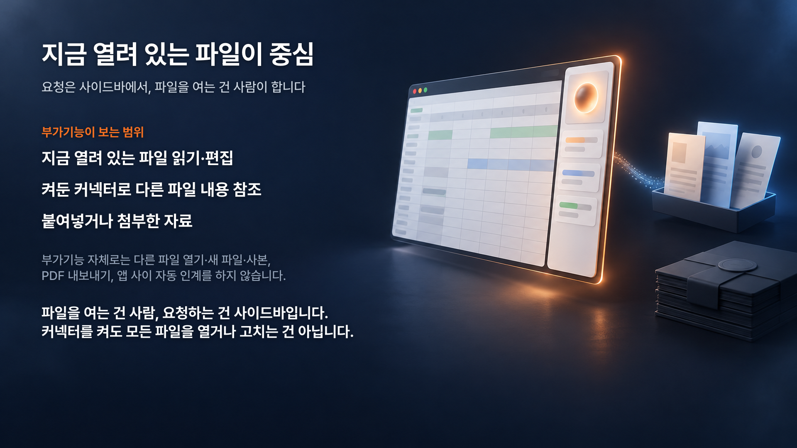
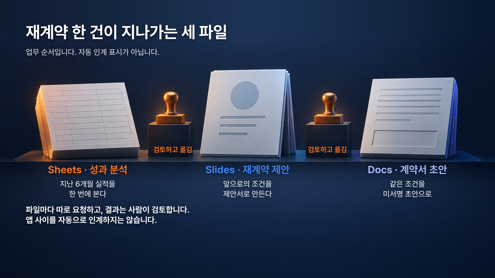
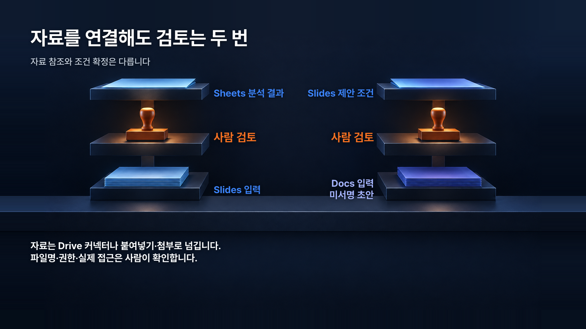

# 제미나이만 되는 줄 알았는데? 구글에도 클로드가 들어왔습니다!


이 가이드는 Google Docs·Sheets·Slides 안에서 Claude를 열어, 광고 성과 분석부터 제안서, 계약서 초안까지 한 흐름으로 따라 해보는 문서입니다. 공개된 실습 자료를 각자 사본으로 만들어 그대로 따라 하면 됩니다.

실습 배경은 가상 광고 대행사 **라인폴드 마케팅 스튜디오(LINEFOLD)** 가 가상 고객사 **모노리프 리빙**의 재계약을 준비하는 상황입니다. 실제 회사나 거래가 아니고, 회사명·기간·금액은 전부 예시입니다.

**차례**: 설치 → Claude가 볼 수 있는 자료의 범위 → 실습 자료 사본 만들기 → 메인 실습 3개 → 추가 실습 6개 → 결과 확인 → 참고 자료

---

## 1. 설치하고 사이드바 열기

먼저 조건을 확인하세요. Claude 쪽은 Pro·Max·Team·Enterprise 플랜에서 베타로 제공됩니다. Google 쪽은 Marketplace 앱 설치가 허용된 계정이어야 합니다. 회사 계정이면 관리자가 설치를 허용하거나 대신 설치해야 할 수 있으니, 메뉴에 Claude가 안 보이면 관리자에게 요청하세요.

1. Marketplace에서 Claude를 설치합니다: https://workspace.google.com/marketplace/app/claude/12459801340 — 한 번 설치하면 Docs·Sheets·Slides 세 앱에서 모두 쓸 수 있습니다.
2. Google 권한 검토 화면이 뜨면 내용을 읽고 허용합니다.
3. 이미 열어둔 Docs·Sheets·Slides 탭이 있으면 새로고침하세요. 새로고침 전에는 메뉴에 안 나타납니다.
4. 상단 메뉴에서 **확장 프로그램(Extensions) > Claude > Open Claude**를 누릅니다.
5. 오른쪽 사이드바가 열리면 Claude 계정으로 로그인합니다. claude.ai에서 쓰는 그 계정입니다. 별도 API 키 설정 없이 Claude 계정으로 로그인하면 됩니다.

브라우저는 Chrome·Edge·Safari를 쓰세요. Firefox는 베타 기간에 지원되지 않습니다.

**편집 승인 방식을 먼저 확인하세요.** 기본값은 **Ask before edits**라서, Claude가 편집안을 만들어도 여러분이 Allow를 누르기 전까지 파일은 바뀌지 않습니다. 처음에는 이 기본값 그대로 두는 걸 권합니다. Accept all edits로 바꿔도 링크 삽입, 외부 이미지, 접근 권한과 관련된 작업은 승인을 건너뛸 수 없습니다. 잘못 반영됐으면 Undo(Ctrl/Cmd+Z)로 되돌리거나, 파일 > 버전 기록에서 이전 버전으로 돌아가세요.

작업 중에는 사이드바를 닫지 마세요. 닫으면 진행이 멈춥니다. Google이 한 번의 긴 작업 실행을 최대 6분으로 제한하므로, 큰 작업은 이 가이드처럼 단계를 나눠서 요청합니다.

---

## 2. Claude가 볼 수 있는 자료의 범위

Claude가 기본으로 보는 건 **지금 열려 있는 파일**과 그 안에서 **선택한 영역**입니다. 다른 브라우저 탭에 파일을 열어두기만 해서는 참고 자료로 전달되지 않습니다.

범위를 넓히려면 사이드바의 **+ 메뉴**에서 claude.ai에 설정해둔 커넥터를 켭니다. Google Drive 커넥터는 기본으로 꺼져 있습니다. 새 커넥터를 추가하는 건 claude.ai 설정에서 합니다.

Drive 커넥터를 켜면 "드라이브에 있는 02-renewal-brief를 참고해"처럼 파일명으로 자료를 가리킬 수 있습니다. 다만 세 가지가 동시에 맞아야 실제로 읽습니다. 커넥터가 켜져 있어야 하고, 그 파일에 여러분 계정의 접근 권한이 있어야 하고, Claude가 그 이름으로 파일을 실제로 찾아 읽을 수 있어야 합니다. 파일명을 말하는 것만으로 접근이 보장되지는 않습니다. 작업 요청 전에 필요한 참고 자료를 실제로 찾고 읽을 수 있는지 먼저 확인하세요. Claude가 못 찾는다고 하면 아래 B 경로로 넘어가세요.

자료를 넘기는 경로는 두 가지입니다.

- **A. Drive 커넥터**: 커넥터를 켜고 파일명이나 경로로 참조하게 합니다.
- **B. 첨부·붙여넣기**: 사이드바에 파일을 첨부하거나, 필요한 내용을 복사해서 요청문 아래에 붙여넣습니다.

한 가지는 분명히 구분하세요. 이 실습에서는 Drive 커넥터를 **참고 자료를 읽는 용도**로 씁니다. 커넥터 전체가 읽기 전용이라는 뜻은 아닙니다. 다만 자료를 연결했다고 다음 앱의 작업까지 자동으로 이어지는 것은 아닙니다. Sheets 분석이 끝났다고 Slides가 알아서 열리지 않습니다. 편집할 파일은 매번 사람이 직접 열고, 그 파일에서 사이드바를 다시 열어야 합니다.



---

## 3. 실습 자료 사본 만들기

실습 자료는 아래 공유 폴더에 있습니다. 누구나 무료로 볼 수 있는 보기 전용 폴더라서 원본은 수정할 수 없고, 각자 사본을 만들어 쓰면 됩니다.

**실습 자료 폴더**: [Google Drive에서 열기](https://drive.google.com/drive/folders/1h3i0DKaFVxLgn3hjWc1P8kfa-uB0nbna?usp=sharing)

폴더 링크를 저장하거나 '내 Drive에 바로가기 추가'를 해도 파일 사본은 생기지 않습니다. 폴더를 통째로 복사하는 대신, 아래 순서대로 파일을 하나씩 사본으로 만드세요.

1. **Google 계정으로 로그인**하세요. 로그인 상태에서만 사본을 만들 수 있습니다.
2. 내 Drive에 `Claude 실습` 같은 **개인 폴더를 하나 만들어주세요.** 사본은 모두 이 폴더에 모읍니다.
3. 공유 폴더에서 파일을 하나씩 열고 **파일 → 사본 만들기**를 누르세요. 이름과 저장 위치(2번 폴더)를 정하고 확인하면 됩니다. 메인 파일 6개를 모두 복사하면 편집할 파일과 참고 자료가 함께 준비됩니다.
4. 사본 이름은 아래 표의 원본 이름과 같게 맞추고, 자동으로 붙는 **'의 사본'은 지워주세요.** 새 실습 폴더 안에 두면 본인의 기존 파일과 섞이지 않으니, 기존 파일을 덮어쓰거나 지울 필요는 없습니다.
5. 실습은 원본 창이 아니라 **내 Drive의 사본에서** 진행합니다. 사본을 열고 Claude 사이드바를 여세요. 원본에 편집 권한을 요청할 필요는 없습니다. 사본 이름을 다르게 지었다면 요청문의 파일명도 같이 바꿔주세요. Drive 커넥터가 공유 원본과 사본을 헷갈리지 않도록, 요청할 때 "내 Drive의 `Claude 실습` 폴더에 있는 사본"이라고 알려주세요. 그래도 파일을 못 읽으면 내용을 붙여넣거나 첨부해서 진행하면 됩니다.

사본 만들기가 회색으로 보이면 먼저 로그인 상태를 확인하세요. 로그인해도 막히면 복사가 허용된 파일인지 확인이 필요합니다. 공유 파일은 이미 Google Docs·Sheets·Slides 형식이라 Office 파일을 내려받아 다시 올리거나 변환하는 과정은 필요 없습니다.

| 파일 | 형식 | 역할 |
|---|---|---|
| `01-ad-performance` | Google Sheets | 광고 성과 분석 시트 |
| `02-renewal-brief` | Google Docs | 재계약 브리프 |
| `03-deck-starter` | Google Slides | 제안서 시작 파일 |
| `04-contract-template` | Google Docs | 계약서 양식 (미서명 실습용) |
| `05-proposed-budget` | Google Sheets | 제안 예산표 |
| `brand-guidelines` | Google Docs | 가상 브랜드 기준 |
| `appendix/` | 폴더 | 추가 실습 파일 (A1~A6, 차트 데이터·참고 메모) |

**광고 시트 구성.** `01-ad-performance`에는 `원본_광고성과`, `사용안내`, `캠페인_정의`, `운영메모` 탭 외에 `성과분석`, `정제_광고성과`, `제안요약`, `데이터점검`, `슬라이드용_핵심값` 같은 분석 예시 탭도 들어 있습니다. 분석 대상은 `원본_광고성과` 하나이고, 나머지는 열 설명과 캠페인 역할, 결과 예시를 담은 참고 탭입니다. 실습할 때는 예시 탭을 참고만 하고, `원본_광고성과` 기준으로 새 탭을 만들어 달라고 요청하세요. 작업은 사본에서만 하고 공유 원본의 탭은 건드리지 마세요. 열은 크게 세 묶음입니다.

- **식별**: 레코드ID, 날짜, 월, 분기
- **대상**: 고객사, 채널, 캠페인ID, 캠페인명, 목적, 소재유형, 상품군
- **실적**: 노출수, 클릭수, 매체비_원, 구매수, 신규구매수, 귀속매출_원, 환불_원, 순귀속매출_원, 그리고 상태·메모

**본인 자료로 응용하기 (선택).** 먼저 샘플 사본으로 끝까지 한 번 실습하세요. 그다음 본인 자료로 해보고 싶으면 모든 열을 똑같이 만들 필요는 없습니다. **ID, 날짜, 채널, 캠페인, 광고비, 매출, 환불이나 취소 상태**처럼 비교에 필요한 열부터 준비하세요. 구매수처럼 지표 계산에 필요한 열이 없으면 그 지표는 제외하거나 자료를 보완해야 합니다. 본인 시트의 실제 열 이름을 확인하고, 요청문의 열 이름을 거기에 맞춰 바꾸세요. 손댈 곳은 회사명(라인폴드·모노리프 리빙), 파일명, 비교 기간(4~6월 대 7~9월), 금액·수수료율, 역할(대행사·고객사)입니다. 샘플로 실습할 때는 요청문을 그대로 쓰면 되고 기간도 바꿀 필요 없습니다.

아래에는 영상의 요청문을 그대로 실었습니다. 샘플 사본으로 따라 할 때는 복사해서 그대로 쓰고, 본인 자료로 바꿀 때만 위 항목들을 여러분 상황에 맞게 고치세요.

---

## 4. 메인 실습: 분석 → 제안서 → 계약서 초안



순서는 Sheets에서 성과를 정리하고, Slides에서 제안서를 만들고, 사람이 조건을 확정한 뒤, Docs에서 계약서 초안을 만드는 겁니다. 각 단계마다 파일을 직접 열고 사이드바를 새로 엽니다.

### 4-1. Sheets: 광고 성과 분석

내 Drive에 만든 `01-ad-performance` 사본을 Google Sheets로 열고 사이드바를 엽니다. Drive 커넥터를 켰다면 02 브리프를 참조할 수 있는지 먼저 확인하고, 안 되면 브리프 내용을 요청문 아래에 붙여넣으세요.

샘플 사본으로 실습할 때는 요청문의 비교 기간 "4~6월 대 7~9월"을 그대로 사용하세요. 본인 데이터로 응용할 때만 해당 기간으로 바꿉니다. 요청 뒤 아래 기준으로 결과를 확인하세요. 원문에 세부 기준이 없는 항목은 필요한 내용을 덧붙여 요청하면 됩니다.

- 원본 탭은 그대로 두고 **별도 탭**에 집계를 만듭니다.
- 중복 레코드, 취소·환불 상태, 비용이 아직 확정되지 않은 행을 어떻게 처리했는지 적게 합니다.
- 캠페인마다 목적이 다르니(인지·전환 등) 한 줄로 등수를 매기지 않습니다.
- **ROAS는 이익률이 아닙니다.** 광고비에 비해 얼마의 매출이 잡혔는지를 보는 비율이라, 마진을 모르면 수익성 판단은 못 합니다.

시트가 Connected Sheets(BigQuery 연결)라면 Claude가 직접 다루지 못하니, 값을 일반 시트로 복사해서 쓰세요.

<!-- prompt:MAIN-SHEETS -->
```text
이 시트의 광고 성과를 분석해서 모노리프 리빙의 재계약 검토를 도와줘. 드라이브에서 02-renewal-brief 재계약 브리프와 해당 시트의 사용안내·운영메모를 참고해.
원본은 유지하고 별도 탭에 정리·분석해줘. 4~6월과 7~9월, 채널·캠페인별 성과를 비교해 유지할 것과 개선할 것을 제안해줘. 집계 오류나 판단에 영향을 줄 데이터 문제도 확인해줘.
핵심 표·차트와 함께, 다음 제안서에 붙일 짧은 요약을 남겨줘. 확인된 사실, 해석, 권장 행동은 구분하고 수치는 검산해줘.
```
<!-- /prompt:MAIN-SHEETS -->

**만들어졌다고 바로 넘어가면 안 됩니다.** 집계 탭의 셀을 눌러 수식이 원본 탭의 어느 열을 참조하는지 보세요. 숫자가 멀쩡해 보여도 다른 열을 참조했을 수 있습니다. 피벗 테이블이나 SUMIFS로 한두 채널만 따로 집계해서 Claude 결과와 맞춰보세요. 환불 처리와 기간 경계(월말 포함 여부)도 같은 기준으로 계산했는지 확인합니다.

여기서 한 번 멈춥니다. 분석 결과를 사람이 읽고 "이대로 제안의 근거로 써도 되는지" 결정한 뒤에 다음으로 갑니다. 그리고 제안서가 나온 뒤에도 한 번 더 멈춥니다. 금액·기간·수수료 같은 **제안 조건은 사람이 확정**하고, 그 확정된 조건으로 계약서 초안을 만듭니다. 자료를 연결해도 검토는 두 번입니다. 자료는 Drive 커넥터나 붙여넣기·첨부로 넘기지만, 파일명·권한·실제 접근은 사람이 확인합니다.



### 4-2. Slides: 제안서 초안

내 Drive에 만든 `03-deck-starter` 사본을 Google Slides로 열고 사이드바를 엽니다. 검토를 마친 01 분석, 02 브리프, 05 예산, 브랜드 가이드를 Drive로 읽을 수 있는지 확인하세요. 하나라도 못 읽으면 검토 요약(채널별 핵심 수치 몇 줄, 제안 예산, 브랜드 규칙)을 요청문 아래에 붙여넣습니다.

이 단계의 산출물은 **제안서 초안까지**입니다. 고객에게 보내거나 공유 링크를 여는 건 직접 검토한 뒤 결정하세요. 브랜드 가이드의 색·글꼴·숫자 단위가 반영됐는지, **과거 실적과 미래 제안이 구분되는지**, 장표 수치가 검토한 분석과 같은지 확인하세요.

<!-- prompt:MAIN-SLIDES -->
```text
드라이브에서 01-ad-performance의 광고 성과 분석을 바탕으로 모노리프 리빙에 보낼 재계약 제안서를 이 슬라이드에 만들어줘. brand-guidelines 브랜드 가이드에 맞춰 디자인하고 02-renewal-brief 재계약 브리프· 05-proposed-budget 제안 예산표를 참고해.
성과와 개선점, 다음 운영안, 제안 예산·범위·일정이 자연스럽게 이어지도록 6~8장으로 구성해줘. 시작 템플릿의 안내 문구는 제안 내용으로 바꿔줘. 구성과 시각화는 적절히 판단해줘.
과거 실적과 미래 제안을 구분하고, 매체비·수수료·부가세를 따로 보여줘. 없는 성과나 조건은 만들지 말고, 편집 가능한 텍스트와 한글 가독성·겹침까지 확인해줘.
```
<!-- /prompt:MAIN-SLIDES -->

장표의 숫자는 하나씩 분석 탭과 대조하세요. 특히 Claude가 Slides에 만들어 넣은 **차트는 이미지**입니다. 나중에 원본 숫자가 바뀌면 자동으로 따라가지 않으니, 그때는 차트를 다시 만들어 달라고 요청해야 합니다.

### 4-3. Docs: 계약서 초안

제안서를 보고 사람이 조건을 확정합니다. 제안서의 금액과 05 예산이 다르면 **어느 쪽이 맞는지 먼저 정하세요.** Claude에게 고르게 하지 않습니다.

내 Drive에 만든 `04-contract-template` 사본을 Google Docs로 열고 사이드바를 엽니다. 확정한 제안 조건을 요청문 아래에 붙여넣고, 02 브리프와 05 예산을 참조할 수 있는지 확인합니다. 요청 전후로 아래 항목을 확인하세요.

- 미서명 **초안**임을 문서 상단에 남깁니다.
- 양식에 있던 조항은 지우거나 고쳐 쓰지 않고, 중괄호 자리만 채웁니다.
- 자료에 없는 정보는 지어내지 않고 `[확인 필요]`로 표시합니다.
- 계약 시작일이 작성일보다 앞서면 소급 적용 여부를 사람이 확인합니다.

이 단계도 **초안 생성까지**입니다. 전송·서명은 별도로 사람이 확인합니다. Claude가 만든 초안은 법률 검토를 거친 문서가 아니니, 그렇게 취급하지 마세요. 참고로 Docs에서 Claude는 기존 댓글을 읽거나 해결하지 못하고, 이미 걸려 있는 제안 모드 수정도 수락하지 못합니다. 양식에 댓글이 남아 있다면 사람이 먼저 정리하세요.

<!-- prompt:MAIN-DOCS -->
```text
이 계약서 템플릿의 {{중괄호}} 부분을 드라이브의 02-renewal-brief 재계약 브리프·05-proposed-budget 제안예산표와 함께 붙인 제안 조건으로 채워줘. 제안서와 예산표가 다르면 먼저 차이를 알려줘.
매체비·수수료·부가세·기간·업무 범위를 정확히 반영하고, 없는 정보는 [확인 필요]로 남겨줘. 중괄호 밖의 조항과 표·번호 형식은 바꾸지 마.
제안 기준의 미서명 초안으로 유지하고, 채운 값과 남은 확인사항을 마지막에 짧게 알려줘. 
```
<!-- /prompt:MAIN-DOCS -->

끝나면 Ctrl/Cmd+F로 `{{`를 검색해 남은 자리를 찾고, 자료가 없는 항목은 임의로 채우지 말고 `[확인 필요]`로 남았는지 보세요. 금액은 05 예산과, 기간은 브리프와 한 번 더 맞춥니다.

---

## 5. 추가 실습 6가지

추가 실습 파일은 공유 폴더의 `appendix` 폴더에 있습니다. A1~A6 파일을 각각 열어 **파일 → 사본 만들기**로 내 실습 폴더에 복사한 뒤 사용하세요. A5 브랜드 가이드 실습은 메인 폴더의 `brand-guidelines` 사본을 쓰고, A6 차트 실습은 `appendix`에 있는 차트 데이터 Google Sheets 사본도 함께 준비하세요.

### A1. Sheets: 날짜·금액 정리

**입력** `A1-date-money-cleanup` 사본 — 기록ID, `2026-07-01`·`7/1`·`7월 1일`이 섞인 날짜 열, `1,200,000원`·`120만`처럼 문자가 섞인 금액 열이 있는 시트.
**요청** 행 수를 그대로 유지하고, 애매한 값은 추측하지 말고 표시만 하게 합니다.
**확인** 정리 전후 행 수가 같은지, 표시된 셀을 사람이 하나씩 판단했는지.

<!-- prompt:APP-S-DATES -->
```text
이 시트의 날짜와 금액 형식을 정리해줘. 원본은 남기고 새 탭에 날짜는 YYYY-MM-DD, 금액은 계산 가능한 원 단위 숫자로 통일해줘. 기록ID와 행 수를 유지하고, 해석이 모호한 값은 추측하지 말고 알려줘.
```
<!-- /prompt:APP-S-DATES -->

### A2. Sheets: 수식 점검

**입력** `A2-formula-audit` 사본 — 합계, ROAS, 조회 수식이 들어 있는 시트.
**요청** 참조 범위가 데이터 끝까지 닿는지, 수식이 있어야 할 자리에 값을 직접 입력한 셀이 있는지 찾게 하고, 원본 금액 셀은 바꾸지 않게 합니다.
**확인** 지적된 셀을 직접 눌러 범위를 보세요. 고친 수식이 원본 열을 덮어쓰지 않았는지.

<!-- prompt:APP-S-FORMULA -->
```text
이 파일의 합계·ROAS·조회 수식이 맞는지 점검해줘. 계산 범위가 빠진 곳이나 수식 대신 직접 입력한 값이 있는지도 살펴보고, 원본 금액은 바꾸지 않은 채 필요한 수식을 고쳐줘. 무엇을 왜 바꿨는지와 검산 결과를 짧게 정리해줘.
```
<!-- /prompt:APP-S-FORMULA -->

### A3. Docs: 정의 안 된 계약 용어

**입력** `A3-undefined-term` 사본 — "본 서비스", "정산일"처럼 쓰이지만 정의 조항이 없는 용어가 있는 계약 문서.
**요청** 원문은 고치지 말고, 정의가 빠진 용어와 그에 대한 확인 질문만 뽑게 합니다.
**확인** 결과는 법률 적합성 판정이 아닙니다. 어떤 용어를 변호사나 상대방에게 물어볼지 정리하는 용도로만 쓰세요.

<!-- prompt:APP-D-TERMS -->
```text
이 문서에서 사용했지만 정의하지 않은 용어를 찾아줘. 원문은 수정하지 말고 해당 문장과 담당자에게 확인할 질문을 짧게 알려줘. 
```
<!-- /prompt:APP-D-TERMS -->

### A4. Docs: 회의 메모 정리

**입력** `A4-meeting-notes` 사본 — 담당자·할 일·기한이 뒤섞인 회의 메모.
**요청** 담당자, 할 일, 기한을 표로 정리하고 정해지지 않은 건 `[확인 필요]`로 두게 합니다. 캘린더 일정이나 메시지를 실제로 만들지는 않습니다.
**확인** 메모에 없는 기한이 생겨나지 않았는지. 확인 필요한 항목은 사람이 확인한 뒤 채웁니다.

<!-- prompt:APP-D-MEETING -->
```text
이 회의록 아래에 담당자·할 일·기한 표를 만들어줘. 결정된 내용을 기준으로 정리하고, 담당자나 날짜가 정해지지 않은 항목은 [확인 필요]로 남겨줘. 회의록 원문은 유지하고 일정 등록이나 메시지 발송은 하지 마.
```
<!-- /prompt:APP-D-MEETING -->

### A5. Slides: 빽빽한 슬라이드 나누기

**입력** `A5-dense-slide` 사본 — 한 장에 글머리 열 줄 넘게 들어간 슬라이드 + 브랜드 가이드.
**요청** 내용과 수치를 빠뜨리지 않고 두 장으로 나누되, 브랜드 색·글꼴을 따르게 합니다.
**확인** 원래 장표의 내용과 숫자가 나눈 두 장에도 빠짐없이 남았는지 보세요. 숫자가 반올림되거나 단위가 바뀌지 않았는지.

<!-- prompt:APP-L-RESTYLE -->
```text
이 슬라이드는 글이 너무 많아. 내용과 숫자는 유지하면서 읽기 좋은 두 장으로 나누고 제목 표현도 통일해줘. 첨부한 브랜드 가이드를 따르되 레이아웃은 적절히 판단하고, 한글이 넘치거나 겹치지 않는지 확인해줘.
```
<!-- /prompt:APP-L-RESTYLE -->

### A6. Slides: 데이터로 차트 만들기

**입력** `A6-chart-slide` 사본과 `A6-chart-data` 사본 — `appendix`의 Google Slides와 Google Sheets 파일입니다. 데이터 시트에는 채널명과 월 제안 매체비 표가 있습니다.
**요청** Drive 커넥터로 `A6-chart-data` 사본을 참조할 수 있는지 먼저 확인하고, 못 읽으면 표를 붙여넣습니다. 그 데이터로 차트를 만들게 합니다.
**확인** 차트의 값 몇 개를 데이터 시트와 맞춰보세요. Claude가 만든 차트는 이미지라서 데이터 시트를 바꿔도 자동으로 갱신되지 않습니다. 데이터가 바뀌면 다시 요청하세요.

<!-- prompt:APP-L-CHART -->
```text
이 슬라이드와 드라이브에 있는 A6-chart-data 의 월 제안 매체비를 비교하는 막대 차트를 추가해줘. 현재 덱의 색상과 스타일을 따르고, 채널명·금액 단위·합계가 쉽게 읽히게 해줘. 이 차트가 이미지라면 수치가 자동 연동되지 않는다는 짧은 주석을 넣어줘.
```
<!-- /prompt:APP-L-CHART -->

---

## 6. 결과 확인

파일별로 꼭 볼 것만 적습니다.

- **Sheets** 원본 탭이 그대로인지. 집계 셀의 수식이 어느 열을 참조하는지. 환불·취소 처리와 기간 경계. 직접 집계한 한두 채널과 일치하는지.
- **Slides** 장표 숫자와 분석 탭의 일치. 과거 실적과 미래 제안이 섞이지 않았는지. 차트 이미지가 최신 데이터인지.
- **Docs** `{{`나 `[확인 필요]`로 남은 항목을 확인했는지. 없는 정보를 임의로 채우지 않았는지. 금액·기간이 확정 조건과 같은지. "초안" 표시가 남아 있는지.

뭔가 이상하면 Undo나 버전 기록으로 돌아간 뒤, 요청문을 더 작게 쪼개서 다시 시도하세요.

---

## 7. 참고 자료

기능·지원 조건은 2026-10-09 공식 도움말 기준입니다.

- 설치: https://workspace.google.com/marketplace/app/claude/12459801340
- 공식 도움말 (Docs·Sheets·Slides에서 Claude 사용): https://support.claude.com/en/articles/16951679-use-claude-in-google-docs-sheets-and-slides
- Google Workspace 커넥터: https://support.claude.com/en/articles/10166901-use-google-workspace-connectors
