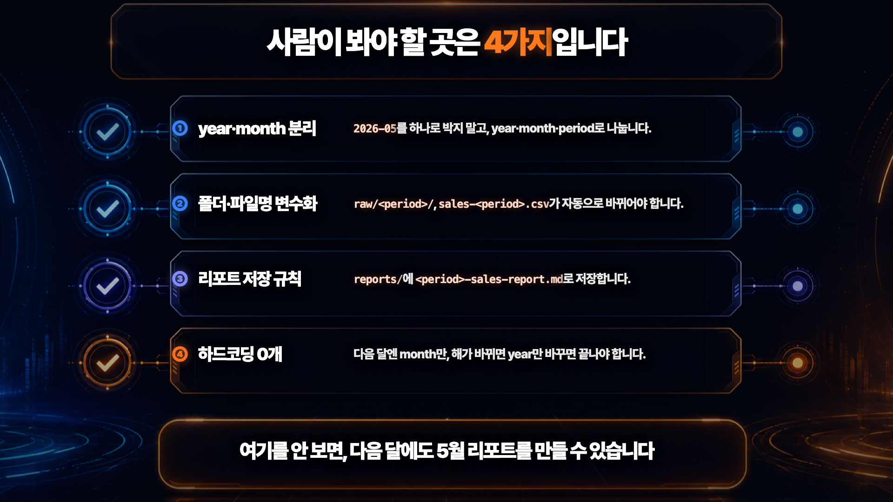
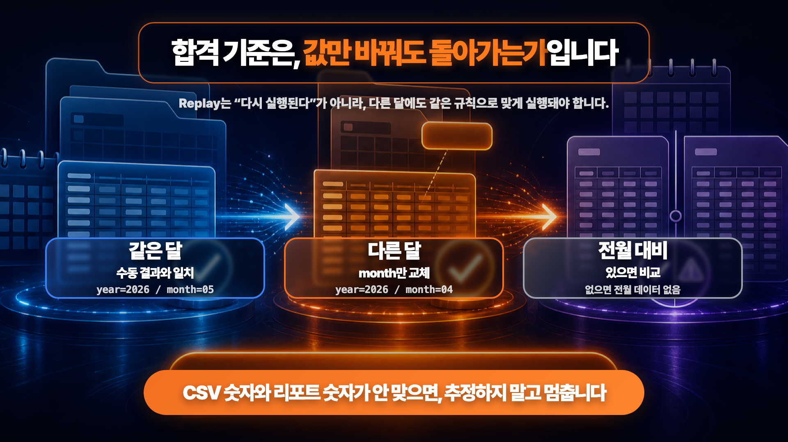

# 반복 업무, 말로 설명하지 말고 '한 번 보여주세요' — Codex Record & Replay로 클릭 업무를 재사용 스킬로 만드는 법


웹에서 직접 클릭해서 진행해야 하는 반복 업무, 자동화하기 어려우셨죠? 공식 API나 MCP가 없는 서비스라면 AI한테 일일이 시키는 것도 느리고 번거롭습니다. 코덱스(Codex)의 **Record & Replay**는 반대로, 화면에서 작업을 딱 **한 번 보여주기만 하면** 그걸 다시 쓸 수 있는 **스킬(skill)**로 만들어 줍니다. 매달 같은 사이트에서 리포트를 받아 정리하거나, 폼을 제출하거나, 무언가를 업로드하는 일을 반복하시는 분이라면 특히 유용합니다.

이 가이드는 영상에서 다룬 두 가지 실습을 **그대로 따라 할 수 있게** 정리한 문서입니다. ① 매달 매출 대시보드에서 CSV를 내려받아 폴더를 정리하고 월간 리포트를 만드는 일, ② 미리 써둔 글을 네이버 블로그 에디터에 옮겨 **임시저장까지만** 하는 일. 아래 프롬프트는 영상에서 쓴 문구 **그대로** 복사해 쓰실 수 있습니다. 핵심은 "버튼 한 번에 완전 자동화"가 아니라 **"한 번 보여주고, 사람이 변수화·검수해서 재사용"**입니다.

> ⚠️ **먼저 알아두세요.** Record & Replay는 **macOS 버전 코덱스에서만** 동작하고 **Computer Use**가 켜져 있어야 합니다. 2026년 6월 18일 코덱스 앱 업데이트(버전 26.616)로 막 들어온 기능이라, 메뉴·화면·가용 조건은 빠르게 바뀔 수 있습니다. 따라 하기 전에 **코덱스 앱을 최신으로 업데이트하고 [공식 문서](https://developers.openai.com/codex/record-and-replay)를 한 번 확인**해 주세요.

| 이 가이드가 해결하는 것 | 내용 |
|---|---|
| 어떤 문제를 푸나 | 클릭이 많아 자동화하기 어렵던 반복 업무 (API·MCP 없는 웹 작업) |
| 어떻게 푸나 | 화면에서 **한 번 시연 → 재사용 스킬**로. 글로 안 적고 보여준다 |
| 누구를 위한 가이드인가 | 매달·매주 같은 사이트·시트에서 받아 정리·제출·업로드를 반복하는 1인 사업가·프리랜서·작은 회사 |
| 무엇을 만들어 보나 | ① 월간 매출 리포트 자동화 ② 네이버 블로그 초안 자동화(임시저장까지만) |
| 코딩이 필요한가 | 아니요. 평소 하던 클릭을 천천히 보여주고, 코덱스가 만든 초안을 사람이 검수만 |

---

## 목차

- [1. 개념 — Record & Replay는 신입사원 OJT다](#1-개념--record--replay는-신입사원-ojt다)
- [2. 글로 시키기 vs 보여주고 시키기](#2-글로-시키기-vs-보여주고-시키기)
- [3. 사전 준비 — macOS · Computer Use · 플러그인](#3-사전-준비--macos--computer-use--플러그인)
- [4. 전체 흐름 4단계](#4-전체-흐름-4단계)
- [5. 시나리오 1 — 월간 매출 리포트 자동화](#5-시나리오-1--월간-매출-리포트-자동화)
- [6. 시나리오 2 — 네이버 블로그 초안 (임시저장까지만)](#6-시나리오-2--네이버-블로그-초안-임시저장까지만)
- [7. 자주 묻는 질문 (FAQ)](#7-자주-묻는-질문-faq)
- [8. 참고 자료](#8-참고-자료)

---

## 1. 개념 — Record & Replay는 신입사원 OJT다

Record & Replay를 한 줄로 풀면, **신입 직원한테 일을 가르치는 방식**과 똑같습니다. 매뉴얼을 글로 길게 써서 주는 게 아니라, "내 옆에 앉아서 한 번 봐. 이렇게 하는 거야" 하고 직접 시연해 보이는 **OJT(현장교육)**입니다. 코덱스가 그 신입이라고 생각하시면 됩니다. 제가 화면에서 한 번 하는 걸 보고, "아, 이 일은 이렇게 하는 거구나" 하고 자기가 알아서 매뉴얼을 만드는 거예요.

그 매뉴얼을 코덱스는 **skill**이라고 부릅니다. 한 번 녹화하면 코덱스가 **언제 쓰는지 / 입력값은 뭔지 / 순서는 어떻게 되는지 / 끝나고 뭘 확인해야 하는지**까지 적은 초안을 자동으로 만들어 줍니다.


| 코덱스 용어 | 사무실 비유 | 한 줄 설명 |
|---|---|---|
| 녹화(Record) | 신입 옆에서 직접 시연 | 화면에서 평소 하던 작업을 한 번 보여준다 |
| skill | 신입이 받아 적은 업무 매뉴얼 | 언제·무슨 입력값으로·어떤 순서로·뭘 검증할지 담긴 초안 |
| 변수화·검수 | 신입 메모에 피드백 주기 | 날짜·폴더·파일명 같은 값을 변수로 빼고 사람이 확인 |
| Replay | 다음 달부터 그 매뉴얼대로 | 값만 바꿔 다시 실행 — 30초짜리 시연이 매달 쓰는 매뉴얼이 된다 |

> 💡 **여기가 가장 중요합니다.** 코덱스가 만들어 준 이 초안은 **80점짜리**예요. 나머지 20점은 사람이 채웁니다. 코덱스는 제 시연만 보고 만든 거라, 실제로 쓸 때 고려해야할 변수들을 제대로 반영하지 못할 수 있습니다. 그래서 **변수화와 검증은 사람 몫**입니다.

---

## 2. 글로 시키기 vs 보여주고 시키기

반복 업무를 자동화하는 길은 크게 두 가지입니다. 지난 영상에서 다룬 **클로드 코드의 `/loop`**은 "글로" 시키는 방식이었고, 오늘 Record & Replay는 "보여주고" 시키는 방식입니다. 둘은 경쟁 관계가 아니라, **업무 성격에 따라 갈아 쓰는 도구**입니다.

| 구분 | ① 글로 시키기 — Claude Code `/loop` (지난 영상) | ② 보여주고 시키기 — Codex Record & Replay (오늘) |
|---|---|---|
| 반복을 정의하는 법 | 텍스트·규칙·프로세스로 적는다 | 화면에서 한 번 시연한다 |
| 입력 방식 | 키보드로 적는다 | 마우스로 보여준다 |
| 잘 맞는 사람 | 코드·프롬프트에 강한 분 | 클릭이 많은 GUI 업무를 하는 분 |
| 잘 맞는 업무 | 시트 행 처리, 메일 초안 등 규칙으로 적기 쉬운 일 | 대시보드 조회·다운로드·업로드 등 말로 적기 번거로운 일 |


> 📌 한 줄 정리: **말로 적기 어려운 화면 업무는 보여주는 쪽이 빠릅니다.** 마우스 클릭이 많은 업무를 자동화해야 하는 비개발자분들에게 Record & Replay가 더 잘 맞습니다.

---

## 3. 사전 준비 — macOS · Computer Use · 플러그인

따라 하시려면 환경 세팅이 필요합니다. 아래 표의 조건을 먼저 확인하세요. (모든 값은 [공식 문서](https://developers.openai.com/codex/record-and-replay)·[체인지로그](https://developers.openai.com/codex/changelog) 기준이며, 신기능이라 **영상 시점에 한 번 더 확인**하시길 권합니다.)

| 준비물 | 내용 |
|---|---|
| 운영체제 | **공식 문서 기준 macOS 전용.** 다른 OS는 영상/사용 시점에 공식 문서에서 별도 지원 여부 확인 |
| 코덱스 앱 | 2026-06-18 앱 버전 **26.616**부터 Record & Replay 추가. 최신으로 업데이트 후 사용. |
| Computer Use | **켜져 있고 사용 가능해야** 동작합니다. AI가 화면을 직접 보고 마우스·키보드를 대신 움직이는 기능이라, 처음 켤 때 macOS의 **화면 접근·손쉬운 사용 권한 팝업**을 미리 허용해 두세요. |
| 지역 | 초기 출시에서 **EEA(유럽경제지역)·영국·스위스 제외**. **한국은 제외 대상이 아니라 사용 가능**합니다. |
| 데모용 사이트 | 자동화하고 싶은 **본인 사이트**. (영상은 가상의 '구씨컴퍼니' 매출 대시보드를 더미 데이터로 띄워 사용 — 내 컴퓨터에서만 도는 `http://localhost:8765/dashboard.html`) |

**설치(진입) 경로** — 순서대로 따라오세요:

- 코덱스 앱에서 **Plugins**(플러그인) 메뉴 열기
- 메뉴의 **＋** 버튼 누르기
- **Record a skill**(스킬 녹화하기) 선택 → 여기서 시작

---

## 4. 전체 흐름 4단계

실습은 크게 네 단계로 돕니다. **하나, 한 번 녹화한다. 둘, 코덱스가 만든 초안을 사람이 다듬는다. 셋, 같은 달(5월)로 다시 돌려본다. 넷, 다른 달(4월)로 바꿔서도 되는지 본다.**

| 단계 | 무엇을 | 누가 | 핵심 포인트 |
|---|---|---|---|
| 1. 녹화 | 화면에서 작업을 한 번 시연 | 사람 | **녹화 전에 목표·변수값을 먼저 말해준다** |
| 2. 초안 검수 | 코덱스가 만든 skill 초안을 변수화·수정 | 사람 (제일 중요) | 70점 초안을 100점으로 — 하드코딩을 변수로 |
| 3. 같은 달 재현 | `year=2026 / month=05`로 Replay | 코덱스 → 사람 확인 | 수동으로 한 결과와 숫자가 맞는지 대조 |
| 4. 다른 달 교체 | `month`만 `04`로 바꿔 Replay | 코덱스 → 사람 확인 | **값 하나만 바꿔도** 그 달에 맞게 도는가 |

> 💡 새 스레드에서 "생성된 skill을 써줘"라고 요청하고 이번엔 **다른 값**(기간·파일 등)을 주는 것이 Replay입니다. 녹화 한 번, 사람이 변수 검수 한 번, 그다음부터는 스킬로 간단히 재실행합니다.

---

## 5. 시나리오 1 — 월간 매출 리포트 자동화

매달 1일이나 매주 월요일 아침에 하는 그 일 있죠. 대시보드 들어가서 지난달로 기간 바꾸고, CSV 한 번 내려받고, 파일명 규칙대로 바꿔서 폴더에 옮기고, "이번 달 얼마 팔렸나" 리포트로 정리하는 일. 어렵진 않은데 매번 똑같이 반복돼서 더 하기 싫은 업무입니다.

**폴더 구조와 용어**를 먼저 잡고 갑니다. `2026-05`처럼 "연도-월"로 된 값을 **period**라고 부르고, 이건 **연도(year)와 월(month) 두 조각으로 쪼개집니다.** 이 구분이 검수의 핵심입니다.

| 용어 | 값 예시(5월) | 규칙 |
|---|---|---|
| `year` (연도) | `2026` | 해가 바뀌면 이것만 변경 |
| `month` (월) | `05` | 매달 이것만 변경 (두 자리) |
| `period` (연-월) | `2026-05` | `year-month`로 **자동 결정** |
| `raw_folder` (원본) | `9c/raw/2026-05/` | `raw/<period>/` — 받은 CSV 원본 보관 |
| `filename` (원본 파일명) | `sales-2026-05.csv` | `sales-<period>.csv` |
| `reports_folder` (리포트) | `9c/reports/` | 월간 리포트 저장 위치 |
| `report_filename` (리포트 파일명) | `2026-05-sales-report.md` | `<period>-sales-report.md` |

### 5-1. 녹화 전에 '목표'부터 말해준다

녹화 버튼을 누르기 직전에, 코덱스한테 "이제 뭘 보여줄 건지" 목표와 값을 먼저 말해주는 게 좋습니다. 백지 신입에게 "일단 봐" 하는 것과 "지금부터 지난달 매출 정리하는 거 보여줄게" 하고 시작하는 건 결과가 다르니까요. 아래를 그대로 적어줍니다.

```text
지금부터 내가 화면에서 반복 업무를 한 번 시연할게.
길게 설명 안 할 테니, 내 행동을 보고 그대로 다시 할 수 있는 skill로 만들어줘.

[목표] 매출 대시보드(테스트용 더미 데이터)에서 "선택한 달" 매출을 내려받아
→ 정해진 폴더로 옮기고 → 월간 매출 리포트(markdown)를 만든다.

[이번 녹화의 변수값]
- year(연도): 2026
- month(월): 05            ← 지난달
- period(연-월): 2026-05    (= year-month, 자동으로 정해짐)
- raw_folder(원본 폴더): 9c/raw/2026-05/
- filename(원본 파일명): sales-2026-05.csv
- reports_folder(리포트 폴더): 9c/reports/
- report_filename(리포트 파일명): 2026-05-sales-report.md

[꼭 지킬 것]
- year(2026)랑 month(05)는 다음에 다른 값으로 바꿀 거야. 고정값이 아니라 "변수"로 인식해줘.
- period·폴더·파일명은 전부 year와 month에서 자동으로 정해지게 해줘.
```

> 💡 `year`와 `month`가 변수라고 미리 못 박아두는 이 두 줄이, 나중에 검수 부담을 확 줄여 줍니다.

### 5-2. 실제로 녹화한다 — 천천히, 또박또박

녹화를 켜고 평소 하던 그대로 하되, **너무 빨리 하지 말고 한 동작씩 또렷하게** 합니다. 마우스로 클릭할 데를 분명하게 짚어 주세요. 휙 지나가면 코덱스가 "어디를 누른 거지?" 하고 헷갈립니다.

- 대시보드에서 기간 필터를 **"월" 단위**로 바꾼다
- **2026년 5월**을 선택하고 조회 → 화면이 5월 데이터로 바뀌는지 확인
- **CSV 다운로드** 버튼을 누른다
- 받은 파일을 Finder에서 `9c/raw/2026-05/` 폴더로 옮기고 이름을 `sales-2026-05.csv`로 통일
- `reports/` 폴더를 한 번 열어 "여기에 리포트를 만들 거야" 위치만 보여준 뒤 녹화 중지

> 💡 방금 한 작업, 한 30초쯤 걸렸죠? 손으로 하면 5분 걸리는 일입니다. 그런데 이 30초가 **이제 매달 재사용되는 매뉴얼**이 된다는 게 핵심입니다.

### 5-3. 코덱스가 만든 초안을 사람이 검수한다

녹화를 멈추면 코덱스가 화면을 분석해 skill 초안을 만들어 줍니다. 이 초안을 그대로 믿지 말고, 아래 프롬프트로 **같이 다듬자**고 요청합니다.

```text
방금 녹화로 만든 skill 초안을 같이 다듬자. 아래 기준으로 수정해줘.

[변수화 — 실행할 때마다 바뀌는 값]
- year: 대상 연도 (예: 2026)
- month: 대상 월, 두 자리 (예: 05)
- period: year-month로 자동 결정 (예: 2026-05)
- raw_folder: raw/<period>/   (없으면 폴더 생성)
- filename: sales-<period>.csv
- reports_folder: reports/
- report_filename: <period>-sales-report.md
→ 초안에 "2026-05"·"2026"·"05"가 하드코딩돼 있으면
   각각 period·year·month 변수로 전부 교체. 고정값을 남기지 마.

[다운로드 다음에 이어서 할 일]
1. raw_folder의 CSV를 읽어 총매출/주문수/객단가/상품별/채널별로 집계.
2. 리포트 템플릿을 채워 reports_folder에 저장.
3. 전월 리포트가 있으면 "전월 대비"를 계산, 없으면 "전월 데이터 없음"으로 표기.

[검증 — 실행 후 스스로 확인]
- CSV 행 수 / 총매출 합계가 리포트 숫자와 일치하는가
- 숫자를 못 읽거나 칸이 비면 추정하지 말고 "확인 필요"로 표시
```

사람이 눈으로 봐야 하는 검수 포인트는 딱 네 군데입니다. 코덱스가 "월 필터·폴더 경로·파일명 세 군데에 연도·월이 고정돼 있었는데 `year`·`month` 변수로 교체했습니다" 하고 바뀐 지점을 요약해 주는데, 이 요약을 **사람이 눈으로 확인하는 것까지가 검수**입니다.



| # | 검수 포인트 | 무엇을 확인하나 |
|---|---|---|
| ① | `year`·`month` 변수화 | 초안에 박힌 `2026`·`05`·`2026-05`를 각각 `year`·`month`·`period`로 교체했는가 |
| ② | 폴더·파일명 규칙 | `raw_folder`, `filename`이 `period`에 따라 자동으로 바뀌는가 |
| ③ | 리포트 위치 | `reports_folder`, `report_filename`도 `period` 기준인가 |
| ④ | 하드코딩 0개 | 다음 달엔 `month`만, 해 넘어가면 `year`까지만 바꾸면 끝나는가 |

> 📌 검증 규칙 한 줄을 꼭 넣으세요: **"숫자를 못 읽으면 추정하지 말고 `확인 필요`로 표시해."** AI가 빈칸을 그럴듯하게 지어내는 것보다, "이건 확신 못 합니다"라고 표시하는 게 매출 데이터에선 훨씬 안전합니다.

### 5-4. 다시 돌려본다 — `month`만 04로

검수했으면 진짜 되는지 봐야죠. 이번엔 **`month`만 04로 바꿔서** 돌립니다.

```text
같은 "월간 매출 리포트 정리" skill을 이번엔 month만 바꿔서 실행해줘.
- year: 2026
- month: 04
```

제가 바꾼 건 `month` 한 줄, `05`를 `04`로 바꾼 것뿐입니다. `year`는 `2026` 그대로 뒀고요. 그런데 코덱스가 알아서 4월을 선택하고, 4월 폴더에 넣고, 4월 리포트를 만듭니다. **값 하나 바꿨는데 전체가 그 달에 맞춰 도는 것** — 여기가 진짜 합격 지점입니다. 참고로 해가 바뀌면 `year`만 `2027`로 바꾸면 됩니다. 그래서 연도와 월을 따로 빼둔 거예요.



**합격 기준**과 **더미 데이터 검산값**(교육용 샘플 수치):

| 테스트 | 입력 | 합격 기준 |
|---|---|---|
| 같은 달 재현 | `year=2026 / month=05` | 수동으로 한 결과와 숫자가 일치 |
| 다른 달 교체 | `year=2026 / month=04` | `month`만 바꿔도 4월로 정확히 실행 |
| 전월 대비 | — | 전월 리포트가 있으면 비교, 없으면 `전월 데이터 없음` |

| 검산 항목 | 2026-05 (5월) | 2026-04 (4월) |
|---|---|---|
| 행 수 | 15행 | 12행 |
| 총매출 | 1,869,000원 | 975,000원 |
| 객단가(AOV) | 약 124,600원 | 약 81,250원 |
| 전월 대비 | 4월 대비 약 **+91.7%** | **전월 데이터 없음** (3월 리포트 없음) |

> 📌 비교(전월 대비)는 **전월 파일이 있을 때만 계산하고, 없으면 "없다"고 말하는 것**이 핵심입니다. 4월의 전월은 3월인데 샘플에 3월 리포트가 없으니 "전월 데이터 없음"이 정상이고, 나중에 5월 리포트를 갱신하면 방금 만든 4월을 전월로 잡아 "약 +91.7%"가 채워집니다. 위 수치는 전부 **교육용 더미 데이터**이며 실제 시장·고객 데이터가 아닙니다.

---

## 6. 시나리오 2 — 네이버 블로그 초안 (임시저장까지만)

Record & Replay가 매출 리포트 전용이 아니라 **클릭 많은 업무 전반**에 쓰인다는 걸 보여주는 두 번째 예시입니다. 미리 써둔 markdown 글(이것도 더미 글)을 네이버 블로그 글쓰기 에디터로 옮겨 **임시저장(초안 저장)까지만** 하는 작업입니다. **공개 발행은 하지 않습니다.** 구조는 시나리오 1과 똑같습니다 — 녹화 → 초안 검수 → 다른 글로 Replay.

### 6-1. 목표·위험선을 먼저 박고 녹화 요청

매출 때처럼, 그냥 "skill 만들어줘"가 아니라 **목표와 위험선을 먼저 박아서** 요청합니다.

```text
"네이버 블로그 초안 올리기" 작업을, 그대로 다시 할 수 있는 skill 초안으로 만들어줘. 아래 목표대로 진행할 예정이고, 녹화 진행하고 스킬 생성해줘.

[목표]
미리 써둔 markdown 글을 네이버 블로그 글쓰기 에디터로 옮겨서
임시저장, 그러니까 초안 저장까지만 한다.
공개 발행은 하지 않는다.

[이번 녹화의 입력값]
- markdown_file: 본문이 담긴 markdown 파일 경로
- title: markdown 글의 제목
- category: 지정한 블로그 카테고리
- tags: 태그 목록
- draft_only: true        ← 항상 임시저장까지만

[꼭 지킬 것 — 위험선]
- markdown의 제목·문단·목록을 네이버 에디터 형식으로 옮긴다.
- "발행" 버튼이나 "공개" 버튼은 절대 누르지 않는다.
- draft_only가 true면 무슨 일이 있어도 공개 발행하지 않는다.
- 임시저장 버튼을 누른 뒤 멈춘다.
- 네이버 블로그 업로드위해 이미 크롬에 로그인된 세션을 활용해서 초안 저장해줘.

[검증 — 끝나고 스스로 확인]
- 임시저장된 글의 제목·본문·카테고리·태그가 입력과 일치하는가
- 글이 "임시저장됨" 상태인가
- 공개 발행된 글이 아닌가
- 서식이 깨지거나 본문이 유실되면, 추정하지 말고 "확인 필요"로 표시
```

> ⚠️ 이 프롬프트에서 가장 중요한 건 하나입니다. **처음부터 "임시저장까지만" 하라고 못 박는 것.** 공개 발행은 아예 작업 범위에 넣지 않습니다.

### 6-2. 초안을 변수로 다듬는다

그다음은 매출 때와 똑같이, **글마다 바뀌는 값**을 변수로 빼줍니다.

```text
방금 녹화로 만든 "네이버 블로그 초안 올리기" skill을 같이 다듬자.

[변수화 — 글마다 바뀌는 값]
- title: 글 제목
- markdown_file: 본문이 담긴 markdown 파일 경로
- category: 블로그 카테고리
- tags: 태그 목록
- draft_only: true        ← 항상 임시저장까지만
- cover_image: 있으면 대표 이미지 경로 (없으면 건너뜀)

[변환 규칙]
- markdown의 제목/문단/목록을 네이버 에디터 형식으로 옮긴다.
- "발행" 버튼은 절대 누르지 않는다. 임시저장에서 멈춘다.

[검증 — 실행 후 스스로 확인]
- 임시저장된 글의 제목·본문·카테고리·태그가 입력과 일치하는가
- 에디터에서 서식이 깨져 본문이 유실되면 추정하지 말고 "확인 필요"로 표시
```

매출 리포트 때와 구조가 똑같습니다. 글마다 바뀌는 `title`·본문 파일·`category`·`tags`를 변수로 빼고, **"발행 버튼은 절대 누르지 마, 임시저장까지만"**을 규칙으로 박았습니다. 그리고 똑같이, 에디터에서 서식이 깨져 본문이 날아가면 추정하지 말고 `확인 필요`로 표시하라고 했습니다.

진짜 skill이 됐는지는 매출 때와 똑같이 **다른 글로 한 번 더 Replay**해 보면 압니다. 새 markdown 글 경로를 주면서 네이버 블로그 초안 저장을 요청하면, 임시저장 글 목록에 초안이 하나 더 늘어납니다.

---

## 7. 자주 묻는 질문 (FAQ)

### Q1. 윈도우에서도 되나요?

공식 문서 기준 Record & Replay는 **macOS 버전 코덱스에서만** 동작하고, **Computer Use**가 켜져 있어야 합니다. Windows 등 다른 OS 지원 여부는 사용 시점에 공식 문서에서 다시 확인해 주세요.

### Q2. 한국에서 쓸 수 있나요?

네. 초기 출시에서 **EEA(유럽경제지역)·영국·스위스는 제외**됐지만, **한국은 제외 대상이 아니라 사용 가능**합니다. 다만 가용성은 변동될 수 있으니, 영상 시점에 코덱스 앱을 최신으로 업데이트하고 한 번 확인하시길 권합니다.

### Q3. 코덱스가 만든 스킬을 그대로 믿어도 되나요?

아니요. 자동 생성된 초안은 **80점**입니다. 코덱스는 제 시연만 보고 만든 거라, 날짜·폴더·파일명 같은 값이 그대로 박혀(하드코딩) 있을 수 있습니다. **변수화와 숫자 검산은 사람 몫**이에요. 그래서 "이 두 줄이 변수다"라고 미리 못 박고, 끝나고 "초안의 어디를 변수로 바꿨는지" 요약을 눈으로 확인하는 검수 단계를 꼭 거칩니다.

### Q4. 매번 처음부터 다시 녹화해야 하나요?

아니요. **녹화는 한 번만** 하면 됩니다. 검수해서 변수화해 두면, 다음 달부터는 새 스레드에서 "그 스킬을 써줘. 이번엔 `month`만 04로" 처럼 **값만 바꿔 Replay**하면 됩니다. 5월에 한 30초짜리 시연이 6월에도, 7월에도, 내년에도 쓰는 매뉴얼이 됩니다.

---

## 8. 참고 자료

| 자료 | 링크 |
|---|---|
| Codex Record & Replay 공식 문서 | https://developers.openai.com/codex/record-and-replay |
| Codex 업데이트(체인지로그) | https://developers.openai.com/codex/changelog |

> 이 가이드는 시민개발자 구씨(@citizendev9c) 영상의 상세 설명 자료입니다. Record & Replay는 신기능이라 메뉴·화면·가용 조건이 업데이트로 바뀔 수 있으니, 공식 문서를 함께 확인해 주세요.

---

**시민개발자 구씨** | 비개발자도 따라 할 수 있는 AI 자동화 시스템을 만듭니다. 여러분은 어떤 반복 업무를 코덱스에 가장 먼저 "보여주고" 싶으신가요? 댓글로 남겨주세요!
