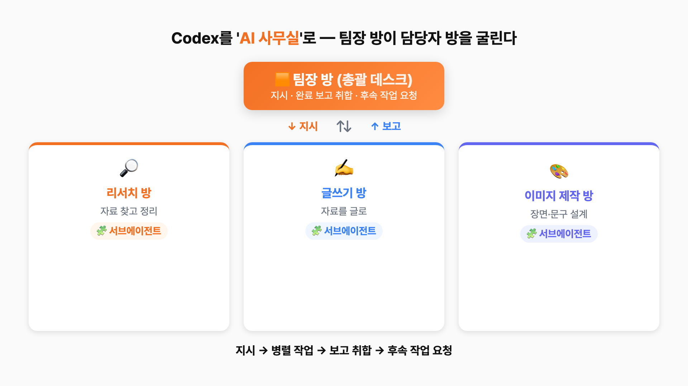
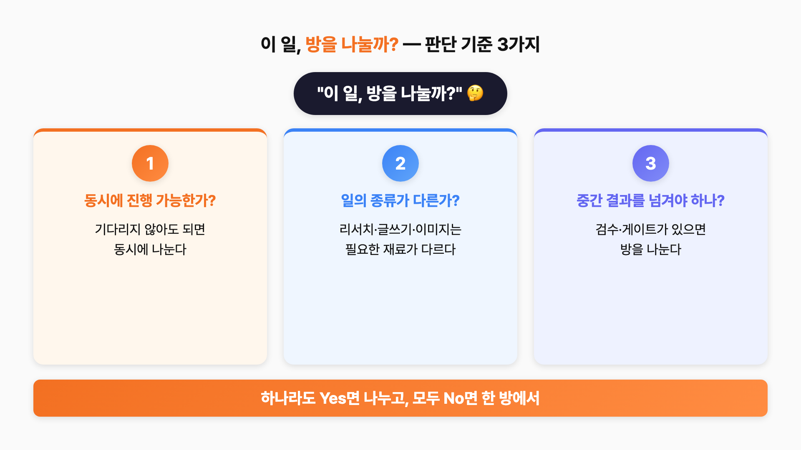
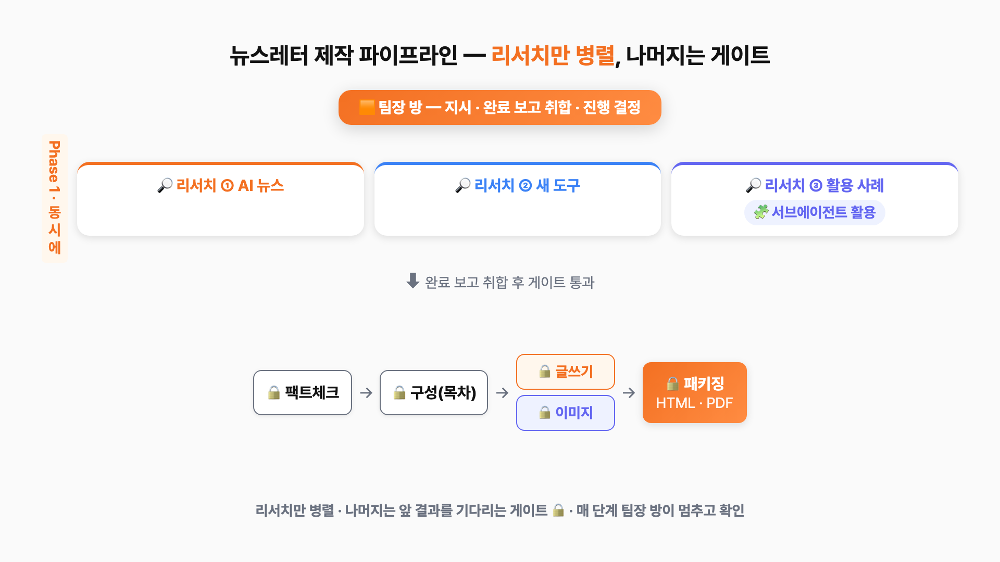
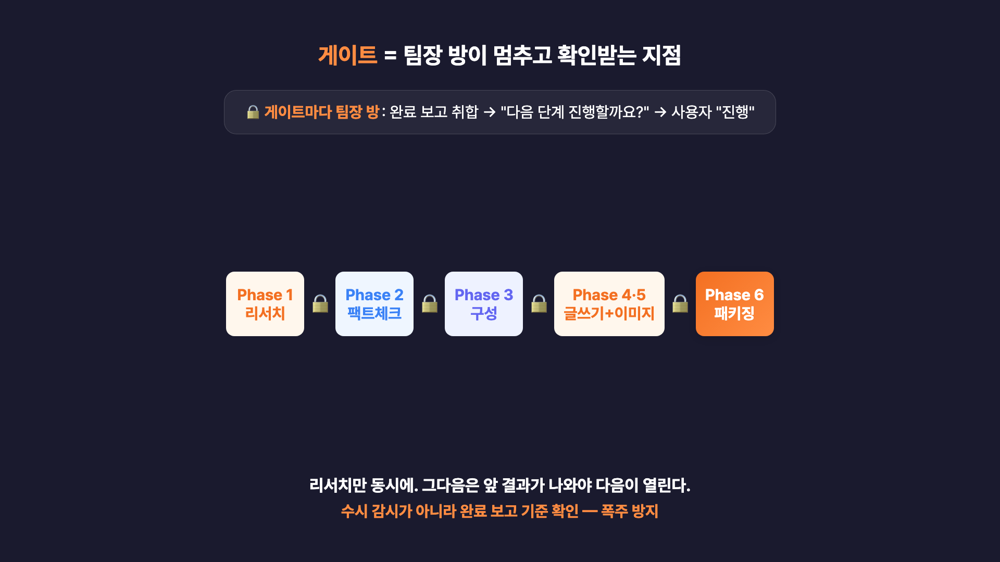

# 코덱스로 'AI 사무실' 차리기 — 팀장 방 하나로 담당자 방을 굴리는 운영법


코덱스(Codex)나 ChatGPT 채팅 하나에 리서치·글쓰기·검토를 다 몰아넣다 보면, 대화가 길어질수록 느려지고 맥락이 섞입니다. 이 가이드는 코덱스를 **코딩 도구가 아니라 '팀장'이 따로 있는 AI 조직**처럼 쓰는 법을 정리합니다. 한 방에 다 시키는 대신 업무를 **담당자 방(스레드)으로 나누고**, 팀장 방이 **지시 → 동시에 작업 → 완료 보고 취합 → 후속 작업 요청**으로 굴립니다.

영상에서는 공개용 예시로 **'비개발자를 위한 AI 트렌드 뉴스레터'** 한 편을 만들며, 이 운영 흐름을 비개발자도 그대로 따라 할 수 있게 보여줍니다. 아래 프롬프트는 영상에서 쓴 문구 **그대로** 복사해 쓸 수 있습니다.

> ⚠️ 코덱스의 화면·메뉴·기능(스레드 자동 생성, 서브에이전트, 백그라운드 세션 등)과 산출물 패키징 방식(HTML/PDF 등)은 **플랜과 버전에 따라 다를 수 있습니다.** 최신 버전에서 직접 확인하며 따라와 주세요.

| 이 가이드가 해결하는 것 | 내용 |
|---|---|
| 어떤 문제를 푸나 | 한 채팅에 다 시켜서 느리고 맥락이 섞이는 문제 |
| 어떻게 푸나 | 업무를 '담당자 방(스레드)'으로 나누고 '팀장 방'이 총괄 |
| 누구를 위한 가이드인가 | 혼자/소수로 리서치·콘텐츠·영업·보고를 다 굴리는 1인 사업가·프리랜서·작은 회사 |
| 무엇을 만들어 보나 | 공개용 예시: 'AI 트렌드 뉴스레터' 1회분 (자료조사→사실확인→목차→글→이미지→패키징) |
| 코딩이 필요한가 | 아니요. 새 업무방을 만들고 한국어 지시문을 붙여넣는 것부터 시작 |

---

## 목차

- [1. 개념 — 코덱스를 'AI 사무실'로 보기](#1-개념--코덱스를-ai-사무실로-보기)
- [2. 한 업무방 vs 서브에이전트 vs 팀장 방](#2-한-업무방-vs-서브에이전트-vs-팀장-방)
- [3. 방을 나눌까? 판단 기준 3가지](#3-방을-나눌까-판단-기준-3가지)
- [4. 사전 준비](#4-사전-준비)
- [5. 실습 — 'AI 트렌드 뉴스레터' 한 편 만들기](#5-실습--ai-트렌드-뉴스레터-한-편-만들기)
- [6. 매주 반복이면 — AGENTS.md로 저장](#6-매주-반복이면--agentsmd로-저장)
- [7. 한계 / 주의사항](#7-한계--주의사항)
- [8. 참고 자료](#8-참고-자료)

---

## 1. 개념 — 코덱스를 'AI 사무실'로 보기

핵심은 딱 하나, **층을 나눠서 일을 시키는 것**입니다. 맨 위에 팀장 방(총괄 데스크)이 있고, 그 아래 실제로 일하는 **담당자 방**들이 있습니다. 팀장 방은 직접 일하지 않고 지시·보고 취합·진행 결정만 합니다.



용어가 낯설어도 사무실 말로 바꾸면 쉽습니다.

| 코덱스 용어 | 사무실 비유 | 한 줄 설명 |
|---|---|---|
| thread(스레드) | 팀장 방 / 담당자 방 | 각 방은 자기 대화 맥락을 따로 유지하며 맡은 일을 처리한다 |
| 병렬 작업 | 담당자 여러 명 동시 근무 | 서로 안 기다려도 되는 일은 같이 시작 |
| 서브에이전트 | 방 안의 보조 일꾼 | 한 방의 일이 무거우면 더 작게 쪼개 처리 |
| 백그라운드 세션 | 오래 걸리는 일 따로 돌리기 | 시간이 걸리는 방은 뒤에서 진행 |
| 완료 보고 취합 | 보고 모으기 | 업무가 끝난 내용을 모은다 |

> 💡 전체 흐름은 한 바퀴입니다: **지시 → 병렬 작업 → 보고 취합 → 후속 작업 요청.**

---

## 2. 한 업무방 vs 서브에이전트 vs 팀장 방

비슷해 보이지만 결이 다릅니다. 짧은 일은 한 방으로 충분하지만, 길어지고 역할이 갈리는 일은 팀장 방 구조가 안정적입니다.

| 구분 | (A) 한 업무방에 다 넣기 | (B) 서브에이전트만 병렬 | (C) 팀장 방 + 담당자 방 |
|---|---|---|---|
| 비유 | 한 사람이 한 책상에서 전부 | 한 작업을 잘게 쪼개 동시에 뿌리고 끝 | 팀장이 담당자 방을 지시·취합·후속 |
| 맥락 | 길어지면 다 섞임 | 각자 격리되나 합치는 건 결국 나 | 작업은 방별 격리 + 총괄은 팀장 방 한 곳 |
| 지속성 | 한 스레드에 의존 | 보통 한 번 쓰고 끝(일회성 분업) | 방이 남아 이어가고 고정·보관 |
| 적합 상황 | 짧은 단일 작업 | 한 작업의 단발 병렬 처리 | 여러 업무를 지속 운영하는 1인/소수 |

> 📌 (C)의 핵심은 **'격리'(맥락 안 섞임)와 '한눈에 보기'(팀장 방 한 곳)를 동시에** 얻는다는 점입니다.

---

## 3. 방을 나눌까? 판단 기준 3가지

무조건 방을 여러 개 켜는 게 잘하는 게 아닙니다. **짧고 단순한 일은 한 방이 제일 빠릅니다.** 나누는 기준은 "방 수"가 아니라 "맥락을 나눌 가치가 있나"입니다.



| 기준 | 질문 | 나누면 좋은 이유 |
|---|---|---|
| 1. 병렬성 | 동시에 돌릴 수 있나? | 서로 안 기다려도 되는 일은 같이 시작 |
| 2. 역할 분리 | 역할·판단 기준이 다른가? | 초안 쓰는 방과 검증하는 방은 기준이 다름 |
| 3. 재사용 | 나중에 다시 이어갈 일인가? | 이어갈 일이면 방을 남겨 고정·보관 |

> 셋 중 **하나라도 Yes면 방을 나눌 가치가 있습니다.** 다 아니면 그냥 한 업무방에서 하세요.

---

## 4. 사전 준비

| 준비물 | 내용 |
|---|---|
| 코덱스 앱 | 데스크톱 앱 기준. 공식 안내: https://developers.openai.com/codex/app |
| 플랜·버전 확인 | 스레드·백그라운드·서브에이전트 동선은 플랜/버전마다 다를 수 있음 → 최신 버전에서 확인 |
| 코딩 지식 | 불필요. 새 업무방을 만들고 한국어 지시문을 붙여넣는 것부터 |
| 가장 중요한 것 | **역할을 먼저 정하는 것** — 이 방은 팀장, 이 방은 리서치 … |

> ⚠️ 외부 발송·결제 같은 위험 작업은 이 가이드의 데모 범위 밖입니다. 자동화하더라도 **사람이 확인하는 단계**를 꼭 두세요.

---

## 5. 실습 — 'AI 트렌드 뉴스레터' 한 편 만들기

뉴스레터로 예를 드는 이유는 콘텐츠 업무가 **여러 단계를 거치는 일**이기 때문입니다(자료조사→사실확인→목차→글→이미지→패키징). 블로그 글, 주간 리포트, 제안서도 구조가 같아서 그대로 갖다 쓸 수 있습니다.



### 5-1. 팀장 방 만들고 '메인 지시문' 한 번에 넣기 (코드 0줄)

새 업무방을 하나 열어 **팀장 방**으로 정합니다. 짧은 역할 문장만 주지 말고, 프로젝트 전체를 어떻게 굴릴지 적은 **메인 지시문**을 한 번에 넣습니다. 길어 보여도 그대로 복붙하면 됩니다.

```text
너는 이 프로젝트의 '팀장 방'(총괄 데스크)이야.
직접 리서치하거나 글을 쓰지 마. 일은 담당자 방에 나눠 맡기고, 너는 지시·보고 취합·다음 단계 진행 결정만 한다.

[프로젝트]
- 폴더: newsletter
- 결과물: "비개발자를 위한 AI 트렌드 뉴스레터" 1회분 (HTML, 가능하면 PDF도)
- 독자: 코딩 모르는 1인 사업가·프리랜서·작은 회사 대표
- 언어: 전부 한국어

[담당자 방(스레드) 구성 — 가능하면 네가 직접 방을 만들고 아래 이름을 붙여줘]
1) research-news   : 이번 주 AI 트렌드 뉴스
2) research-tools  : 비개발자가 쓸 만한 새 AI 도구·업데이트
3) research-cases  : 실제 활용 사례·적용 아이디어
4) factcheck       : 위 리서치 주장들의 사실 검증 (의심하는 검수자)
5) outline         : 뉴스레터 목차·섹션 구조
6) writing         : 확정된 목차로 본문 작성
7) image           : 섹션별 이미지·헤더 이미지 방향
8) packaging       : 최종 HTML 생성 (DESIGN.md 반영)

[진행 순서와 게이트 — 이게 제일 중요해]
- Phase 1 (병렬): research-news / research-tools / research-cases 세 방을 동시에 시작해. 서로 기다리지 마. 필요시 리서치 스레드 안에서 자율적으로 직접 서브에이전트를 추가로 활용해서 리서치를 진행해.
- Phase 2 (게이트): Phase 1 세 방의 완료 보고가 다 올라온 뒤에만 factcheck 시작.
- Phase 3 (게이트): factcheck 통과한 자료로만 outline 시작.
- Phase 4 (게이트): outline이 확정된 뒤 writing 시작.
- Phase 5 (게이트, writing과 병렬 가능): outline이 확정되면 image도 시작 가능(본문과 동시 진행).
- Phase 6 (게이트): writing 본문과 image가 둘 다 나온 뒤에만 packaging 시작.

[보고 규칙]
- 각 방은 '결론 먼저, 근거 나중' 순서로, 핵심 3줄 + 다음 단계 1줄로 보고.
- 각 방은 맡은 일이 끝났을 때 한 번만 보고해. 진행 중간 상태는 보고하지 마.
- 단, (1) 막혀서 더 못 갈 때, (2) 사실 판단이 필요할 때, (3) 사용자 확인이 필요할 때만 예외로 바로 알려줘.
- 작업물의 경우, artifacts로 md, png, pdf, html 등 적합한 형태로 생성하여 ~/output/ 에 저장
- 너(팀장 방)는 진행 중인 방을 수시로 열어보거나 "다 됐어?"라고 묻지 마. 각 방의 완료 보고가 올라오면, 그때 Phase 단위로 모아서 요약해.
- 다음 Phase로 넘어가기 전 의사결정이 필요한 사항이 있으면 알려줘.

[꼭 지킬 것 — 멈춤과 확인]
- 한 Phase가 끝나면 절대 바로 다음 Phase로 넘어가지 마.
- 순차적으로 진행해야하는 경우, 이전 phase 작업이 끝날때 까지 대기하고 진행해. 이전 세션 작업을 끝내라고 독촉하거나 진행 상황을 수시로 확인하지 마. 완료 보고가 오면 그때 움직여.
- 매 Phase 종료 시: (1) 그 Phase 결과를 요약 보고하고, (2) "다음 단계로 진행할까요?"라고 나에게 물어보고, (3) 내가 "진행"이라고 답하기 전에는 멈춰 있어.
- 사실이 불확실하면 지어내지 말고 '확인 필요'로 표시해.

준비됐으면 작업을 바로 시작하지 말고, 먼저 Phase 1 계획만 보여준 뒤 내 "진행" 신호를 기다려.
```

> 💡 이 한 덩어리 안에 **방 구성·이름, 무엇을 동시에 하고 무엇을 기다릴지, 언제 보고할지, 매 단계 멈추고 확인할지**가 다 들어 있습니다. 

### 5-2. Phase 1 — 리서치 방 3개를 '동시에' (첫 번째 병렬 구간)

자료 조사 세 갈래(뉴스·도구·사례)는 서로 안 기다려도 되니 동시에 돌립니다. 여기가 오늘 **가장 먼저 체감할 수 있는 병렬 구간**입니다.

| 담당자 방 | 맡는 일 |
|---|---|
| `research-news` | 이번 주 AI 트렌드 뉴스 |
| `research-tools` | 비개발자가 쓸 만한 새 도구·업데이트 |
| `research-cases` | 실제 활용 사례 (오래 걸리면 백그라운드로) |


### 5-3. 게이트 — 완료 보고를 받은 뒤에만 다음으로

리서치 다음부터는 앞 단계가 끝나야 다음이 시작됩니다. 이 "기다려야 하는 지점"이 **게이트(🔒)**입니다.



| Phase | 단계 | 시작 조건(게이트) | 병렬? |
|---|---|---|---|
| 1 | 리서치 (뉴스·도구·사례) | 바로 시작 | ✅ 병렬 |
| 2 | 팩트체크 | Phase 1 세 방 완료 보고 후 | — |
| 3 | 구성(목차) | 팩트체크 통과 자료로만 | — |
| 4 | 글쓰기 | 목차 확정 후 | — |
| 5 | 이미지 | 목차 확정 후(글쓰기와 동시 가능) | ✅ 병렬 |
| 6 | 패키징(HTML·PDF) | 글·이미지 둘 다 나온 뒤 | — |

> ⚠️ 이게 그냥 방을 여러 개 여는 것과 결정적으로 다른 점입니다. 단계마다 팀장 방이 **완료 보고를 받은 뒤에만 멈추고, 요약해서 "넘어갈까요?"를 묻습니다.** 사람이 한 번씩 확인하니, 자료가 틀렸는데 그대로 글까지 써버리는 사고를 막습니다. **체크는 게이트에서만** 하세요.

---

### 후속 작업 요청 (예시)

```text
초안 보니까 두 번째 섹션이 좀 약해.
research-tools 방 이어서, 비개발자가 바로 따라 할 수 있는 도구 사용 예시 2개만 더 구체적으로 보강해줘.
보강되면 writing 방 본문 2번 섹션에도 반영하고, 팀장 방으로 다시 요약 보고해줘.
```

---

## 6. 매주 반복이면 — AGENTS.md로 저장

매주 같은 뉴스레터를 만든다면, 위 긴 지시문을 매번 붙여넣는 대신 프로젝트 폴더(`newsletter/`) 루트에 `AGENTS.md`로 저장해두는 관례가 있습니다. 그러면 그 폴더에서 작업을 시작할 때 이 규칙을 참고하게 됩니다. 아래는 **영상 설명용 견본(sample)**이며, 실제 자동 준수 정도·동선은 플랜/버전에 따라 다를 수 있으니 사용 시점 화면에서 확인하세요.

```markdown
<!--
이 파일은 영상 설명용 '샘플' AGENTS.md 예시입니다.
실제 동작 중인 시스템 지시문이 아니라, "매주 반복되는 뉴스레터 워크플로를 AGENTS.md로 저장하면 이렇게 된다"를 보여주는 견본입니다.
실제로 쓰실 때는 프로젝트 폴더(newsletter/) 루트에 'AGENTS.md' 라는 이름으로 두시고, 본인 환경·도구에 맞게 고쳐 쓰세요.
가용 동선(스레드 자동 생성·서브에이전트·PDF 변환, 예외적 백그라운드 세션)은 플랜과 버전에 따라 다를 수 있으니 촬영/사용 시점 화면에서 확인이 필요합니다.
-->

# AGENTS.md — `newsletter` 프로젝트

> 이 폴더에서 작업을 시작하면 아래 규칙을 따른다.
> 한 줄 요약: **팀장 방이 담당자 방들을 지시하고, 진행 중엔 수시로 감시하지 않으며, 완료 보고가 올라왔을 때만 취합하고 멈춰 사용자 확인을 받는다.**

## 1. 프로젝트 목표
- "비개발자를 위한 AI 트렌드 뉴스레터" 1회분을 제작한다.
- 독자는 코딩을 모르는 1인 사업가·프리랜서·작은 회사 대표다.
- 모든 산출물과 대화는 한국어로 한다.

## 2. 최종 산출물
- `newsletter/YYYY-MM-DD-ai-trend-newsletter.html`  — 필수
- `newsletter/YYYY-MM-DD-ai-trend-newsletter.pdf`   — 환경에서 PDF 변환이 가능할 때만
- `newsletter/YYYY-MM-DD-sources.md`                — 출처 목록(링크 + 한 줄 메모)

## 3. 역할 구조 (방 / 스레드)
- **팀장 방(총괄 데스크)**: 직접 리서치·글쓰기를 하지 않는다. 지시 / 완료 보고 취합 / 다음 단계 진행 결정만 한다. 진행 중인 방을 수시로 열어보거나 독촉하지 않는다.
- **담당자 방(스레드)**:
  | 방 이름 | 역할 |
  |---|---|
  | `research-news`  | 이번 주 AI 트렌드 뉴스 |
  | `research-tools` | 비개발자용 새 AI 도구·업데이트 |
  | `research-cases` | 실제 활용 사례 |
  | `factcheck`      | 리서치 사실 검증 (의심하는 검수자) |
  | `outline`        | 목차·섹션 구조 설계 |
  | `writing`        | 본문 작성 |
  | `image`          | 섹션별·헤더 이미지 방향 |
  | `packaging`      | HTML(+가능하면 PDF) 패키징 |
- 방(스레드)을 자동으로 만들 수 없으면, 각 방에 붙여넣을 지시문을 대신 만들어 사용자에게 전달한다. 사용자가 방을 직접 만들어 붙여넣는다.
- 한 방의 일이 무거우면 더 작은 보조 작업(서브에이전트)으로 나눠 동시에 처리할 수 있다.

## 4. 페이즈 게이트 (순서와 병렬 규칙)
1. **Phase 1 (병렬)** — `research-news` / `research-tools` / `research-cases` 동시 시작. 서로 기다리지 않는다.
2. **Phase 2 (게이트)** — Phase 1 세 방의 완료 보고가 다 올라온 뒤에만 `factcheck`.
3. **Phase 3 (게이트)** — `factcheck`를 통과한 자료로만 `outline`.
4. **Phase 4 (게이트)** — `outline` 확정 후 `writing`.
5. **Phase 5 (게이트, `writing`과 병렬 가능)** — `outline`이 확정되면 `image`도 시작 가능(본문과 동시 진행).
6. **Phase 6 (게이트)** — `writing` 본문과 `image`가 둘 다 나온 뒤에만 `packaging`.

> 병렬은 Phase 1(리서치)과 Phase 4·5(글쓰기+이미지) 두 곳뿐이다. 나머지는 앞 단계 산출물을 기다리는 게이트다.

## 5. 멈춤·확인 규칙 (가장 중요)
- 한 Phase가 끝나면 다음 Phase로 **자동으로 넘어가지 않는다.**
- 매 Phase 종료 시: ① 완료 보고 취합 → ② "다음 단계로 진행할까요?" 질문 → ③ 사용자가 "진행"이라고 답하기 전까지 멈춘다.
- 작업을 시작하기 전, 먼저 그 Phase 계획만 보여주고 사용자 신호를 기다린다.

## 6. 보고 형식과 시점
- 모든 보고는 **'결론 먼저, 근거 나중'.**
- 각 방 보고: 핵심 3줄 + 다음 단계 1줄.
- **각 방은 맡은 일이 끝났을 때만 보고한다.** 진행 중간 상태는 보고하지 않는다.
- 단, ① 막혀서 진행 불가, ② 사실 판단이 필요, ③ 사용자 확인이 필요한 경우에만 예외로 즉시 보고한다.
- **팀장 방은 진행 중인 방을 수시로 들여다보거나 진행 상황을 묻지 않는다.** 각 방의 완료 보고가 올라온 뒤에만 Phase 단위로 모아 요약하고, 겹치는 내용은 합치고 충돌·미확인 항목은 따로 표시한다.

## 7. 품질·팩트체크 규칙
- 확인되지 않은 수치·주장은 **지어내지 않는다.** '확인 필요'로 표시한다.
- `factcheck`를 통과하지 못한 항목은 본문에서 빼거나 표현을 약하게 한다.
- 작성자(`writing`)와 검수자(`factcheck`)는 **다른 방으로 분리**한다.
- 과장 광고 톤 금지. 담백하고 신뢰감 있게 쓴다.
- 어려운 용어는 본문에서 한 번씩 풀어서 설명한다.

## 8. 파일 이름 규칙
- 날짜는 `YYYY-MM-DD`(제작일 기준).
- 모든 결과물은 `newsletter/` 폴더 안에 저장한다.
- 산출물 이름은 `ai-trend-newsletter.*`, 출처는 `sources.md`로 통일한다.

## 9. 하지 말 것 (금지)
- 사용자 확인 없이 외부로 메일·메시지를 **발송하지 않는다.**
- 결제·권한 변경 등 위험 작업을 임의로 하지 않는다.
- 팩트체크되지 않은 내용을 사실처럼 단정하지 않는다.
- 팀장 방이 직접 본문을 쓰지 않는다(담당자 방에 맡긴다).
- 한 Phase를 사용자 확인 없이 건너뛰지 않는다.
- 진행 중인 방을 수시로 폴링하지 않는다(완료 보고로만 취합).
```

---

## 7. 한계 / 주의사항

| 한계 / 함정 | 우회 / 완화 |
|---|---|
| "버튼 한 번에 전부 자동"이 아님 | 사람이 팀장 방에서 지시하고 단계마다 확인하는 구조로 이해 |
| 팀장 방이 방을 자동 생성 못 할 수 있음 | 방을 직접 만들고 6번 지시문을 붙여넣기 (결과 동일) |
| 화면·메뉴·기능이 플랜/버전마다 다름 | 최신 버전에서 직접 확인하며 진행 |
| 방을 너무 많이 켜면 관리 피로 | "맥락 나눌 가치" 기준 3가지로 판단, 핵심 방만 |
| 자동 결과를 그대로 믿으면 위험 | 게이트에서 사람이 검토, factcheck 방으로 사실 검증 |
| 외부 발송·민감정보 | 데모 범위 밖. 발송은 항상 사람 확인 단계 |

---

## 8. 참고 자료

| 자료 | 링크 |
|---|---|
| Codex 앱 공식 문서 | https://developers.openai.com/codex/app |
| Codex 앱 기능 문서 | https://developers.openai.com/codex/app/features |
| Codex 업데이트(체인지로그) | https://developers.openai.com/codex/changelog |

> 이 가이드는 시민개발자 구씨(@citizendev9c) 영상의 상세 설명 자료입니다. 코덱스의 기능·화면은 업데이트로 바뀔 수 있으니, 공식 문서를 함께 확인해 주세요.
