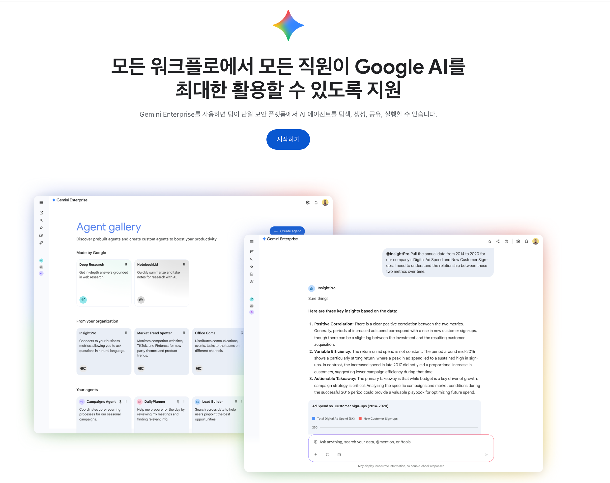

# Gemini Enterprise 활용 가이드


Google Gemini Enterprise는 조직 전체가 사용하는 AI 운영체제입니다. 개인용 Gemini가 파일을 하나씩 업로드하고 프롬프트를 입력하는 방식이라면, Enterprise는 회사 내부 데이터를 통합 연결하고 업무 특화 에이전트를 만들어 조직 차원의 생산성을 높이는 플랫폼입니다.

## 목차

- [Gemini Enterprise vs 일반 Gemini](#gemini-enterprise-vs-일반-gemini)
- [핵심 기능](#핵심-기능)
- [셋업 가이드](#셋업-가이드)
- [활용 사례: 교육 커리큘럼 기획 자동화](#활용-사례-교육-커리큘럼-기획-자동화)
- [에이전트 빌더 활용](#에이전트-빌더-활용)
- [도입 기준](#도입-기준)
- [현재 한계점](#현재-한계점)

---

## Gemini 서비스별 비교




| 구분 | **일반 Gemini** (개인용) | **워크스페이스 Gemini** | **Gemini Enterprise** (Cloud) |
|------|--------------------------|--------------------------|--------------------------------|
| 대표 계정 | 개인 Google 계정 | Google Workspace 계정 | Google Cloud/Workspace 조직 |
| 사용 위치 | gemini.google.com, 모바일 앱 | Gmail, Docs, Sheets, Slides, Chat, Meet, gemini.google.com | 별도 Gemini Enterprise 콘솔/포털 |
| 데이터 접근 | 업로드한 파일 + 일부 개인 드라이브 | 사용자가 권한 가진 Gmail/Drive/Calendar/Docs 등 | 조직 Workspace + BigQuery, 외부 SaaS(Slack, Salesforce, Jira 등) 통합 |
| 주 용도 | 개인용 챗봇, 간단 작업 보조 | 이메일·문서·회의 등 일상 업무 생산성 향상 | 사내 에이전트/포털 구축, 여러 시스템 묶은 업무 자동화 |
| 커스터마이징 | 프롬프트, 설정, 간단 템플릿 | 문서/메일 템플릿, 팀 단위 활용 | 노코드/코드 기반 에이전트 빌더, 커넥터/툴 조합 |
| 권한/관리 | 개인 계정 기준 | Workspace 관리 콘솔에서 사용 여부 제어 | 에이전트·커넥터·데이터 단위 중앙 거버넌스/감사 |
| 적합 대상 | 개인/프리랜서 | 소규모~중규모 팀 | 부서/전사 단위, 복수 시스템 운영 조직 |


## 핵심 기능

### 1. 데이터 스토어 연결
Google Workspace의 Drive, Gmail, Calendar, BigQuery 등 조직에서 활용하는 여러 데이터를 한 번에 연결하여 회사 내부 데이터를 AI가 참고할 수 있게 합니다. 매번 파일을 업로드할 필요 없이 "과거 교육 내역 찾아줘", "지난 달 미팅 메일 요약해줘" 같은 요청이 가능합니다.

### 2. 에이전트 빌더
코딩 없이 노코드로 업무 특화 AI 에이전트를 생성합니다. "커리큘럼 생성 에이전트", "견적서 작성 에이전트" 등 반복 업무를 자동화할 수 있습니다.

### 3. Actions
Google Calendar 일정 생성, Gmail 메일 전송 등의 작업을 AI가 직접 실행합니다. 프롬프트로 "다음 주 월요일 오전 10시에 미팅 잡아줘"라고 하면 실제로 캘린더에 일정이 추가됩니다.

### 4. 보안 및 권한 관리
누가 어떤 데이터에 접근하는지, 어떤 에이전트가 어떤 답변을 하는지를 중앙에서 통제할 수 있습니다.

---

## 셋업 가이드

### 사전 준비
- Google Cloud Platform(GCP) 계정
- Google Workspace 계정
- 관리자 권한

### 0단계: 앱 생성
1. [Google Cloud Console](https://console.cloud.google.com)에 접속
2. 검색창에 "Gemini Enterprise" 검색
3. Trial 버전으로 시작 (무료 테스트 가능)

### 1단계: Identity 활성화
Google Workspace 계정과 연동하는 작업입니다.
1. Identity 설정 메뉴로 이동
2. Google 계정 연결 (가장 간편)
3. Microsoft 클라우드 기반인 경우 다른 계정으로 연결 가능 (초기 셋업이 더 복잡함)

### 2단계: 데이터 스토어 연결
1. 데이터 스토어 설정 메뉴로 이동
2. 연결할 서비스 선택:
   - Google Drive
   - Google Calendar
   - Gmail
   - BigQuery, Cloud SQL 등 데이터베이스
   - NotebookLM Enterprise
3. 각 서비스별 권한 승인

> Salesforce, Slack은 현재 프리뷰로 제공 중이며 조만간 정식 지원 예정

### 3단계: Configuration 설정
세부 AI 기능을 설정합니다:
- Autocomplete: 자동 완성 기능
- Control: AI 응답 제어
- Assistant: 어시스턴트 설정
- Knowledge Graph: 지식 그래프 연결
- Feature Management: 기능별 활성화/비활성화

### 4단계: Actions 설정
AI가 직접 실행할 수 있는 작업을 연결합니다.

1. OAuth 셋업 (사전 필요)
   - [Google Actions 공식 문서](https://cloud.google.com/gemini/enterprise/docs/assistant-actions-google) 참고
2. Actions 설정 메뉴에서 액션 추가
3. "작업 사용 설정" 버튼 클릭
4. 권한 부여 완료

### 추가 설정 (선택)
- Settings > Appearance: 테마 선택, Homepage elements 설정
- Personalization: 이름, 직책, 산업 분야 등 개인화 설정

---

## 활용 사례: 교육 커리큘럼 기획 자동화

교육 컨설팅 회사 "구씨edu"가 제조기업 "구씨제조"를 대상으로 n8n 자동화 교육을 기획하는 시나리오입니다.

### STEP 1: 내부 데이터 기반 분석

**프롬프트 예시:**
```
'구씨제조' 관련 교육 설문응답 시트와 자동화니즈 문의 메일을 찾아서,
자동화와 교육 측면에서 이 회사가 겪는 주요 어려움을 각각 최대 5개 bullet으로 요약해줘.
```

Gemini Enterprise가 Drive, Gmail에서 관련 자료를 자동으로 찾아 분석합니다. 과거 엑셀 교육 피드백, RPA 교육 의견 등을 종합하여 이번 교육의 방향성을 제시합니다.

### STEP 2: 외부 리서치 (Deep Research)

**프롬프트 예시:**
```
'구씨제조'처럼 제조업 중소기업(SMB)을 대상으로 하는 'n8n 업무 자동화 기초 교육'에 
꼭 포함해야 할 내용을 리서치해줘. 각 주제별로 현장에서 적용하기 좋은 자동화 시나리오 예시도 같이 제안해줘.
```

Deep Research 기능으로 외부 자료를 검색하고, 제조업에서 자주 활용하는 자동화 시나리오를 파악합니다.

### STEP 3: NotebookLM으로 자료 종합

NotebookLM Enterprise에 리서치 보고서, 유튜브 영상 스크립트, 기존 커리큘럼 예시를 소스로 추가합니다.

**프롬프트 예시:**
```
업로드된 리서치 보고서, 기존 n8n 커리큘럼 문서, 유튜브 스크립트를 모두 참고해서,
'구씨제조용 2일 n8n 기초 교육'에 들어갈 핵심 주제를 Day1/Day2, 시간별로 나눠서 bullet 목록으로 정리해줘.
```

### STEP 4: 커리큘럼 생성

**프롬프트 예시:**
```
노트북lm '구씨제조 커리큘럼'과 Deep Research결과를 바탕으로 
구글 드라이브에 있는 '구씨edu_n8n_자동화_실전_2일_16시간_커리큘럼' 문서 포맷을 따라 
'구씨제조' 대상 상세 커리큘럼 초안을 구글 문서 형식으로 작성해줘.
```

**생성 결과 예시:**

**Day 1: n8n 자동화 기초**
- 9:00-10:00: n8n 소개 및 설치
- 10:00-12:00: 기본 노드 이해 (Webhook, Google Sheets, Gmail)
- 13:00-15:00: 실습 1 - 불량품 접수 폼 → 시트 → 알림
- 15:00-17:00: 실습 2 - 재고 요청 폼 → 담당자 메일

**Day 2: 실무 적용 및 PoC**
- 9:00-11:00: 조건 분기 및 승인 프로세스
- 11:00-13:00: 실습 3 - 출장 신청 자동화
- 14:00-17:00: 팀별 PoC 제작 및 발표

### STEP 5: Actions로 후속 작업 실행

**캘린더 일정 생성:**
```
다음 주 월요일 오전 10시~11시에 '구씨제조 n8n 교육 제안 미팅' 캘린더 일정을 만들어줘.
- 참석자: 9c@t2dnetwork.com, citizendev9c@gmail.com
- 설명: 교육 제안서/커리큘럼 검토 및 Q&A
```

**이메일 초안 작성:**
```
구씨제조 인사팀 담당자에게 보낼 n8n 자동화 기초 교육 제안 메일 초안을 작성해줘.
- 제목 후보 3개
- 본문 구조: 인사말 → 교육 요청에 대한 감사 → 교육 목적/배경 → 2일 커리큘럼 핵심 요약 → 기대 효과 → 제안 미팅 일정 안내 → 제안서/커리큘럼 링크 첨부 안내
- 톤: 격식은 갖추되 너무 딱딱하지 않은 비즈니스 메일
```

---

## 에이전트 빌더 활용

반복되는 업무는 에이전트로 만들어 자동화할 수 있습니다.

### 커리큘럼 생성 에이전트 예시

**에이전트 이름:** 교육 설계 보조 에이전트

**Instructions:**
```
당신은 '교육 설계 보조 에이전트'입니다.
입력: 고객사 기본 정보(회사명, 업종, 직원 수, 주요 직무), 교육 목표와 니즈 요약.
작업:
1) 고객사 정보와 니즈, 과거 교육 커리큘럼 문서와 NotebookLM 리서치 자료를 참고해서 
   n8n 또는 Make.com 기초 교육 커리큘럼 문서를 설계한다.
2) 구글 시트 '구씨edu_교육_상품_단가표'를 참고해서 적절한 시간·옵션을 선택하고 견적 총액을 계산한다.
3) 고객사 담당자에게 커리큘럼과 견적서가 담긴 문서를 보내기 위한 초안을 작성한다.
출력 형식:
- 섹션 A: 커리큘럼 문서
- 섹션 B: 견적서 문서
- 섹션 C: 이메일 초안
```

**연결 데이터:**
- Email 데이터 (고객사 정보와 니즈)
- Google Drive (과거 교육 커리큘럼)
- NotebookLM (리서치 보고서)

**Actions:**
- Gmail (제안 메일 전송)
- Calendar (미팅 일정 생성)

### 에이전트 테스트

**입력 예시:**
```
신규 고객사 정보를 전달할게.
- 회사명: 신라물류
- 업종: 물류/배송
- 직원 수: 약 200명
- 대상: 사무직 중심, 현장 관리자 일부 포함
- 희망 과정: n8n 기초 교육, 1일(총 8시간) 과정 희망
이 정보를 입력으로 사용해서, 커리큘럼, 견적서, 이메일 초안을 생성해줘.
```

에이전트가 물류업 특성에 맞는 시나리오(주문 접수 → 배송 알림, 재고 체크 → 발주 자동화 등)를 포함한 커리큘럼을 자동 생성합니다.

---

## 도입 기준

### Workspace + 일반 Gemini로 충분한 경우
- 1인 또는 소규모 팀
- 문서, 슬라이드, 메일, 시트 작업이 주 업무
- 제안서, 견적서, 강의안, 리포트 초안 생성이 주 용도
- 메일/회의 요약, 아이디어 브레인스토밍 정도만 필요
- 외부 SaaS 연동이 필요하다면 n8n/Make에서 Gemini API 호출이 더 유연함

### Gemini Enterprise 도입을 검토해야 하는 경우
- 직원 수십~수백 명 이상
- Google Workspace/MS 기반으로 데이터가 여러 시스템에 분산
- 각 부서가 직접 노코드로 업무봇을 만들어 쓰게 하고 싶음
- 보안, 컴플라이언스 이슈로 중앙 관리가 필요


## 현재 한계점

### 1. 데이터스토어/액션 제한
구글 제품 외에는 제한적으로만 지원됩니다. Notion, Asana 같은 협업 툴과의 연동이 부족하지만, 점진적으로 확대될 예정입니다.

### 2. 에이전트 트리거 부재
에이전트는 수동으로 실행해야 합니다. "새로운 고객사 문의 메일이 오면 자동으로 에이전트 실행" 같은 자동 트리거 기능이 없습니다.

### 3. 외부 앱 연동의 어려움
노코드로 외부 앱 연동이 어렵습니다. Standard/Plus 버전에서 A2A를 활용한 커스텀 에이전트 연결은 가능합니다.

### 4. Google 문서 생성 액션 미지원
현재 시점에서 Google Docs나 스프레드시트 문서를 직접 생성하는 액션은 지원되지 않습니다. 생성된 내용을 수동으로 문서에 복사해야 합니다.

---

## 참고 자료

- [Gemini Enterprise 공식 문서](https://cloud.google.com/gemini/enterprise/docs)
- [Actions 설정 가이드](https://cloud.google.com/gemini/enterprise/docs/assistant-actions-google)
- [Salesforce 연동 문서](https://docs.cloud.google.com/gemini/enterprise/docs/connect-salesforce)
