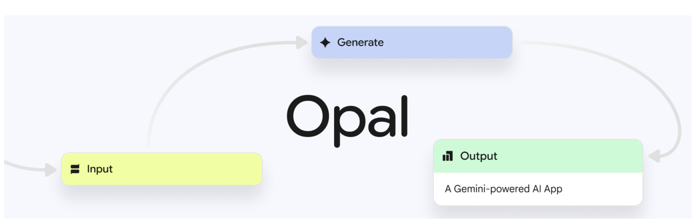
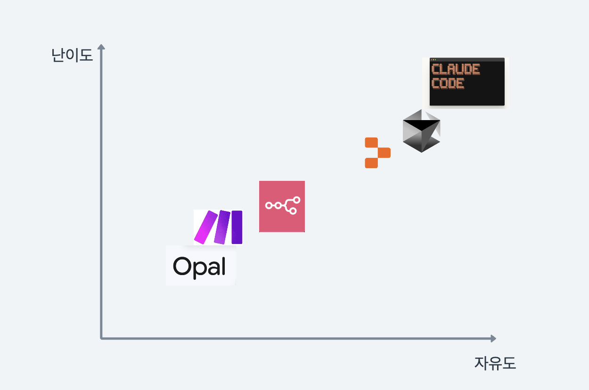

# 구글 Opal 활용 가이드

구글에서 출시한 AI 기반 자동화 툴 Opal을 활용하여 자연어로 워크플로우를 생성하고 웹 앱을 제작하는 종합 가이드입니다.

## 목차

- [Opal 개요](#opal-개요)
- [서비스 특징 및 포지셔닝](#서비스-특징-및-포지셔닝)
- [시작하기](#시작하기)
- [기본 사용법](#기본-사용법)
  - [템플릿 활용하기](#템플릿-활용하기)
  - [템플릿 커스터마이징](#템플릿-커스터마이징)
- [직접 앱 제작하기](#직접-앱-제작하기)
  - [상품 기획 리서치 앱](#상품-기획-리서치-앱)
  - [광고 카피 생성 앱](#광고-카피-생성-앱)
- [Opal의 장점과 한계](#opal의-장점과-한계)
- [n8n/Make와의 비교](#n8nmake와의-비교)
- [결론](#결론)

## Opal 개요



Google Opal은 자연어로 워크플로우를 생성할 수 있는 AI 기반 자동화 툴입니다. 기존 n8n이나 Make처럼 복잡한 워크플로우를 직접 설계하지 않고도, 마치 바이브코딩처럼 자연어로 원하는 플로우를 설명하면 자동으로 워크플로우를 생성해줍니다.

### 주요 특징
- **자연어 기반 워크플로우 생성**: 복잡한 설정 없이 글로 설명만 하면 워크플로우 자동 생성
- **웹 앱 형태 인터페이스**: 생성된 워크플로우를 웹 앱으로 실행 가능
- **시각적 워크플로우 편집**: 생성 후 시각적으로 수정 및 조정 가능
- **무료 사용**: 현재 베타 버전으로 무료 제공
- **공유 기능**: 생성된 앱을 다른 사용자와 공유 가능

## 서비스 특징 및 포지셔닝

### AI 자동화 툴 생태계에서의 위치

Opal은 자유도와 난이도를 축으로 했을 때 독특한 위치를 차지합니다:



**기존 자동화 툴 (n8n, Make)**
- 높은 자유도, 중간 난이도
- 워크플로우 직접 설계 필요
- 외부 서비스 연동 용이
- 복잡한 조건문/반복문 구현 가능

**바이브코딩 툴 (Replit, Cursor, Claude Code)**
- 매우 높은 자유도, 높은 난이도
- 코딩 및 시스템 이해 필요
- 무제한 커스터마이징 가능

**Opal의 하이브리드 접근법**
- 중간 자유도, 낮은 난이도
- 자연어 기반 + 시각적 편집
- 진입장벽 최소화
- 제한적이지만 직관적인 사용

## 시작하기

### 접속 및 로그인

1. **웹사이트 접속**: [opal.withgoogle.com](http://opal.withgoogle.com)
2. **VPN 설정**: 현재 미국에서만 베타 서비스 제공으로 VPN을 통한 미국 위치 설정 필요
3. **구글 로그인**: 구글 계정으로 로그인하여 무료 사용 시작

### 초기 화면 구성

- **갤러리**: 다양한 템플릿 제공
- **Create New**: 새로운 앱 생성
- **템플릿 카테고리**: Blog Post Writer, Video Marketer, Social Media Post 등

## 기본 사용법

### 템플릿 활용하기

#### 1. Blog Post Writer 템플릿 사용

**템플릿 선택**
1. 갤러리에서 "Blog Post Writer" 선택
2. 워크플로우 구조 확인 (좌측 패널)
3. Preview, Console, Step, Theme 탭 활용 (우측 패널)

**앱 테스트**
1. **Preview 모드**: 우측 패널에서 직접 테스트
2. **App 모드**: 상단 "App" 버튼으로 풀스크린 테스트
3. **입력 예시**: `"AI replacing jobs"`

**실행 모니터링**
- **Console 탭**: 스텝별 실행 과정 확인
- **Step 탭**: 각 단계별 상세 설정 확인
- **실행 시간 및 모델 사용량 추적**

### 템플릿 커스터마이징

#### 1. 템플릿 복제 및 수정

**Remix 과정**
1. "Remix" 버튼 클릭으로 템플릿 복제
2. 개인 워크스페이스로 복사
3. 자유로운 수정 가능

**Theme 변경**
- Theme 탭에서 디자인 요청: `"AI automation style의 dark theme"`
- 자동 UI 스타일 변경

#### 2. AI 기반 워크플로우 수정

**자연어 편집 요청**
```
"블로그 글을 위한 리서치는 영어로 하되, 최종 블로그 포스트는 한글로 출력되게 수정해줘."
```

**SUGGEST AN EDIT 기능**
1. 수정 요청 입력
2. AI가 자동으로 워크플로우 조정
3. 각 스텝별 프롬프트 자동 수정

**수동 세부 조정**
- 각 스텝 클릭하여 개별 설정
- 프롬프트 직접 편집
- 사용 툴 및 모델 변경

#### 3. 앱 공유

**공유 설정**
1. 우측 상단 "Share App" 버튼
2. "Public" 옵션 선택
3. 생성된 링크 공유

## 직접 앱 제작하기

### 상품 기획 리서치 앱

#### 앱 생성 프롬프트

```
Create a comprehensive product planning research web app that helps product managers and entrepreneurs analyze market opportunities and competitive landscapes for new product development.

App Structure:
1. Input Section:
   - Target product concept field (e.g., "AI-powered fitness tracker", "sustainable packaging solution")
   - Business requirements text area (target market, budget constraints, technical capabilities, timeline, unique value proposition)
   - Market context field (geographic focus, industry vertical, competitive concerns)

2. Strategic Analysis Processing:
   - Market opportunity assessment
   - Competitive landscape analysis (5-7 key competitors)
   - Feature gap analysis and differentiation opportunities
   - Target customer persona insights
   - Pricing strategy recommendations
   - Go-to-market considerations

3. Interactive Strategic Report:
   - Executive summary with key insights
   - Market size and opportunity overview
   - Competitive analysis matrix with feature comparison
   - SWOT analysis for the proposed product
   - Recommended feature prioritization
   - Potential risks and mitigation strategies
   - Next steps and validation framework

4. Output Format:
   - Professional business report layout
   - Interactive comparison tables and charts
   - Expandable sections for detailed analysis
   - Actionable insights with priority levels
   - Export-friendly format for stakeholder sharing
```

#### 테스트 입력

**제품 컨셉**:
```
sunscreen for men
```

**비즈니스 요구사항**:
```
I want to create a sunscreen product specifically designed for men, making it appealing to them, and later expand into other male cosmetic products.
The male cosmetics market is growing in Korea, and I want to tap into this opportunity.
```

**결과 특징**
- 종합적인 시장 분석 리포트 생성
- 경쟁사 분석 및 차별화 포인트 제시
- SWOT 분석 및 전략 권고사항 제공
- Gemini 모델의 다중 실행으로 깊이 있는 분석

### 광고 카피 생성 앱

#### 앱 생성 프롬프트

```
Create a Korean advertising copy generator and management web app that creates culturally relevant Korean ad copy variations and organizes them in visual cards and Google Sheets for Korean market campaigns.

App Structure:
1. Input Section (Korean Interface):
   - 제품/서비스명 입력 필드
   - 타겟 고객층 설명 (연령대, 관심사, 고민사항, 라이프스타일)
   - 캠페인 목적 선택 (인지도 향상, 구매 전환, 참여 유도, 고객 유지)
   - 플랫폼 선택 (네이버, 카카오, 인스타그램, 유튜브, 페이스북)
   - 글자 수 제한 (선택사항)

2. Korean Copy Generation Processing:
   - 한국 문화와 언어 특성을 반영한 3가지 톤앤매너로 카피 생성:
     * 친근하고 정감있는 톤 (반말/존댓말 적절히 혼용, 이모티콘 활용)
     * 전문적이고 신뢰감 있는 톤 (정중한 존댓말, 전문 용어 활용)
     * 재미있고 트렌디한 톤 (밈, 신조어, 유행어 활용)
   - 각 톤별로 생성: 메인 헤드라인, 서브 카피, 콜투액션, 본문
   - 한국 SNS 문화에 맞는 해시태그와 이모지 제안
   - 계절감, 한국 명절, 문화적 맥락 고려

3. Visual Output Display:
   - 9개 카피 변형을 카드 형태로 표시
   - 각 카드별 표시 항목: 톤 유형, 헤드라인, 미리보기, 글자 수
   - 카드 확장으로 전체 카피 상세 보기
   - 각 요소별 복사 기능
   - 한국 시장 반응 예측 점수

4. Google Sheets Integration:
   - 체계적인 스프레드시트 자동 업데이트:
     - 생성 일시, 제품명, 타겟 고객층
     - 톤별 9개 카피 변형 정리
     - 헤드라인, 본문, CTA 개별 컬럼 구성
     - 캠페인 메모 및 다음 단계 계획

5. Korean Market Features:
   - 한국 소비자 트렌드 반영 (건강, 편의성, 가성비, K-뷰티 등)
   - 연령대별 언어 스타일 차별화 (2030 MZ세대, 4050 중장년층)
   - 플랫폼별 최적화 (네이버 블로그체, 인스타 해시태그, 유튜브 썸네일용)

Focus on creating authentic Korean copy that resonates with local consumers while maintaining systematic campaign asset management for Korean marketing teams.
```

**외부 연동 수정 요청**:
```
웹페이지에 csv데이터를 넣지말고, 스프레드시트 output을 추가해서 별도로 저장해줄래?
```

## Opal의 장점과 한계

### 장점

1. **낮은 진입장벽**
   - 코딩 지식 불필요
   - 자연어로 간단한 설명만으로 워크플로우 생성
   - 직관적인 인터페이스

2. **AI 기반 워크플로우 생성**
   - 복잡한 설정 과정 생략
   - 자동 최적화된 워크플로우
   - 지속적인 개선 및 수정 가능

3. **웹 앱 형태 제공**
   - 즉시 사용 가능한 인터페이스
   - 공유 및 협업 기능
   - 반응형 디자인

4. **무료 사용**
   - 베타 버전 무료 제공
   - 제한 없는 앱 생성

### 한계점

1. **복잡한 워크플로우 제한**
   - AI 생성 워크플로우의 정교함 부족
   - 복잡도 증가시 정확도 하락
   - 프롬프트 해석 한계

2. **플로우 제어 부족**
   - 반복문, 조건문 등 기본 로직 제어 불가
   - Gemini 모델의 자동 실행 구조
   - 사용자 커스터마이징 제한

3. **외부 서비스 연동 문제**
   - 구글 서비스 간 연동도 불안정
   - 써드파티 서비스 연결 제한
   - 시트 업데이트, 슬라이드 생성 등 기능 오류

4. **스케줄링 기능 부재**
   - 자동화 워크플로우 제한적 구현
   - 실시간 트리거 없음
   - 배치 작업 불가

5. **언어별 성능 차이**
   - 한글 출력 품질 영어 대비 저하
   - 문화적 맥락 이해 부족
   - 현지화 기능 미흡

## n8n/Make와의 비교

### Opal vs n8n/Make 비교표

| 항목 | Opal | n8n/Make |
|------|------|----------|
| **진입장벽** | 매우 낮음 (자연어) | 중간 (시각적 설계) |
| **워크플로우 복잡도** | 단순-중간 | 높음 |
| **외부 서비스 연동** | 제한적 | 광범위함 |
| **커스터마이징** | 제한적 | 높음 |
| **스케줄링** | 없음 | 완전 지원 |
| **가격** | 무료 (베타) | 유료/무료 플랜 |
| **안정성** | 불안정 (베타) | 안정적 |
| **플로우 제어** | 제한적 | 완전 제어 |

### 사용 시나리오별 추천

**Opal 추천 상황**
- 간단한 데이터 처리 및 분석
- 콘텐츠 생성 자동화
- 프로토타이핑 및 아이디어 검증
- 비기술직 사용자의 간단한 자동화

**n8n/Make 추천 상황**
- 복잡한 비즈니스 로직 구현
- 다중 서비스 연동 필요
- 정교한 조건문/반복문 활용
- 스케줄링이 중요한 자동화
- 프로덕션 환경 배포

## 결론

Google Opal은 AI 자동화 툴 시장에 신선한 접근법을 제시하는 서비스입니다. 자연어 기반의 워크플로우 생성은 분명히 진입장벽을 크게 낮춰주며, 비기술직 사용자도 쉽게 자동화 앱을 만들 수 있게 해줍니다.

### 현재 상황 정리

**강점**
- 혁신적인 자연어 기반 워크플로우 생성
- 직관적이고 사용하기 쉬운 인터페이스
- 무료 베타 서비스로 진입장벽 최소화

**개선 필요 영역**
- 복잡한 워크플로우 처리 능력
- 외부 서비스 연동 안정성
- 스케줄링 및 자동화 기능
- 다국어 지원 품질

### 미래 전망

만약 Google이 현재의 한계점들을 해결할 수 있다면, Opal은 n8n과 Make에게 강력한 경쟁자가 될 수 있을 것입니다. 특히 진입장벽이 낮다는 점에서 더 많은 사용자층을 확보할 가능성이 높습니다.

반대로 n8n과 Make 같은 기존 툴들도 AI를 활용한 워크플로우 초안 생성 기능을 추가한다면, 사용자 경험을 크게 개선할 수 있을 것으로 예상됩니다.

### 권장 사용 방식

현재 시점에서는 Opal을 **프로토타이핑과 아이디어 검증 도구**로 활용하고, 실제 프로덕션 환경에서는 n8n이나 Make 같은 안정적인 툴을 사용하는 것이 현명한 접근법일 것 같습니다.

앞으로 Opal의 발전 방향과 기존 자동화 툴들의 AI 기능 통합을 지켜보며, 각 툴의 장점을 활용한 효율적인 자동화 전략을 수립하는 것이 중요할 것입니다.
