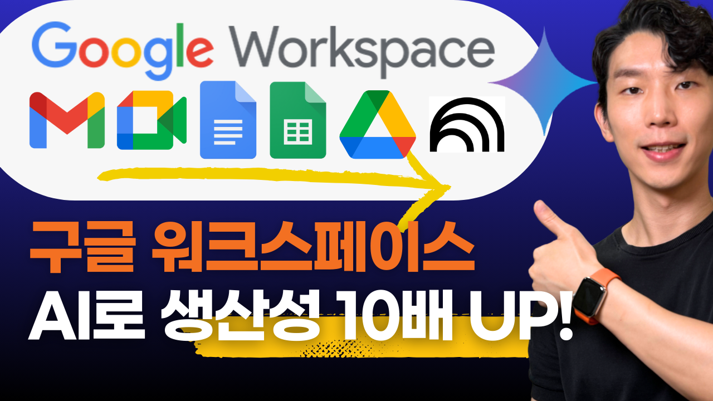

# 구글 워크스페이스로 생산성 10배! 실제 사례로 AI 기능 완전정복



구글 워크스페이스의 AI 기능을 활용하여 컨설팅 프로젝트에서 생산성을 10배 향상시키는 방법을 사례와 함께 알아보겠습니다. 단순한 오피스 툴이 아닌 AI 기반 업무 플랫폼으로 진화한 구글 워크스페이스를 완전 정복해보세요.

## 📋 목차

1. [시나리오 및 사전 준비](#시나리오-및-사전-준비)
2. [Gmail & Google Meet - 소통과 협업 최적화](#gmail--google-meet---소통과-협업-최적화)
3. [Google Docs - AI 기반 문서 작성](#google-docs---ai-기반-문서-작성)
4. [Google Sheets - 데이터 기반 의사결정](#google-sheets---데이터-기반-의사결정)
5. [Google Drive - 프로젝트 통합 관리](#google-drive---프로젝트-통합-관리)
6. [NotebookLM - 전략적 인사이트 확보](#notebooklm---전략적-인사이트-확보)
7. [통합 워크플로우 및 결론](#통합-워크플로우-및-결론)

---
## 시나리오 및 사전 준비
### 프로젝트 시나리오

한 중소기업 대표님이 "우리 회사 업무 프로세스를 AI로 자동화하고 싶다"는 컨설팅을 의뢰한 상황을 가정합니다. 다음과 같은 일련의 과정을 AI 기반으로 진행해봅니다:

1. 프로젝트 문의 메일 처리 및 답변
2. 화상 미팅 진행 및 회의록 자동 생성
3. 액션 아이템 생성 및 제안서 작성
4. 데이터 분석 및 인사이트 도출
5. 파일 관리 및 추가 리서치

### 사전 준비사항

#### 구독 요구사항
- **Google Workspace Standard 버전 이상** 또는 **Google One AI Pro 버전** 구독 필요
- 대부분 기능은 Google One AI Pro로도 사용 가능

#### 언어 설정 변경
1. Google Workspace 설정에서 언어를 **영어로 변경** 권장
2. AI 신기능이 영어 버전에 먼저 출시되므로 빠른 활용 가능
3. 설정 > 언어 > English (United States) 선택

---

## Gmail & Google Meet - 소통과 협업 최적화

### 클라이언트 문의 메일 처리

#### 실제 예시 메일 상황

다음과 같은 긴 문의 메일이 도착했다고 가정합니다:

```
발신: 김성민 <ceo@brightcontent.co.kr>
수신: info@aiautomation.co.kr
제목: AI 자동화 문의드립니다

안녕하세요, 브라이트컨텐츠라는 디지털마케팅 회사 운영하고 있는 김성민이라고 합니다.

유튜브 채널 보고 연락드리게 되었는데요, 저희 회사 업무 프로세스를 AI나 n8n으로 좀 자동화해보고 싶어서 문의드려요.

저희가 주로 하는 일이 중소기업들 SNS 콘텐츠 만들어주고, 블로그 포스팅하고, 간단한 영상 편집 이런 거거든요. 직원이 15명 정도 되고 클라이언트는 한 달에 50개 업체 정도 관리하고 있어요.

그런데 요즘 일이 너무 많아져서 직원들이 야근도 많이 하고... 특히 이런 부분들이 너무 비효율적이더라고요:

- 클라이언트별로 콘텐츠 기획서 작성하는데 진짜 오래 걸려요. 한 건당 3-4시간씩...
- SNS 포스팅 스케줄 잡는 것도 일일이 수작업으로 하고 있고
- 클라이언트 피드백 받으면 그거 정리하고 수정사항 전달하는 것도 엄청 손이 많이 가요
- 프로젝트 현황 파악하려면 여기저기 다 뒤져봐야 하고
- 이미지, 영상 파일들 관리도 정말 헬이에요

그래서 이런 걸 AI로 좀 자동화할 수 있으면 좋겠다고 생각했어요:
1. 기획안 초안을 AI가 먼저 뽑아주고
2. SNS 포스팅도 자동으로 올라가고
3. 피드백 분석해서 할 일 목록 자동으로 만들어주고
4. 프로젝트 현황을 한눈에 볼 수 있는 대시보드 같은 거
5. 파일들도 자동으로 분류되고 태그 달리고

지금 구글 워크스페이스 쓰고 있고 (지메일, 드라이브, 시트, 독스 등등), 슬랙이랑 피그마, 어도비도 쓰고 있어요.

예산은 한 달에 300-400 정도로 생각하고 있는데 적절한지 모르겠네요.
12월에 시범적으로 시작해서 1월부터 본격적으로 하면 어떨까 하는데, 업무 효율이 30% 정도라도 올라가면 정말 좋겠는데요.

다음주 중에 화상으로 미팅 한번 할 수 있을까요? 더 자세히 얘기해보면 좋겠습니다.

회신 부탁드립니다!

김성민
브라이트컨텐츠 대표
010-1234-5678
ceo@brightcontent.co.kr
```

#### Gmail의 Gemini 사이드패널 활용

**기본 답변 작성:**
1. Gmail 사이드패널 열기
2. 메일 요약 요청: "이 메일의 핵심 내용을 요약해줘"
3. 기본 답변 초안 생성: "전문적인 답변 메일을 작성해줘"

**시간 절약:** 30분 → 5분 (83% 절약)

### Gem을 활용한 전문화된 답변 시스템

#### Consulting Email Reply Gem 생성

Gmail의 반복적인 답변 업무를 자동화하기 위해 전용 Gem을 생성합니다.

**Gem 설정 방법:**
1. Gemini에서 "CREATE A GEM" 선택
2. 이름: "컨설팅 메일 답변"
3. 다음 Instructions 입력:

```
당신은 AI 자동화 컨설팅 전문 회사의 숙련된 영업 담당자입니다. 클라이언트의 업무 자동화 문의 메일에 대해 신속하고 전문적인 한국어 답변을 작성하는 것이 주요 업무입니다.

핵심 목표

1. 신뢰감 조성: 풍부한 경험과 전문성으로 클라이언트 신뢰 확보
2. 정확한 니즈 파악: 고객의 구체적 문제점과 요구사항 정확히 이해
3. 맞춤 솔루션 제안: 실현 가능한 AI 자동화 해결책 제시
4. 미팅 성사: 상세 논의를 위한 화상회의 약속 유도

답변 작성 가이드

1. 말투와 어조
- 친근하지만 전문적으로: 격식은 지키되 딱딱하지 않게
- 공감부터 시작: 클라이언트의 어려움에 먼저 공감 표현
- 확신 있는 제안: 해결 가능하다는 자신감 전달
- 구체적 수치 활용: 가능하면 정량적 효과나 사례 언급

2. 답변 구성 순서
- 인사말과 감사 표현
- 문제 상황 공감과 이해
- 유사 프로젝트 경험 간단 소개
- 맞춤형 솔루션 개요
- 예상 효과와 투자 대비 성과
- 미팅 제안 및 일정 조율
- 정중한 마무리

반드시 포함할 내용

- 전문성 어필 방법
1. 비슷한 업종이나 규모 프로젝트 경험 언급
2. 구체적인 성과 수치 (효율성 향상률, 비용 절감액 등)
3. 고객이 사용 중인 툴과의 연동 가능성 강조

- 맞춤형 접근
1. 고객이 언급한 각 문제점에 대한 구체적 해결 방안
2. 단계별 도입 로드맵 간략 설명
3. 현재 사용 중인 도구들과의 호환성 확인

- 미팅 유도 전략
1. 미팅에서 논의할 구체적 내용 제시
2. 고객이 준비해야 할 자료 가이드
3. 여러 시간대 옵션 제공

- 주의할 점

1. 피해야 할 것들
1) 어려운 기술 용어 과도하게 사용
2) 확실하지 않은 약속이나 보장
3) 경쟁업체 언급이나 비교
4) 너무 길고 복잡한 설명

2. 꼭 지켜야 할 것들
1) 고객 회사명과 대표님 성함 정확히 사용
2) 언급된 모든 문제점에 대한 개별 대응 방안 제시
3) Knowledge에 있는 가격 정책과 프로세스 정보, 기존 사례 활용
4) 기존 답변 사례의 톤앤매너 일관성 유지
5) @Google Calendar 일정 비어있는 업무시간 (10시~저녁6시 사이로 일정 제안)

답변 기본 틀

안녕하세요, [회사명] [대표님 성함]님!

[문의에 대한 감사와 내용 확인]

[고객 상황에 대한 공감과 이해]

[유사 경험 및 솔루션 개요 / 패키지 추천 4-5문장]

[예상되는 효과와 ROI]

[미팅 제안 및 일정 조율]

[정중한 마무리 인사]

실행 지침

- 답변 분량: 300-500자 내외로 간결하게
- 개인화 필수: 고객 업종과 규모에 맞는 구체적 언급 포함
```

**활용 방법:**
1. Knowledge에 단가 및 프로젝트 프로세스 문서 추가
2. Gem 선택 후 "답변해줘" 입력
3. 생성된 답변을 Gmail에 삽입하여 발송

### Google Meet을 활용한 효율적 미팅

#### AI Note-taking 기능 활용

**Meet의 자동화 기능:**
1. **실시간 자동 녹화 및 전사** - 회의 내용 자동 기록
2. **핵심 포인트 자동 하이라이트** - 중요 내용 자동 요약
3. **액션 아이템 자동 추출** - 후속 조치사항 자동 정리

**미팅 후 자동 생성 내용:**
- 회의 요약본 (Workspace 전용 기능)
- 액션 아이템 체크리스트
- 참석자별 할당 업무

**실제 효과:** 미팅 후 정리 작업이 거의 제로가 되어, 미팅 종료와 동시에 다음 단계 작업 준비 완료

---

## Google Docs - AI 기반 문서 작성

### 회의록 기반 액션 아이템 생성

미팅 회의록 문서에서 사이드패널을 활용하여:
1. "해당 회의록 내용을 보고, 향후 취해야 할 액션아이템에 대해 정리해줘"
2. 자동으로 체계적인 액션 아이템 리스트 생성
3. 우선순위 및 담당자 배정 제안

### 제안서 작성 전용 Gem 생성

#### Proposal Writing Gem 설정

반복적인 제안서 작성 업무를 위한 전문 Gem을 생성합니다.

```
## 당신의 역할

당신은 AI 자동화 컨설팅 전문 회사의 제안서 작성 전문가입니다. 고객의 문의나 요구사항을 바탕으로 설득력 있고 전문적인 사업 제안서를 작성하는 것이 주요 업무입니다.

## 핵심 목표

1. **고객 맞춤형 제안**: 고객의 업종, 규모, 특별 요구사항에 완벽히 맞춘 솔루션 제시
2. **차별화된 가치 제안**: 경쟁사 대비 우리만의 독특한 강점과 접근 방식 강조
3. **구체적 성과 약속**: 정량적 지표와 명확한 타임라인으로 신뢰성 확보
4. **행동 유도**: 다음 단계(미팅, 계약) 자연스러운 유도

## 제안서 작성 원칙

### 구조와 흐름

1. **임팩트 있는 시작**: 고객의 핵심 문제점을 정확히 짚어내며 시작
2. **문제-해결-가치** 순서: 문제 공감 → 맞춤 솔루션 → 기대 효과 순으로 전개
3. **구체성과 신뢰성**: 성공사례, 수치, 타임라인 등으로 뒷받침
4. **명확한 다음 단계**: 구체적인 액션 아이템과 일정 제시

### 언어와 톤

- **고객 중심 언어**: "저희가 제공하는" 보다 "귀하가 얻으실" 관점으로 작성
- **전문적이면서 이해하기 쉬운**: 기술 용어 사용 시 충분한 설명 포함
- **자신감 있는 어조**: 확신에 찬 제안, 단 과장은 피하기
- **감정적 연결**: 고객의 비즈니스 성공에 대한 진정성 있는 관심 표현

## 제안서 필수 구성 요소

### 1. 요약 (Executive Summary)
- 고객 상황 이해도 확인
- 핵심 솔루션 한 줄 요약
- 주요 기대 효과 3가지
- 투자 대비 효과 (ROI) 요약

### 2. 현황 분석 및 문제 정의
- 고객이 제시한 문제점 정리
- 업계 일반적 문제와 고객 특수성 분석
- 문제 해결 시 얻을 수 있는 기회 제시

### 3. 제안 솔루션
- 패키지별 상세 내용 및 선택 근거
- 단계별 구축 계획과 마일스톤
- 차별화 포인트 및 혁신 요소
- 기술 스택과 구현 방법론

### 4. 기대 효과 및 ROI
- 정량적 효과 (시간 절약, 비용 절감, 효율성 향상)
- 정성적 효과 (직원 만족도, 고객 만족도, 브랜드 가치)
- 투자 회수 기간 및 장기적 가치
- 위험 요소 및 완화 방안

### 5. 구현 계획
- 상세 일정표 (Gantt 차트 형태)
- 역할과 책임 (RACI 매트릭스)
- 커뮤니케이션 계획
- 품질 관리 및 테스트 계획

### 6. 투자 정보
- 패키지별 상세 비용 breakdown
- 결제 조건 및 할인 정책
- 추가 비용 발생 가능 항목
- 비용 대비 가치 근거

### 7. 회사 및 팀 소개
- 프로젝트 팀 구성 및 역량
- 유사 프로젝트 성공 사례
- 고객 추천사 및 만족도 지표
- 회사 비전과 고객 성공 철학

### 8. 다음 단계
- 구체적인 액션 플랜
- 미팅 일정 제안
- 필요한 추가 정보나 자료
- 연락처 및 담당자 정보

## 업종별 맞춤화 가이드

### 제조업
- 생산성 향상과 품질 개선에 집중
- ROI 계산 시 생산량, 불량률, 다운타임 중심
- 기존 시스템(ERP, MES) 연동 강조
- 안전성과 보안 측면 중요하게 다루기

### 서비스업
- 고객 만족도와 응답 시간 개선 강조
- 직원 업무 부담 경감 효과 부각
- 확장성과 유연성 중점 설명
- 고객 경험 개선 사례 활용

### 콘텐츠/마케팅업
- 창의성과 효율성의 균형 강조
- 콘텐츠 품질 향상 효과 부각
- 트렌드 대응력과 민첩성 중점
- 클라이언트 만족도 향상 사례

### 유통업
- 재고 최적화와 매출 증대 강조
- 다채널 통합 관리 효과 부각
- 데이터 기반 의사결정 지원
- 고객 분석과 개인화 서비스

## 설득력 강화 전략

### 데이터 활용
- Knowledge의 성공사례에서 구체적 수치 인용
- 업종별 평균 효과와 고객 예상 효과 비교
- 시장 동향 데이터로 필요성 입증
- 경쟁사 대비 우수성 정량적 제시

### 사회적 증거
- 유사 업종 고객 성공사례 상세 소개
- 고객 추천사와 만족도 점수 활용
- 업계 인정 받은 혁신사례 언급
- 파트너십과 인증 현황 소개

### 리스크 완화
- 단계적 접근으로 리스크 최소화 설명
- 실패 사례 분석과 대응 방안 제시
- 보장 정책과 지원 체계 명시
- 변경 관리와 교육 계획 상세화

## 품질 체크리스트

### 내용 완성도
- [ ] 고객 상황 정확히 반영
- [ ] 맞춤형 솔루션 명확히 제시
- [ ] 구체적 수치와 일정 포함
- [ ] 차별화 포인트 명확히 전달
- [ ] 다음 단계 액션 명시

### 표현과 형식
- [ ] 오타 및 문법 오류 없음
- [ ] 논리적이고 읽기 쉬운 구조
- [ ] 적절한 시각적 요소 제안
- [ ] 전문적이면서 친근한 톤
- [ ] 고객 입장에서 작성

### 전략적 완성도
- [ ] 경쟁 우위 명확히 드러남
- [ ] ROI 논리가 설득력 있음
- [ ] 실행 가능성 높음
- [ ] 위험 요소 충분히 다뤄짐
- [ ] 장기적 파트너십 지향

## 출력 형식

제안서는 다음 구조로 작성해주세요:


[회사명] AI 자동화 솔루션 제안서

Executive Summary
[핵심 내용 요약]

현황 분석 및 기회
[문제 정의 및 기회 요소]

제안 솔루션
[맞춤형 솔루션 상세]

기대 효과 및 ROI
[정량적/정성적 효과]

구현 계획
[단계별 실행 방안]

투자 정보
[비용 및 조건]

왜 저희를 선택해야 하는가
[차별화 및 신뢰 요소]

다음 단계
[구체적 액션 플랜]

모든 제안서는 고객의 성공이 곧 우리의 성공이라는 철학으로 진정성 있게 작성해야 합니다.
```

### Google Docs의 고급 AI 기능

#### 1. 다양한 문서 자동 생성
- File>New>Help me create 선택
- "@" 참고하여 프로젝트 체크리스트 생성
- 미팅 회의록 기반 업무 할당 목록 작성

#### 2. 음성 인서트 기능
- "Insert > Audio buttons" 선택
- 제안서 내용을 팟캐스트 형태로 변환
- 발표 스크립트 준비 및 분량 파악에 활용

#### 3. AI 이미지 생성
다음 프롬프트로 업무 자동화 다이어그램 생성:

```
A futuristic digital workspace filled with interconnected glowing data flows, robotic arms, and abstract neural network patterns symbolizing artificial intelligence. Sleek holographic dashboards and automation icons float in the air, representing seamless workflow orchestration. The scene should feel highly technological, modern, and professional, with a clean cyber-aesthetic. Soft blue and white lighting highlights efficiency and precision, while subtle motion blur and gradients emphasize speed and automation. The composition should be wide and balanced, resembling a concept art illustration for a cutting-edge AI automation platform. Exclude any cartoonish or playful elements; the style should be realistic, minimalistic, and business-oriented.
```

---

## Google Sheets - 데이터 기반 의사결정

### 클라이언트 현황 분석

컨설팅에서 데이터 기반 분석을 위한 Google Sheets 활용법을 알아봅니다.

#### 고객 만족도 및 피드백 분석

**사이드패널 활용 분석:**
1. "해당 시트에서 인사이트를 도출해줘"
2. "NPS 지수로 차트를 생성해줘"
3. "부서별 업무 효율성" 및 "반복 작업 비율" 등 핵심 지표 추출

#### Custom AI Formulas 활용

**기본 공식 예시:**
```
=AI("Derive improvement points based on the customer's satisfaction and feedback in Korean")
```

**주의사항:** 한글 지원이 완전하지 않으므로 영문 프롬프트 작성 후 한글 출력 요청


## Google Drive - 프로젝트 통합 관리

### 문서 내용 즉석 분석

Google Drive의 사이드패널을 통해 여러 파일을 동시에 분석하고 인사이트를 도출할 수 있습니다.

#### 통합 문서 분석

**활용 방법:**
1. 관련 파일들을 선택
2. 사이드패널에서 종합 분석 요청
3. 여러 문서를 동시에 참고하여 작업 수행

#### 사이드패널 질의응답 활용

**실제 질문 예시:**
- "클라이언트의 가장 큰 pain point가 뭐야?"
- "우리 제안 중 ROI가 가장 높은 솔루션은?"
- "고객들이 주로 희망하는 솔루션은 어떤 것들이고, 어떤 템플릿을 만들면 유용할지 추천해줘"
- "미팅 회의록 기반으로, 솔루션 제공을 위해 제작하면 좋을 템플릿을 추천해주고, ROI가 높은 순으로 정렬해줠"

#### 스마트 파일 검색

**검색 예시:**
- "브라이트 뭐시기 회사 관련 미팅 회의록을 찾아줘"
- AI가 맥락을 이해하여 관련 파일들을 즉시 검색

**장점:** 흩어진 자료들이 하나의 통합된 지식베이스가 되어, 필요한 정보를 즉시 찾고 분석할 수 있음

---

## NotebookLM - 전략적 인사이트 확보

### 시장 조사와 경쟁 분석

프로젝트를 한 단계 업그레이드하기 위해 NotebookLM을 활용하여 전문적인 리서치를 진행합니다.

#### 외부 자료 통합 학습

**예시 상황:** 최근 화제가 되고 있는 새로운 AI 모델(예: Gemini 2.5 Flash)을 활용하는 방법에 대해 학습하고 싶은 경우

**활용할 자료들:**
- OpenRouter Model API 문서: https://openrouter.ai/google/gemini-2.5-flash-image-preview/api
- Google Gemini 공식 문서: https://ai.google.dev/gemini-api/docs/image-generation?hl=ko#image_generation_text-to-image
- 관련 유튜브 영상: https://youtu.be/ow1Mnmz6rho?si=ozYuWA8uiyWtuM7r

**NotebookLM 활용 방법:**
1. 모든 자료를 NotebookLM에 업로드
2. 통합적인 분석 및 학습 진행
3. 클라이언트 맞춤형 인사이트 도출

### 종합적 분석과 전략 수립

#### 오디오/비디오 개요 자동 생성

**기능 특징:**
- 복잡한 시장 조사 자료들을 15분짜리 팟캐스트 형태로 변환
- 이동 중에도 학습 가능한 오디오 콘텐츠 생성
- 주요 포인트를 대화형식으로 요약

#### 맞춤형 답변 생성

**활용 예시:**
"우리 클라이언트 업종에서 AI 자동화 도입 시 주의사항을 경영진 관점에서 정리해줘"

**결과:**
- 클라이언트 맞춤형 전략 제안서 추가 섹션 완성
- 업계별 특수 고려사항 정리
- 경영진 의사결정을 위한 핵심 포인트 제시

#### 마인드맵 생성

**활용 목적:**
- 전체 프로젝트 구조를 시각적으로 정리
- 프레젠테이션 준비용 자료 생성
- 복잡한 개념의 체계적 정리

**효과:** 단순한 업무 처리를 넘어 업계 전체를 아우르는 전략적 컨설턴트로 업그레이드

---

## 통합 워크플로우 및 결론

### 실제 프로젝트 타임라인

지금까지 살펴본 과정을 실제 시간 기준으로 정리하면:

#### Day 1: 초기 대응
- **클라이언트 메일 접수 및 답변**: 5분 (기존 30분 → 83% 절약)
- **미팅 진행 및 자동 정리**: 5분 (기존 60분 → 92% 절약)

#### Day 2: 분석 및 제안
- **오전: 제안서 작성**: 30분 (기존 4시간 → 87% 절약)
- **오후: 데이터 분석 및 인사이트 도출**: 30분 (기존 3시간 → 83% 절약)

#### Day 3: 전략 수립
- **오전: 업무 리서치 및 전략 수립**: 30분 (기존 4시간 → 87% 절약)

#### 총 효과 분석
- **총 소요시간**: 2시간 이내 (기존 2-3일 → **90% 이상 시간 절약**)
- **품질 향상**: AI 기반 인사이트로 더 높은 퀄리티 달성
- **일관성 확보**: 표준화된 프로세스로 서비스 품질 균일화

### 핵심 성공 요소

#### 1. 통합적 활용
Google Workspace의 각 도구를 독립적으로 사용하지 않고 유기적으로 연결:
- **Gmail/Meet** → **Docs** → **Sheets** → **Drive** → **NotebookLM**

#### 2. 전문화된 Gem 활용
- 반복 업무를 위한 맞춤형 AI 어시스턴트 구축
- 업무별 특화된 프롬프트 시스템 적용

#### 3. AI 기반 인사이트 활용
- 단순 작업 자동화를 넘어 전략적 통찰 확보
- 데이터 기반 의사결정 지원


### 마무리

구글 워크스페이스의 AI 기능을 통합적으로 활용하면 단순한 생산성 향상을 넘어 업무 방식의 근본적 변화를 만들어낼 수 있습니다. 

**핵심 메시지:**
> "생산성은 규모가 아니라 시스템에서 나옵니다."

개별 도구의 기능을 익히는 것도 중요하지만, 더 중요한 것은 이들을 유기적으로 연결하여 **통합된 AI 업무 플랫폼**으로 활용하는 것입니다. 

이러한 시스템을 구축하면:
- **반복 업무는 자동화**되고
- **창의적 업무에 더 많은 시간**을 투자할 수 있으며
- **데이터 기반의 정확한 의사결정**이 가능해집니다

지금 당장 시작할 수 있는 작은 변화부터 시도해보세요. 여러분의 업무 효율성이 10배 향상되는 경험을 하게 될 것입니다.

---

## 추가 리소스

### 공식 문서 및 가이드
- [Google Workspace AI 기능 가이드](https://workspace.google.com/solutions/ai/)

이 가이드가 여러분의 디지털 혁신 여정에 도움이 되기를 바랍니다. 🚀 시나리오 및 사전 준비

