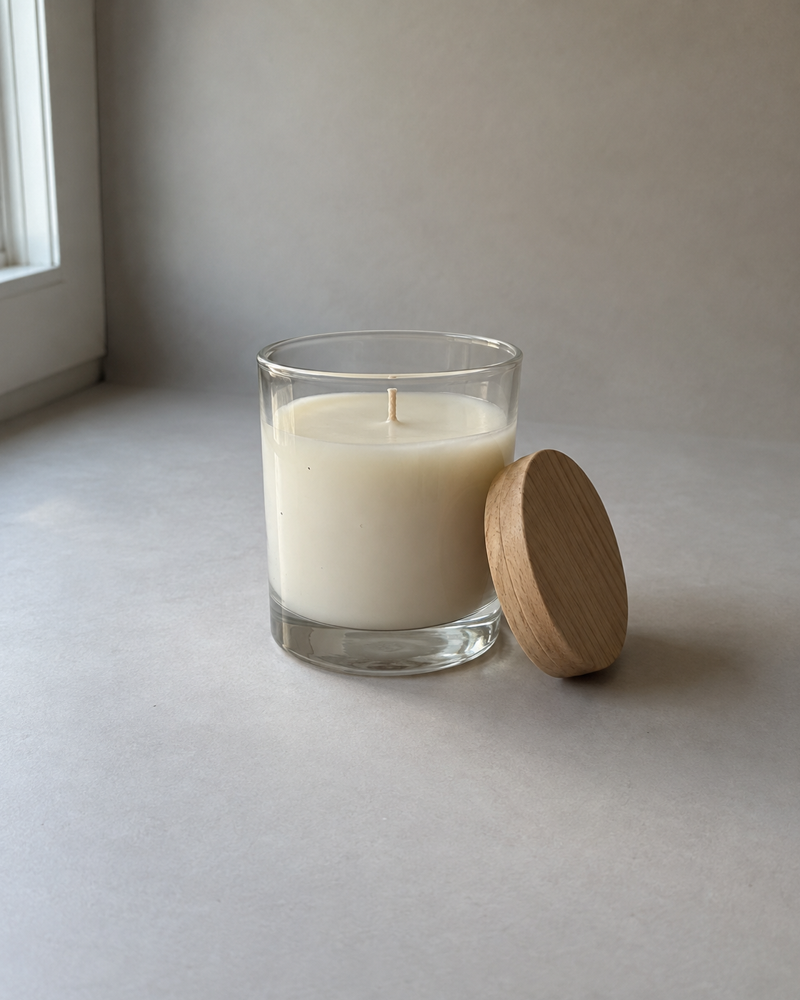
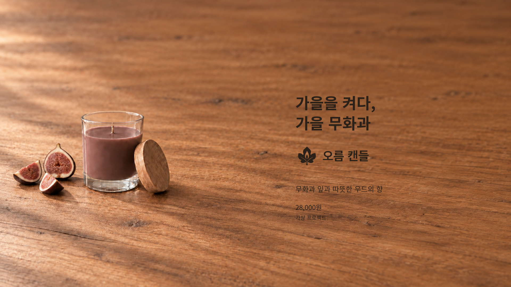
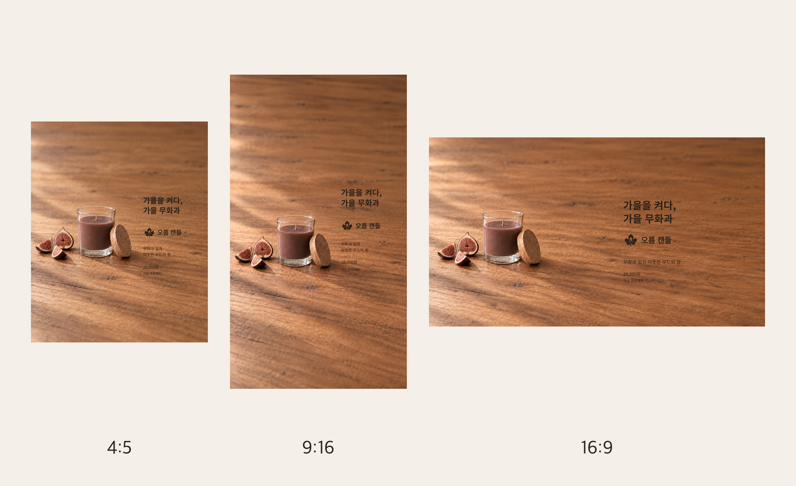

# ChatGPT 이미지 2.5 반복 편집 실전 가이드


제품 이미지 한 장을 ChatGPT에 올리고, 원하는 부분만 한 번에 하나씩 고쳐 가면서 **4:5 피드 광고 · 9:16 스토리 · 16:9 배너 세 장**을 만들고, 마지막에 카피와 로고를 얹어 제안서까지 이어 쓰는 흐름을 정리했습니다.

영상에서는 아래 왼쪽의 라벨 없는 캔들 이미지에서 출발해 여러 번의 수정을 거쳐 오른쪽 배너를 만들었습니다. 매번 처음부터 다시 만들지 않고, 직전에 승인한 이미지를 이어받아 한 가지씩만 바꾸는 방식입니다.

| 시작 이미지 | 완성 배너 (16:9) |
|---|---|
|  |  |

> ⚠️ 샘플 브랜드 「오름 캔들」, 제품 「가을 무화과」, 가격은 영상용으로 만든 **가상 프로젝트**입니다. 시작 이미지도 촬영 사진처럼 보이게 만든 **AI 생성 이미지**이며 실제 제품 사진이 아닙니다.

광고·상세페이지·제안서용 제품 이미지를 자주 고쳐 써야 하는 대표, 마케터, 1인 사업가를 위해 썼습니다. "한 부분만 고쳐달라"고 했는데 제품 모양이나 배경까지 같이 바뀌는 문제를 다룹니다. 핵심은 두 가지입니다. 한 라운드에 한 가지만 바꾸고, 매번 사람이 직접 확인하고 고릅니다.

## 목차

1. [이미지 2.5에서 편집이 어떻게 달라졌나](#1-이미지-25에서-편집이-어떻게-달라졌나)
2. [한 장으로 보는 전체 흐름](#2-한-장으로-보는-전체-흐름)
3. [시작 전에 준비할 것](#3-시작-전에-준비할-것)
4. [8단계 워크플로우](#4-8단계-워크플로우)
5. [라운드마다 반복하는 프롬프트 2개](#5-라운드마다-반복하는-프롬프트-2개)
6. [자주 막히는 지점과 해결법](#6-자주-막히는-지점과-해결법)
7. [꼭 기억할 점](#7-꼭-기억할-점)
8. [참고 자료](#8-참고-자료)

---

## 1. 이미지 2.5에서 편집이 어떻게 달라졌나

OpenAI는 이미지 2.5를 소개하면서 편집과 관련해 세 가지를 강조했습니다.

- 참조 사진 속 피사체를 더 잘 보존한다. 올린 제품이 다른 물건처럼 다시 그려지는 일이 줄어듭니다.
- 요청한 부분만 바꾸고 나머지는 그대로 두는 데 더 좋아졌다. "왁스 색만" 같은 부분 수정을 더 믿고 맡길 수 있습니다.
- 여러 턴에 걸쳐 수정해도 앞서 바꾼 내용이 유지될 가능성이 높아졌다.

중요한 표현은 "더 좋아졌다"와 "가능성이 높아졌다"입니다. OpenAI 이미지 프롬프트 가이드도 반복 편집에서 보존하려던 세부가 달라질 수 있으므로, 유지 조건을 다시 적고 결과를 매번 확인하라고 안내합니다. 그래서 이 가이드는 모델이 잘해줄 것을 기대하는 방식이 아니라, **잘못 바뀌어도 바로 잡아낼 수 있는 작업 방식**을 다룹니다.

---

## 2. 한 장으로 보는 전체 흐름

영상에서 진행한 순서입니다. 라운드 구성과 횟수는 이번 샘플의 예시이고, 제품과 요청에 따라 달라집니다.

| 단계 | 입력 | 이번에만 바꾸는 것 | 결과 |
|---|---|---|---|
| 0. 기준 이미지 | 시작 이미지 | 조명 정리, 배경을 크림색 무지로, 유리 잡티 제거 | 4:5 기준 |
| 1. 왁스 색 | 0의 승인본 | 왁스 색만 크림 → 무화과 갈색 | 4:5 |
| 2. 배경 | 1의 승인본 | 배경만 크림 무지 → 가을 원목 테이블 | 4:5 |
| 3. 소품 | 2의 승인본 | 제품 왼쪽에 무화과 조각 3개 추가 | 4:5 |
| 4. 카피 여백 | 3의 승인본 | 제품을 왼쪽으로 옮기고 오른쪽 40%를 비움 | 4:5 키비주얼 |
| 5. 세로 확장 | 4의 승인본 | 비율만 9:16으로, 위아래는 같은 원목으로 채움 | 9:16 |
| 6. 가로 확장 | 4의 승인본 | 비율만 16:9로, 좌우는 같은 원목으로 채움 | 16:9 |
| 7. 확정 레이어 | 4·5·6의 승인본 | Canva에서 카피·가격·고지·로고를 별도 레이어로 | 광고 3종 |
| 8. 제안서 | 광고 3종 + 후보 | PowerPoint 제안서에 배치 | 제안서 |

세 번째 열을 보면 라운드마다 바꾸는 것이 딱 하나입니다. 그리고 매 라운드의 입력은 항상 직전 라운드에서 사람이 고른 이미지입니다. 이 두 가지가 이 워크플로우의 전부입니다.

---

## 3. 시작 전에 준비할 것

| 준비물 | 설명 |
|---|---|
| ChatGPT 계정 | 이미지 생성·편집이 되는 계정. 세부 기능과 가용 플랜은 계정과 시점에 따라 다를 수 있습니다 |
| 시작 이미지 1장 | 제품이 또렷하고 라벨·텍스트가 없는 쪽이 편집하기 쉽습니다. 실제 촬영 사진이면 원본을 따로 백업하세요 |
| 유지·변경 메모 | 절대 바뀌면 안 되는 것과 바꿔도 되는 것을 미리 적은 메모 (4-2 참고) |
| 카피 문안과 로고 | 카피·가격·고지 문구, 투명 배경 PNG 로고. 이미지 안에 넣지 않고 마지막에 Canva에서 얹습니다 |
| Canva, PowerPoint | 레이어 작업과 제안서 배치용. 영상에서는 ChatGPT의 Canva 연동을 썼습니다. Canva 웹에서 직접 작업해도 되지만 화면과 결과는 다를 수 있습니다 |

**파일 규칙은 시작 전에 정하세요.** 라운드가 여섯 번만 되어도 이미지가 스무 장 가까이 쌓이고, 어떤 파일이 승인본인지 헷갈리는 순간 워크플로우가 무너집니다.

- 시작 이미지 원본은 따로 두고 절대 수정하지 않습니다.
- 라운드별 폴더에 후보 3장을 `[ROUND_ID]_run1.png`, `[ROUND_ID]_run2.png`, `[ROUND_ID]_run3.png`로 저장하고, 이름을 바꾸거나 지우지 않습니다.
- 사람이 고른 한 장만 `[ROUND_ID]_approved.png`로 **복사**합니다. 후보 원본은 제안서에서 비교 자료로 그대로 씁니다.
- 라운드마다 고른 이유를 메모 파일에 한 줄씩 남깁니다.

---

## 4. 8단계 워크플로우

### 4-1. 원본 이미지 한 장을 업로드합니다

로컬 프로젝트 파일을 읽을 수 있는 환경에서는 시작 이미지를 `source/` 폴더에 두고 프롬프트 1의 입력 경로로 지정합니다. 일반 ChatGPT 웹에서는 새 대화를 열고 시작 이미지를 직접 올립니다. 원하는 비율은 프롬프트 안에 적으면 됩니다.

첫 라운드는 색이나 소품을 건드리지 말고 **기준 이미지를 정리하는 데만** 씁니다. 영상에서는 조명을 고르게 하고, 배경을 크림색 무지로 바꾸고, 유리 표면의 먼지와 지문을 없애는 것까지만 요청했습니다. 시작 이미지가 실제 촬영 사진이라면 이 라운드에서 제품이 얼마나 유지되는지를 가장 꼼꼼히 보세요. 여기서 형태가 달라지면 뒤의 모든 라운드가 다른 제품 위에서 진행됩니다.

### 4-2. 유지할 것과 바꿔도 되는 것을 분리합니다

OpenAI의 이미지 프롬프트 가이드는 편집을 요청할 때 무엇을 바꾸고 무엇을 유지해야 하는지를 명시하라고 안내합니다. 표로 적어두면 라운드마다 복사해서 붙여넣기만 하면 됩니다. 영상의 캔들 샘플에서 정리한 표입니다.

| 별도 요청이 없는 한 유지 | 라운드에 따라 바꿀 수 있음 |
|---|---|
| 유리병의 실루엣·높이·곡률·비율 | 왁스 색 |
| 나무 뚜껑의 재질·형태 | 배경 재질과 색 |
| 제품 개수 1개, 심지가 꺼진 상태 | 소품 종류와 개수 |
| 라벨·텍스트·로고 없음 | 제품의 화면 내 위치 |
| 촬영 각도, 광원 방향, 실제 사진 같은 톤 | 화면 비율, 카피 여백 크기 |

왼쪽 열은 "이게 바뀌면 같은 제품이 아니다"라는 기준이고, 오른쪽 열은 캠페인마다 달라지는 연출입니다. 오른쪽 열의 항목이라도 **이번 라운드에서 바꾸지 않는 것은 유지 목록에 다시 적습니다.** 배경을 바꾸는 라운드라면 "왁스 색은 앞 라운드에서 정한 무화과 갈색 그대로"라고 적어야 합니다.

### 4-3. 후보 3장을 한 번에 받아 직접 고릅니다

같은 요청으로 후보를 세 장 만듭니다. 한 장만 받으면 좋은 결과인지 비교할 기준이 없습니다. 세 장을 나란히 두면 어느 쪽이 요청을 잘 반영했는지, 어느 쪽이 제품을 덜 건드렸는지가 눈에 보입니다.

영상에서는 이 과정을 손으로 세 번 하지 않고, 라운드마다 아래 두 프롬프트로 진행했습니다.

- **프롬프트 1**을 붙여넣으면 메인 스레드가 독립 작업 스레드 3개를 만들고, 같은 입력·같은 지시로 후보 3장을 따로 생성합니다. 파일 3개가 실제로 저장됐는지 확인한 뒤 입력 이미지와 비교해 추천 1장을 보고서로 남깁니다. 이 단계에서는 승인본을 만들지 않습니다.
- 여러분이 후보 3장을 직접 보고 **프롬프트 2**에 선택과 이유를 적으면, 고른 한 장만 승인본으로 복사되고 선택 기록이 남습니다.
- AI의 추천은 참고 의견이지 승인이 아닙니다. 고르는 사람은 여러분입니다.
- 고른 이유는 한 줄이면 됩니다. "배경 원목이 가장 자연스럽고 왁스 변화도 적음" 정도면 충분합니다.
- 셋 다 마음에 들지 않으면 프롬프트 2에 `선택 없음`이라고 적습니다. 승인본을 만들지 않고, 요청을 고쳐서 같은 라운드의 프롬프트 1을 다시 실행합니다.

선택되지 않은 후보도 지우지 마세요. 상세페이지용 대안이나 다른 색감 시안으로 쓸 수 있고, 제안서에서 선택 과정을 보여주는 자료가 됩니다.

### 4-4. 한 라운드에 한 가지만 바꿉니다

"왁스를 갈색으로 바꾸고 배경도 원목으로 하고 무화과도 놓아주세요"라고 한 번에 요청하면, 결과가 잘못 나왔을 때 무엇 때문인지 알 수 없습니다. 왁스 색은 맞는데 병이 커졌다면 배경 때문인지 소품 때문인지 구분이 안 됩니다.

하나씩 바꾸면 잘못된 라운드만 다시 돌리면 되고, 앞의 승인본은 그대로 살아 있습니다. 비교할 때 볼 곳도 명확합니다. 라운드 수가 늘어 느려 보일 수 있지만, 한 번에 다 요청했다가 처음부터 다시 만드는 일을 줄일 수 있습니다.

### 4-5. 보존 조건을 다시 적고, 최신 승인본을 다음 입력으로 씁니다

이 단계가 워크플로우의 심장입니다.

- **보존 조건 재진술.** 앞 라운드에서 이미 말했더라도 매 라운드 프롬프트 1의 `유지할 것`에 유지 목록을 다시 넣습니다. OpenAI 가이드도 반복 편집에서 보존하려던 세부가 바뀔 수 있으니 제약을 다시 명시하고 결과를 매번 확인하라고 안내합니다.
- **직전 승인본 경로가 다음 입력.** 프롬프트 2가 끝나면 `다음 라운드 입력` 경로가 나옵니다. 다음 라운드 프롬프트 1의 `입력 이미지` 칸에 이 경로를 그대로 넣습니다. 일반 ChatGPT 웹에서는 승인본 파일을 새 채팅에 다시 올립니다. "아까 그 이미지에서 이어서"보다 파일을 지정하거나 직접 올리는 편이 안전합니다.
- **`현재 입력` 한 줄.** 지금 넣는 이미지가 어떤 상태인지 프롬프트 1의 `현재 입력`에 적습니다. "무화과 갈색 왁스, 원목 배경, 소품 없음, 제품 중앙 배치"처럼요. 나중에 프롬프트만 봐도 라운드 순서를 복원할 수 있습니다.

### 4-6. 4:5 → 9:16 → 16:9로 확장하고 텍스트 자리를 확보합니다

키비주얼이 확정되면 비율을 늘립니다. 핵심은 **비율만 바꾸고 나머지는 건드리지 않는 것**입니다. 늘어난 영역은 같은 배경으로만 채우고, 제품과 소품은 다시 그리지 않으며, 제품을 늘여서 공간을 맞추지 않습니다.

확장 전에 카피가 들어갈 자리를 먼저 비워둡니다. 영상에서는 4:5 단계에서 제품과 무화과를 왼쪽 60% 안으로 옮기고 오른쪽 약 40%를 배경만 남기는 라운드를 따로 두었습니다. 이 여백이 확보된 4:5에서 세로와 가로로 각각 확장합니다.

| 규격 | 용도 | 제품 위치 | 텍스트 자리 |
|---|---|---|---|
| 4:5 | 피드 광고, 키비주얼 | 왼쪽 60% 안 | 오른쪽 약 40% |
| 9:16 | 스토리·릴스 | 왼쪽, 세로 중앙 | 오른쪽 여백. 상단 15%·하단 20%는 비움 |
| 16:9 | 웹 배너, 제안서 | 왼쪽 3분의 1 안 | 오른쪽 약 50% |

9:16의 상단 15%·하단 20%는 계정명, 버튼, 답장창이 겹치는 구간을 피하려고 **영상 샘플에서 정한 작업 규칙**입니다. 플랫폼마다 가리는 영역이 다르니 실제로 올릴 매체의 최신 가이드를 확인하고 수치를 맞추세요.



세 규격이 나란히 놓였을 때 같은 캠페인으로 보이는지가 확장 라운드의 합격 기준입니다. 제품 크기 비례, 광원 방향, 원목 색감이 한 장에서 튀면 그 장만 다시 돌립니다. 영상 샘플에서도 16:9로 확장하면서 화면 대비 제품 높이가 4:5보다 조금 커졌습니다. 비율만 바꾸는 확장이라도 이런 변화는 생기니 세 장을 꼭 함께 놓고 보세요.

### 4-7. Canva에서 카피·가격·고지·로고를 편집 가능한 레이어로 얹습니다

한글 카피, 가격, 로고는 이미지 생성 단계에서 만들지 않습니다. 가격이 바뀌거나 오탈자가 있을 때 글자만 고칠 수 있어야 하고, 이미 확정된 로고를 모델에게 다시 그리게 할 이유가 없으며, 세 규격에서 같은 폰트·색·정렬을 맞추려면 텍스트 레이어가 필요하기 때문입니다.

1. 승인된 4:5·9:16·16:9 이미지를 각각 새 디자인의 배경으로 넣고 잠급니다. 크롭·필터·색 보정은 하지 않습니다.
2. 메인 카피 → 로고 → 서브 카피 → 가격 순으로 위계를 두고, 4-6에서 비워둔 여백 안에 배치합니다. 제품과 소품 위에 글자가 겹치지 않게 합니다.
3. 로고는 투명 PNG를 별도 레이어로 올리고 원본 비율을 유지합니다. 배경 밝기에 맞는 로고 변형을 고르되, 세 규격에서 같은 변형을 씁니다.
4. 가상 프로젝트나 연출 이미지라면 그 사실을 알리는 고지를 작지만 읽히게 넣습니다.
5. PNG로 원본 크기 그대로 내보내고, 내보낸 파일을 직접 열어 글자 잘림과 오탈자를 확인합니다.

영상 샘플에서는 메인 카피 "가을을 켜다, 가을 무화과", 서브 카피, 가상 가격, "가상 프로젝트" 고지, 가로형 로고를 이 순서로 얹었습니다. 글자색은 검정 대신 부드러운 다크 브라운을 써서 원목 배경과 어울리게 했고, 세 규격 모두 같은 폰트와 왼쪽 정렬을 유지했습니다.

### 4-8. 완성 이미지를 PowerPoint 제안서에 재사용합니다

광고 3종이 완성되면 제안서 재료는 이미 다 갖춰진 상태입니다. 영상에서는 아홉 장으로 구성했고, 뼈대는 네 덩어리입니다.

- **표지와 목표.** 4:5 완성본을 표지 이미지로, 9:16 완성본을 캠페인 목표 페이지에 씁니다.
- **원칙과 발전 과정.** 시작 이미지와 승인본을 나란히 놓아 지킨 것을 보여주고, 라운드별 후보 3장과 선택본, 선택 이유를 순서대로 붙입니다.
- **최종 광고 세트.** Canva에서 내보낸 3종을 실제 비율로 배치합니다.
- **대안 시안과 남은 확인 항목.** 선택되지 않은 후보 중 다른 용도로 쓸 수 있는 것을 모으고, 남은 결정 사항을 정리합니다.

이 워크플로우의 진짜 장점은 발전 과정 페이지입니다. 최종본만 보여주는 제안서는 "왜 이 방향인가"를 설명하지 못합니다. 라운드마다 후보 3장과 고른 이유가 남아 있으면 그 자체가 설득 자료가 됩니다. 각 장에 어떤 파일을 썼는지 파일명을 작게 적어두면 수정 요청이 왔을 때 어느 라운드로 돌아가야 하는지 바로 찾을 수 있습니다.

---

## 5. 라운드마다 반복하는 프롬프트 2개

실제 영상에서는 편집 종류마다 다른 프롬프트를 쓴 것이 아니라, **같은 메인 대화에서 두 프롬프트를 라운드마다 반복**했습니다.

| 순서 | 프롬프트 | 하는 일 |
|---|---|---|
| 1 | 후보 생성·편집·검증 통합 | 독립 후보 3장 생성 → 파일 확인 → 입력 이미지와 비교 → AI 추천. 승인본은 아직 만들지 않음 |
| 2 | 사람 컨펌·승인본 저장 | 사람이 고른 한 장만 승인본으로 복사 → 선택 이유 기록 → 다음 라운드 입력으로 넘김 |

이 두 프롬프트는 **독립 작업 스레드를 만들고 로컬 프로젝트 파일을 읽고 쓸 수 있는 환경**을 기준으로 작성했습니다. 일반 ChatGPT 웹에서 쓰는 방법은 5-3에 따로 적었습니다.

아래 경로는 예시입니다. `[PROJECT_ROOT]`를 여러분의 프로젝트 폴더로 바꾸고, 라운드 ID는 `r0`, `r1`처럼 짧게 정하세요. 기준 이미지 정리, 한 부분 수정, 비율 확장 모두 같은 두 프롬프트로 진행할 수 있습니다.

### 5-1. 프롬프트 1 — 후보 생성·편집·검증 통합

맨 위의 `이번 라운드 설정`과 `편집 작업 전문`만 바꿉니다. 그 아래 실행 지시는 그대로 둡니다.

```text
[ROUND_ID] 라운드의 후보 생성과 검증을 한 번에 진행하세요.

## 0. 이번 라운드 설정 — 라운드마다 여기만 채웁니다

라운드 ID: [ROUND_ID — 예: r3]
라운드 이름: [이번 라운드 한 줄 — 예: 제품 왼쪽에 무화과 조각 3개 추가]
입력 이미지: [첫 라운드는 원본 경로 / 다음 라운드는 직전 승인본 경로]
후보 저장 경로:
- run1 → [PROJECT_ROOT]/output/[ROUND_ID]/[ROUND_ID]_run1.png
- run2 → [PROJECT_ROOT]/output/[ROUND_ID]/[ROUND_ID]_run2.png
- run3 → [PROJECT_ROOT]/output/[ROUND_ID]/[ROUND_ID]_run3.png
승인본 저장 경로: [PROJECT_ROOT]/output/[ROUND_ID]/[ROUND_ID]_approved.png
검증 보고서 저장 경로: [PROJECT_ROOT]/reports/[ROUND_ID]-review.md
선택 기록 저장 경로: [PROJECT_ROOT]/approval-log.md
이번 비교에서 특히 볼 것: [예: 무화과가 정확히 3개인지, 병 앞을 가리지 않는지, 그림자 방향이 기존 광원과 맞는지]

## 편집 작업 전문 — 작업 스레드 3개에 똑같이 전달할 내용

현재 입력: [지금 이미지 상태 — 예: 투명 유리병 캔들 1개, 나무 뚜껑, 무화과 갈색 왁스, 원목 배경, 소품 없음]
이번에만 바꿀 것: [한 가지 변경 — 예: 제품 왼쪽에 무화과 조각을 정확히 3개 놓는다. 병 앞을 가리지 않고, 그림자와 하이라이트는 기존 광원 방향에 맞춘다]
유지할 것: [앞 라운드에서 확정한 것까지 다시 적기 — 예: 유리병 형태·비율, 나무 뚜껑, 왁스 색, 배경, 제품 위치·크기, 촬영 각도, 광원 방향, 제품 개수 1개, 라벨 없는 상태]
하지 말 것: [예: 제품 오른쪽에는 아무것도 놓지 않는다. 다른 소품을 넣지 않는다. 제품·배경을 다시 그리지 않는다. 텍스트·로고·가격을 넣지 않는다. 화면 비율을 바꾸지 않는다]. 위에 적은 항목 외에는 아무것도 바꾸지 않는다.
출력: [비율·크기·구도 — 예: 4:5 세로 1장, 입력과 같은 제품 위치 / 비율 확장이라면: 9:16 세로 1장, 위아래로 늘어난 영역은 같은 배경으로만 채우고 지정한 안전 영역은 비운다]

## 1. 독립 작업 스레드 3개 만들기

현재 프로젝트 안에 서로 독립된 작업 스레드 3개를 만드세요. 이름은 [ROUND_ID]-run1, [ROUND_ID]-run2, [ROUND_ID]-run3입니다.

세 스레드는 모두 위 설정의 같은 입력 이미지에서 시작해야 합니다.
각 스레드에는 위 `편집 작업 전문`을 똑같이 전달하고, 전문 맨 앞에 아래 두 줄을 붙이세요. [RUN_NUMBER]에는 해당 스레드 번호 1·2·3을 넣습니다.

- 입력: 위 설정의 입력 이미지 경로
- 저장: [PROJECT_ROOT]/output/[ROUND_ID]/[ROUND_ID]_run[RUN_NUMBER].png

전문 맨 끝에는 아래 완료 조건을 붙이세요.
- 완료 조건: `이번에만 바꿀 것`이 반영되고 `유지할 것`이 살아 있는 후보 1장을 지정한 경로에 저장한다. 다른 run의 결과는 읽거나 평가하지 않는다.

한 작업 스레드의 이미지·대화·중간 결과를 다른 스레드의 입력으로 사용하지 마세요.
독립 작업 스레드를 만들 수 없거나 로컬 경로에 파일을 저장할 수 없다면, 한 스레드에서 세 번 순서대로 생성한 것처럼 처리하지 마세요. 불가능한 항목을 알려주고 여기서 멈추세요.

## 2. 완료 확인

세 스레드가 모두 끝날 때까지 기다리세요.
후보 저장 경로의 파일 3개가 실제로 존재하고 이미지로 열리는지 확인하세요. 요청 비율이 맞는지 확인하고, 픽셀 크기를 지정했다면 크기도 확인하세요.
하나라도 없거나 열리지 않거나 규격이 다르면 비교를 시작하지 마세요. 문제가 있는 스레드와 파일을 알려주고 멈추세요.

## 3. 메인 스레드에서 세 후보 비교와 추천

세 파일이 모두 확인되면 메인 스레드에서 직접 열어 입력 이미지와 비교하세요.

기준 이미지: 위 설정의 입력 이미지
후보 이미지: run1, run2, run3
이번 요청: 위 `이번에만 바꿀 것`
반드시 유지할 것: 위 `유지할 것`
특히 볼 것: 위 `이번 비교에서 특히 볼 것`

각 후보에 대해 아래 다섯 가지를 정리하세요.
1. 요청 반영 여부
2. 유지 조건 보존 여부 — 바뀐 곳이 있다면 어디가 어떻게 바뀌었는지
3. 의도치 않은 변화
4. 세 후보 사이의 시각적 차이
5. 선택되지 않더라도 다른 용도로 쓸 수 있는 점

마지막에 추천 후보 1장과 이유를 적으세요. 확인할 수 없는 항목은 추측하지 말고 `확인 불가`라고 적으세요.
비교 결과 전체를 위 설정의 검증 보고서 경로에 저장하세요.

## 4. 사람의 선택 기다리기

추천은 참고 의견이고 최종 선택은 제가 합니다.
후보 파일 이름을 바꾸거나 지우지 말고, 승인본 파일도 아직 만들지 마세요.
제가 같은 메인 스레드에 프롬프트 2를 보낼 때까지 기다리세요.
```

### 5-2. 프롬프트 2 — 사람 컨펌·승인본 저장

프롬프트 1의 추천을 읽고 후보 3장을 직접 본 뒤, **같은 메인 대화**에 붙여넣습니다. 맨 위 네 줄만 채우면 됩니다. 셋 다 마음에 들지 않으면 `선택 없음`이라고 적으세요.

```text
최종 선택: [run1 / run2 / run3 / 선택 없음]
선택 이유: [한 줄 — 예: 배경 원목이 가장 자연스럽고 왁스 변화도 적음]
다음 라운드에 유지할 포인트: [한 줄 또는 없음]
다음 라운드에 보완할 포인트: [한 줄 또는 없음]

프롬프트 1에서 정한 이번 라운드의 ID와 경로를 그대로 사용해 아래 순서로 처리하세요.

1. 최종 선택이 run1·run2·run3 중 하나라면 후보 저장 경로에서 해당 파일을 찾으세요.
2. 그 파일 한 장만 프롬프트 1의 `승인본 저장 경로`로 복사하세요. 다른 후보는 복사하지 마세요.
3. 복사한 승인본이 실제로 존재하고 이미지로 열리는지 확인하세요.
4. 검증 보고서와 선택 기록 파일에 아래 내용을 추가하세요.
   - 라운드 ID
   - 입력 이미지와 후보 3장 경로
   - AI 추천
   - 사람 최종 선택과 선택 이유
   - 다음 라운드에 유지할 포인트와 보완할 포인트
   - 승인본 저장 경로
5. 원본 후보 3장은 이름을 바꾸거나 지우지 말고 그대로 보존하세요.
6. 마지막에 `다음 라운드 입력: [승인본 저장 경로]`라고 적으세요. 다음 라운드의 프롬프트 1은 이 경로를 입력 이미지로 사용합니다.

최종 선택이 `선택 없음`이라면 승인본 파일을 만들지 마세요. 선택 이유와 보완할 포인트를 바탕으로, 같은 라운드를 다시 실행할 때 `이번에만 바꿀 것`과 `하지 말 것`에 반영할 수정 요청만 정리한 뒤 멈추세요. 저는 그 내용으로 프롬프트 1을 고쳐 같은 라운드를 다시 실행합니다.
```

### 5-3. 일반 ChatGPT 웹에서 쓸 때

작업 스레드를 만들거나 프로젝트 폴더에 파일을 저장할 수 없는 환경에서는 프롬프트 1이 그대로 돌아가지 않습니다. 이때는 같은 구조를 사람이 나눠서 진행합니다.

1. 새 채팅 3개를 열고 각각 같은 승인본 이미지를 올린 뒤, 프롬프트 1의 `편집 작업 전문`만 똑같이 붙여넣습니다.
2. 결과 3장을 내려받아 `[ROUND_ID]_run1.png`, `[ROUND_ID]_run2.png`, `[ROUND_ID]_run3.png`로 저장합니다.
3. 비교용 채팅을 하나 열고 입력 이미지와 후보 3장을 모두 올린 뒤, 프롬프트 1의 `메인 스레드에서 세 후보 비교와 추천` 부분을 붙여넣습니다.
4. 고른 한 장을 직접 `[ROUND_ID]_approved.png`로 복사하고 선택 이유를 한 줄 적습니다. 다음 라운드는 이 승인본을 새 채팅에 다시 올려 시작합니다.

이 방식은 자동으로 독립 스레드를 만들고 파일까지 확인하는 방식과 같지는 않습니다. 후보 파일명과 승인본 복사를 사람이 직접 관리해야 합니다.

---

## 6. 자주 막히는 지점과 해결법

| 상황 | 해결 |
|---|---|
| 한 부분만 바꿔달라 했는데 제품 모양이 달라짐 | "나머지는 그대로"만으로는 부족합니다. 4-2 표의 항목을 프롬프트 1의 `유지할 것`에 전부 적고, "위에 적은 항목 외에는 아무것도 바꾸지 않는다"는 문장을 유지하세요 |
| 앞 라운드에서 바꾼 색이 되돌아감 | 앞 라운드에서 바꾼 것은 다음 라운드부터 유지 목록과 "현재 입력" 설명에 함께 넣으세요 |
| 소품 3개를 요청했는데 4개나 2개가 옴 | "정확히 3개, 많거나 적으면 안 된다"고 적으세요. 맞는 후보가 없으면 프롬프트 2에 `선택 없음`을 적고, 수정 요청을 반영해 같은 라운드를 다시 실행합니다 |
| 소품이나 제품이 요청보다 크게 나옴 | "전체 폭은 화면의 20% 이내"처럼 화면 대비 비율로 지정하세요. 영상 샘플에서도 요청보다 넓게 나온 후보가 있었습니다 |
| 비율을 늘렸더니 제품이 세로로 길어짐 | "제품을 늘여서 공간을 맞추지 않는다", "늘어난 영역은 배경으로만 채운다"를 명시하세요. 반복되면 카피 여백 라운드로 돌아가 여백을 더 확보한 뒤 다시 확장합니다 |
| 여백을 비워달라 했는데 나뭇결이나 빛이 강하게 남음 | "강한 나뭇결·밝은 하이라이트 없이 균일한 톤의 배경만"으로 요청하세요. Canva에서 텍스트 뒤에 반투명 박스를 얹는 것도 방법입니다 |
| 특정 영역이 완전히 똑같아야 함 | 프롬프트만으로는 보장되지 않습니다. OpenAI 가이드가 권하듯 승인된 편집 결과를 원본 위에 레이어로 합성하세요 |
| 한글 카피가 이미지 안에서 깨짐 | 카피는 생성 단계에서 넣지 않습니다. Canva 텍스트 레이어로 처리하세요 |
| 프롬프트 1을 넣었는데 작업 스레드나 파일 저장을 지원하지 않는다고 함 | 정상입니다. 지원하지 않는 기능을 흉내 내지 않고 멈추도록 만든 프롬프트입니다. 5-3의 일반 ChatGPT 웹 방법으로 진행하세요 |
| 후보 파일이 2개뿐이라 비교를 시작하지 않고 멈춤 | 누락된 run을 확인하고 다시 생성하세요. 후보 3개와 입력 이미지가 모두 준비되기 전에는 비교를 강행하지 않습니다 |
| 추천까지 끝났는데 승인본이 만들어지지 않음 | 정상입니다. AI 추천은 승인이 아닙니다. 프롬프트 2에 사람의 선택을 적어 보내야 승인본이 생성됩니다 |
| 같은 라운드를 다시 돌렸더니 이전 후보가 덮어써짐 | 이전 후보를 남기고 싶다면 라운드 ID를 `r3b`처럼 바꾸고 새 폴더에 저장하세요 |

---

## 7. 꼭 기억할 점

**반복 편집은 보존하려던 세부 사항을 바꿀 수 있습니다.** OpenAI 가이드가 직접 이렇게 안내하고, 영상 샘플에서도 그랬습니다. 라운드를 거치며 유리병 안의 투과색, 왁스 윗면의 질감, 바닥 반사가 미세하게 달라진 후보가 있었고, 사람이 "가장 덜 바뀐 것"을 고르는 방식으로 진행했습니다. 사람의 선택은 "이 정도면 같은 제품으로 봐도 된다"는 판단이지, 완벽하게 보존됐다는 뜻이 아닙니다.

**요청한 수치가 그대로 나오지는 않습니다.** 소품 폭을 화면의 20% 이내로 요청했지만 세 후보 모두 조금 넘었습니다. 수치는 "이 근처로"라는 방향 지시로 쓰고, 최종 판단은 나란히 놓고 눈으로 합니다.

**이 샘플은 AI 생성 이미지에서 출발했습니다.** 시작 이미지가 촬영본처럼 보이지만 AI가 만든 가상 이미지이고, 브랜드·제품·가격도 모두 가상입니다. 실제 촬영 사진은 렌즈 왜곡, 실제 반사, 미세한 흠집 같은 정보가 더 많아서 보존 난이도가 다를 수 있습니다. 실제 사진에 적용할 때는 첫 라운드에서 제품 보존 정도를 특히 꼼꼼히 보고, 원본은 반드시 따로 보관하세요.

**AI가 만든 제품 이미지는 실제 촬영본과 구분해서 쓰세요.** 광고나 상세페이지에 쓸 때는 "연출 이미지", "실제와 다를 수 있음" 같은 고지를 넣는 것이 안전합니다. 영상 샘플에서도 "가상 프로젝트" 고지를 레이어로 넣었습니다.

**기능과 화면은 바뀝니다.** ChatGPT의 이미지 편집 메뉴, 가용 플랜, Canva 연동 방식은 계정과 시점에 따라 다를 수 있습니다. 화면이 이 문서와 다르면 아래 공식 문서를 먼저 확인하세요.

---

## 8. 참고 자료

- ChatGPT 이미지 2.5 소개: https://openai.com/index/introducing-chatgpt-images-2-5/
- ChatGPT 이미지 라이브러리·편집 도움말: https://help.openai.com/en/articles/11084440-chatgpt-image-library
- OpenAI 이미지 프롬프트 가이드: https://developers.openai.com/api/docs/guides/image-prompting

이 가이드는 시민개발자 구씨(@citizendev9c) 영상의 상세 설명 자료입니다. 샘플 브랜드·제품·가격은 모두 가상이며, 시작 이미지는 AI 생성 이미지입니다.

---
