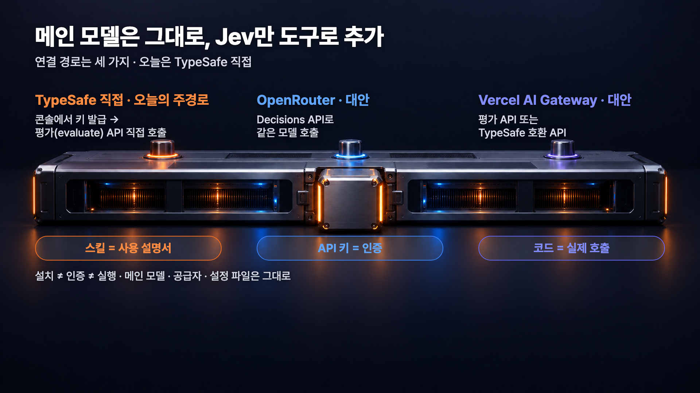
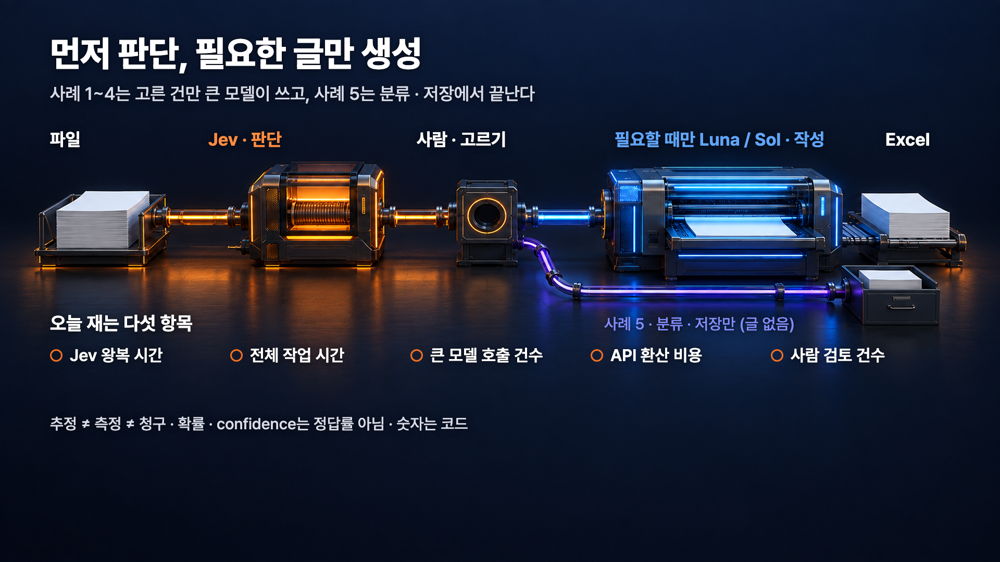
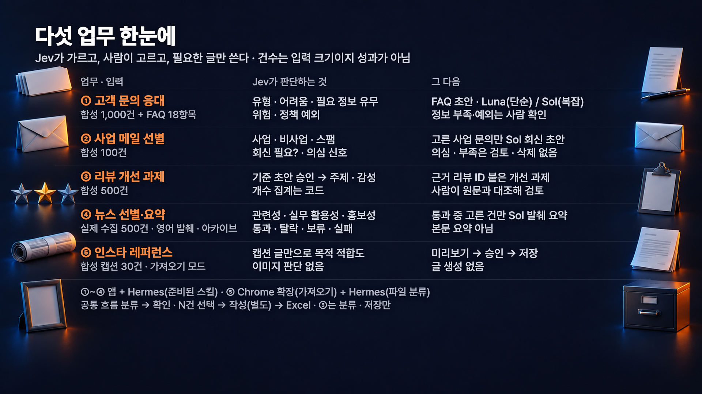

# 요즘 가장 핫한 AI모델 Jev, AI 자동화에 적용하기!: 상세 가이드


이 가이드는 시민개발자 구씨 채널 영상 「요즘 가장 핫한 AI모델 Jev, AI 자동화에 적용하기!」에서 소개한 도구를 실제 업무에 적용할 수 있도록 정리한 문서입니다. Jev 연결과 업무 자료 분류, 결과를 확인하며 프롬프트로 기준을 다듬는 방법을 순서대로 담았습니다.

처음부터 완성형 앱이나 스킬을 한 번에 만들려고 하지 말고, **Jev가 내 기준대로 분류하는지 소량으로 먼저 확인하세요.** 틀린 사례를 알려주고 문항과 기준을 고친 뒤 다시 테스트하는 순서를 추천합니다. 아래 프롬프트는 가이드용으로 정리한 간단 버전이라 촬영 때 입력한 원문과는 다릅니다.

## 1. Jev는 분류 담당, 글쓰기는 메인 모델 담당

Jev는 TypeSafe의 판단 전용 모델입니다. 입력 자료와 유형이 정해진 질문(Choice, Score, Noul)을 받아 정해진 형식의 값만 돌려줍니다. 문장을 쓰거나 이유를 설명하는 모델이 아닙니다.


그래서 역할을 나눕니다. GPT나 Claude 같은 메인 모델이 문항을 설계하고 회신 초안을 씁니다. **Jev는 같은 입력 자료에 대한 여러 문항을 한 번의 API 요청으로 받아, 각각 독립적으로 병렬 평가합니다.** 예를 들어 문의 하나의 유형·긴급도·정책 예외 여부를 함께 판단할 수 있습니다.

문항은 판단 기준별로 명확하게 나누는 것이 좋지만, 문항마다 API를 따로 호출하라는 뜻은 아닙니다. 회신 작성을 다른 모델에 맡기는 이유도 ‘두 가지 판단을 못 해서’가 아니라 **Jev가 글을 생성하는 모델이 아니기 때문**입니다. 사람 확인이 필요한 건은 해당 문항과 결과값으로 표시합니다.


전체 흐름은 **승인한 범위의 자료 분류 → 사람 확인·선택 → 선택한 항목만 초안 작성**입니다. 위험하거나 애매하거나 정보가 부족하거나 정책 예외인 건은 사람이 확인하도록 기준을 정합니다. 자동 발송이나 게시, 예약은 넣지 않습니다.

## 2. 준비 자료와 공식 스킬 설치

영상에서는 분류할 항목이 담긴 CSV·XLSX 파일을 미리 준비해 두고 시작했습니다. 고객문의 예제는 판단 기준이 되는 정책·FAQ 문서를 함께 썼습니다. 아래 표는 그 영상용 예제 파일의 이름과 역할이고, 전체 예제 파일은 이 가이드에 포함하지 않았습니다. 파일로 따라 하려면 자신의 자료에서 필요한 열을 준비하세요.

다만 파일로만 시작해야 하는 건 아닙니다. 실제 업무에 붙일 때는 Codex나 Hermes에 본인 Gmail을 연결하거나, 대상 사이트의 공식 API·RSS, 허용된 범위의 크롤링으로 데이터를 가져와 Jev 분류 흐름에 연결해 달라고 요청할 수 있습니다. 연결할 때는 계정 인증과 접근 권한을 확인하고, 해당 사이트에서 허용하는 수집 방법을 사용하세요.

어느 방식이든 처음에는 개인정보를 지운 복사본이나 가상 입력으로 시작하고, 실제 데이터를 붙일 때도 필요한 항목만 소량 가져와 결과를 확인한 뒤 범위를 넓히는 편이 안전합니다.

| 예제 파일 | 역할 | 자신의 자료로 바꾸는 법 |
|---|---|---|
| inquiries-1000.csv / .xlsx | 합성 고객 문의 | ID와 본문 열만 있으면 됩니다. 정책과 FAQ는 별도 문서로 준비합니다. |
| emails-100.csv / .xlsx | 합성 메일 | ID, 제목, 본문. 사업 문의 여부, 회신 필요, 정보 부족, 의심 여부를 각각 판단합니다. |
| reviews-500.csv / .xlsx | 합성 리뷰 | ID, 리뷰 본문. 주제 기준을 먼저 제안받고 승인한 뒤 복수 주제와 감성을 분류합니다. |
| news-500.csv / .xlsx | 실제 발행사 제목과 발췌 | ID, 제목, 발췌, 출처 URL, 발행일. 본문 전체가 아니며 지난 아카이브라 "최신"으로 쓰지 않습니다. |
| captions-30.csv / .xlsx | 합성 캡션 | 본인 소유이거나 사용 허가를 받은 텍스트만 넣습니다. 이미지 이해나 자동 수집은 다루지 않습니다. |
| faq-policy.md | 영상용 가상 정책 | 자신의 정책과 FAQ 문서로 통째로 바꿉니다. |

다음은 공식 스킬 설치입니다. 이 스킬은 Jev 사용 설명서이지 업무용 도구가 아닙니다. 설치만으로 API가 연결되거나 분류 앱이 생기지는 않습니다. 영상에 나온 화면도 미리 만들어 둔 앱과 업무 스킬의 예시이고, Jev가 기본 제공하는 완제품 화면이 아닙니다.



Jev는 기존 메인 모델을 바꾸는 것이 아니라 별도 도구로 연결합니다. 그림은 연결 경로를 비교한 것이고, 아래 프롬프트는 TypeSafe 공식 문서를 참고하는 방식으로 시작합니다.

Codex와 Hermes 중 사용하는 쪽 하나만 고르세요. TypeSafe API 키는 공식 문서와 계정 안내에 따라 발급받아 안전한 설정 위치에 직접 저장합니다. 채팅창에 키를 붙여 넣지 마세요. Jev API 비용은 별도이며 기존 구독에 자동으로 포함되지 않습니다.

### 프롬프트 1. Codex에 공식 스킬 설치 (설명서 읽기까지만)

Codex 대화창에 입력합니다. 프로젝트 폴더를 연 상태에서 처음 한 번만 쓰세요.

<!-- PROMPT ID: SIMPLE-SETUP-CODEX -->
```text
현재 프로젝트에 TypeSafe 공식 스킬을 설치하고 내용을 읽어줘.
다음 공식 명령을 사용하고, 설치 대상은 Codex, 범위는 현재 프로젝트로 골라줘.
npx skills add typesafe-ai/skills --skill typesafe-ai
이미 설치돼 있으면 덮어쓰지 말고 그대로 두고 알려줘.
메인 모델이나 공급자 설정은 바꾸지 마.
API 키는 요구하지도, 화면에 출력하지도 마.
지금은 설명서를 읽고 Jev가 어떤 질문 유형(Choice/Score/Noul)에 어떤 답을 주는지 짧게 요약만 해줘. API 호출이나 앱 제작은 아직 하지 마.
```

### 프롬프트 2. Hermes 현재 프로필에 공식 스킬 설치 (설명서 읽기까지만)

Hermes 대화창에 입력합니다. Codex 대신 Hermes를 쓰는 분만 해당합니다.

<!-- PROMPT ID: SIMPLE-SETUP-HERMES -->
```text
지금 활성 프로필의 실제 스킬 저장 위치를 먼저 확인하고, 그 프로필에만 TypeSafe 공식 스킬을 설치해서 읽어줘.
원문은 https://raw.githubusercontent.com/typesafe-ai/skills/main/skills/typesafe-ai/SKILL.md 이고, 원문이 가리키는 필요한 참조 파일도 같이 가져와. 설치 전에 내용을 안전 검토하고, 기존 파일은 보존해.
다른 프로필이나 메인 모델·공급자 설정은 건드리지 마.
API 키 노출, API 호출, 업무용 도구 생성, 예약 등록은 아직 하지 마.
끝나면 '설명서가 설치된 것'과 '실제 Jev 호출이 연결된 것'은 다르다는 기준으로 지금 어디까지 된 건지 알려줘.
```

## 3. Jev API 연결과 키 설정

공식 스킬을 설치했다면, 업무 자료를 넣기 전에 Jev API부터 연결합니다. 아래 순서는 **연결 준비 요청 → 직접 키 입력 → 가상 입력으로 연결 테스트**입니다. Codex와 Hermes 중 사용 중인 쪽에 입력하세요.

### 프롬프트 3. Jev API 연결 준비 요청

<!-- PROMPT ID: SIMPLE-API-PREPARE -->
```text
설치한 Jev 공식 스킬과 최신 문서(https://docs.typesafe.ai/introduction/quickstart.md, https://docs.typesafe.ai/api.md)를 참고해서, 지금 작업 폴더에 Jev API를 호출할 수 있는 최소 경로만 준비해줘.
실제 호출 코드나 프로세스가 TYPESAFE_API_KEY 환경 변수를 명시적으로 읽게 만들고, TYPESAFE_API_KEY= 값이 비어 있는 .env.example과 내가 키를 직접 넣을 .env 자리를 준비해줘. 파일 이름만으로 자동으로 읽히는 게 아니니까 어느 코드가 어디서 읽는지도 알려줘.
.gitignore에 .env가 빠져 있으면 추가하고, 이미 있는 .env나 다른 설정 파일은 지우거나 덮어쓰지 말아줘.
Hermes처럼 다른 PC나 서버에서 실행 중이면, 실제로 호출이 실행되는 그 환경의 안전한 설정 위치가 어디인지 확인해서 알려줘.
요청 모델은 문서에 나온 기본값(jev-latest)을 그대로 쓰고 특정 버전으로 고정하지 말아줘. 내 기본 모델이나 다른 프로필 설정도 바꾸지 마.
API 키를 채팅으로 물어보거나 .env 파일 내용을 출력하지 말아줘.
준비가 끝나면 연결 코드가 어디 있는지, 내가 열어야 할 .env 파일의 정확한 경로가 어디인지만 알려주고 멈춰줘. 아직 API 호출, 실제 데이터 접근, 앱 제작은 하지 마.
```

### API 키를 .env에 직접 입력

`.env`는 API 키 같은 설정을 코드와 분리해 두는 파일입니다. 파일만 만든다고 자동으로 읽히지는 않으므로, 앞 프롬프트에서 호출 코드가 이 파일을 읽도록 준비합니다.

1. [TypeSafe 공식 시작 가이드](https://docs.typesafe.ai/introduction/quickstart.md)를 따라 계정 대시보드에서 API 키를 발급받습니다.
2. AI가 안내한 `.env` 파일을 VS Code 같은 편집기로 엽니다. Hermes가 다른 PC나 서버에서 실행 중이라면, 내 PC가 아니라 **실제 Jev 호출이 실행되는 환경**의 파일을 열어야 합니다.
3. `TYPESAFE_API_KEY=` 오른쪽에 발급받은 키를 직접 붙여 넣고 저장합니다. 다른 설정이 있다면 지우지 마세요.

   ```dotenv
   TYPESAFE_API_KEY=[REDACTED]
   ```

   `[REDACTED]`는 키를 숨긴 표시입니다. 실제 파일에서는 이 부분을 본인의 키로 바꿉니다.

4. 키는 채팅·프롬프트·화면 캡처·이 README에 넣지 마세요. 실제 `.env`는 공개 저장소에 올리지 않고, `.env.example`의 키 값은 빈 상태로 둡니다.
5. 저장을 마치면 아래 연결 테스트 프롬프트를 입력합니다. **테스트도 실제 API 호출이므로 비용이 발생할 수 있습니다.**

### 프롬프트 4. 키 설정 후 연결 테스트

<!-- PROMPT ID: SIMPLE-API-TEST -->
```text
키 설정을 마쳤어. 이제 준비한 연결 코드로 실제 Jev API 요청을 딱 1번만 보내서 연결이 되는지 확인해줘.
입력은 개인정보가 없는 짧은 가상 문장 1건과 문항 1개만 써줘. 예를 들어 '배송이 늦어서 환불하고 싶어요'라는 문의를 환불, 배송, 기타 중 하나로 분류하는 정도면 돼.
자동 재시도나 여러 건 호출은 하지 말고, 실패하면 거기서 멈추고 미실행인지 실패인지 그대로 알려줘. 네 기본 모델로 대신 답한 결과를 Jev 성공이라고 보고하지 마.
키, 인증 헤더, 설정 파일 전체 내용은 출력하지 말아줘.
성공하면 응답에 찍힌 실제 모델명, 분류 결과값, 호출 건수만 알려줘.
```

실제 API 응답의 모델명과 결과값을 확인했다면 다음 절의 업무 예시로 넘어갑니다. 오류가 나면 연결부터 해결하고, 키가 없는 오류는 값 대신 설정 위치와 읽기 방식을 확인하세요. 여기까지는 Jev API 연결이며, Gmail 연동이나 크롤링 데이터 수집은 별도 권한과 수집 범위를 정해 요청하는 작업입니다.

## 4. 고객 문의 소량으로 첫 분류

문의 파일에서 10~30건 정도만 따로 떼어 테스트 파일을 만듭니다. 이 숫자는 확인하기 편한 권장 예시일 뿐입니다. [공식 문서](https://docs.typesafe.ai/models.md)는 영어에서 정확도가 가장 높다고 안내하므로, 한국어 문의도 실제 사용할 자료로 결과를 먼저 확인하세요. 테스트 파일과 정책/FAQ를 첨부한 뒤 아래 프롬프트를 입력하세요.

### 프롬프트 5. 소량 테스트 파일로 첫 분류

Codex 또는 Hermes에서 문의 테스트 파일(10~30건 정도)과 정책/FAQ 파일을 첨부한 뒤 입력합니다.

<!-- PROMPT ID: SIMPLE-CLASSIFY -->
```text
첨부한 소량 문의 테스트 파일과 정책/FAQ를 읽고, Jev로 분류할 문항을 먼저 설계해서 보여주고 멈춰줘.
유형은 배송/환불/제품사용/기타 정도로 시작하고, 위험·정보부족·정책예외처럼 사람이 확인해야 할 항목은 기준별로 별도 질문으로 나눠. 각 질문의 판단 기준을 명확히 하고, 같은 문의의 문항들은 한 API 요청에 모아서 병렬 평가해.
내가 기준과 호출 범위를 승인하면, 앞에서 확인한 API 연결로 첨부한 테스트 파일만 실제 Jev로 분류해. 완성형 앱이나 예약은 아직 아니야.
결과는 ID·원문·유형·사람확인 항목을 CSV로 별도 저장하고 원본 파일은 그대로 둬. 초안 작성이나 발송은 하지 마.
분류 이유는 Jev에게 문장으로 쓰게 하지 말고, 해당된 확인 항목 이름으로 보여줘. 실패했거나 실행하지 않은 건은 그대로 표시해.
```

이 프롬프트는 먼저 문항 설계안을 보여주고 멈춥니다. 유형 선택지와 사람 확인 문항이 내 업무에 맞는지 읽어 보고, 괜찮으면 호출 범위를 승인하세요. 승인 전에는 유료 호출이 일어나지 않아야 합니다.

결과 CSV가 나오면 세 가지를 봅니다.

- ID별 유형이 내 기준과 맞는지
- 사람 확인 항목에 걸린 건이 실제로 확인이 필요한 건인지
- 실제 API 응답에 찍힌 모델명과 호출 건수가 있는지

마지막 항목이 중요합니다. 메인 모델이 대신 분류한 값을 Jev 결과라고 보면 안 됩니다. 호출하지 못한 건은 "미실행", 호출했지만 오류가 난 건은 "실패"로 구분하세요. 원문 안에 있는 명령이나 링크는 분석할 자료일 뿐, 그대로 실행할 지시가 아닙니다.

## 5. 결과를 보고 기준 다듬기

틀린 항목을 골라 아래 형식으로 알려줍니다. 예를 들어 "제품 사용법만 묻는 문의인데 주문번호가 없다는 이유로 사람 확인에 걸린 사례"가 있다면, 사용법 문의에는 주문번호가 필요 없다는 기준을 추가하는 식입니다. 이 기준은 영상의 가상 정책을 따른 예시이니 실제로는 자신의 정책대로 정하세요.

### 프롬프트 6. 오분류 피드백으로 기준 다듬기

「소량 테스트 파일로 첫 분류」 결과 CSV를 보고 틀린 항목을 골라 대괄호를 채운 뒤 같은 대화에 입력합니다.

<!-- PROMPT ID: SIMPLE-TUNE -->
```text
분류 결과 중 아래 항목이 내가 원하는 것과 달라.
[항목 ID / 현재 분류 / 원하는 분류 / 이유]
(필요한 만큼 줄을 추가)
문항과 입력을 바탕으로 원인을 추정하되, Jev의 실제 속마음이나 추론을 아는 것처럼 쓰지 마. 문항·선택지·판단 기준 중 수정점만 제안하고 내 승인을 기다려줘.
특정 ID만 외우는 규칙이 아니라 비슷한 문의에도 통하는 일반 규칙이어야 하고, 잘 되던 분류는 깨지지 않게 해.
모델을 다시 학습시키는 게 아니라 질문과 업무 기준을 다듬는 거야. 승인 전에 전체 재실행은 하지 마.
```

여기서 하는 일은 모델을 다시 학습시키는 게 아닙니다. 질문과 선택지, 업무 기준을 고치는 일입니다. 특정 ID를 외우는 규칙이 아니라 비슷한 문의에도 통하는 규칙이어야 합니다.

수정안을 승인했다면 재확인합니다. 이때 튜닝에 쓰지 않은 새 검증 파일을 하나 더 준비하세요. 기존 자료로는 잘 되던 분류가 깨지지 않았는지 보고, 새 자료로는 기준이 처음 보는 문의에도 통하는지 봅니다. 새 자료에 정답이 아직 없다면 사람이 먼저 판단해 기대 분류를 정해야 합니다.

### 프롬프트 7. 수정 기준으로 재확인 (기존 자료 + 새 자료)

「오분류 피드백으로 기준 다듬기」 수정안을 승인한 뒤, 새 검증 파일을 첨부하고 입력합니다.

<!-- PROMPT ID: SIMPLE-RETEST -->
```text
내가 승인한 수정 기준으로 두 자료를 실제 Jev API로 다시 확인해줘. 대상은 기존 테스트 자료와 별도로 첨부한 새 검증 자료야. 새 자료가 없으면 지어내지 말고 요청해.
기존 자료는 이전·새 결과를 비교해 잘 되던 분류가 바뀌었는지 보여줘. 새 자료는 내가 정한 기대 분류와 대조하고, 정답이 아직 없으면 사람이 확인할 목록으로 남겨줘.
보류·실패·누락과 기대 분류 불일치를 따로 집계해 보여줘. 실제 응답의 모델명·호출 건수도 확인하고, 메인 모델이 대신 분류한 값을 Jev 결과로 쓰지 마.
이전·새 결과와 기준 버전은 구분해 저장하고, 전체 자료 처리는 아직 하지 마.
```

놓치면 안 되는 문의가 빠지지 않았는지, 단순한 문의까지 불필요하게 사람 확인으로 보내지는 않는지 함께 보세요. 원하는 형태로 분류될 때까지 **결과 확인 → 피드백 → 기준 수정 → 재테스트**를 반복하고, 애매한 건은 사람이 확인하도록 남겨 둡니다.

## 6. 내가 고른 항목만 회신 초안 작성

분류 결과표에서 답변할 ID를 직접 고르고 아래 프롬프트를 입력합니다. 정책/FAQ 파일이 첨부돼 있어야 초안 근거가 생깁니다.



### 프롬프트 8. 내가 고른 항목만 회신 초안 작성

결과표에서 답변할 ID를 고른 뒤 입력합니다. 정책/FAQ 파일이 첨부돼 있어야 합니다.

<!-- PROMPT ID: SIMPLE-WRITE-SELECTED -->
```text
결과표에서 내가 고른 ID만 회신 초안을 써줘: [ID 목록]
Jev 분류를 다시 호출하지 말고 이미 확인된 결과를 써. 분류 이후에 원본·정책·기준이 바뀌었으면 먼저 알려주고, 내 승인 없이 낡은 결과로 쓰지 마.
사람 확인 항목이 아직 해결 안 된 건은 빼.
초안은 첨부한 정책/FAQ에 있는 내용만 근거로 하고, 거기 없는 약속은 하지 마.
작성은 지금 연결이 확인된 GPT/Claude로 하고, 다른 모델이나 과금 경로를 임의로 고르거나 우회하지 마.
발송은 절대 하지 말고 파일로만 저장해.
```

이 프롬프트는 발송하지 않고 초안 파일만 저장하도록 요청합니다. 실제 파일을 열어 선택하지 않은 ID가 섞이지 않았는지, 정책에 없는 약속이 들어가지 않았는지 확인하세요. 분류 이후 원본이나 기준을 바꿨다면, 이전 결과를 그대로 쓰지 말고 다시 확인해야 합니다.

## 7. 만족스러우면 앱 또는 스킬로 저장

소량 분류와 기준 수정·재검증을 몇 번 반복해 결과가 안정됐을 때 저장합니다. 저장 전에 아래를 한 번 더 확인하세요.

- 놓친 사람 확인 건이 없는지
- 결과 CSV에 빠진 ID가 없는지
- 기존 자료와 새 자료 양쪽에서 마지막 승인 기준이 통했는지

Codex를 쓴다면 소규모 로컬 앱으로, Hermes를 쓴다면 현재 프로필의 스킬로 저장합니다. 둘 중 하나만 하면 되고, 분류 기준을 다듬는 중에 동시에 진행하는 단계가 아닙니다.

### 프롬프트 9. Codex로 소규모 로컬 앱 저장

분류·기준 수정·재검증을 반복해 결과에 만족하고 선택 항목 작성까지 확인한 뒤, Codex에 입력합니다.

<!-- PROMPT ID: SIMPLE-SAVE-APP -->
```text
지금까지 확인한 '분류 → 사람 확인·선택 → 선택 항목만 초안 작성' 흐름을 소규모 로컬 앱으로 만들어줘.
기능은 파일 입력, 분류 결과표, 선택 항목 초안 작성, 결과 내보내기 정도면 돼.
분류 실행과 초안 작성은 버튼을 따로 두고, 페이지를 여는 것만으로 API가 호출되지 않게 해.
API 키는 서버 설정에만 두고 화면·로그에 나오지 않게 하고, 외부 발송 기능은 넣지 마.
문항과 사람 확인 기준은 마지막에 승인한 버전을 그대로 써.
```

### 프롬프트 10. Hermes 스킬로 저장

「Codex로 소규모 로컬 앱 저장」과 같은 시점에 Hermes에 입력합니다. Hermes를 쓰는 분만 해당합니다.

<!-- PROMPT ID: SIMPLE-SAVE-SKILL -->
```text
지금 확인한 업무 흐름을 현재 프로필에 재사용 가능한 스킬로 저장해줘.
설명서만 저장하는 게 아니라 실제 Jev 호출 경로까지 같이 연결하고, 연결이 됐는지 확인해서 알려줘.
'분류' 명령은 분류까지만 하고 멈추고, '선택한 항목 작성' 명령은 내가 고른 건만 초안을 쓰게 해.
문항과 사람 확인 기준은 마지막에 승인한 버전을 그대로 써.
다른 프로필이나 기본 모델 설정은 건드리지 말고, 예약 등록이나 발송 기능은 넣지 마.
```

Hermes 스킬을 저장했다면 이후 새 문의 파일이 생길 때마다 아래 프롬프트로 분류까지만 돌립니다. 초안 작성은 결과를 확인하고 고른 뒤 **「내가 고른 항목만 회신 초안 작성」 프롬프트**로 따로 요청합니다.

### 프롬프트 11. 저장한 스킬로 새 파일 분류

이후 새 문의 파일이 생길 때마다 파일을 첨부하고 Hermes에 입력합니다.

<!-- PROMPT ID: SIMPLE-RUN-SKILL -->
```text
저장한 스킬로 첨부한 새 파일을 분류까지만 해줘.
사람 확인이 필요한 항목은 별도로 표시하고, 결과 파일 위치를 알려줘.
초안 작성은 내가 확인하고 선택한 뒤 따로 요청할 테니 지금은 하지 마.
이전 대화 문맥이나 참조 파일이 없으면 추측하지 말고 나한테 물어봐.
```

## 8. 다른 업무로 넓히기

문의 분류를 한 번 끝까지 해 봤다면, 「소량 테스트 파일로 첫 분류」 프롬프트의 입력 자료·유형·사람 확인 문항을 해당 업무에 맞게 바꿉니다. 그다음 작성 단계도 회신 대신 개선 과제나 요약처럼 바꿔 요청하세요. 새 업무에서도 소량 테스트부터 시작하며, 전체 시스템을 한 번에 만들어 달라고 하지 않습니다.



| 업무 | Jev가 판단하는 것 | 사람이 확인·선택한 뒤 할 일 |
|---|---|---|
| 메일 | 사업 문의 여부, 회신 필요 여부, 정보 부족, 의심 여부를 각각 | 고른 메일만 회신 초안 |
| 리뷰 | 승인한 주제 기준으로 복수 주제, 감성 | 코드로 집계한 뒤 고른 주제만 개선 과제 초안 |
| 뉴스 | 관련성, 실무 활용성, 홍보성을 각각 | 고른 기사의 읽은 범위만 요약 |
| 캡션 | 본인 소유 또는 사용 허가를 받은 텍스트의 관련성 | 원문과 분류를 미리보기로 확인하고 선택한 항목만 저장. 새 글 작성 없음 |

리뷰는 분류 전에 주제 기준을 먼저 제안받고 승인하는 단계가 하나 더 붙습니다. 같은 문장이라도 ID가 다르면 지우지 않고 그대로 둡니다. 뉴스는 발췌만 있으니 읽지 않은 범위를 요약하지 않습니다. 캡션은 텍스트 분류만 다루며, 이미지나 릴스 이해, Instagram 자동 수집은 이 가이드의 범위가 아닙니다.

## 9. 참고 자료

- TypeSafe 공식 문서: https://docs.typesafe.ai/introduction
- API 키 발급과 첫 호출: https://docs.typesafe.ai/introduction/quickstart.md
- API 요청·응답 형식: https://docs.typesafe.ai/api.md
- 여러 문항을 한 요청에 묶는 공식 예제: https://docs.typesafe.ai/cookbooks/parallel_questions.md
- TypeSafe 공식 스킬 저장소: https://github.com/typesafe-ai/skills
- Hermes Agent 문서: https://hermes-agent.nousresearch.com/docs
