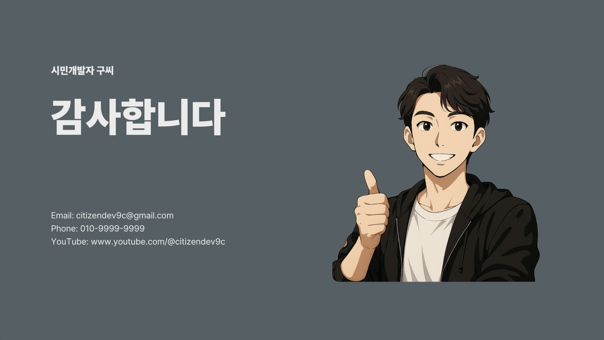

# 미리캔버스 MiriCle AI로 제안서 제작하기



미리캔버스의 MiriCle AI 기능을 활용하여 전문적인 제안서를 빠르고 효율적으로 제작하는 방법을 안내합니다. 디자인 경험이 부족해도 AI의 도움으로 고품질의 프레젠테이션을 만들 수 있습니다.

## 목차

- [미리캔버스와 MiriCle AI 개요](#미리캔버스와-miricle-ai-개요)
- [MiriCle AI 주요 기능](#miricle-ai-주요-기능)
- [AI 프레젠테이션 기본 사용법](#ai-프레젠테이션-기본-사용법)
- [고급 활용 기법](#고급-활용-기법)
- [세부 디자인 최적화](#세부-디자인-최적화)
- [활용 팁](#활용-팁)
- [요금제 및 추천사항](#요금제-및-추천사항)

## 미리캔버스와 MiriCle AI 개요


### 미리캔버스의 핵심 장점

미리캔버스는 프레젠테이션, 포스터, 카드뉴스, 유튜브 썸네일 등 다양한 디자인 작업을 손쉽게 할 수 있는 온라인 디자인 플랫폼입니다.

**주요 특징:**
1. **50만 개 이상의 다양한 템플릿** - 빠른 디자인 작업 시작점 제공
2. **저작권 걱정 없는 리소스** - 폰트와 2000만 개 이상의 디자인 요소
3. **풍부한 한글 폰트** - 한국 사용자를 위한 최적화된 폰트 라이브러리
4. **직관적인 UI** - 별도 교육 없이도 쉽게 사용 가능

### MiriCle AI란?

MiriCle은 미리캔버스에 통합된 AI 기능으로, 외부 AI 도구 없이도 디자인 작업의 생산성을 극대화할 수 있는 종합 솔루션입니다.

## MiriCle AI 주요 기능


### 1. AI 프레젠테이션 생성
- **기능**: 주제나 내용 입력만으로 프레젠테이션 구조 자동 생성
- **활용**: 제안서, 보고서, 강의 자료 등의 초안 작성
- **장점**: 논리적 구조와 적절한 템플릿 자동 적용

### 2. AI 이미지 생성
- **기능**: 텍스트 설명을 통한 맞춤형 이미지 생성
- **활용**: 일러스트, 아이콘, 배경 이미지 제작
- **장점**: 저작권 걱정 없는 독창적 이미지 확보

### 3. AI 이미지 편집
- **기능**: 배경 제거, 화질 개선, 영역 지우개 등
- **활용**: 기존 이미지 최적화 및 보정
- **장점**: 포토샵 등 전문 툴 없이도 고급 편집 가능

### 4. AI 라이팅
- **기능**: 텍스트 내용 수정, 요약, 개선 제안
- **활용**: 슬라이드 내용 최적화 및 가독성 향상
- **장점**: 전문적인 문서 작성 지원

## AI 프레젠테이션 기본 사용법

### 1. 프롬프트 기반 제작

**단계별 진행:**
1. 미리캔버스 접속 후 '디자인 만들기' 선택
2. 'AI로 프레젠테이션 만들기' 클릭
3. '주제 입력하기' 선택
4. 구체적인 프롬프트 작성

**프롬프트 예시:**
```
Make(자동화 툴)를 활용해 경쟁사 유튜브 채널 크롤링 자동화를 하는 시스템 제작 대행 제안서
```

**AI 생성 구조 예시:**
- 프로젝트 개요
- Make의 장점
- 시스템 구조 설명
- 구현 계획 및 일정
- 기대 효과
- 결론 및 제안

### 2. 템플릿 선택 및 생성

1. AI가 제안한 개요 검토 및 수정
2. 원하는 디자인 템플릿 선택
3. 1-2분 내 자동 생성 완료
4. 각 슬라이드별 내용 및 디자인 확인

## 고급 활용 기법

### 1. 자료 기반 제작

기존 자료가 있는 경우 더욱 정확한 프레젠테이션 제작이 가능합니다.

**자료 붙여넣기 방법:**
1. 'AI로 프레젠테이션 만들기' 선택
2. '자료 붙여넣기' 옵션 선택
3. 마크다운, 텍스트, 또는 기타 형식 자료 입력
4. AI가 자료 기반으로 구조화된 개요 생성

**PDF 업로드 방법:**
1. 'PDF 업로드' 옵션 선택
2. 기존 문서나 자료 파일 업로드
3. AI가 내용 분석 후 프레젠테이션 구조 제안

### 2. 세부 편집 작업

**브랜딩 요소 수정:**
- Ctrl+F로 일괄 텍스트 변경
- 회사명, 브랜드명 등 통일성 있게 수정
- 로고 및 컬러 스킴 적용

## 세부 디자인 최적화

### 1. AI 이미지 생성 활용

**"디자인에 어울리는 요소" 기능:**
```
기대효과: 월 40시간 → 2시간으로 시간 절약을 나타내는 이미지
```

**결과:**
- 시간 절약 개념을 시각화한 여러 이미지 옵션 제공
- 프레젠테이션 스타일에 맞는 디자인 자동 적용

### 2. 이미지 편집 기능

**배경 제거:**
- 로고 이미지의 불필요한 배경 제거
- 투명 배경으로 변환하여 디자인 통합성 향상

**화질 개선:**
- 스크린샷이나 저화질 이미지 개선
- 프레젠테이션 품질 향상

### 3. 커스텀 아이콘 제작

**AI 아이콘 생성 프롬프트 예시:**
```
하나의 아이콘 안에 성과 순위를 상징하는 요소들이 조화롭게 배치된 디자인. 중앙에는 순위 숫자가 적힌 회색(#9e9e9e) 메달이 강조되고, 그 뒤로는 점점 높아지는 흰색 막대그래프와 곡선을 그리며 올라가는 흰색 상승 화살표가 배치된다. 그래프 위에는 흰색 눈 아이콘과 하트 아이콘이 얹혀 있어 각각 조회수와 인게이지먼트를 상징하며, 오른쪽에는 흰색 로켓이 날아오르며 성장률을 표현한다. 전체 아이콘은 미니멀 벡터 스타일, 투명 배경 위에 흰색 선과 도형으로 구성되어, 어떤 배경에서도 잘 어울리는 단색 라인 아트 아이콘 느낌을 준다. 메달은 유일하게 #9e9e9e 색상으로 표현되어 중심을 강조한다
```

### 4. AI 라이팅 활용

**텍스트 최적화:**
- 긴 문장 요약하기
- 전문 용어 쉽게 설명하기
- 내용 구조화 및 가독성 개선

**사용 방법:**
1. 수정할 텍스트 선택
2. AI 라이팅 메뉴에서 "요약하기" 선택
3. 자동 생성된 요약문 검토 및 적용

### 5. 슬라이드 추가 및 확장

**"딱맞는 페이지 찾기" 기능:**
- 기존 디자인 스타일에 맞는 새 슬라이드 제안
- Contact, About, Thank you 등 표준 페이지 자동 생성
- 일관된 디자인 테마 유지

## 활용 팁

### 효과적인 사용 팁

1. **명확한 프롬프트 작성**
   - 구체적인 목적과 대상 명시
   - 포함하고 싶은 주요 내용 사전 정리
   - 원하는 톤앤매너나 스타일 언급

2. **단계별 접근**
   - 전체 구조 먼저 완성
   - 세부 디자인 요소 순차적 개선
   - 일관성 있는 브랜딩 요소 적용

3. **AI 기능 조합 활용**
   - 여러 AI 기능을 연계하여 사용
   - 이미지 생성 → 편집 → 텍스트 최적화 순서

## 요금제 및 추천사항

### 무료 버전
- 대부분의 기본 기능 제공
- 템플릿 및 기본 AI 기능 사용 가능
- 개인 프로젝트나 테스트 용도로 충분

### 프로 버전
- 고급 AI 기능 전체 사용
- 프리미엄 템플릿 및 요소 제공
- **1개월 무료 체험** 제공


## 참고 자료

- [미리캔버스 링크](https://www.miricanvas.com/s/2773)