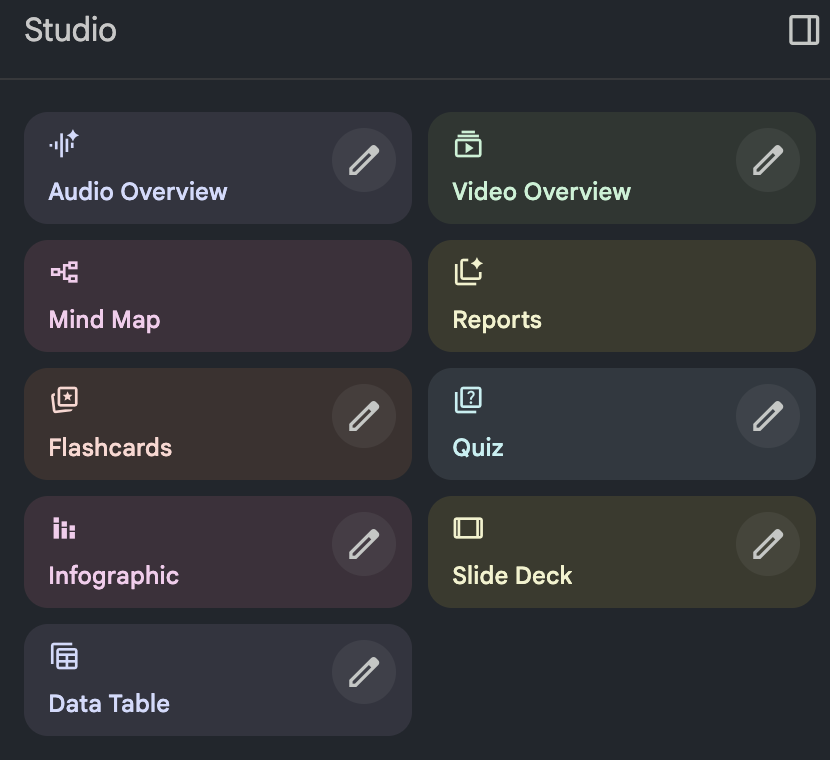

# NotebookLM 활용 가이드


Google의 AI 기반 리서치 도구 NotebookLM을 활용하여 효율적으로 학습하고 생산성을 높이는 방법을 안내합니다.

## 목차

- [NotebookLM 소개](#notebooklm-소개)
- [가격 구조](#가격-구조)
- [노트북 기본 설정](#노트북-기본-설정)
- [딥리서치 기능 활용](#딥리서치-기능-활용)
- [심화 분석 프롬프트](#심화-분석-프롬프트)
- [콘텐츠 생성 기능](#콘텐츠-생성-기능)
  - [오디오 오버뷰](#오디오-오버뷰)
  - [인포그래픽 제작](#인포그래픽-제작)
  - [슬라이드 덱 제작](#슬라이드-덱-제작)
  - [비디오 개요](#비디오-개요)
  - [리포트 및 커스텀 포맷](#리포트-및-커스텀-포맷)
  - [데이터 테이블](#데이터-테이블)
- [활용 팁](#활용-팁)

---

## NotebookLM 소개

NotebookLM은 Google에서 개발한 AI 기반 리서치 도구입니다. 신규 기능이 적용되어 성능이 크게 향상되었습니다.

### 핵심 컨셉

사용자가 PDF, 웹사이트, YouTube 영상, Google Docs 같은 다양한 소스를 노트북에 추가하면, AI가 해당 소스들을 기반으로 질문에 답변하고 다양한 콘텐츠를 생성합니다.

### 일반 AI 챗봇과의 차이점

| 구분 | 일반 AI 챗봇 | NotebookLM |
|------|-------------|------------|
| 답변 기반 | 학습된 일반 지식 + 툴 사용  | 사용자가 직접 추가한 소스만 |
| 출처 표기 | 선택적 | 강제 매칭 |
| 환각 현상 | 상대적으로 높음 | 일반 AI 대비 약 3배 적음 (논문 기반) |

NotebookLM은 특정 소스 기반 리서치나 새로운 지식 학습에 최적화된 도구입니다.

---

## 가격 구조

NotebookLM은 무료로도 핵심 기능 대부분을 사용할 수 있습니다.

### 무료 버전
- 기본 소스 업로드
- 질문 응답
- 기본 콘텐츠 생성

### 유료 버전 (Gemini 유료 구독 포함)
- 더 많은 소스 업로드 가능
- 오디오 오버뷰 확장 기능
- 슬라이드 제작 등 프리미엄 기능
- 참고 링크: https://gemini.google/subscriptions/

**권장 사항**: 무료 버전으로 먼저 사용해보고, 리밋에 자주 도달하거나 더 많은 소스가 필요한 경우 업그레이드를 고려하세요.

---

## 노트북 기본 설정

새 노트북 생성 후 Configure Notebook에서 기본 설정을 구성할 수 있습니다.

### 응답 모드 옵션

| 모드 | 설명 | 추천 용도 |
|------|------|----------|
| 기본 모드 | 일반적인 응답 스타일 | 범용 리서치 |
| 러닝 가이드 모드 | 학습에 최적화된 형태로 답변 | 새로운 주제 학습 |
| 커스텀 모드 | 응답 길이, 스타일 직접 설정 | 특정 목적에 맞춘 사용 |

학습 목적으로 사용할 때는 러닝 가이드 모드를 선택하는 것이 효과적입니다.

---

## 딥리서치 기능 활용

NotebookLM의 리서치 모드는 두 가지로 나뉩니다.

### Fast Research vs Deep Research

| 모드 | 특징 | 사용 시점 |
|------|------|----------|
| Fast Research | 빠른 간단한 답변 | 사이트 직접 추가, 빠른 소스 검색 |
| Deep Research | 깊이 있는 리서치 보고서 생성 | 다양한 소스 기반 종합 분석 필요 시 |

### Deep Research 활용 워크플로우

1. **검색어 입력**: 원하는 주제로 Deep Research 선택
   ```
   예: "AI 프롬프트 엔지니어링 최신 트렌드와 핵심 기법"
   ```

2. **리포트 생성 대기**: AI가 웹에서 관련 소스를 찾아 분석

3. **소스 추가**: 생성된 리포트의 Top 10~20 Sources를 노트북에 추가

이 과정을 통해 일일이 구글링해서 좋은 자료를 찾고 노트북에 추가하는 작업을 AI가 자동으로 처리합니다.

---

## 심화 분석 프롬프트

소스가 추가된 후 다양한 심화 분석을 진행할 수 있습니다.

### 1. 핵심 요약 리포트 요청

```
업로드된 소스들의 내용을 종합하여, 전체 흐름을 한눈에 파악할 수 있는 '핵심 요약 리포트(Executive Summary)'를 작성해 주세요. 다음 4가지 항목으로 정리해 주세요:

1. 핵심 주제 (One-Liner): 전체 내용을 관통하는 주제를 한 문장으로 명확히 정의
2. 주요 요점 (Key Takeaways): 가장 중요한 발견이나 주장 3~5가지 (핵심 근거 포함)
3. 맥락과 배경 (Context): 이 정보들이 어떤 배경에서 작성되었으며, 주요 대상 독자나 목적은 무엇인지
4. 필수 키워드: 이 주제를 이해하는 데 가장 중요한 핵심 용어(Key Terms) 5가지와 그 정의
```

### 2. 소스 간 불일치점 분석

```
제공된 소스들 사이에서 의견이 일치하지 않거나, 내용이 상충되는(contradictory) 부분을 모두 찾아주세요. 특히 전문가들의 견해가 갈리는 논쟁적인 지점이 있다면 구체적으로 명시해 주세요.
```

어떤 주제가 논쟁적인지, 전문가들의 의견이 갈리는 부분을 파악하여 균형 잡힌 학습이 가능합니다.

### 3. 정보 갭 분석

```
현재 소스들만으로는 파악하기 힘든 정보의 공백을 분석해 주세요. 이 주제를 완벽하게 이해하기 위해 논리적으로 빠져있거나 추가로 보완이 필요한 핵심 정보는 무엇인가요?
```

### 4. 반대 의견 및 소수 의견 탐색

```
이 소스들에 포함되지 않은 반대 의견이나 비주류 관점이 있을까요? 혹은 통념과 다르거나 잘 알려지지 않은 소수 의견이 있다면 제시해 주세요.
```

주류 의견만 보면 편향될 수 있으므로, 다양한 관점을 파악하는 데 유용합니다.

### 5. 추가 학습 방향 제안

```
이 소스들의 내용을 모두 숙지한 후, 해당 주제에 대한 전문성을 더 높이기 위해(Expertise) 다음 단계로 무엇을 더 깊이 연구하거나 학습하면 좋을지 구체적인 방향을 제안해 주세요.
```

### 6. 실무 적용 포인트 분석

```
[본인의 사업/직무] 관점에서 해당 정보를 기반으로 적용해볼 만한 포인트에 대한 전략적 제언을 해주세요.
```


---

## 콘텐츠 생성 기능 (신규 기능 위주 소개)

나노바나나 프로 출시 이후, 콘텐츠 생성 기능 품질이 크게 향상되었습니다.



### 오디오 오버뷰

소스 내용을 기반으로 AI 팟캐스트를 생성하는 기능입니다. 두 명의 호스트가 대화하는 형식으로 내용을 설명합니다.

**활용 예시**: 출퇴근길/산책시 학습, 운동 중 콘텐츠 소비

### 인포그래픽 제작

Studio 탭에서 Infographic 옵션을 선택하여 제작합니다.

**설정 옵션**
- 기반 소스 선택
- 인포그래픽 방향
- 상세 수준
- 스타일 및 색상
- 초점 영역

**프롬프트 예시**
```
핵심 요약 치트시트(Cheat sheet) 스타일로 만들어줘. 아이콘과 그리드 레이아웃을 사용해서 핵심 내용을 깔끔하게 정리해. 신뢰감을 주는 파란색과 흰색 테마를 사용하고 가독성을 높여줘.
```

나노바나나 프로 적용으로 한글 인포그래픽도 깔끔하게 생성됩니다. 다만 내용은 반드시 검토가 필요합니다.

### 슬라이드 덱 제작

발표 자료나 보고서 PPT 제작, 슬라이드 형태의 빠른 학습에 유용합니다.

**프롬프트 예시**
```
청중이 한눈에 이해할 수 있는 발표자용 슬라이드로 만들어줘. 줄글 대신 핵심 키워드와 불렛 포인트 위주로 간결하게 구성하고, 각 슬라이드마다 명확한 헤드라인과 결론을 제시해줘.
```

**추천 워크플로우**
1. NotebookLM에서 슬라이드 덱 생성
2. Canva로 가져와서 워터마크 제거 및 디자인 수정
3. PPT로 변환하여 텍스트 최종 수정

또는 간략한 버전의 슬라이드를 가이드 삼아 새로 제작하는 방법도 있습니다. 핵심은 NotebookLM이 뼈대를 잡아주어 빈 슬라이드에서 시작하는 것보다 빠르게 작업할 수 있다는 점입니다.

### 비디오 개요

소스 내용을 기반으로 짧은 설명 영상을 생성합니다.

**포맷 옵션**
- Explainer: 상세하게 설명하는 형식
- Brief: 핵심만 빠르게 전달하는 형식

**프롬프트 예시**
```
초보자도 쉽게 이해할 수 있는 강의 스타일로 설명해줘. 화이트보드의 장점을 살려 개념도와 화살표를 적극적으로 사용해 복잡한 관계를 시각적으로 연결해주고, 핵심 용어에는 동그라미를 쳐서 강조해줘.
```

**활용 예시**: 팀원에게 빠르게 내용 공유, 학습 콘텐츠 제작

### 리포트 및 커스텀 포맷

정해진 포맷뿐 아니라 커스텀 포맷으로 문서를 제작할 수 있습니다.

**요청 예시**
- 기획안 형식으로 만들어줘
- 보고서 형식으로 만들어줘
- 블로그 글 형식으로 만들어줘

소스 기반으로 체계적인 문서를 빠르게 생성하여 보고서 작성이나 기획안 작업 시간을 절약할 수 있습니다.

### 데이터 테이블

영상 촬영 후 생긴 기능으로, 소스에서 정보를 추출하여 구조화된 테이블 형태로 정리해주는 기능입니다.

**설정 옵션**
- 언어 선택 (한국어 지원)
- 추출할 정보 및 테이블 구조 정의

**프롬프트 예시**
```
소스에서 언급된 제품들을 테이블로 만들어줘. 컬럼은 브랜드/모델, 가격, 주요 기능으로 구성해줘.
```
```
주요 AI 모델별 프롬프트 엔지니어링 전략을 테이블로 정리해줘. 컬럼은 전략/기법 명칭, 설명, 적용 사례, 권장 모델, 기대 효과, 주의사항으로 구성해줘.
```

**핵심 기능**: 생성된 테이블은 Google Sheets로 내보내기(Export)가 가능하여 추가 편집이나 데이터 활용이 용이합니다.

**활용 예시**: 비교 분석표 작성, 제품/서비스 스펙 정리, 연구 자료 체계화, 학습 내용 요약 정리

---

## 활용 팁

### 효과적인 학습 워크플로우

1. **주제 선정**: 학습하고자 하는 주제 결정
2. **딥리서치 실행**: Deep Research로 관련 소스 자동 수집
3. **소스 추가**: 상위 소스들을 노트북에 추가
4. **핵심 요약 파악**: 핵심 요약 리포트 요청
5. **심화 분석**: 불일치점, 갭, 반대 의견 분석
6. **콘텐츠 생성**: 필요에 따라 인포그래픽, 슬라이드 등 생성
7. **실무 적용**: 본인 업무/사업 관점에서 적용 포인트 도출

### 주의사항

- 생성된 콘텐츠의 내용은 반드시 검토 필요
- 인포그래픽, 슬라이드는 실무 사용 전 디자인 수정 권장
- 학습 목적에 맞게 노트북 모드 설정 활용

---

## 결론

NotebookLM은 빠르게 변화하는 AI 시대에 새로운 기술과 트렌드를 효율적으로 학습할 수 있는 강력한 도구입니다.

**핵심 활용 포인트**
- 딥리서치로 소스 수집부터 심화 분석까지 체계적 접근
- 나노바나나 프로 기반의 향상된 비주얼 콘텐츠 생성
- 다양한 형식의 콘텐츠를 빠르게 제작하여 생산성 향상

---

## 참고 자료

- [NotebookLM 공식 사이트](https://notebooklm.google.com/)
- [Google 블로그 글](https://workspaceupdates.googleblog.com/2025/11/workspace-nano-banana-pro.html)
- [노트북lm 환각 현상 관련 논문](https://arxiv.org/abs/2509.25498)
