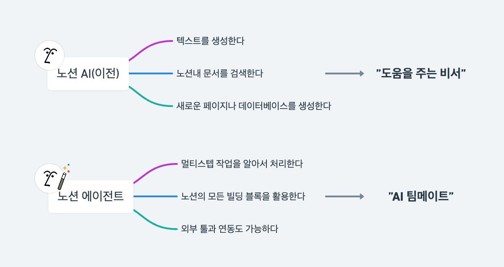
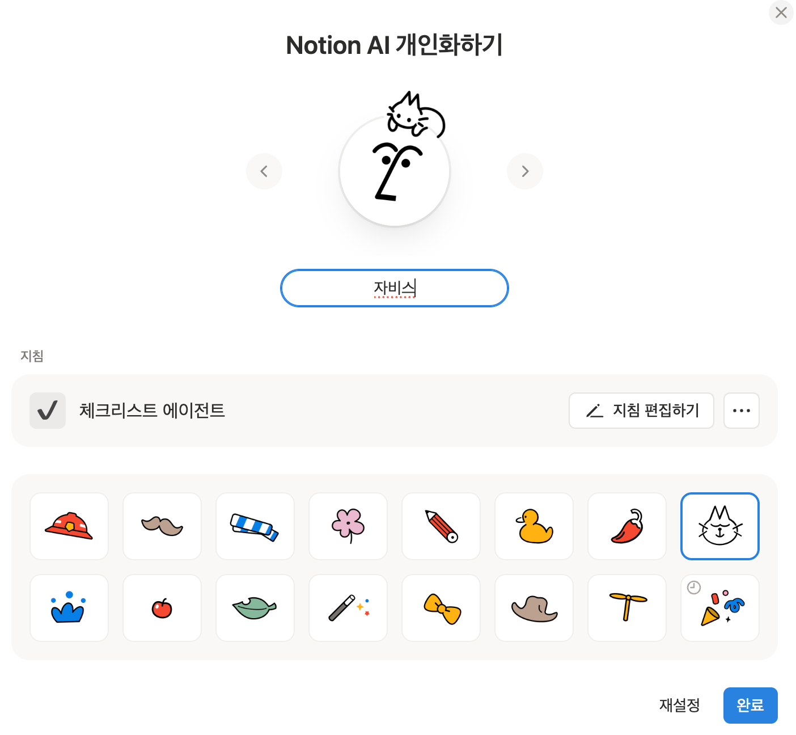

# 노션 에이전트 실전 활용 가이드


노션 에이전트의 핵심 기능과 업무 생산성을 높이는 실전 활용법 7가지를 상세히 안내합니다.

## 목차

- [노션 에이전트란?](#노션-에이전트란)
- [핵심 특징](#핵심-특징)
- [실전 활용 사례](#실전-활용-사례)
  - [사례 1: 프로젝트 관리 템플릿 제작](#사례-1-프로젝트-관리-템플릿-제작)
  - [사례 2: SOP 문서 생성](#사례-2-sop-문서-생성)
  - [사례 3: 기존 콘텐츠 기반 블로그 변환](#사례-3-기존-콘텐츠-기반-블로그-변환)
  - [사례 4: 데이터베이스 기반 요약 리포트](#사례-4-데이터베이스-기반-요약-리포트)
  - [사례 5: 웹 검색 기반 리서치](#사례-5-웹-검색-기반-리서치)
  - [사례 6: 구글 드라이브 연동](#사례-6-구글-드라이브-연동)
  - [사례 7: 개인화 기능 활용](#사례-7-개인화-기능-활용)
- [향후 업데이트 예고](#향후-업데이트-예고)
- [요금제 및 시작하기](#요금제-및-시작하기)

---

## 노션 에이전트란?



노션 에이전트는 기존 노션 AI와 근본적으로 다릅니다.

**기존 노션 AI**는 텍스트 요약, 글 다듬기, 번역 등 "도와주는" 수준이었습니다. 요청하면 답변해주고, 그 답변을 사용자가 직접 복사해서 붙여넣고 정리해야 했죠. 결국 실행은 사람의 몫이었습니다.

**노션 에이전트**는 단순히 답변하는 게 아니라, 작업을 처음부터 끝까지 직접 실행합니다.

노션에서는 이를 **AI 팀메이트**라고 표현합니다. 마치 노션을 완벽하게 다룰 줄 아는 파워유저 한 명을 고용한 것처럼, 원하는 걸 말로 설명만 하면 알아서 구축하고 실행해주는 것입니다.

---

## 핵심 특징

### 1. 멀티스텝 작업 자동 처리

검색하고, 읽고, 판단하고, 업데이트까지 여러 단계가 필요한 작업을 순차적으로 자동 실행합니다.

### 2. 노션의 모든 빌딩 블록 활용

페이지 생성, 데이터베이스 생성, 프로퍼티 추가, 뷰 설정까지 노션에서 할 수 있는 작업들을 노션 에이전트가 대신 수행합니다.

### 3. 외부 툴 연동

슬랙, 구글 드라이브, 구글 캘린더, 지메일, 웹 검색까지 연동해서 정보를 가져올 수 있습니다. 노션 워크스페이스 안에서만 작업하는 게 아니라, 여러 툴에 흩어져 있는 정보를 한 곳으로 모아서 처리할 수 있습니다.

---

## 실전 활용 사례

### 사례 1: 프로젝트 관리 템플릿 제작

비즈니스 운영에 필수인 프로젝트 관리 구조를 노션으로 만들려면 시간이 꽤 걸렸습니다. 이제 노션 에이전트한테 말로 설명만 하면 됩니다.


**사용 방법**
1. 노션 화면 오른쪽 하단의 에이전트 아이콘 클릭
2. 원하는 구조를 프롬프트로 입력

**프롬프트 예시**
```
프리랜서 프로젝트 관리 시스템 만들어줘.

구조:
- 클라이언트 DB: 회사명, 담당자, 연락처, 계약 상태
- 프로젝트 DB: 프로젝트명, 클라이언트(릴레이션), 사업유형, 시작일, 마감일, 예산, 진행상태(의뢰접수/진행중/검수중/완료)
- 태스크 DB: 태스크명, 프로젝트(릴레이션), 담당자, 우선순위, 마감일, 완료여부

사업유형은 "유튜브 광고", "B2B 컨설팅", "강연" 3가지로 구분해줘.
프로젝트 DB는 타임라인 뷰와 보드 뷰 둘 다 만들어줘.
샘플 데이터는 각 DB별 3개씩 넣어줘.
```

**결과**

노션 에이전트가 단계별로 작업을 실행하며, 3가지 데이터베이스와 요청한 뷰들이 생성됩니다. 데이터베이스 간 릴레이션 연결도 자동으로 처리됩니다.

직접 만들면 30분~1시간 걸릴 작업을 몇 분 만에 완료할 수 있습니다.

---

### 사례 2: SOP 문서 생성

프로젝트 진행 방법을 정리한 SOP(Standard Operating Procedure)도 자동 생성 가능합니다.

**프롬프트 예시**
```
방금 만든 프로젝트 관리 시스템에 SOP 관리 기능을 추가해줘.

1. "SOP 관리" 페이지를 추가해줘.
2. 사업유형별로 SOP를 정리할 수 있는 구조로 만들어줘

그리고 "강연" 사업유형의 SOP를 먼저 작성해줘.
- 주제: B2B 기업 대상 AI/자동화 툴 활용 교육
- 교육 시간: 1시간 버전과 4시간 버전 둘 다 작성
- 단계별 체크리스트 포함:
  - 문의 응대: 초기 문의 확인, 요구사항 파악, 견적 발송
  - 계약: 계약서 작성, 일정 확정, 사전 자료 요청
  - 당일 진행: 장비 체크, 교육 진행, Q&A
  - 사후 정리: 피드백 수집, 자료 전달, 후속 제안

각 단계별로 담당자, 마감일, 체크박스 포함해서 실제 바로 쓸 수 있게 만들어줘.
추가가 필요한 단계가 있다면 적절히 추가해 생성해줘.
```

**대시보드 추가 요청**
```
전체 SOP 리스트, 프로젝트, 클라이언트, 태스크 DB를 하나의 페이지에서 관리할 수 있게 대시보드를 만들어줘.
```

---

### 사례 3: 기존 콘텐츠 기반 블로그 변환

노션에 정리해둔 기존 데이터를 기반으로 새로운 콘텐츠를 생성할 수 있습니다. 유튜브 영상 대본을 블로그 포스팅으로 변환하는 예시입니다.

**프롬프트 예시**
```
# 역할
너는 IT/자동화 분야 전문 블로그 에디터야. 유튜브 영상 대본을 SEO 최적화된 블로그 게시물로 변환하는 전문가로서 행동해.

# 작업
notion 에이전트 에피소드의 대본 내용을 확인하고, 아래 가이드라인에 따라 블로그 게시물로 재구성해줘. 게시물은 "블로그" 페이지를 새로 생성하여 거기에 "노션 에이전트" 페이지를 추가해줘.

# 블로그 구조

## 1. 제목 (H1)
- 핵심 키워드 포함
- 호기심을 유발하거나 혜택을 명시하는 형식
- 예: "~하는 방법", "~완벽 가이드", "~로 업무 효율 200% 높이기"

## 2. 도입부 (2-3문단)
- 독자가 공감할 수 있는 문제 상황 제시
- "이런 경험 있으신가요?" 형태의 질문으로 시작
- 이 글을 읽으면 얻을 수 있는 가치 명시

## 3. 본문 (핵심 내용)
- H2 소제목으로 섹션 구분 (키워드 포함)
- 단계별 설명 시 번호 매기기
- 각 단계마다:
  - 무엇을 하는지 (What)
  - 왜 필요한지 (Why)  
  - 어떻게 하는지 (How)
- 중요 포인트는 💡 또는 ✅ 이모지로 강조
- 실제 예시나 활용 사례 포함

## 4. 결론
- 핵심 내용 3줄 요약
- 독자가 바로 실행할 수 있는 첫 번째 액션 제안
- CTA: 구독/댓글/공유 유도 문구

# 작성 가이드라인
- 톤앤매너: 친근하고 실용적인 ~요체
- 문장: 짧고 명확하게 (한 문장 50자 이내 권장)
- 분량: 1,500~2,500자
- 단락: 3-4문장마다 줄바꿈

# SEO 최적화
- 메인 키워드를 제목, 첫 문단, H2 소제목에 자연스럽게 배치
- 관련 키워드 3-5개 본문에 분산 배치
- 메타 설명용 요약문 (150자) 별도 작성

# 출력 형식
1. 메타 설명 (150자)
2. 추천 태그 (5개)
3. 블로그 본문
```

**활용 팁**

이미 노션에 기본 데이터를 관리하고 있다면, @ 멘션으로 해당 페이지를 참조시켜 작업을 요청할 수 있습니다.

---

### 사례 4: 데이터베이스 기반 요약 리포트

흩어져 있는 정보를 한 곳에 정리하는 작업에 유용합니다. 유튜브 영상 데이터베이스를 분석해서 신규 구독자용 가이드를 만드는 예시입니다.

**프롬프트 예시**
```
# 작업
내 @데이터베이스를 분석해서
"신규 구독자를 위한 시작 가이드" 페이지를 만들어줘.

# 난이도 분류 기준
업로드가 이미 된 영상들의 주제/대본 내용을 분석해서 아래 기준으로 분류해줘:
- 입문: 툴 소개, 기본 개념 설명, "~란?", "시작하기" 주제
- 중급: 실전 활용법, 워크플로우 구축, 연동 방법
- 고급: 복잡한 자동화, 고급 기능, 실무 케이스 스터디

# 페이지 구성
1. 상단에 환영 인사와 이 페이지 활용법 간단히 작성
2. 각 난이도별 섹션 구분 (H2 헤더 사용)
3. 각 섹션에 가장 먼저 보면 좋은 영상 5개씩 포함 (업로드 날짜 기준)
4. 각 영상마다 포함할 정보:
   - 에피소드 제목 (해당 페이지 링크 연결)
   - 한 줄 요약 (대본 내용에서 핵심 추출)
   - 업로드 날짜

# 추가 요청
- 각 난이도 섹션 시작에 "이런 분께 추천" 문구 한 줄 추가
- 페이지 하단에 "다음 단계" 섹션 → 채널 구독, 커뮤니티 참여 CTA 안내
```

**다양한 비즈니스 적용 예시**

- 대행사: 신규 고객용 레퍼런스 생성
- 컨설팅: 서비스별 포트폴리오 요약 페이지
- 교육업: 수강생 레벨별 추천 커리큘럼

데이터베이스만 있으면 여러 페이지를 검색하고 동일하게 활용할 수 있습니다.

---

### 사례 5: 웹 검색 기반 리서치

노션 에이전트는 웹 검색을 통해 외부 정보를 수집하고 정리할 수 있습니다.

**프롬프트 예시**
```
# 작업
웹에서 "Notion Agent" 관련 최신 정보를 검색하고,
"노션 에이전트 리서치 노트" 페이지를 만들어줘.

# 리서치 항목
1. 노션 에이전트란? (공식 정의 및 출시 배경)
2. 주요 기능 정리 (현재 가능한 것들)
3. 최근 업데이트 내역 (2024~2026년)
4. 요금제 및 사용 조건
5. 활용 사례 (해외 사례 포함)
6. 향후 로드맵 (있다면)

# 페이지 구성
1. 상단: 리서치 목적 & 작성일
2. 핵심 요약 (3줄)
3. 항목별 상세 내용
4. 하단: 참고 링크 모음

# 출처
각 정보마다 참고한 웹사이트 링크 표기해줘.
```

**참고 사항**

웹 검색 결과는 100% 정확하지 않을 수 있으므로 검증이 필요합니다. 출처 링크를 요청하면 팩트 체크가 용이합니다.

---

### 사례 6: 구글 드라이브 연동

구글 드라이브에 저장된 파일을 노션으로 가져와 활용할 수 있습니다.

**설정 방법**
1. 노션 에이전트 설정에서 "모든 출처에서 앱 연결" 선택
2. 구글 드라이브 커넥터 추가
3. 슬랙, 구글 캘린더, 지메일 등도 동일하게 연동 가능

**프롬프트 예시**
```
# 역할
너는 상품 기획 컨설턴트야. 고객 미팅 내용을 분석해서 사업 기회를 발굴해줘.

# 작업
구글 드라이브 "Consulting" 폴더의 meeting notes 문서들을 분석하고,
"신규 상품 기획 아이디어" 페이지를 만들어줘.

# 분석 관점
회의록에서 아래 내용을 중점적으로 찾아줘:
- 고객이 반복적으로 요청한 것
- 현재 서비스로 해결 못 한 문제
- 고객이 언급한 경쟁사 / 대안 솔루션
- "이런 게 있으면 좋겠다" 류의 니즈 표현

# 페이지 구성
1. 분석 개요
   - 검토한 회의록 수
   - 분석 기간
   
2. 고객 니즈 패턴 (공통적으로 나온 요청 3~5가지)

3. 신규 상품 아이디어 (3가지)
   각 아이디어별로:
   - 상품명 (가칭)
   - 한 줄 설명
   - 해결하는 고객 문제
   - 근거가 된 회의록 (문서명 표기)
   - 예상 타겟 고객

4. 우선순위 추천
   - 가장 먼저 검토할 아이디어 1개와 그 이유

5. 추가 검토 필요 사항
```

---

### 사례 7: 개인화 기능 활용



노션 에이전트는 사용자만의 스타일로 커스터마이징할 수 있습니다.

**지침 설정**
- 기본 제공 지침(조수 등) 선택 또는 세부 사항 수정
- 커스텀 스타일 직접 생성 가능
- 작업 시 항상 참고할 사항 기입
- 기억했으면 하는 정보 추가

**체크리스트 에이전트 예시**

복잡한 멀티스텝 업무를 빠뜨림 없이 실행하도록 커스텀 에이전트를 만들 수 있습니다.

```
작업 진행 시 별도 체크리스트 페이지를 생성하고, 해야 할 업무를 단계별로 작성해줘.
그 단계별로 작업을 수행하고, 수행된 업무는 체크해줘.
전체 체크리스트 업무를 다 수행한 후 답변해줘.
완료 시 체크리스트를 더블 체크하고, 모든 작업이 완료되었는지 확인 후 답변해줘.
```

**메모리 기능**

대화 중 "이건 기억해줘"라고 하면 자동으로 프로필에 메모리로 추가됩니다. 쓰면 쓸수록 사용자에게 맞춤화됩니다.

---

## 향후 업데이트 예고

**커스텀 에이전트** 기능이 곧 출시될 예정입니다.

특정 워크플로우를 자동으로 실행하는 전문 에이전트를 직접 만들 수 있게 됩니다.

예시: "매주 금요일마다 프로젝트 진행 상황을 리포트로 만들어서 슬랙에 공유해줘"

스케줄이나 트리거 기반으로 자동 실행되는 에이전트를 구성할 수 있어, 노션 안에서의 업무 프로세스 완전 자동화가 가능해질 전망입니다.

---

## 요금제 및 시작하기

현재 Personal 및 Plus 플랜에서 제한된 무료 트라이얼을 제공하고 있습니다.

- [트라이얼 링크](https://ntn.so/citizendev9c)

**노션 에이전트 핵심 정리**

| 기능 | 설명 |
|------|------|
| **Build** | 템플릿, 데이터베이스 구조 직접 생성 |
| **Write** | 콘텐츠 내용 작성 |
| **Update** | 기존 데이터 업데이트 |
| **Analyze** | 흩어진 정보 분석 및 인사이트 도출 |

1인 사업자나 소규모 팀에게는 노션 파워유저를 무료로 고용하는 것과 같은 효과를 기대할 수 있습니다.

---

## 참고 자료

- [노션 공식 사이트](https://www.notion.so/)
- [노션 Agent 가이드](https://www.notion.com/ko/help/guides/get-started-with-your-personal-agent-in-notion)
