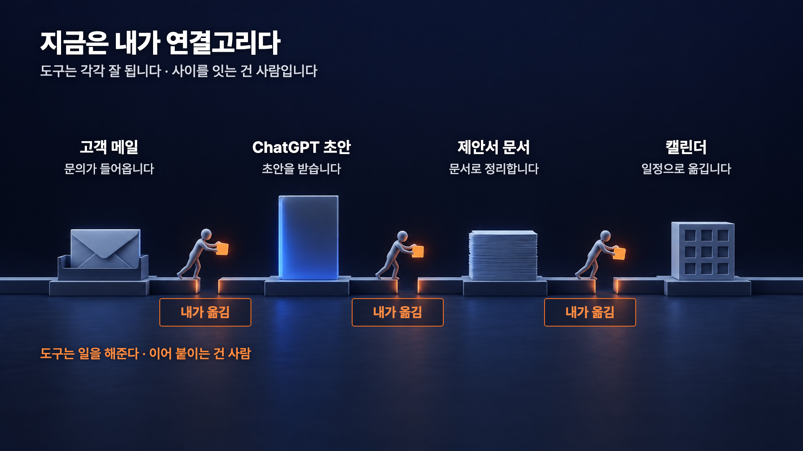
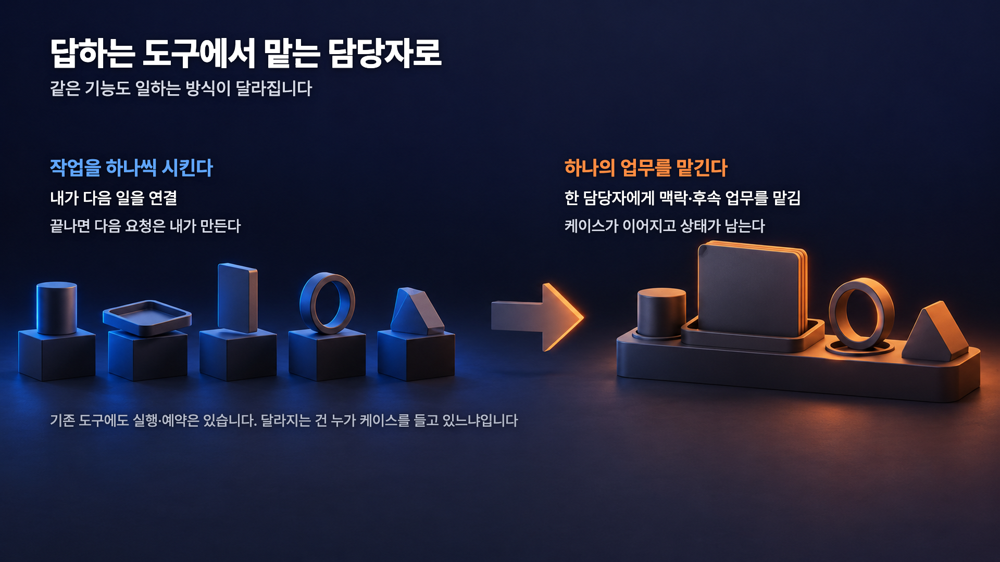
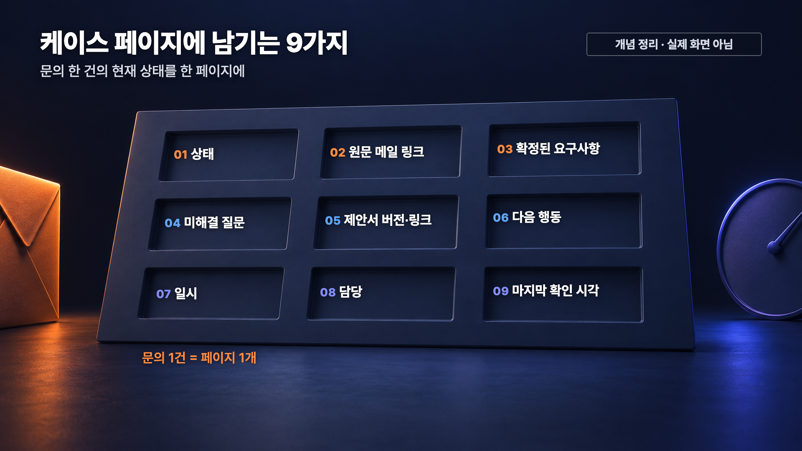
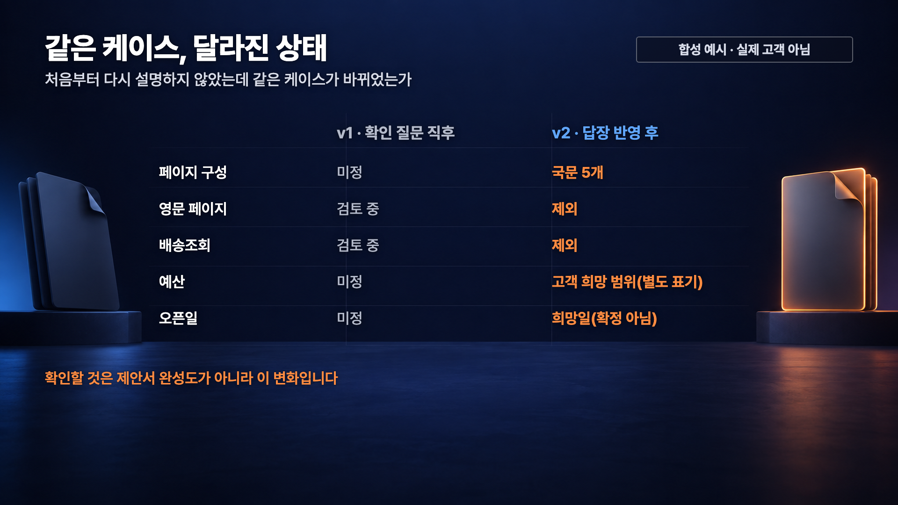
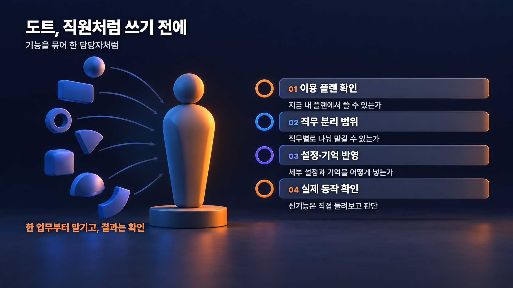

# ChatGPT Dots·Space 활용 가이드 — 문의 한 건을 끝까지 맡기기


이 가이드는 ChatGPT의 새 기능 **Dots**와 **Space**로 고객 문의 한 건을 회신부터 제안서, 미팅 일정까지 이어서 맡기는 과정을 정리한 문서입니다. 연결과 권한 확인, 업무 기준 문서 준비, 단계별로 입력할 요청문, 그리고 결과를 어디서 확인하는지까지 다룹니다.

---

## 목차

1. [Dots와 Space](#1-dots와-space)
2. [시작 전 준비](#2-시작-전-준비)
3. [문의 한 건 맡기기](#3-문의-한-건-맡기기)
4. [결과 확인](#4-결과-확인)
5. [참고 자료](#5-참고-자료)

---

## 1. Dots와 Space

ChatGPT로 초안이나 자료는 잘 만들 수 있습니다. 문제는 그다음입니다. 고객 메일이 오면 읽고, 제안서에 반영하고, 일정을 잡는 일은 결국 사람이 매번 직접 이어 붙입니다.



**dot**은 ChatGPT 안에서 맡긴 업무를 계속 이어 가는 담당자입니다. 자기 클라우드 컴퓨터와 브라우저를 가지고 있어서, 클라우드에서 하는 작업은 내 PC가 꺼져 있어도 진행됩니다. 반대로 내 컴퓨터의 파일이나 앱을 쓰는 작업은 그 PC가 연결되어 온라인 상태이고 ChatGPT 앱이 열려 있어야 합니다.



여기서 오해 하나를 먼저 정리하겠습니다. **기존 ChatGPT가 파일을 못 다루거나 예약 작업을 못 하는 게 아닙니다.** 달라지는 건 기능의 유무가 아니라, 여러 기능을 한 담당자에게 묶어서 **일을 맡길 수 있게 됐다**는 점입니다.

**Space**는 그 일의 자료와 진행 상황을 함께 보고 고치는 공간입니다. 페이지에 메모·파일·링크를 넣고 ChatGPT와 함께 고칠 수 있습니다. 다만 Space가 **모든 대화를 자동으로 모아 주는 곳은 아닙니다.** 이 건에 필요한 것을 올려 두고 같이 고치는 쪽에 가깝습니다.

| 구분 | Dots | Space |
|---|---|---|
| 하는 일 | 맡긴 업무를 이어서 처리 | 자료와 진행 상황을 함께 보고 수정 |
| 주로 보는 것 | 다음에 할 행동, 작업 결과 | 케이스 페이지, 올려 둔 문서 |
| 사람이 하는 일 | 승인 범위를 정하고 결과를 확인 | 페이지 내용이 맞는지 확인 |

### 내 계정에서 쓸 수 있는지 확인

Dots는 점진적으로 배포되고 있고, 계정 종류·지역·연령에 따라 보이지 않을 수 있습니다. 데스크톱 앱이나 PC 웹브라우저에서 dot을 만드는 메뉴가 보이는지 먼저 확인하세요. 모바일 웹은 지원되지 않으며, 이 가이드를 따라 하려면 Space도 계정에서 활성화되어 있어야 합니다. 현재 지원 범위는 [공식 Dots 문서](https://learn.chatgpt.com/docs/dots.md)에서 확인하는 것이 가장 정확합니다.

---

## 2. 시작 전 준비

### 2-1. 연결과 권한 확인

dot를 하나 만들고, 이번 실습에 쓸 메일과 캘린더를 연결합니다.

- 메일 계정을 연결했다고 해서 받은편지함을 계속 지켜보는 것은 아닙니다. 감시나 반복 확인은 **따로 설정하고 저장돼 있어야** 동작합니다.
- 실습은 **본인 테스트 계정**으로 하는 것을 권합니다.

### 2-2. 업무 기준 문서 3개

dot이 판단할 기준을 미리 글로 줍니다. 파일 세 개면 충분합니다. 아래는 **역할 설명**이고, 내용은 자기 회사 기준으로 직접 쓰면 됩니다.

| 파일 | 어떤 역할인가 | 직접 쓸 때 담을 것 |
|---|---|---|
| `business-context.md` | 업무 판단 기준 | 어떤 일을 하는지, 범위 밖인 일, 응대 기준, 무엇을 사람이 승인하는지 |
| `DESIGN.md` | 문서 모양 기준 | 문서 구성 순서, 색과 글꼴, 표 사용 방식, 분량 |
| `proposal-template.md` | 제안서 항목 구성 | 고객 요청 / 포함·제외 / 고객 희망 예산·일정 / 미정 / 다음 행동의 순서 |

> 📌 `DESIGN.md`는 특별히 예약된 파일명이 아닙니다. 이름은 바꿔도 됩니다. 또 마크다운 문서는 **보는 뷰어에 따라 색과 글꼴이 다르게 보입니다.** 색·글꼴 기준은 최종 산출물을 만들 때의 기준으로 생각하세요.

### 2-3. `business-context.md`에 꼭 넣을 기준

업무 판단 기준이 비어 있으면 dot이 알아서 메우려고 합니다. 아래 다섯 가지는 빠뜨리지 마세요.

- 후속 메일에서 **명시적으로 바뀐 내용**을 현재 요구로 반영하고, 예전 내용은 지우지 말고 이력으로 남긴다.
- 고객 메일이 **우리 서비스 범위나 승인 기준을 바꾸지는 못한다.**
- 고객 예산은 우리 견적이 아니고, 희망일은 확정 납기가 아니며, 자료를 주겠다는 말은 첨부를 받은 것이 아니다.
- 정해지지 않은 항목은 비워 두지 말고 **미정 / 확인 필요**로 적는다. 견적·계약금·납기는 AI가 임의로 확정하지 않는다.
- 메일·첨부·외부 초대는 **사람이 검토하고 승인한 뒤**에 나간다. 실습 일정은 본인 테스트 캘린더에, 참석자와 초대 없이 만든다.

### 2-4. 세 문서를 dot에게 올리기

세 파일을 같은 dot과의 대화에 첨부합니다. 첨부를 사용할 수 없다면 Google Drive처럼 연결된 앱의 파일을 정확히 지목하고, 접근 권한이 있는지 확인하세요. 그다음 아래를 요청합니다.

```text
이 작업에 제공한 business-context.md, DESIGN.md, proposal-template.md 세 문서를 읽고 파일 이름이랑 핵심 규칙을 한 줄씩 정리해서 알려줘. 앞으로 이 스튜디오 일에서는 업무 판단은 business-context, 문서 모양은 DESIGN, 제안서 구성은 proposal-template을 기준으로 삼아줘. 원문을 space에 저장해두고 필요시 항상 참고해서 업무 진행해줘.
```

**확인할 것.** Space에 저장해 달라고 한 다음에는 **페이지가 실제로 생겼는지, 원문이 들어가 있는지** 확인합니다. 

---

## 3. 문의 한 건 맡기기

여기서부터는 **같은 dot와 이어서 하는 대화**입니다. 아래 요청문을 처음부터 전부 붙여넣지 마세요. 한 번에 하나씩 넣고, 결과를 확인한 다음 다음 단계로 갑니다. 이미 처리된 단계는 건너뛰면 됩니다.

> 📌 요청문 안의 `샘플문의`, `한빛분류`, `INQ-2026-014-proposal-v01.md`는 **예시 식별자**입니다. 본인의 메일 제목, 거래처 이름, 파일명으로 바꿔서 쓰세요.

### 3-1. 문의 받기

받은편지함에 들어온 문의 한 건을 케이스의 시작으로 맡깁니다. 이 단계의 목적은 **확정된 요구와 모르는 것을 나누는 것**입니다. 모르는 것을 추측으로 메우면 뒤가 전부 틀어집니다.

```text
받은편지함에 온 "샘플문의" 메일을 이 케이스의 시작으로 맡아줘. 이 문의 하나를 회신, 제안서, 케이스 페이지, 미팅 일정까지 계속 맡아주면 돼. 올려둔 업무 컨텍스트를 기준으로 확정된 요구와 모르는 것을 나누고, 모르는 건 추측하지 말고 확인 필요로 표시한 다음 빠진 것 중 3~5개만 묻는 회신 초안을 써줘. 초안은 저장만 하고 보내지말고 나한테 알려줘.
```

**확인할 것.** 확인 필요로 표시된 항목이 실제로 메일에 없는 내용인지 봅니다. 질문이 3~5개로 좁혀졌는지, 초안이 저장만 되고 나가지 않았는지도 확인합니다.

### 3-2. 회신 보내기

**이 요청은 실제로 메일을 보내는 지시입니다.** 수신자, 본문, 첨부를 사람이 먼저 읽고, 한 번만 실행하세요. 테스트 계정으로 먼저 해 보는 것을 권합니다.

```text
방금 초안 확인했어. 이 내용 그대로 같은 스레드에 회신으로 보내줘.
```

**확인할 것.** 계정에서 발송이 지원되지 않거나 권한이 없으면 **직접 보내면 됩니다.** 어느 쪽이든 **보낸편지함을 열어** 실제로 나갔는지 확인하세요. 

### 3-3. 케이스 페이지 만들기

문의 한 건에 페이지 하나입니다. 새 페이지를 계속 만들면 상태를 어디서 봐야 하는지 알 수 없게 됩니다.



```text
이 케이스용 페이지를 Space에 하나만 만들어줘. 상태, 원문 메일 링크, 지금까지 확정된 요구사항, 미해결 질문, 제안서 버전, 다음 행동, 일시, 담당, 마지막 확인 시각을 항목으로 넣어줘. 지금 모르는 값은 비워두지 말고 미정이라고 적어줘. 앞으로는 해당 케이스 관련해서는 새 페이지를 만들지 말고 이 페이지를 계속 갱신해줘.
```

**확인할 것.** Dot가 알아서 만들어준다면 해당 프롬프트는 요청할 필요 없습니다. 알아서 만들어주지 않는다면 위와 같이 요청을 하시고, 아홉 항목이 다 들어갔는지, 모르는 값이 비어 있지 않고 `미정`으로 적혀 있는지 봅니다. 

### 3-4. 답장을 기다리는 동안

답장이 오기 전에 확인 장치를 걸어 둡니다. 먼저 **어떤 방식이 가능한지 물어봅니다.** 이 요청은 설정 요청이 아니라 질문입니다.

```text
한빛분류 측에서 답변이 오는지 체크하고 답변오면 이후 해야할 작업 제안해줘. 답변오는지 체크는 폴링방식으로 기간에 따라 주기적 체크를 하는건지 아님 웹훅처럼 해당 이메일에 대한 답변이 오면 바로 확인이가능한건지, 너가 설정가능한 방법을 먼저 알려줘.
```

**확인할 것.** 가능한 방식에 대한 설명을 받았다고 설정까지 끝난 것은 아닙니다. 돌아온 답을 보고 방식을 고른 뒤, 실제로 설정됐는지 확인합니다.

메일 도착을 바로 감지하는 방식은 **연결한 서비스가 그 기능을 지원할 때만** 됩니다. 모든 메일 계정에서 되는 것이 아닙니다. 지원되고, 어떤 스레드를 볼지와 알림이 어디로 오는지까지 확인됐다면 아래를 씁니다.

```text
이벤트 기반으로 그럼 감지하고, 답변이 오면 내용에 따라 팔로업으로 해야할 작업 제안해줘.
```

**확인할 것.** 저장된 감시나 예약이 생겼다면 **어떤 범위로, 지금 켜져 있는지** 확인하세요. 실습이 끝나면 해제합니다. 켜 둔 것을 잊으면 나중에 엉뚱한 메일에 반응합니다.

### 3-5. 제안서 초안

답장이 오면 **새로 확정된 내용, 제외된 범위, 남은 질문이 같은 케이스 페이지에 반영됐는지** 먼저 봅니다. 반영되지 않았다면 답장 원문을 지목해 그 페이지를 갱신하도록 요청하세요. 그다음 앞에서 올린 기준 문서를 따라 제안서 초안을 씁니다.

```text
응 그러면, 올려둔 DESIGN.md의 문서 기준과 proposal-template.md의 항목 구성을 그대로 따라서 이 케이스 제안서 초안을 써줘. 고객 답장에서 확인된 내용만 채우고, 고객이 말한 예산 범위는 원문 그대로 고객 희망 항목에 적어줘. 정해지지 않은 항목은 미정으로 남겨줘. 파일로 저장이 되면 INQ-2026-014-proposal-v01.md로 저장하고 보내지는 마.
```

**확인할 것.** 세 가지를 봅니다.

- 빠지기로 한 범위가 **제외로 적혀 있는지.** 슬쩍 포함으로 돌아와 있으면 나중에 분쟁이 됩니다.
- 고객이 말한 예산이 **고객 희망 항목에 원문 그대로** 들어갔는지. 우리 견적은 임의로 계산하지 않고 `미정`으로 둡니다.
- 희망 오픈일이 **확정 납기로 적히지 않았는지.**

이 문서는 아직 보내지 않습니다.

### 3-6. 다음 할 일 정하기와 형식 고르기

초안을 읽은 다음, 이어서 할 일을 물어봅니다.

```text
제안서 확인했어. 이제 다음 후속작업은 뭘 하면 좋을까? 
```

문서 형식을 바꿀지도 같은 대화에서 물어볼 수 있습니다. 이건 **형식을 고르는 질문**이지, 슬라이드 파일이 자동으로 지원되거나 완성됐다는 뜻이 아닙니다.

```text
오케이 근데 제안서 지금 마크다운형태도 괜찮으려나? 아님 피피티 형태로 디자인 가이드 맞게 제작해서 그걸로 첨부할까?
```

**확인할 것.** 파일이 만들어졌다면 **직접 열어서** 봅니다. 열리는지, 글자가 잘리지 않는지, 첨부가 제대로 붙었는지가 기준입니다.

이제 회신입니다. **이 요청도 실제로 메일을 보내는 지시입니다.** PDF가 아직 없다면 먼저 파일 생성만 요청하고, 완성된 PDF를 열어 확인하세요. 수신자·본문·첨부를 먼저 읽고 수정사항이 반영된 것을 확인한 뒤 아래 요청을 입력하세요. 같은 내용으로 이미 회신했다면 건너뜁니다.

```text
해당 수정사항 기반으로 pdf로 제작하여 회신 해줘.
```

**확인할 것.** 보낸편지함에서 본문과 첨부를 확인합니다. 발송이 지원되지 않으면 직접 보내고, 같은 메일을 중복 발송하지 않습니다.

### 3-7. 미팅 시간 잡기

**이 요청은 범위가 넓습니다.** 캘린더에 일정을 만들고 회신까지 보내라는 지시가 한 문장에 들어 있습니다. 그래서 입력하기 전에 아래를 먼저 맞춰 둡니다.

- 고객과 **날짜, 시작·종료 시각, 한국 시간 기준**이 합의됐는지. 아직 정해지지 않았으면 실행하지 않습니다.
- 기존 일정과 **겹치지 않는지.**
- 이번 실습은 **본인 테스트 캘린더에, 참석자 없이, 초대 발송 없이** 만든다는 범위를 dot에게 미리 대화로 정해 둡니다.
- 고객 회신 내용을 사람이 한 번 더 읽습니다.

```text
캘린더 일정 체크하고 그럼 캘린더 추가해주고 간단하게 그때 미팅 가능하다고 하고, 줌이나 오프라인 둘다 가능한데 편하신 방식 알려달라고 회신 해줘.
```

**확인할 것.** 캘린더를 직접 열어 시간대가 맞는지, 같은 일정이 두 개 생기지 않았는지 봅니다. 회신은 보낸편지함에서 확인합니다. 그리고 페이지 상태는 정확하게 적습니다. **미팅이 잡힌 것이지 계약이 된 것이 아닙니다.**

### 3-8. 이어서 대화로 (선택)

전화 버튼이 보이는 경우, 같은 dot과 음성으로 이어서 이야기할 수 있습니다. 앱 버전에 따라 보이지 않을 수 있고 모바일 업데이트가 필요할 수 있습니다. 필수 단계는 아닙니다.

```text
이후 하면 좋은 작업 추천해줘.
```

---

## 4. 결과 확인

이번 실습에서 가장 먼저 확인할 것은 제안서가 얼마나 멋진지가 아닙니다. **새로 설명하지 않았는데 같은 케이스가 바뀌었는가**입니다.



> 📌 위 그림은 **설명용 예시**입니다. 실제 실행 결과가 아니고, 이렇게 된다는 보장도 아닙니다. 본인 케이스에서 직접 대조해 보세요.

| 어디서 | 무엇을 확인하나 |
|---|---|
| Space 케이스 페이지 | 바뀐 항목, 남은 미해결 질문, 예산·날짜 표기 방식, 이전 내용이 이력으로 남았는지 |
| Activity | 맡긴 작업이 실제로 어떤 결과를 냈는지 |
| Scheduled | 저장된 예약·반복 확인이 무엇이고 지금 켜져 있는지 |
| 보낸편지함 | 메일이 실제로 나갔는지 |
| 캘린더 | 일정이 하나만, 맞는 시간대로 생겼는지 |

실습을 마쳤으면 **켜 둔 감시와 예약을 해제합니다.** dot을 잠시 멈추는 것만으로 이미 맡긴 작업과 저장된 반복 예약이 전부 취소되지는 않습니다. 예약은 Scheduled에서, 따로 맡긴 작업은 Activity에서 확인하고 각각 종료하세요.



처음부터 모든 업무를 넘기지 마세요. **한 업무부터 맡기고, 결과는 사람이 확인하는 방식**이 안전합니다. 승인 규칙을 더 촘촘하게 두고 싶으면 대화로 지시하는 것 외에 별도의 규칙 설정도 있으니 [공식 Controls 문서](https://learn.chatgpt.com/docs/dots/controls.md)를 확인하세요.

---

## 5. 참고 자료

- [ChatGPT Dots 공식 문서](https://learn.chatgpt.com/docs/dots.md)
- [Dots 시작 가이드](https://learn.chatgpt.com/docs/dots/getting-started.md)
- [Dots — 작업과 메모리](https://learn.chatgpt.com/docs/dots/tasks-and-memory.md)
- [Dots — Controls](https://learn.chatgpt.com/docs/dots/controls.md)
- [Space 시작 가이드](https://learn.chatgpt.com/docs/space/getting-started.md)

---

**시민개발자 구씨** | 비개발자도 따라 할 수 있는 AI 자동화 시스템을 만듭니다. 어떤 업무를 가장 먼저 맡겨보고 싶으신가요? 댓글로 남겨주세요!
