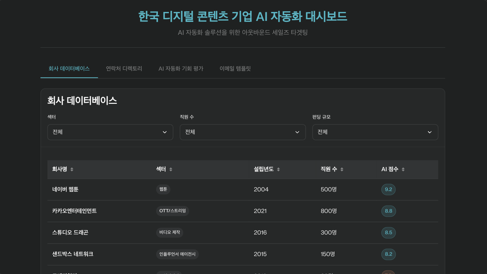

# Perplexity Labs 활용 가이드


Perplexity Labs의 강력한 리서치 및 대시보드 생성 기능을 활용하여 업무 생산성을 극대화하는 방법에 대한 종합 가이드입니다.

## 목차

- [Perplexity Labs 개요](#perplexity-labs-개요)
- [주요 기능 소개](#주요-기능-소개)
- [실무 활용 사례](#실무-활용-사례)
  - [콘텐츠 마케팅 전략 수립](#콘텐츠-마케팅-전략-수립)
  - [B2B 세일즈 리드 발굴](#b2b-세일즈-리드-발굴)
  - [AI 시대 직무별 영향 분석](#ai-시대-직무별-영향-분석)
- [실무 활용 팁](#실무-활용-팁)
- [한계점 및 주의사항](#한계점-및-주의사항)
- [결론](#결론)

## Perplexity Labs 개요

Perplexity Labs는 기존 Perplexity의 웹 검색 기능을 넘어서, 심층적인 리서치와 인터랙티브 대시보드 생성을 지원하는 새로운 실험실 기능입니다.

기존의 단순한 정보 검색에서 한 단계 발전하여, 복잡한 비즈니스 분석과 의사결정을 지원하는 종합적인 도구로 진화했습니다.

## 주요 기능 소개

### 1. Deep Web Browsing (심층 웹 브라우징)
- 일반적인 검색을 넘어서 다양한 소스의 웹사이트를 깊숙이 분석하고 크롤링
- 더 정확하고 상세한 정보 수집

### 2. 투명한 프로세스 공개 (Task 탭)
- 단순한 답변 제공을 넘어서 작업 과정을 투명하게 공개
- 어떤 순서로 어떤 작업이 진행되었는지 상세히 확인 가능

### 3. 다양한 작업물 생성 (Asset 탭)
- 텍스트 리포트뿐만 아니라 다음과 같은 다양한 형태의 결과물 생성:
  - 이미지 생성
  - 파일 생성
  - 차트 및 그래프
  - 데이터 시각화

### 4. 인터랙티브 대시보드 (App 탭)
- 웹 형태의 상호작용 가능한 대시보드 제작
- 필터 적용, 검색 기능을 통한 동적 데이터 탐색
- 인사이트 도출을 위한 직관적인 인터페이스

### 5. Export & Share 기능
- 생성된 에셋 다운로드
- 리포트를 마크다운, 워드 파일 등으로 내보내기
- 링크를 통한 간편한 공유

## 실무 활용 사례

### 1) 콘텐츠 마케팅 전략 수립

**활용 시나리오**: 유튜브 채널 성장 전략 수립


**프롬프트 예시**:
```
Act as a YouTube Analytics Specialist. Your mission is to analyze MEOVV's channel performance against top K-pop competitors and create an interactive dashboard that provides data-driven growth strategies to reach 2 million subscribers.

Analysis Tasks & Key Questions
1. Performance Gap Analysis
- What are MEOVV's current metrics vs AESPA, IVE, LE SSERAFIM, NMIXX?
- Which performance gaps are most critical (subscriber growth rate, view-to-subscriber ratio, engagement rate)?
- What content types generate highest engagement for each competitor?

2. Content Strategy Analysis
- Which video categories perform best across all channels (Music Videos, Dance Practice, Behind-the-scenes, Variety, Shorts)?
- What are the optimal video lengths and upload frequencies?
- Which thumbnail styles and titles drive highest CTR?

3. Growth Modeling
- Based on competitor growth patterns, what are realistic monthly growth targets?
- Which content mix would accelerate subscriber acquisition?
- What upload schedule maximizes reach without audience fatigue?

## Youtube Channel Links
- MEOVV: https://www.youtube.com/@MEOVV_OFFICIAL 
- AESPA: https://www.youtube.com/@aespa
- IVE: https://www.youtube.com/@IVEstarship
- LE SSERAFIM: https://www.youtube.com/@LESSERAFIM_official
- NMIXX: https://www.youtube.com/@NMIXXOfficial

## Deliverable Command
**Include tables and charts. Then build an interactive dashboard with:**
- Tab 1: Performance comparison charts (subscribers, views, engagement rates)
- Tab 2: Content analysis with filtering by video type, duration, upload time
- Tab 3: Growth projection calculator with scenario modeling
- Tab 4: Recommended content calendar with specific video ideas
```

**생성되는 결과물**:
- 채널별 퍼포먼스 비교 분석
- 콘텐츠 유형별 성과 분석
- 성장 시나리오별 예상 구독자 달성 시점
- 구체적인 콘텐츠 캘린더 및 영상 아이디어

### 2) B2B 세일즈 리드 발굴

**활용 시나리오**: AI 자동화 솔루션 판매를 위한 타겟 기업 발굴



**프롬프트 예시**:
```
Act as a Business Development Research Specialist. Your mission is to identify 30 Korean digital content companies that would be ideal prospects for AI automation solutions and create an interactive dashboard for outbound sales targeting.

## Analysis Tasks & Key Questions

1. Digital Content Company Identification & Qualification
- Target sectors: Webtoons, OTT/Streaming, Social Media, E-commerce content, Digital Marketing agencies, Influencer agencies, Video production
- Which companies have content creation workflows that could benefit from AI automation?
- Identify 30 companies that would benefit from AI automation

2. Business Partnership Contact Research
- Who are the CEOs at these digital content companies now?
- What is the companies' official business contact details (email)?

3. AI Automation Opportunity Assessment
- Which prospects show strongest need for content automation?
- What specific AI automation pain points exist?
- Which outreach timing and messaging would be most effective?

## Data Sources
- Korean startup databases (TheVC, Startup Recipe, Crunchbase Korea)
- Digital content industry reports and company websites

## Deliverable Command
**Include tables and necessary charts. Then build an interactive dashboard with:**
- Tab 1: Company database with filtering by content type, funding amount, employee count
- Tab 2: Contact directory with search functionality
- Tab 3: AI automation opportunity scoring with scatterplot
- Tab 4: Custom outbound email templates for each company selected

All text must be in Korean.
```

**생성되는 결과물**:
- 타겟 기업 데이터베이스 (필터링 기능 포함)
- 연락처 디렉토리 (검색 기능 포함)
- AI 자동화 기회 점수 시각화
- 기업별 맞춤 아웃리치 이메일 템플릿

### 3) AI 시대 직무별 영향 분석

**활용 시나리오**: 생성형 AI가 직무에 미치는 영향 분석 및 대비책 수립


**프롬프트 예시**:
```
Act as a Career Transition Specialist. Your mission is to analyze how generative AI affects key job functions and develop personal survival strategies for individual professionals to thrive in an AI-dominated workplace.

## Analysis Tasks & Key Questions

1. AI Impact Assessment by Role
- How is generative AI transforming core tasks for Marketing, Development, Design, Sales, HR, Strategy, Business Development, Data Analysis, Data Science, and Finance professionals?
- Which job functions are most at risk of automation vs. augmentation?
- What new skills and capabilities are emerging as essential for each role?

2. Role-Specific Transformation Analysis
- Marketing: Content creation, campaign optimization, customer segmentation, performance analysis
- Development: Code generation, debugging, testing, documentation
- Design: Asset creation, prototyping, user research, iteration workflows
- Sales: Lead generation, proposal writing, customer communication, pipeline management
- HR: Recruitment screening, employee evaluation, training content, policy development
- Strategy: Market analysis, competitive intelligence, strategic planning, scenario modeling
- Business Development: Partnership research, proposal generation, relationship mapping, opportunity assessment
- Data Analysis: Report automation, insight generation, data visualization, trend analysis
- Data Science: Model development, feature engineering, experiment design, result interpretation
- Finance: Financial modeling, risk assessment, reporting automation, forecasting

3. Individual Career Survival Planning
- What specific skills should each professional develop in 3, 6, 12 months to stay AI-resilient?
- Which learning paths and certifications provide the strongest protection against automation?
- How should individuals transition from AI-replaceable tasks to AI-collaborative or uniquely human work?

## Deliverable Command
**Include tables and necessary charts. Then build an interactive dashboard with:**
- Tab 1: AI threat level assessment with survival probability by role
- Tab 2: Role-specific career pivot strategies with filtering by job function
- Tab 3: Personal development roadmaps with 3/6/12 month skill-building timelines for each role
- Tab 4: AI tool mastery guides and learning resources for individual career protection

All text must be in Korean.
```

**생성되는 결과물**:
- 직무별 AI 위협 수준 평가
- 역할별 커리어 전환 전략
- 개인 개발 로드맵 (3/6/12개월 타임라인)
- AI 도구 활용 가이드 및 학습 리소스

## 실무 활용 팁

### 1. 구체적인 목표와 결과물 제시
- **목표**: 프롬프트 시작 부분에 명확한 목적 명시
- **결과물**: 마지막에 원하는 포맷을 정확히 요청
- **예시**: "분석해줘"가 아닌 "테이블과 차트를 제작하고 인터랙티브 대시보드로 만들어줘"

### 2. 원샷 완성도 높은 프롬프트 작성
- 퍼플렉시티는 후속 프롬프트 수정이 어려움
- 처음부터 체계적이고 완성도 높은 프롬프트 작성 필요
- 핵심 분석 사항을 질문 형태로 포함

### 3. 외부 리서치 위주 활용
- 내부 파일이나 Google Drive 연결보다는 외부 리서치에 특화
- 파일 첨부 없이 진행할 때 더 심층적인 리서치 제공
- 다양한 출처를 활용한 종합적 분석에 강점

### 4. 영문 프롬프트 권장
- 프롬프트 엔지니어링의 영향을 많이 받음
- 가능한 한 영문으로 프롬프트 작성 권장
- 결과물 언어는 별도로 지정 가능

## 한계점 및 주의사항

### 1. 사용 제한
- **무료 버전**: 사용 불가
- **프로 버전**: 월 50회 제한
- 신중한 사용 및 프롬프트 사전 검토 필요

### 2. 팔로우업 수정의 어려움
- 각 프롬프트별 독립적 처리 방식
- 컨텍스트 이해 기반 수정 요청 어려움
- 결과 불만족 시 처음부터 재작성 필요

### 3. 실시간 업데이트 불가
- 생성된 대시보드는 정적 결과물
- 자동 업데이트 기능 없음
- 특정 시점의 스냅샷 분석에 적합

### 4. 내부 데이터 활용 제한
- Google Drive 등 내부 데이터 첨부 시 성능 저하
- 외부 리서치 중심의 활용 권장
- 기존 자료 기반 분석에는 한계

### 5. 정확도 검증 필요
- 환각 현상 가능성 존재
- 연락처, 수치 정보 등 중요 데이터는 반드시 검증
- 여러 번 요청을 통한 결과 비교 권장

## 결론

Perplexity Labs는 마켓 리서치부터 데이터 분석, 대시보드 생성까지 프롬프트 하나로 처리할 수 있는 강력한 도구입니다.

**특히 효과적인 활용 대상**:
- 개인사업자 및 프리랜서
- 스타트업 및 소규모 조직
- 마켓 리서치 담당자나 데이터 분석가 채용이 어려운 환경

**핵심 장점**:
- 복합적 결과물 생성 (텍스트 + 시각화 + 대시보드)
- 인터랙티브한 데이터 탐색 환경 제공
- 즉시 활용 가능한 템플릿 및 가이드 생성

한계점을 감안하더라도, 업무 생산성 향상과 의사결정 지원에 매우 유용한 도구로 평가됩니다.

---

더 자세한 활용 사례와 업데이트 정보는 [Perplexity 공식 문서](https://www.perplexity.ai/ko/hub)를 참고하세요.