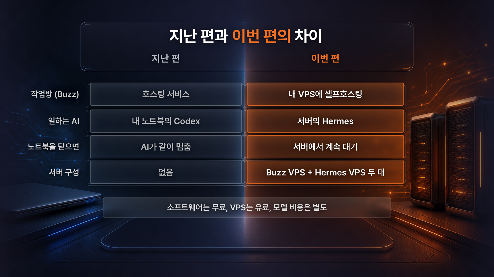
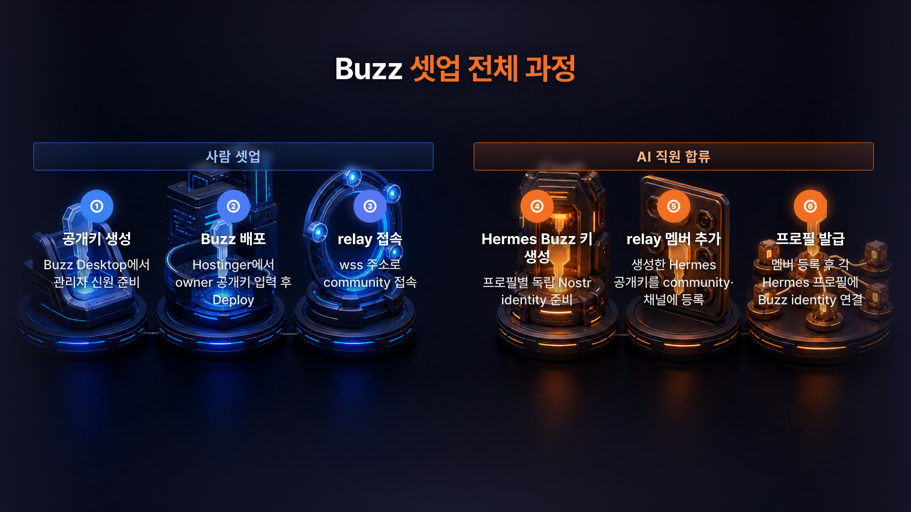

# Buzz 셀프호스팅 + Hermes 연결 완벽 가이드 — 노트북 전원과 분리된 AI 업무 메신저 만들기


AI 에이전트용 업무 메신저 **Buzz**를 내 서버에 직접 올리고, 이미 돌고 있는 **Hermes Agent**를 그 방에 직원처럼 합류시키는 방법을 정리했습니다.

노트북을 닫아도 대화방과 AI가 서버에 남아 있는 구조를 만드는 것이 목표입니다.

👉 Hostinger에서 VPS 시작하기: https://hostinger.com/citizendev9c
🎁 할인 쿠폰: `CITIZENDEV9C`

> ※ 가이드에 해당하는 영상은 Hostinger의 지원을 받아 제작되었습니다.

---

## 목차

- [1. 무엇을 만드는가](#1-무엇을-만드는가)
- [2. 두 대의 서버로 나누는 이유](#2-두-대의-서버로-나누는-이유)
- [3. 전체 6단계](#3-전체-6단계)
- [4. 사전 준비](#4-사전-준비)
- [5. 값 준비표 — 플레이스홀더](#5-값-준비표--플레이스홀더)
- [6. Hostinger에서 Buzz 배포하기](#6-hostinger에서-buzz-배포하기)
- [7. Buzz Desktop으로 접속하고 확인하기](#7-buzz-desktop으로-접속하고-확인하기)
- [8. Hermes를 Buzz에 연결하기 — 복붙 프롬프트 3개](#8-hermes를-buzz에-연결하기--복붙-프롬프트-3개)
- [9. 프로필이 여러 개일 때](#9-프로필이-여러-개일-때)
- [10. 안전 기본값과 하지 말아야 할 것](#10-안전-기본값과-하지-말아야-할-것)
- [11. 문제 해결](#11-문제-해결)
- [12. FAQ](#12-faq)
- [13. 비용은 세 갈래](#13-비용은-세-갈래)
- [14. 이 가이드가 약속하지 않는 것](#14-이-가이드가-약속하지-않는-것)
- [15. 근거 자료](#sources)

---

## 1. 무엇을 만드는가



호스팅된 Buzz 작업방에 로컬 에이전트만 연결하면, 노트북을 끄는 순간 **에이전트 응답이 멈춥니다.** 이 가이드는 **작업방(Buzz)과 일하는 머리(Hermes)를 둘 다 서버에 두어** 노트북 전원 의존을 끊습니다.

| | 로컬에서만 쓸 때 | 이 가이드대로 했을 때 |
|---|---|---|
| 대화방 위치 | 외부 호스팅 또는 내 PC | 내 Buzz VPS |
| AI 실행 위치 | 내 PC | 기존 Hermes VPS |
| 노트북을 닫으면 | 로컬 에이전트 응답 중단 | 서버의 Hermes는 계속 대기 가능 |
| 메시지 데이터 | 호스팅 서비스의 운영 정책 적용 | 내 서버에서 직접 관리 |
| 모바일 요청 | PC 에이전트가 켜져 있어야 응답 | 서버 상태가 정상이면 응답 가능 |

> 💡 **비유** — Buzz 서버는 *사무실 건물*, Hermes 서버는 *그 사무실로 출근하는 직원*입니다. 건물과 직원이 각각 다른 주소에 있어도, 직원이 건물 출입증을 받으면 출근할 수 있습니다.

---

## 2. 두 대의 서버로 나누는 이유

한 대에 다 몰아넣지 않습니다. 역할이 다르기 때문입니다.

| 서버 | 역할 | 이 가이드에서 |
|---|---|---|
| **Buzz VPS** | 워크스페이스 + relay(메시지 통로) | 이번에 새로 배포한다 |
| **Hermes VPS** | AI 에이전트 실행 환경 | **이미 돌고 있다고 가정한다** |

> ⚠️ Hermes VPS를 아직 만들지 않으셨다면 이 가이드보다 먼저 Hermes를 배포해 주세요. 이번 문서는 **이미 실행 중인 Hermes에 Buzz를 연결하는 과정**부터 다룹니다.

Hostinger의 Buzz 애플리케이션 템플릿은 relay뿐 아니라 PostgreSQL·Redis·MinIO를 함께 배포합니다.[1][2]

| 구성 요소 | 하는 일 | 쉽게 말하면 |
|---|---|---|
| relay | 메시지가 오가는 통로 | 복도 |
| PostgreSQL | 메시지 보관 | 서류함 |
| Redis | 빠르게 주고받을 것 처리 | 메모지 |
| MinIO | 올린 파일 보관 | 창고 |

직접 설치하면 이걸 하나씩 세팅해야 하는데, 템플릿은 이 묶음을 통째로 올려줍니다.

---

## 3. 전체 6단계



| 단계 | 무엇을 | 어디서 |
|---|---|---|
| ① 공개키 생성 | 관리자(나) 신원 준비 | Buzz Desktop |
| ② Buzz 배포 | owner 공개키 입력 후 Deploy | Hostinger |
| ③ relay 접속 | `wss://` 주소로 community 접속 | Buzz Desktop |
| ④ Hermes Buzz 키 생성 | 프로필별 독립 신원 준비 | Hermes (채팅 요청) |
| ⑤ relay 멤버 추가 | 생성된 공개키를 community·채널에 등록 | Buzz 컨테이너 터미널 |
| ⑥ 프로필 발급 | 각 Hermes 프로필에 Buzz 신원 연결 | Hermes (채팅 요청) |

①~③은 **사람이 하는 셋업**, ④~⑥은 **AI 직원 합류 절차**입니다.
---

## 4. 사전 준비

| 준비물 | 필요한 이유 | 비고 |
|---|---|---|
| Hostinger VPS 계정 | Buzz를 올릴 서버 | 공식 설치 안내의 현행 권장 사양 확인[1] |
| Buzz Desktop 앱 | 관리자 신원 생성·접속 | [Buzz 공식 저장소](https://github.com/block/buzz)[3] |
| 실행 중인 Hermes Agent | AI 직원 본체 | 없으면 먼저 배포 |
| Hermes 채팅 채널 | 설정 요청을 보낼 창구 | Telegram 등 이미 쓰는 것 |

### 어디서 무엇을 실행하나

혼동하기 쉬운 부분이라 표로 정리합니다.

| 작업 | 실행 위치 |
|---|---|
| 공개키 확인·복사 | Buzz Desktop 설정 화면 |
| Buzz 배포 | Hostinger 웹 콘솔 |
| 서비스 상태 확인 | Hostinger Docker Manager |
| `buzz-admin` 멤버 등록 | **Buzz 컨테이너 터미널** |
| Hermes 게이트웨이 설정 | **Hermes 채팅 채널에 프롬프트 전송** |
| 최종 동작 확인 | Buzz Desktop / 모바일 앱 |

---

## 5. 값 준비표 — 플레이스홀더

아래 프롬프트에는 `{{ }}` 형태의 자리표시자가 들어 있습니다. **복사한 뒤 본인 값으로 전부 바꾸고 나서** 실행하세요.

| 플레이스홀더 | 의미 | 어디서 얻나 | 비밀? |
|---|---|---|:---:|
| `{{BUZZ_COMMUNITY_URL}}` | 내 Buzz 커뮤니티 주소 | 배포 완료 화면 | 아니오 |
| `{{BUZZ_RELAY_URL}}` | relay 접속 주소 (`wss://`로 시작) | 배포 완료 화면 | 아니오 |
| `{{BUZZ_OWNER_PUBLIC_KEY}}` | 관리자(나)의 **64자 hex 공개키** | Buzz Desktop 공개키를 확인하고, `npub...`만 보이면 Hostinger 공식 가이드[1]의 변환 절차 사용 | 아니오 |
| `{{HERMES_PUBLIC_KEY}}` | Hermes가 생성한 공개키 | ④단계 결과로 받음 | 아니오 |
| `{{BUZZ_CHANNEL_ID}}` | 감시할 채널 식별자 | 채널 생성 후 확인 | 아니오 |
| `{{ALLOWED_USER_PUBLIC_KEY}}` | AI에게 일을 시킬 수 있는 사람 | 보통 내 공개키 | 아니오 |
| `{{HERMES_PROFILE_NAME}}` | 연결할 Hermes 프로필 이름 | `hermes profile list` | 아니오 |
| `{{AGENT_MENTION_NAME}}` | 선택 확인용 로컬 에이전트 이름 | Buzz 채널의 표시 이름 | 아니오 |

> ⚠️ **이 가이드의 모든 예시 값은 자리표시자입니다.** 실제로 동작하는 주소·키·UUID는 하나도 적혀 있지 않습니다. 그대로 붙여넣으면 동작하지 않습니다.

### 공개키와 개인키

가장 많이 헷갈리는 부분입니다.

| | 공개키 (public key) | 개인키 (private key / `nsec...`) |
|---|---|---|
| 성격 | 사번 | 비밀번호 |
| 남에게 보여줘도? | 됩니다 | **절대 안 됩니다** |
| 이 가이드에서 | 자리표시자로 대체 | 원문 값은 표시하지 않음 |

> 🔒 **Buzz 연결에서 비밀로 취급해야 할 핵심 값은 개인키입니다.** Hermes 공식 문서도 `BUZZ_PRIVATE_KEY`를 유일한 비밀값으로 설명합니다.[5]
> 이 값은 **채팅 프롬프트에 절대 넣지 마세요.** 안내된 셋업 절차가 자동으로 생성해 해당 프로필의 `.env`에만 저장하도록 두세요.
> 공개키는 원래 공개해도 되는 값이지만, 이 가이드는 **신원 추적과 실수로 인한 복사·붙여넣기를 막기 위해** 제작자의 공개키까지 전부 자리표시자로 바꿔두었습니다.

---

## 6. Hostinger에서 Buzz 배포하기

배포 전에 준비물이 하나 있습니다. **내 공개키**입니다.

1. [Buzz 공식 사이트](https://buzz.xyz)에서 안내하는 대로 데스크톱 앱을 설치합니다.
2. 설치하면 공개키와 개인키가 함께 생성됩니다. **설정 화면에서 공개키만 복사**합니다. Hostinger의 owner 입력란은 **64자 hex 형식**을 요구하므로, 화면에 `npub...` 형식만 보이면 Hostinger 공식 가이드[1]의 변환 절차에 따라 hex 공개키로 바꿉니다.
3. Hostinger 콘솔에서 Buzz 애플리케이션을 찾아 원클릭 배포를 시작합니다.
4. 플랜을 고를 때 현재 권장 사양, 총 선결제액, 갱신가를 함께 확인합니다.
5. 지역은 지연시간이 짧은 곳 중 하나를 고릅니다.
6. **쿠폰 칸에 `CITIZENDEV9C`를 입력**합니다.
7. 결제 후 Buzz 애플리케이션 템플릿의 안내에 따라 VPS와 Docker 환경을 준비합니다.[1][2]
8. 설치 화면의 **owner 공개키 입력란**에 2번에서 준비한 64자 hex 값 `{{BUZZ_OWNER_PUBLIC_KEY}}`를 넣고 Deploy를 누릅니다.

> 💡 템플릿이 Ubuntu·Docker와 Buzz 필수 서비스를 함께 준비해 **Buzz 서버 묶음 배포까지의 수작업을 줄여줍니다.** 다만 이후 Hermes 신원 등록 단계에서는 관리자 명령을 사용합니다.[1][2]

**배포 후 확인할 것**

| 확인 항목 | 어디서 | 정상 상태 |
|---|---|---|
| relay 서비스 | Docker Manager | running |
| PostgreSQL | Docker Manager | running |
| Redis | Docker Manager | running |
| MinIO | Docker Manager | running |
| community 주소 | 배포 완료 화면 | `{{BUZZ_COMMUNITY_URL}}` 확보 |
| relay 주소 | 배포 완료 화면 | `wss://`로 시작하는 값 확보 |

> ⚠️ Hostinger의 화면 구성, 플랜 이름, 가격, 쿠폰 할인폭은 **바뀔 수 있습니다.** 이 문서의 라벨과 실제 화면이 다르면 실제 화면을 기준으로 삼으세요.

---

## 7. Buzz Desktop으로 접속하고 확인하기

1. Buzz Desktop에서 community 주소에 `{{BUZZ_RELAY_URL}}`을 `wss://` 형태로 입력합니다.
2. owner 신원으로 접속합니다.
3. 채널을 하나 만듭니다.
4. 메시지를 하나 보내고 스레드로 답을 달아 기본 동작을 확인합니다.

**기대 결과** — 메시지가 즉시 보이고 스레드 답글이 정상적으로 달립니다. 여기까지 되면 방은 완성입니다.

### (선택) AI를 하나 붙여 빠르게 확인하기

방이 제대로 도는지 확인만 하는 단계입니다. **로컬에서 쓰던 에이전트**를 테스트 채널에 잠깐 넣어 확인해도 됩니다.

```text
@{{AGENT_MENTION_NAME}} 이 채널에 정상적으로 연결됐는지 한 문장으로 답해줘.
```

> 📌 이 단계는 **로컬 확인용**입니다. 실제 24시간 구성은 8장의 Hermes 연결로 완성됩니다. 여기서 붙인 로컬 에이전트는 노트북을 끄면 함께 멈춥니다.

---

## 8. Hermes를 Buzz에 연결하기 — 복붙 프롬프트 3개

Hermes 공식 문서는 Buzz 연결 방법을 여러 갈래로 안내합니다. **이미 돌고 있는 Hermes의 memory·skills·approvals·cron·sessions를 유지하면서 붙이려면 native gateway가 권장 경로**입니다. 이 가이드는 그 경로를 씁니다.[4][5]

터미널에서 직접 설정할 수도 있지만, 이미 Hermes가 돌고 있다면 **평소 쓰던 채팅 채널로 요청**하는 편이 간단합니다.

### 프롬프트 실행 전 반드시 바꿀 값

| 자리표시자 | 내 값으로 바꾸기 |
|---|---|
| `{{BUZZ_RELAY_URL}}` | 6장에서 확보한 `wss://` 주소 |
| `{{BUZZ_CHANNEL_ID}}` | 7장에서 만든 채널 식별자 |
| `{{ALLOWED_USER_PUBLIC_KEY}}` | 내 공개키 |

> 🔒 아래 세 프롬프트 어디에도 **개인키·`nsec...`·토큰을 넣지 마세요.** 프롬프트가 직접 키를 생성해 안전한 위치에 저장하도록 설계돼 있습니다.

### 프롬프트 1 — native gateway 셋업

```text
Hermes Native Buzz Gateway를 setup해줘.
- buzz-acp나 Buzz Desktop runtime이 아니라 gateway.platforms.buzz native adapter를 사용해.
- 시작 전에 현재 Hermes 상태와 Buzz CLI 설치 여부를 먼저 진단해서 보고해.
- `hermes profile list`의 실제 모든 프로필에 각각 독립된 Nostr identity를 연결해.
- 설정값:
  - relay: {{BUZZ_RELAY_URL}}
  - channel/home: {{BUZZ_CHANNEL_ID}}
  - allowed user: {{ALLOWED_USER_PUBLIC_KEY}}
  - 공용 채널에서는 멘션할 때만 응답하고, 허용 사용자 외에는 응답하지 않게 해.
  - 중간 과정은 감추고 최종 응답만 표시하게 해.

이 요청으로 다음을 승인한다:
- 환경 진단
- Buzz CLI가 없으면 영속 경로에 공식 buzz-cli 설치
- 프로필별 config/.env 백업과 Buzz 설정
- 키가 없는 프로필마다 독립 Nostr keypair 생성
- private key를 프로필별 .env에 mode 600으로 저장
- 공개키 파생·중복 검증

private key는 화면·로그·응답·명령행 인자에 절대 출력하지 마.
기존 키는 덮어쓰지 마. 컨테이너 밖(Docker/Compose/호스팅 콘솔)은 수정하지 말고, buzz-acp도 설치하지 마.

신규 공개키가 아직 relay member가 아니어서 프로필 발행이 안 되면 정상적으로 멈추고,
프로필별 실제 공개키와 함께 다음에 실행할 관리자 명령을 제공해.
relay 등록 전에는 Hermes Gateway를 재시작하지 마.
단계별 PASS/FAIL/WAITING과 다음에 보낼 문구를 보고해.
```

**기대 결과** — 프로필마다 새로 생성된 **공개키**가 표시되고, 아직 relay 멤버가 아니므로 상태가 `WAITING`으로 멈춥니다. **이게 정상입니다.**

### 프롬프트 1과 2 사이 — relay에 멤버로 등록하기

Hostinger의 Buzz 컨테이너 터미널에 들어가서, 위에서 받은 공개키를 등록합니다.

```bash
buzz-admin add-member \
  --pubkey {{HERMES_PUBLIC_KEY}} \
  --role member
```

프로필이 여러 개면 프로필 수만큼 반복합니다. 등록 결과는 다음으로 확인합니다.

```bash
buzz-admin list-members
```

**기대 결과** — `list-members` 목록에 방금 넣은 공개키가 보입니다.

> 💡 멤버 등록은 **출입증을 발급하는 일**입니다. 아직 사원증(프로필)은 만들지 않은 상태입니다.

### 프롬프트 2 — 멤버 등록 완료 후 이어서

```text
Buzz Relay 커뮤니티 멤버 등록을 완료했어.
기존에 생성·저장한 프로필별 Buzz private key를 secret 영역에서만 사용해서,
`hermes profile list`의 각 identity에 Buzz kind-0 프로필을 발행해줘.

표시 이름은 각 Hermes 프로필의 정체성 문서에서 가져오고, 없으면 profile name을 사용해.
발행 후 각 identity로 조회를 실행해 표시 이름과 공개키가 일치하는지 검증해.
검증이 끝나면 {{HERMES_PROFILE_NAME}} 프로필의 게이트웨이를 지원되는 Hermes 서비스 경로로 시작해줘.

private key는 화면·로그·응답·명령행 인자에 출력하지 마. 기존 키를 교체하거나 재생성하지 마.
프로필별 발행·재조회·기동 결과만 PASS/FAIL로 보고해.
```

**기대 결과** — 프로필별 발행이 `PASS`로 뜨고 게이트웨이가 기동합니다. 비밀 값은 출력되지 않습니다.

### 프롬프트 2와 3 사이 — 대상 채널에 AI 직원을 초대하기

relay 멤버 등록은 **건물 출입 권한**이고, 채널 초대는 **실제 업무방 배정**입니다. 둘은 별개입니다.[3]

1. Buzz Desktop을 새로고침하거나 다시 엽니다.
2. `{{BUZZ_CHANNEL_ID}}`에 해당하는 대상 채널의 멤버 관리 화면을 엽니다.
3. 프롬프트 2에서 확인한 표시 이름 또는 공개키로 각 Hermes 프로필을 찾아 채널에 추가합니다.
4. 역할 선택 화면이 보이면 AI 에이전트에 맞는 `bot` 역할을 선택합니다. 화면의 역할 명칭이 다르면 최신 Buzz UI를 기준으로 합니다.
5. 프로필이 여러 개면 연결할 프로필마다 반복합니다.

**기대 결과** — 대상 채널의 멤버 목록에 각 Hermes 프로필이 표시됩니다. 여기까지 해야 해당 채널의 멘션을 받을 수 있습니다.

### 프롬프트 3 — 연결과 보안 최종 점검

```text
Buzz 연결 상태를 최종 점검해줘. 아래 항목을 하나씩 확인하고 결과만 보고해.

1. {{HERMES_PROFILE_NAME}} 프로필의 Buzz identity가 올바르게 연결됐는지
2. 해당 identity가 relay 멤버이면서 {{BUZZ_CHANNEL_ID}} 채널 멤버인지
3. relay 주소·감시 채널·기본 채널이 의도한 값인지
4. 허용 사용자 목록이 의도한 사람만 포함하는지
5. 공용 채널에서 멘션 없이는 응답하지 않는지
6. 중간 과정 없이 최종 응답만 표시되는지
7. 채널 초대 이후 필요한 경우 지원되는 Hermes 서비스 경로로 해당 프로필 게이트웨이를 재시작하고, Buzz 채널에서 멘션 테스트를 한 번 수행해 응답이 오는지

각 항목을 PASS / WATCH / BLOCKED 로 판정하고, 근거는 비밀 값이 드러나지 않는 범위에서만 적어줘.
private key, 토큰, 원시 자격증명은 어떤 형태로도 출력하지 마.
```

**기대 결과** — 7개 항목이 판정과 함께 표로 돌아옵니다. 마지막으로 Buzz 채널에서 직접 멘션해 확인합니다.

```text
@{{HERMES_PROFILE_NAME}} 지금 잘 들리는지 확인해줘. 여긴 버즈 업무 채팅창이야
```

---

## 9. 프로필이 여러 개일 때

**원칙은 하나입니다 — 프로필 하나당 Buzz 신원 하나.** 서로 다른 프로필이 같은 Buzz 신원을 공유하지 않도록 전용 keypair를 사용합니다.[4]

| 방식 | 결과 |
|---|---|
| 프로필마다 독립 키페어 | ✅ 누가 무슨 말을 했는지 구분됨 |
| 여러 프로필이 키 하나 공유 | ❌ 발화 주체가 섞이고 권한 분리 불가 |

한 컨테이너에 여러 프로필이 있을 수 있으므로, 설정할 때 **프로필 이름을 반드시 지정**해야 엉뚱한 프로필을 건드리지 않습니다.

---

## 10. 안전 기본값과 하지 말아야 할 것

| 설정 | 권장 기본값 | 이유 |
|---|---|---|
| 공용 채널 응답 | 멘션했을 때만 | 대화마다 끼어드는 것 방지 |
| 허용 사용자 | 지정한 공개키만 | 아무나 일을 시키지 못하게 |
| 응답 표시 | 최종 응답만 | 중간 과정 노출 방지 |
| 개인키 저장 위치 | 프로필 `.env`, 권한 600 | 화면·로그 노출 방지 |
| 게이트웨이 재시작 | 멤버 등록 완료 후에만 | 실패 상태 고착 방지 |

### 절대 하지 말아야 할 것

- ❌ 개인키(`nsec...`)를 채팅 프롬프트나 설정 화면에 붙여넣기
- ❌ 화면 공유·녹화 중에 키 출력 명령 실행
- ❌ 남의 공개키·커뮤니티 주소를 그대로 복사해 쓰기
- ❌ 멤버 등록 전에 게이트웨이 재시작
- ❌ 기존에 쓰던 키 덮어쓰기

---

## 11. 문제 해결

| 증상 | 원인 | 해결 |
|---|---|---|
| 프로필 발행이 `WAITING`에서 멈춤 | relay 멤버 등록 전 | 8장의 `buzz-admin add-member` 먼저 실행 |
| 응답은 오는데 아무 말에나 끼어듦 | 멘션 게이팅 미적용 | 프롬프트 3의 4번 항목 재점검 |
| 특정 사람만 응답을 못 받음 | 허용 사용자 목록 누락 | `{{ALLOWED_USER_PUBLIC_KEY}}` 확인 |
| 설정은 맞는데 전송이 안 됨 | Buzz CLI 미설치 또는 경로 문제 | 프롬프트 1의 진단 단계 결과 재확인 |
| Desktop에서 접속이 안 됨 | relay 주소 형식 오류 | `wss://`로 시작하는지 확인 |
| 재시작 후 설정이 사라짐 | 영속 경로 밖에 설치됨 | 영속 경로에 설치됐는지 확인 |

---

## 12. FAQ

**Q1. Hermes VPS가 없어도 되나요?**
아니요. 이 가이드는 **Hermes가 이미 돌고 있다고 가정**합니다. 없으시면 Hermes 배포를 먼저 하셔야 합니다.

**Q2. Buzz와 Hermes를 한 VPS에 몰아도 되나요?**
가능하지만 이 가이드는 두 VPS로 나눈 구성을 다룹니다. 역할이 다르고, 한쪽 문제나 애플리케이션 템플릿 재설치가 다른 쪽 데이터로 번지지 않게 분리하는 편이 관리하기 쉽습니다.

**Q3. 공개키를 남에게 보여줘도 정말 괜찮나요?**
프로토콜상 공개키는 공개를 전제로 한 값입니다. 다만 이 가이드는 신원 추적과 실수 복사를 막기 위해 **의도적으로 전부 자리표시자로 대체**했습니다.

**Q4. Buzz Desktop 없이 진행할 수 있나요?**
다른 도구로 키를 만들고 접속하는 경로도 있지만, **이 가이드에서는** owner 신원 생성과 접속 확인을 위해 Buzz Desktop을 사용합니다.

**Q5. Slack을 두고 굳이 셀프호스팅할 이유가 있나요?**
메시지 데이터를 직접 통제할 수 있고, 여러 종류의 AI 에이전트를 붙여 쓰기 편하다는 점이 다릅니다. 대신 서버 비용이 듭니다.

**Q6. 로컬에서 붙인 에이전트는 그대로 두면 되나요?**
7장의 로컬 확인용 에이전트는 노트북을 끄면 멈춥니다. 상시 구성은 Hermes 연결로 완성됩니다.

---

## 13. 비용은 세 갈래

한 덩어리로 보면 헷갈립니다. **세 개로 나눠서** 보세요.

| 항목 | 비용 | 설명 |
|---|---|---|
| Buzz 소프트웨어 | **라이선스 비용 없음** | Apache 2.0 오픈소스[3] |
| 서버(VPS) | **유료** | Hostinger 등 호스팅 요금 |
| AI 모델 | **별개** | 각자 쓰는 모델 요금 |

> 💡 "Buzz가 오픈소스라 무료"라는 말은 **소프트웨어 라이선스 이야기**입니다. 서버와 모델 비용은 여기에 포함되지 않습니다.

---

## 14. 이 가이드가 약속하지 않는 것

| 약속하지 않는 것 | 실제로 말할 수 있는 것 |
|---|---|
| 장애 없는 상시 가동 | **노트북 전원과 무관하게 동작하는 구조**를 만든다 |
| 100% 연결 보장 | 서버·네트워크·서비스 상태가 정상인 동안 계속 대기한다 |
| AI가 알아서 일함 | **요청(멘션)을 받으면** 서버에서 응답한다 |
| 화면·가격이 이 문서와 같음 | 라벨·플랜·가격은 바뀔 수 있다 |

서버는 재부팅될 수 있고 네트워크는 끊길 수 있습니다. 이 구성이 없애는 것은 **노트북 전원 의존**이지, 장애 가능성 자체가 아닙니다.

---

## Sources

[1] https://www.hostinger.com/tutorials/how-to-install-buzz — Hostinger Buzz 설치 가이드
[2] https://www.hostinger.com/applications/buzz — Hostinger Buzz 애플리케이션
[3] https://github.com/block/buzz — Block Buzz 공식 GitHub 저장소
[4] https://hermes-agent.nousresearch.com/docs/integrations/buzz — Hermes Agent Buzz 연동 안내
[5] https://hermes-agent.nousresearch.com/docs/user-guide/messaging/buzz — Hermes Agent Buzz 메시징 설정

---

👉 Hostinger에서 VPS 시작하기: https://hostinger.com/citizendev9c
🎁 할인 쿠폰: `CITIZENDEV9C`

> ※ 이 영상은 Hostinger의 지원을 받아 제작되었습니다.
