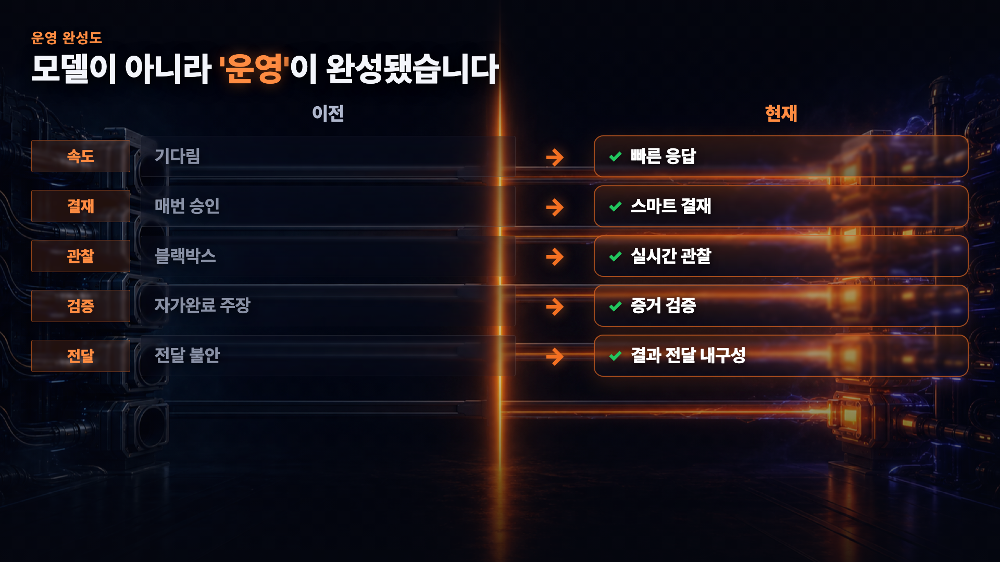
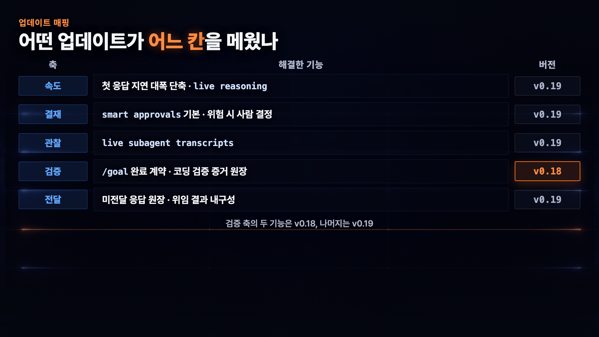
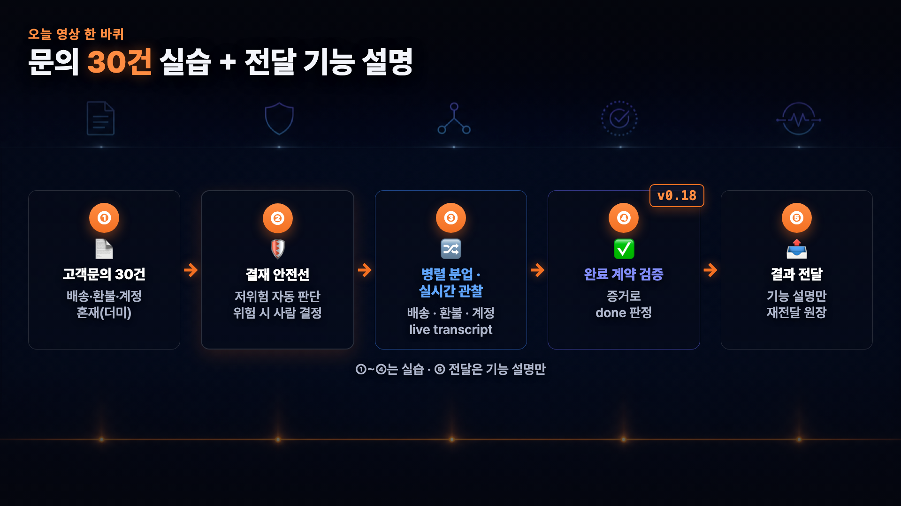
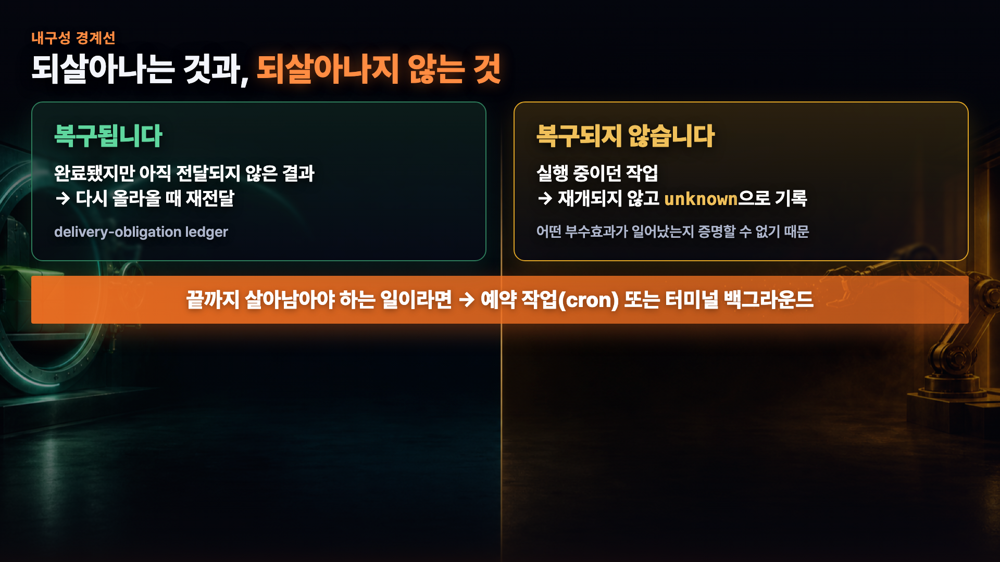

# Hermes Agent 업데이트 상세 가이드 — 더 좋아진 5가지 기능


Hermes Agent를 설치는 했는데, 막상 **실제 업무를 맡기기에** 손이 잘 안 갔던 분들도 계시죠? 뭘 물어보면 답이 뜰 때까지 한참 기다려야 하고, 위험해 보이는 명령은 매번 직접 승인하느라 자리를 못 뜨고, 시켜놓으면 뭘 하는지 안 보이고, "다 했다"는 말은 못 믿어 결국 직접 다시 열어보고, 끝났다는데 결과가 어디에도 안 와 있던 경험이요. 

이번 업데이트는 **모델이 더 똑똑해진 게 아니라**, 일을 맡기고(속도) → 안전선을 설정하고(결재) → 진행을 지켜보고(관찰) → 완료를 증명하고(검증) → 결과를 전달하는(전달) **운영 루프의 빈칸 다섯 개**를 채웠습니다.

> ⚠️ Hermes의 화면·메뉴·CLI 명령·버전 표기는 업데이트로 바뀔 수 있습니다. 이 가이드는 **운영 기능(속도·결재·관찰·검증·전달)** 중심이며, 정확한 최신 동선은 [공식 문서](https://hermes-agent.nousresearch.com/docs)로 확인하세요. 아래 기능들은 **v0.18과 v0.19에 걸쳐** 들어왔고, 어느 버전 기능인지는 2번에서 구분합니다.

---

## 목차

- [1. 한눈에 보는 5가지 변화](#1-한눈에-보는-5가지-변화)
- [2. 어떤 버전에서 들어왔나](#2-어떤-버전에서-들어왔나)
- [3. 실습 전 준비](#3-실습-전-준비)
- [4. 하나의 업무로 4가지 실습하고 전달 기능 이해하기](#4-하나의-업무로-4가지-실습하고-전달-기능-이해하기)
  - [4-1. 속도 — 기다리는 시간이 줄었습니다](#4-1-속도--기다리는-시간이-줄었습니다)
  - [4-2. 결재 — 맡기기 전에 안전선부터 세웁니다](#4-2-결재--맡기기-전에-안전선부터-세웁니다)
  - [4-3. 관찰 — 맡겨놓고 진행이 보입니다](#4-3-관찰--맡겨놓고-진행이-보입니다)
  - [4-4. 검증 — "다 했습니다"를 증거로 바꿉니다](#4-4-검증--다-했습니다를-증거로-바꿉니다)
  - [4-5. 전달 — 끝난 결과를 잃지 않습니다](#4-5-전달--끝난-결과를-잃지-않습니다)
- [5. 참고 자료](#5-참고-자료)

---

## 1. 한눈에 보는 5가지 변화



사람에게 일을 맡길 때 당연히 거치는 순서 — **빠르게 시작하고 → 위험한 건 결재를 받고 → 진행을 보여주고 → 완료를 증명하고 → 결과를 전달한다** — 가 그동안 Hermes에서는 곳곳이 비어 있었습니다. 이번 업데이트가 채운 자리를 축별로 정리하면 아래와 같습니다.

| 축 | 이전 아쉬움 | 좋아진 점 | 사람이 확인할 것 |
|---|---|---|---|
| **속도** | 답이 뜰 때까지 멍하니 기다리고, 멈춘 건지 생각 중인지 몰랐음 | 첫 응답이 빨라지고, 생각 과정이 실시간으로 보임 | 실시간 로그는 '진행 표시'일 뿐, 내용이 맞는지는 사람이 확인 |
| **결재** | 위험해 보이는 명령마다 직접 승인하느라 자리를 못 뜸 | Smart 결재선이 저위험은 그 명령만 통과, 위험·애매하면 사람에게 | 위험·애매한 요청은 반드시 사람이 직접 거부/승인 판단 |
| **관찰** | 시켜놓으면 뭘 하는지 안 보이는 블랙박스 | subagent별 실시간 작업 로그(live transcript)로 진행이 보임 | 로그가 보인다고 결과가 맞는 건 아님 → 결과 검증 필요 |
| **검증** | "다 했습니다" 한 줄을 못 믿어 30건을 다시 열어봄 | `/goal` 완료 계약으로 '증거로 done을 판정' | 검증 기준을 사람이 제대로 적어야 제대로 걸러짐 |
| **전달** | 끝났다는데 결과가 어디에도 안 옴 | 전달 원장으로 '완료·미전달' 결과를 재전달 | 실행 중이던 작업은 재개 안 됨(`unknown`) → 4-5·7번 참고 |

> 💡 일을 맡기고 받는 **운영 과정의 다섯 영역**이 개선 되었습니다.

---

## 2. 어떤 버전에서 들어왔나



다섯 축이 전부 같은 업데이트에서 들어온 건 아닙니다. **네 번째 검증 축만 v0.18**, 나머지 네 축은 v0.19입니다.

| 축 | 해결한 기능 | 버전 |
|---|---|---|
| 속도 | 첫 응답 지연 단축 · live reasoning | `v0.19` |
| 결재 | smart approvals 기본값 · 위험 시 사람 결정 | `v0.19` |
| 관찰 | live subagent transcripts | `v0.19` |
| 검증 | `/goal` 완료 계약 · 코딩 검증 증거 원장 | **`v0.18`** |
| 전달 | 미전달 응답 원장(delivery-obligation ledger) · 위임 결과 내구성 | `v0.19` |

검증 축(v0.18) 안에는 **이름이 비슷하지만 서로 다른 두 기능**이 들어 있습니다. 헷갈리기 쉬워 따로 갈라 둡니다.

| v0.18 검증 기능 | 무엇을 하나 | 이 가이드에서 |
|---|---|---|
| `/goal` 완료 계약(completion contract) | 장기 목표의 'done 기준'을 미리 정하고, 증거가 그 기준을 충족해야 완료로 판정 | 4-4에서 사용 |
| 코딩 검증 증거 원장(coding verification evidence ledger) | 일반 코드 작업의 테스트·린트·빌드 결과를 기록하는 **별도** 장치 | 이번 데모에서는 다루지 않음 |
---

## 3. 실습 전 준비

설치나 서버 세팅은 이 가이드에서 다루지 않습니다. **이미 돌아가고 있는 Hermes 위에서** 시작한다는 전제로, 안전한 테스트 무대만 준비합니다.

| 준비물 | 내용 | 주의 |
|---|---|---|
| Hermes Agent (현행 버전) | v0.18·v0.19 기능이 들어간 최신 버전. 설치는 [공식 문서](https://hermes-agent.nousresearch.com/docs) 참고 | 화면·명령은 버전마다 다를 수 있음 |
| Desktop 앱 (결재 UI) | 상태바의 **Approval Mode**에서 결재 모드를 바꾸는 흐름을 사용 | 설정 파일 직접 편집은 다루지 않음 |
| `고객문의_30건.csv` (또는 동등한 더미 파일) | 배송·환불·계정 문의가 섞인 **가상** 문의 30건 | 실제 고객 데이터 금지 — 직접 만들거나 본인 비민감 샘플 사용 |
| `demo-output/` 폴더 | 분류 결과·FAQ 초안이 저장될 출력 폴더 | 입력 폴더와 출력 폴더를 분리 |

폴더는 입력과 출력만 나뉘면 충분합니다. (아래는 예시 구조이며, 절대경로가 아니라 본인 작업 폴더 안에 만들면 됩니다.)

```text
hermes-demo/
├── demo-input/
│   └── 고객문의_30건.csv      # 더미 문의 30건 (배송·환불·계정 혼재)
└── demo-output/               # 분류 결과 + FAQ 초안이 저장되는 곳 (처음엔 비워둠)
```

> ⚠️ 실습 내내 입력 파일은 **수정하지 않고 그대로 보존**합니다. 실명·전화번호·실주문번호·이메일, API 키 같은 민감 정보는 프롬프트·파일명·데이터 어디에도 넣지 마세요.

---

## 4. 하나의 업무로 4가지 실습하고 전달 기능 이해하기



같은 **더미 문의 30건**으로 ① 분류 시작(속도) → ② 결재 안전선(결재) → ③ 병렬 분업·관찰(관찰) → ④ 완료 검증(검증)까지 직접 확인합니다. ⑤ 전달은 실제 Slack 전송 실습이 아니라, 완료·미전달 결과가 어떻게 재전달되는지 **기능 개념과 경계만 설명**합니다. 섹션마다 새 예제나 새 파일을 도입하지 않습니다.

### 4-1. 속도 — 기다리는 시간이 줄었습니다

첫 지시는 "읽고, 분류 **계획만** 세워라"입니다. 아직 실행은 시키지 않습니다.

```text
고객문의_30건.csv 를 읽어줘.

각 문의를 배송 / 환불 / 계정 중 하나로 분류하고,
카테고리별로 자주 나오는 질문을 묶어서 FAQ 초안을 만들 거야.

지금은 전체 계획만 짧게 알려줘. 실행은 아직 하지 마.
```

> 📌 **첫 응답 속도(TTFT)의 정확한 범위**
> v0.19 **공식 릴리즈 노트** 기준, 콜드 스타트에서 첫 토큰이 뜨기까지의 지연이 약 **4.3초 → 0.9초(약 80% 단축)**로 적혀 있습니다. 이건 **'첫 응답이 시작되는 지연'만**을 가리키는 **공식 수치**입니다. ① 전체 작업이 80% 빨라진다는 뜻이 **아니고**, ② 제작자가 자기 환경에서 직접 잰 값도 **아닙니다.** 체감 속도는 환경에 따라 다릅니다.

숫자보다 체감이 큰 건 **live reasoning**입니다. 생각하는 과정이 실시간으로 그려져서, 커서만 깜빡이며 "멈춘 건가?" 싶던 불안이 줄어듭니다. 데스크톱 앱에서는 채팅창 토글로 켤 수 있습니다(Telegram/Slack은 대화창이 지저분해질 수 있어 권장하지 않습니다).

> 💡 단, **실시간으로 보이는 것은 '진행 상황'이지 '내용이 맞다'는 보장이 아닙니다.** 분류가 제대로 됐는지는 뒤의 검증 단계(4-4)에서 따로 확인합니다.

### 4-2. 결재 — 맡기기 전에 안전선부터 세웁니다

Desktop 상태바의 **Approval Mode**를 **Smart**로 바꿉니다. (설정 파일을 직접 편집하는 방법은 이 가이드에서 다루지 않습니다.)

Smart 결재선은 위험 패턴에 걸린 명령이 올라오면 보조 LLM이 위험도를 **명령 하나하나** 판단합니다.

| Smart 판단 | Smart 결재선의 처리 | 사람의 역할 |
|---|---|---|
| 낮은 위험 — `APPROVE` | **그 명령 하나만** 자동 승인될 수 있음 | 결과만 확인 |
| 위험 — `DENY` | 기본은 차단. 무인·비대화형 실행은 즉시 거부되고, CLI·Slack 같은 대화형 소유자 환경에서는 **그 작업 1회만 예외 승인**할 선택이 나타날 수 있음 | 거부 이유를 확인하고, 특별한 사유가 없으면 예외 승인하지 않음 |
| 애매함 — `ESCALATE` | **사람에게 결정을 넘김** | 직접 승인/거부 판단 |
| 하드라인 차단·사용자 deny 규칙 | 모드나 화면과 관계없이 무조건 차단 | 에이전트 밖에서 직접 처리하거나 정책을 다시 검토 |

> 💡 자세한 기준은 [Hermes 보안 문서](https://hermes-agent.nousresearch.com/docs/user-guide/security)를 확인하세요.

먼저, **위험하진 않지만 결재에 걸릴 수 있는** 읽기 전용 명령입니다.

```text
demo-input/고객문의_30건.csv는 수정하지 말고,
터미널에서 Python -c 한 줄 명령으로 헤더와 데이터 행 수만 확인해줘.

결과는 행 수와 컬럼명만 보고해줘.
```

`python -c`는 스크립트 실행처럼 잡힐 수 있지만, 하는 일은 읽기뿐이라 **그 명령 하나만** 자동 승인으로 지나갈 후보이기도 합니다. 판정이 **명령 단위**로 붙기 때문에, 어느 쪽으로 나오는지는 실제로 돌려서 확인합니다.

> ⚠️ **위험한 요청은 사람이 직접 거부합니다**
> 영상 데모에는 "원본 폴더를 통째로 지우라"는 **위험 요청**도 등장합니다. 이 장면은 진행자가 보고 있는 **대화형 환경**이기 때문에 1회 판단이 사람에게 넘어온 경우입니다. 진행자는 **거부를 선택**하고, 아무것도 지워지지 않습니다.
> 이 가이드는 안전을 위해 **실제 파괴적 명령(파일·폴더 삭제 등)은 싣지 않습니다.** 직접 실습할 때도 위험·애매한 요청은 반드시 **사람이 거부**하세요.

Smart 결재선의 역할은 위험한 일을 무조건 알아서 처리하는 게 아닙니다. **낮은 위험의 승인 피로를 줄이고, 위험 판정은 기본 차단하며, 애매한 판단은 사람에게 돌려주는 1차 결재선**입니다. 대화형 환경에서 Smart `DENY`를 사람이 1회 예외 승인할 수 있더라도, 기본 선택은 거부로 두는 게 안전합니다.

### 4-3. 관찰 — 맡겨놓고 진행이 보입니다

안전선이 섰으니 이제 30건을 실제로 풀어줍니다. 세 명(subagent)에게 카테고리별로 나눠 맡깁니다.

```text
계획대로 실행해줘.

background subagent 3개로 나눠서:
 - 1번: 배송 문의 담당
 - 2번: 환불 문의 담당
 - 3번: 계정 문의 담당

각자 맡은 카테고리의 문의를 정리하고 FAQ 초안 섹션을 작성해줘.
작업 로그는 실시간으로 남겨줘.
```

여기서 확인할 건, 세 개가 각자 뜨면서 **각각의 실시간 로그 파일(live transcript)** 이 같이 떨어지는 부분입니다. subagent는 **각자 격리된 컨텍스트**에서 시작하고, `/agents`로 지금 누가 돌고 있는지 볼 수 있습니다. 예전에는 이 구간이 통째로 안 보여서 엉뚱한 방향으로 가도 끝나봐야 알았지만, 지금은 **가는 중에** 보입니다.

> 💡 **로그가 보인다 ≠ 결과가 맞다.** 실시간 관찰은 진행을 보여줄 뿐 정확성을 보장하지 않습니다. 세 명이 낸 분류·FAQ 초안이 실제로 맞는지는 다음 **검증** 단계에서 확인합니다.

### 4-4. 검증 — "다 했습니다"를 증거로 바꿉니다

"다 했습니다" 한 줄을 못 믿어 결국 30건을 다시 여는 일을 없애려면, **완료 기준을 미리 정해두고** 시작합니다. `/goal`의 **완료 계약(completion contract)** 이 그 역할을 합니다. 현행 버전에서 신뢰할 수 있는 진입점은 아래처럼 초안을 잡는 것입니다.

```text
/goal 고객문의 30건 분류 + FAQ 초안 완성

outcome:      30건 전부가 배송/환불/계정 중 하나로 분류되고,
              카테고리별 FAQ 초안 파일이 존재한다
verification: 분류 결과 건수 합계 = 30, 중복 0, 누락 0,
              FAQ 파일에 세 카테고리 섹션이 모두 존재
constraints:  원본 CSV는 수정하지 않는다
boundaries:   demo-input/ 과 demo-output/ 안에서만 작업
stop_when:    분류 기준이 애매한 문의가 3건 넘으면 멈추고 물어본다
```

| 계약 항목 | 이 데모에서의 내용 |
|---|---|
| outcome | 30건 전부가 배송/환불/계정 중 하나로 분류되고, FAQ 초안 파일이 존재한다 |
| verification | 분류 건수 합계 = 30, 중복 0, 누락 0, FAQ 파일에 세 카테고리 섹션이 모두 존재 |
| constraints | 원본 CSV는 수정하지 않는다 |
| boundaries | `demo-input/` 과 `demo-output/` 안에서만 작업한다 |
| stop_when | 분류가 애매한 문의가 3건을 넘으면 멈추고 물어본다 |

핵심은 **verification**입니다. "뭘로 증명할 거냐"를 미리 정해두면 완료 판정 방식 자체가 바뀝니다. **"다 한 것 같다"로는 done이 안 되고**, 계약에 적어둔 검증 기준이 **실제 결과로 충족됐다는 증거**(건수 합계·중복·누락·섹션 존재 여부)가 있어야 done이 떨어집니다.

> ⚠️ 이건 AI가 스스로 **완벽히 자기검증**을 한다는 뜻이 아닙니다. **사람이 미리 적어둔 기준을 대조**하는 것이라, 기준을 허술하게 쓰면 허술하게 통과합니다. **뭘로 증명할지 정하는 건 여전히 사람 몫**입니다. 또한 `/goal` 완료 계약은 **코딩 검증 증거 원장과는 다른 v0.18 기능**입니다(2번 참고).

### 4-5. 전달 — 끝난 결과를 잃지 않습니다

영상에서는 검증 결과를 Slack으로 직접 보내는 실습을 진행하지 않았습니다. 이 섹션은 v0.19의 **전달 원장(delivery-obligation ledger)** 이 해결하는 문제와 복구 경계를 설명합니다. 기능 동작을 이해하려면, 결과가 다 만들어진 상태에서 **전달 직전에 프로세스가 중단된 상황**을 가정하면 됩니다. 전달 원장이 "이 응답은 아직 전달 안 됨"을 기록해 두기 때문에, 복구되면 그 빚을 갚아 **재전달**합니다.



다만 여기에 **오해하면 안 되는 부분**이 있습니다.

| 재시작 후 | 복구되나? | 설명 |
|---|---|---|
| **완료됐지만 아직 전달 안 된 결과** | ✅ 복구 → 재전달 | 전달 원장에 '미전달'로 남아 있어, 다시 올라오면 전달 |
| **실행 중이던 작업(자식)** | ❌ 재개 안 됨 | 이어서 굴러가지 않고 `unknown`으로 기록 — 어떤 부수효과가 일어났는지 증명할 수 없기 때문 |

> ⚠️ **모든 진행 중 작업이 재시작을 견디는 게 아닙니다.** 복구되는 건 '완료·미전달 결과'뿐이고, 실행 중이던 작업은 재개되지 않고 `unknown`이 됩니다. 그러니 **중간에 끊기면 안 되는 일**은 이 방식이 아니라 **예약 작업(cron)** 이나 **추적되는 터미널 백그라운드 프로세스**로 돌리세요.

정리하면 그 30건은 — 분류 지시가 바로 시작되고 → 위험한 동작은 결재선에서 걸리고 → 세 명이 나눠 일하는 걸 실시간으로 보고 → 완료가 증거로 판정되는 **①~④를 실습으로 확인**합니다. ⑤ 전달은 Slack 실전송 없이, **완료됐지만 미전달된 결과만 재전달되고 실행 중 작업은 `unknown`이 되는 경계**를 기능 설명으로 다룹니다.

---

## 5. 참고 자료

| 자료 | 링크 |
|---|---|
| Hermes v0.19.0 (Quicksilver) 릴리즈 노트 | https://github.com/NousResearch/hermes-agent/releases/tag/v2026.7.20 |
| Hermes v0.18.0 릴리즈 노트 | https://github.com/NousResearch/hermes-agent/releases/tag/v2026.7.1 |
| Subagent Delegation (공식 문서) | https://hermes-agent.nousresearch.com/docs/user-guide/features/delegation |
| Persistent Goals (공식 문서) | https://hermes-agent.nousresearch.com/docs/user-guide/features/goals |
| Security (공식 문서) | https://hermes-agent.nousresearch.com/docs/user-guide/security |
| Scheduled Tasks / Cron (공식 문서) | https://hermes-agent.nousresearch.com/docs/user-guide/features/cron |

> 이 가이드는 시민개발자 구씨(@citizendev9c) 영상의 상세 설명 자료입니다. Hermes의 기능·화면·버전 표기는 업데이트로 바뀔 수 있으니, 실제 사용 전 **공식 문서**를 함께 확인하세요.
