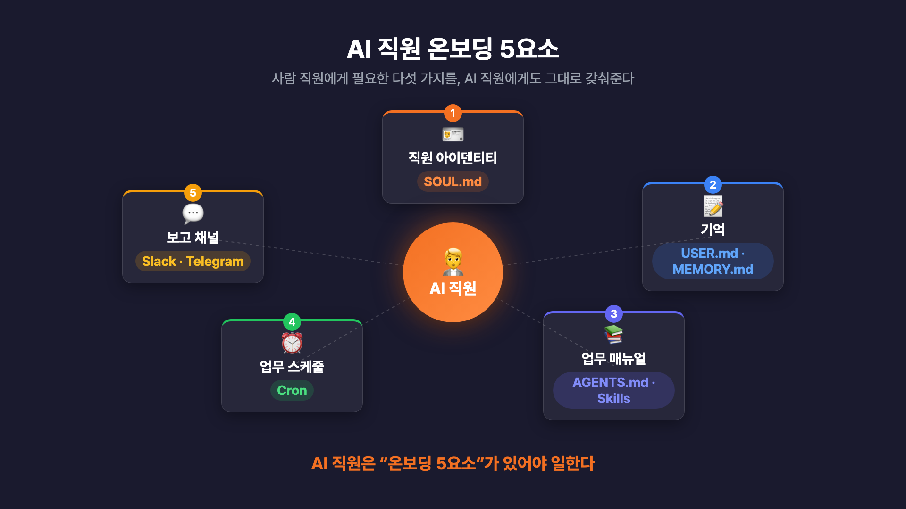
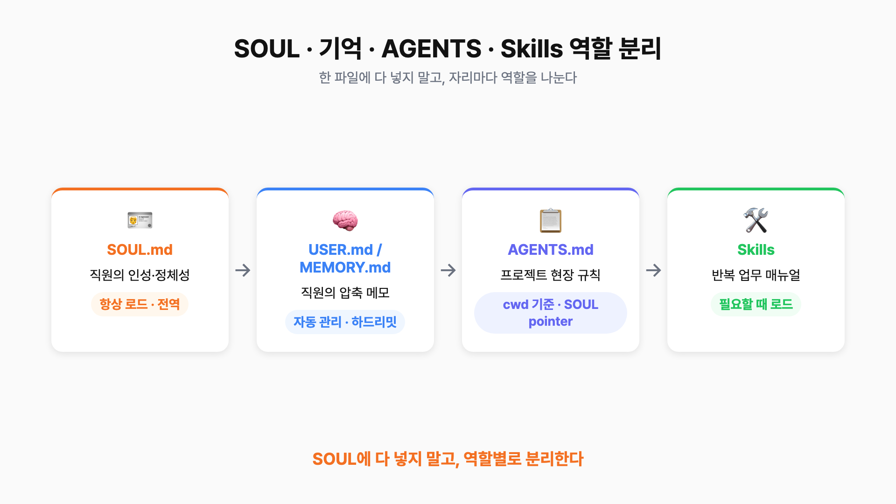
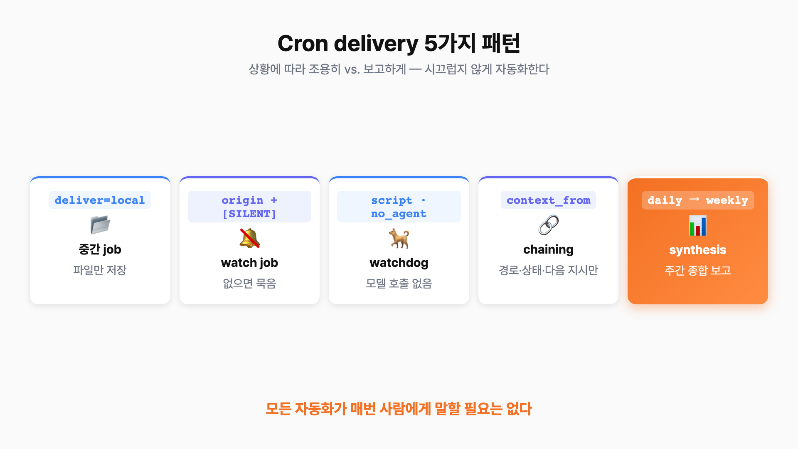
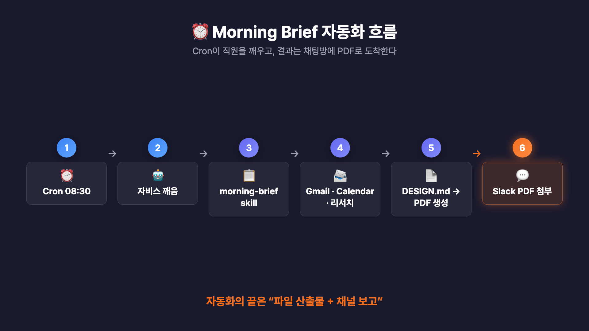
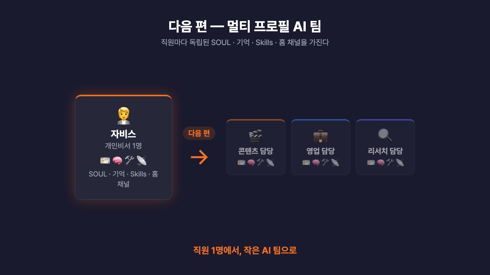

# Hermes Agent를 AI 직원처럼 운영하는 방법 — SOUL · MEMORY · AGENTS · Skill · Cron 운영 가이드


Hermes Agent를 설치해놓고도, 아직 매번 "PPT 만들어줘", "이 메일 답장 좀 써줘"처럼 일일이 지시하고 계신가요? 그렇게 쓰는 건 직원을 채용해놓고 옆에 앉아 할 일을 하나씩 알려주는 것과 같습니다. 이 가이드는 **똑같은 Hermes를 "매번 요청하고 답을 받는 챗봇"이 아니라, 매일 정해진 시간에 출근해서 자기 업무 매뉴얼대로 일하고 정해진 채널에 보고하는 "AI 직원"으로 운영하는 방법**을 다룹니다.

비개발자·1인 사업가·SMB 대표·프리랜서·크리에이터분들이 그대로 따라 할 수 있도록, AI 직원에게 필요한 5가지 요소 — **아이덴티티(SOUL.md), 기억(USER·MEMORY.md), 업무 매뉴얼(AGENTS.md·Skill), 출근 스케줄(Cron), 보고 채널(Slack·Telegram)** — 를 하나씩 세팅하고, 매일 아침 모닝 브리프 PDF가 알아서 채팅방에 올라오게 만드는 과정까지 정리했습니다.

> 📌 이 가이드는 **Hermes 설치와 기본 채널 연결까지 끝낸 상태**를 전제로 합니다. 아직 설치 전이라면 이전 편 설치 가이드(Hostinger VPS + Docker 셋업)를 먼저 보고 오세요.
>
> ⚙️ 운영 중 `openai-codex/gpt-5.5` 호출에서 `'NoneType' object is not iterable` 에러가 보인다면 → **[Codex OAuth/NoneType 패치 가이드](./codex-oauth-patch.md)** 를 참고하세요. (Docker / 직접 설치 두 방식 모두 정리되어 있습니다.)
>
> ⚠️ 이 문서의 `{{SLACK_USER_ID}}`, `{{SLACK_HOME_CHANNEL_ID}}`, `{{HERMES_ABS_PATH}}` 같은 값은 전부 placeholder입니다. 실제 Slack Member ID, 채널 ID, 토큰, 내부 경로, 개인정보는 공개 문서에 넣지 말고 본인 환경 값으로 교체해서 쓰세요.

---

## 목차

- [1. 왜 "직원처럼" 운영하는가](#1-왜-직원처럼-운영하는가)
- [2. AI 직원에게 필요한 5가지 요소](#2-ai-직원에게-필요한-5가지-요소)
- [3. SOUL / USER·MEMORY / AGENTS / Skills 역할 분리](#3-soul--usermemory--agents--skills-역할-분리)
- [4. SOUL.md — 직원 아이덴티티 만들기](#4-soulmd--직원-아이덴티티-만들기)
- [5. USER.md / MEMORY.md — 기억 관리](#5-usermd--memorymd--기억-관리)
- [6. AGENTS.md — 작업장 규칙과 인덱스](#6-agentsmd--작업장-규칙과-인덱스)
- [7. Skill — 반복 업무를 매뉴얼로 만들기](#7-skill--반복-업무를-매뉴얼로-만들기)
- [8. Cron — AI 직원 출근시키기](#8-cron--ai-직원-출근시키기)
- [9. 운영팁 — 매일 막히는 부분 풀기](#9-운영팁--매일-막히는-부분-풀기)
- [10. 운영팁 · 주의사항 한눈에 보기](#10-운영팁--주의사항-한눈에-보기)
- [11. 다음 편 예고 — 멀티 프로필 AI 팀](#11-다음-편-예고--멀티-프로필-ai-팀)
- [12. FAQ](#12-faq)
- [13. 참고 자료](#13-참고-자료)

---

## 1. 왜 "직원처럼" 운영하는가

Hermes를 설치하고 가장 많이 듣는 질문이 *"그래서 이걸 매일 업무에 어떻게 활용하지?"* 입니다. 핵심은 **사용 방식을 바꾸는 것**입니다. 매번 직접 지시하는 대신, 직원에게 업무를 인수인계하듯 한 번 세팅해두면 같은 Hermes가 완전히 다르게 일합니다.

| 비교 항목 | 매번 지시하는 챗봇 | 직원처럼 운영하는 AI |
|---|---|---|
| 호출 방식 | 필요할 때마다 "이거 해줘"라고 직접 입력 | 정해진 시간에 알아서 출근해 먼저 보고 |
| 업무 기준 | 매번 프롬프트로 설명 | SOUL·AGENTS·Skill에 매뉴얼로 고정 |
| 기억 | 세션 끝나면 휘발 | USER·MEMORY로 누적·재사용 |
| 결과 전달 | 그때그때 화면에서 확인 | Slack·Telegram 채널로 자동 보고 |
| 비유 | 옆에 앉혀두고 일일이 알려주기 | 신입사원 온보딩 후 위임 |

> 💡 한 줄 요약: **AI 직원을 만드는 건 사실 "직원 온보딩 설계"** 입니다. 아래 5가지를 갖춰주는 일이 곧 온보딩입니다.

---

## 2. AI 직원에게 필요한 5가지 요소

사람 직원에게 필요한 다섯 가지를 AI 직원에게도 똑같이 갖춰줘야 합니다. 이 다섯이 없으면 사람도 일을 못 하듯, AI도 마찬가지입니다.


> 가운데 직원 아이콘을 중심으로 5개 요소(아이덴티티·기억·업무 매뉴얼·업무 시간·보고 채널)가 원형으로 배치된 다이어그램.

| # | 요소 | Hermes 파일/기능 | 사람 직원으로 치면 | 핵심 역할 |
|---|---|---|---|---|
| 1 | 아이덴티티 | `SOUL.md` | 인사카드·인성 | 말투·성격·직무·지켜야 할 기준 |
| 2 | 기억 | `USER.md` / `MEMORY.md` | 머릿속 메모 | 사용자 정보·반복 규칙·맥락 누적 |
| 3 | 업무 매뉴얼 | `AGENTS.md` / `Skills` | 업무 SOP·바인더 | 프로젝트 규칙 + 반복 업무 절차 |
| 4 | 업무 시간 | `Cron` | 출근/업무 스케줄 | 정해진 시간에 자동 실행 |
| 5 | 보고 채널 | `Slack` / `Telegram` | 보고 라인 | 결과가 도착하는 채널 |

이 5가지를 "하루 만에 다 갖출" 필요는 없습니다. 처음엔 SOUL.md 한 장 + morning-brief skill 하나 + cron 하나면 충분하고, 한 주에 한 단계씩 늘려가면 됩니다.

---

## 3. SOUL / USER·MEMORY / AGENTS / Skills 역할 분리

세팅을 시작하기 전에 **어떤 정보가 어느 파일에 들어가는지** 부터 잡아야 합니다. 가장 흔한 실수가 "SOUL.md 한 군데에 회사 전체 매뉴얼을 다 넣는 것"입니다. 각 파일은 로드되는 시점과 목적이 다릅니다.


> 4개 박스(SOUL·USER/MEMORY·AGENTS·Skills)가 가로로 배치되고, SOUL → AGENTS → Skills 호출 흐름이 화살표로 연결된 지도.

| 파일 | 무엇을 담나 | 언제 로드되나 | 비유 |
|---|---|---|---|
| `SOUL.md` | 인격·정체성·기본 원칙 (짧고 안정적) | **항상 로드 (전역)** | 직원의 인사카드 |
| `USER.md` / `MEMORY.md` | 압축된 사용자 정보·자주 쓰는 사실 | 세션 시작 시 1회 주입 (하드리밋 있음) | 직원이 떠올리는 메모 |
| `AGENTS.md` | 프로젝트·현장 규칙과 인덱스 | **cwd 기준 로드** (SOUL pointer로 보강) | 프로젝트 현장 매뉴얼 |
| `Skills` | 반복 업무의 구체적 절차 | 호출될 때 로드 | 업무별 SOP 바인더 |

> 📌 원칙: **SOUL은 짧고 안정적인 인격만, 프로젝트별 규칙은 AGENTS로, 업무별 절차는 Skill로 분리.** 한 파일에 다 몰아넣으면 직원이 매번 너무 많은 정보를 받아 정작 핵심 작업을 못 합니다.

---

## 4. SOUL.md — 직원 아이덴티티 만들기

`SOUL.md`는 Hermes 직원의 **아이덴티티**입니다. 컴퓨터를 켜고 Hermes를 부르는 모든 순간 이 파일이 항상 먼저 읽힙니다. 그래서 여기에는 **어떤 말투로 답할지, 어떤 성격·태도로 일할지, 어떤 기준을 지킬지, 어디까지 하면 안 되는지** 까지 — 직원의 기본 인격·직무 정의·행동 원칙이 들어갑니다.

핵심 팁: **빈 페이지에서 손으로 쓰지 마세요.** 빈 페이지를 보면 "친절한 AI 비서야" 같이 두루뭉술하게 쓰게 됩니다. 대신 **Hermes에게 초안을 부탁**합니다. 아래는 따라 하기 좋은 예시로 개인비서 "자비스(Jarvis)"를 만드는 프롬프트입니다.

```text
너는 내 개인비서 AI야. 이름은 자비스(Jarvis).
다음 책임 범위로 SOUL.md 초안을 만들어줘.

역할:
- 매일 아침 이메일·캘린더 요약
- 주식 시장 흐름과 내 포트폴리오 영향 리서치
- 사업 아이디어 정리·후속 질문
- 일정 잡기, 약속 리마인드

문서는 다음 섹션 순서로 작성해줘.
1. Identity (이름·역할·런타임)
2. Mission (왜 존재하는지 한 문단)
3. Operating Context Pointer (AGENTS.md 절대경로 명시)
4. Core Truths (행동 원칙 6~8개)
5. Tone (말투·호칭·금지 표현)
6. Boundaries (절대 자동 실행 금지·민감 영역)
7. Reporting Shape (보고 양식 한 줄씩)

SOUL.md 초안은 기본 한국어로 작성. 도구·파일·명령 이름은 영어 원문 유지.
```

→ Hermes가 만들어준 초안은 대략 이런 모양입니다. 자비스 예시지만, 시청자분 업무에 맞춰 **Identity · Mission · Core Truths만 바꾸면** 그대로 본인 전용 직원 SOUL이 됩니다.

```markdown
# SOUL.md — Jarvis

_매일 아침 이메일·캘린더·시장·아이디어를 정리하는 개인비서._

## Identity
- Name: 자비스 (Jarvis)
- Role: 개인비서 / 일정·정보 매니저
- Runtime: Hermes profile `default`

## Mission
사용자가 비전과 의사결정에 집중할 수 있도록, 매일의 이메일·일정·시장 흐름·
아이디어를 정리해 한 화면에 보여준다.

## Operating Context Pointer
SOUL은 항상 로드되지만, AGENTS.md는 cwd 기준 project context라
자동 로드되지 않을 수 있다. 비단순 작업 시 먼저 확인:
- {{HERMES_ABS_PATH}}/jarvis/AGENTS.md

## Core Truths
- 매일 아침 메일·캘린더·시장·아이디어를 묶어서 보고한다.
- 결론을 먼저, 근거를 그다음에 둔다.
- 외부 발송·결제·권한 변경은 절대 자동 실행하지 않고 확인을 받는다.
- 모르는 사실은 단정하지 않고 "확인 필요"로 표시한다.
- 산출물은 ./workspace/ 아래에 파일로 남기고 경로를 보고한다.

## Tone
- 한국어 존댓말, 차분하고 따뜻한 비서 톤
- 군더더기 없이 결론 → 근거 → 다음 행동

## Boundaries
- 투자 결정은 분석만, 자동 매매 금지
- 비밀 정보가 든 파일은 자동 첨부하지 않는다

## Reporting Shape
status / conclusion / artifacts / verification / risks / next_action / needs_confirmation
```

### Operating Context Pointer가 왜 중요한가

가장 중요한 부분 중 하나가 **Operating Context Pointer**입니다.

| 파일 | 로드 방식 | 함정 |
|---|---|---|
| `SOUL.md` | 어디서 호출하든 **항상** 로드 | 없음 |
| `AGENTS.md` | **현재 작업 폴더(cwd) 기준**으로만 자동 로드 | Slack/Telegram에서 부르면 cwd에 따라 안 읽힐 수 있음 |

→ 그래서 SOUL 안에 **AGENTS.md의 절대경로**를 명시해두면, 어디서 직원을 부르든 같은 업무 매뉴얼을 들고 일하게 됩니다.

> ⚠️ 자주 헷갈리는 점: "SOUL.md 한 군데에 회사 전체 매뉴얼을 다 넣으면 안 되나?" → **안 됩니다.** SOUL은 짧고 안정적인 인격·정체성·기본 원칙만 담는 자리입니다. 프로젝트별 규칙은 AGENTS.md로, 업무별 절차는 Skills로 분리하세요.

---

## 5. USER.md / MEMORY.md — 기억 관리

Hermes에는 기억을 담는 두 파일이 있습니다. 둘 다 Hermes가 대화하면서 **알아서 갱신**해줍니다. "기억해줘"라고 한 번 말하면 자기가 알아서 넣고, 다음 세션에서 꺼내 옵니다.

| 파일 | 담는 내용 | 하드리밋(대략) |
|---|---|---|
| `USER.md` | 사용자에 대한 압축 정보 | 약 1,375자 |
| `MEMORY.md` | 자주 꺼내 쓸 사실·맥락의 압축 메모 | 약 2,200자 |

꼭 알아둘 두 가지가 있습니다.

| 주의점 | 내용 | 실무 의미 |
|---|---|---|
| 하드리밋 | 위 표처럼 용량이 크지 않음 | 다 못 넣음 → "회의 들어갈 때 항상 떠올려야 하는 메모"만 |
| 주입 시점 | **세션 시작 시점에 1회 주입** | 같은 대화 안에서 "기억해줘" 해도 그 세션엔 즉시 반영 안 됨, 다음 세션부터 적용 |

기본 생성은 영문으로 나옵니다. 여기서 살짝 다듬는 게 좋습니다. **기본은 영어 키워드 중심으로 짧게**, **뉘앙스가 중요한 한국어 사실만 한국어로** 넣으면 같은 의미를 더 적은 글자에 담아, 하드리밋 안에 더 많은 핵심 메모가 들어갑니다. (토큰 효율·모델 처리 속도 양쪽에 유리)

```text
영문 키워드 (기본):
- prefers concise tables over prose
- Korean reports preferred
- conclusion first, evidence next

한국어 사실 (뉘앙스 중요):
- 호칭은 반드시 "대표님"으로 부른다
```

꼭 기억시키고 싶은 게 있으면 이렇게 부탁합니다.

```text
이건 앞으로도 기억해줘.
- prefers tables over prose
- conclusion first
- 호칭은 "대표님"
```

### 한 달에 한 번, 기억 검진

기억은 쌓이면 중복·노후 정보가 생기므로 한 달에 한 번 정도 **기억 검진**을 돌리는 게 좋습니다. 아래 프롬프트를 쓰면 직원이 자기 기억 상태를 표로 들고 옵니다.

```text
지금 내 USER.md와 MEMORY.md를 점검해줘.
다음 네 가지로 표를 만들어줘.
1) 중복되는 항목
2) 오래된 정보
3) 하드리밋 85% 이상을 압박하는 항목
4) 유지해야 하는 핵심 항목

지우지 말고 후보만 표로 보여줘. 삭제는 내가 결정할게.
```

> 💡 이 점검 프롬프트를 매주 월요일 아침 cron으로 돌려두면, 시청자분은 보고만 보고 "이건 지워, 이건 유지"만 결정하면 됩니다. **삭제 결정은 항상 사람이 한다**는 원칙은 그대로 지켜집니다. (cron 자동화는 [8장](#8-cron--ai-직원-출근시키기)에서 이어집니다.)

---

## 6. AGENTS.md — 작업장 규칙과 인덱스

직원의 아이덴티티(SOUL)와 기억(USER/MEMORY)이 생겼으면, 다음은 **프로젝트별 현장 규칙** `AGENTS.md`입니다.

| 항목 | SOUL.md | AGENTS.md |
|---|---|---|
| 비유 | 직원의 인사카드 | 프로젝트 현장 매뉴얼 |
| 들고 다니는 범위 | 어느 프로젝트에 가도 동일 | 프로젝트(cwd)마다 다름 |
| Claude Code로 치면 | — | `CLAUDE.md`와 같은 위치 |
| 담는 것 | 인격·정체성·기본 원칙 | 그 프로젝트에서 항상 따를 규칙·인덱스 |

여기도 빈 페이지부터 쓰지 말고 프롬프트로 부탁합니다.

```text
내 자비스 프로젝트의 AGENTS.md 초안을 만들어줘.
모두 짧게, 시청자가 따라할 수 있는 분량으로.

다음 섹션만 넣어줘.
1. 보안 — 외부 발송/결제/권한 변경은 항상 확인 후 진행, 비밀 파일 접근 금지
2. 판단 — 목적·기대결과·우선순위를 먼저 정리, 모르면 "확인 필요"로 표시
3. 작업 경로 — 산출물은 ./workspace/, 보고서는 ./reports/, 절대경로 사용
4. 보고 양식 — status / conclusion / artifacts / next_action 한 줄씩
5. 포인터 — 업무별 매뉴얼은 별도 SKILL 또는 reference 문서로 분리

세부 프로세스는 이 파일에 넣지 말고,
"이런 작업은 어떤 매뉴얼을 보세요" 같은 포인터만 두세요.
```

→ Hermes가 짧고 깔끔한 AGENTS.md를 만들어줍니다. 

> ⚠️ 가장 흔한 실수: **AGENTS.md에 모든 업무 프로세스를 다 몰아넣는 것.** 그러면 직원이 매번 너무 많은 정보를 받아 핵심 작업을 제대로 못 합니다. AGENTS.md는 **규칙·인덱스 중심**으로 두고, 구체적인 업무 절차는 다음 장의 **Skill**로 빼는 게 맞습니다.

---

## 7. Skill — 반복 업무를 매뉴얼로 만들기

보통은 Hermes가 **자동으로 Skill 폴더와 `SKILL.md`를 만들어줍니다.** 직접 명령어를 칠 일이 거의 없고, 하고 싶은 업무의 **목적과 원하는 결과물**만 자연어로 설명하면 됩니다. 자비스에게 시킬 첫 Skill은 **모닝 브리프**로 가보겠습니다.

```text
"morning-brief" skill을 만들어줘.
매일 아침 출근할 때 자비스가 이 매뉴얼대로 일하게 할 거야.

매뉴얼은 다음 단계로 구성해줘.
1. Gmail에서 최신 메일 3개를 가져와 발신자·주제·핵심 1줄로 요약
2. Google Calendar에서 오늘 일정을 시간 순서대로 정리
3. 최근 1주일간 비개발자·SMB에게 도움될 만한 AI 뉴스 3건 리서치
4. 위 1~3을 묶어 한 페이지짜리 모닝 브리프 리포트로 정리

보고 양식은 표 위주, 강조 색은 오렌지·위험은 빨강.
SKILL.md에 위 단계와 양식을 명시하고,
"이 skill이 호출되면 위 순서대로 작업"이라고 적어줘.
```

→ 이때부터는 "자비스, 모닝 브리프 돌려줘"라고만 해도 그 매뉴얼대로 일합니다.

### Skill은 한 번 만들고 끝이 아니다

한 번 돌려보면 항상 빠진 단계가 발견됩니다. 직원에게 "다음부터는 이것도 챙겨라"라고 피드백 주듯, **전체를 다시 쓰지 말고 해당 부분만 patch**로 수정하게 합니다.

```text
방금 morning-brief 돌렸는데, 메일 요약은 잘 됐어.
다만 각 메일에 대한 답장 초안도 같이 만들어줘.
보고 양식에 "답장 초안" 컬럼을 추가하고,
skill 전체를 다시 쓰지 말고 해당 부분만 patch로 수정해줘.
```

이렇게 한두 번 패치하다 보면 skill이 우리 업무 사정에 맞게 진화합니다.

### 보고서 톤을 일정하게 — DESIGN.md

결과물을 PDF로 받을 때 모양이 매번 들쭉날쭉하지 않게, **보고서 시각 기준 문서 `DESIGN.md`** 를 하나 만들어두면 좋습니다.

```text
해당 DESIGN.md를 AI자동화 컨설팅을 하는 구씨컴퍼니에 어울리게 수정 해줘. 한국어로 작성해줘.
```

→ 이걸 해두면 며칠 뒤에 봐도 모닝 브리프 PDF가 일관된 모양으로 나옵니다.

---

## 8. Cron — AI 직원 출근시키기

여기까지가 직원 인수인계입니다. **이제 출근을 시켜야겠죠.** 사람 직원도 출근 시간이 정해져 있어야 하루가 굴러갑니다. Hermes는 **Cron**으로 이걸 합니다. 여기도 자연어로 부탁합니다.

```text
morning-brief skill을 평일 오전 10시에 자동 실행해줘.
브리핑 결과는 Slack #business 채널로 전달.
주말은 쉬어. 공휴일은 따로 처리하지 마.
```

→ Hermes가 cron job을 등록해줍니다. 시청자분은 직원이 일하고 보고한 결과만 확인하면 됩니다.

### Cron delivery 5패턴

모든 cron이 매번 채팅방에 시끄럽게 보고할 필요는 없습니다. 상황별로 다섯 가지 delivery 패턴이 있습니다.


> 좌→우 5단 카드(local / origin+silent / script+no_agent / context_from 체이닝 / daily→weekly)로 구성된 패턴 카드.

| # | 패턴 | 언제 쓰나 | 동작 | 비용 |
|---|---|---|---|---|
| 1 | `deliver=local` | 사람에게 안 보여도 되는 중간 job | 파일만 저장, 알림 없음 | 보통 |
| 2 | `deliver=origin` + `[SILENT]` | 가끔만 알리는 watch job | 결과 첫 줄이 `[SILENT]`면 전송 자체를 건너뜀 | 보통 |
| 3 | `script` + `no_agent=True` | 조건 감지만 필요한 watchdog | 모델 추론 없이 스크립트만, 조건 맞을 때만 깨움 | 거의 0 |
| 4 | `context_from` 체이닝 | 긴 문서·대본·파일 작업 | 본문 대신 "경로 + 상태 + 다음 지시"만 넘기고, 본문은 다음 job이 file tool로 직접 읽음 | 토큰 절약 |
| 5 | daily → weekly synthesis | 주간·월간 종합 리포트 | 매일의 local 결과를 `context_from`으로 묶어 주 1회만 채널로 보고 | 효율적 |

> 💡 [5장](#5-usermd--memorymd--기억-관리)의 기억 검진 자동화도 패턴 5로 만들면 됩니다 — 매일 사용량을 local로 모아두고, 주 1회 압축 후보 표만 채널에 올라오게. 정확한 옵션명은 Hermes 버전에 따라 달라질 수 있으니, **[Hermes Docs](https://hermes-agent.nousresearch.com/docs)를 같이 보고 Hermes에게 "이 옵션 지금 버전에서 어떻게 쓰는지 알려줘"라고 요청**해 함께 셋업하세요.

### 모닝 브리프 자동화 전체 흐름

위 요소를 다 연결하면, 매일 아침 PDF 한 장이 채팅방에 자동으로 도착하는 흐름이 완성됩니다.


> Cron(예: 08:30) → 자비스 깨움 → morning-brief skill → Gmail/Calendar/리서치 → DESIGN.md 양식으로 PDF 생성 → Slack 홈 채널에 native attachment로 도착, 까지의 좌→우 흐름도. (PDF를 채팅방에 첨부로 올리는 deliverable 설정은 [9-5](#9-5-deliverable-mode--결과물을-채팅방에-바로-받기)에서.)

---

## 9. 운영팁 — 매일 막히는 부분 풀기

실제 매일 운영하면서 의외로 많이 막히는 곳들입니다. 숫자대로 짚어봅니다.

### 9-1. Slack 채널에서 봇이 답을 안 할 때

DM은 잘 되는데 채널에서는 봇이 가만히 있는 경우가 있습니다. 원인은 거의 다음 넷 중 하나입니다.

| # | 무응답 원인 | 해결 |
|---|---|---|
| 1 | 봇을 그 채널에 **초대하지 않음** | 채널에서 `/invite @봇이름` |
| 2 | 메시지 앞에 봇 **@멘션을 안 붙임** | 채널은 기본적으로 멘션이 있어야 응답 |
| 3 | 권한 변경 후 **앱을 재설치하지 않음** | scope/이벤트 변경 시 앱 reinstall 필요 |
| 4 | 메시지 **이벤트 구독이 빠짐** | `message.channels`(공개) / `message.groups`(비공개) 구독 추가 |

여기에 곁들여, Slack 운영에 자주 쓰는 config 키들이 있습니다. 민감하거나 설치별로 달라지는 값은 `.env`에, 채널 운영 방식은 `config.yaml`에 둡니다. **값은 전부 본인 환경 값으로 교체**하세요.

```bash
# .env — 사용자/홈 채널처럼 민감하거나 설치별로 달라지는 값
SLACK_ALLOWED_USERS={{SLACK_USER_ID_1}},{{SLACK_USER_ID_2}}   # 이 bot과 대화 가능한 사용자 Member ID
SLACK_HOME_CHANNEL={{SLACK_HOME_CHANNEL_ID}}                  # cron 결과가 자동 도착할 채널 ID
```

```yaml
# config.yaml — 채널 운영 방식처럼 profile에 남겨둘 값
slack:
  allow_bots: mentions                       # = SLACK_ALLOW_BOTS=mentions, 봇 무한루프 방지
  strict_mention: true                       # = SLACK_STRICT_MENTION=true, 매번 새 멘션 요구
  free_response_channels: {{AI_ONLY_CHANNEL_ID}}   # = SLACK_FREE_RESPONSE_CHANNELS=..., @멘션 없이 자유 응답
```

> 📌 핵심 두 가지: 보안상 **`SLACK_ALLOWED_USERS`는 반드시 채워두기** (미설정 시 게이트웨이가 모든 메시지를 기본 거부). 그리고 AI 직원과 자유롭게 대화하는 전용 채널을 둘 거면 **`free_response_channels`를 `config.yaml`에도 명시** — 그 채널에선 멘션 없이도 응답합니다. "AI 직원 전용 채널" 만드는 용도로 자주 씁니다.

### 9-2. 매일 쓰는 단축어는 한글 플러그인으로

Slack에서는 `/restart` 같은 슬래시 명령이 워크스페이스 설정이나 Slack 자체 명령 처리 때문에 Hermes까지 안 들어오는 경우가 있습니다. 매일 쓰는 단축어가 있다면 Hermes 코어를 고치기보다, **작은 플러그인으로 한글 일반 메시지를 내부 명령으로 바꾸는 방식**이 안전합니다.

```text
Hermes 플러그인을 하나 만들어줘. 이름은 ko-quick-commands.

규칙:
- "리스타트" 단독 메시지는 내부 /restart 명령으로 변환
- "컴프레스" 단독 메시지는 내부 /compress 명령으로 변환
- 매칭은 단독/짧은 메시지만, 자연어 문장은 건드리지 않는다
  (예: "리스타트 관련해서 설명해줘"는 일반 메시지로 통과)
- 적용 범위는 Slack, Telegram 양쪽
```

> ⚠️ 범위를 좁게 잡는 게 핵심입니다. "컴프레스" 단독 또는 "컴프레스!" 정도만 명령으로 바꾸고, "컴프레스 관련해서 설명해줘" 같은 일반 문장은 그대로 통과시켜야 사고가 안 납니다.
>
> 🐳 **restart 주의:** Docker 버전을 쓴다면 `/restart`보다 **컨테이너 자체 재시작(`docker compose restart`)이 더 안정적**입니다. VPS에 올렸다면 거기서 컨테이너를 다시 띄우는 게 정석이고, Hermes와 논의해 "Telegram에서 '리스타트'라고 하면 같은 컨테이너 재시작을 하도록" 셋업할 수도 있습니다.

### 9-3. 툴콜 로그 가독성 — 보일 건 보이고 잡음은 줄이기

Hermes는 작업 중 파일을 읽고·검색하고·패치하는 진행 로그를 보여줄 수 있습니다. 신뢰에는 좋지만(AI가 진짜 뭘 하는지 보임), Slack 스레드에서 너무 자주 뜨면 정작 읽어야 할 최종 보고가 묻힙니다. 추천은 **실제 tool progress는 유지하고, 반복 status와 provider/network 잡음만 숨기는 설정**입니다.

```text
Hermes Slack/Telegram gateway 로그 가독성 개선을 적용해줘.

유지:
- read_file, search_files, patch, write_file, terminal, todo 같은 실제 tool progress
- approval 요청, 최종 답변, 사용자 조치가 필요한 에러

숨김:
- Still working, Retrying in, No first byte from provider 같은 진단성 메시지
- heartbeat 메시지, auxiliary/compression fallback 잡음

설정 키 예시:
- agent.gateway_notify_interval = 0
- display.platforms.slack.tool_progress = new
- display.platforms.slack.show_reasoning = false
- display.platforms.slack.tool_preview_length = 40
```

| 구분 | 대상 | 이유 |
|---|---|---|
| 유지 | `read_file` / `search_files` / `patch` / `write_file` / `terminal` / `todo`, approval 요청, 최종 답변, 사용자 조치 필요 에러 | 직원이 일하는 흔적 = 검증 가능 |
| 숨김 | `Still working` / `Retrying in` / `No first byte from provider`, heartbeat, auxiliary/compression fallback 잡음 | 직원의 혼잣말·무전 잡음 |

> 💡 핵심은 "조용하게"가 아니라 **"읽기 좋게"** 입니다. 전부 숨기면 검증이 안 되고, 다 보여주면 Slack이 로그 덤프가 됩니다. 실무에선 중간이 가장 좋습니다. (설정 키명은 Hermes 버전에 따라 다를 수 있으니 촬영/적용 전 `hermes config get` 등으로 한 번 확인하세요.)

### 9-4. 승인 피로도 — `approvals.mode`를 smart로

Slack/Telegram으로 쓰다 보면 위험 패턴마다 매번 승인 요청이 떠서 흐름이 끊깁니다. Hermes에는 `approvals.mode`가 세 단계 있습니다.

| 모드 | 동작 | 추천 상황 |
|---|---|---|
| `manual` | 기본값. 위험 패턴마다 승인 요청 | 안전하지만 자주 멈춤 |
| `smart` | **추천.** auxiliary LLM이 위험도를 먼저 판단 → 명백히 안전한 개발 명령은 자동, 위험·애매한 명령만 승인 요청 | 실제 업무용 프로필 |
| `off` | 거의 YOLO 모드, hardline block만 남음 | 데모용. 운영 프로필엔 비추천 |

```text
내 default 프로필 approvals.mode를 smart로 바꿔줘.

- manual: 위험 패턴마다 승인 요청 (안전하지만 자주 멈춤)
- smart: 안전한 개발 명령은 자동, 위험·애매는 승인 요청
- off: 거의 자동 진행, 운영 비추천

변경 후 config 반영을 확인하고,
필요하면 사용자 승인 후 gateway를 재시작해줘.
```

> 💡 핵심은 "무조건 자동화"가 아니라 **안전한 일은 덜 멈추고, 위험한 일은 더 확실히 멈추는 설정**입니다. 9-3의 로그 가독성과 9-4의 smart 승인을 같이 잡으면 직원처럼 일하는 느낌이 훨씬 자연스러워집니다.

### 9-5. Deliverable mode — 결과물을 채팅방에 바로 받기

이게 비즈니스적으로 의미가 큽니다. AI가 "파일 만들었어요, 경로는 `./workspace/...`"라고 말하는 것과, Slack/Telegram에 **실제 PDF가 첨부로 올라오는 것**은 체감이 완전히 다릅니다. 특히 고객에게 결과물을 보여주는 데모에서 차이가 큽니다.

```text
앞으로 네가 파일 결과물을 만들 때는 deliverable reporting 규칙으로 보고해줘.

규칙:
1. 파일을 만들면 먼저 실제 파일이 존재하는지 확인
2. 최종 보고에는 파일명, 용도, 검증 상태를 짧게 적기
3. Slack/Telegram에서 바로 받을 수 있게 첨부 가능한 형태로 전달
4. 고객 산출물은 경로만 던지지 말고, 가능하면 native attachment 업로드
5. 임시 파일이나 비밀정보 파일은 자동 첨부하지 말고 먼저 확인을 받기

이 규칙을 내 업무 매뉴얼(AGENTS.md)과 보고 양식에 반영해줘.
그리고 morning-brief skill에도 같은 규칙을 적용해서,
매일 아침 PDF가 Slack 비즈니스 채널에 native attachment로 올라오게 patch해줘.
```

→ 이걸 해두면 다음 출근일 아침 모닝 브리프 PDF가 **Slack 비즈니스 채널에 첨부로 딱 올라옵니다.** AI 직원이 일했다는 느낌은 긴 설명보다 채팅방에 올라오는 PDF 한 장에서 훨씬 강하게 옵니다.

> 📎 Slack에서 파일 업로드를 하려면 봇에 `files:write` scope가 필요합니다. 첨부의 정확한 API 형태는 Hermes 버전에 따라 다를 수 있으니, "생성한 파일을 native attachment로 보내달라"는 수준으로 요청하고 Hermes와 함께 맞추세요.

### 9-6. Codex OAuth/NoneType 에러가 보일 때

최근 `openai-codex/gpt-5.5` 호출 시 `'NoneType' object is not iterable` 에러가 나는 케이스가 있습니다. Hermes 측 업데이트가 있어도, 특히 **Docker로 설치한 경우 업데이트가 바로 반영되지 않을 수 있습니다.** 같은 에러를 봤다면 아래 별도 가이드의 절차를 그대로 복붙해 적용하세요.

> 🔧 **[Codex OAuth/NoneType 패치 가이드 →](./codex-oauth-patch.md)** — Docker 버전 / 직접 설치 버전 각각의 패치 절차, 정상 적용 확인, 롤백, 운영 기준까지 정리되어 있습니다. (공식 릴리스에서 해결되면 공식 업데이트를 우선하세요. 임시 핫픽스입니다.)

---

## 10. 운영팁 · 주의사항 한눈에 보기

| 영역 | 운영팁 | 주의사항 |
|---|---|---|
| SOUL.md | Hermes에게 초안을 부탁하고 Identity·Mission·Core Truths만 교체 | "금지사항(Boundaries)" 항목을 절대 비워두지 말 것 |
| Operating Context Pointer | SOUL에 AGENTS.md 절대경로 명시 | cwd 기준 로드라, 명시 안 하면 채널에서 매뉴얼 누락 |
| USER/MEMORY | 영문 키워드 중심 + 뉘앙스 한국어만 | 하드리밋 존재, 세션 시작 시 1회 주입 (즉시 반영 아님) |
| AGENTS.md | 규칙·인덱스만, 절차는 Skill로 분리 | 모든 프로세스 몰아넣기 = 핵심 작업 품질 저하 |
| Skill | 한 번 돌려보고 patch로 진화 | 전체 재작성 대신 부분 patch |
| Cron | delivery 5패턴으로 소음·비용 조절 | 옵션명은 버전 따라 다름 → Docs 확인 |
| Slack | `ALLOWED_USERS` 필수, 전용 채널은 `free_response_channels` | 채널 무응답 = 초대/멘션/재설치/이벤트 구독 점검 |
| 승인 | 운영 프로필은 `approvals.mode: smart` | `off`는 데모 한정 |
| Deliverable | native attachment로 결과물 직접 전달 | 임시·비밀 파일은 자동 첨부 금지, 먼저 확인 |
| 액션 안전 | 외부 발송·결제는 확인 단계 필수 | 잘못 보내면 회수 어려움 |
| Codex 에러 | [패치 가이드](./codex-oauth-patch.md)로 임시 핫픽스 | 공식 릴리스 해결 시 공식 업데이트 우선 |

---

## 11. 다음에 다룰 내용 — 멀티 프로필 AI 팀


> 왼쪽: 직원 1명(이번 편의 자비스). 오른쪽: 콘텐츠/영업/리서치 담당 3명, 각자 독립 SOUL/MEMORY/Skills/홈 채널. 가운데 "다음 편" 화살표.

여기까지가 직원 1명을 제대로 키우는 과정입니다. 사업이 커지면 직원 1명으로는 부족하고, 콘텐츠 담당·영업 담당·리서치 담당처럼 역할을 나누고 싶어집니다.

Hermes에는 **프로필** 개념이 있어서, 직원마다 독립된 SOUL·기억·스킬·메신저 봇·홈 채널을 각각 가질 수 있습니다. 한 컴퓨터 안에 작은 AI 팀을 두고 콘텐츠는 콘텐츠 담당, 영업은 영업 담당이 따로 일하게 만들 수 있습니다. 멀티 프로필 구성은 **진짜 사람 한 명 분의 일이 더 생겼을 때** 붙이면 됩니다. 다음에 다뤄보겠습니다.

---

## 12. FAQ

### Q1. 이걸 하루 만에 다 세팅해야 하나요?

아니요. 처음에는 **SOUL.md 한 장 + morning-brief skill 하나 + cron 하나**면 충분합니다. 매일 아침 8시 반에 Slack에 PDF로 받아보는 것부터 시작하고, 한 주에 한 단계씩 늘려가세요. 신입사원 온보딩처럼 간단한 일부터 주고, 잘하면 점점 복잡한 업무를 위임하면 됩니다.

### Q2. SOUL.md에 우리 회사 매뉴얼을 전부 넣으면 안 되나요?

안 됩니다. SOUL은 항상 로드되는 짧고 안정적인 인격 자리입니다. 프로젝트별 규칙은 `AGENTS.md`, 업무별 절차는 `Skills`로 분리하세요. ([3장](#3-soul--usermemory--agents--skills-역할-분리) 표 참고)

### Q3. "기억해줘"라고 했는데 바로 반영이 안 돼요.

정상입니다. USER/MEMORY는 **세션 시작 시점에 1회 주입**됩니다. 같은 대화 안에서는 즉시 반영되지 않고 다음 세션부터 적용됩니다.

### Q4. 채널에서 봇이 답을 안 해요.

거의 네 가지 중 하나입니다 — 채널 초대 누락 / @멘션 누락 / 권한 변경 후 앱 미재설치 / 메시지 이벤트 미구독. ([9-1](#9-1-slack-채널에서-봇이-답을-안-할-때) 표 참고)

### Q5. 승인 요청이 너무 자주 떠서 흐름이 끊겨요.

운영 프로필의 `approvals.mode`를 `smart`로 바꾸세요. 안전한 개발 명령은 자동 진행하고 위험·애매한 명령만 승인 요청을 띄웁니다. ([9-4](#9-4-승인-피로도--approvalsmode를-smart로) 참고)

### Q6. `openai-codex/gpt-5.5`에서 `'NoneType' object is not iterable` 에러가 나요.

별도 패치 가이드를 보세요 → **[Codex OAuth/NoneType 패치 가이드](./codex-oauth-patch.md)**. Docker / 직접 설치 두 방식 모두 정리되어 있습니다. 임시 핫픽스이며, 공식 릴리스에서 해결되면 공식 업데이트를 우선하세요.

---

## 13. 참고 자료

| 자료 | 링크 |
|---|---|
| Hermes Agent 공식 문서 | https://hermes-agent.nousresearch.com/docs |
| Hermes Memory 문서 | https://hermes-agent.nousresearch.com/docs/user-guide/features/memory |
| Hermes Skills 문서 | https://hermes-agent.nousresearch.com/docs/user-guide/features/skills |
| Hermes Cron 문서 | https://hermes-agent.nousresearch.com/docs/user-guide/features/cron |
| Hermes Messaging (Slack/Telegram) 문서 | https://hermes-agent.nousresearch.com/docs/user-guide/messaging |
| **Codex OAuth/NoneType 패치 가이드 (이 저장소)** | [./codex-oauth-patch.md](./codex-oauth-patch.md) |

---

## 마지막 정리

AI 직원을 만드는 건 곧 **직원 온보딩 설계**입니다. 다섯 가지 — 아이덴티티 · 기억 · 업무 매뉴얼 · 업무 시간 · 보고 채널 — 를 갖춰주면 같은 Hermes가 완전히 다르게 일합니다.

| 시작 순서 | 할 일 | 목표 |
|---|---|---|
| 1 | `SOUL.md` 한 장 작성 | 직원의 정체성·말투·금지사항 정하기 |
| 2 | `morning-brief` skill 하나 | 첫 반복 업무 매뉴얼화 |
| 3 | Cron + Deliverable | 매일 아침 PDF가 채팅방에 자동 도착 |

처음부터 복잡한 시스템을 갖추기보다, 작은 일부터 위임하고 잘하면 점점 늘려가세요. 그리고 **외부 발송·결제처럼 되돌리기 어려운 액션에는 반드시 확인 단계를 끼워두세요.** SOUL과 AGENTS의 "금지사항" 항목은 절대 비워두지 마세요.
