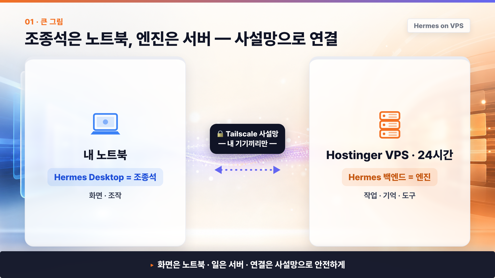
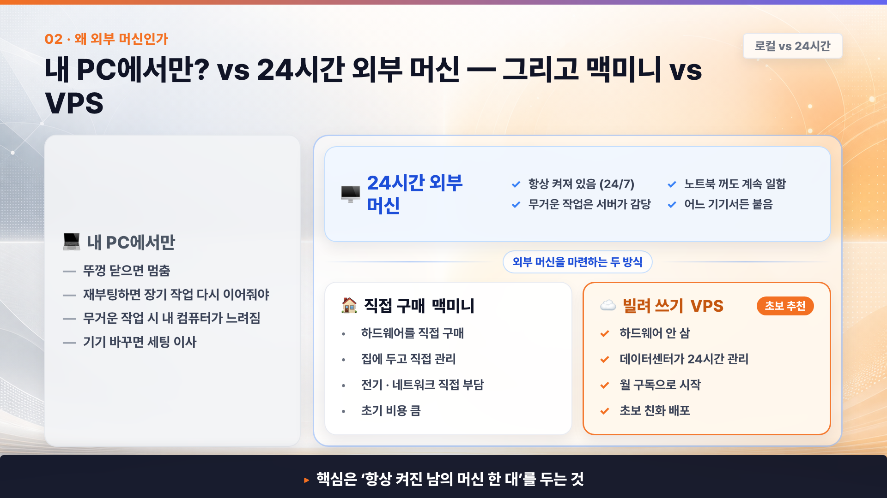
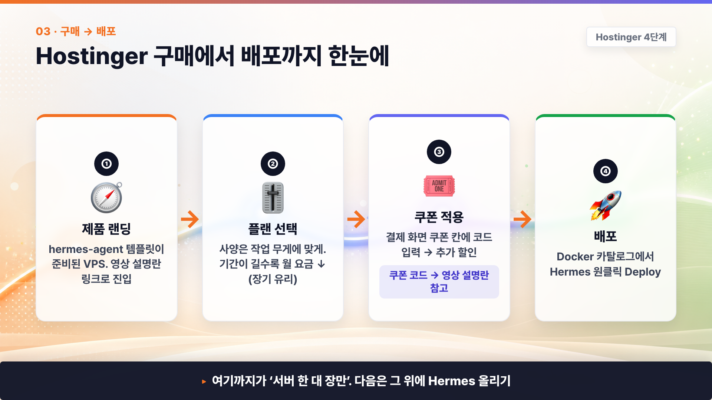
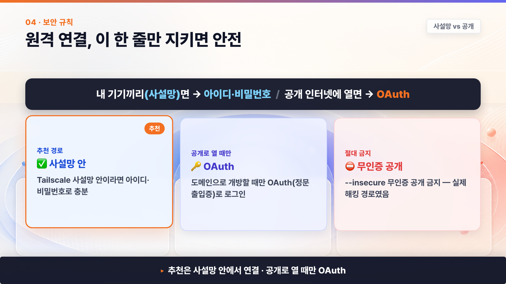

# Hermes Agent 데스크톱 앱 원격 연결 가이드 — Hostinger VPS · Tailscale · Remote Gateway 풀세팅


Hermes Agent를 데스크톱 앱에서만 로컬로 쓰면 시작은 쉽지만, **24시간 켜져 있는 AI 직원**처럼 운영하기에는 아쉬움이 있습니다. 노트북을 닫으면 멈추고, 무거운 작업은 내 PC가 부담하고, 밖에서 접속하려면 보안도 신경 써야 하죠.

이 가이드는 영상에서 보여드린 것처럼 **Hostinger VPS에 Hermes 작업 엔진을 올리고, 내 노트북의 Hermes Desktop 앱을 Tailscale 사설망으로 안전하게 연결하는 풀세팅 과정**을 정리한 문서입니다.

핵심 구조는 간단합니다.

```text
내 노트북 Hermes Desktop 앱 = 조종석
Hostinger VPS의 Hermes 백엔드 = 24시간 일하는 엔진
Tailscale = 내 기기끼리만 통하는 사설망
```

> 🎁 영상 링크/쿠폰
>
> Hostinger에서 Hermes Agent/VPS 시작하기: https://hostinger.com/citizendev9c
>
> 할인 쿠폰: `CITIZENDEV9C`

---

## 목차

1. [한 장으로 보는 전체 구조](#1-한-장으로-보는-전체-구조)
2. [로컬 PC vs 24시간 외부 머신](#2-로컬-pc-vs-24시간-외부-머신)
3. [Hostinger에서 Hermes Agent 배포하기](#3-hostinger에서-hermes-agent-배포하기)
4. [Hermes 기본 프로필과 모델 설정](#4-hermes-기본-프로필과-모델-설정)
5. [Hermes Desktop 앱 설치와 로컬 사용 이해](#5-hermes-desktop-앱-설치와-로컬-사용-이해)
6. [Tailscale로 사설망 만들기](#6-tailscale로-사설망-만들기)
7. [Docker YAML에서 Remote Gateway 포트 연결하기](#7-docker-yaml에서-remote-gateway-포트-연결하기)
8. [Hermes Desktop 앱에 원격 서버 연결하기](#8-hermes-desktop-앱에-원격-서버-연결하기)
9. [보안 기준 — 사설망이면 비밀번호, 공개면 OAuth](#9-보안-기준--사설망이면-비밀번호-공개면-oauth)
10. [문제 해결 FAQ](#10-문제-해결-faq)
11. [참고 자료](#11-참고-자료)

---

## 1. 한 장으로 보는 전체 구조



| 구성 | 쉽게 말하면 | 실제 역할 |
|---|---|---|
| Hermes Desktop 앱 | 조종석 | 대화, 세션 확인, 파일 확인, 설정 수정, 작업 과정 관찰 |
| Hostinger VPS | 24시간 서버룸 | Hermes 백엔드가 실제로 실행되고, 도구를 쓰고, 파일을 만들고, 기억을 저장 |
| Tailscale | 내 기기끼리만 통하는 전용 통로 | 공개 인터넷에 서버를 활짝 열지 않고 내 노트북과 VPS만 연결 |
| Remote Gateway | 조종석이 엔진으로 들어가는 주소 | Desktop 앱이 원격 Hermes 백엔드에 붙는 HTTP URL |

영상에서 만드는 최종 구조는 아래와 같습니다.

```text
[내 노트북]
  Hermes Desktop 앱
        │
        │  Tailscale 사설망
        ▼
[Hostinger VPS]
  Docker / Hermes Agent 백엔드
  data · memory · skills · sessions · files
```

이렇게 해두면 내 노트북은 **화면과 조작**만 맡고, 실제 작업은 **24시간 켜져 있는 VPS**에서 실행됩니다.

---

## 2. 로컬 PC vs 24시간 외부 머신

Hermes Desktop 앱은 로컬 PC에서도 바로 써볼 수 있습니다. 다만 Hermes Agent를 “직원처럼” 쓰려면 **항상 켜진 외부 PC**가 있는 편이 훨씬 안정적입니다.



| 비교 | 내 PC에서만 실행 | 24시간 외부 머신 |
|---|---|---|
| 상시성 | 노트북을 닫거나 재부팅하면 멈춤 | 노트북을 꺼도 계속 실행 |
| 작업 부담 | 브라우저 자동화·파일 작업이 내 PC를 느리게 만들 수 있음 | 무거운 작업은 서버가 감당 |
| 접속 위치 | 그 PC 앞에 있을 때 가장 편함 | 어느 기기에서든 원격 접속 가능 |
| 세팅 이동 | 노트북을 바꾸면 세팅 이사 필요 | 서버 한 곳에 작업 환경 고정 |
| 보안 관점 | 내 개인 PC 자료 접근 리스크 존재 | 업무용 서버에 역할과 범위를 분리하기 좋음 |

> 💡 비유하면, AI 직원을 채용했는데 내 개인 노트북을 그대로 주고 일하라고 하는 것보다, **직원 전용 컴퓨터 한 대를 따로 마련해주는 것**에 가깝습니다.

---

## 3. Hostinger에서 Hermes Agent 배포하기

Hostinger에서는 VPS 안에 Docker 기반으로 Hermes Agent를 배포할 수 있습니다. 영상에서는 터미널 명령을 길게 치는 대신, 관리 패널의 Docker Catalog 흐름을 중심으로 보여줍니다.



| 단계 | 화면 | 할 일 |
|---|---|---|
| 1 | 제품 랜딩 | 설명란 링크로 Hostinger Hermes/VPS 페이지 진입 |
| 2 | 플랜 선택 | 작업 무게에 맞는 VPS 사양 선택 |
| 3 | 쿠폰 적용 | 결제 화면에서 쿠폰 `CITIZENDEV9C` 입력 |
| 4 | Docker Manager / Catalog | `Hermes Agent` 검색 |
| 5 | Deploy | 관리자 아이디/비밀번호 생성 후 배포 |
| 6 | Open / Terminal | Hermes가 정상 실행되는지 확인 |

> ⚠️ 가격, 할인율, 플랜명, UI 라벨은 시점에 따라 바뀔 수 있습니다. 영상 촬영/업로드 전 현행 화면 기준으로 확인하세요.

### 배포 후 확인할 것

| 확인 항목 | 정상 상태 |
|---|---|
| Docker 프로젝트 | Hermes Agent 컨테이너가 실행 중 |
| 관리자 계정 | 배포 때 만든 ID/PW로 로그인 가능 |
| Hermes CLI / 백엔드 | 컨테이너 또는 대시보드에서 응답 확인 |
| 데이터 저장 | 설정·기억·세션이 Docker volume에 저장 |

---

## 4. Hermes 기본 프로필과 모델 설정

배포가 끝나면 Hermes가 어떤 모델을 쓸지, 어떤 직원으로 행동할지 정합니다.

영상에서는 예시로 **개인 비서 자비스**를 만듭니다.

### 4-1. OpenAI Codex OAuth 연결 예시

```bash
hermes auth add openai-codex
```

> 이 명령은 예시입니다. 실제 모델 연결 방식은 본인이 사용하는 모델 제공자, 구독, API key, OAuth 연결 방식에 맞게 선택하세요.

### 4-2. Description 예시

```text
자비스 — 일정, 리서치, 문서 초안, 반복 업무 정리를 도와주는 개인 AI 비서.
```

### 4-3. SOUL.md 예시

```text
너의 이름은 자비스다.
너는 사용자의 개인 AI 비서로서, 답변은 짧고 명확하게 한다.
일정 정리, 자료 조사, 문서 초안 작성, 반복 업무 자동화를 돕는다.
확실하지 않은 내용은 추측하지 말고 "확인 필요"라고 표시한다.
실제 발송, 결제, 삭제 같은 되돌리기 어려운 행동은 먼저 사용자 확인을 받는다.
```

| 설정 | 역할 | 주의 |
|---|---|---|
| Description | 이 프로필이 어떤 업무에 좋은지 한 줄 설명 | 라우팅 라벨처럼 선명하게 |
| SOUL.md | 직원의 성격, 역할, 행동 기준 | 길게 절차를 다 넣기보다 핵심 원칙 중심 |
| 모델 설정 | 어떤 LLM을 쓸지 결정 | 비용·속도·품질 고려 |
| 사용자 확인 기준 | 발송/삭제/결제 전 멈춤 | 안전 장치로 필수 |

---

## 5. Hermes Desktop 앱 설치와 로컬 사용 이해

Hermes Desktop 앱은 처음 켜면 로컬에서도 바로 사용해볼 수 있습니다. 앱 안에서 프로필, 모델, SOUL.md, 채널 설정 등을 확인할 수 있고, 채팅창에서 바로 말을 걸 수도 있습니다.

다만 이번 가이드의 핵심은 로컬 사용이 아니라 **원격 서버 엔진으로 전환하는 것**입니다.

| 사용 방식 | 의미 | 추천 상황 |
|---|---|---|
| 로컬 사용 | 내 컴퓨터 안에서 Hermes 백엔드 실행 | 가볍게 테스트, 개인 실습 |
| 원격 연결 | Desktop 앱이 VPS의 Hermes 백엔드에 접속 | 24시간 직원 운영, 여러 기기에서 접근, 서버 기반 자동화 |
| 메신저 채널 연결 | Telegram/Slack 같은 채널에서 Hermes에게 말 걸기 | 이동 중 작업 지시, 알림/보고 수신 |

> 헷갈리지 마세요. **Remote Gateway**는 Desktop 앱이 원격 Hermes 백엔드에 붙는 설정이고, Telegram/Slack은 메시징 채널 연결입니다. 이름은 비슷해도 역할이 다릅니다.

---

## 6. Tailscale로 사설망 만들기

원격 연결은 “그냥 인터넷에 열기”가 아니라, **내 기기끼리만 통하는 사설망**으로 연결하는 것을 기본 경로로 잡습니다. 여기서 Tailscale을 씁니다.

1번 인포그래픽의 가운데에 있던 **Tailscale 사설망** 구간을 실제 설정으로 만드는 단계입니다. 여기서는 노트북과 VPS를 같은 tailnet 안에 넣어, 공개 인터넷이 아니라 내 기기끼리만 통하는 길을 확보합니다.

### 6-1. 전체 흐름

| 순서 | 위치 | 할 일 |
|---|---|---|
| 1 | Tailscale 웹사이트 | 계정 생성 / 로그인 |
| 2 | 내 노트북 | Tailscale 앱 설치 후 같은 계정으로 로그인 |
| 3 | Hostinger VPS 자체 터미널(root 권한) | Tailscale 설치 |
| 4 | 브라우저 | `tailscale up` 로그인 링크 승인 |
| 5 | VPS 자체 터미널 | `tailscale status`, `tailscale ip -4`로 연결 확인 |
| 6 | Hermes Desktop | Tailscale IP 기반 Remote URL 입력 |

### 6-2. VPS 자체 터미널에서 실행하는 명령

Hostinger의 **Hermes 컨테이너 터미널이 아니라 VPS 자체 터미널(root 권한)**에서 실행합니다.

```bash
curl -fsSL https://tailscale.com/install.sh | sh
tailscale up
tailscale status
tailscale ip -4
```

명령의 의미는 아래와 같습니다.

| 명령 | 의미 |
|---|---|
| `curl -fsSL https://tailscale.com/install.sh \| sh` | Tailscale 공식 설치 스크립트 실행 |
| `tailscale up` | 이 VPS를 내 Tailscale 사설망에 등록 |
| `tailscale status` | 같은 사설망에 노트북과 서버가 같이 있는지 확인 |
| `tailscale ip -4` | 이 VPS의 사설망 IP 확인 |

확인된 IP는 아래처럼 placeholder로 기록해둡니다.

```text
{{TAILSCALE_IP}} = 100.xxx.xxx.xxx
```

---

## 7. Docker YAML에서 Remote Gateway 포트 연결하기

Tailscale 사설망은 “노트북과 VPS가 서로 만날 수 있는 길”입니다. 이제 그 길 위에서 Hermes Desktop 앱이 Hermes 컨테이너 안으로 들어올 수 있게 **문패**를 붙여야 합니다.

Hostinger Docker Manager의 YAML Editor에서 `ports:` 항목을 확인하고, 아래처럼 추가합니다.

```yaml
ports:
  - "{{TAILSCALE_IP}}:9119:4860"
```

### 7-1. 이 한 줄의 의미

| 부분 | 예시 | 뜻 |
|---|---|---|
| `{{TAILSCALE_IP}}` | `100.xxx.xxx.xxx` | VPS가 Tailscale 사설망 안에서 받은 주소 |
| `9119` | 바깥쪽 문 번호 | Desktop 앱이 두드릴 포트 |
| `4860` | 컨테이너 안쪽 자리 | Hermes 백엔드가 컨테이너 안에서 듣는 포트 |

쉽게 말하면 아래 의미입니다.

```text
내 노트북이 {{TAILSCALE_IP}}의 9119번 문으로 들어오면,
Docker가 그 요청을 Hermes 컨테이너 안의 4860번 자리로 보내줘.
```

### 7-2. Remote URL

YAML을 저장하고 Redeploy한 뒤, Hermes Desktop 앱에는 아래 URL을 넣습니다.

```text
http://{{TAILSCALE_IP}}:9119
```

### 7-3. 같은 VPS에 Hermes 컨테이너가 여러 개라면

두 번째 Hermes 컨테이너는 바깥쪽 포트만 다르게 잡습니다.

```yaml
ports:
  - "{{TAILSCALE_IP}}:9220:4860"
```

| 컨테이너 | Remote URL |
|---|---|
| 첫 번째 Hermes | `http://{{TAILSCALE_IP}}:9119` |
| 두 번째 Hermes | `http://{{TAILSCALE_IP}}:9220` |

컨테이너 안쪽 포트 `4860`은 각 컨테이너 내부 공간이 따로라서 같아도 됩니다. 대신 VPS 바깥에서 보이는 포트 `9119`, `9220`은 겹치면 안 됩니다.

---

## 8. Hermes Desktop 앱에 원격 서버 연결하기

Hermes Desktop 앱에서 원격 서버 엔진으로 전환합니다.

| 단계 | 위치 | 할 일 |
|---|---|---|
| 1 | Hermes Desktop Settings | Gateway / Remote gateway 메뉴로 이동 |
| 2 | Remote URL | `http://{{TAILSCALE_IP}}:9119` 입력 |
| 3 | 로그인 | 배포 때 만든 관리자 ID/PW로 로그인 |
| 4 | 연결 테스트 | Test / Save / Reconnect 흐름 진행 |
| 5 | 확인 | 서버 쪽 세션·파일·프로필이 Desktop에 보이는지 확인 |

연결이 성공하면, 내 노트북의 로컬 엔진이 아니라 **VPS의 Hermes 백엔드**가 실제 작업을 처리합니다.

```text
화면과 조작 = 내 노트북 Hermes Desktop
실제 실행과 기억 = Hostinger VPS Hermes 백엔드
```

---

## 9. 보안 기준 — 사설망이면 비밀번호, 공개면 OAuth



원격 연결에서 가장 중요한 규칙입니다.

| 상황 | 추천 인증 | 설명 |
|---|---|---|
| 내 기기끼리만 통하는 Tailscale 사설망 | 아이디·비밀번호 | trusted network 안에서 쓰는 기본 경로 |
| 공개 인터넷에 도메인으로 개방 | OAuth | 외부에 열리는 정문 출입증 역할 |
| 인증 없이 공개 | 금지 | `--insecure`/무인증 공개는 실제 침해 위험 |

이번 영상의 추천 경로는 **Tailscale 사설망 + 아이디·비밀번호**입니다. 공개 도메인으로 열어야 한다면 OAuth, HTTPS, 리버스 프록시, public URL 설정이 들어가는 별도 심화 경로로 다뤄야 합니다.

### 9-1. 절대 하지 말아야 할 것

| 금지 | 이유 |
|---|---|
| 무인증 공개 대시보드 | 누구나 내 서버의 Hermes를 조종할 수 있음 |
| 실제 IP/키/계정 화면 노출 | 보안 사고로 이어질 수 있음 |
| 공개 IP에 포트가 열려 있다고 단정 | provider/firewall 설정에 따라 다르므로 외부망에서 실측 필요 |
| OAuth 없이 공개 도메인 운영 | trusted network 바깥에서는 더 강한 인증이 필요 |

---

## 10. 문제 해결 FAQ

### Q1. Remote URL을 넣었는데 연결이 안 됩니다.

| 확인 | 설명 |
|---|---|
| Tailscale 같은 계정인지 | 노트북과 VPS가 같은 tailnet에 있어야 함 |
| `tailscale status` | 노트북과 VPS가 둘 다 보이는지 확인 |
| `tailscale ip -4` | Remote URL에 넣은 IP가 VPS의 Tailscale IP인지 확인 |
| Docker YAML | `{{TAILSCALE_IP}}:9119:4860` 형식인지 확인 |
| Redeploy | YAML 저장 후 프로젝트가 재배포됐는지 확인 |
| 관리자 로그인 | 배포 때 만든 ID/PW가 맞는지 확인 |

### Q2. 공개 도메인으로 접속하고 싶으면요?

공개 도메인으로 열면 Tailscale 사설망 경로가 아니라 public internet 경로가 됩니다. 이 경우에는 OAuth, HTTPS, reverse proxy, public URL 설정 등을 별도로 구성해야 합니다.

| 경로 | 인증 기준 |
|---|---|
| Tailscale 내부 URL | ID/PW로 시작 가능 |
| 공개 도메인 | OAuth 권장 |

### Q3. Hermes Desktop 앱만 설치해서 로컬로 쓰면 안 되나요?

됩니다. 가볍게 써보는 용도라면 로컬 사용도 좋습니다. 다만 24시간 직원처럼 운영하거나, 노트북을 꺼도 작업이 계속되게 하거나, 여러 기기에서 붙고 싶다면 VPS 원격 연결이 더 적합합니다.

### Q4. Telegram/Slack 연결과 Remote Gateway는 같은 건가요?

아닙니다.

| 구분 | 의미 |
|---|---|
| Remote Gateway | Desktop 앱이 원격 Hermes 백엔드에 붙는 설정 |
| Telegram/Slack gateway | 메신저로 Hermes에게 말 걸고 보고받는 채널 연결 |

---

## 11. 참고 자료

| 자료 | 링크 |
|---|---|
| Hermes 공식 문서 | https://hermes-agent.nousresearch.com/docs |
| Hermes Desktop App | https://hermes-agent.nousresearch.com/docs/user-guide/desktop |
| Hermes Web Dashboard | https://hermes-agent.nousresearch.com/docs/user-guide/features/web-dashboard |
| Hermes Docker | https://hermes-agent.nousresearch.com/docs/user-guide/docker |
| Hermes CLI Commands | https://hermes-agent.nousresearch.com/docs/reference/cli-commands |
| Tailscale | https://tailscale.com/ |
| Tailscale Linux install script | https://tailscale.com/install.sh |
| Hostinger Hermes/VPS 시작 링크 | https://hostinger.com/citizendev9c |

---
