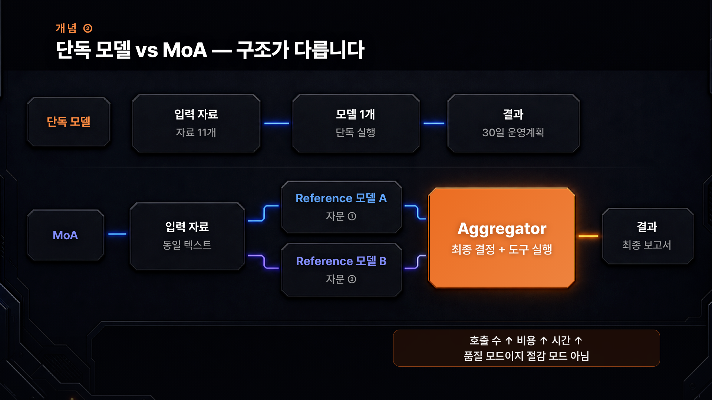
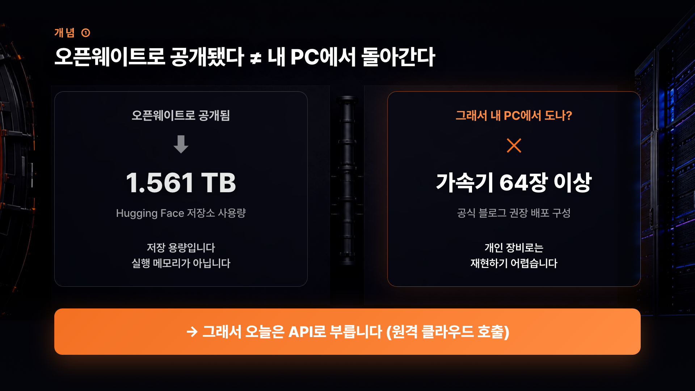
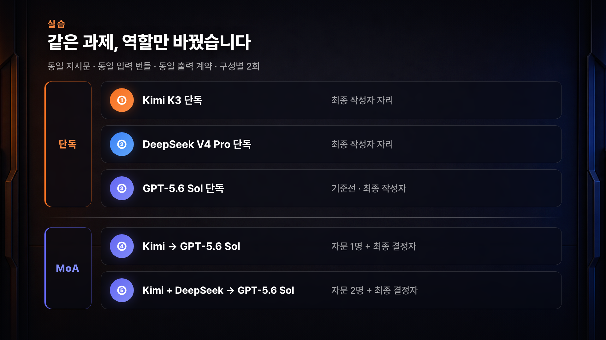
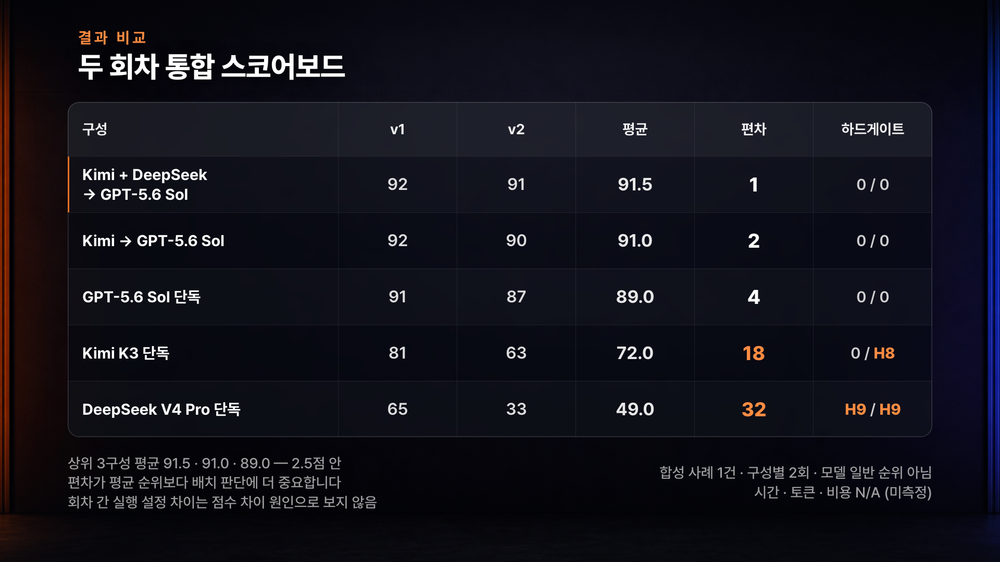

# Kimi K3·DeepSeek·GPT-5.6 Sol을 Hermes MoA로 조합하는 법 — 정확도보다 관점을 더하는 AI 자문단


현금, 재고, 계약처럼 **한 번 틀리면 손실이 큰 판단**을 AI에게 맡길 때, 모델 하나가 내놓은 답 한 통을 그대로 믿기는 어렵습니다. 그렇다고 여러 모델에 같은 질문을 따로 던져 답 세 통을 사람이 대조하는 것도 현실적이지 않고요.

Hermes Agent의 **MoA(Mixture of Agents)** 는 이 문제를 구조로 풉니다. 여러 모델이 **먼저 의견만** 내고, 그중 한 모델이 그 의견들을 받아 **최종 답을 쓰고 도구를 실행**합니다. 이 문서는 그 기능을 어디서 켜고, 누구를 어느 자리에 앉히고, 결과를 어디까지 믿어야 하는지를 정리한 가이드입니다.

| 5초 요약 | 내용 |
|---|---|
| **MoA가 뭔가요** | 한 번의 모델 호출을 "여러 모델이 먼저 분석 → 한 모델이 종합해서 최종 응답 작성"으로 바꾸는 Hermes의 가상 모델 provider |
| **누가 Reference인가요** | 먼저 의견만 내는 모델들. **서로 다른 전문 의견**을 주는 자리입니다. 도구를 쓰지 못하고 최종 답도 쓰지 않습니다 |
| **누가 Aggregator인가요** | 그 의견을 받아 **최종 결정을 내리고 도구를 실행하는 책임자**. 실제 응답을 쓰는 모델은 오직 이쪽입니다 |
| **내 업무엔 어떻게 쓰나요** | 강한 모델을 Aggregator에 두고, 성향이 다른 모델을 Reference에 붙입니다. 그다음 [6번 프롬프트 틀](#6-내-업무로-바꿔-쓰는-프롬프트-틀)에 내 업무를 갈아 끼웁니다 |
| **결과를 얼마나 믿나요** | **합성 사례 1건 · 구성별 2회**입니다. 모델 일반 순위가 아니고, 시간·토큰·비용은 측정하지 않았습니다 |

> 📌 Hermes의 화면·메뉴·CLI 명령·설정 키 이름은 업데이트로 바뀔 수 있습니다. 최신 동선은 항상 [공식 MoA 문서](https://hermes-agent.nousresearch.com/docs/user-guide/features/mixture-of-agents)로 확인하세요.

---

## 목차

- [1. MoA가 무엇이고 누가 무엇을 하나](#1-moa가-무엇이고-누가-무엇을-하나)
- [2. 사전 준비](#2-사전-준비)
- [3. Hermes에서 MoA preset 만들기](#3-hermes에서-moa-preset-만들기)
  - [3-1. Dashboard에서 만들기](#3-1-dashboard에서-만들기)
  - [3-2. Desktop 앱에서 만들기](#3-2-desktop-앱에서-만들기)
  - [3-3. 터미널에서 만들기](#3-3-터미널에서-만들기)
  - [3-4. 만든 preset 고르기](#3-4-만든-preset-고르기)
  - [3-5. 한 번만 써보기](#3-5-한-번만-써보기)
  - [3-6. 알아두면 좋은 운영 옵션](#3-6-알아두면-좋은-운영-옵션)
- [4. 이번 실험의 다섯 구성과 역할](#4-이번-실험의-다섯-구성과-역할)
- [5. 실험에 그대로 쓴 지시문 전문](#5-실험에-그대로-쓴-지시문-전문)
- [6. 내 업무로 바꿔 쓰는 프롬프트 틀](#6-내-업무로-바꿔-쓰는-프롬프트-틀)
- [7. 결과 통합 스코어보드와 해석](#7-결과-통합-스코어보드와-해석)
  - [7-1. 통합 스코어보드](#7-1-통합-스코어보드)
  - [7-2. 정확도 축과 전략 축](#7-2-정확도-축과-전략-축)
  - [7-3. 총점 차이를 그대로 읽으면 안 되는 이유](#7-3-총점-차이를-그대로-읽으면-안-되는-이유)
  - [7-4. Reference가 남긴 것과 걸러낸 것](#7-4-reference가-남긴-것과-걸러낸-것)
- [8. 사람이 확인할 QA 체크리스트](#8-사람이-확인할-qa-체크리스트)
- [9. 언제 쓰고 언제 쓰지 않을지](#9-언제-쓰고-언제-쓰지-않을지)
- [10. 보안과 가드레일](#10-보안과-가드레일)
- [11. 이 실험의 한계](#11-이-실험의-한계)
- [12. FAQ](#12-faq)
- [13. 참고 자료](#13-참고-자료)

---

## 1. MoA가 무엇이고 누가 무엇을 하나



회사로 비유하면 이렇습니다. **한 사람이 혼자 보고서를 쓰는 것**이 단독 모델이고, **두 명에게 먼저 의견을 받고 대표가 최종안을 확정하는 것**이 MoA입니다. 의견을 준 사람은 결재하지 않고, 결재하는 사람은 한 명입니다.

먼저 자주 헷갈리는 두 개념부터 갈라둡니다.

**모델 라우팅은 비용을 아끼는 데만 쓰는 개념이 아닙니다.** 핵심은 업무의 특성과 모델의 특성을 맞춰, 그 일을 가장 잘 처리할 모델 하나를 선택하거나 배정하는 것입니다. 정확도·속도·도구 사용 능력·긴 문서 처리·비용 등은 모두 선택 기준이 될 수 있습니다.

| 구분 | 모델 라우팅 | MoA (Mixture of Agents) |
|---|---|---|
| 하는 일 | 업무 특성에 맞는 **모델 하나를 선택·배정한다** | 여러 모델에게 **먼저 의견을 받고 한 모델이 종합한다** |
| 처리 구조 | 한 업무를 선택된 모델 하나가 처리 | Reference 여러 개 + Aggregator 하나가 함께 처리 |
| 회사 비유 | 실무자의 직무와 역량에 따라 일을 배분 | 여러 사람에게 자문받고 대표가 결정 |
| 핵심 목적 | 각 업무를 **가장 적합한 모델에 맡기기** | 어려운 판단에 **서로 다른 관점을 더하기** |
| 비용의 위치 | 여러 선택 기준 중 하나 | Reference 호출이 추가되므로 절감보다 품질을 위한 구조 |

MoA 안에서 두 자리는 **하는 일이 완전히 다릅니다.** 이 표가 이 문서에서 가장 중요합니다.

| | **Reference (전문 의견)** | **Aggregator (최종 결정 + 도구 실행)** |
|---|---|---|
| 받는 것 | 대화 텍스트 + `fanout` 설정에 따라 **Aggregator 도구 실행 결과의 미리보기** | Hermes의 평소 시스템 프롬프트 + 도구 스키마 전부 |
| 못 받는 것 | Hermes 시스템 프롬프트, 도구 스키마, 파일·URL을 직접 열 권한 | Hermes 설정과 도구 권한이 허용하는 범위까지 |
| 도구 실행 | ❌ 하지 않음 | ✅ 함 |
| 최종 답변 작성 | ❌ 하지 않음 | ✅ 함 |
| 결과 처리 | 분석만 내고, 그 출력이 Aggregator에게 **비공개 참고자료로** 붙음 | 그 응답이 곧 **실제 모델 응답**으로 취급됨 |
| 자리에 어울리는 모델 | 성향이 서로 다른 모델 | 규칙 준수와 형식 안정성이 가장 좋은 모델 |

MoA를 선택했을 때 Hermes가 한 번의 모델 호출에서 실제로 하는 순서입니다.

1. 선택된 preset을 이름으로 찾습니다.
2. Reference 모델들을 **도구 스키마 없이** 호출합니다 (그래서 자문 호출은 싸고, 엄격한 provider에서 거절될 일도 적습니다).
3. Reference 출력들을 Aggregator를 위한 **비공개 컨텍스트**로 덧붙입니다.
4. Aggregator를 **평소 Hermes 도구 스키마 그대로** 호출합니다.
5. Aggregator 응답을 진짜 모델 응답으로 취급합니다.
6. Aggregator가 도구를 부르면 Hermes가 평소처럼 실행합니다.
7. 다음 반복에서 Reference를 다시 부를지는 `fanout` 설정이 결정합니다. 기본값 `user_turn`은 같은 사용자 턴 안에서 이전 자문을 재사용하고, `per_iteration`은 도구 반복마다 Reference를 다시 부릅니다.

| 꼭 알아둘 동작 | 내용 |
|---|---|
| **호출 수가 늘어난다** | 자문이 도는 반복 1회가 Reference 호출 여러 건 + Aggregator 호출 1건이 됩니다 |
| **Reference 하나가 실패해도 턴이 죽지 않는다** | 실패는 참고 컨텍스트에 포함되고, 응답한 모델들로 계속 진행합니다 |
| **재귀 MoA는 막혀 있다** | preset의 Aggregator 자리에 또 다른 MoA preset을 넣을 수 없습니다 |
| **preset을 끄면 단독 모델과 같아진다** | preset의 `enabled: false` 는 Reference 팬아웃만 끄고 Aggregator가 혼자 동작합니다 |

---

## 2. 사전 준비

| 준비물 | 왜 필요한가 | 확인 방법 |
|---|---|---|
| **Hermes Agent 최신 버전** | MoA는 provider·설정 키가 계속 정리되고 있어, 구버전이면 화면 위치와 옵션 이름이 다릅니다 | 실행 후 모델 선택 화면에 `Mixture of Agents` provider 행이 보이는지 |
| **모델 provider 연결** | Reference·Aggregator는 **provider/model 쌍으로 각각 지정**합니다. 서로 다른 provider를 섞을 수도, 같은 provider의 여러 모델을 쓸 수도 있습니다 | Dashboard의 Keys에서 쓰려는 provider가 연결돼 있는지 |


이번 실험에서 Reference로 쓴 Kimi K3와 DeepSeek V4 Pro는 **OpenRouter를 통해 API로 호출**했습니다. 여러 모델을 바꿔가며 테스트할 때 키 하나로 정리되기 때문입니다.



Kimi K3는 오픈웨이트로 공개돼 이론상 직접 받아서 돌릴 수 있습니다. 다만 **이론상 가능한 것과 내 PC에서 되는 것은 다른 이야기**입니다.

| 항목 | 관측값 | 오해하기 쉬운 지점 |
|---|---|---|
| Hugging Face 저장소 사용량 | 약 **1.561TB** | 이건 **파일을 받아 보관하는 용량**이지, 실행에 필요한 메모리가 아닙니다 |
| 공식 권장 배포 구성 | **가속기 64장 이상** | 사실상 데이터센터급 구성입니다 |
| "오픈웨이트 = 저렴" | ❌ | 가중치를 공개했다는 것과 호출 단가는 별개입니다 |

> 💡 그래서 이 가이드는 로컬 실행이 아니라 **원격 API 호출**을 전제로 합니다. 공식 벤치마크에는 Kimi K3가 GPT·Claude와 비슷한 항목도 있지만, 그것과 "내 업무 과제에서 최종 작성자로 쓸 만한가"는 별개 질문입니다.

---

## 3. Hermes에서 MoA preset 만들기

MoA는 **이름 붙인 preset** 단위로 씁니다. preset 하나가 모델 선택 화면에서 모델 하나처럼 보입니다. 만드는 입구는 네 곳이고, 어디서 만들든 같은 설정을 가리킵니다.

| 입구 | 경로 / 명령 | 이럴 때 편합니다 |
|---|---|---|
| **Dashboard** | Dashboard → Models → Model Settings → Mixture of Agents | 브라우저에서 키 등록과 함께 한 번에 |
| **Desktop 앱** | Settings → Model → Mixture of Agents | 데스크톱 앱만 쓰는 경우 |
| **터미널** | `hermes moa configure <name>` | 서버·원격 접속 환경 |
| **설정 파일** | `config.yaml` | 구성을 파일로 관리·공유할 때 |

### 3-1. Dashboard에서 만들기

1. Dashboard에 접속합니다.
2. **Keys**에서 쓰려는 provider(예: OpenRouter)를 먼저 연결합니다.
3. **Models → Model Settings → Mixture of Agents** 로 들어갑니다.
4. **Reference 슬롯**에 의견을 받을 모델들을, **Aggregator 슬롯**에 최종 답을 쓸 모델을 지정합니다.
5. preset 이름을 정하고 저장합니다.

### 3-2. Desktop 앱에서 만들기

1. Hermes Desktop을 실행합니다.
2. 우측 상단 **설정** 아이콘 → **Model** → 아래로 내려 **Mixture of Agents** 섹션으로 이동합니다.
3. Dashboard와 동일하게 Reference·Aggregator를 지정하고 저장합니다.

저장한 preset은 모델 드롭다운의 `MoA presets` 구역에 `MoA: <preset>` 형태로 나타납니다.

### 3-3. 터미널에서 만들기

```bash
hermes moa list                  # 현재 preset 목록 확인
hermes moa configure             # 기본(default) preset 수정
hermes moa configure review      # review 라는 이름의 preset 생성 또는 수정
hermes moa delete review         # preset 삭제
```

설정 파일로 관리한다면 provider/model 쌍을 명시적으로 적습니다. 이번 실험의 "자문 2명" 구성과 **Reference·Aggregator 자리 배치만** 같은 예시입니다.

```yaml
moa:
  default_preset: default
  presets:
    default:
      reference_models:
        - provider: openrouter
          model: moonshotai/kimi-k3
        - provider: openrouter
          model: deepseek/deepseek-v4-pro
      aggregator:
        provider: openai-codex
        model: gpt-5.6-sol
      max_tokens: 4096
      enabled: true
```

### 3-4. 만든 preset 고르기

MoA는 특별한 모드가 아니라 **평소 모델 고르는 자리에 하나 더 생기는 provider**입니다. 그래서 모델 선택이 되는 곳이면 어디서든 고를 수 있습니다.

```bash
/model <preset> --provider moa    # 특정 preset으로 전환
/model --provider moa             # 기본 preset으로 전환
```

`/model <preset>` 처럼 provider를 빼고 써도, 이름이 설정된 preset과 정확히 일치하고 **그 preset이 켜져 있으면(`enabled: true`)** 동작합니다. Dashboard 모델 선택기와 `hermes model` 에서는 `Mixture of Agents` provider 행 아래에 preset 이름들이 모델처럼 나열됩니다.

### 3-5. 한 번만 써보기

세션 전체를 MoA로 바꾸지 않고 **딱 한 턴만** 시험해보고 싶다면 `/moa` 를 씁니다.

```bash
/moa 이번 분기 재고 처분 우선순위를 정하고 근거를 표로 정리해줘
```

| `/moa` 동작 | 내용 |
|---|---|
| 사용하는 preset | **기본(default) preset 한 개**만 사용합니다 |
| 적용 범위 | **그 한 턴만**. 끝나면 원래 쓰던 모델로 되돌아갑니다 |
| 인자 해석 | 뒤에 오는 문장 **전체가 프롬프트**입니다. preset 이름으로 해석하지 않습니다 |
| 프롬프트 없이 `/moa` | 사용법만 출력합니다 |

> 💡 `/moa` 는 일부러 **모델 전환이 아니게** 설계돼 있습니다. 평범한 프롬프트가 실수로 모델을 바꿔버리는 일이 없도록 하기 위해서입니다. 세션 내내 MoA를 쓰려면 [3-4](#3-4-만든-preset-고르기)의 모델 선택기를 쓰세요.

### 3-6. 알아두면 좋은 운영 옵션

아래 세 가지는 preset 안에서 조정하는 운영 옵션입니다. **아래 표는 실험 조건이 아니라 현재 공식 문서 기준의 운영 안내입니다.**

| 옵션 | 기본값 | 무엇을 바꾸나 |
|---|---|---|
| `reference_max_tokens` | 설정 안 함(무제한) | Reference **자문의 출력 길이만** 제한합니다. 턴 지연은 "가장 늦게 끝나는 자문"이 결정하므로, 예를 들어 `600` 처럼 상한을 두면 체감 속도가 붙습니다. **최종 응답(Aggregator 출력)은 절대 잘리지 않습니다** |
| `fanout` | `user_turn` | 자문을 얼마나 자주 다시 부를지 정합니다 |
| `reasoning_effort` | provider/Hermes 기본값 | Reference·Aggregator 슬롯별로 사고 깊이를 따로 줍니다 (`none`~`ultra`) |

`fanout` 세 가지 값의 차이입니다.

| 값 | 자문 호출 시점 | 비용·지연 | 이럴 때 |
|---|---|---|---|
| **`user_turn`** (기본) | 사용자 턴의 **첫 메시지에 한 번** | 호출 부담이 가장 적음. 도구 호출 수에 자문 비용이 곱해지지 않음 | 대부분의 경우 |
| `every_n:3` | 턴의 첫 반복 + 이후 **3번째 도구 반복마다** (N≥2) | 중간 | 중간에 방향이 자주 바뀌는 작업 |
| `per_iteration` | **모든 도구 반복마다** | 가장 비쌈. 자문 지연·비용이 도구 반복 횟수에 따라 늘어남 | 매 단계 최신 도구 결과를 자문에 반영해야 할 때 |

> 📌 2026년 7월 이전에는 기본값이 `per_iteration` 이었습니다. 지금 기본값은 **`user_turn`** 입니다. 예전처럼 매 단계 자문을 받으려면 `fanout: per_iteration` 을 명시해야 합니다. 알 수 없는 값이나 형식이 잘못된 값은 `user_turn` 으로 되돌아갑니다.

---

## 4. 이번 실험의 다섯 구성과 역할



같은 과제 하나를 두고 **역할 배치만 바꿔** 다섯 가지로 돌렸습니다. 모델을 1등부터 5등까지 줄 세우는 실험이 아니라, **같은 모델을 어느 자리에 앉히면 어떻게 달라지는가**를 보는 실험입니다.

| # | 구성 | 자리 | 한 줄 설명 |
|---|---|---|---|
| ① | Kimi K3 단독 | 최종 작성자 | 오픈웨이트 모델을 혼자 쓴 경우 |
| ② | DeepSeek V4 Pro 단독 | 최종 작성자 | 비교용 오픈웨이트 모델 |
| ③ | GPT-5.6 Sol 단독 | 최종 작성자 | 기준선 |
| ④ | Kimi → GPT-5.6 Sol | Reference 1 + Aggregator | 전문 의견 1명 + 결정자 |
| ⑤ | Kimi + DeepSeek → GPT-5.6 Sol | Reference 2 + Aggregator | 전문 의견 2명 + 결정자 |

자리 배치는 점수가 아니라 **각 모델이 무엇을 보는가**로 정했습니다.

| 모델 | 잘 보는 것 | 무너지는 곳 | 이번 실험에서 맡긴 자리 |
|---|---|---|---|
| **Kimi K3** | 물리적으로 안 되는 것. 6월 포장 실수요 **68.3시간** vs 7월 가용 **25시간**을 10종 산출물 중 유일하게 짚었고, 채널 수수료 **11.5% vs 2.8%** 를 나눠 본 것도 이 계열뿐 | 찾아낸 제약을 **표에 옮겨 적는 규율**. 두 번째 회차에서 확정된 시간을 자기 계획 사용 칸에 전재해 주차 한도 초과 | Reference |
| **DeepSeek V4 Pro** | 손실을 **금액으로 환산**. 만료 임박(유통기한 45일 이내) 재고를 개수가 아니라 원가 **533만 원**으로 본 유일한 단독 산출물 | **계산 규칙 준수**. 아직 들어오지 않은 예상 입금을 현금표에 섞어 두 회차 모두 위반. 그래서 실제 여유가 10만 원인데 안전하다고 판정 | Reference |
| **GPT-5.6 Sol** | 규칙을 지키고 **상한을 계획으로 번역**. 정상 판매 가능한 선물상자 90개를 "선물세트는 90세트가 천장"으로 못 박고, 리드타임 30일인 발주는 이번 기간 해법이 아니라고 잘라냄 | "**얼마를 잃는가**"를 돈으로 재는 축이 비어 있음. 만료 재고를 두 회차 다 개수까지만. 흑자 캠페인까지 같이 끄는 과잉 긴축 경향 | Aggregator |

> 💡 **Kimi와 DeepSeek은 관점 제공자, GPT는 최종 작성자.** 점수 순위가 아니라 이 성향 차이가 자리를 정했습니다.

과제는 **가상의 소규모 커피 브랜드 30일 운영계획**입니다. 매출은 늘었는데 현금과 공헌이익은 나빠진 상황이고, **그 진단은 모델에게 주지 않았습니다.** 모델이 받는 것은 원자료, 지켜야 할 규칙, 계산 정의 세 가지뿐입니다. 월초 현금·고정비·취소 불가 계약·최소 현금 버퍼 같은 제약을 전부 지키면서 보수·기본·성장 세 시나리오와 각각의 중단 조건까지 내야 합니다.

---

## 5. 실험에 그대로 쓴 지시문 전문

다섯 구성 모두에 **글자 하나 바꾸지 않고 동일하게** 보낸 지시문입니다. 그대로 복사해서 구조를 확인하시고, [6번](#6-내-업무로-바꿔-쓰는-프롬프트-틀)에서 자기 업무로 바꿔 쓰세요.

```text
당신은 소규모 커피 브랜드 대표의 외부 경영 자문역입니다.

프로젝트에 올라온 자료는 아래 11개입니다.

monthly_summary.csv / sales_by_week_channel.csv / ad_campaign_daily.csv /
customer_cohorts.csv / inventory_lots.csv / cash_schedule.csv /
capacity_calendar.csv / constraints.md / owner-note.md /
calculation-guide.md / output-template.md

모든 계산은 calculation-guide.md 의 정의를 따르십시오. constraints.md 의 제약은
하나도 어길 수 없습니다. owner-note.md 에 적힌 대표의 목표와 성향을 계획에 반영하십시오.

요청드릴 것은 2026년 7월 1일부터 7월 30일까지 30일 동안의 운영 계획입니다.
다음 네 가지를 포함해 주십시오.

1. 현재 상태 진단 — 지금 이 브랜드에서 무슨 일이 벌어지고 있는지
2. 우선순위 — 이 30일 동안 무엇을 먼저 다뤄야 하는지
3. 시나리오 — 보수·기본·성장 세 가지와, 각 시나리오를 멈춰야 하는 조건
4. 리스크 — 이 계획이 어긋날 수 있는 지점

숫자를 제시할 때마다 근거가 된 파일명과 행 식별자(row_id, entry_id, lot_id, date, month 등)를
함께 적어 주십시오. 자료에서 직접 계산한 값과 가정을 세워 추정한 값은 나누어 표기하고,
가정을 썼다면 그 가정을 별도로 적어 주십시오.

출력은 output-template.md 의 제목 순서와 표 열을 그대로 따르는 마크다운 보고서 본문
하나만 내보내십시오. JSON 으로 내보내지 마시고, 전체를 코드 펜스로 감싸지 마시고,
머리말이나 맺음말을 덧붙이지 마십시오.

output-template.md 의 주석 블록은 지시문이므로 보고서에 옮겨 적지 마십시오.
답변의 첫 줄은 `# 30일 운영계획` 이어야 하고, 그 뒤로는 채워 넣은 보고서만 옵니다.
표의 칸은 비워 두지 마시고, 해당 사항이 없으면 0 / 아니요 / 해당 없음 으로 채워 주십시오.
```

이 지시문이 왜 이렇게 생겼는지, 부분별로 보면 그대로 가져다 쓸 수 있습니다.

| 지시문 구성 요소 | 왜 넣었나 |
|---|---|
| 역할 한 줄 | 어떤 관점으로 답할지 고정 |
| 파일 목록 명시 | 모델이 어떤 자료를 다 봐야 하는지 못 박음 |
| 계산 정의·제약 파일 지정 | "알아서 계산"을 막고 규칙을 외부화 |
| 필수 결과 4가지 | 빠지면 안 되는 항목을 계약으로 |
| **행 식별자까지 근거 표기** | 숫자를 사람이 되짚어 검증할 수 있게 |
| **직접 계산 vs 추정 분리** | 모델이 지어낸 값을 눈에 띄게 |
| 출력 형식 못 박기 | 구성끼리 결과를 나란히 비교할 수 있게 |
| 중단 조건 요구 | 계획이 어긋날 때 멈출 지점을 미리 |

---

## 6. 내 업무로 바꿔 쓰는 프롬프트 틀

`{{ }}` 부분만 자기 업무로 갈아 끼우면 됩니다. 위 지시문에서 **검증 가능성을 만드는 뼈대만** 남긴 틀입니다.

```text
당신은 {{업무}} 를 검토하는 외부 자문역입니다.

참고할 자료는 아래와 같습니다.

{{입력 파일 목록}}

모든 계산과 정의는 자료에 명시된 규칙을 따르십시오. 자료에 적힌 제약은
하나도 어길 수 없습니다. 자료에 없는 사실을 새로 만들지 마십시오.

요청드릴 것은 {{기간}} 동안의 실행 계획입니다.
다음을 포함해 주십시오.

{{필수 결과}}

숫자를 제시할 때마다 근거가 된 파일명과 행 식별자를 함께 적어 주십시오.
자료에서 직접 계산한 값과 가정을 세워 추정한 값은 나누어 표기하고,
가정을 썼다면 그 가정을 별도로 적어 주십시오.

이 계획을 멈춰야 하는 조건은 다음과 같습니다.

{{중단 조건}}

출력은 마크다운 보고서 본문 하나만 내보내십시오. 표의 칸은 비워 두지 마시고,
해당 사항이 없으면 0 / 아니요 / 해당 없음 으로 채워 주십시오.
```

| 자리 | 무엇을 넣나 | 예시 |
|---|---|---|
| `{{업무}}` | 판단의 성격 | 분기 재고 처분 계획 / 채용 우선순위 / 계약 리스크 검토 |
| `{{입력 파일 목록}}` | 모델이 봐야 할 자료 전부 | `sales.csv` / `inventory.csv` / `rules.md` |
| `{{기간}}` | 계획의 시간 범위 | 다음 30일 / 이번 분기 |
| `{{필수 결과}}` | 빠지면 안 되는 항목 | 1. 현황 진단 2. 우선순위 3. 시나리오 3종 4. 리스크 |
| `{{중단 조건}}` | 계획을 멈출 임계값 | 2주차 잔여 현금이 최소 버퍼 아래로 내려가면 중단 |

> 💡 `{{중단 조건}}` 을 비워두지 마세요. 이걸 요구하면 모델이 **계획과 함께 멈출 지점**을 같이 내놓기 때문에, 결과를 사람이 감독하기 훨씬 쉬워집니다.

---

## 7. 결과 통합 스코어보드와 해석

### 7-1. 통합 스코어보드



동일 지시문·동일 프로젝트 입력 자료·동일 출력 계약으로 **구성별 2회**(v1·v2), 총 10종 산출물을 사람이 채점했습니다.

| 구성 | v1 | v2 | 평균 | 편차 | 하드게이트 |
|---|---:|---:|---:|---:|---|
| **Kimi + DeepSeek → GPT-5.6 Sol** | 92 | 91 | **91.5** | 1 | 0 / 0 |
| Kimi → GPT-5.6 Sol | 92 | 90 | **91.0** | 2 | 0 / 0 |
| GPT-5.6 Sol 단독 (기준선) | 91 | 87 | **89.0** | 4 | 0 / 0 |
| Kimi K3 단독 | 81 | 63 | **72.0** | **18** | 0 / H8 |
| DeepSeek V4 Pro 단독 | 65 | 33 | **49.0** | **32** | H9 / H9 |

> `H8`·`H9` 는 내부 채점에서 **중대 규칙 위반**으로 잡힌 항목 번호입니다. 채점 기준 원문과 정답지는 이 가이드에 포함하지 않습니다.

**평균보다 편차가 더 중요합니다.**

| 읽는 법 | 내용 |
|---|---|
| 상위 3종 | 평균이 **2.5점 안**(91.5 / 91.0 / 89.0)에 몰려 있고 편차도 1~4점. 순위가 아니라 **한 덩어리**로 읽어야 합니다 |
| 단독 오픈웨이트 2종 | 평균이 낮은 것보다 **회차마다 18점·32점씩 벌어진다는 게 더 문제**입니다 |
| 왜 편차인가 | 배치 판단에서 "평균 72점"과 "63점에서 81점 사이 어디"는 **완전히 다른 정보**입니다 |

### 7-2. 정확도 축과 전략 축

같은 회차끼리 MoA와 Aggregator 단독(GPT)을 축별로 대조했습니다. 여기가 이 실험의 핵심입니다.

| 축 | 4회 대조 결과 | 해석 |
|---|---|---|
| **숫자 정확도** | MoA가 GPT 단독을 넘은 회차 **0회** (동률 2회, 1점 열세 2회) | **"자문을 붙이면 숫자가 더 정확해진다"는 근거는 이 데이터에 없습니다** |
| **전략** | 4회 중 **3회** MoA 우세 | MoA의 이득이 나온 곳은 여기입니다 |

> ⚠️ **MoA의 이득은 정확도가 아니라 관점에서 나왔습니다.** 숫자가 더 정확해지길 기대하고 자문을 붙이면 이 데이터 기준으로는 기대가 어긋납니다.

### 7-3. 총점 차이를 그대로 읽으면 안 되는 이유

두 번째 회차 총점 차이는 자문 1명 +3점, 자문 2명 +4점이었습니다. 그런데 **그중 3점은 MoA가 잘해서가 아니라 GPT 쪽 형식 사고 때문**입니다. 핵심 요약에 내부 경로 한 줄이 섞여 들어가 감점된 것이죠.

| | v2 총점 차 | 형식 사고 3점 제외 시 실질 우위 |
|---|---:|---:|
| 자문 1명 (Kimi → GPT) | +3 | **0점** |
| 자문 2명 (Kimi + DeepSeek → GPT) | +4 | **+1점** |

**총점 차이를 그대로 MoA 효과로 읽으면 과대평가됩니다.**

### 7-4. Reference가 남긴 것과 걸러낸 것

"기여했다"의 판정 기준은 세 조건을 **모두** 만족하는 경우로 뒀습니다. ① Aggregator 단독 두 회차 모두에 없고, ② MoA 산출물에는 있고, ③ 그 요소가 Reference 모델의 단독 산출물에도 있을 것.

| # | 남은 관점 | 내용 |
|---|---|---|
| 1 | **재고 손실의 금액 환산** | GPT 단독은 두 회차 다 개수까지만. 자문 2명 구성은 두 회차 모두 30일 안에 사라지는 재고 원가 **2,299,000원**을 계산했고, 그래서 이 구성만 광고 조정이 아니라 **오래된 로트부터 빼는 것**을 1순위로 세웠습니다. DeepSeek이 빠진 자문 1명 구성에는 없습니다 |
| 2 | **고객을 비율이 아니라 횟수로** | GPT 단독은 재구매율만 봅니다. 자문 2명 구성은 90일 안에 고객당 몇 번 사는지까지 봅니다 — **2.9회 대 1.2회** |
| 3 | **없는 데이터를 0으로 읽지 않기** | 콜드브루는 재고가 90개인데 판매 기록이 한 줄도 없습니다. GPT 단독은 두 회차 다 지나쳤고, 자문이 붙은 구성은 **MoA 산출물 4종 중 3종**(자문 2명은 두 회차 모두, 자문 1명은 첫 회차만) 매출 0원이 아니라 **"미확인"** 으로 처리했습니다 |

그런데 **아마 가장 큰 기여는 걸러내기입니다.**

| Reference 단독일 때의 결함 | 해당 MoA 산출물 |
|---|---|
| Kimi 단독 v2 — 주차 시간 한도 초과 | 자문 1명·자문 2명 v2 모두 **시간 배치 정확** |
| DeepSeek 단독 v1·v2 — 계산 규칙 위반 | 자문 2명 v1·v2 모두 **정확히 배제** |

MoA 4종은 **전부 하드게이트 0**입니다. **Reference의 관점은 통과했고, Reference의 규칙 위반은 통과하지 못했습니다.** 이 구조에서 Aggregator의 역할은 합치기보다 **걸러내기**에 가깝습니다.

**대신 잃은 것도 있습니다.** 자문 1명 구성은 두 회차 모두 선물상자 90개 상한을 놓쳤습니다. GPT 혼자였으면 두 회차 다 잡았을 항목입니다. **자문을 붙이면 순증만 생기는 게 아닙니다.**

> ⚠️ **인과가 아니라 일치 패턴입니다.** Reference 모델이 실제로 뭐라고 답했는지 원문을 저장하지 않았습니다. 그래서 "자문이 이걸 알려줬다"가 아니라 **"자문이 있는 구성에서만 반복해서 나타났다"** 까지가 정확한 표현입니다.

---

## 8. 사람이 확인할 QA 체크리스트

MoA를 쓰든 단독 모델을 쓰든, **결과를 그대로 믿을 수 있게 만드는 건 사람의 확인 절차**입니다. 위 실험에서 실제로 점수가 갈린 지점들이 그대로 체크리스트가 됩니다.

| 확인 항목 | 왜 필요한가 | 어떻게 확인하나 |
|---|---|---|
| **숫자마다 근거가 붙었나** | 근거 없는 숫자가 가장 먼저 무너집니다 | 파일명 + 행 식별자가 함께 적혀 있는지. 없으면 그 숫자는 일단 보류 |
| **직접 계산과 추정이 나뉘어 있나** | 추정을 계산인 척 섞으면 검증이 불가능해집니다 | 표기가 분리돼 있는지, 가정이 별도로 적혔는지 |
| **제약을 어긴 곳은 없나** | 이번 실험에서 단독 오픈웨이트 2종이 무너진 지점이 정확히 여기입니다 | 시간·현금·수량 한도를 계획의 사용 칸과 **직접 대조**. 확정값을 자기 사용량에 전재하지 않았는지 |
| **금지된 항목이 섞이지 않았나** | 아직 안 들어온 예상 입금을 확정 현금표에 섞는 유형의 오류 | 계산 정의에서 "쓰면 안 된다"고 한 항목이 표에 있는지 |
| **출력 계약을 지켰나** | 형식이 틀어지면 구성끼리 비교가 안 됩니다 | 첫 줄·제목 순서·표 열 이름이 지정한 대로인지, 빈 칸이 남아 있지 않은지 |
| **없는 데이터를 0으로 읽지 않았나** | 빈 칸은 0이 아니라 **아직 관측되지 않음**입니다 | 판매 기록이 없는 품목을 매출 0으로 계산했는지 |
| **결과를 저장했나** | 저장하지 않으면 회차 비교 자체가 불가능합니다 | 각 구성의 응답 본문을 구성별 `.md` 파일로 그대로 저장 |
| **회차를 기록했나** | 한 번 잘 나온 것과 두 번 잘 나오는 것은 다릅니다 | 같은 구성을 최소 2회 돌리고 회차별 결과를 따로 보관 |

복사해서 쓰는 형태입니다.

- [ ] 모든 숫자에 파일명 + 행 식별자가 붙어 있다
- [ ] 직접 계산값과 추정값이 분리 표기됐고, 가정이 따로 적혀 있다
- [ ] 시간·현금·수량 한도를 계획의 사용량과 직접 대조했다
- [ ] 계산 정의가 금지한 항목이 표에 섞이지 않았다
- [ ] 출력 형식(첫 줄·제목 순서·표 열·빈 칸 없음)을 지켰다
- [ ] 데이터가 없는 항목을 0이 아니라 "미확인"으로 처리했다
- [ ] 구성별 응답 본문을 파일로 저장했다
- [ ] 같은 구성을 2회 이상 돌리고 회차를 기록했다

> 💡 **회차를 2번 이상 돌리는 게 이 체크리스트에서 가장 값싼 안전장치입니다.** 이번 실험에서 단독 오픈웨이트 두 구성의 진짜 문제는 평균 점수가 아니라 **회차 간 18점·32점 편차**였고, 그건 한 번만 돌려서는 절대 보이지 않습니다.

---

## 9. 언제 쓰고 언제 쓰지 않을지

**결론부터 말씀드리면, 기본값은 강한 단독 모델이고 MoA는 선택적으로 얹는 도구입니다.**

| 상황 | 권고 | 근거 |
|---|---|---|
| 반복되는 저위험 업무, 형식 준수가 중요한 업무 | **강한 단독 모델을 기본값으로** | 이번 실험에서 GPT 단독은 두 회차 다 하드게이트 0에 편차 4점. 호출도 1회면 끝 |
| 현금·재고·계약처럼 한 번 틀리면 손실이 큰 복합 판단 | **자문을 붙여 한 번 테스트해볼 만함** | 자문 2명 구성이 평균 91.5·편차 1점. 확정 손실 정량화가 두 회차 모두 재현 |
| 오픈웨이트 모델을 최종 산출물 작성자로 | **권하지 않음** | 편차 18점·32점. 두 모델 다 하드게이트를 한 번 이상 넘김 |
| 단독 최종 작성자 자리에서 흔들린 모델을 Reference로 | **시험해볼 만함** | 이번 관측에서는 관점은 남고 규칙 위반은 걸러졌습니다. MoA 4종 전부 하드게이트 0 |
| 숫자 정확도만 필요한 경우 | **자문을 붙일 이유가 약함** | 정확도 축에서 MoA가 앞선 회차가 **0회** |

비용·속도·위험 기준으로 정리하면 이렇습니다.

| 기준 | 강한 단독 모델 | Hermes MoA |
|---|---|---|
| **모델 호출 수** | 모델 반복당 1회 | 자문이 실행되는 반복마다 Reference 수 + Aggregator. 전체 호출 수는 `fanout`과 도구 반복 횟수에 따라 달라짐 |
| **속도** | 호출 1회분 | 자문들이 병렬로 먼저 돌고 그다음 Aggregator. 턴 지연은 **가장 늦게 끝나는 자문**이 결정 |
| **비용** | 호출 1회분 | 구조상 **늘어나는 방향**. 이번 실험에서 **측정하지 않아 배수는 말하지 않습니다** |
| **위험이 큰 판단** | 혼자 안 보던 손실원을 놓칠 수 있음 | 관점이 하나 더 붙음. 이번 결과에서는 Reference의 규칙 위반이 최종안에서 걸러짐 |
| **기대해야 할 것** | 안정적인 형식·규칙 준수 | 점수 상승이 아니라 **"내가 혼자 안 보던 손실원이 하나 더 보이는가"** |

> 💡 **MoA는 절감 모드가 아니라 품질 모드입니다.** 공식 문서 기준으로 MoA는 대화의 프롬프트 캐시를 깨지 않으므로 추가 비용은 캐시 무효화가 아니라 **Reference 호출 자체**입니다. 다만 이번 실험에서는 시간·토큰·비용을 재지 않았으므로, 실제 증가폭은 각자의 환경에서 직접 재보셔야 합니다.

느려서 못 쓰겠다면 [3-6](#3-6-알아두면-좋은-운영-옵션)의 `reference_max_tokens` 상한과 `fanout: user_turn` 기본값을 먼저 확인하세요.

---

## 10. 보안과 가드레일

| 항목 | 규칙 |
|---|---|
| **API 키·계정·결제 정보** | 프롬프트, 입력 자료, 화면 캡처 어디에도 넣지 마세요. 공유용 자료에서는 반드시 `[REDACTED]` 처리 |
| **개인정보·고객 데이터** | 실험·데모는 **합성 데이터로** 시작하세요. Reference 모델로 전달되는 컨텍스트에도 민감정보를 넣지 마세요 |
| **자문 출력의 민감정보 노출** | 자문이 대화 속 민감값을 되풀이해 화면·트레이스·Aggregator 프롬프트에 남길 수 있습니다 → `privacy_filter` |
| **최종 실행 승인** | Aggregator가 도구를 실제로 실행합니다. 되돌리기 어려운 작업은 사람이 직접 승인하세요 |
| **결과 신뢰** | 자문이 붙었다고 검증이 끝난 게 아닙니다. [8번 체크리스트](#8-사람이-확인할-qa-체크리스트)는 MoA에서도 그대로 필요합니다 |

`moa.privacy_filter` 는 **기본값이 off**입니다. 켤 때 두 단계의 차이가 명확합니다.

| 값 | 무엇을 가리나 | Aggregator가 받는 자문 원문 | 답변 품질 영향 |
|---|---|---|---|
| **off** (기본) | 가리지 않음 | 원문 그대로 | 없음 |
| `display` | **사람이 보는 표면만** — UI에 렌더링되는 자문 블록, 저장되는 MoA 트레이스 | **원문 그대로 받음** | 없음 |
| `full` | `display` + **Aggregator 프롬프트에 주입되는 자문 텍스트까지** (`/moa` 1회 실행 입력 포함) | 가려진 상태로 받음 | 있을 수 있음 |

```yaml
moa:
  privacy_filter: display   # 또는: full
```

> 📌 API 키 접두사·JWT·개인 키·DB 접속 문자열 같은 **자격증명 형태**는 Hermes의 중앙 시크릿 마스킹이 따로 처리합니다. MoA 필터는 그 위에 **이메일과 명확한 형식의 전화번호**를 추가로 가립니다. 코드 리뷰 성격의 자문을 망가뜨리지 않도록 패턴은 보수적이어서, 그냥 이어진 숫자·줄 번호·타임스탬프·git SHA·IP 주소는 건드리지 않습니다.

---

## 11. 이 실험의 한계

이 가이드의 숫자를 인용하실 때 아래를 함께 봐주세요.

| 한계 | 내용 |
|---|---|
| **표본** | **합성 사례 1건 · 구성별 2회**입니다. 모델의 일반 순위가 아닙니다 |
| **재현 분산** | 상위 3종은 평균이 2.5점 안에 있어 **반복 실행에서 순서가 바뀔 수 있습니다** |
| **과제 일반화** | 문서 요약·코드 작성 등 성격이 다른 과제에서 같은 순서가 나온다는 보장이 없습니다 |
| **시간·토큰·비용** | 두 회차 어디서도 측정하지 않았습니다. 전부 **N/A**이며, 구조상 늘어나는 방향이라는 것까지만 말할 수 있습니다 |
| **실행 설정** | 고정한 것은 **지시문·프로젝트 입력 자료·출력 계약**까지입니다. **회차 간 실행 설정까지 동일하다고 보증하지 않으며**, 회차 간 점수 차이를 설정 탓으로 해석하지 않았습니다 |
| **전략 축의 주관성** | 전략 축은 정답표가 없어 숫자 정확도 축만큼 재현 가능하지 않습니다 |

---

## 12. FAQ

**Q1. Reference에 넣은 모델이 최종 답을 쓰나요?**
아니요. 최종 응답을 쓰고 도구를 호출하는 것은 **Aggregator 하나뿐**입니다. Reference는 먼저 분석만 제공하고, 그 출력은 Aggregator에게 비공개 참고자료로 붙습니다.

**Q2. Reference 모델이 프로젝트 파일을 직접 열어볼 수 있나요?**
아니요. Reference는 **도구 스키마 없이** 호출되며, 프로젝트 파일 확인과 도구 실행은 Aggregator가 담당합니다.

**Q3. MoA를 켜면 점수가 올라가나요?**
이번 관측에서는 **숫자 정확도 축에서 한 번도 앞서지 못했습니다**(4회 중 동률 2·1점 열세 2). 앞선 곳은 전략 축(4회 중 3회)이었습니다. 점수 상승이 아니라 **관점이 하나 더 붙는가**를 기준으로 판단하세요.

**Q4. 공식 문서에는 MoA가 더 높게 나오던데요?**
공식 문서에는 HermesBench에서 `claude-opus-4.8` Aggregator + `gpt-5.5` Reference 조합이 0.8202로, 단독 `claude-opus-4.8`(0.7607)·`gpt-5.5`(0.7412)보다 높다는 결과가 실려 있습니다. 다만 **모델 조합도 과제도 다릅니다.** 이 가이드의 실험은 한국어 원자료 366행 + 다중 제약 + 장문 보고서라는 다른 과제이고, 벤치마크 점수가 내 업무 결과를 보장하지는 않습니다.

**Q5. 자문을 3명, 4명으로 늘리면 더 좋아지나요?**
이 실험은 최대 2명까지만 봤습니다. 자문 2명(평균 91.5)과 1명(평균 91.0) 차이도 [7-1번 표](#7-1-통합-스코어보드) 기준 v1 0점·v2 1점으로 얇습니다. 확실한 것은 **자문을 늘리면 모델 호출 수가 그만큼 늘어난다**는 것뿐입니다.

**Q6. 자문 모델 하나가 실패하면 턴 전체가 죽나요?**
아니요. 한 Reference 모델의 자격증명 실패는 턴을 중단시키지 않습니다. Hermes가 그 실패를 참고 컨텍스트에 포함하고 **응답한 모델들로 계속 진행**합니다.

**Q7. MoA preset의 Aggregator 자리에 다른 MoA preset을 넣을 수 있나요?**
불가능합니다. **재귀 MoA 트리는 의도적으로 막혀 있습니다.**

**Q8. 응답이 너무 느립니다.**
자문 생성이 턴 지연의 주된 원인입니다. `reference_max_tokens` 에 상한을 두면 자문만 짧아지고 **최종 응답은 잘리지 않습니다.** `fanout` 도 확인하세요. 기본값 `user_turn` 이 가장 싼 방식이고, `per_iteration` 은 도구 반복 횟수에 따라 자문 비용·지연이 늘어납니다.

**Q9. 비용이 얼마나 늘어나나요?**
이번 실험에서는 **시간·토큰·비용을 측정하지 않았습니다.** 배수나 금액을 만들어 말하지 않겠습니다. 구조상 호출이 늘어나는 방향이라는 것까지만 확실합니다.

**Q10. 대화에 있는 개인정보가 자문 쪽으로 새지 않나요?**
자문 출력이 대화 속 이메일·전화번호 같은 값을 되풀이할 수 있습니다. `moa.privacy_filter` 는 **기본값이 off**이므로, 필요하면 `display` 또는 `full` 로 켜세요. 차이는 [10번](#10-보안과-가드레일)의 표에 있습니다.

**Q11. 지금 쓰는 모델을 바꾸지 않고 MoA를 한 번만 시험해볼 수 있나요?**
`/moa <프롬프트>` 를 쓰면 **기본 preset으로 한 턴만** 실행하고 원래 모델로 되돌아갑니다. 세션 내내 쓰려면 모델 선택기에서 preset을 고르세요.

---

## 13. 참고 자료

| 자료 | 링크 |
|---|---|
| Mixture of Agents (Hermes 공식 문서) | https://hermes-agent.nousresearch.com/docs/user-guide/features/mixture-of-agents |
| Hermes Agent 공식 GitHub | https://github.com/NousResearch/hermes-agent |
| Kimi K3 공식 기술 블로그 | https://www.kimi.com/blog/kimi-k3 |
| Kimi K3 공식 Hugging Face 저장소 | https://huggingface.co/moonshotai/Kimi-K3 |
| Kimi K3 (OpenRouter) | https://openrouter.ai/moonshotai/kimi-k3 |
| DeepSeek V4 Pro (OpenRouter) | https://openrouter.ai/deepseek/deepseek-v4-pro |

> 이 가이드는 시민개발자 구씨(@citizendev9c) 영상의 상세 설명 자료입니다. Hermes의 화면·메뉴·CLI 명령·설정 키는 업데이트로 바뀔 수 있으니, 실제 사용 전 **공식 문서**를 함께 확인하세요. 본문의 점수와 관측은 **합성 사례 1건 · 구성별 2회** 범위 안에서만 유효하며, 모델의 일반적인 성능 순위를 뜻하지 않습니다.
