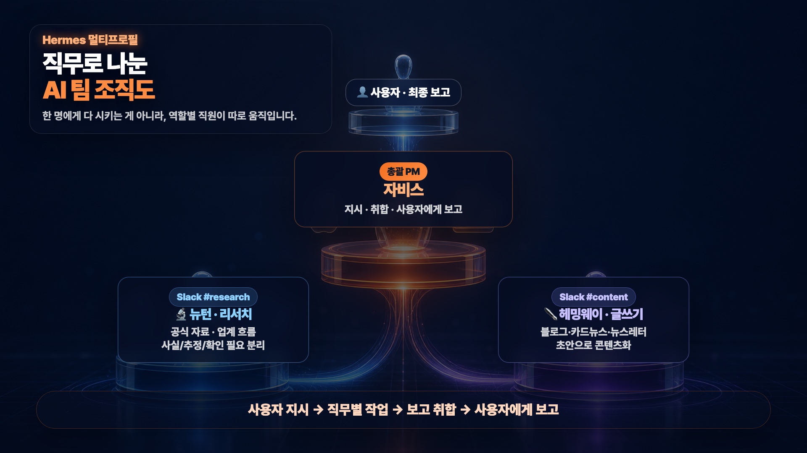
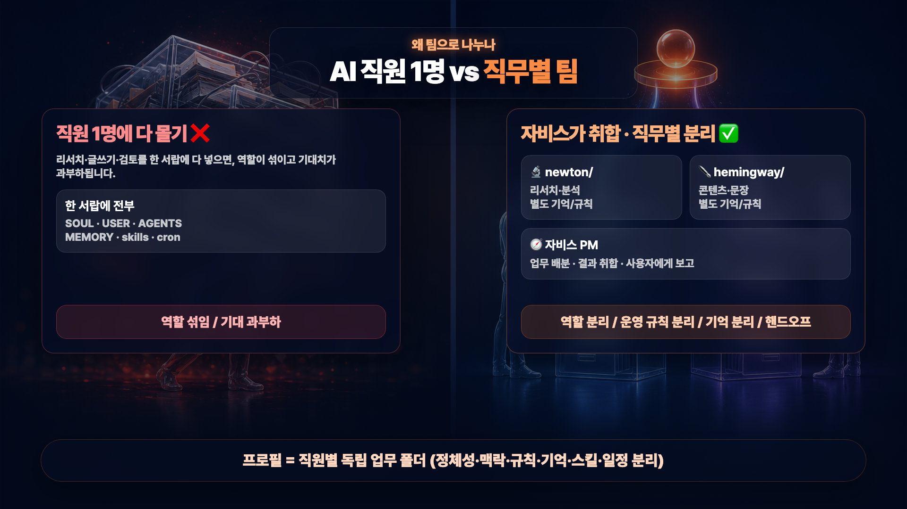
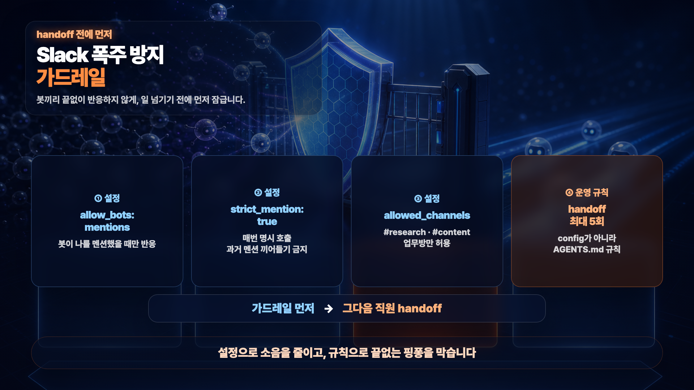
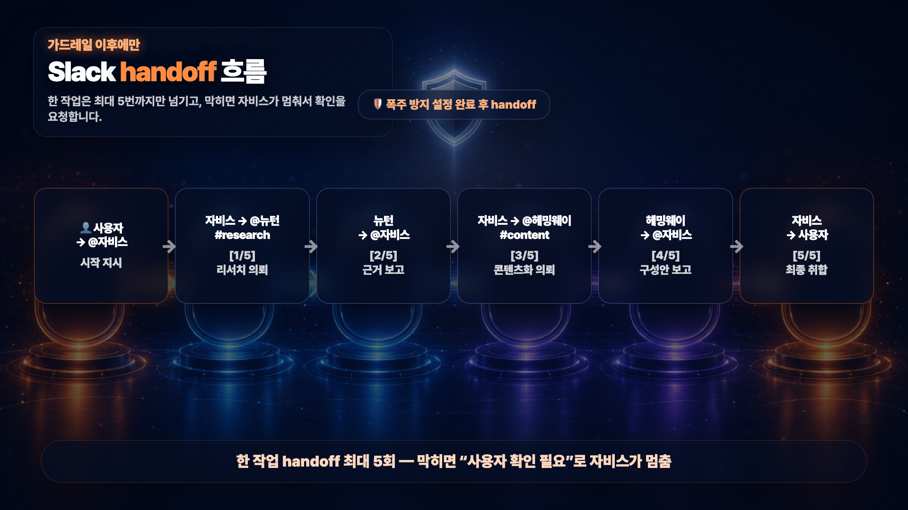
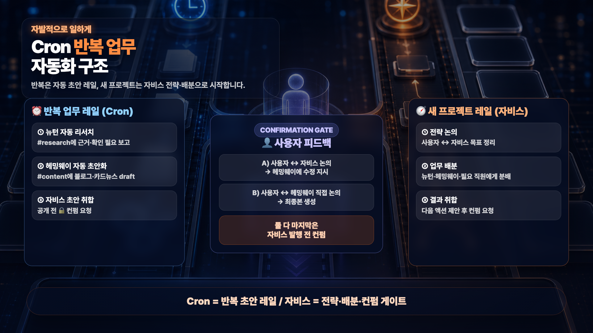

# Hermes 멀티프로필로 'AI 직원 팀' 만들기 — 직무 분리 · 업무 분배 · 핸드오프 운영


AI 비서 한 명에게 리서치도, 글쓰기도, 검토도 전부 맡기면 일이 조금만 많아져도 역할이 섞이고 결과물 퀄리티가 흔들립니다. 이 가이드는 Hermes Agent의 **멀티프로필**로 '직무가 나뉜 AI 직원 팀'을 만들어, 한 명에게 일이 몰리지 않게 운영하는 법을 다룹니다.

**자비스(총괄 PM) · 뉴턴(리서치·분석) · 헤밍웨이(콘텐츠·글쓰기)** 처럼 각 직원에게 정체성·운영 규칙·기억을 따로 부여하고, Slack에서 사람처럼 일을 주고받게(handoff) 만듭니다. 봇끼리 무한 대화하지 않도록 **가드레일을 먼저** 잡고, 반복 업무는 **Cron**으로 알아서 굴러가는 구조까지 설계합니다. 혼자 또는 적은 인원으로 여러 업무를 다 쳐내야 하는 1인 사업가·작은 회사에 특히 맞습니다.

> ⚠️ Hermes 화면·메뉴·CLI 명령은 버전(v0.16.x)에 따라 다를 수 있습니다. 정확한 동선은 [공식 문서](https://hermes-agent.nousresearch.com/docs)로 확인하세요. 이 가이드의 직원 이름(뉴턴/헤밍웨이)은 '역사 속 천재' 역할 페르소나 예시이며, 실제 업무에 맞게 바꿔 쓰시면 됩니다.

---

## 목차

- [1. 개념 — 한 명 vs 직무별 팀](#1-개념--한-명-vs-직무별-팀)
- [2. 왜 직무별로 나누나](#2-왜-직무별로-나누나)
- [3. 사전 준비](#3-사전-준비)
- [4. 실습 — 팀 만들고 운영하기](#4-실습--팀-만들고-운영하기)
- [5. 한계 / 주의사항](#5-한계--주의사항)
- [6. FAQ](#6-faq)
- [7. 참고 자료](#7-참고-자료)

---

## 1. 개념 — 한 명 vs 직무별 팀



Hermes에는 **프로필(profile)** 이 있어, 한 컴퓨터 안에 독립된 AI 직원을 여러 명 둘 수 있습니다. 각 프로필은 자기만의 정체성·기억·스킬·일정을 **따로** 가집니다.

| 구분 | 자비스 | 뉴턴 | 헤밍웨이 |
|---|---|---|---|
| 역할 | 총괄 비서·PM | 리서치·분석·팩트체크 | 콘텐츠·글쓰기·카피 |
| 하는 일 | 지시·업무 분배·보고 취합·구씨님 보고 | 공식 자료·출처 확인, 사실/추정/확인 필요 분리 | 뉴턴 근거로 블로그·뉴스레터 초안·훅 |
| Slack 방 | #business | #research | #content |
| 직접 일하나 | 아니오(총괄) | 예 | 예 |

> 💡 흐름은 한 바퀴입니다: **지시 → 직무별 작업 → 보고 취합 → 구씨님 보고.**

---

## 2. 왜 직무별로 나누나



짧은 일은 한 명으로 충분하지만, 일이 길어지고 역할이 갈리면 한 명에 몰수록 품질이 흔들립니다.

| 비교 항목 | 직원 1명에 다 몰기 | 직무별 팀(멀티프로필) |
|---|---|---|
| 파일/상태 | 한 서랍에 SOUL·USER·AGENTS·MEMORY·skills·cron 전부 | 프로필별 독립 폴더로 분리 |
| 맥락 | 역할 섞임 / 기대 과부하 | 역할·운영 규칙·기억 분리 |
| 협업 | 혼자 다 처리 | 직원 간 handoff로 분담 / Cron으로 각자 작업 진행 |
| 적합 | 짧은 단일 작업 / 비서 용도 | 여러 업무를 지속 운영하는 1인/소수 |

> 📌 **프로필 = 직원별 독립 업무 폴더** (정체성·사용자 맥락·운영 규칙·기억·스킬·일정 분리). 단, 프로필은 *상태*를 격리할 뿐 **파일시스템 샌드박스가 아닙니다** 

---

## 3. 사전 준비

| 준비물 | 내용 |
|---|---|
| Hermes Agent | v0.16.x(데스크톱 앱 포함). 공식: https://hermes-agent.nousresearch.com/docs |
| 기본 비서 1명 | 이미 자비스(기본 프로필)를 만들어 둔 상태에서 '직원 추가'에 집중 |
| Slack 워크스페이스 | 업무방 `#research`, `#content` 준비(봇 토큰/채널 분리 필요) |
| 코딩 지식 | 불필요 — 자비스에게 한국어로 부탁하면 됨(명령은 보조) |

---

## 4. 실습 — 팀 만들고 운영하기

> 아래 프롬프트는 디폴트 직원에게 복사해 붙여넣어 따라 하실 수 있습니다. 다만, 본인의 업무 특성에 맞게 변형하여 활용해보세요.

### 4-1. 뉴턴·헤밍웨이 프로필(직원) 만들기

```text
자비스, 너의 기본 Hermes 프로필을 참고해서 새 직원 프로필 두 개를 만들어줘.

- newton: 리서치·팩트체크 담당. 공식 자료와 출처를 확인하고, 사실/추정/확인 필요를 분리해서 보고하는 직원.
- hemingway: 콘텐츠 구성·카피 담당. 뉴턴의 리서치 결과를 받아 블로그 초안, 뉴스레터 문구처럼 외부로 보여줄 콘텐츠 형태로 바꾸는 직원.

중요:
- 기존 기본 프로필의 config와 안전한 운영 구조는 참고하되, 세션 기록이나 오래된 memory는 복사하지 마.
- 각 프로필 description은 나중에 라우팅 라벨로 쓰일 수 있게 직무가 선명하게 써줘.
- 생성 후 어떤 파일을 수정해야 하는지 경로와 함께 보고해줘.
```

직접 명령으로 만들 수도 있습니다(동선은 버전별 확인 필요).

```bash
hermes profile create newton --clone-from default --clone --description "출처 기반 리서치·팩트체크 담당"
hermes profile create hemingway --clone-from default --clone --description "콘텐츠 구성·카피·블로그 초안 담당"
```

> `description`은 단순 이름표가 아니라 '이 일은 누구한테 보낼까'를 정하는 **라우팅 라벨**입니다.

### 4-2. 운영 파일 세팅 — SOUL · USER · AGENTS · MEMORY

신입에게 업무 기준서를 주듯 네 파일을 세팅합니다. **공통 협업 규칙은 SOUL.md보다 AGENTS.md에** 넣는 게 맞습니다(SOUL=누구인가, AGENTS=어떻게 일하는가).

**① SOUL.md — 정체성·미션·말투**

```text
자비스, newton과 hemingway의 기본 SOUL.md를 각각 수정해줘.

기존 SOUL.md의 큰 구조는 유지하되, 아래 항목을 각 직원 역할에 맞게 다시 써줘.

1. Identity — 이름, 역할, 일하는 스타일, 주 사용자
2. Mission — 이 직원이 어떤 업무 성과를 만들기 위해 존재하는지
3. Operating Context Pointer — 비단순 작업 전 읽어야 할 AGENTS.md 또는 REFERENCE_INDEX.md 절대경로
4. Core Truths — 항상 지켜야 할 판단 기준 5~7개
5. Tone — 보고 말투와 Slack/Telegram 응답 스타일
6. Content Boundaries — 하면 안 되는 일, 확인 받아야 하는 일

중요:
- SOUL.md에는 직원의 정체성, 역할, 말투, 판단 기준만 넣어줘.
- 공통 협업 규칙, handoff 횟수 제한, 보고 양식, 파일 경로 규칙은 AGENTS.md로 분리해줘.
- SOUL.md에는 "세부 운영 규칙은 같은 프로필의 AGENTS.md를 따른다"는 포인터만 남겨줘.
```

**② USER.md — 공통 사용자 정보(얇게)**

```text
자비스, newton과 hemingway의 memories/USER.md를 만들어줘.

기본 USER.md에서 모든 내용을 복사하지 말고, 두 직원 모두 알아야 하는 공통 사용자 정보만 얇게 가져와줘.

포함할 것:
- 사용자는 구씨님 / 9c로 부른다.
- 한국어 존댓말로 보고한다.
- 결론과 추천을 먼저 말하고, 이유는 뒤에 붙인다.
- 확실하지 않은 정보는 `확인 필요`로 표시한다.
- 콘텐츠 작업에서는 비개발자/SMB가 이해할 수 있게 쉽게 설명한다.
- Slack/Telegram에서는 장황한 내부 로그보다 결론, 산출물, 검증, 다음 액션 중심으로 보고한다.

제외할 것:
- 개인 사생활이나 민감 정보
- 이 직원 역할과 무관한 오래된 선호
- 다른 직원의 작업 기록이나 세션 요약

가능하면 영어 키워드 중심으로 짧게 쓰고, `구씨님` 호칭처럼 뉘앙스가 중요한 부분만 한국어로 남겨줘.
```

**③ AGENTS.md — 공통 협업 규칙 + 직원별 작업 방식**

```text
자비스, default 프로필의 기존 AGENTS.md를 기준 템플릿으로 삼아서,
default(자비스), newton, hemingway 세 프로필의 AGENTS.md를 역할별로 정리해줘.

전제:
- 기본은 default 프로필의 AGENTS.md를 가져온다고 가정한다.
- 기존 default AGENTS.md의 구조는 유지한다.
  1. 보안
  2. 판단
  3. 작업 경로
  4. 보고 양식
  4-1. deliverable reporting 규칙
  5. 포인터
- 보안, 민감정보, 외부 발송 확인, 파일 검증, 첨부 규칙은 삭제하지 말고 모든 프로필에 유지한다.

공통 협업 규칙은 세 프로필 AGENTS.md에 모두 반영해줘:
- 자비스는 PM/오케스트레이터다. 최종 취합과 구씨님 보고를 맡는다.
- 뉴턴은 리서치·팩트체크 담당이다. 근거 없는 수치/날짜/제품 기능은 단정하지 않는다.
- 헤밍웨이는 콘텐츠 구성·카피 담당이다. 뉴턴의 근거를 바탕으로 훅과 흐름을 만든다.
- 직원끼리 Slack/Telegram에서 handoff할 때는 한 번에 한 명만 @멘션한다.
- 한 작업의 handoff는 최대 5회까지만 허용한다.
- 막히면 직원끼리 계속 토론하지 말고 `구씨님 확인 필요`로 자비스에게 올린다.

프로필별 수정 방향:

1. default(자비스) AGENTS.md
- 역할: PM/오케스트레이터, 업무 분해, 직원 라우팅, 최종 취합.
- 판단: 작업 시작 전 목적·기대결과·우선순위를 정리하고, 뉴턴/헤밍웨이 중 누구에게 맡길지 결정한다.
- 보고: 뉴턴과 헤밍웨이 결과를 그대로 붙여넣지 말고, 충돌·확인 필요·추천안을 정리해서 구씨님에게 보고한다.
- 포인터: 반복 리서치는 newton, 콘텐츠 초안은 hemingway, 최종 승인/외부 발송은 default(자비스)가 담당한다고 적는다.

2. newton AGENTS.md
- 역할: 리서치·팩트체크·출처 검증.
- 판단: 사실/추정/확인 필요를 분리하고, 날짜·가격·제품 기능·통계는 근거 없이 단정하지 않는다.
- 작업 경로: 리서치 노트와 출처 목록을 남기고, 콘텐츠 문장화는 헤밍웨이에게 넘긴다.
- 보고: 핵심 발견 3개, 근거 URL, 확인 필요 항목, 헤밍웨이에게 넘길 메시지를 포함한다.
- 포인터: 공식 문서, 릴리스 노트, 신뢰 가능한 기사/보고서를 우선한다.

3. hemingway AGENTS.md
- 역할: 콘텐츠 구조화·카피·초안 작성.
- 판단: 뉴턴의 근거를 바탕으로 쓰고, 확인 안 된 수치나 기능은 새로 만들지 않는다.
- 작업 경로: 블로그 초안, 뉴스레터 문구, 카드뉴스 구성안 같은 콘텐츠 산출물을 만든다.
- 보고: 제목 후보, 도입 훅, 목차, 초안, 확인 필요한 표현을 나눠 보고한다.
- 포인터: 사실 검증이 필요하면 뉴턴에게 되돌리고, 최종 발행 판단은 자비스와 구씨님에게 올린다.

주의:
- SOUL.md에는 긴 절차를 넣지 말고, AGENTS.md 또는 skill/reference로 분리한다.
- MEMORY.md에는 오래 유지될 성향과 규칙만 넣고, 작업 로그나 곧 낡을 정보는 넣지 않는다.
- 작성 후 각 AGENTS.md의 경로와 변경 요약을 보고해줘.
```

**④ MEMORY.md — 깔끔하게 새로 시작**

기존 직원의 기억을 통째로 복사하면 역할이 섞이고 오래된 로그까지 따라오므로, **역할에 꼭 필요한 씨앗(seed)만** 짧게 넣습니다.

```text
자비스, newton과 hemingway의 MEMORY.md는 새롭게 시작해줘.

기존 memory를 통째로 복사하지 말고, 정말 의미 있는 장기 규칙이 있으면 후보만 보여줘.
이번 데모에서는 깔끔하게 새로 시작하는 버전으로 작성해줘.

뉴턴 MEMORY.md seed:
- 역할: 출처 기반 리서치·팩트체크. 결과는 자비스 PM에게 보고한다.
- 규칙: 사실/추정/확인 필요를 분리한다. 제품 기능·날짜·가격·숫자는 근거 없이 단정하지 않는다.
- 협업: 콘텐츠화가 필요하면 헤밍웨이에게 넘긴다. 세부 handoff 규칙은 AGENTS.md를 따른다.

헤밍웨이 MEMORY.md seed:
- 역할: 콘텐츠 구성·카피·초안 작성. 사실은 뉴턴의 근거나 공식 자료에 기대고 임의 수치를 만들지 않는다.
- 규칙: 첫 문장 훅, 쉬운 우리말, show not tell, 추천안 먼저.
- 협업: 사실 확인은 뉴턴에게 요청하고, 최종 결과는 자비스 PM에게 보고한다. 세부 handoff 규칙은 AGENTS.md를 따른다.

주의:
- task log, PR 번호, 예전 세션 결과, 곧 낡을 정보는 memory에 넣지 마.
- 절차가 길어지면 memory가 아니라 skill이나 AGENTS.md에 넣어줘.
```

### 4-3. 멀티프로필 협업 테스트 (실제 프로필 호출)

운영 파일이 실제로 반영되는지, 작은 작업으로 뉴턴→헤밍웨이→자비스 협업을 한 번 돌려봅니다.

```text
자비스, 실제 멀티프로필 직원 협업으로 아주 작은 테스트를 해줘.

목표:
"Hermes에서 멀티프로필로 구분해서 사용하는 이유"를 설명하는 블로그 초안 재료를 만든다.

중요:
- 실제 Hermes 프로필 직원을 호출해서 진행한다.
- Newton은 실제 `newton` 프로필로 실행한다.
- Hemingway는 실제 `hemingway` 프로필로 실행한다.
- 각 직원의 SOUL.md, AGENTS.md, config.yaml, memory가 실제로 반영되는 방식이어야 한다.
- 외부 발송은 하지 말고, 내부 검토용 draft 재료로만 만든다.

진행:

1. 실제 Newton 프로필 호출
   - 다음 방식으로 Newton에게 작업을 맡긴다.
   - 예시:
     `hermes --profile newton chat -q "..."`
   - Newton에게 요청할 내용:
     "AI 자동화/AI 에이전트 트렌드 중 SMB가 관심 가질 포인트 3개를 정리해줘.
      사실/추정/확인 필요를 분리하고,
      Hemingway에게 넘길 핵심 메시지 3개를 만들어줘.
      주제는 'Hermes에서 멀티프로필로 구분해서 사용하는 이유'를 설명하는 블로그 초안 재료야.
      확인되지 않은 수치, 날짜, 제품 기능은 단정하지 말고 확인 필요로 표시해줘.
      결과는 내부 검토용 research material로 작성해줘."

   - Newton 결과는 파일로 저장한다.
   - 권장 경로:
     `/workspace/reports/newton_research_multi_profile_hermes.md`

2. 실제 Hemingway 프로필 호출
   - Newton 결과를 읽은 뒤, 실제 Hemingway 프로필에게 넘긴다.
   - 다음 방식으로 Hemingway에게 작업을 맡긴다.
   - 예시:
     `hermes --profile hemingway chat -q "...Newton 결과 요약 또는 파일 경로..."`
   - Hemingway에게 요청할 내용:
     "아래 Newton의 research material을 바탕으로 블로그 초안 재료를 만들어줘.
      최종 발행본이 아니라 내부 검토용 draft material로 표시해줘.
      블로그 제목 후보 3개, 도입 훅 1개, 목차 5개를 만들어줘.
      확인 안 된 수치, 날짜, 제품 기능은 새로 만들지 마.
      Newton이 사실/추정/확인 필요로 분리한 내용을 유지해줘.
      주제는 'Hermes에서 멀티프로필로 구분해서 사용하는 이유'야."

   - Hemingway 결과는 파일로 저장한다.
   - 권장 경로:
     `/workspace/reports/hemingway_draft_material_multi_profile_hermes.md`

3. 자비스 최종 취합
   - Newton 결과와 Hemingway 결과를 그대로 붙여넣지 말고 요약·취합한다.
   - 충돌, 확인 필요, 추천 메시지를 분리한다.
   - 텔레그램에는 최종 보고만 한다.
   - 외부 발행본이 아니라 내부 검토용 draft material이라고 표시한다.
   - 생성된 파일이 실제 존재하는지 확인한 뒤 보고한다.

최종 보고 형식:

- status:
- conclusion:
- newton_summary:
- hemingway_draft_material:
- needs_9c_feedback:
- artifacts:
- next_action:

주의:
- 실제 `newton` / `hemingway` Hermes 프로필 호출 테스트다.
- 실제 직원 프로필의 SOUL.md, AGENTS.md, config.yaml, memory 반영 여부를 확인하는 목적도 포함한다.
- 최종 발행본이 아니라 내부 검토용 draft material로 표시한다.
- 확인되지 않은 수치, 날짜, 제품 기능은 새로 만들지 않는다.
- 구씨 대표님 승인 없이 Slack/Telegram/이메일 등 외부 채널로 직원에게 메시지를 보내지 않는다.
```

### 4-4. Slack 폭주 방지 가드레일 — handoff보다 먼저



직원이 여러 명이 되면 봇끼리 서로의 말에 반응해 시끄러워질 수 있습니다. **handoff를 시작하기 전에** 가드레일부터 잠급니다.

```text
자비스, newton과 hemingway가 Slack에서 서로 handoff하기 전에 폭주 방지 설정부터 점검해줘.

목표:
봇끼리 무한 대화하지 않고, 정해진 업무방에서만, 명시적으로 멘션받았을 때만 움직이게 한다.

확인/수정할 설정 의도:
- allow_bots: mentions   → 봇 메시지도 받되, 나를 멘션했을 때만 반응
- strict_mention: true   → 과거 멘션 기억으로 끼어들지 말고, 매번 명시 호출
- allowed_channels       → newton은 #research, hemingway는 #content 중심으로 제한
- allowed_users         → 내 아이디 포함, 각 직원들의 슬렉 유저아이디 포함하여 서로 대화 가능하게 설정 

운영 규칙:
- 한 작업의 handoff는 최대 5회까지만 허용한다.
- 이 handoff 제한은 config가 아니라 각 프로필 AGENTS.md 운영 규칙으로 둔다.
- 막히면 직원끼리 계속 토론하지 말고 `구씨님 확인 필요`로 자비스에게 올린다.

설정 키 이름은 Hermes 버전에 따라 다를 수 있으니,
실제 config 경로와 수정 전/후 요약해주고 게이트웨이 리스타트는 하지마.
```

> ⚠️ 설정 키 이름(allow_bots/strict_mention/allowed_channels/allowed_users)은 버전별로 다를 수 있습니다. 실제 config로 확인하세요. 실제 Slack 유저 ID·토큰은 공개 자료에 넣지 마세요.

### 4-5. Slack handoff 시연 — 직원끼리 일 넘기기



```text
이번 주 AI 자동화 트렌드 중 우리 고객에게 설명할 만한 주제를 찾아줘.
뉴턴은 슬렉 #research에서 공식 자료와 업계 흐름을 확인하고,
헤밍웨이는 슬렉 #content에서 그걸 블로그 초안으로 바꿔줘.
자비스는 두 결과를 취합해서 최종 정리본으로 보고해줘.
한 작업 handoff는 최대 5회 안에서 끝내줘.
```

> 일이 한 명에게 몰리지 않고 직원끼리 넘어가며, 자비스가 최종만 취합합니다. **handoff 최대 5회** 제한으로 끝없는 핑퐁을 막고, 막히면 "구씨님 확인 필요"로 올라옵니다.

### 4-6. Cron — 반복 업무 자동화 구조



| 레일 | 흐름 |
|---|---|
| **반복 업무 레일 (Cron)** | ① 평일 아침 뉴턴 자동 리서치 → #research 근거·확인 필요 보고 → ② 헤밍웨이 자동 초안화 → #content draft → ③ 자비스 초안 취합 → 🔒 "컨펌 요청" 게이트 |
| **구씨님 피드백** | A) 구씨님↔자비스 → 헤밍웨이에 수정 지시 / B) 구씨님↔헤밍웨이 직접 → 최종본. 둘 다 자비스 발행 전 컨펌으로 합류 |
| **새 프로젝트 레일 (자비스)** | ① 구씨님↔자비스 전략 논의 → ② 뉴턴/헤밍웨이에 업무 배분 → ③ 결과 취합 → 다음 액션 제안 |

> 📌 **Cron = 반복 초안 레일 / 자비스 = 전략·배분·컨펌 게이트.** 자동 결과는 그대로 믿지 말고 게이트에서 사람이 확인하세요.

---

## 5. 한계 / 주의사항

| 한계 / 함정 | 우회 / 완화 |
|---|---|
| 동시 온라인 시 봇 토큰 충돌 | 프로필마다 별도 봇 토큰/채널 |
| 프로필 격리 ≠ 파일시스템 샌드박스 | 외부 발송·결제·민감 작업은 사람 승인 단계 |
| 직원이 많아지면 관리 피로 | 자비스 + 직원 1명부터 시작해 점진 확장 |
| 봇끼리 무한 대화 | 가드레일(멘션만/엄격 멘션/허용 채널) + handoff 5회 제한 |
| 자동 결과 맹신 | Cron 결과는 컨펌 게이트에서 사람이 검토 |
| 화면·명령 버전 차이 | 공식 문서로 동선 확인 |

---

## 6. FAQ

| 질문 | 답 |
|---|---|
| 코딩 몰라도 되나요? | 네. 자비스에게 한국어로 부탁하면 됩니다. 명령은 보조입니다. |
| 직원은 몇 명부터? | 자비스 + 직원 1명(예: 리서처)부터 시작해 확장하세요. |
| 콘텐츠 팀 말고 다른 업무도 되나요? | 네. '리서처→영업 담당', '콘텐츠→보고서 담당'처럼 직무 이름과 Slack 방만 바꾸면 됩니다. |
| 기억(MEMORY)은 복사하나요? | 통째 복사는 비추천. 역할에 필요한 seed만 새로 넣으세요. |
| 큰 프로젝트 관리는? | Kanban 보드(durable 업무 보드)로 |

---

## 7. 참고 자료

| 자료 | 링크 |
|---|---|
| Hermes 공식 문서 | https://hermes-agent.nousresearch.com/docs |
| Profiles(멀티프로필) | https://hermes-agent.nousresearch.com/docs/user-guide/profiles |
| Multi-profile gateways | https://hermes-agent.nousresearch.com/docs/user-guide/multi-profile-gateways |
| Kanban(다중에이전트 보드) | https://hermes-agent.nousresearch.com/docs/user-guide/features/kanban |
| Desktop 앱 | https://hermes-agent.nousresearch.com/docs/user-guide/desktop |

> 이 가이드는 시민개발자 구씨(@citizendev9c) 영상의 상세 설명 자료입니다. Hermes 기능·화면은 업데이트로 바뀔 수 있으니 공식 문서를 함께 확인해 주세요.
