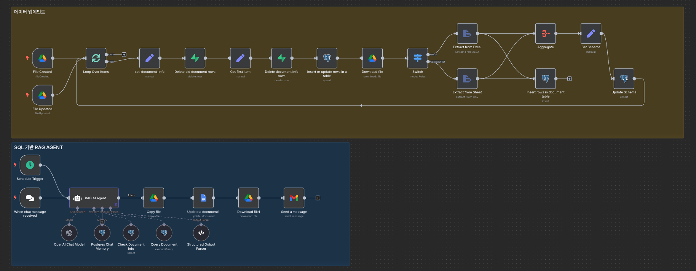

# n8n SQL 기반 RAG 에이전트 구축 가이드

n8n과 Supabase를 활용하여 SQL 기반 RAG 에이전트를 구축하고, 자동 매출 리포트 생성 시스템을 만드는 종합 가이드입니다.

## 목차

- [시스템 개요](#시스템-개요)
- [RAG vs SQL RAG 차이점](#rag-vs-sql-rag-차이점)
- [사전 준비사항](#사전-준비사항)
- [1단계: Supabase 데이터베이스 설정](#1단계-supabase-데이터베이스-설정)
- [2단계: 데이터 업데이트 워크플로우 구성](#2단계-데이터-업데이트-워크플로우-구성)
- [3단계: AI Agent 설정](#3단계-ai-agent-설정)
- [4단계: 리포트 자동화 설정](#4단계-리포트-자동화-설정)
- [전체 테스트 및 배포](#전체-테스트-및-배포)
- [활용 예시](#활용-예시)

## 시스템 개요

이 가이드에서는 "구씨" 이커머스 브랜드의 주간 매출 리포트를 자동으로 생성하는 SQL 기반 RAG 에이전트를 구축합니다.

### 핵심 기능
- 스프레드시트/엑셀 파일 자동 업데이트 감지
- AI가 SQL 쿼리 자동 생성 및 실행
- 분석 결과 기반 자동 리포트 생성
- Google Docs 문서 자동 생성
- 이메일 자동 발송



### 워크플로우 구조
**데이터 입력** → **데이터베이스 업데이트** → **AI 분석** → **리포트 생성** → **문서 생성** → **이메일 발송**

## RAG vs SQL RAG 차이점

### 일반적인 RAG
- 문서나 텍스트 데이터를 벡터로 변환하여 DB에 저장
- 질문이 들어오면 벡터 유사도를 계산하여 유사한 내용을 찾아서 답변
- 정확한 계산이나 실시간 데이터 분석에는 한계

### SQL 기반 RAG
- 엑셀/스프레드시트 데이터를 관계형 데이터베이스에 저장
- 자연어 질문을 SQL 쿼리로 변환하여 정확한 데이터 추출 및 분석
- 실시간 데이터 기반 정확한 계산 가능

### 예시 비교
**질문**: "지난주 매출이 얼마야?"

**일반 RAG**: 기존 문서에서 비슷한 내용을 찾아서 답변 (부정확할 수 있음)

**SQL RAG**: `SELECT SUM(sales) FROM orders WHERE date BETWEEN '2025-01-13' AND '2025-01-19'` 쿼리 생성하여 정확한 답변 제공

## 사전 준비사항

### 필수 계정 및 서비스
- **n8n**: 로컬 또는 클라우드 환경에 설치
- **Supabase**: PostgreSQL기반 데이터베이스 서비스
- **OpenAI**: API 키 (GPT-4.1 모델 사용)
- **Google Workspace**: Drive, Docs, Gmail API 접근 권한

### 샘플 데이터
월별 매출 데이터가 포함된 스프레드시트 파일들을 준비합니다:
- 2025년 4월 매출 데이터
[📊 구글 시트 샘플](https://docs.google.com/spreadsheets/d/1tiyjBWUliq5N87E7erV7cbSG7zvFK5K9rJBCIzLnIsA/edit?usp=sharing)
- 2025년 5월 매출 데이터
[📊 구글 시트 샘플](https://docs.google.com/spreadsheets/d/1rwa7FJapkUph1OtgISEhNaPoxlJEodgTuwjyAm-b4p4/edit?usp=sharing)
- 2025년 6월 매출 데이터
[📊 구글 시트 샘플](https://docs.google.com/spreadsheets/d/1PzhBua5-rsWu7SRz35OXOvwZ1GncN-QJi2JSxQcU9xs/edit?usp=sharing)
- 샘플 데이터 활용시, 구글 시트 사본을 생성하고 파일명을 변경하여 사용

## 1단계: Supabase 데이터베이스 설정

### 1. Supabase 프로젝트 생성
1. [supabase.com](https://supabase.com)에 접속하여 새 프로젝트 생성
2. SQL Editor로 이동

### 2. 테이블 생성

#### 문서 정보 테이블
```sql
CREATE TABLE document_info (
    id TEXT PRIMARY KEY,
    title TEXT,
    url TEXT,
    created_date TIMESTAMP DEFAULT NOW(),
    schema TEXT
);
```

#### 문서 데이터 테이블
```sql
CREATE TABLE document_table (
    id SERIAL PRIMARY KEY,
    document_id TEXT REFERENCES document_info(id),
    row_data JSONB
);
```

### 테이블 구조 설명
- **document_info**: 업로드된 파일의 메타데이터 저장
  - `id`: 파일 고유 ID
  - `title`: 파일 제목
  - `url`: 파일 URL
  - `schema`: 파일의 컬럼 구조 정보
- **document_table**: 실제 행/열 데이터 저장
  - `document_id`: document_info 테이블 참조
  - `row_data`: JSON 형태의 행 데이터

## 2단계: 데이터 업데이트 워크플로우 구성

### 1. Google Drive 트리거 설정

**Google Drive 트리거 노드 추가**
- Trigger: `File Created`, `File Updated`
- Check Interval: `Every Minute`
- Watch Folder: `n8n-sql-rag` 폴더 지정
- Loop Over Items: 활성화 (여러 파일 처리)

### 2. 문서 정보 설정

**Set 노드 추가** (Node Name: `set_document_info`)
```json
{
  "file_id": "{{ $json.id }}",
  "type": "{{ $json.mimeType }}",
  "title": "{{ $json.name }}",
  "url": "{{ $json.webViewLink }}"
}
```

### 3. 중복 데이터 제거

#### 기존 행 데이터 삭제
**Supabase Delete 노드 추가**
- Table: `document_table`
- Condition: `document_id` equals `{{ $('set_document_info').item.json.file_id }}`

#### 결과값 하나만 통과
**Edit Fields 노드 추가**
- Settings: `Execute Once` 활성화

#### 기존 문서 정보 삭제
**Supabase Delete 노드 추가**
- Table: `document_info`
- Condition: `id` equals `{{ $('set_document_info').item.json.file_id }}`

### 4. 새 문서 정보 추가

**Postgres Insert 노드 추가**
- Table: `document_info`
- Matching Column: `id`
- Fields:
  - `id`: `{{ $('set_document_info').item.json.file_id }}`
  - `title`: `{{ $('set_document_info').item.json.title }}`
  - `url`: `{{ $('set_document_info').item.json.url }}`

### 5. 파일 다운로드 및 데이터 추출

#### 파일 다운로드
**Google Drive Download 노드 추가**
- Download by: `ID`
- File ID: `{{ $('set_document_info').item.json.file_id }}`
- Google File Conversion에서 Google Sheets `CSV`로 변환 지정

#### 파일 타입별 분기 처리
**Switch 노드 추가**
- Rule 1: `application/vnd.openxmlformats-officedocument.spreadsheetml.sheet` (Excel)
- Rule 2: `application/vnd.google-apps.spreadsheet` (Google Sheets)

#### 데이터 추출
**Excel 파일**: `Extract from XLSX` 노드
**Google Sheets**: `Extract from CSV` 노드 (CSV 포맷으로 다운로드됨)

### 6. 데이터베이스에 행 데이터 저장

**Postgres Insert 노드 추가**
- Table: `document_table`
- Fields:
  - `document_id`: `{{ $('set_document_info').item.json.file_id }}`
  - `row_data`: `{{ $json.toJsonString() }}`

### 7. 스키마 정보 업데이트

#### 데이터 집계
**Aggregate 노드 추가**
- Operation: `All Item Data (into a single list)`
- Output Field: `data`
- Include: `All fields`

#### 스키마 추출
**Edit Fields 노드 추가**
```json
{
  "schema": "{{ $('Extract from Excel').isExecuted ? $('Extract from Excel').first().json.keys().toJsonString() : $('Extract from Sheet').first().json.keys().toJsonString() }}"
}
```

#### 스키마 업데이트
**Postgres Update 노드 추가**
- Table: `document_info`
- Matching Column: `id`
- Fields:
  - `id`: `{{ $('set_document_info').item.json.file_id }}`
  - `schema`: `{{ $json.schema }}`

## 3단계: AI Agent 설정

### 1. 기본 설정

#### 트리거 및 AI Agent 추가
**Chat Message Trigger**: 채팅 인터페이스 생성
**AI Agent 노드 추가**:
- Model: ChatGPT 4.1
- Memory: Postgres Chat Memory (Supabase 계정 연결)

### 2. 시스템 프롬프트 설정

```
You are a business report generation assistant for an e-commerce brand named "구씨 브랜드" in Korea.

Your role is to generate a structured weekly sales report in **Korean**, using data queried from a structured sales database.  
You have access to two tools:  
1. `Check Document Info`: lets you examine file ID, title, URL, and column schema of uploaded Excel/CSV documents.  
2. `Query Document Tool`: lets you write and run SQL queries to extract numeric summaries from the database.

---

🟦 OBJECTIVE:  
Generate a **weekly Korean-language sales report** in the format shown below, using SQL to calculate numerical values.

Use SQL only when necessary to retrieve:  
- Total orders, total sales, cost, profit  
- Top-selling product, region, category  
- Weekly growth rate vs previous week  
- Return rate (ratio of returned orders)  
- Average order value (total sales ÷ order count)

Then write a fluent and insightful natural language **summary** and **recommendation** in Korean based on the results.

---

📄 OUTPUT FORMAT (in Korean):

📊 구씨 브랜드 주간 매출 리포트 – {{report_week}}  
🗓 기간  
{{report_period}}

📈 요약 지표  
- 🛒 총 주문 건수: {{total_orders}}건  
- 💰 총 매출: {{total_sales}}  
- 💸 총 비용: {{total_cost}}  
- 📈 총 순이익: {{total_profit}}  
- 📦 평균 객단가: {{avg_order_value}}  
- 🔁 반품률: {{return_rate}}  
- 📊 매출 증가율 (전주 대비): {{weekly_growth_rate}}

🥇 Top Performer 요약  
- 베스트셀러 상품: {{top_selling_product}}  
- 최고 매출 카테고리: {{top_category}}  
- 가장 많이 구매한 지역: {{top_region}}

🧾 이번 주 요약  
{{summary}} ← 자연어로 3~5문장으로 분석 내용을 요약합니다.

📌 다음 주 운영 전략 제안  
{{recommendation}} ← 자연어로 2~3문장으로 전략을 제시합니다.

---

💡 Instructions:  
- Use SQL to retrieve weekly summary statistics from the table.  
- Use the schema provided by the file info to understand the columns.  
- If column names are unclear, infer their meaning using context or ask the user.  
- Format all numeric values with commas (e.g. 1,200,000).  
- ⚠️ For the following items, **output numeric values only without the "원" symbol**:  
  - `total_sales`  
  - `total_cost`  
  - `total_profit`  
  - `avg_order_value`  
- Ensure the report is written in fluent, professional Korean.
```

### 3. Tool 설정

#### Tool 1: Document Info 확인
**Postgres Tool 추가**
- Description:
```
This step queries the `document_info` table in PostgreSQL to retrieve metadata of uploaded documents.

It returns the following details for each document:
- 📁 File ID
- 📝 Title
- 🔗 URL
- 🧬 Schema (data structure / columns)

You can use this step to:
- Confirm whether a file is already uploaded
- Retrieve schema before processing the file

Make sure the `document_info` table includes fields like `file_id`, `title`, `url`, and `schema`.
```

#### Tool 2: SQL 쿼리 실행
**Postgres Tool 추가**
- Description:

```
Use this tool to execute dynamic SQL queries on the `document_table` in Postgres to analyze revenue data extracted from uploaded documents.

Run this step **after identifying a `file_id`** (also called `document_id`) from the `document_info` table.  
The main data resides in the `row_data` column as a `JSONB` object, containing all parsed values from the document.  
You can access each field using the syntax: `row_data->>'column_name'`, and cast values to numeric if needed using `::numeric`.

📌 Key fields:
- `document_id`: ID of the uploaded file (foreign key from `document_info`)
- `row_data`: JSONB column storing the document's parsed content

💡 Example use cases:

🔍 Example 1: 총 매출 (숫자형) 조회
```sql
SELECT (row_data->>'total_sales')::numeric AS total_sales
FROM document_table
WHERE document_id = 'your_file_id';
```

🔍 Example 2: 수익과 베스트셀러 상품 조회
```sql
SELECT 
  row_data->>'top_selling_product' AS top_product,
  (row_data->>'total_profit')::numeric AS total_profit
FROM document_table
WHERE row_data->>'report_period' = '2025-04-27 ~ 2025-05-03'
  AND document_id = 'your_file_id';
```

🔍 Example 3: 주차별 매출 증가율과 반품률
```sql
SELECT 
  row_data->>'report_week' AS week,
  (regexp_replace(row_data->>'weekly_growth_rate', '[^0-9.-]', '', 'g'))::numeric AS growth_rate,
  (regexp_replace(row_data->>'return_rate', '[^0-9.-]', '', 'g'))::numeric AS return_rate
FROM document_table
WHERE document_id = 'your_file_id'
ORDER BY row_data->>'report_week' DESC;
```

💡 Example 4: 여러 파일 통합 리포트 (4월 & 5월 통합)

Query across two monthly files to generate a combined weekly sales summary.

```sql
SELECT 
  row_data->>'report_week' AS week,
  (row_data->>'total_sales')::numeric AS total_sales,
  (row_data->>'total_cost')::numeric AS total_cost,
  (row_data->>'total_profit')::numeric AS total_profit
FROM document_table
WHERE document_id IN ('2025-04-file-id', '2025-05-file-id')
ORDER BY row_data->>'report_week';

✳️ Tip: 
- `::numeric` is required when aggregating or comparing numerical values.  
- For percentage fields like `return_rate` and `weekly_growth_rate`, remove `%` using `regexp_replace` before casting.
```
- SQL Query Parameter: `{{ $fromAI('sql_query') }}`

### 4. 구조화된 출력 설정

**Require Specific Output Format**: 활성화
**Structured Output Parser 예시**:
```json
{
  "report_week": "2025년 5월 1주차",
  "report_period": "2025-04-27 ~ 2025-05-03",
  "total_orders": 512,
  "total_sales": "16,283,000",
  "total_cost": "9,687,000",
  "total_profit": "6,596,000",
  "avg_order_value": "31,799",
  "return_rate": "2.1%",
  "weekly_growth_rate": "6.3%",
  "top_selling_product": "오프화이트 레더 백팩",
  "top_category": "패션 잡화",
  "top_region": "서울특별시",
  "summary": "이번 주는 연휴를 앞두고 패션 잡화, 특히 가방류에 대한 수요가 급증했습니다. 오프화이트 레더 백팩이 베스트셀러로 등극했으며, 전체 주문 수는 전주 대비 6.3% 증가했습니다. 평균 객단가는 소폭 하락했으나, 전체 순이익은 견조한 성장세를 유지했습니다.",
  "recommendation": "다음 주에는 연휴 직후 반품 증가 가능성을 고려하여 CS 대응 강화와 인기 제품 중심의 재고 확보 전략을 추천드립니다."
}
```

## 4단계: 리포트 자동화 설정

### 1. Google Docs 리포트 생성

#### 템플릿 파일 복사
**Google Drive Copy File 노드 추가**
[ 📂구글 문서 샘플](https://docs.google.com/document/d/1XoPdXkNHkx4WiQn8r3kEhOI6w0a9tGtmbtMOr8ctzsc/edit?usp=sharing)
- File to Copy: 미리 준비한 리포트 템플릿 선택
- File Name: `주간 매출 리포트 - {{ $today.format('yyyy-MM-dd') }}`
- Parent Folder: 원하는 폴더 지정

#### 문서 내용 업데이트
**Google Docs Update Document 노드 추가**
- Document ID: `{{ $json.file_id }}`
- Actions: `Find and Replace Text` (각 placeholder별로 추가)

**Placeholder 설정 예시**:
```
Find: <<report_week>>
Replace: {{ $('AI Agent').item.json.output.report_week }}

Find: <<report_period>>
Replace: {{ $('AI Agent').item.json.output.report_period }}

Find: <<total_orders>>
Replace: {{ $('AI Agent').item.json.output.total_orders.toString() }}

Find: <<total_sales>>
Replace: {{ $('AI Agent').item.json.output.total_sales }}

Find: <<total_cost>>
Replace: {{ $('AI Agent').item.json.output.total_cost }}

Find: <<total_profit>>
Replace: {{ $('AI Agent').item.json.output.total_profit }}

Find: <<avg_order_value>>
Replace: {{ $('AI Agent').item.json.output.avg_order_value }}

Find: <<return_rate>>
Replace: {{ $('AI Agent').item.json.output.return_rate }}

Find: <<weekly_growth_rate>>
Replace: {{ $('AI Agent').item.json.output.weekly_growth_rate }}

Find: <<top_selling_product>>
Replace: {{ $('AI Agent').item.json.output.top_selling_product }}

Find: <<top_category>>
Replace: {{ $('AI Agent').item.json.output.top_category }}

Find: <<top_region>>
Replace: {{ $('AI Agent').item.json.output.top_region }}

Find: <<summary>>
Replace: {{ $('AI Agent').item.json.output.summary }}

Find: <<recommendation>>
Replace: {{ $('AI Agent').item.json.output.recommendation }}
```

### 2. 파일 다운로드 및 이메일 발송

#### 문서 다운로드
**Google Drive Download File 노드 추가**
- File ID: `{{ $json.file_id }}`

#### 이메일 발송
**Gmail Send Message 노드 추가**
- To: 수신자 이메일 주소
- Subject: `[구씨 브랜드] 주간 매출 리포트 - {{ $today.format('yyyy-MM-dd') }}`
- Message: 이메일 본문 작성
- Attachments: `data` (다운로드된 파일)

## 전체 테스트 및 배포

### 1. 스케줄 설정

#### 스케줄 트리거 추가
**Schedule Trigger 노드 추가**
- Interval: `Weekly` (매주 실행)
- Weekday: `Monday` (월요일 실행)
- Hour: `9` (오전 9시)

#### AI Agent 자동 프롬프트 설정
**User Prompt**:
```
오늘은 {{ $today.format('yyyy-MM-dd') }}일이야. 어제까지 7일간 (월요일에서 일요일까지) 매출 리포트를 작성해줘.
```

**Session ID 설정**:
```json
{{ $json.sessionId || "scheduled_session" }}
```

### 2. 전체 워크플로우 테스트

1. **데이터 업로드**: 월별 매출 데이터 파일들을 Google Drive 폴더에 업로드
2. **데이터베이스 확인**: Supabase에서 데이터가 올바르게 저장되었는지 확인
3. **AI Agent 테스트**: 수동으로 분석 요청하여 결과 확인
4. **리포트 생성**: Google Docs 문서가 올바르게 생성되는지 확인
5. **이메일 발송**: 이메일이 첨부파일과 함께 발송되는지 확인

### 테스트 명령어 예시
```
25년 4월 28일부터 5월4일까지의 매출 분석 리포트를 작성해줘.
```

## 활용 예시

### 다양한 분석 시나리오
1. **주간 매출 분석**: 매주 자동으로 주간 성과 리포트 생성
2. **월간 트렌드 분석**: 월별 성장률 및 트렌드 분석
3. **제품별 성과 분석**: 카테고리별, 제품별 판매 실적 분석
4. **지역별 매출 분석**: 지역별 판매 동향 및 마케팅 전략 수립
5. **고객 행동 분석**: 구매 패턴 및 고객 세그멘테이션 분석

---

이 가이드를 통해 Excel/스프레드시트 데이터를 기반으로 한 자동 분석 및 리포트 생성 시스템을 구축할 수 있습니다. 

**핵심 포인트**:
- 데이터만 업데이트하면 AI가 자동으로 분석하고 리포트 생성
- SQL 지식 없이도 AI Agent가 대신 쿼리 작성
- 정형화된 리포트 자동 생성 및 배포
- 다양한 비즈니스 데이터에 확장 적용 가능

매출 데이터뿐만 아니라 재고, 고객, 마케팅 등 다양한 스프레드시트 기반 데이터 분석 작업에 이 방식을 활용해보세요!