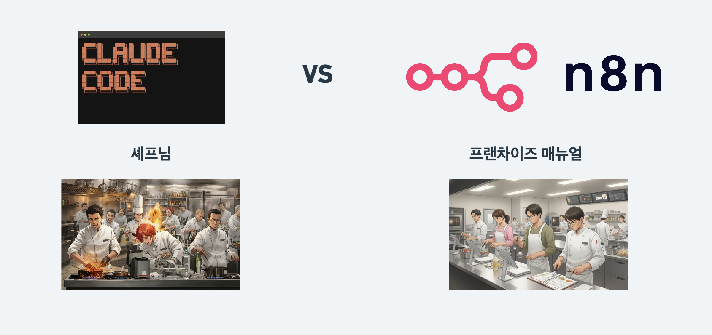
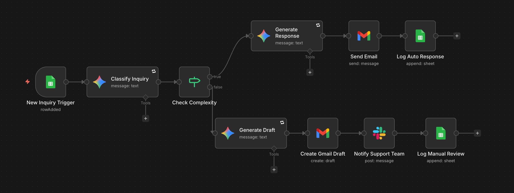

# Claude Code로 n8n 워크플로우 제작하기 (초보자 가이드)


n8n 워크플로우를 직접 하나하나 만드는 대신, Claude Code를 활용해 빠르고 효율적으로 워크플로우를 생성하는 방법을 안내합니다. 비개발자도 따라할 수 있는 단계별 가이드입니다.

## 목차

- [왜 Claude Code + n8n 조합인가?](#왜-claude-code--n8n-조합인가)
- [사전 준비사항](#사전-준비사항)
- [Claude Code 설치](#claude-code-설치)
  - [1단계: VS Code 설치](#1단계-vs-code-설치)
  - [2단계: Node.js 설치](#2단계-nodejs-설치)
  - [3단계: Claude Code 설치](#3단계-claude-code-설치)
  - [4단계: 권한 설정 (선택)](#4단계-권한-설정-선택)
- [n8n MCP & Skills 설치](#n8n-mcp--skills-설치)
  - [MCP와 Skills란?](#mcp와-skills란)
  - [설치 방법](#설치-방법)
  - [n8n API 연결](#n8n-api-연결)
- [SOP.md 작성 - 워크플로우 설계도 만들기](#sopmd-작성---워크플로우-설계도-만들기)
  - [왜 SOP.md를 먼저 만들어야 할까?](#왜-sopmd를-먼저-만들어야-할까)
  - [SOP.md 작성 프롬프트](#sopmd-작성-프롬프트)
- [CLAUDE.md 설정 - 워크플로우 제작 가이드](#claudemd-설정---워크플로우-제작-가이드)
  - [CLAUDE.md 초기 설정 프롬프트](#claudemd-초기-설정-프롬프트)
  - [MCP & Skills 도구 명시](#mcp--skills-도구-명시)
- [실전: 워크플로우 제작 요청](#실전-워크플로우-제작-요청)
  - [제작 요청](#제작-요청)
  - [결과물 확인 및 수정](#결과물-확인-및-수정)
  - [CLAUDE.md 업데이트로 시스템 개선](#claudemd-업데이트로-시스템-개선)
- [실전 예시: 고객 문의 자동 응대 시스템](#실전-예시-고객-문의-자동-응대-시스템)
- [핵심 정리](#핵심-정리)
- [FAQ](#faq)

---

## 왜 Claude Code + n8n 조합인가?

Claude Code는 강력한 바이브코딩 도구이지만, 만들어준 자동화 코드는 비개발자 입장에서 **블랙박스**가 될 수 있습니다.



**Claude Code = 셰프**
- "오늘 저녁 알아서 해주세요" 하면 뭔가 만들어줌
- 뭘 넣었는지 정확히 모르고, 맛이 이상하면 어디를 고쳐야 하는지 모름
- 그 셰프 없으면 똑같은 요리를 다시 만들기 어려움

**n8n = 프랜차이즈 매뉴얼**
- 트리거 → 조건 분기 → 액션, 모든 순서가 눈에 보임
- 매뉴얼대로 했는지만 확인하면 원하는 퀄리티가 나옴
- 에러가 나도 "3번 단계에서 문제네" 바로 찾을 수 있음

**두 도구를 조합하면:**
- Claude Code의 **빠른 제작 능력** + n8n의 **시각적 관리/유지보수** 장점을 동시에 활용
- 각 노드가 뭘 하는지 눈으로 바로 확인 가능
- 문제 생기면 어디서 에러 났는지 바로 파악 가능
- 일부만 수정하고 싶으면 해당 노드만 수정 가능

## 사전 준비사항

- n8n 설치 (클라우드 또는 셀프호스팅)
- Anthropic 계정 (Claude Code 인증용)
- 연동할 서비스의 API 키 또는 인증 정보 (Google, Slack 등)

---

## Claude Code 설치

### 1단계: VS Code 설치

[Visual Studio Code](https://code.visualstudio.com/) 공식 사이트에서 운영체제에 맞는 버전을 다운로드하여 설치합니다. 코드를 직접 짜는 것이 아니라 Claude Code에게 명령을 내리는 용도로 사용합니다.

### 2단계: Node.js 설치

[Node.js](https://nodejs.org/) 공식 사이트에서 **LTS 버전**을 다운로드하여 설치합니다. Claude Code가 작동하는 데 필요한 런타임 환경입니다.

### 3단계: Claude Code 설치

**방법 1: VS Code Extension (간편)**
1. VS Code 실행
2. 왼쪽 Extensions 탭 클릭
3. "Claude" 검색 → Claude Code extension Install
4. Anthropic 계정으로 로그인하여 인증 완료

**방법 2: 터미널 설치 (커스텀 설정 가능, 추천)**

```bash
# Mac
curl -fsSL https://claude.ai/install.sh | bash

# Windows
irm https://claude.ai/install.ps1 | iex
```

터미널 버전은 더 가볍고, 모든 커스텀 설정이 가능합니다.

### 4단계: 권한 설정 (선택)

Claude Code는 파일을 생성하거나 수정할 때마다 승인을 요청합니다. 이 과정이 번거로울 경우 Settings에서 **"Allow Dangerously Skip Permissions"** 옵션을 활성화할 수 있습니다.

```claude --dangerously-skip-permissions```

> ⚠️ 이 옵션을 활성화하면 Claude Code가 승인 없이 파일을 수정할 수 있으므로, 중요한 프로젝트에서는 주의해서 사용하세요.

`Shift + Tab`으로 다양한 모드(Auto, Plan 등)를 전환하며 사용할 수 있습니다.

---

## n8n MCP & Skills 설치

### MCP와 Skills란?

Claude Code는 범용 AI 도구이기 때문에, n8n 워크플로우를 잘 만들려면 **n8n 전문가 역량**을 장착시켜줘야 합니다.

- **MCP (Model Context Protocol)**: Claude Code가 n8n과 직접 소통할 수 있게 해주는 연결 도구
- **Skills**: n8n 워크플로우를 어떻게 만들어야 하는지 알려주는 지식/스킬셋

이 두 가지를 설치하면 Claude Code가 n8n 워크플로우를 더 정확하고 똑똑하게 만들어줍니다.

### 설치 방법

1. VS Code에서 새 폴더를 생성합니다 (예: `n8n-automation`)
2. 터미널을 열고 해당 디렉토리 안에서 `claude`를 입력하여 Claude Code를 실행합니다
3. 다음 프롬프트를 입력합니다:

```
n8n MCP와 n8n Skills를 이 프로젝트에 설치해줘.

참고링크:
- https://github.com/czlonkowski/n8n-mcp
- https://github.com/czlonkowski/n8n-skills
```

Claude Code가 알아서 필요한 설정을 진행합니다.

### n8n API 연결

MCP가 n8n과 소통하려면 API 키가 필요합니다.

1. n8n에서 **Settings > API**로 이동하여 API 키를 발급
2. MCP 설정에 API 키 입력

**보안 설정 (settings.json):**

```bash
# settings.json 열기
code ~/.claude/settings.json
```

```json
{
  "permissions": {
    "deny": ["Read(.mcp.json)", "Read(**/.mcp.json)"]
  }
}
```

이 설정은 `.mcp.json` 파일 읽기를 제한하여 API 키 등 민감 정보를 보호합니다.

---

## SOP.md 작성 - 워크플로우 설계도 만들기

### 왜 SOP.md를 먼저 만들어야 할까?

SOP(Standard Operating Procedure)는 업무 매뉴얼입니다. 워크플로우가 어떤 순서로 작동하고, 어떤 조건에서 어떤 액션을 취해야 하는지를 미리 정리하는 문서입니다.

SOP.md 없이 "고객 문의 자동화해줘" 라고만 요청하면, Claude Code가 나름대로 해석해서 만들지만 내가 원하는 방식이 아닐 수 있습니다.

**SOP.md를 먼저 만들면:**
- Claude Code가 **내 의도를 정확히 이해**
- 나중에 **수정할 때도 이 문서를 참고해 수정 요청** 가능
- 다른 워크플로우 만들 때도 **템플릿으로 재활용** 가능

### SOP.md 작성 프롬프트

Claude Code에게 다음과 같이 요청합니다:

```
SOP.md 파일을 만들어줘.

다음 워크플로우의 업무 프로세스를 SOP 문서로 정리해줘:

[워크플로우 이름]
고객 문의 자동 응대 시스템

[목적]
고객 문의를 자동으로 분류하고, 단순 문의는 즉시 답변 발송,
중요 문의는 담당자가 확인 후 발송할 수 있게 하는 시스템

[트리거]
- Google Forms에서 새 응답이 제출되어 시트에 등록이 되면 시작
- 시트 트리거로 시작
- 링크: https://docs.google.com/spreadsheets/d/YOUR_SHEET_ID
- 고객문의_폼 컬럼: 타임스탬프, 고객명, 이메일 주소, 문의 내용

[처리 로직]
1. 문의 내용을 AI로 분석
   - 카테고리 분류: 제품문의, 배송문의, 환불요청, 기타
   - 복잡도 판단: 단순문의, 확인필요
   - 모델: gemini-2.5-flash
   - 시스템프롬프트와 유저프롬프트도 적절히 기입하기

2. 단순 문의인 경우:
   - AI가 답변 생성
   - Gmail로 고객에게 바로 자동 발송
   - 처리방식: "자동발송"으로 기록

3. 확인 필요 문의인 경우:
   - AI가 답변 초안 생성
   - 이메일 발송은 하지 않고, 이메일 초안을 Gmail에 생성
   - Slack #customer-support 채널에 알림:
     "새 문의가 도착했습니다. 확인 후 발송해주세요."
     + 고객명, 문의내용, AI 답변 초안 포함
   - 처리방식: "수동확인"으로 기록

[로깅]
- 모든 문의는 Google Sheets "고객문의_로그"에 기록
- 고객문의_로그 컬럼: 접수일시, 고객명, 이메일, 문의내용, 카테고리, 복잡도, 처리방식

[에러 처리]
- AI 노드 실패시 3회 재시도
- 재시도 실패시 Slack #error-alert 채널에 알림

[사용 서비스]
- Google Sheets (트리거)
- Gemini (AI 분류/답변 생성)
- Gmail (이메일 발송)
- Slack (알림)
- Google Sheets (로깅)
```

SOP.md의 내용에서 수정이 필요한 부분이 있으면 Claude Code에게 추가 요청하여 수정합니다.

---

## CLAUDE.md 설정 - 워크플로우 제작 가이드

CLAUDE.md는 Claude Code에게 "이 프로젝트에서는 이렇게 일해라"라고 알려주는 프로젝트 가이드 문서입니다. 핵심은 **SOP.md를 참고하라고 명시**하는 것입니다.

### CLAUDE.md 초기 설정 프롬프트

터미널에서 `/init` 명령어를 입력한 후, 다음과 같이 요청합니다:

```
이 프로젝트는 n8n 워크플로우를 제작하는 프로젝트야.
반드시 SOP.md 파일을 먼저 읽고 워크플로우 로직을 이해한 후 제작해줘.
n8n MCP와 Skills를 활용해서 고퀄리티의 워크플로우를 생성해줘.

워크플로우 제작 프로세스:
1. SOP.md 파일을 읽고 워크플로우 로직 파악
2. n8n Skills, n8n MCP 를 참고해서 최적의 노드 구성 설계
3. n8n MCP, n8n skill을 통해 워크플로우 생성
4. 테스트 실행 및 검증
5. 에러 발생시 자동 수정
6. 각 노드별로 셋팅값이 누락된 것이 없고, 적절하게 들어가있는지 체크
7. 완료 후 n8n 워크플로우 링크 제공
8. 완성된 워크플로우의 json file 버전도 프로젝트에 "workflow-ver#" <- 실제 버전 넘버로 생성하기

워크플로우 제작시 필수 사항:
- 에러 핸들링이 필요한 노드를 파악하고, 해당 노드의 에러 핸들링 옵션 설정
- 각 노드에 명확한 이름 부여 (영어 사용)
- SOP.md에 명시된 로직을 정확히 따를 것
- 노드 별 셋팅값 누락이 없는지 체크하기
- context에 맞게 n8n-skill을 단계별로 항상 실행하기
- AI node 설정시 operation 값으로 실제 존재하는 값만 사용 (필수 확인)
```

## 실전: 워크플로우 제작 요청

### 제작 요청

모든 준비가 끝났으면, 워크플로우 제작을 요청합니다.

먼저 `/context`로 사용 중인 컨텍스트 윈도우를 확인하고, 필요시 `/clear`로 정리합니다.

```
@SOP.md에 정의된 "고객 문의 자동 응대 시스템" 워크플로우를 n8n에 생성해줘. 
각 단계별로 n8n skill을 적극적으로 활용해.
```

SOP.md에 모든 로직이 정리되어 있고, CLAUDE.md에서 참고하라고 설정해두었기 때문에 한 줄 요청만으로 충분합니다.

**Plan Mode 활용 (선택)**
- `Shift + Tab`으로 **Plan Mode**로 전환
- 실행 전 계획을 먼저 확인하고, 수정이 필요한 부분을 기입
- 확인 후 실행

### 결과물 확인 및 수정

n8n에 접속하여 생성된 워크플로우를 확인합니다. 설정이 제대로 안 된 부분이 있을 수 있습니다. 이때 스크린샷을 찍어서 수정 요청합니다:

```
AI 노드에서 operation 부분이 잘못된 옵션을 지정해서 에러가 났어.
n8n skill로 노드 구성 방법 제대로 체크하고 모든 AI노드들 수정해줘.
그리고 시스템프롬프트와 유저프롬프트는 항상 구분하여 같이 적절한 프롬프트를 기입해줘.
```

### CLAUDE.md 업데이트로 시스템 개선

수정 과정에서 발견된 반복 오류 패턴을 CLAUDE.md에 추가하여, 다음 워크플로우 제작 시 같은 실수를 방지합니다:

```
@CLAUDE.md 에 자주 틀리는 케이스로 AI노드 추가시 operation 값에 message나
generate라고 잘못넣는 패턴을 추가해줘. 그리고 AI 노드 설정시 항상 n8n skill로
올바른 노드 구성방식을 체크하고 제작하게 해줘.
```

이후 기존 워크플로우를 삭제하고 다시 생성하면, 개선된 CLAUDE.md 덕분에 더 정확한 워크플로우가 만들어집니다.

---

## 실전 예시: 고객 문의 자동 응대 시스템

위 가이드대로 제작한 워크플로우의 구조는 다음과 같습니다:



**워크플로우 흐름:**
1. **Google Sheets 트리거**: 새로운 문의가 시트에 등록되면 실행
2. **AI 분류 노드 (Gemini)**: 문의 내용을 분석하여 카테고리와 복잡도 판단
3. **Switch 노드**: 단순 문의 / 확인 필요 문의로 분기
4. **단순 문의 경로**: AI 답변 생성 → Gmail 자동 발송 → 로그 기록
5. **확인 필요 문의 경로**: AI 답변 초안 생성 → Slack 알림 발송 → 로그 기록
6. **에러 핸들링**: AI 노드 실패 시 3회 재시도, 실패 시 Slack 알림

**사용 서비스:**
- Google Sheets (트리거 + 로깅)
- Gemini 2.5 Flash (AI 분류 및 답변 생성)
- Gmail (이메일 발송)
- Slack (알림)

---

## 핵심 정리

**전체 프로세스:**

1. **Claude Code 설치**: VS Code + Node.js + Claude Code Extension 또는 터미널 설치
2. **n8n MCP & Skills 설치**: Claude Code에 n8n 전문가 역량 장착
3. **SOP.md 작성**: 워크플로우 로직을 사전에 정의
4. **CLAUDE.md 설정**: SOP.md를 참고하라고 지시, 제작 프로세스 명시
5. **워크플로우 제작 요청**: 한 줄 프롬프트로 요청
6. **확인 및 수정**: 결과물 검토 후 스크린샷과 함께 수정 요청
7. **시스템 개선**: 수정 과정의 인사이트를 CLAUDE.md에 반영

**핵심 원칙:**
- SOP.md로 로직을 먼저 정리하고, Claude Code에게 그대로 만들라고 시킴
- 수정이 필요한 부분은 스크린샷과 함께 구체적으로 설명
- 반복 오류 패턴을 CLAUDE.md에 업데이트하여 시스템을 계속 개선
- n8n이 못하는 영역(웹 화면 등)은 Claude Code로, 안정적으로 돌아가야 하는 자동화는 n8n으로 분리

---

## FAQ

### Q: Claude Code 사용에 비용이 드나요?
A: Claude Code는 Anthropic의 유료 구독(Claude Pro 또는 Max) 또는 API 크레딧이 필요합니다. 자세한 요금은 Anthropic 공식 사이트를 확인하세요.

### Q: n8n 클라우드와 셀프호스팅 모두 사용 가능한가요?
A: 네, 두 환경 모두 API 키를 발급받을 수 있으므로 MCP 연결이 가능합니다.

### Q: n8n에 워크플로우 빌더가 이미 있는데, Claude Code를 쓰는 이유는?
A: n8n 클라우드의 워크플로우 빌더는 커스텀이 불가능하고 사용 한도가 제한적입니다. Claude Code를 사용하면 SOP.md, CLAUDE.md를 통해 자신만의 제작 시스템을 구축하고 지속적으로 개선할 수 있습니다.

### Q: 생성된 워크플로우에서 에러가 발생하면 어떻게 하나요?
A: n8n에서 에러가 발생한 노드의 스크린샷을 찍고, Claude Code에게 구체적인 에러 내용과 함께 수정을 요청합니다. 수정 후에는 해당 오류 패턴을 CLAUDE.md에 추가하여 재발을 방지합니다.

### Q: SOP.md를 바꾸면 새로운 워크플로우를 만들 수 있나요?
A: 네, SOP.md만 새로운 워크플로우 로직으로 수정하면 동일한 프로세스로 새 워크플로우를 생성할 수 있습니다. 이전 SOP는 버전별로 관리하면 됩니다.

### Q: 버전 관리는 어떻게 하나요?
A: GitHub를 활용하면 워크플로우 JSON 파일과 SOP.md를 버전별로 저장하고 관리할 수 있습니다. CLAUDE.md 설정에서 워크플로우 JSON을 `workflow-ver#` 형식으로 자동 저장하도록 설정되어 있습니다.

---

## 참고 자료

- [Claude Code 공식 문서](https://docs.anthropic.com/en/docs/claude-code)
- [n8n MCP GitHub](https://github.com/czlonkowski/n8n-mcp)
- [n8n Skills GitHub](https://github.com/czlonkowski/n8n-skills)
- [n8n 공식 문서](https://docs.n8n.io/)
- [VS Code 다운로드](https://code.visualstudio.com/)
- [Node.js 다운로드](https://nodejs.org/)
