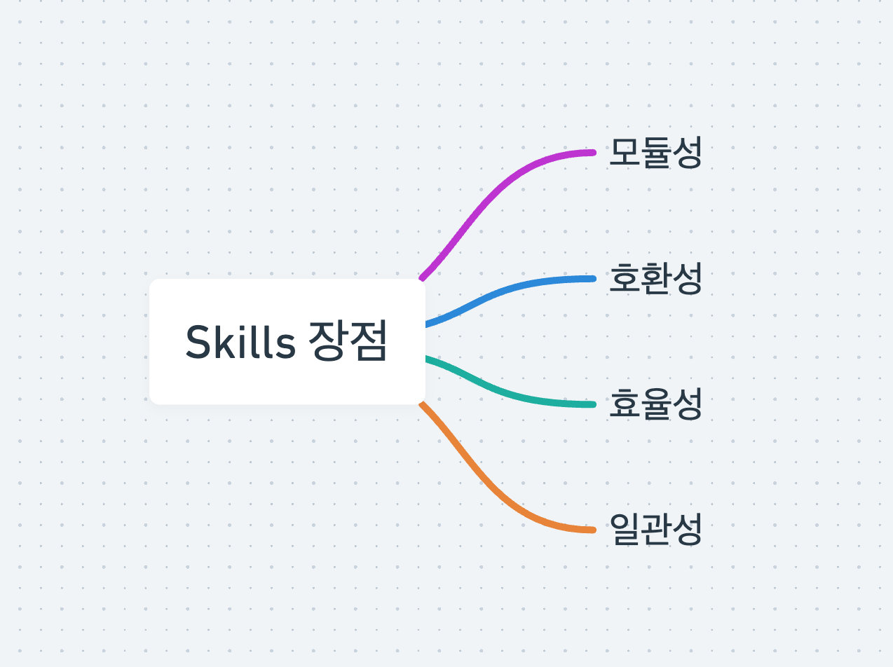
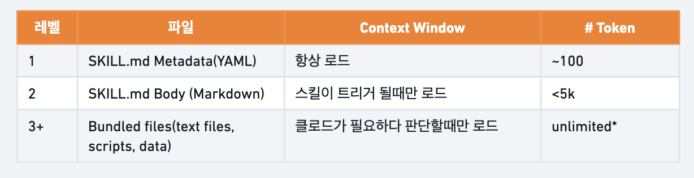
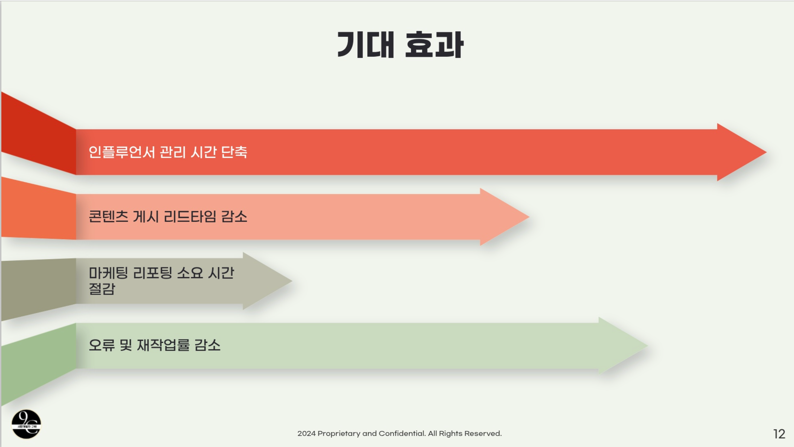
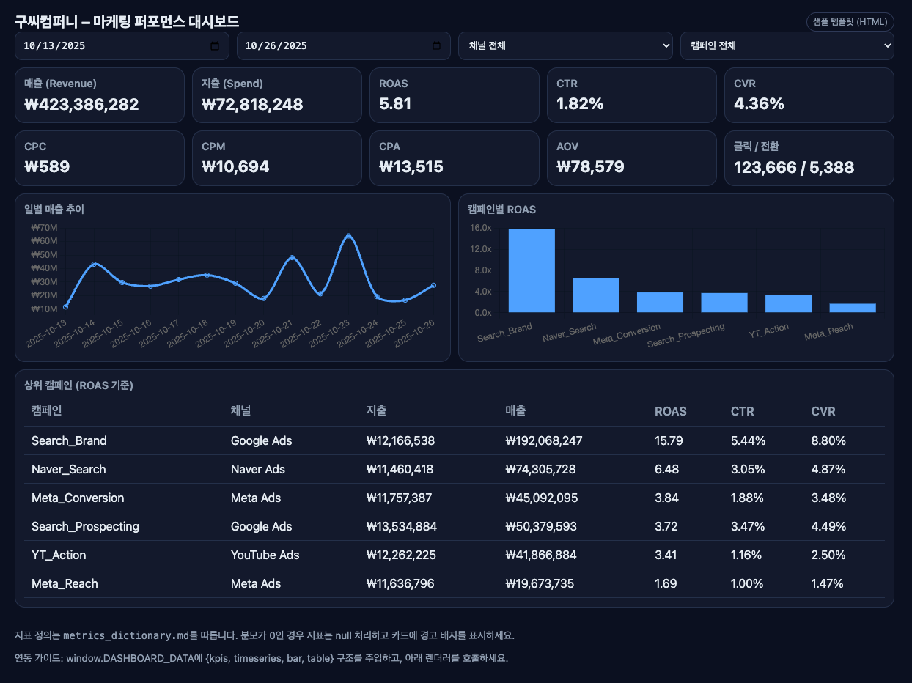
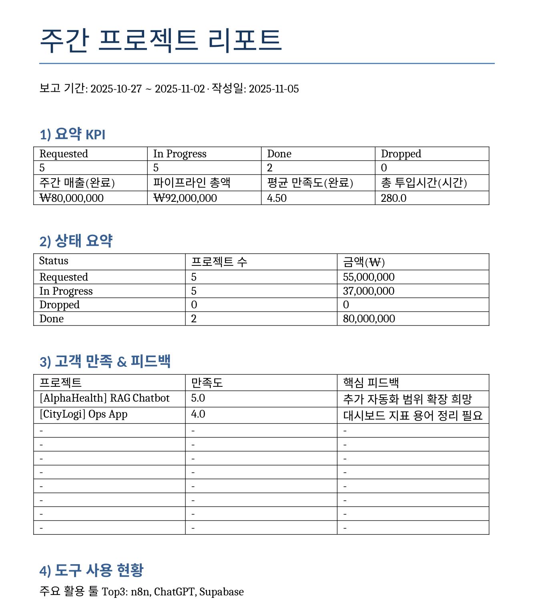

# Claude Skills 완벽 가이드: Skills로 반복 업무 자동화하기


Claude Skills를 활용하여 브랜드 일관성 있는 제안서 PPT, 데이터 대시보드, 주간 리포트를 자동으로 생성하는 가이드입니다.

## 목차

- [Claude Skills란?](#claude-skills란)
- [Skills의 핵심 장점](#skills의-핵심-장점)
- [Skills 기본 설정](#skills-기본-설정)
- [실전 사례 1: 브랜드 가이드 맞춘 제안서 PPT](#실전-사례-1-브랜드-가이드-맞춘-제안서-ppt)
- [실전 사례 2: 엑셀 → HTML 대시보드 자동 생성](#실전-사례-2-엑셀--html-대시보드-자동-생성)
- [실전 사례 3: Notion MCP + Skills로 주간 리포트 자동화](#실전-사례-3-notion-mcp--skills로-주간-리포트-자동화)
- [Skills 고도화 전략](#skills-고도화-전략)

---

## Claude Skills란?

Claude Skills는 **AI가 특정 업무를 수행할 때 따라야 하는 작업 매뉴얼**입니다. 지시사항, 스크립트, 참고 자료를 담은 폴더로, Claude가 이를 불러와 일관된 퀄리티의 결과물을 생성합니다.

### Skills vs 프롬프트

| 구분 | 일반 프롬프트 | Skills |
|------|----------|--------|
| 재사용성 | 매번 작성 필요 | 한 번 생성 후 반복 사용 |
| 일관성 | 변동 가능 | 높은 일관성 유지 |
| 복잡도 처리 | 긴 프롬프트 필요 | 모듈화된 구조 |
| 팀 공유 | 어려움 | 쉬운 공유 가능 |
| 호환성 | Claude 앱 내 | Claude 앱/Claude Code/API 모두 사용 |

### Skills의 작동 방식

신입사원에게 업무를 맡기는 것과 유사합니다:

**일반 프롬프트 방식:**
- "A사에게 보낼 제안서를 만들어줘" (구두 지시만)

**Skills 활용 방식:**
- "A사에게 보낼 제안서를 만들어줘" + 브랜드 가이드라인 문서 + 제안서 템플릿 제공

한 번 Skills를 만들어두면, 그 다음부터는 간단한 요청만으로 동일한 프로세스를 따라 일관된 결과물을 생성합니다.

---

## Skills의 핵심 장점



### 1. 모듈성 (Modularity)
업무 프로세스를 재사용 가능한 모듈로 만들어 언제든지 불러와 사용하고, 팀원들과 공유할 수 있습니다. 여러 Skills를 조합하여 복잡한 워크플로우 구성도 가능합니다.

### 2. 호환성 (Compatibility)
- Claude Desktop 앱
- Claude Code (CLI 도구)
- Claude API

모든 환경에서 동일한 Skills를 활용할 수 있습니다.

### 3. 효율성 (Efficiency)



**3단계 레이어 시스템:**
1. Skills 설명값만 로드 (필요 여부 판단)
2. 필요 시 기본 사용법 읽기
3. 필요에 따라 별도 파일 접근

불필요한 컨텍스트 소비 없이 효율적으로 작동합니다.

### 4. 일관성 (Consistency)
같은 Skills를 사용하면 누가 언제 요청하든 동일한 퀄리티의 결과물을 생성합니다. AI의 변수를 최소화하여 예측 가능한 결과를 보장합니다.

---

## Skills 기본 설정

### 1. Skills 기능 활성화

1. Claude Desktop 앱 실행
2. Settings(설정) → Capabilities로 이동
3. Skills 탭에서 원하는 Skills 활성화

### 2. skill-creator 설치

skill-creator는 새로운 Skills를 생성하거나 기존 Skills를 수정할 때 도움을 주는 메타 스킬입니다.

**설치 방법:**

1. [Anthropic Skills GitHub 저장소](https://github.com/anthropics/skills) 접속
2. 'Code' 버튼 → 'Download ZIP' 선택
3. 다운로드한 ZIP 파일 압축 해제
4. `skill-creator` 폴더만 별도로 ZIP 파일로 재압축
5. Claude Settings → Skills → 'Upload skill' 버튼 클릭
6. 압축한 skill-creator.zip 파일 업로드
7. 활성화 토글 켜기

### 3. General Settings 설정

Skills를 자동으로 활용하도록 설정:

Settings → General → Custom instructions에 다음 추가:

```
If relevant Skills are available, use them to produce the answer. Whenever you use any, include a "Used Skills:" line.
```

이 설정으로 Claude는 관련 Skills가 있을 때 자동으로 사용하며, 어떤 Skills를 사용했는지 명시합니다.

---

## 실전 사례 1: 브랜드 가이드 맞춘 제안서 PPT



### 활용 시나리오

세일즈 담당자, 개인사업자, 마케터가 제안서나 소개서 자료를 자주 제작해야 하는 경우 브랜드 일관성을 유지하면서도 빠르게 PPT를 생성할 수 있습니다.

### 사전 준비사항

1. **브랜드 가이드라인 문서** (`brand_guideline.md`)
   - 브랜드 컬러 (HEX 코드)
   - 타이포그래피 (폰트 규칙)
   - 스페이싱 및 레이아웃 규칙
   - 로고 사용 가이드
   - 톤앤매너

2. **참고용 PPT 샘플** (`ppt-ex-slide.pptx`)
   - 표지 레이아웃
   - 섹션 구분 슬라이드
   - 텍스트+이미지 조합 예시
   - 표/차트 스타일

### Skills 생성 프롬프트

skill-creator를 활용하여 커스텀 Skills 생성(프롬프트 예시):

```
Use the skill-creator skill to modify the existing brand-guidelines skill into a new skill named 9c-brand-guideline.
All user-facing outputs (texts, slide copy, file names, short summaries) must be in Korean by default.

1) Skill purpose
Create a reusable skill that produces brand-consistent PPTX decks (proposal/sponsor/sales/internal) with predictable sections, tone control, and strict visual consistency.

2) References (attached files) & how to use them

9c_brand_guideline.md: Primary source. Extract brand tokens (colors HEX, typography, spacing, logo usage, iconography, image treatment, voice & tone). If any conflict arises, prefer this file.

9c-ppt-ex-slide.pptx: Stylistic guide. Inspect representative layouts (cover, section divider, text+image, table, chart), grid/margins, header/footer, micro-styles. Mirror patterns and layouts as style constraints only; do not copy content text.

3) Triggers
Activate this skill whenever the user requests the creation or revision of a slide deck

4) Process

Load references and extract brand tokens from 9c_brand_guideline.md; collect layout style from 9c-ppt-ex-slide.pptx.

Plan slides: default set = 표지 / 목차 / 문제정의 / 인사이트 / 솔루션 / 성과지표 / 사례 / 제안조건(가격/패키지) / 일정 / FAQ / 마무리(문의). Allow user overrides (add/remove/reorder, slide count, audience).

Enforce brand rules: color mapping, typography (title/subtitle/body), grid & spacing, components (cards/badges/callouts), consistent tables/charts (header style, borders, legends, labels). If requested fonts aren't available, pick the closest safe fallback and note it in the summary.

Generate Korean copy per slide with concise bullets (3–4) and benefit-led headings. If data is missing, insert structured placeholders.

Build a 16:9 PPTX with consistent alignment, spacing, and accessibility alt-text stubs (Korean).

Quality pass: ensure no orphan bullets, adequate color contrast, consistent slide titling.

Return artifacts: the .pptx file and a short Korean summary (≤ 100 words) describing included sections, palette/typography actually used (and any fallbacks), and suggested next edits.

5) Output format

Primary: .pptx (16:9)

Secondary: short Korean summary text (inline, not a separate file)

6) Example user prompts (that should trigger this skill)

"우리 채널 새 스폰서 제안서 12장으로 만들어줘. 타깃은 SaaS 마케터, 성공사례 2장과 예상 성과표 1장을 포함해."

"내부 세일즈 킥오프용 8장 덱 만들어줘. 톤은 격식형, 가격표 대신 로드맵 타임라인을 넣어줘."

"방금 만든 덱에서 FAQ와 CTA 슬라이드 2장을 추가하고, 표 헤더는 더 진한 회색으로 바꿔줘."
```

### 실제 사용 예시

Skills 생성 후 간단한 요청으로 PPT 제작:

```
아래 클라이언트를 위한 한국어 PPTX(8장, 16:9)를 만들어 주세요. 브랜드 규칙을 자동으로 적용하고, 완성된 PPTX 파일을 반환해 주세요.

Client

회사: KBeauty Mall (D2C 화장품 이커머스)

프로젝트: n8n + Notion + Google Sheets + Slack을 활용한 AI 자동화 시스템 구축

목표: 수작업 운영 시간 ≥40% 절감, 근무시간 기준 최초 응답시간 ≤2분, 일일 KPI 리포트 발송

타깃: 내부 의사결정자(CEO / 운영 / 마케팅), 비기술 이해관계자

페인 포인트: 스프레드시트 기반 수작업 주문 처리로 인한 지연·오류, CS 인박스 적체 및 비일관적 분류, 단일 진실 소스 부재로 인한 마케팅 리포팅 분절, 재고/반품 미동기화로 인한 품절·과판매

핵심 KPI: 평균 처리시간(TAT), 자동화 커버리지(%), 주간 절감시간(시간), 1차 해결률, 오류율
```

Claude가 브랜드 가이드라인에 따라 컬러, 폰트, 레이아웃을 적용한 PPT를 자동 생성합니다.

### Skills 고도화 프로세스 (PPT 예시)

초기 결과물에서 개선이 필요한 경우:

**1단계: 문제 식별**
```
방금 만든 PPT를 확인했는데, 레퍼런스 슬라이드 대비 레이아웃 반영이 부족해. 
특히 텍스트+이미지 조합 슬라이드와 차트 슬라이드의 레이아웃을 
9c-ppt-ex-slide.pptx 스타일에 더 가깝게 수정해줘.
```

**2단계: Skills 수정 요청**
```
9c-brand-guideline 스킬을 업데이트해줘. 

수정 사항 예시:
1. 9c-ppt-ex-slide.pptx의 레이아웃 패턴을 더 엄격하게 따르도록 설정
2. 텍스트+이미지 슬라이드: 이미지는 항상 우측 40%, 텍스트는 좌측 55%
3. 차트 슬라이드: 차트 하단에 3줄 인사이트 박스 필수 포함
4. 표 슬라이드: 헤더는 브랜드 Primary 컬러, 줄 간격 1.5배
```

**3단계: Skills 재업로드**
- 수정된 Skills ZIP 파일 다운로드
- Settings → Skills → 스킬 재업로드
- 'Replace' 선택 → 새 ZIP 파일로 대체

**4단계: 재테스트**

```
아래 클라이언트를 위한 한국어 PPTX(8장, 16:9)를 만들어 주세요. 브랜드 규칙을 자동으로 적용하고, 완성된 PPTX 파일을 반환해 줘. 특히 레이아웃 규칙을 엄격하게 지켜서 작성해줘.

Client

회사: KBeauty Mall (D2C 화장품 이커머스)

프로젝트: n8n + Notion + Google Sheets + Slack을 활용한 AI 자동화 시스템 구축

목표: 수작업 운영 시간 ≥40% 절감, 근무시간 기준 최초 응답시간 ≤2분, 일일 KPI 리포트 발송

타깃: 내부 의사결정자(CEO / 운영 / 마케팅), 비기술 이해관계자

페인 포인트: 스프레드시트 기반 수작업 주문 처리로 인한 지연·오류, CS 인박스 적체 및 비일관적 분류, 단일 진실 소스 부재로 인한 마케팅 리포팅 분절, 재고/반품 미동기화로 인한 품절·과판매

핵심 KPI: 평균 처리시간(TAT), 자동화 커버리지(%), 주간 절감시간(시간), 1차 해결률, 오류율
```

**5단계: 반복 개선**
- 결과물 확인 → 추가 수정 진행 → Skills 업데이트 → 재테스트
- 3~5회 반복으로 원하는 수준의 일관성 확보

---

## 실전 사례 2: 엑셀 → HTML 대시보드 자동 생성



### 활용 시나리오

중소기업이나 에이전시에서 주간/월간 매출 리포트, 캠페인 성과 리포트를 정기적으로 제작하는 경우 엑셀 데이터만 업로드하면 시각화된 대시보드를 자동 생성합니다.

### 사전 준비사항

1. **데이터 샘플** (`marketing_data.xlsx`)
   - 필수 컬럼: date, channel, campaign, spend, impressions, clicks, conversions, revenue
   - 실제 활용 시에는 동일한 스키마의 다른 데이터 사용

2. **지표 정의 문서** (`metrics_dictionary.md`)
   ```markdown
   # 마케팅 KPI 정의
   
   ## 기본 지표
   - **매출(Revenue)**: 전환으로 발생한 총 수익
   - **지출(Spend)**: 광고 캠페인에 투입된 총 비용
   - **노출(Impressions)**: 광고가 표시된 총 횟수
   - **클릭(Clicks)**: 광고를 클릭한 총 횟수
   - **전환(Conversions)**: 구매/가입 등 목표 달성 횟수
   
   ## 파생 지표 및 계산 방식
   
   ### ROAS (Return on Ad Spend)
   - **정의**: 광고 지출 대비 수익률
   - **계산식**: (Revenue / Spend)
   - **표기**: 소수점 2자리, 예: 3.45
   - **Zero Division**: Spend = 0이면 null 반환
   
   ### CTR (Click Through Rate)
   - **정의**: 클릭률
   - **계산식**: (Clicks / Impressions) × 100
   - **표기**: 퍼센트, 소수점 2자리, 예: 2.35%
   - **Zero Division**: Impressions = 0이면 null 반환
   
   ### CVR (Conversion Rate)
   - **정의**: 전환율
   - **계산식**: (Conversions / Clicks) × 100
   - **표기**: 퍼센트, 소수점 2자리, 예: 4.12%
   - **Zero Division**: Clicks = 0이면 null 반환
   
   ### CPC (Cost Per Click)
   - **정의**: 클릭당 비용
   - **계산식**: Spend / Clicks
   - **표기**: ₩ 표시, 소수점 0자리, 예: ₩1,250
   
   ### CPM (Cost Per Mille)
   - **정의**: 1000회 노출당 비용
   - **계산식**: (Spend / Impressions) × 1000
   - **표기**: ₩ 표시, 소수점 0자리, 예: ₩15,000
   
   ### CPA (Cost Per Acquisition)
   - **정의**: 전환당 비용
   - **계산식**: Spend / Conversions
   - **표기**: ₩ 표시, 소수점 0자리, 예: ₩35,000
   
   ### AOV (Average Order Value)
   - **정의**: 평균 주문 금액
   - **계산식**: Revenue / Conversions
   - **표기**: ₩ 표시, 소수점 0자리, 예: ₩125,000
   
   ## 집계 규칙
   
   ### 가중 평균 (Weighted Average)
   CTR과 CVR은 단순 평균이 아닌 가중 평균 사용:
   - **CTR 집계**: Σ(Clicks) / Σ(Impressions) × 100
   - **CVR 집계**: Σ(Conversions) / Σ(Clicks) × 100
   
   ### 데이터 정제
   - **음수 값**: 0으로 클리핑하고 로그에 기록
   - **결측치**: null로 처리, 계산 시 제외
   - **Zero Division**: 분모가 0일 경우 null 반환
   
   ## 표기 규칙
   - **금액**: 3자리 콤마 + ₩ 기호 (예: ₩1,250,000)
   - **비율**: 퍼센트 기호 + 소수점 2자리 (예: 3.45%)
   - **배수**: 소수점 2자리 (예: 4.32)
   - **날짜**: YYYY-MM-DD 형식 (예: 2025-01-15)
   ```

3. **HTML 대시보드 템플릿** (`dashboard_template_9c.html`)
   - 미리 디자인된 대시보드 쉘
   - 데이터 플레이스홀더만 채워 넣으면 완성

### Skills 생성 프롬프트 (예시)

```
Use the skill-creator skill to create a new skill named 9c-excel-to-html-dashboard. All user-facing outputs (texts, logs, short summary) must be in Korean by default.

1) Skill purpose
Build a reusable skill that takes an uploaded Excel performance file, computes standard marketing KPIs, and produces a ready-to-open HTML dashboard using a provided dashboard file as a template. The output should be deterministic, visually consistent, and robust to common data issues (zero divisors, missing values).

2) References (and how to use each)

a) marketing_data.xlsx
- Primary data source in *.xlsx format. Required columns: date, channel, campaign, spend, impressions, clicks, conversions, revenue.
- If multiple sheets exist, prefer data; otherwise use the first sheet. Coerce date to ISO YYYY-MM-DD.
- This is a sample dataset, and different *.xlsx data would be presented each time but with same schema.

b) metrics_dictionary.md
- Treat as the single source of truth for metric definitions and calculation methods. Follow its rules on weighting, formatting (KR locale, ₩), and zero-division handling.

c) dashboard_template_9c.html
- This is a prebuilt dashboard shell. Keep its layout and styling exactly as-is.
- Your job is to fill the template with the computed numbers, trends, and top lists so the file can be opened immediately in a browser.

3) When should this skill be triggered?
Trigger this skill whenever a user wants to turn a performance Excel file into a shareable dashboard, optionally with filters for period/channel/campaign, and with KPI summary + trend chart + top campaigns on one screen.

4) Process

a) Load & validate
- Check all required columns. If any are missing, return a short Korean hint describing exactly which columns are required. Coerce date to YYYY-MM-DD.

b) Clean & guard
- Negative values → clip at 0 with a note; division by zero → set derived metric to null (numeric null).

c) Aggregate metrics (list of metrics to prepare)
- Prepare totals: revenue, spend, impressions, clicks, conversions.
- Prepare derived KPIs: ROAS, CTR, CVR, CPC, CPM, CPA, AOV.
- For all metric definitions and calculation methods, reference metrics_dictionary.md

d) Prepare data for the dashboard (data shapes to populate)
- kpis: one object with revenue, spend, impressions, clicks, conversions, ROAS, CTR, CVR, CPC, CPM, CPA, AOV (raw numeric values; formatting is handled by the template).
- timeseries: list of { date, revenue } by day (ascending).
- bar: list of { campaign, channel, roas } aggregated by campaign (descending by ROAS; up to Top 10).
- table: list of { campaign, channel, spend, revenue, roas, ctr, cvr } aggregated by campaign (CTR/CVR weighting as per metrics_dictionary.md).
- filters: { channels: [...], campaigns: [...] } from unique values.
- dateRange: { start, end } from min/max dates.
- For any metric-specific logic or weighting, reference metrics_dictionary.md

e) Populate the dashboard file
- Open dashboard_template_9c.html and fill its data placeholders with the items prepared above, so that when the user opens the file, the numbers, charts, and tables are already filled in.
- Keep all visuals intact; do not alter colors, fonts, layout, or chart options.

f) Return artifacts
- The finished HTML dashboard (save as dashboard_9c_{start}_{end}.html).
- A short Korean summary (≤ 200 words) including the 기간, ROAS 기준 Top 3 캠페인, 처리한 이상치/누락, 다음 분석 제안.

5) Output format
- Primary: .html (ready-to-open, fully populated dashboard)
- Secondary: Korean summary (inline text response is fine)

6) Example user prompts (that should trigger this skill)
- "엑셀 업로드했어. 최근 14일 기준으로 대시보드 만들어줘. ROAS 상위 Top 10만 막대 차트에 보여줘."
- "지난 7일로 필터해서 대시보드를 만들어줘. CTR/CVR은 가중 평균으로 계산하고, 금액은 ₩ 단위로 표시해."
- "캠페인 'Search_Prospecting'만 포함해서 HTML 대시보드를 만들어줘. 상단에 핵심 인사이트 3가지(한국어)도 넣어줘."

7) Non-functional & formatting requirements
- Deterministic: same inputs ⇒ same outputs.
- Keep payload values numeric; let the dashboard handle %/₩ formatting.
- Never modify the template's visuals; only populate its data area.
- If anything is ambiguous, follow metrics_dictionary.md.
```

### 실제 사용 예시

```
엑셀 업로드했어. 해당 데이터 기반으로 대시보드 만들어줘.
```

Claude가 자동으로:
1. 엑셀 파일 읽기 및 검증
2. metrics_dictionary.md 기준으로 KPI 계산
3. HTML 템플릿에 데이터 삽입
4. 브라우저에서 바로 열 수 있는 대시보드 생성

### Skills의 핵심: 코드 기반 계산의 안정성

이 Skills에서 주목할 점은 **지표 계산을 코드로 처리**한다는 것입니다.

**일반 프롬프트 방식의 문제:**
- LLM이 토큰으로 예측하며 계산 → 부정확할 수 있음
- 매번 계산 방식이 미묘하게 달라질 수 있음

**Skills + 코드 방식의 장점:**
- Python 코드로 정확한 계산 수행
- metrics_dictionary.md에 정의된 방식 엄격히 준수
- Zero division, 음수 값 등 예외 상황 체계적 처리
- 환각(hallucination) 최소화

---

## 실전 사례 3: Notion MCP + Skills로 주간 리포트 자동화



### 활용 시나리오

스타트업 팀리드나 PM이 매주 프로젝트 현황 리포트를 작성해야 하는 경우 Notion 데이터베이스에서 자동으로 데이터를 가져와 Word 리포트를 생성합니다.

### 사전 준비사항

1. **Notion MCP 설정**
   - Notion MCP 연결 (Claude Desktop)
   - "projects" 데이터베이스 접근 권한

2. **Notion DB 스키마** (projects 데이터베이스)
   ```
   - project_id: 프로젝트 고유 ID
   - title: 프로젝트 제목
   - client: 클라이언트명
   - client_segment: Enterprise/SMB 등
   - industry: 산업 분류
   - lead_source: 리드 출처
   - status: Requested / In Progress / Done / Dropped
   - new_vs_renewal: 신규/갱신 구분
   - revenue_krw: 매출 (원화)
   - assigned_pm: 담당 PM
   - tool_stack: 사용 도구 (파이프 구분)
   - summary: 프로젝트 요약
   - deliverables: 산출물
   - request_date: 요청일
   - start_date: 시작일
   - due_date: 마감일
   - actual_end_date: 실제 완료일
   - hours_spent_actual: 투입 시간
   - satisfaction_score: 만족도 점수 (1-5)
   - feedback_text: 피드백
   ```

3. **Word 템플릿** (`weekly_report_template_9c.docx`)
   ```
   주간 프로젝트 현황 리포트
   
   📅 보고 기간: {{week_start}} ~ {{week_end}}
   📆 작성일: {{today}}
   
   ## 📊 핵심 KPI
   
   | 구분 | 수치 |
   |------|------|
   | 신규 요청 | {{kpi_new_requests}}건 |
   | 진행 중 | {{kpi_in_progress}}건 |
   | 완료 | {{kpi_done}}건 |
   | 중단 | {{kpi_dropped}}건 |
   | 주간 완료 매출 | {{kpi_revenue_done}} |
   | 파이프라인 총액 | {{kpi_pipeline_total}} |
   | 평균 만족도 | {{kpi_satisfaction_avg}}/5.0 |
   | 투입 시간 | {{kpi_hours_spent_total}}시간 |
   
   ## 📈 상태별 요약
   
   ### Requested ({{count_requested}}건, {{sum_requested}})
   ### In Progress ({{count_inprogress}}건, {{sum_inprogress}})
   ### Dropped ({{count_dropped}}건, {{sum_dropped}})
   ### Done ({{count_done}}건, {{sum_done}})
   
   ## 💬 고객 피드백
   
   | 프로젝트 | 만족도 | 피드백 |
   |----------|--------|--------|
   | {{project_title_1}} | {{project_satisfaction_1}} | {{project_feedback_1}} |
   | {{project_title_2}} | {{project_satisfaction_2}} | {{project_feedback_2}} |
   ...
   
   ## 🛠️ 주요 도구
   {{top_tools}}
   
   ## 💡 인사이트
   1. {{insight_1}}
   2. {{insight_2}}
   3. {{insight_3}}
   
   ## 📝 다음 주 계획
   1. {{next_week_plan_1}}
   2. {{next_week_plan_2}}
   3. {{next_week_plan_3}}
   ```

### Skills 생성 프롬프트

```
Use the skill-creator skill to create a new skill named 9c-notion-weekly-report.
All user-facing outputs (texts, logs, short summary) must be in Korean by default.

1) Skill purpose
Fetch project records from the Notion database "projects" via Notion MCP (remote, read-only), perform light analysis with custom code, and produce a ready-to-share weekly report by filling placeholders in the attached Word template. Behavior must be deterministic and resilient to partial fields.

2) Tooling constraints & reference

MCP tools:
- Enable Notion MCP (remote) and read the Notion database named "projects."
- Do not use other MCP tools or external network calls. All analysis runs locally inside the skill.

Reference (attachment):
- weekly_report_template_9c.docx — Use this as the reporting template; fill its placeholders and return the completed .docx.

3) When should this skill be triggered?
Trigger this skill whenever a user wants to turn the Notion "projects" DB into a weekly report using the provided Word template—e.g., summarize weekly status counts, revenue, customer satisfaction, tool usage, and produce concise insights and next-week plans.

4) Process (SOP, lettered and deterministic)

a) Connect & fetch (Notion MCP only)
- Discover and connect to the Notion database named "projects."
- Load the columns that actually exist at runtime. 
- The schema to expect: project_id, title, client, client_segment, industry, lead_source, status, new_vs_renewal, revenue_krw, assigned_pm, tool_stack, summary, deliverables, request_date, start_date, due_date, actual_end_date, hours_spent_actual, satisfaction_score, feedback_text
- If a field is missing, proceed gracefully and note it in the summary.

b) Filter period
- Respect user-provided week_start and week_end (inclusive, KST).
- If not provided, default to the most recent Monday–Sunday window before "today".

c) Clean & normalize
- Coerce date fields to YYYY-MM-DD.
- Convert numerics (revenue_krw, hours_spent_actual, satisfaction_score) to numbers (null on failure).
- Clip negative amounts to 0 and record the correction in the summary.

d) Aggregate & analyze (metrics to prepare)
- Status counts (weekly): Done, In Progress, Dropped, Requested.
- Revenue KPIs:
  - kpi_revenue_done: sum of revenue_krw where status=Done and actual_end_date falls in the week.
  - kpi_pipeline_total: sum of revenue_krw where status ∈ {Requested,In Progress} and dates overlap the week (if no dates, include currently active items).
- Satisfaction & hours:
  - kpi_satisfaction_avg: average of satisfaction_score for Done in the week (ignore nulls).
  - kpi_hours_spent_total: total of hours_spent_actual among week-relevant rows (ignore nulls).
- Tool usage:
  - top_tools: Top-3 tool names by frequency parsed from tool_stack (pipe/comma-separated).
- Feedback table (up to 10): from Done and In Progress rows that have satisfaction_score or feedback_text; output {title, satisfaction, feedback}.

e) Map to template placeholders (fill weekly_report_template_9c.docx; do not alter layout/styles)
- Header: {{week_start}}, {{week_end}}, {{today}}
- KPI (counts + aggregates): {{kpi_new_requests}}, {{kpi_in_progress}}, {{kpi_done}}, {{kpi_dropped}}, {{kpi_revenue_done}}, {{kpi_pipeline_total}}, {{kpi_satisfaction_avg}}, {{kpi_hours_spent_total}}
- Status summary: counts: {{count_requested}}, {{count_inprogress}}, {{count_dropped}}, {{count_done}}
  sums: {{sum_requested}}, {{sum_inprogress}}, {{sum_dropped}}, {{sum_done}}
- Feedback rows (repeat up to 10): {{project_title_*}}, {{project_satisfaction_*}}, {{project_feedback_*}}
- Tooling: {{top_tools}}
- Insights & plans: {{insight_1}}, {{insight_2}}, {{insight_3}}, {{next_week_plan_1}}, {{next_week_plan_2}}, {{next_week_plan_3}}

f) Produce output
- Return a filled .docx named weekly_report_{week_start}_{week_end}.docx.
- Also return a short Korean summary (≤ 100 words) including 기간, 상태별 수치, 주간 매출, 만족도 평균, 도구 하이라이트, 다음 주 제안.

5) Output format
- Primary: .docx (completed weekly report using the provided template)
- Secondary: Korean summary (inline text response is fine)

6) Example user prompts (that should trigger this skill)
- "이번 주 월~일까지 기준으로 Notion 'projects'를 읽어 주간 리포트 .docx 만들어줘. 상태는 Done / In Progress / Dropped / Requested만 사용해."
- "지난 2주로 합산하여 리포트를 만들어줘. tool_stack 기준 상위 3개 도구도 요약해."
- "In Progress와 Requested만 대상으로, pipeline 총액과 다음 주 우선순위 3개를 제안해. Done의 평균 만족도도 포함해."

7) Non-functional & data handling
- Deterministic: same inputs ⇒ same outputs.
- Privacy: if any PII appears in feedback_text, replace with "(익명화)".
- No external calls except Notion MCP (remote) to the "projects" DB.
- If expected fields are missing, proceed with what is available and note assumptions in the summary.

Use the Notion MCP to read the "projects" database and the attached weekly_report_template_9c.docx to produce the completed weekly report.
```

### 실제 사용 예시

```
start_date와 due_date 안에 2025년 10/27~11/2일이 포함되는 건 기준으로 
Notion 'projects'를 읽어 주간 리포트 .docx 만들어줘.
```

Claude가 자동으로:
1. Notion MCP를 통해 projects DB 연결
2. 지정된 기간의 프로젝트 데이터 필터링
3. 상태별 집계, 매출 계산, 만족도 분석
4. Word 템플릿의 모든 플레이스홀더 자동 채우기
5. 완성된 주간 리포트 Word 문서 생성

### MCP + Skills 조합의 강력함

**MCP (Model Context Protocol):**
- 외부 데이터 소스 접근 (Notion, Google Drive, Slack 등)
- 실시간 데이터 가져오기

**Skills:**
- 데이터 처리 및 분석 방법 정의
- 일관된 리포트 형식 유지

두 기술을 조합하면:
- 실시간 데이터를 가져와서
- 정해진 방식으로 분석하고
- 일관된 형식의 리포트를 자동 생성

---

## Skills 고도화 전략

### 1. 반복적 개선 사이클

Skills는 한 번에 완벽하게 만들어지지 않습니다. 다음 사이클을 반복합니다:

```
생성 → 테스트 → 문제 식별 → 수정 → 재업로드 → 재테스트
```

**구체적 프로세스:**

**Phase 1: 초기 생성 및 테스트**
```
1. skill-creator로 Skills 생성
2. 실제 데이터로 3~5회 테스트
3. 결과물 문제점 리스트업
```

**Phase 2: 문제 분석 및 수정**
```
4. 문제를 구체적으로 설명
   예: "표 헤더 색상이 매번 달라져"
        "금액에 콤마가 누락되는 경우가 있어"
        "슬라이드 레이아웃이 레퍼런스와 달라"
        
5. skill-creator에게 수정 요청:
   "9c-brand-guideline 스킬을 업데이트해줘.
   
   수정사항:
   - 표 헤더는 항상 #2C3E50 색상 고정
   - 모든 금액은 3자리 콤마 필수, 형식: ₩1,234,567
   - 슬라이드 레이아웃은 9c-ppt-ex-slide.pptx를 더 엄격히 따르도록
   "
```

**Phase 3: 재업로드 및 검증**
```
6. 수정된 Skills ZIP 파일 다운로드
7. Settings → Skills → Upload
8. 'Replace' 선택 → 새 ZIP 업로드
9. 동일한 테스트 케이스로 재실행
10. 개선 여부 확인
```

**Phase 4: 최종 안정화**
```
11. 3~5회 반복 후 안정적인 버전 확정
12. 팀 공유 및 문서화
```


## 참고 자료

- [Claude Skills 공식 문서](https://docs.claude.com/en/docs/agents-and-tools/agent-skills/overview#where-skills-work)
- [Claude skills GitHub](https://github.com/anthropics/skills)
- [Claude Desktop 다운로드](https://www.claude.com/download)

---

"생산성은 규모가 아닌 시스템에서 나옵니다." 이 가이드를 통해 Claude Skills를 활용한 업무 자동화 시스템을 구축하시길 바랍니다.
