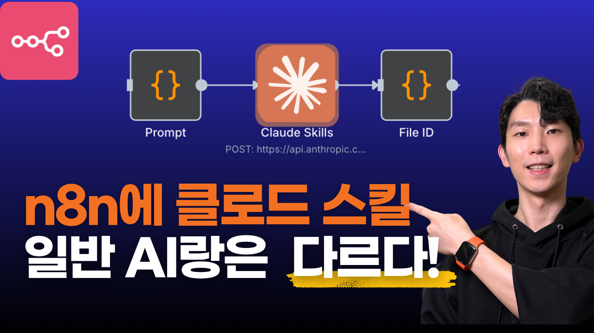
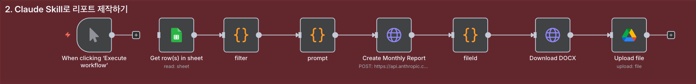
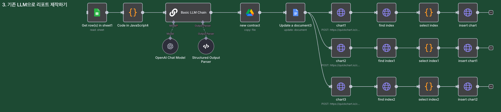

# n8n에서 Claude Skills API 활용하기: 복잡한 리포트 자동화 완벽 가이드





Claude에서 새롭게 출시한 Skills 기능을 n8n 워크플로우에서 활용하여 복잡한 데이터 분석 리포트를 자동으로 생성하는 방법을 알아봅니다. 일반 AI 노드 방식과의 비교를 통해 Claude Skills의 진짜 가치를 확인해보세요.

## 목차

- [Claude Skills란?](#claude-skills란)
- [왜 n8n에서 Claude Skills를 사용해야 하는가?](#왜-n8n에서-claude-skills를-사용해야-하는가)
- [API 스킬 설정하기](#api-스킬-설정하기)
- [n8n에서 스킬 리스트 가져오기](#n8n에서-스킬-리스트-가져오기)
- [실습: YouTube 리포트 자동화 시스템 구축](#실습-youtube-리포트-자동화-시스템-구축)
  - [방식 1: Claude Skills API 워크플로우](#방식-1-claude-skills-api-워크플로우)
  - [방식 2: 일반 AI 노드 워크플로우](#방식-2-일반-ai-노드-워크플로우)
- [두 방식의 비교 분석](#두-방식의-비교-분석)
- [Claude Skills의 장점과 한계](#claude-skills의-장점과-한계)
- [결론](#결론)

## Claude Skills란?

Claude Skills는 특정 작업을 일관성 있게 수행하도록 도와주는 Anthropic의 새로운 기능입니다. 스킬은 폴더 형태로 프롬프트, 파일, 코드 스크립트를 묶어서 관리할 수 있으며, 이를 통해 특화된 작업을 효율적으로 수행할 수 있습니다.

### 스킬의 핵심 특징

- **일관성 있는 결과물**: 동일한 입력에 대해 일관된 형식의 출력 생성
- **복잡한 작업 자동화**: 데이터 분석, 차트 생성, 문서 작성 등을 하나의 스킬로 통합
- **API 지원**: Claude 앱뿐만 아니라 API를 통해서도 활용 가능
- **코드 실행 기능**: Python 등의 코드를 실행하여 복잡한 계산 및 시각화 수행

## 왜 n8n에서 Claude Skills를 사용해야 하는가?

### AI Agent 노드의 한계

n8n의 AI Agent 노드는 유연하게 다양한 작업을 처리할 수 있지만, 복잡한 리포트를 **동일한 포맷으로 매번 제작**해야 하는 경우 다음과 같은 한계가 있습니다:

- 프롬프트가 복잡할수록 원하는 포맷으로 작동하게 설정하기 어려움
- 결과물의 일관성을 보장하기 어려움
- 복잡한 계산과 차트 생성을 안정적으로 처리하기 어려움

### Claude Skills의 해결책

Claude Skills는 복잡한 워크플로우를 AI를 활용해 손쉽게 제작할 수 있게 해주는 새로운 방식입니다:

1. **간소화된 워크플로우**: 복잡한 작업을 하나의 스킬로 통합하여 노드 수 감소
2. **일관성 보장**: 스킬에 정의된 대로 항상 동일한 형식의 결과물 생성
3. **확장성**: 여러 스킬을 조합하여 더 복잡한 작업 처리 가능
4. **유지보수 용이**: 스킬 파일만 수정하면 전체 워크플로우 업데이트 가능

## API 스킬 설정하기

Claude Skills를 n8n에서 사용하려면 먼저 API 버전으로 스킬을 설정해야 합니다.

### 중요 사항

**Claude 앱과 API는 스킬을 별도로 관리합니다.** 앱에서 만든 스킬이 API에서 자동으로 사용 가능한 것은 아닙니다.

### 스킬 업로드 절차

1. [console.anthropic.com](https://console.anthropic.com)에 접속
2. **Skills** 탭으로 이동
3. 기본 제공 스킬 확인:
   - `docx` - 워드 문서 생성
   - `pptx` - 프레젠테이션 생성
   - `pdf` - PDF 생성
   - `xlsx` - 엑셀 생성

4. 커스텀 스킬 업로드:
   - **Upload Skill** 버튼 클릭
   - 스킬 파일 (`.zip/ .skill` 형식) 선택하여 업로드
   - 업로드 완료 후 **Skill ID** 복사

### 스킬 파일 구조 예시

YouTube 분석 리포트 생성 스킬의 경우:
- YouTube 영상 데이터 분석
- RAV, E_per_1k, SCR 등 파생 지표 계산
- 5개의 전문적인 차트 생성 (Python/matplotlib 활용)
- 브랜드 컬러가 적용된 DOCX 리포트 생성

## n8n에서 스킬 리스트 가져오기

본격적인 워크플로우 구축 전에 업로드한 스킬이 API에서 잘 작동하는지 테스트해봅니다.

### 워크플로우 구성

1. **Manual Trigger** 노드 추가

2. **HTTP Request** 노드 추가
   - **이름**: "Get Skills"
   - **Method**: `POST`
   - **URL**: `https://api.anthropic.com/v1/skills`
   - **Authentication**: Anthropic API 인증 추가

3. **Headers 설정**:
   ```
   anthropic-version: 2023-06-01
   anthropic-beta: skills-2025-10-02
   ```

**중요**: `anthropic-beta: skills-2025-10-02` 헤더는 스킬 실행 기능을 사용하기 위해 반드시 포함해야 합니다.

### API 문서 참고

자세한 설정 방법은 Claude API 문서를 참고하세요:
[https://docs.claude.com/en/api/skills/list-skills](https://docs.claude.com/en/api/skills/list-skills)

### 테스트 실행

워크플로우를 실행하면 업로드한 스킬 목록과 각 스킬의 `skill_id`가 반환됩니다. 이 `skill_id`를 사용하여 스킬을 실행할 수 있습니다.

## 실습: YouTube 리포트 자동화 시스템 구축

실제 사례를 통해 Claude Skills API 활용 방법을 알아봅니다. 동일한 작업을 두 가지 방식으로 구현하여 비교합니다.

### 시나리오 요구사항

YouTube 채널 데이터를 바탕으로 월간 성과 리포트를 자동 생성하는 시스템:

1. 구글 시트에서 YouTube 데이터 가져오기
2. 2025년 데이터만 필터링
3. 복잡한 파생 지표 계산 (RAV, E_per_1k, SCR 등)
4. 5개의 차트 생성 (Top RAV, Engagement, 구독 전환 추이, 태그 분석, 길이별 성과)
5. 이상치 탐지 (Robust Z-score)
6. 전문적인 DOCX 리포트 생성

## 방식 1: Claude Skills API 워크플로우



### 워크플로우 구조

**총 7개 노드로 구성:**

1. Manual Trigger
2. Google Sheets (데이터 수집)
3. Code - Filter 2025 Data
4. Code - Prepare API Request
5. HTTP Request - Create Monthly Report
6. Code - Extract File ID
7. HTTP Request - Download DOCX
8. Google Drive - Upload File

### 1단계: 데이터 수집

**Google Sheets 노드**:
- YouTube 영상 데이터가 저장된 구글 시트 연결
- 필요한 필드: video_id, published_date, title, duration, view_7d, like_7d, comment_7d, share_7d, subgain_7d, avgview_duration_7d 등

### 2단계: 데이터 필터링

**Code 노드** - "Filter 2025 Data":

```javascript
// n8n Code (JavaScript)

// 1) 시트에서 넘어온 rows를 records 배열로 정리
const records = items.map(item => item.json);

// 2) published_date 기준으로 2025년만 필터
function is2025(d) {
  if (!d) return false;
  const s = String(d);

  // "YYYY-MM-DD" 같이 앞 4자리가 연도인 케이스
  const y4 = s.slice(0, 4);
  if (/^\d{4}$/.test(y4)) {
    return y4 === '2025';
  }

  // 날짜 파싱 시도
  const dt = new Date(s);
  if (!isNaN(dt.getTime())) {
    return dt.getUTCFullYear() === 2025;
  }

  return false;
}

const filtered = records.filter(r => is2025(r.published_date));

// 3) description 앞 100글자만 남기기
const processed = filtered.map(r => {
  const desc = r.description || '';
  return {
    ...r,
    description: desc.slice(0, 100)   // <-- 여기에서 잘라줌
  };
});

// 4) 최종 아웃풋 형태
return [
  {
    json: {
      year: 2025,
      count: processed.length,
      records: processed
    }
  }
];
```

### 3단계: API Request Body 준비

**Code 노드** - "Prepare API Request":

이 단계에서는 duration을 초 단위로 변환하고 Claude Skills API 호출을 위한 Request Body를 준비합니다.

```javascript
// 이전 노드에서 데이터 가져오기
const inputData = $input.all()[0].json;
const records = inputData.records;

// duration을 초 단위로 변환하는 함수
function durationToSeconds(duration) {
  if (!duration) return 0;
  
  const parts = duration.split(':');
  if (parts.length === 3) {
    // HH:MM:SS 형식
    return parseInt(parts[0]) * 3600 + parseInt(parts[1]) * 60 + parseInt(parts[2]);
  } else if (parts.length === 2) {
    // MM:SS 형식
    return parseInt(parts[0]) * 60 + parseInt(parts[1]);
  }
  return 0;
}

// 데이터 정리 및 변환
const cleanedRecords = records.map(record => ({
  video_id: record.video_id,
  published_date: record.published_date,
  title: record.title,
  duration: durationToSeconds(record.duration), // 초 단위로 변환
  video_link: record.video_link,
  thumbnails: record.thumbnails,
  tags: record.tags,
  category_id: record.category_id,
  description: record.description,
  hasPaidProductPlacement: record.hasPaidProductPlacement === true || record.hasPaidProductPlacement === 'true',
  view_7d: record.view_7d || 0,
  comment_7d: record.comment_7d || 0,
  like_7d: record.like_7d || 0,
  share_7d: record.share_7d || 0,
  subgain_7d: record.subgain_7d || 0,
  avgview_duration_7d: record.avgview_duration_7d || 0,
  view_14d: record.view_14d || 0,
  comment_14d: record.comment_14d || 0,
  like_14d: record.like_14d || 0,
  share_14d: record.share_14d || 0,
  subgain_14d: record.subgain_14d || 0,
  avgview_duration_14d: record.avgview_duration_14d || 0
}));

// JSON 문자열로 변환 (보기 좋게 포맷팅)
const dataString = JSON.stringify(cleanedRecords, null, 2);

// API Request Body 생성
const requestBody = {
  model: "claude-haiku-4-5",
  max_tokens: 64000,
  system: "Your job is to analyze YouTube video data and create a professional monthly performance report in DOCX format. Use the youtube-analysis-report skill to generate comprehensive analysis with charts and insights. Create a well-formatted Korean document with proper headings, charts, statistics, and actionable insights.",
  container: {
    skills: [
      {
        type: "custom",
        skill_id: "skill_id_대체",
        version: "latest"
      }
    ]
  },
  messages: [
    {
      role: "user",
      content: `다음 YouTube 영상 데이터를 분석하여 ${inputData.year}년 10월 성과 리포트를 생성해주세요. 2025년 전체 데이터를 활용하되, 10월 성과를 별도 하이라이트해주세요.

총 ${inputData.count}개의 영상 데이터:

${dataString}

다음 작업을 수행해주세요:
1. RAV, E_per_1k, SCR 등 파생 지표 계산
2. 주요 차트 5개 생성 (Top RAV, Top E_per_1k, SCR 추이, 태그 분석, 길이별 성과)
3. 통계 분석 및 Robust Z-score 기반 이상치 탐지
4. 실행 가능한 액션 플랜 포함
5. 전문적인 DOCX 리포트 생성

모든 텍스트는 한국어로, 브랜드 컬러(#hexacode)를 사용하여 작성해주세요.`
    }
  ],
  tools: [
    {
      type: "code_execution_20250825",
      name: "code_execution"
    }
  ]
};

return { json: requestBody };
```

**핵심 포인트:**

- `container.skills[]`에 실행할 스킬의 `skill_id` 지정
- `tools`에 `code_execution` 추가: 스킬 내부에서 Python 코드 실행 가능 (복잡한 계산 및 차트 생성)
- `max_tokens`: 복잡한 리포트 생성을 위해 충분한 토큰 할당

### 4단계: Claude Skills API 호출

**HTTP Request 노드** - "Create Monthly Report":

- **Method**: `POST`
- **URL**: `https://api.anthropic.com/v1/messages`
- **Authentication**: Anthropic API 인증
- **Headers**:
  ```
  anthropic-version: 2023-06-01
  anthropic-beta: code-execution-2025-08-25,skills-2025-10-02
  ```
- **Body**: `={{$json}}` (이전 노드에서 준비한 Body)
- **Timeout**: `3600000` (1시간 = 3,600,000ms)

**Timeout 설정 이유**: 스킬 실행이 복잡한 데이터 분석, 차트 생성, 문서 작성을 포함하므로 처리 시간이 길어질 수 있습니다. 충분한 여유를 두어 타임아웃 방지.

### 5단계: 파일 ID 추출

**Code 노드** - "Extract File ID":

API 응답에서 생성된 DOCX 파일의 ID를 자동으로 찾아냅니다.

```javascript
// n8n Code node - Run Once for All Items
// 입력: 이전 HTTP Request(Claude Skills API) 응답 JSON
// 출력: { count, file_ids, latest, details[] }

const resp = items?.[0]?.json ?? {};
const hits = [];

function walk(node, path = '') {
  if (node == null) return;

  if (typeof node === 'string') {
    const m = node.match(/\bfile_[A-Za-z0-9]+\b/g);
    if (m) m.forEach(id => hits.push({ file_id: id, path, source: 'string' }));
    return;
  }

  if (Array.isArray(node)) {
    node.forEach((v, i) => walk(v, `${path}[${i}]`));
    return;
  }

  if (typeof node === 'object') {
    // 1) 표준 위치: {..., file_id: "file_xxx" }
    if (typeof node.file_id === 'string' && /^file_[A-Za-z0-9]/.test(node.file_id)) {
      hits.push({ file_id: node.file_id, path: `${path}.file_id`, source: 'field:file_id' });
    }
    // 2) Anthropic 파일 컨텐츠: { type: "file", id: "file_xxx" }
    if (node.type === 'file' && typeof node.id === 'string' && /^file_[A-Za-z0-9]/.test(node.id)) {
      hits.push({ file_id: node.id, path: `${path}.id`, source: 'type=file' });
    }
    // 하위 탐색
    for (const [k, v] of Object.entries(node)) {
      walk(v, path ? `${path}.${k}` : k);
    }
  }
}

walk(resp.content ?? resp);

// 중복 제거
const seen = new Set();
const details = [];
for (const h of hits) {
  if (!seen.has(h.file_id)) {
    seen.add(h.file_id);
    details.push(h);
  }
}

// 결과 반환
return [{
  json: {
    count: details.length,
    file_ids: details.map(d => d.file_id),
    latest: details.at(-1)?.file_id ?? null,
    details, // {file_id, path, source}
  },
}];
```

### 6단계: DOCX 다운로드

**HTTP Request 노드** - "Download DOCX":

- **Method**: `GET`
- **URL**: `https://api.anthropic.com/v1/files/{{$json.latest}}/content`
- **Authentication**: Anthropic API 인증
- **Headers**:
  ```
  anthropic-version: 2023-06-01
  anthropic-beta: files-api-2025-04-14
  ```
- **Response Format**: `file` (바이너리 파일로 받음)
- **Output Property**: `document.docx`

### 7단계: 구글 드라이브 업로드

**Google Drive 노드** - "Upload to Drive":

- **Operation**: Upload
- **Input Data Field Name**: `document.docx`
- **File Name**: `skills-youtube-analysis-report-{{ $today.format('yyyy-MM-dd') }}`
- **Parent Folder**: 원하는 폴더 선택

### 실행 결과

워크플로우 실행 시:
1. 데이터를 분석
2. 파생 지표 자동 계산
3. Python으로 전문적인 차트 5개 생성
4. 브랜드 컬러가 적용된 DOCX 리포트 생성
5. 구글 드라이브에 자동 업로드

**평균 실행 시간**: 약 8-10분 (데이터 양에 따라 다름)

## 방식 2: 일반 AI 노드 워크플로우

동일한 작업을 일반 ChatGPT LLM 노드와 템플릿 기반 방식으로 구현한 경우를 비교합니다.



### 워크플로우 구조

**총 17개 이상의 노드로 구성:**

1. Manual Trigger
2. Google Sheets (데이터 수집)
3. Code - Filter 2025 Data
4. Basic LLM Chain (데이터 분석)
5. OpenAI Chat Model (연결)
6. Structured Output Parser (연결)
7. Google Drive - Copy Document from Template
8. Google Docs - Update a Document
9. HTTP Request - Generate Chart 1
10. HTTP Request(Google Docs) - Find Chart 1 Index
11. Code - Select Chart 1 Index
12. HTTP Request(Google Docs) - Insert Chart 1
13-20. 차트 2, 3에 대한 동일한 프로세스 반복 (8개 노드)


### 주요 구성 요소

#### AI 처리 부분

**Basic LLM Chain 노드**:
- OpenAI Chat Model 연결 (GPT-5.1)
- Structured Output Parser 연결

**프롬프트 예시**:
```
다음 YouTube 데이터를 분석하여:
1. RAV = view_7d * (avgview_duration_7d / duration) 계산
2. E_per_1k = (like_7d + comment_7d + 1.5*share_7d) / max(view_7d/1000, 1) 계산
3. SCR = subgain_7d / max(view_7d, 1) 계산
...

JSON 형식으로 반환해주세요:
{
  "summary": {...},
  "top_rav": [...],
  "top_engagement": [...],
  ...
}
```

#### 문서 템플릿 처리

**Google Docs** - "Update a Document from Template":

미리 만들어둔 DOCX 템플릿에 플레이스홀더를 설정하고, AI가 생성한 데이터로 교체하는 방식입니다.

```javascript
Object: Text
Action: `Find and Replace Text`
Old Text: `{{output.report_meta_period}}`
New Text: `{{ String($('Basic LLM Chain').item.json.output.report_meta.period ?? '') }}`

// 수십~백 개의 replace 작업이 필요
```

**문제점:**
- 플레이스홀더가 수십 개 이상 필요
- 각 데이터 포맷팅 로직을 수동으로 작성
- 템플릿 구조 변경 시 코드 전체 수정 필요

#### 차트 생성 프로세스

각 차트마다 다음 작업을 **반복**해야 합니다:

1. **AI 노드**: 차트 설정값 생성
2. **HTTP Request 노드**: Python/matplotlib로 차트 이미지 생성
3. **HTTP Request 노드**: 문서에서 인덱스 리스트 불러오기
4. **Code 노드**: 정확한 인덱스 선택
5. **HTTP Request 노드**: 차트 삽입

**차트 3개만 생성해도 15개의 추가 노드가 필요합니다.**

### 일반 AI 노드 방식의 문제점

1. **복잡한 템플릿 관리**: 수십 수백 개의 플레이스홀더를 수동으로 관리
2. **노드 수 증가**: 차트마다 5개씩 노드 추가 필요
3. **유지보수 어려움**: 리포트 구조 변경 시 여러 노드 수정 필요
4. **일관성 문제**: 포맷팅 로직이 분산되어 있어 일관성 유지 어려움

## 두 방식의 비교 분석

### 1. 워크플로우 복잡도

| 항목 | Claude Skills API | 일반 AI 노드 |
|------|-------------------|--------------|
| 총 노드 수 | 7개 | 20개 이상 |
| 차트 추가 시 | 설정 변경 없음 | 노드 5개 추가 |
| 유지보수 | 스킬 파일만 수정 | 여러 노드 수정 |

### 2. 계산 정확도

**파생 지표 계산 예시:**

- 클로드스킬: 정의한 계산식 대로 코드로 실행하여 정확한 값 계산
- AI노드: LLM이 계산값 생성하나, 환각 현상 발생 가능

**Claude Skills의 장점:**
- Python 코드 실행으로 정확한 계산
- 일관된 소수점 처리
- 복잡한 통계 분석 (Robust Z-score 등) 안정적 수행

### 3. 템플릿 복잡성

**Claude Skills:**
- 템플릿 작업 불필요
- 스킬 파일에 출력 형식 정의
- 리포트 구조 변경 시 스킬 파일만 수정

**일반 AI 노드:**
- DOCX 템플릿 수동 제작 필요
- 수십 개의 플레이스홀더 관리
- 각 플레이스홀더마다 replace 로직 작성
- 구조 변경 시 템플릿 + 코드 모두 수정

### 4. 차트 생성

**Claude Skills:**
- 스킬 내부에서 자동 생성
- Python/matplotlib 직접 실행
- 차트 스타일 일관성 보장

**일반 AI 노드:**
- 차트마다 별도 워크플로우 필요
- 외부 API 또는 별도 서비스 필요
- 문서 삽입 위치 찾기 복잡
- 차트 추가 시 노드 5~6개씩 증가

### 5. 실행 시간

**실행 시간:**
- Claude Skills: 8-10분 (복잡도에 따라)
- 일반 AI 노드: 10-15분 이상 (여러 API 호출로 인한 지연)

## Claude Skills의 장점과 한계

### 장점

#### 1. 워크플로우 간소화

복잡한 작업을 하나의 스킬로 통합하여:
- 노드 수 60% 이상 감소
- 설정 및 관리 복잡도 대폭 감소
- 디버깅 및 문제 해결 용이

#### 2. 일관성 있는 결과물

스킬에 정의된 형식대로:
- 항상 동일한 구조의 리포트 생성
- 브랜드 컬러, 폰트 등 스타일 일관성 유지
- 데이터 포맷팅 일관성 보장

#### 3. 확장성

**여러 스킬 동시 사용 예시:**

```javascript
{
  "model": "claude-sonnet-4-5-20250929",
  "max_tokens": 4096,
  "container": {
    "skills": [
      {
        "type": "anthropic",
        "skill_id": "xlsx",
        "version": "latest"
      },
      {
        "type": "anthropic",
        "skill_id": "pptx",
        "version": "latest"
      }
    ]
  },
  "messages": [
    {
      "role": "user",
      "content": "Analyze sales data and create a presentation"
    }
  ],
  "tools": [
    {
      "type": "code_execution_20250825",
      "name": "code_execution"
    }
  ]
}
```

**이점:**
- YouTube 데이터 분석 + PowerPoint 생성을 한 번의 API 호출로 처리
- 복잡한 비즈니스 로직을 모듈화하여 재사용

#### 4. 유지보수 용이성

- 스킬 파일만 수정하면 전체 워크플로우 업데이트
- 버전 관리 가능 (`version: "latest"` 또는 특정 버전 지정)
- 팀 간 스킬 공유 및 협업 용이

#### 5. 복잡한 계산 및 시각화

Python 코드 실행 기능으로:
- Pandas, NumPy 등 데이터 분석 라이브러리 활용
- Matplotlib, Seaborn 등으로 전문적인 차트 생성
- 통계 분석, 머신러닝 모델 적용 가능

### 한계점

#### 1. Max Token Limit

복잡한 작업의 경우:
- 데이터가 너무 많으면 토큰 제한에 도달 가능
- 대용량 데이터는 전처리 또는 분할 필요
- 현재 Sonnet 4.5: 최대 64,000 토큰 출력 가능


#### 2. 실행 안정성

AI가 복잡한 작업을 판단하고 실행하는 방식이므로:
- 매우 복잡한 요청은 간헐적으로 실패 가능
- 스킬 프롬프트를 명확하게 작성하여 완화
- 재시도 로직 추가 권장

#### 3. 베타 기능

현재 베타 버전으로:
- API 변경 가능성
- 일부 기능 제한적
- 향후 개선 예상

#### 4. 비용

Claude Skills API는:
- 일반 API보다 토큰 사용량 많을 수 있음
- 복잡한 작업은 실행 시간 증가 → 비용 증가
- 하지만 여러 API 호출 통합 시 총 비용은 오히려 감소 가능

### AI Agent 노드 vs Claude Skills

**AI Agent 노드의 한계:**
- 복잡한 리포트를 동일한 포맷으로 매번 제작하기 어려움
- 프롬프트가 복잡할수록 원하는 결과 도출 불안정
- 여러 도구를 조합하는 복잡한 작업에서 일관성 부족

**Claude Skills의 해결책:**
- 스킬에 명확한 작업 정의로 일관성 보장
- 복잡한 워크플로우를 AI가 자동으로 실행
- 코드 실행 기능으로 정확한 계산 및 시각화

## 결론

### 핵심 요약

1. **성능**: Claude Skills는 정확한 계산과 전문적인 차트 생성 제공
2. **간소화**: 워크플로우를 60% 이상 단순화하여 관리 용이
3. **확장성**: 여러 스킬을 조합하여 복잡한 비즈니스 로직 구현 가능
4. **일관성**: 동일한 형식의 결과물을 안정적으로 생성

### 역사적 관점

과거에는:
- **Regex**를 활용해 텍스트 패턴에서 값을 추출했다면

현재는:
- **AI에게 요청**하면 자연어로 값을 찾아냄

마찬가지로 워크플로우에서도:
- 복잡한 노드 체인과 커스텀 템플릿을 구성하던 방식에서
- **Claude Skills로 유연하게 처리**하는 방향으로 진화

### 활용 추천 시나리오

**Claude Skills 사용 권장:**
- 복잡한 데이터 분석 리포트 자동 생성
- 일관된 형식의 문서를 반복적으로 제작
- 차트, 그래프 등 시각화가 포함된 리포트
- 여러 데이터 소스를 통합 분석
- 계산 정확도가 중요한 금융/통계 리포트

**일반 AI 노드 사용 권장:**
- 단순한 텍스트 생성 작업
- 일회성 문서 작성
- 스킬 생성이 오버엔지니어링인 간단한 작업

### 향후 전망

Claude Skills는 현재 베타 버전으로:
- API 안정성 개선 예상
- 더 많은 공개 스킬 제공 가능
- 토큰 제한 확대 및 성능 최적화 기대
- 커뮤니티 스킬 마켓플레이스 등장 가능성

복잡한 자동화 워크플로우를 구축하는 새로운 패러다임으로 자리잡을 것으로 기대됩니다.

---

## 참고 자료

- [Claude Skills API 활용 가이드](https://docs.claude.com/en/docs/build-with-claude/skills-guide)
- [Claude Skills API 업데이트](https://console.anthropic.com)
- [n8n 공식 문서](https://docs.n8n.io/)
- [Claude API 문서](https://docs.claude.com/en/api/overview)

---
