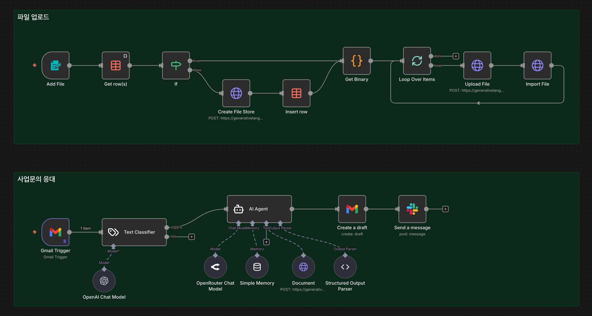

# Gemini File Search API로 RAG Agent 구축하기


n8n을 활용하여 Gemini File Search API 기반의 RAG(Retrieval Augmented Generation) 에이전트를 구축하는 가이드입니다. 복잡한 벡터 데이터베이스 설정 없이 간편하게 문서 기반 AI 응대 시스템을 만들 수 있습니다.

## 목차

- [시스템 개요](#시스템-개요)
- [File Search API란?](#file-search-api란)
- [기존 RAG vs File Search API](#기존-rag-vs-file-search-api)
- [사전 준비사항](#사전-준비사항)
- [파트 1: 파일 업로드 워크플로우](#파트-1-파일-업로드-워크플로우)
- [파트 2: 사업문의 응대 워크플로우](#파트-2-사업문의-응대-워크플로우)
- [테스트 및 배포](#테스트-및-배포)
- [장점과 한계점](#장점과-한계점)
- [참고 자료](#참고-자료)

## 시스템 개요

이 가이드에서는 가상의 AI 자동화 교육 회사 "구씨에듀"의 사업문의 응대를 자동화하는 RAG Agent를 구축합니다.

### 전체 구조



```
[파일 업로드 파트]
n8n 폼 → File Store 확인/생성 → 파일 업로드 → File Store에 저장

[사업문의 응대 파트]
Gmail 수신 → 이메일 분류 → RAG Agent (File Search) → 답변 초안 생성 → Slack 알림
```

### 업로드할 문서 예시

- 서비스 소개서
- 교육 패키지 및 요금표
- 교육 진행 프로세스
- 교육 범위 및 커스터마이징 정책
- 계약/결제/환불/연기 정책
- FAQ

## File Search API란?

File Search API는 구글이 제공하는 **fully managed RAG system**입니다. 기존에 직접 구축해야 했던 복잡한 RAG 파이프라인을 하나의 API로 추상화해줍니다.

### 기존 RAG 파이프라인

```
문서 수집 → 청킹(Chunking) → 임베딩 생성 → 벡터 DB 저장 → 검색 → 답변 생성
```

각 단계마다 직접 설정해야 할 것들:
- 청크 사이즈 결정
- 임베딩 모델 선택 (OpenAI text-embedding, gemini-embedding, Cohere 등)
- 벡터 DB 설정 (Pinecone, Supabase, ChromaDB 등)
- 검색 결과 개수 설정
- 리랭킹 전략

### File Search API 방식

```
File Store 생성 → 문서 업로드 → API 호출 시 도구 지정 → 끝!
```

구글이 알아서 처리해주는 것들:
- 문서 저장 및 관리
- 최적의 청킹 전략 적용
- Gemini Embedding 모델로 임베딩 생성
- 관련 청크 검색
- Citation(인용 출처) 자동 생성

## 기존 RAG vs File Search API

| 항목 | 기존 RAG | File Search API |
|------|----------|-----------------|
| 벡터 DB 설정 | 직접 구축 필요 | 불필요 |
| 청킹/임베딩 | 직접 최적화 | 자동 처리 |
| 비용 구조 | 저장 + 쿼리 비용 | 인덱싱만 유료 ($0.15/100만 토큰) |
| 커스터마이징 | 세밀한 조정 가능 | 제한적 (블랙박스) |
| 인용 출처 | 직접 구현 | 자동 제공 |
| 지원 파일 형식 | 구현에 따라 다름 | 150개 이상 |

## 사전 준비사항

### 1. 필수 계정 및 API

- **n8n**: 로컬 또는 클라우드 설치
- **Gemini API 키**: [Google AI Studio](https://aistudio.google.com/api-keys)에서 발급
- **Gmail OAuth**: Google Cloud Console에서 설정
- **Slack OAuth**: Slack App 생성 및 Bot Token 발급
- **OpenAI API 키** (선택): Text Classifier용
- **OpenRouter API 키** (선택): RAG Agent용

### 2. Gemini API Credential 설정 (n8n)

n8n에서 **HTTP Query Auth** 타입의 Credential을 생성합니다:

```
Name: Gemini-API
Parameter Name: key
Value: [발급받은 Gemini API 키]
```

### 3. n8n Data Table 생성

File Store 정보를 관리하기 위한 테이블을 생성합니다:

**테이블명**: `FileStore`

| 컬럼명 | 타입 | 설명 |
|--------|------|------|
| fileStoreName | string | File Store 이름 |
| fileStoreId | string | Gemini API에서 받은 실제 ID |

## 파트 1: 파일 업로드 워크플로우

### Step 1: Form Trigger 설정

**노드명**: `Add File`

```
Form Title: 문서 업로드
Form Description: RAG Agent 답변에 참고하고자 하는 문서 업로드

Form Fields:
1. Upload File
   - Field Type: File
   - Required: Yes

2. File Store
   - Field Type: Dropdown
   - Options: 
     - Sales-material
     - Internal-operation
   - Required: Yes
```

### Step 2: File Store 존재 여부 확인

**노드명**: `Get row(s)` (Data Table)

```
Operation: Get row(s)
Data Table: FileStore
Return All: Yes
Filter: fileStoreName = {{ $json['File Store'] }}
```

> **중요**: `Always Output Data` 옵션을 활성화해야 빈 결과도 다음 노드로 전달됩니다.

### Step 3: 조건 분기

**노드명**: `If`

```
Condition: {{ $json.fileStoreName }} is not empty

True (File Store 존재) → Get Binary로 이동
False (File Store 없음) → Create File Store로 이동
```

### Step 4: File Store 생성

**노드명**: `Create File Store` (HTTP Request)

```
Method: POST
URL: https://generativelanguage.googleapis.com/v1beta/fileSearchStores
Authentication: HTTP Query Auth (Gemini-API)

Headers:
- Content-Type: application/json

Body (JSON):
{
  "displayName": "{{ $('Add File').item.json['File Store'] }}"
}
```

### Step 5: File Store 정보 저장

**노드명**: `Insert row` (Data Table)

```
Operation: Insert row
Data Table: FileStore

Columns:
- fileStoreName: {{ $json.displayName }}
- fileStoreId: {{ $json.name }}
```

### Step 6: 바이너리 파일 처리

**노드명**: `Get Binary` (Code)

여러 파일을 한 번에 업로드할 수 있도록 처리하는 코드입니다:

```javascript
// "Add File" 노드에서 넘어온 모든 아이템 가져오기
const addFileItems = $("Add File").all();

const out = [];

for (const fileItem of addFileItems) {
  // JSON 쪽 Upload File 배열 꺼내기
  const uploadField = fileItem.json['Upload File'];
  const uploadFiles = Array.isArray(uploadField) ? uploadField : [uploadField];

  // binary 쪽 키 목록
  const binaryKeys = Object.keys(fileItem.binary || {});

  uploadFiles.forEach((uploadFile, index) => {
    const binaryKey = binaryKeys[index] || binaryKeys[0];

    const binaryData = {};
    if (binaryKey && fileItem.binary?.[binaryKey]) {
      binaryData.File = fileItem.binary[binaryKey];
    }

    out.push({
      json: {
        filename: uploadFile?.filename,
        mimetype: uploadFile?.mimetype,
        size: uploadFile?.size,
        fileStore: fileItem.json['File Store'],
      },
      binary: binaryData,
    });
  });
}

return out;
```

### Step 7: Loop Over Items

**노드명**: `Loop Over Items` (Split In Batches)

```
Batch Size: 1
```

파일을 하나씩 순차적으로 처리합니다.

### Step 8: 파일 업로드

**노드명**: `Upload File` (HTTP Request)

```
Method: POST
URL: https://generativelanguage.googleapis.com/upload/v1beta/files
Authentication: HTTP Query Auth (Gemini-API)

Body:
- Content Type: n8n Binary File
- Input Data Field Name: File
```

### Step 9: File Store로 파일 이동

**노드명**: `Import File` (HTTP Request)

```
Method: POST
URL: https://generativelanguage.googleapis.com/v1beta/{{$('Get row(s)').item.json.fileStoreId || $('Create File Store').item.json.name}}:importFile
Authentication: HTTP Query Auth (Gemini-API)

Headers:
- Content-Type: application/json

Body (JSON):
{
  "file_name": "{{ $json.file.name }}"
}
```

> **참고**: URL에서 `$('Get row(s)').item.json.fileStoreId || $('Create File Store').item.json.name` 표현식은 기존 File Store ID 또는 새로 생성된 File Store ID를 동적으로 선택합니다.

### 파일 업로드 워크플로우 연결 구조

```
Add File → Get row(s) → If
                         ├─ True → Get Binary
                         └─ False → Create File Store → Insert row → Get Binary

Get Binary → Loop Over Items → Upload File → Import File → (Loop 반복)
```

## 파트 2: 사업문의 응대 워크플로우

### Step 1: Gmail Trigger

**노드명**: `Gmail Trigger`

```
Poll Times: Every Minute
Label: INBOX
Simple: No (상세 정보 포함)
```

### Step 2: Text Classifier

**노드명**: `Text Classifier`

```
Input Text: {{ $json.text }}

Categories:
1. 사업문의
   - Description: 구씨에듀 관련 사업문의

2. 기타
   - Description: 사업문의 외 이메일
```

**연결할 Language Model**: OpenAI Chat Model (gpt-4o-mini)

> **참고**: "사업문의" 카테고리로 분류된 경우만 다음 노드로 연결합니다.

### Step 3: RAG Agent 설정

**노드명**: `RAG Agent`

#### 3.1 Chat Model 연결

**노드명**: `OpenRouter Chat Model`

```
Model: google/gemini-2.5-flash
```

또는 다른 모델 사용 가능 (OpenAI GPT-4o 등)

#### 3.2 Memory 연결

**노드명**: `Simple Memory`

```
Session ID Type: Custom Key
Session Key: {{ $json.threadId }}
```

이메일 스레드별로 대화 맥락을 유지합니다.

#### 3.3 Output Parser 연결

**노드명**: `Structured Output Parser`

```json
{
  "subject": "Re: 구씨에듀 AI·자동화 교육 관련 문의드립니다",
  "body": "안녕하세요.\n구씨에듀(9C Edu) 교육팀입니다.\n먼저 바쁘신 와중에도 AI·노코드 자동화 교육에 관심 가져주시고 문의 주셔서 진심으로 감사드립니다.\n\n보내주신 메일을 통해 귀사에서 임직원분들의 AI 활용 역량을 강화하고, 실제 업무에 적용 가능한 자동화 사례 중심의 교육을 원하신 것으로 이해했습니다.\n구씨에듀에서는 특강형(2시간), 반일/종일 실습 워크숍, 4회 이상 연속 과정 등 여러 형태로 커리큘럼을 구성하고 있으며, 귀사 업종과 사용 중이신 도구(Google Workspace, Notion, Slack 등)에 맞춰 사례와 실습 내용을 커스터마이징해 드리고 있습니다.\n\n보다 정확한 제안서와 견적을 드리기 위해 아래 사항을 함께 알려주시면 좋겠습니다.\n1) 예상 교육 대상과 인원(직무/직급 포함)\n2) 희망 일정 또는 기간(대략적인 주차/요일/시간대)\n3) 선호하시는 교육 형태(특강 / 워크숍 / 연속 과정 등)와 예산 범위\n\n위 내용을 회신해 주시면, 귀사에 적합한 교육 구성과 예상 비용을 정리한 제안서를 준비하여 다시 전달드리겠습니다. 필요하시다면 온라인 미팅을 통해 보다 자세히 설명드리고, 실제 업무 시나리오 기준으로 커리큘럼을 함께 설계해 드릴 수도 있습니다.\n\n추가로 궁금하신 점이 있으시면 언제든 편하게 말씀 부탁드립니다.\n\n감사합니다.\n\n구씨에듀 교육팀 드림"
}
```

#### 3.4 Tool 연결 - File Search API (핵심!)

**노드명**: `File Search` (HTTP Request Tool)

```
Tool Description: Get relevant document information using File Search API.

Method: POST
URL: https://generativelanguage.googleapis.com/v1beta/models/gemini-2.5-flash:generateContent
Authentication: HTTP Query Auth (Gemini-API)

Body (JSON):
{
  "contents": [
    {
      "parts": [
        { "text": "{{ $fromAI('query','the question the user needs an answer to') }}" }
      ]
    }
  ],
  "tools": [
    {
      "file_search": {
        "file_search_store_names": [
          "fileSearchStores/YOUR-FILE-STORE-ID"
        ]
      }
    }
  ]
}
```

> **중요**: `fileSearchStores/YOUR-FILE-STORE-ID`를 실제 File Store ID로 교체해야 합니다. Data Table에서 확인할 수 있습니다.

#### 3.5 System Prompt

```
당신은 **구씨에듀(9C Edu)** 의 이메일 응대 AI 어시스턴트입니다.

## 역할

- 구씨에듀의 **AI·노코드 자동화 교육**에 대한 사업/제휴/견적 문의 이메일에 대해 정중하고 전문적인 답변 초안을 작성합니다.
- Document에 저장된 구씨에듀 관련 문서(서비스 소개서, 교육 패키지·요금표, 진행 프로세스, 교육 범위·커스터마이징 정책, 계약·결제·환불·연기 정책, FAQ)를 참고하여 일관된 정보를 제공합니다.

## 지식 사용 원칙

1. 구씨에듀에 대한 모든 정보(회사 소개, 패키지 구성, 금액 범위, 진행 프로세스, 정책 등)는 **반드시 Document 문서에서만** 가져옵니다.
2. 문서에 없는 세부 정보(예: 특정 날짜 가능 여부, 사내용 시스템 개발 등)는 **추측하지 말고**: 현재 제공 중인 범위/정책을 문서 기준으로 설명하고, "추가 협의 후 안내 가능하다"는 식으로 정리합니다.
3. 가격·패키지·정책을 언급할 때는 문서 내용과 최대한 가깝게 요약합니다.

## 답변 작성 규칙

- **언어**: 한국어
- **톤**: 정중하고 전문적인 B2B 비즈니스 톤
- **구조**
  1. 인사 및 문의에 대한 감사 표현
  2. 상대의 문의 내용 요약
  3. 구씨에듀 문서를 기반으로 한 안내
  4. 추가 확인 필요 정보 질문 (1~3개)
  5. 후속 절차 안내
  6. 마무리 인사 및 서명

- **길이**: 400~700자 내외
- **서명**: 구씨에듀 교육팀 드림
```

#### 3.6 User Prompt

```
아래 사업 문의 이메일에 대한 답변 초안을 작성해주세요.

## 받은 이메일 정보
- 발신자: {{ $('Gmail Trigger').item.json.from.value[0].address }}
- 제목: {{ $('Gmail Trigger').item.json.subject }}
- 본문:
{{ $('Gmail Trigger').item.json.text }}

## 요청사항
1. 문의 내용에 대해 감사를 표하고, 관심 영역에 대해 간략히 답변해주세요.
2. 제안하는 미팅 시간 중 편한 일정을 회신해달라고 안내해주세요.
```

### Step 4: Gmail 초안 생성

**노드명**: `Create a draft` (Gmail)

```
Resource: Draft
Operation: Create

Subject: {{ $json.output.subject }}
Message: {{ $json.output.body }}

Options:
- Thread ID: {{ $('Gmail Trigger').item.json.threadId }}
- Send To: {{ $('Text Classifier').item.json.from.value[0].address }}
```

### Step 5: Slack 알림

**노드명**: `Send a message` (Slack)

```
Channel: inquiries (또는 원하는 채널)

Text:
구씨에듀 사업문의 관련 초안이 작성되었습니다. 
내용 확인하시고, 메일을 전송하세요.

사업문의자: {{ $('Gmail Trigger').item.json.from.text }}
사업 문의 내용: 
{{ $('Gmail Trigger').item.json.text }}

초안 확인하기: https://mail.google.com/mail/u/0/#drafts?compose={{ $json.message.id }}
```

### 사업문의 응대 워크플로우 연결 구조

```
Gmail Trigger → Text Classifier → RAG Agent → Create a draft → Send a message
                      │                │
                      │                ├── OpenRouter Chat Model
                      │                ├── Simple Memory
                      │                ├── Structured Output Parser
                      │                └── File Search (Tool)
                      │
                      └── OpenAI Chat Model
```

## 테스트 및 배포

### 파일 업로드 테스트

1. Form Trigger의 테스트 URL로 접속
2. 문서 파일 선택 및 File Store 선택
3. Submit 후 워크플로우 실행 확인
4. Google AI Studio에서 File Store에 문서 저장 확인

### 사업문의 응대 테스트

테스트 이메일 예시:

```
To: (테스트 이메일)
Subject: AI 자동화 교육 문의드립니다

안녕하세요.
저희 회사에서 마케팅팀 직원 15명을 대상으로
AI 도구 활용 교육을 진행하고 싶습니다.
특히 ChatGPT와 노코드 자동화 툴(Make, n8n)을
실무에 바로 적용할 수 있는 실습 위주 교육을 원합니다.

예산은 300만원 정도이고,
1월 중으로 반나절 정도 진행 가능할까요?

견적서와 커리큘럼을 받아볼 수 있을까요?
```

### 배포

1. 워크플로우를 **Active** 상태로 변경
2. Form Trigger URL을 Production URL로 변경
3. Gmail Trigger가 자동으로 새 메일 감지

## 장점과 한계점

### 장점

| 항목 | 설명 |
|------|------|
| 간편한 구축 | 벡터 DB 없이 RAG 시스템 구현 가능 |
| 비용 효율 | 스토리지, 쿼리 시점 임베딩 무료 |
| 자동 인용 | Citation 자동 제공으로 검증 용이 |
| 다양한 파일 지원 | PDF, DOCX, 코드 파일 등 150개 이상 지원 |

### 한계점

| 항목 | 설명 |
|------|------|
| 커스터마이징 제한 | 청킹, 임베딩, 검색 전략 조정 불가 |
| 중복 파일 관리 | 자동 감지 없음, 별도 로직 필요 |
| 생태계 종속 | Google/Gemini API에 의존 |
| 복잡한 문서 | 복잡한 레이아웃은 전처리 필요 |

### 적합한 사용 사례

- 일반적인 문서 기반 Q&A
- 사업문의/고객문의 자동 응대
- 내부 지식베이스 검색
- FAQ 기반 챗봇

### 직접 RAG 구축이 필요한 경우

- 정밀한 검색 품질 튜닝이 필요한 경우
- 멀티 스텝 추론이 필요한 복잡한 시스템
- 특정 도메인에 최적화된 임베딩이 필요한 경우

## 참고 자료

- [Gemini File Search API 공식 문서](https://ai.google.dev/gemini-api/docs/file-search)
- [File Search Stores API Reference](https://ai.google.dev/api/file-search/file-search-stores)
- [Google AI Studio - API Key 발급](https://aistudio.google.com/api-keys)
- [n8n 공식 문서](https://docs.n8n.io/)
