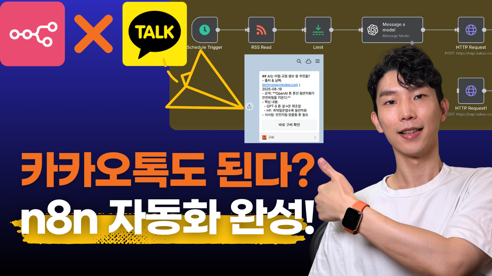
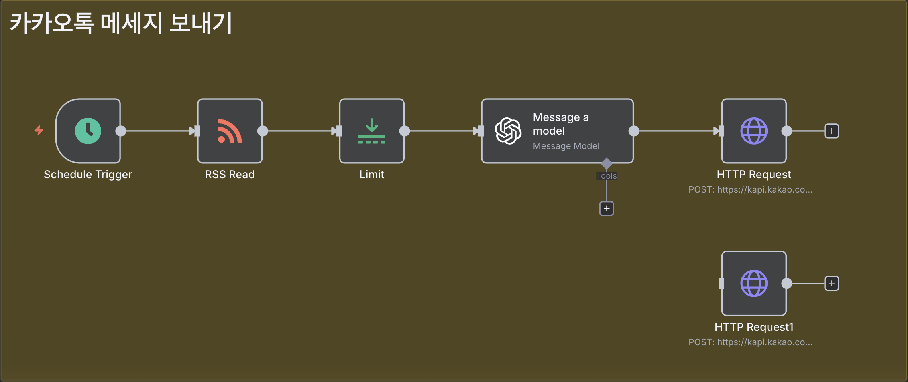

# n8n과 카카오톡 연동으로 업무 자동화하기



n8n을 활용하여 카카오톡으로 원하는 정보를 자동으로 받아볼 수 있는 시스템 구축 가이드입니다. 텔레그램이나 슬랙과 달리 카카오톡은 자동화에 특화된 툴은 아니지만, 국내에서 가장 많이 사용하는 메신저인 만큼 효과적으로 활용할 수 있는 방법을 알아보겠습니다.

## 목차

- [시스템 개요](#시스템-개요)
- [사전 준비사항](#사전-준비사항)
- [카카오 디벨로퍼스 설정](#카카오-디벨로퍼스-설정)
- [n8n 워크플로우 구축](#n8n-워크플로우-구축)
- [고급 활용 팁](#고급-활용-팁)
- [문제 해결](#문제-해결)
- [한계점](#한계점)

## 시스템 개요

이 가이드에서는 매일 아침 AI 업계 뉴스를 자동으로 요약해서 카카오톡으로 받아볼 수 있는 시스템을 구축합니다.

### 워크플로우 구조



1. **스케줄 트리거** → 2. **RSS 뉴스 수집** → 3. **개수 제한** → 4. **AI 요약** → 5. **카카오톡 발송**

### 주요 기능

- 매일 정해진 시간에 자동 실행
- 최신 AI 뉴스 3건 자동 수집
- GPT-5를 활용한 한국어 요약
- 카카오톡 메시지로 자동 전송
- 200~300자 이내 요약으로 가독성 최적화

## 사전 준비사항

- n8n 설치 및 실행
- 카카오 계정
- OpenAI API 키 (GPT-5 사용)
- 웹사이트 또는 도메인 (카카오 플랫폼 등록용)

## 카카오 디벨로퍼스 설정

### 1. 카카오 개발자 계정 설정

1. [카카오 디벨로퍼스](https://developers.kakao.com/)에 접속하여 카카오 계정으로 로그인합니다.

2. **앱 생성**:
   - '앱' > '앱 생성' 클릭
   - 앱 이름과 아이콘, 사업자명, 카테고리 입력
   - 앱 생성 완료

### 2. 앱 기본 설정

**일반 탭에서 설정**:

1. **사업자 정보 등록**:
   - 사업자 정보 등록 또는 개인개발자 비즈 앱 전환 설정

2. **앱 키 확인**:
   - REST API 키를 복사하여 저장 (나중에 n8n에서 사용)

3. **플랫폼 등록**:
   - '플랫폼' 섹션에서 '웹 플랫폼 등록' 클릭
   - 사이트 도메인 추가 (예: https://citizendev9c.com)
   - 플랫폼이 등록된 앱만 메시지 전송 가능

### 3. 카카오 로그인 활성화

**카카오 로그인 탭에서 설정**:

1. **로그인 활성화**: ON으로 설정

2. **Redirect URI 등록**:
   - `https://your-domain.com/rest/oauth2-credential/callback` 형식으로 입력

3. **Client Secret 발급**: 보안 > Client Secret 발급 & 상태 사용함으로 변경

4. **동의항목 설정**:
   - '카카오톡 메시지 전송' 권한을 '이용 중 동의'로 설정

## n8n 워크플로우 구축

### 1. 스케줄 트리거 설정

1. **Schedule Trigger 노드 추가**
2. **실행 시간 설정**:
   - Mode: 'Every Day'
   - Hour: 10 (오전 10시)
   - Minute: 0

### 2. RSS 뉴스 수집

1. **RSS Read 노드 추가**
2. **RSS Feed URL 설정**:
   ```
   https://www.technologyreview.com/topic/artificial-intelligence/feed
   ```

### 3. 뉴스 개수 제한

1. **Limit 노드 추가**
2. **최대 항목 수**: 3으로 설정

### 4. AI 요약 생성

1. **OpenAI Chat Model 노드 추가**
2. **모델 설정**: GPT-5 선택

**System Prompt**:
```
You are a professional Korean research assistant specialized in AI and No-Code.
Your task: given one RSS feed item with full article text, generate a **concise but information-rich Korean summary** in Markdown.

### Rules

1. **한국어 출력만.**
2. **Markdown 구조(기사 1건당):**

   * 최상위: `## 제목`
   * `출처 & 날짜`: 도메인 + pubDate(YYYY-MM-DD)
   * `URL`: 원문 링크
   * `요약(TL;DR)`: **핵심 1–2문장, 200자 이내, 굵게**
   * `핵심 내용`: 불릿 **3–5개**, 각 **최대 40자**
   * `시사점(Why it matters)`: **1–2문장, 100자 이내**
3. **분량 가이드**: 전체 **250자 목표** **150자 미만 금지.**
4. **사실만, 명확·간결.** 광고/로그인 안내 등 불필요 요소 제외.
5. 본문이 일부면 마지막에 **`(부분 기사)`** 표기.
6. 숫자·날짜·모델명 등 **정량 정보 우선**. 확정되지 않은 내용은 단정 표현 금지.

### 출력 예시

## GPT-5 출시, 무엇이 달라졌나

* **출처 & 날짜**: technologyreview\.com | 2025-08-15
* **URL**: https\://...
* **요약 (TL;DR)**: **OpenAI의 GPT-5는 장기 기억·도구사용·다중모달 추론이 크게 개선되어 팀 업무 자동화와 창작 워크플로우에 즉시 적용 가능한 생산성 향상을 예고한다.**
* **핵심 내용**:

  * 장기 메모리/컨텍스트 확장
  * 코드·스프레드시트 도구호출 안정화
  * 영상·음성 입력 성능 개선
  * 기업용 안전·감사 기능 추가
* **시사점 (Why it matters)**: 모델 교체만으로도 자동화 범위가 넓어져, 데이터팀·마케팅·CS의 반복 작업이 단계적으로 대체될 가능성이 크다.
```

**User Prompt**:
```
아래는 RSS에서 가져온 AI 관련 기사 내용입니다.

title: {{ $json.title }}
pubDate: {{ $json.pubDate }}
link: {{ $json.link }}
content: {{ $json.results[0].raw_content }}

위 기사를 읽고, **시스템 메시지의 규칙**에 따라 한국어 Markdown 포맷으로 요약을 작성해 주세요.  
특히 **각 섹션은 200자** 수준으로 요약해 주세요.
```

### 5. 카카오톡 메시지 전송

1. **HTTP Request 노드 추가**

**기본 설정**:
- Method: POST
- URL: `https://kapi.kakao.com/v2/api/talk/memo/default/send`

**인증 설정** (OAuth2 API):
- Grant Type: Authorization Code
- Authorization URL: `https://kauth.kakao.com/oauth/authorize`
- Access Token URL: `https://kauth.kakao.com/oauth/token`
- Client ID: [카카오 디벨로퍼스에서 복사한 REST API 키]
- Client Secret: [카카오 디벨로퍼스에서 발급받은 Client Secret]
- Scope: `talk_message`
- Authentication: Send credentials in body

**헤더 설정**:
- Content-Type: `application/x-www-form-urlencoded;charset=utf-8`

**Body 설정** (JSON 형식):
- Name: template_object
```json
{     
  "object_type": "text",
  "text": {{ JSON.stringify($json.message.content) }},         
  "link": {
    "web_url": "https://citizendev9c.com",
    "mobile_web_url": "https://citizendev9c.com"         
  },
  "button_title": "바로 구씨 확인" 
}
```

## 고급 활용 팁

### 피드 형태 메시지

이미지가 포함된 카드 형태의 메시지를 보내고 싶다면 다음과 같이 설정할 수 있습니다:

```json
{
    "object_type": "feed",
    "content": {
      "title": "{{ $('Limit').item.json.title }}",
      "description": {{ JSON.stringify($json.message.content) }},
      "image_url": "https://mud-kage.kakao.com/dn/NTmhS/btqfEUdFAUf/FjKzkZsnoeE4o19klTOVI1/openlink_640x640s.jpg",
      "link": {
        "web_url": "{{ $('Limit').item.json.link }}"
      }
    }
}
```

### 다양한 템플릿 활용

카카오 API는 다양한 메시지 템플릿을 제공합니다:

- **text**: 기본 텍스트 메시지
- **feed**: 이미지가 메인인 피드 형태
- **list**: 여러 항목을 나열하는 리스트 형태
- **location**: 위치 정보 포함 메시지
- **commerce**: 상품 정보 포함 메시지

자세한 템플릿 사용법은 [카카오 개발자 문서](https://developers.kakao.com/docs/latest/ko/kakaotalk-message/rest-api)를 참고하세요.

## 문제 해결

### 자주 발생하는 문제들

1. **OAuth 인증 실패**:
   - Redirect URI가 정확히 설정되었는지 확인
   - Client ID와 Client Secret이 올바른지 확인
   - 카카오 로그인이 활성화되었는지 확인

2. **메시지 전송 실패**:
   - 카카오톡 메시지 전송 권한이 활성화되었는지 확인
   - 플랫폼이 등록되었는지 확인
   - API 요청 형식이 올바른지 확인

3. **텍스트 길이 초과**:
   - 카카오톡 API는 메시지 길이 제한이 있음
   - 글자가 잘리지 않게 요약하도록 프롬프트 조정

## 한계점

### 개인 메시지 한정

오늘 소개한 방식은 본인에게 메시지를 보내는 방식입니다. 그룹 채팅에 메시지를 보내는 것은 지원되지 않습니다.

### 비즈니스 채널 메시지

카카오톡 비즈니스 채널을 통한 알림톡이나 공지 메시지를 보내려면 별도의 설정이 필요합니다. 이는 오늘 소개한 방식과는 다른 접근법이 필요합니다.

### API 사용량 제한

카카오 API에는 일일 사용량 제한이 있으므로, 대량의 메시지를 보내는 경우 제한에 걸릴 수 있습니다. [쿼터 확인](https://developers.kakao.com/docs/latest/ko/getting-started/quota)

## 결론

카카오 디벨로퍼스를 통해 Kakao API를 활용하면 내가 원하는 정보를 카카오톡 메시지로 자동으로 받아볼 수 있습니다. 설정이 다소 복잡하지만, 카카오톡이 가장 자주 활용하는 메신저인 만큼 다양한 정보를 받아보는 용도로 활용할 수 있습니다.

오늘 보여드린 간단한 뉴스 요약뿐만 아니라, 주식 정보, 날씨 정보, 업무 알림 등 다양한 정보를 자동으로 받아볼 수 있도록 응용해보세요.

만약 카카오톡 비즈니스 채널을 통한 알림톡 발송 자동화에도 관심이 있으시다면, 추후 별도 가이드를 통해 다뤄보도록 하겠습니다.

## 참고 자료

- [카카오 디벨로퍼스](https://developers.kakao.com/)
- [카카오톡 메시지 API 문서](https://developers.kakao.com/docs/latest/ko/kakaotalk-message/rest-api)
- [n8n 공식 문서](https://docs.n8n.io/)
- [OpenAI API 문서](https://platform.openai.com/docs)
