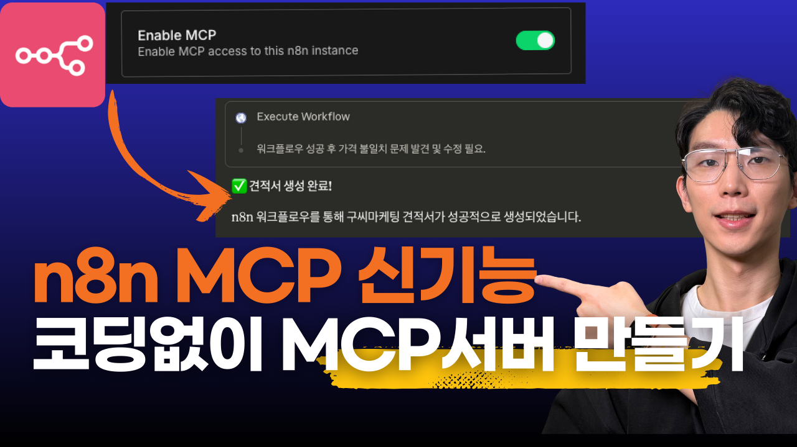
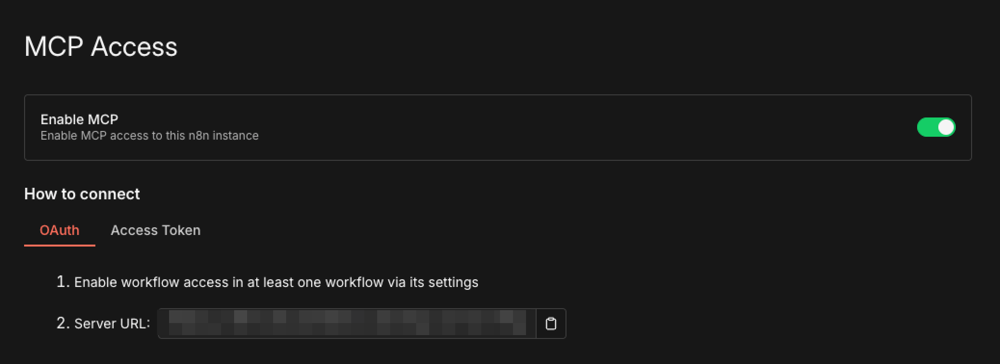
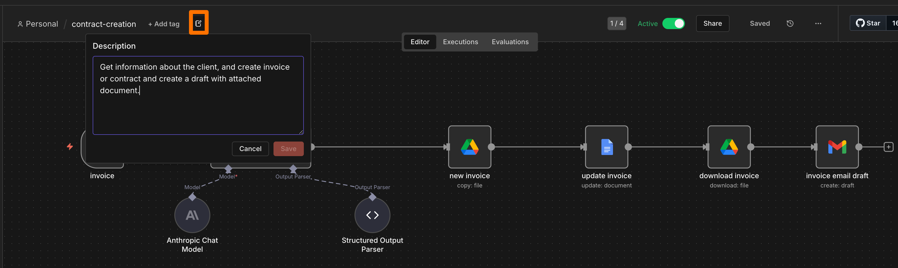

# n8n Instance-level MCP 가이드 - 코딩 없이 MCP 서버 만들기




이 가이드는 n8n의 새로운 Instance-level MCP 기능을 활용하여, ChatGPT나 Claude 같은 AI 툴에서 n8n 워크플로우를 직접 실행하는 방법을 설명합니다.

## 목차

- [개요](#개요)
  - [MCP란?](#mcp란)
  - [기존 방식의 한계](#기존-방식의-한계)
  - [새로운 Instance-level MCP](#새로운-instance-level-mcp)
- [사전 준비사항](#사전-준비사항)
- [설정 방법](#설정-방법)
  - [1. n8n MCP 활성화](#1-n8n-mcp-활성화)
  - [2. 워크플로우별 MCP 활성화](#2-워크플로우별-mcp-활성화)
  - [3. Claude 연결](#3-claude-연결)
  - [4. ChatGPT 연결 (참고)](#4-chatgpt-연결-참고)
- [지원 트리거 타입](#지원-트리거-타입)
- [활용 케이스](#활용-케이스)
  - [케이스 1: CRM 업데이트](#케이스-1-crm-업데이트)
  - [케이스 2: 메일 초안 작성](#케이스-2-메일-초안-작성)
  - [케이스 3: 견적서 자동 생성](#케이스-3-견적서-자동-생성)
- [워크플로우 예시 코드](#워크플로우-예시-코드)
- [n8n MCP 활용의 장점](#n8n-mcp-활용의-장점)
- [문제 해결](#문제-해결)

## 개요

### MCP란?

MCP(Model Context Protocol)는 AI 모델이 외부 서비스와 상호작용할 수 있게 해주는 프로토콜입니다. MCP를 통해 AI가 단순히 텍스트 응답만 하는 것이 아니라, 실제로 구글 캘린더에 일정을 추가하거나, 스프레드시트에 데이터를 기록하는 등의 **실제 작업을 수행**할 수 있습니다.

### 기존 방식의 한계

기존에 n8n 워크플로우를 MCP로 연결하려면 다음과 같은 번거로운 과정이 필요했습니다:

1. **각 워크플로우마다 MCP 서버 노드 추가** - 워크플로우 A, B, C 각각에 MCP 노드를 직접 추가해야 했습니다.
2. **개별 URL 등록** - AI 툴에서 각 워크플로우의 MCP 주소를 일일이 등록해야 했습니다.
3. **관리의 어려움** - 워크플로우가 10개면 URL도 10개 관리해야 했습니다.

### 새로운 Instance-level MCP

이번 업데이트로 연결 방식이 완전히 바뀌었습니다:

1. **n8n 인스턴스 전체를 하나의 MCP 엔드포인트로 연결**
2. **각 워크플로우 설정에서 "MCP에서 사용 가능" 옵션만 켜주면 끝**
3. **AI 툴에서는 하나의 URL만 연결하면 모든 활성화된 워크플로우를 자동 인식**

워크플로우가 20개여도 URL 등록은 딱 한 번만 하면 됩니다. AI가 자동으로 "이 n8n에는 CRM 업데이트, 메일 초안 작성, 견적서 생성 워크플로우가 있구나"라고 인식하고, 필요할 때 적절한 워크플로우를 호출해서 실행합니다.

## 사전 준비사항

- **n8n 최신 버전**: 최신 버전으로 업데이트 필요
- **Claude.ai** 계정 (Pro/Max/Team)
- **n8n 워크플로우**: MCP로 연결할 워크플로우 준비
- **필요한 API 연동**: Google Drive, Gmail, Sheets 등 사용할 서비스 OAuth 설정

## 설정 방법



### 1. n8n MCP 활성화

1. n8n에 로그인합니다.
2. **Settings** → **MCP Access** 탭으로 이동합니다.
3. **"Enable MCP"** 옵션을 활성화합니다.
4. 생성된 **MCP 서버 URL**을 복사해둡니다.

이 URL 하나만 AI 툴에 등록하면 됩니다.

### 2. 워크플로우별 MCP 활성화

MCP로 사용하고 싶은 각 워크플로우에서:

1. 워크플로우 편집 화면으로 이동합니다.
2. 워크플로우를 **Active**로 설정합니다.
2. 우측 상단의 **Settings**를 클릭합니다.
3. **"Available in MCP"** 옵션을 활성화합니다.
4. 워크플로우를 저장합니다.



**팁**: 워크플로우 이름과 설명을 명확하게 작성해두면 AI가 어떤 워크플로우를 언제 사용해야 하는지 더 잘 판단할 수 있습니다.

### 3. Claude 연결

**Claude.ai 사용 시:**

1. Claude.ai에 로그인합니다.
2. 대화 화면에서 **도구 아이콘**을 클릭합니다.
3. **Add connectors** 또는 **커넥터 추가**를 선택합니다.
4. n8n을 선택하고 MCP URL을 입력합니다.

연결 후, 도구 필터 아이콘을 클릭하면 MCP 활성화된 워크플로우들이 도구 목록에 표시됩니다.

### 4. ChatGPT 연결 (참고)

현재 ChatGPT는 n8n MCP를 공식 커넥터로 지원하지 않습니다. 개발자 모드에서 커스텀으로 연결할 수는 있지만, 작동이 불안정하여 본격적인 활용에는 공식 커넥터 지원을 기다리는 것을 권장합니다.

Settings > Apps&Connectors > Developer Mode를 활성화한 후, **Create App**을 해서,
mcp server url을 넣으면 ChatGPT도 연결은 가능합니다.

## 지원 트리거 타입

모든 워크플로우가 MCP로 사용 가능한 것은 아닙니다. 현재 지원되는 트리거 타입:

| 트리거 타입 | 설명 | 
|------------|------|
| **Form Trigger** | 폼 입력을 받는 워크플로우 
| **Chat Trigger** | 채팅 형태의 워크플로우 
| **Webhook Trigger** | HTTP 요청을 받는 워크플로우 
| **Schedule Trigger** | 스케줄 기반 워크플로우

실무에서는 **Form Trigger**와 **Webhook Trigger**를 가장 많이 활용하게 됩니다.

## 활용 케이스

### 케이스 1: CRM 업데이트

사업 문의가 들어왔을 때 CRM(스프레드시트)에 리드를 등록하는 워크플로우입니다.

**문제 상황**: AI 툴들은 보통 시트를 읽어오는 것은 가능하지만, 시트에 정보를 추가하는 작업은 지원하지 않습니다.

**해결 방법**: n8n MCP로 연결하면 AI에게 "이 고객 정보 CRM에 등록해줘"라고 말만 하면 업데이트됩니다.

**워크플로우 구조**:

```
Form Trigger → Google Sheets (Append Row)
```

**Form 필드 구성**:
- company: 회사명 (필수)
- name: 담당자 이름 (필수)
- email: 이메일 주소 (필수)
- business-type: 사업 유형 - 강연/컨설팅 (드롭다운)
- request-date: 문의 일자

**실행 예시**:

```
사용자: "CRM 업데이트 워크플로우 사용해서 해당 메일을 CRM 시트에 업데이트해줘."

Claude: [n8n CRM 업데이트 워크플로우 실행]
       완료되었습니다. 다음 정보가 CRM에 등록되었습니다:
       - 회사: ABC컨설팅
       - 담당자: 홍길동
       - 유형: 컨설팅
       ...
```

### 케이스 2: 메일 초안 작성

받은 문의에 대해 답장 메일 초안을 Gmail 임시보관함에 생성하는 워크플로우입니다.

**문제 상황**: Claude나 ChatGPT는 메일을 검색하는 것은 가능하지만, 초안을 생성하는 것은 지원하지 않습니다.

**해결 방법**: n8n MCP로 메일 초안 생성 워크플로우를 연결합니다.

**워크플로우 구조**:

```
Webhook Trigger → Gmail (Create Draft)
```

**입력 파라미터**:
- email: 수신자 이메일
- subject: 메일 제목
- message: 메일 본문
- thread_id: 기존 메일에 답장할 때 사용 (선택)

**핵심 포인트**: 실제로 메일을 보내는 게 아니라 **초안**을 만듭니다. AI가 작성한 내용을 확인하고, 필요하면 수정한 다음에 발송할 수 있습니다.

**실행 예시**:

```
사용자: "메일 초안 작성 워크플로우 사용해서 답장 초안을 지메일에 만들어줘."

Claude: [n8n 메일 초안 작성 워크플로우 실행]
       Gmail 임시보관함에 초안이 생성되었습니다.
       제목: Re: 사업 문의 드립니다
       ...
```

### 케이스 3: 견적서 자동 생성

문서 템플릿에 정보를 채워넣고, 구글 드라이브에 저장하고, 파일이 첨부된 이메일 초안까지 만드는 워크플로우입니다.

**활용 시나리오**: 진행이 확정된 문의건에 대해 견적서를 자동으로 생성합니다.

**워크플로우 구조**:

```
Form Trigger → AI (Claude) → Google Drive (Copy Template) → Google Docs (Replace Placeholders) → Google Drive (Download) → Gmail (Create Draft)
```

**단계별 처리**:

1. **Form Trigger로 정보 수집**
   - 담당자 이름, 회사명
   - 서비스 항목 (n8n 자동화, make 자동화, AI 툴 활용 등)
   - 수량, 서비스 상세 내용
   - 프로젝트 시작일/종료일

2. **AI 노드로 데이터 구조화**
   - Claude 3.7 Sonnet이 입력 정보를 바탕으로
   - 견적서 템플릿에 들어갈 데이터를 JSON 형태로 정리
   - 단가 자동 계산, 유효기간 자동 계산

3. **Google Docs/Drive 노드**
   - 미리 만들어둔 견적서 템플릿 복사
   - 플레이스홀더(`<<client_name>>`, `<<total_amount>>` 등)를 실제 데이터로 교체
   - 구글 드라이브에 저장

4. **Gmail 노드**
   - 생성된 견적서 파일 첨부
   - 이메일 초안 자동 생성

**실행 예시**:

```
사용자: "해당 문의건 진행이 확정되었어. n8n 자동화 강연으로 견적서 생성 워크플로우 실행해줘."

Claude: [n8n 견적서 생성 워크플로우 실행]
       견적서가 생성되었습니다.
       - 파일: [ABC컨설팅]n8n 자동화 강연_2025-06-12
       - 위치: Google Drive > n8n-folder
       - 이메일 초안: Gmail 임시보관함에 첨부파일과 함께 생성됨
```

## 워크플로우 예시 코드

### CRM 업데이트 워크플로우 설정

**Form Trigger 노드 설정**:

```json
{
  "formTitle": "CRM update",
  "formDescription": "Update new business opportunities to google spreadsheet.",
  "formFields": {
    "values": [
      {
        "fieldLabel": "company",
        "placeholder": "company name of the customer",
        "requiredField": true
      },
      {
        "fieldLabel": "name",
        "placeholder": "name of the customer",
        "requiredField": true
      },
      {
        "fieldLabel": "email",
        "fieldType": "email",
        "requiredField": true
      },
      {
        "fieldLabel": "business-type",
        "fieldType": "dropdown",
        "fieldOptions": {
          "values": [
            { "option": "강연" },
            { "option": "컨설팅" }
          ]
        },
        "requiredField": true
      },
      {
        "fieldLabel": "request-date",
        "fieldType": "date",
        "requiredField": true
      }
    ]
  }
}
```

### 메일 초안 작성 워크플로우 설정

**Webhook Trigger 노드**:

```json
{
  "httpMethod": "POST",
  "path": "your-path",
  "options": {}
}
```

**Gmail Create Draft 노드**:

```json
{
  "resource": "draft",
  "subject": "={{ $json.body.subject }}",
  "message": "={{ $json.body.message }}",
  "options": {
    "threadId": "={{ $json.body.thread_id }}",
    "sendTo": "={{ $json.body.email }}"
  }
}
```


## n8n MCP 활용의 장점

### 단순 툴 연결을 넘어선 비즈니스 워크플로우 실행

n8n MCP의 진정한 가치는 **단순한 툴 연결**이 아니라, **회사 룰과 템플릿이 적용된 비즈니스 워크플로우**를 AI에서 실행할 수 있다는 점입니다.

### 비용 효율성

- Zapier 등 유사 서비스는 무료 사용에 한도가 있음
- n8n 셀프호스팅 버전으로 **무료**로 MCP 연동 가능
- 워크플로우 개수 제한 없음

### 다양한 AI 툴과의 연동

Claude, ChatGPT뿐 아니라 다음 툴에서도 활용 가능합니다:
- Cursor
- Claude Code
- Lovable
- 기타 MCP 지원 AI 도구

### 시각적 워크플로우 설계

코딩 없이 마치 **MCP 서버를 시각적으로 만들어서 활용**하는 것과 같은 경험을 제공합니다.

## 문제 해결

### MCP 연결이 안 될 때

1. **n8n 버전 확인**: 최신 버전으로 업데이트되어 있는지 확인
2. **MCP 활성화 확인**: Settings > MCP에서 Enable MCP가 켜져 있는지 확인
3. **워크플로우 활성화 확인**: 각 워크플로우의 "Available in MCP" 옵션 확인
4. **워크플로우 Active 상태 확인**: 워크플로우가 비활성화되어 있으면 MCP에서도 사용 불가

### 특정 워크플로우가 MCP에 나타나지 않을 때

1. **트리거 타입 확인**: Form, Chat, Webhook, Schedule 트리거만 지원됨
2. **워크플로우 저장 확인**: 설정 변경 후 저장했는지 확인

### 워크플로우 실행 오류

1. **인증 정보 확인**: Google, Gmail 등 OAuth 연결이 유효한지 확인
2. **필수 필드 확인**: Form에서 요구하는 필수 필드가 모두 전달되었는지 확인
3. **n8n 로그 확인**: Executions에서 에러 메시지 확인

## 참고 자료

- [n8n 공식 문서](https://docs.n8n.io/)
- [n8n Self-Hosting 가이드](https://docs.n8n.io/hosting/)
- [n8n mcp 문서](https://docs.n8n.io/advanced-ai/accessing-n8n-mcp-server/)

---
이 가이드를 통해 n8n의 Instance-level MCP 기능을 활용하여, AI 도구에서 직접 비즈니스 워크플로우를 실행하는 시스템을 구축해보세요. 단순한 툴 연결을 넘어, 회사만의 비즈니스 로직이 담긴 자동화를 AI와 결합할 수 있습니다.
