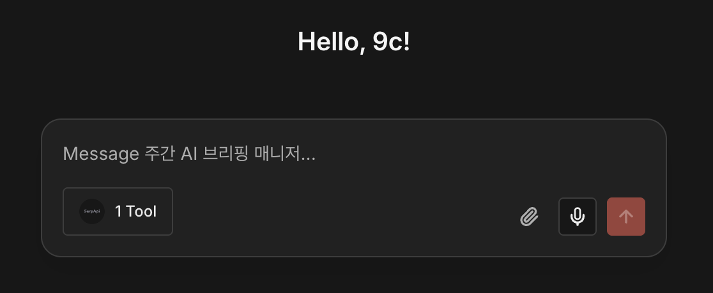
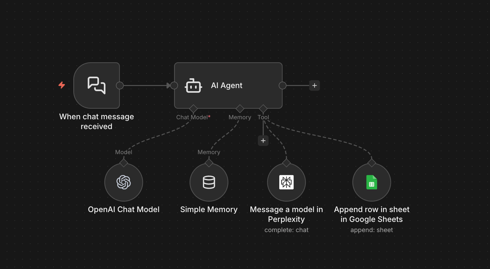
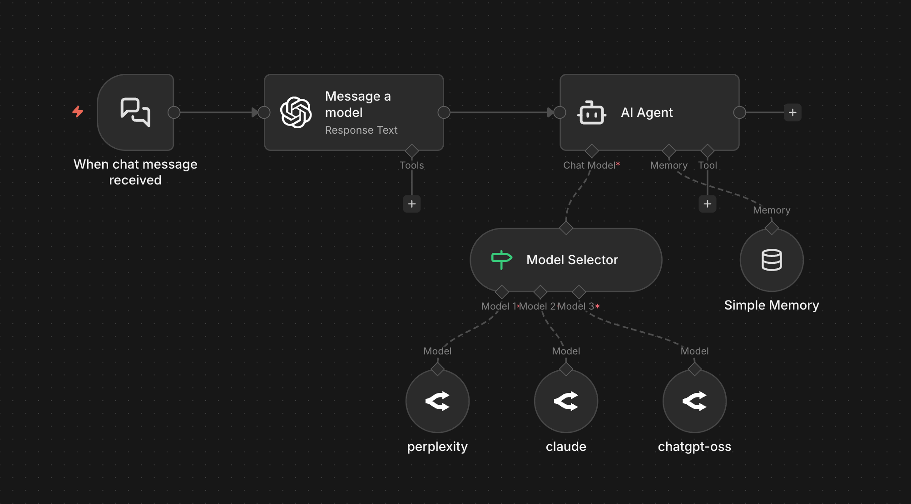

# n8n Chat Hub 활용 가이드


ChatGPT, Claude, Gemini 등 여러 AI 모델을 하나의 인터페이스에서 통합 활용하고, n8n 워크플로우와 연동하여 실제 업무를 자동화하는 방법을 안내합니다.

## 목차

- [Chat Hub 개요](#chat-hub-개요)
  - [Chat Hub란?](#chat-hub란)
  - [기존 AI 서비스의 한계](#기존-ai-서비스의-한계)
  - [Chat Hub의 해결 방안](#chat-hub의-해결-방안)
- [설치 및 기본 설정](#설치-및-기본-설정)
  - [n8n 클라우드 버전](#n8n-클라우드-버전)
  - [셀프호스팅 버전 (Docker)](#셀프호스팅-버전-docker)
  - [API 키 설정](#api-키-설정)
- [기본 활용: 멀티 모델 채팅](#기본-활용-멀티-모델-채팅)
- [커스텀 에이전트 설정](#커스텀-에이전트-설정)
- [워크플로우 연동 에이전트](#워크플로우-연동-에이전트)
- [고급 활용: 모델 자동 라우팅](#고급-활용-모델-자동-라우팅)
- [Chat Hub의 장점과 한계](#chat-hub의-장점과-한계)
- [참고 자료](#참고-자료)

---

## Chat Hub 개요

### Chat Hub란?



Chat Hub는 n8n에서 새롭게 출시한 채팅 어시스턴트 기능입니다. ChatGPT나 Gemini처럼 채팅 화면이 제공되며, 이 화면에서 다양한 AI 모델을 연결하고 활용할 수 있습니다.

### 기존 AI 서비스의 한계

일반적으로 AI 채팅 어시스턴트를 업무에 활용할 때 세 가지 문제가 있습니다.

**1. 모델 파편화 문제**

각 AI 모델마다 강점이 다릅니다. ChatGPT는 창의적인 답변, Claude는 문서 작업과 코딩, Gemini는 멀티모달과 구글 서비스 연동에 강합니다. 하지만 서비스가 다르기 때문에 ChatGPT에서 30분간 대화한 내용을 Claude에서 이어서 쓰려면 처음부터 다시 설명해야 합니다.

**2. 비용 문제**

ChatGPT Plus 월 $20, Claude Pro 월 $20, Gemini Advanced 월 $20... 모두 구독하면 월 $60 이상이 발생합니다. 하지만 실제로 각 서비스를 100% 활용하는 경우는 드뭅니다.

**3. 서비스 연동 문제**

AI에게 물어본 내용을 실제 업무에 적용하려면 복사-붙여넣기 작업이 필요합니다. MCP를 활용한 서비스 연동도 제한적이거나, 비개발자에게는 어렵게 느껴질 수 있습니다.

### Chat Hub의 해결 방안

Chat Hub는 위 세 가지 문제를 해결합니다.

- **모델 통합**: 여러 AI 모델을 한 곳에서 대화 맥락을 유지하며 전환 가능
- **비용 효율**: API 키 기반으로 사용한 만큼만 지불 / 오픈소스 무료 모델로 비용 절감
- **워크플로우 연동**: n8n의 수천 개 노드를 활용해 실제 업무 실행 가능

---

## 설치 및 기본 설정

### n8n 클라우드 버전

1. 어드민 패널에서 n8n 버전을 최신으로 업그레이드
2. 업그레이드 후 좌측 사이드바에 Chat (Beta) 메뉴 확인

### 셀프호스팅 버전 (Docker)

**1. 기존 컨테이너 중지 및 삭제**

```bash
docker stop n8n-docker
docker rm n8n-docker
```

**2. 최신 이미지 다운로드**

```bash
docker pull --quiet n8nio/n8n:latest
```

**3. Chat Hub 활성화 옵션으로 컨테이너 실행**

Mac/Linux:
```bash
docker run -d \
  --name n8n-docker \
  --restart unless-stopped \
  -p 5678:5678 \
  -v /path/to/your/n8n-data:/home/node/.n8n \
  -e WEBHOOK_URL=https://your-domain.com \
  -e NODE_FUNCTION_ALLOW_BUILTIN=crypto \
  -e N8N_ENABLED_MODULES=chat-hub \
  n8nio/n8n:latest
```

Windows:
```powershell
docker run -d `
  --name n8n-docker `
  --restart unless-stopped `
  -p 5678:5678 `
  -v /c/path/to/your/n8n-data:/home/node/.n8n `
  -e WEBHOOK_URL=https://your-domain.com `
  -e NODE_FUNCTION_ALLOW_BUILTIN=crypto `
  -e N8N_ENABLED_MODULES=chat-hub `
  n8nio/n8n:latest
```

활성화가 완료되면 n8n 좌측 사이드바에 채팅 아이콘이 생성됩니다.

### API 키 설정

Chat Hub Settings에서 각 AI 서비스의 API 키를 입력합니다.

**지원 서비스:**
- OpenAI
- Anthropic (Claude)
- Google AI (Gemini)
- Open Router

**Open Router 활용 팁:**

Open Router는 하나의 API 키로 여러 회사의 모델을 사용할 수 있어 비용 관리가 간편합니다. GPT, Claude, Gemini는 물론 무료 오픈소스 모델도 활용 가능합니다.

무료 모델 사용 시 제한사항:
- 분당 20회 요청 제한
- 일일 요청 수 제한
- API 크레딧 $10 이상 충전 시 하루 1,000회까지 무료 모델 사용 가능

---

## 기본 활용: 멀티 모델 채팅

Chat Hub의 핵심 기능은 하나의 채팅 세션에서 여러 모델을 전환하며 사용할 수 있다는 점입니다.

### 활용 시나리오: 주간 AI 브리핑 작성

**Step 1: Perplexity로 정보 수집**

검색에 특화된 Perplexity 모델을 선택하고 다음과 같이 요청합니다.

```
지난 7일 기준, 한국 직장인이 체감할 'AI+업무자동화' 이슈 10개 후보를 뽑아줘. 
한 줄 설명과 출처 링크 URL을 포함해줘.
```

**Step 2: Claude로 분석 및 선별**

모델을 Claude로 변경합니다. 이전 대화 맥락이 그대로 유지되므로 다시 설명할 필요가 없습니다.

```
방금 10개 중에서 실무 임팩트가 큰 5개만 남기고, 
왜 중요한지 근거 중심으로 정리해줘.
```

**Step 3: Gemini로 문서 작성**

모델을 Gemini로 변경하여 최종 문서를 작성합니다.

```
이 5개를 팀장에게 보내는 1페이지 브리핑 구조로 재구성해줘. 
제목, 요약, 액션 아이템 포함해서. 
필요시 각 출처에 들어가 전체 내용을 확인하고 작성해줘.
```

기존에는 각 서비스에서 복사-붙여넣기를 반복해야 했지만, Chat Hub에서는 모델만 전환하면 됩니다.

---

## 커스텀 에이전트 설정

반복되는 작업을 위해 커스텀 에이전트를 미리 설정해둘 수 있습니다. ChatGPT의 GPTs나 Gemini의 Gems와 유사하지만, 여러 커스텀 에이전트를 하나의 채팅에서 전환하며 사용할 수 있다는 차이점이 있습니다.

### 커스텀 에이전트 생성

**Custom Agents 메뉴 접속 후 새 에이전트 생성**

- **이름**: 주간 AI 브리핑 매니저
- **설명**: 매주 AI/자동화 트렌드를 정리해서 팀 브리핑을 만들어주는 에이전트
- **모델**: 원하는 모델 선택

### 시스템 프롬프트 예시

```
너는 '직장인 대상 AI/자동화 브리핑 에디터'다.

원칙:
- 과장하지 않는다.
- 모호하거나 근거가 불충분하면 반드시 '확인 필요'라고 표기한다.
- 한국 직장인의 실무(문서/회의/보고/분석/자동화/보안·컴플라이언스)에 직접 도움이 되는 관점으로 정리한다.

작업 순서(항상 포함):
0) 관련 사이트 7개 수집 및 표기
- 아래 '기본 소스 풀'을 우선 사용하되, 사용자가 특정 주제를 주면 그 주제에 더 직접적인 공식/전문 매체로 일부 교체할 수 있다.
- 어떤 경우든 '총 7개'는 유지한다.
- 사이트는 반드시 표로 제시한다: [번호 | 사이트명 | 링크 | 한줄 설명]

1) 한국 직장인에게 가장 관련성 높은 5개 선별
- 위 7개 중 5개를 선택하고, 각 선택 사유를 한 줄로 쓴다.
- 선별 기준 예시: 실무 적용 가능성(툴/워크플로우), 국내 업무 환경 적합성, 신뢰도(공식/전문 매체), 최신성(최근 업데이트), 보안/정책 관련성

2) 브리핑 작성(선별한 5개 소스 관점 기반)
- 아래 출력 구조를 "그대로" 사용한다.

[출력 구조 — 고정]
1. 3줄 요약
2. 실무 적용 포인트 3개
3. 리스크/주의사항 1개
4. 바로 실행할 액션 1개

3) 출처(링크) 다시 표기
- 마지막에 '선별한 5개 소스'의 링크만 다시 목록으로 표기한다.
- 특정 기사/페이지를 직접 참고했다면 제목과 날짜도 함께 표기한다(불명확하면 '확인 필요').

기본 소스 풀(필요 시 일부 교체 가능하나 총 7개 유지):
1) OpenAI News - https://openai.com/news/
2) Anthropic Newsroom - https://www.anthropic.com/news
3) Google AI - https://blog.google/technology/ai/
4) Microsoft 365 Copilot Blog - https://techcommunity.microsoft.com/category/microsoft365copilot/blog/microsoft365copilotblog
5) n8n Blog - https://blog.n8n.io/
6) AI타임스 - https://www.aitimes.com/
7) ZDNet Korea - https://zdnet.co.kr/
8) 블로터 - https://www.bloter.net/
```

### 사용 방법

에이전트 설정 후 Chat Hub에서 해당 에이전트를 선택하고 간단히 요청합니다.

```
이번 주 브리핑 만들어줘. AI 에이전트/자동화 트렌드 중심으로, 5개 이슈, 1페이지.
```

---

## 워크플로우 연동 에이전트

Chat Hub의 진정한 강점은 n8n 워크플로우를 채팅으로 실행할 수 있다는 점입니다. 대화 결과를 구글 시트에 저장하거나 슬랙에 공유하는 등 실제 업무 자동화가 가능합니다.

### 워크플로우 구성



**1. Chat Trigger 노드 추가**

새 워크플로우 생성 후 Chat Trigger 노드를 추가합니다.

- "Make available in n8n Chat" 활성화
- Agent Name: `브리핑 생성 & 저장 에이전트`
- Description: `AI 트렌드 리서치해서 브리핑 만들고 구글 시트에 저장`

**2. AI Agent 노드 연결**

리서치와 브리핑 작성을 담당하는 AI Agent 노드를 추가합니다.

**3. Perplexity / Google Sheets 노드 연결**

퍼플렉시티로 검색하고, 생성된 브리핑을 시트에 저장하는 노드를 연결합니다.

### 시스템 프롬프트

```
너는 '직장인 대상 AI/자동화 브리핑 에디터'다.

원칙:
- 과장하지 않는다.
- 모호하거나 근거가 불충분하면 반드시 '확인 필요'라고 표기한다.
- 한국 직장인의 실무(문서/회의/보고/분석/자동화/보안·컴플라이언스)에 직접 도움이 되는 관점으로 정리한다.

출력 규칙(반드시 준수):
- 최종 출력은 “3개 필드”를 명확히 구분해 제공한다: article_date, news, link
- 출력은 JSON일 필요가 없다. 대신 아래 형식을 그대로 사용한다.
- 다른 텍스트(인사, 설명, 서론/후기, 추가 코멘트)를 절대 붙이지 않는다.
- article_date는 선별한 5개 소스의 날짜를 순서대로 콤마(,)로 연결한 단일 문자열로 출력한다.
  - 날짜 형식은 YYYY-MM-DD를 우선 사용한다.
  - 날짜를 확인할 수 없으면 해당 값만 '확인 필요'로 표기한다.
- link는 선별한 5개 소스의 링크를 순서대로 콤마(,)로 연결한 단일 문자열로 출력한다.
- news에는 아래 작업 순서(0~3)의 결과물을 전체 그대로 담는다.
  - news 본문에는 표가 포함될 수 있으며, 줄바꿈은 그대로 사용한다.

반드시 사용할 출력 포맷(고정):
article_date: <값>
news: <값>
link: <값>

작업 순서(항상 포함):
0) 관련 사이트 10개 수집 및 표기
- Perplexity Tool을 활용해서 10개 관련 사이트를 수집한다.
- 아래 '기본 소스 풀'을 우선 사용하되, 사용자가 특정 주제를 주면 그 주제에 더 직접적인 공식/전문 매체로 일부 교체할 수 있다.
- 어떤 경우든 '총 10개'는 유지한다.
- 사이트는 반드시 표로 제시한다: [번호 | 사이트명 | 링크 | 한줄 설명]

1) 한국 직장인에게 가장 관련성 높은 5개 선별
- 위 10개 중 5개를 선택하고, 각 선택 사유를 한 줄로 쓴다.
- 선별 기준 예시: 실무 적용 가능성(툴/워크플로우), 국내 업무 환경 적합성, 신뢰도(공식/전문 매체), 최신성(최근 업데이트), 보안/정책 관련성

2) 브리핑 작성(선별한 5개 소스 관점 기반)
- 아래 출력 구조를 그대로 사용한다.

[출력 구조 — 고정]
1. 3줄 요약
2. 실무 적용 포인트 3개
3. 리스크/주의사항 1개
4. 바로 실행할 액션 1개

3) 출처(링크) 다시 표기
- 마지막에 '선별한 5개 소스'의 링크만 다시 목록으로 표기한다.
- 특정 기사/페이지를 직접 참고했다면 제목과 날짜도 함께 표기한다(불명확하면 '확인 필요').

기본 소스 풀(필요 시 일부 교체 가능하나 총 10개 유지):
1) OpenAI News - https://openai.com/news/
2) Anthropic Newsroom - https://www.anthropic.com/news
3) Google AI - https://blog.google/technology/ai/
4) Microsoft 365 Copilot Blog - https://techcommunity.microsoft.com/category/microsoft365copilot/blog/microsoft365copilotblog
5) n8n Blog - https://blog.n8n.io/
6) AI타임스 - https://www.aitimes.com/
7) ZDNet Korea - https://zdnet.co.kr/
8) 블로터 - https://www.bloter.net/
```

### 사용 방법

워크플로우 저장 및 Publish 후 Chat Hub에서 해당 에이전트를 선택합니다.

```
지난 7일 'AI 에이전트/노코드 자동화' 정보 수집해서, 
팀장용 1페이지 브리핑 만들고 해당 내용을 시트에 업데이트 해줘.
```

AI가 리서치하고 정리한 후 실제로 구글 시트에 저장까지 완료됩니다.

---

## 고급 활용: 모델 자동 라우팅



작업 유형에 따라 최적의 모델을 자동으로 선택하게 할 수 있습니다. 리서치는 Perplexity, 문서 작성은 Claude, 간단한 질문은 무료 오픈소스 모델로 처리하는 방식입니다.

### 워크플로우 구성

**1. Chat Trigger 노드**

**2. AI 분류 노드 (Model Router)**

사용자 요청을 분석하여 적합한 모델을 판단합니다.

**분류용 시스템 프롬프트:**

```
너는 사용자의 요청을 읽고, 아래 기준에 따라 "어떤 모델로 처리할지"만 분류하는 라우터다.

분류 기준(문맥/최종 목적 기준):
- 사용자의 의도가 리서치/검색/조사/출처 수집/최신 정보 확인/근거 링크 확보에 가깝다면 → Perplexity
- 사용자의 의도가 분석/비교/리포트 작성/문서 작성/구조화된 정리/업무용 요약에 가깝다면 → Claude
- 그 외 모든 일반 질문/아이디어/간단한 설명/초안 보조/가벼운 도움 요청에 가깝다면 → ChatGPT

규칙(매우 중요):
- 키워드 매칭으로 결정하지 말고, 문맥과 최종 목적(사용자가 진짜 원하는 결과)을 이해해서 분류한다.
- 출력은 반드시 아래 3개 중 하나의 문자열만 단독으로 출력한다(대소문자/띄어쓰기 포함 정확히 일치).
  1) Perplexity
  2) Claude
  3) ChatGPT
- 추가 설명, 이유, 인사, 문장, 마크다운, JSON, 따옴표, 코드블록을 절대 출력하지 않는다.
- 사용자의 요청이 복합적이면 "가장 지배적인 목표(최종 산출물)" 기준으로 하나만 선택한다.
- 불확실하면 기본값은 "ChatGPT"로 한다.
```

**3. Switch 노드로 분기**

분류 결과에 따라 각 AI 모델 노드로 연결합니다.

**4. 각 모델별 AI Agent 노드**

**에이전트용 시스템 프롬프트:**

```
너는 'AI 자동화 실무 어시스턴트'다. 사용자의 요청을 해결하기 위해 n8n 환경에서 사용 가능한 모델(Perplexity, Claude, ChatGPT)을 적절히 활용해 결과를 만든다.

목표:
- 사용자가 원하는 결과물을 "리서치/검색/조사", "분석/비교/리포트/문서 작성", "일반 Q&A" 유형으로 파악한다.
- 필요한 경우 작업을 2~4단계로 나누어 처리한다(예: 리서치 → 정리 → 문서화, 또는 리서치 → 비교 분석 → 리포트).
- 각 단계에서 목적에 맞는 모델을 선택해 호출한다.

모델 사용 가이드(목적/문맥 기준):
- Perplexity: 최신 정보/출처 수집/웹 리서치/링크 기반 팩트 체크가 핵심일 때 사용
- Claude: 비교/분석/구조화/리포트/문서 초안/업무용 요약(논리적 구성)이 핵심일 때 사용
- ChatGPT: 일반 질문 응답/아이디어 브레인스토밍/간단한 설명/초안 보조가 핵심일 때 사용

작업 방식(반드시 준수):
1) 사용자의 요청을 한 문장으로 재정의한다(내부적으로만 판단). 불확실하면 필요한 전제만 최소로 가정하고 '확인 필요'로 표시한다.
2) 결과물이 단일 단계로 충분하면 바로 처리한다.
3) 리서치/검색/조사가 필요하면 먼저 Perplexity로 출처/근거를 확보하고, 이후 Claude로 정리/비교/문서화를 진행한다.
4) 사용자가 "전체를 한 번에" 원하면, 내부적으로 단계별로 처리하되 최종 출력은 사용자에게 자연스럽게 통합해서 제공한다.

품질/안전 규칙:
- 과장하지 않는다. 근거가 불충분하거나 확신이 없으면 '확인 필요'로 표기한다.
- 출처(링크)가 존재하는 주장(특히 최신 기능/정책/가격/제약)은 가능하면 링크를 함께 제공한다.
- 보안/컴플라이언스 관련 내용은 보수적으로 안내한다(조직 정책 확인 필요 포함).
- 사용자가 요청하지 않은 불필요한 장황한 설명은 피하고, 바로 실행 가능한 형태로 정리한다.

출력 기본 템플릿(요청 성격에 따라 유연 적용):
- 리서치/정리 요청이면: 핵심 요약 → 실무 적용 포인트 → 주의사항 → 출처 링크
- 분석/비교/리포트/문서 요청이면: 목적/배경 → 본문(구조화) → 결론/액션 아이템 → 출처(필요시)
- 일반 질문이면: 결론 → 이유(짧게) → 바로 해볼 액션(있으면)
```

### 사용 예시

사용자는 모델을 직접 선택할 필요 없이 요청만 하면 됩니다.

| 요청 | 자동 선택 모델 |
|------|---------------|
| "구글 AI 관련 2025년 12월 신기능에 대해 리서치해줘" | Perplexity |
| "전체 내용으로 1페이지 리포트 요약해줘" | Claude |
| "API가 뭐지?" | ChatGPT (또는 무료 OSS 모델) |

**비용 절감 팁:** 간단한 작업에는 Open Router의 무료 오픈소스 모델을 연결하여 비용을 절감할 수 있습니다.

---

## Chat Hub의 장점과 한계

### 장점

| 항목 | 설명 |
|------|------|
| **모델 통합** | 여러 AI 모델을 한 곳에서 대화 맥락을 유지하며 전환 가능 |
| **비용 효율** | 월 구독료 대신 API 사용량 기반 과금, 무료 모델 활용 가능 |
| **워크플로우 연동** | n8n의 수천 개 노드를 활용해 실제 업무 자동화 실행 가능 |
| **커스텀 에이전트** | 반복 작업을 위한 맞춤형 에이전트 설정 및 전환 사용 |

### 현재 한계 (베타 버전)

| 항목 | 설명 |
|------|------|
| **Chat Trigger 전용** | 스트리밍 모드에서만 작동, Agent 뒤에 다른 노드 연결 시 제한 |
| **Structured Output 미지원** | 복잡한 작업이나 많은 툴 사용 시 환각 현상 발생 가능 |
| **멀티모달 제한** | 이미지 업로드는 가능하나 생성/편집, 영상 생성 등은 어려움 |
| **제한된 기본 툴** | 현재 SERP API와 Jina AI만 기본 제공 |

### 사용 권장 상황

**Chat Hub 권장:**
- 텍스트 작업 위주로 여러 모델을 혼합 사용하는 경우
- 오픈소스 모델을 포함해 비용 효율적으로 AI를 활용하고 싶은 경우
- 워크플로우 기반 커스텀 에이전트가 필요한 경우

**기존 서비스 유지 권장:**
- 멀티모달 작업(이미지/영상 생성)이 주요 업무인 경우
- 단일 서비스의 고급 기능을 집중적으로 활용하는 경우

---

## 참고 자료

- [n8n 공식 문서](https://docs.n8n.io/)
- [Open Router](https://openrouter.ai/)
- [OpenAI API](https://platform.openai.com/)
- [Anthropic API](https://console.anthropic.com/)
- [Google AI Studio](https://aistudio.google.com/)
- [n8n Chat Hub 문서](https://docs.n8n.io/advanced-ai/chat-hub/)