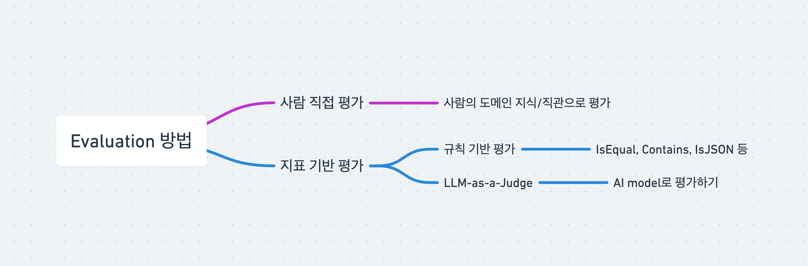
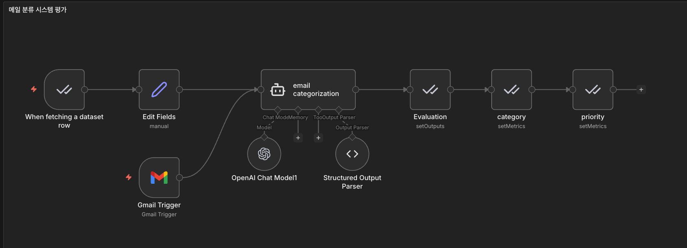
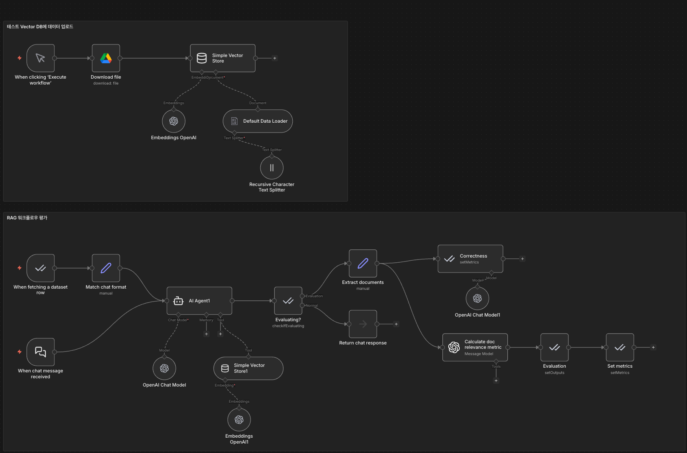

# n8n Evaluation 기능으로 AI Agent 성능 측정하기


이 가이드는 n8n의 Evaluation 기능을 활용하여 AI 워크플로우의 성능을 정량적으로 측정하고 개선하는 방법을 설명합니다.

## 목차

- [개요](#개요)
- [왜 평가가 필요한가?](#왜-평가가-필요한가)
- [평가의 두 가지 접근법](#평가의-두-가지-접근법)
- [평가 지표 종류](#평가-지표-종류)
- [실습 1: 이메일 분류 AI Agent 평가](#실습-1-이메일-분류-ai-agent-평가)
  - [시나리오 설명](#시나리오-설명)
  - [평가 워크플로우 구조](#평가-워크플로우-구조)
  - [Step 1: 테스트 데이터셋 준비](#step-1-테스트-데이터셋-준비)
  - [Step 2: Evaluation 트리거 설정](#step-2-evaluation-트리거-설정)
  - [Step 3: AI 분류 노드 연결](#step-3-ai-분류-노드-연결)
  - [Step 4: Evaluation 노드 추가](#step-4-evaluation-노드-추가)
  - [Step 5: 평가 실행하기](#step-5-평가-실행하기)
  - [Step 6: 대시보드 확인](#step-6-대시보드-확인)
  - [Step 7: 개선하기](#step-7-개선하기)
- [실습 2: RAG 기반 Q&A Agent 평가](#실습-2-rag-기반-qa-agent-평가)
  - [시나리오 설명](#시나리오-설명-1)
  - [워크플로우 구조](#워크플로우-구조)
  - [Check Evaluating 노드 설정](#check-evaluating-노드-설정)
  - [문서 추출 설정](#문서-추출-설정)
  - [답변 정확도 평가 (LLM-as-a-Judge)](#답변-정확도-평가-llm-as-a-judge)
  - [문서 관련성 평가](#문서-관련성-평가)
  - [평가 결과 확인 및 개선](#평가-결과-확인-및-개선)
- [결론](#결론)

## 개요

AI Agent를 만들고 나면 항상 드는 의문이 있습니다:

- "이거... 진짜 잘 되고 있는 건가?"
- "프롬프트 이렇게 쓰는 게 맞나?"
- "다른 모델로 바꾸면 더 좋아질까?"

개인 프로젝트에서는 괜찮을 수 있지만, 실제 업무에서 사용하려면 AI Agent의 품질을 평가하고 개선하는 작업이 필수적입니다.

n8n의 Evaluation 기능을 활용하면, 코딩 없이도 AI 워크플로우가 실제로 얼마나 잘 작동하는지 **숫자로 측정**하고, **데이터 기반으로 개선 방향을 판단**할 수 있습니다.

## 왜 평가가 필요한가?

AI 워크플로우를 운영하다 보면 여러 가지 선택의 순간이 생깁니다:

- "이 프롬프트가 최선인가?"
- "ChatGPT를 쓸까, Claude를 쓸까, Gemini를 쓸까?"
- "RAG 청킹 사이즈를 512로 할까, 1024로 할까?"

이런 선택지들이 무수히 많은데, 어떤 게 더 좋은지 알 수 있는 방법이 없으면 결국 **감으로 결정**하게 됩니다.

감으로 결정하면 발생하는 문제:

1. **실제로 더 나은 선택인지 알 수 없습니다.**
2. **뭔가 수정했을 때 좋아진 건지 나빠진 건지 알 수 없습니다.**
3. **시간이 지나면서 성능이 떨어지는지 모니터링할 수 없습니다.**

그래서 Evaluation, 즉 평가가 필요합니다.

## 평가의 두 가지 접근법



n8n에서 AI 평가를 하는 방법은 크게 두 가지로 나눌 수 있습니다:

### 1. Human Evaluation

눈으로 직접 확인하는 방식입니다. 테스트 데이터 몇 개 만들어서 돌려보고, 결과를 눈으로 체크합니다.

- **장점**: 빠르고 간단함
- **단점**: 테스트 케이스가 많아지면 일일이 확인하기 어려움

### 2. Metric-based Evaluation

평가 기준을 정량화해서, 자동으로 점수를 매기는 방식입니다.

예를 들어:
- 이메일 분류 Agent라면, "정확하게 분류했는지" 여부를 자동으로 체크
- RAG 기반 답변이라면, "답변이 정확한지", "가져온 문서가 관련 있는지" 자동 평가

실제 서비스에서 운영할 때는 Metric-based Evaluation이 필수입니다.

## 평가 지표 종류

n8n Evaluation에서는 다양한 평가 지표를 제공합니다:

### 규칙 기반 평가

- **IsEqual**: 정답과 AI 답변이 완전히 같은지 체크
- **Contains**: 특정 키워드가 포함되어 있는지 확인
- **IsJSON**: JSON 형식인지 확인
- **Categorization**: 카테고리 분류 정확도 평가

### LLM-as-a-Judge

다른 AI 모델을 심사위원으로 써서 평가하는 방식입니다:

- 답변이 사실에 기반했는지 평가
- 환각(Hallucination)이 있는지 체크
- 질문에 적절히 답변했는지 판단

---

## 실습 1: 이메일 분류 AI Agent 평가

### 시나리오 설명

1인 기업가로서 매일 수십 통의 이메일이 들어오는 상황입니다. 일일이 확인해서 분류하고 우선순위를 판단하는 것이 번거로워서 AI Agent를 만들어 자동으로 분류하게 했습니다.

분류 기준:
- **카테고리**: 광고문의, 컨설팅문의, 강연문의, 스팸, 기타
- **우선순위**: 높음, 중간, 낮음

문제는 이 Agent가 정말 정확하게 분류하는지 모른다는 것입니다. 중요한 클라이언트 메일을 "스팸"으로 분류하면 큰 문제가 될 수 있습니다.

### 평가 워크플로우 구조

평가 워크플로우는 크게 세 부분으로 구성됩니다:

1. **테스트 데이터셋 준비**: 평가할 데이터를 준비하는 단계
2. **AI 워크플로우 실행 / 메트릭 측정**: 실제로 AI가 작업을 수행하고, AI 결과와 정답을 비교해서 점수를 매기는 단계
3. **평가 메트릭 분석**: 평가 결과를 분석하고, 개선 작업을 진행하는 단계

### Step 1: 테스트 데이터셋 준비

n8n의 **Data Table** 기능을 사용하여 테스트 케이스를 저장합니다.

#### 테이블 컬럼 구성

| 컬럼명 | 설명 |
|--------|------|
| subject | 이메일 제목 |
| body | 이메일 본문 |
| expected_category | 기대하는 카테고리 (정답) |
| expected_priority | 기대하는 우선순위 (정답) |
| actual_category | 실제 카테고리 |
| actual_priority | 실제 우선순위 |


### Step 2: Evaluation 트리거 설정



1. 평가 전용 트리거인 **When fetching a dataset row**를 추가합니다.
2. 앞서 만든 Data Table을 연결합니다.

이 트리거는 테이블에서 데이터를 한 행씩 가져와서 워크플로우를 실행시킵니다.

### Step 3: AI 분류 노드 연결

실제로 이메일을 분류하는 AI 노드를 연결합니다.

**기본 프롬프트 (개선 전)**

```
다음 이메일을 분류해줘.

카테고리: 광고문의, 컨설팅문의, 강연문의, 스팸, 기타
우선순위: 높음, 중간, 낮음

제목: {{ $json.headers.subject }}
본문: {{ $json.text }}

JSON으로 출력:
{
  "category": "",
  "priority": ""
}
```

### Step 4: Evaluation 노드 추가

AI가 분류한 결과를 정답과 비교하는 Evaluation 노드를 추가합니다.

1. 결과를 기록할 테이블 **ScoreResult** 생성
2. **Set Outputs** 노드로 AI 출력값 기록
3. **Set Metrics** 노드로 평가 점수 매기기

**Set Outputs 메트릭 설정**

Data table을 설정하고:

1. actual_category: `{{ $json.output.category }}`
2. actual_priority: `{{ $json.output.priority }}`


**Set Metrics 메트릭 설정**

카테고리 분류이므로 **Categorization** 메트릭을 사용합니다:

1. Category Set Metrics
- Expected Answer: `{{ $('When fetching a dataset row').item.json.expected_category }}`
- Actual Answer: `{{ $('email categorization').item.json.output.category }}`
- Metric Name: `category` (카테고리 정확도)

2. Priority Set Metrics
- Expected Answer: `{{ $('When fetching a dataset row').item.json.expected_priority }}`
- Actual Answer: `{{ $('email categorization').item.json.output.priority }}`
- Metric Name: `priority` (우선순위 정확도)

AI가 출력한 값과 expected 값을 비교해서, 맞으면 1점, 틀리면 0점을 자동으로 매깁니다.

### Step 5: 평가 실행하기

1. 상단의 **Evaluate** 버튼을 클릭합니다.
2. 테스트 데이터셋의 모든 행을 순회하면서 평가가 진행됩니다.
3. 완료 후 결과 테이블에서 각 테스트 케이스별 점수를 확인합니다.

### Step 6: 대시보드 확인

n8n의 **Evaluations** 탭에서 평가 결과를 대시보드로 확인할 수 있습니다:

- 전체 테스트 케이스 개수
- 평균 점수
- 각 메트릭별 성능

예시 결과:
- 카테고리 정확도: 60% (0.6)
- 우선순위 정확도: 90% (0.9)

이렇게 숫자로 보면 우선순위 판단이 약하다는 것을 명확히 알 수 있고, 이 부분을 개선해야겠다는 인사이트를 얻을 수 있습니다.

### Step 7: 개선하기

프롬프트를 개선하여 카테고리와 우선순위에 대한 구체적인 기준을 제시합니다.

**개선된 프롬프트**

```
당신은 1인 기업가의 이메일을 분류하는 비서입니다.
다음 이메일을 분석해서 카테고리와 우선순위를 판단해주세요.

---

## 카테고리 정의

- **광고문의**: 유튜브 채널 협찬, 브랜디드 콘텐츠, 제품 리뷰 요청, 콜라보 제안 등 광고/마케팅 관련
- **컨설팅문의**: AI/자동화 구축 대행, 업무 프로세스 컨설팅, 유료 자문 요청 등 서비스 의뢰
- **강연문의**: 컨퍼런스 연사, 기업 교육, 세미나, 특강 등 강연/교육 관련 요청
- **스팸**: 투자 사기, 불법 광고, 피싱, 의미 없는 홍보성 메일
- **기타**: 위 카테고리에 해당하지 않는 이메일 (시스템 알림, 뉴스레터 등)

---

## 우선순위 판단 기준

**높음:**
- 구체적인 예산/일정/조건이 명시된 비즈니스 제안
- 기존 미팅이 잡혀있거나 긴급한 회신이 필요한 건
- 대기업/공신력 있는 기관의 공식 요청

**중간:**
- 제안은 있지만 구체성이 부족한 경우 (예: "언젠가 같이 해봐요")
- 예산이 없거나 재능기부 형태의 요청
- 당장 급하지 않은 협찬/리뷰 제안

**낮음:**
- 스팸
- 시스템 자동발송 메일 (알림, 뉴스레터)
- 회신이 필요 없는 정보성 메일

---

## 이메일 내용

제목: {{ $json.headers.subject }}
본문: {{ $json.text }}

---

## 출력 형식

JSON으로만 출력하세요. 다른 텍스트는 포함하지 마세요.
{
  "category": "광고문의 | 컨설팅문의 | 강연문의 | 스팸 | 기타 중 하나",
  "priority": "높음 | 중간 | 낮음 중 하나"
}
```

이렇게 설정하고 다시 테스트하면 점수가 개선된 것을 확인할 수 있습니다.

추가로 AI가 지시를 더 잘 이해하고 따르게 하기 위해 모델을 gpt-4.1 nano에서 gpt-5-mini로 변경하는 등의 실험도 가능합니다.

---

## 실습 2: RAG 기반 Q&A Agent 평가

### 시나리오 설명

소규모 회사를 운영하면서 회사 정책이나 프로세스에 대한 질문이 직원들에게서 자주 들어옵니다. 매번 일일이 답변하기 번거로워서 RAG 기반 챗봇을 만들어 자동 응대하게 했습니다.

사내 문서를 Vector Store에 넣어두고, 질문이 들어오면 관련 문서를 찾아서 답변을 생성하는 구조입니다.

평가하고 싶은 두 가지:

1. **답변 정확도**: AI가 생성한 답변이 실제로 맞는 내용인가?
2. **문서 관련성**: RAG가 가져온 문서가 질문과 관련이 있는가?

문서 관련성이 중요한 이유는, 아무리 AI가 답변을 잘 생성해도 엉뚱한 문서를 참조해서 답변했으면 신뢰하기 어렵기 때문입니다.

### 워크플로우 구조



1. **업로드 파이프라인**: 구글 드라이브에서 문서를 다운로드받아 Simple Vector Store에 추가
2. **질문-답변 워크플로우**: 질문에 대해 Vector Store에서 관련 문서를 검색하고 답변 생성

**기본 시스템 프롬프트**

```
You are a helpful assistant. Answer the user's questions using information from your vector knowledge base only.
```

**중요 설정**: AI Agent 노드에서 **Return Intermediate Steps**를 체크해야 합니다. 이를 통해 에이전트가 어떤 청크를 받아와서 활용했는지 로그로 확인할 수 있습니다.

### Check If Evaluating 노드 설정

**Check If Evaluating** 노드를 추가하면:

- 평가 트리거로 실행된 경우: 평가 노드로 이동
- 일반 답변 요청인 경우: 평가 노드 실행 없이 답변만 제공 / 여기에 데이터 테이블에 운영 데이터 추가

이렇게 하면 운영 데이터를 평가 테이블에 함께 쌓을 수 있습니다.

**운영 데이터 축적의 장점:**

1. 테스트 데이터가 자동으로 늘어남
2. 실제 서비스에서 들어오는 다양한 케이스 커버 가능
3. 주기적으로 평가를 돌려서 성능 변화 모니터링 가능

### 문서 추출 설정

**Set 노드**를 추가하여 가져온 청크를 추출합니다:

```javascript
{{ $json.intermediateSteps.filter(x => x.action.tool == 'vector_knowledge_base')[0].observation }}
```

### 답변 정확도 평가 (LLM-as-a-Judge)

다른 AI 모델을 심사위원으로 사용하여 답변 정확도를 평가합니다.

**System Prompt**

```
You are an expert factual evaluator assessing the accuracy of answers compared to established ground truths.

Evaluate the factual correctness of a given output compared to the provided ground truth on a scale from 1 to 5. Use detailed reasoning to thoroughly analyze all claims before determining the final score.

# Scoring Criteria

- 5: Highly similar - The output and ground truth are nearly identical, with only minor, insignificant differences.
- 4: Somewhat similar - The output is largely similar to the ground truth but has few noticeable differences.
- 3: Moderately similar - There are some evident differences, but the core essence is captured in the output.
- 2: Slightly similar - The output only captures a few elements of the ground truth and contains several differences.
- 1: Not similar - The output is significantly different from the ground truth, with few or no matching elements.

# Evaluation Steps

1. Identify and list the key elements present in both the output and the ground truth.
2. Compare these key elements to evaluate their similarities and differences, considering both content and structure.
3. Analyze the semantic meaning conveyed by both the output and the ground truth, noting any significant deviations.
4. Consider factual accuracy of specific details, including names, dates, numbers, and relationships.
5. Assess whether the output maintains the factual integrity of the ground truth, even if phrased differently.
6. Determine the overall level of similarity and accuracy according to the defined criteria.

# Output Format

Provide:
- A detailed analysis of the comparison (extended reasoning)
- A one-sentence summary highlighting key differences (not similarities)
- The final similarity score as an integer (1, 2, 3, 4, or 5)

Always follow the JSON format below and return nothing else:
{
  "extended_reasoning": "<detailed step-by-step analysis of factual accuracy and similarity>",
  "reasoning_summary": "<one sentence summary focusing on key differences>",
  "score": <number: integer from 1 to 5>
}

# Examples

**Example 1:**

Input:
- Output: "단순 변심 환불은 7일 이내에 가능합니다."
- Ground Truth: "단순 변심의 경우 상품 수령일로부터 7일 이내에 미사용 상태로 반품하면 환불 가능합니다. 포장 상태도 확인해야 합니다."

Expected Output:
{
  "extended_reasoning": "I need to compare the output with the ground truth about refund policy for change of mind. The output correctly states '7일 이내' (within 7 days), which matches the ground truth. However, the ground truth specifies important conditions: 1) '상품 수령일로부터' (from the date of receipt) - the output doesn't specify this starting point, 2) '미사용 상태로' (in unused condition) - this critical condition is missing from the output, 3) '포장 상태도 확인해야 합니다' (packaging condition must be checked) - this additional requirement is completely absent. The output captures the core timeframe but omits multiple important conditions that a customer service agent would need to communicate.",
  "reasoning_summary": "The output correctly mentions the 7-day period but omits critical conditions: receipt date as starting point, unused condition requirement, and packaging verification.",
  "score": 2
}

**Example 2:**

Input:
- Output: "VIP 고객 기준은 연간 구매금액 500만원 이상, 5년 이상 지속 구매, 신규 고객 5명 이상 추천, 리뷰 활동 우수 고객입니다."
- Ground Truth: "VIP 기준은 4가지입니다: 1) 연간 구매금액 500만원 이상, 2) 5년 이상 지속 구매 고객, 3) 추천으로 신규 고객 5명 이상 유치, 4) 리뷰/후기 활동 우수 고객"

Expected Output:
{
  "extended_reasoning": "I need to compare the VIP customer criteria between output and ground truth. Both mention exactly 4 criteria. Criterion 1: '연간 구매금액 500만원 이상' - exact match. Criterion 2: '5년 이상 지속 구매' vs '5년 이상 지속 구매 고객' - essentially identical. Criterion 3: '신규 고객 5명 이상 추천' vs '추천으로 신규 고객 5명 이상 유치' - same meaning with slight wording difference. Criterion 4: '리뷰 활동 우수 고객' vs '리뷰/후기 활동 우수 고객' - the output omits '후기' but the meaning is largely preserved. All four criteria are present with accurate numbers (500만원, 5년, 5명). The format differs (numbered list vs comma-separated) but all factual content is preserved.",
  "reasoning_summary": "The output accurately covers all four VIP criteria with correct numbers, with only minor wording differences ('리뷰' vs '리뷰/후기').",
  "score": 5
}

**Example 3:**

Input:
- Output: "채팅 상담은 1분 이내에 응답해야 합니다."
- Ground Truth: "채팅 상담 시 30초 이내에 첫 응답을 해야 합니다. 이는 CS 기본 원칙 중 '신속한 응대' 항목에 해당합니다."

Expected Output:
{
  "extended_reasoning": "I need to compare the chat response time policy. The critical factual element is the response time: the output states '1분 이내' (within 1 minute) while the ground truth specifies '30초 이내' (within 30 seconds). This is a significant factual error - the output doubles the actual required response time. Additionally, the ground truth specifies '첫 응답' (first response) which clarifies this is about initial response time, not all responses. The ground truth also provides context about CS 기본 원칙 '신속한 응대' which the output omits. The core concept (chat requires quick response) is captured, but the specific time requirement is factually incorrect.",
  "reasoning_summary": "The output contains a critical factual error: states 1 minute instead of the correct 30 seconds for chat response time.",
  "score": 2
}
```

**User Prompt에서 값 매핑**

- Expected Answer: `{{ $('When fetching a dataset row').item.json.expected_answer }}`
- Actual Answer: `{{ $('AI Agent1').item.json.output }}`

**Metric Name**: `Correctness`

### 문서 관련성 평가

RAG가 가져온 문서 청크가 질문과 얼마나 관련있는지 평가합니다.

**System Prompt**

```
You are evaluating a RAG (Retrieval-Augmented Generation) system for a customer service chatbot.
You will be given a QUESTION from a customer service agent and FACTS retrieved from the company's CS manual. Your task is to evaluate how relevant the retrieved FACTS are to answering the QUESTION.

# Scoring Criteria

- 5: Highly relevant - The FACTS directly and completely address the QUESTION with all necessary information.
- 4: Mostly relevant - The FACTS contain most of the information needed to answer the QUESTION, with minor gaps.
- 3: Partially relevant - The FACTS contain some relevant information but miss important aspects of the QUESTION.
- 2: Slightly relevant - The FACTS only tangentially relate to the QUESTION or contain mostly unrelated information with few relevant pieces.
- 1: Not relevant - The FACTS are completely unrelated to the QUESTION.

# Evaluation Steps

1. Identify the key topic and specific requirements in the QUESTION.
2. Examine each provided FACT for relevant policies, procedures, or guidelines.
3. Assess how completely the FACTS cover the information needed to answer the QUESTION.
4. Consider whether the FACTS provide specific details (numbers, conditions, steps) that the QUESTION requires.
5. Evaluate if there are significant gaps between what the QUESTION asks and what the FACTS provide.
6. Provide your reasoning in a detailed, step-by-step manner first.
7. Avoid stating your conclusion at the beginning of your extended reasoning.

# Output Format

Provide:
- A detailed analysis of the relevance evaluation (extended reasoning)
- A one-sentence summary highlighting key gaps or strengths
- The final relevance score as an integer (1, 2, 3, 4, or 5)

Always follow the JSON format below and return nothing else:
{
  "extended_reasoning": "<detailed step-by-step analysis of how you evaluated the relevance>",
  "reasoning_summary": "<one sentence summary of your conclusion>",
  "score": <number: integer from 1 to 5>
}

# Examples

**Example 1:**

Input:
- QUESTION: "단순 변심으로 환불 요청하는 고객에게 어떤 조건을 안내해야 하나요?"
- FACTS: "단순 변심의 경우 상품 수령일로부터 7일 이내에 미사용 상태로 반품하시면 환불 가능합니다. 현재 상품 상태는 어떤가요? 포장도 그대로 있으신가요?"

Expected Output:
{
  "extended_reasoning": "The QUESTION asks about conditions to communicate for refund requests due to change of mind. The FACTS directly address this by providing: 1) the timeframe '7일 이내' (within 7 days), 2) the starting point '상품 수령일로부터' (from receipt date), 3) the condition '미사용 상태' (unused condition), 4) packaging verification requirement. The FACTS also include sample dialogue showing how to confirm conditions with the customer. All key elements needed to answer the question are present.",
  "reasoning_summary": "The FACTS comprehensively cover all refund conditions for change of mind including timeframe, usage condition, and packaging requirements.",
  "score": 5
}

**Example 2:**

Input:
- QUESTION: "VIP 고객 클레임 시 일반 고객과 다른 특별 보상 기준은 무엇인가요?"
- FACTS: "VIP 고객님만의 특별 혜택을 안내드릴게요: 배송비 무료, 당일/새벽 배송 무료, 전용 상담라인 이용 가능. VIP 기준은 연간 구매금액 500만원 이상입니다."

Expected Output:
{
  "extended_reasoning": "The QUESTION specifically asks about VIP compensation standards for complaints/claims, which would differ from regular customers. The FACTS provide general VIP benefits (free shipping, same-day delivery, dedicated support line) and VIP qualification criteria (annual purchase over 5 million won). However, the FACTS do not address: 1) specific compensation rates for VIP claims, 2) how VIP compensation differs from regular customer compensation, 3) any special claim handling procedures for VIP. The retrieved content is about VIP status, but not about claim compensation specifically.",
  "reasoning_summary": "The FACTS cover general VIP benefits but completely miss the specific claim compensation standards that the QUESTION asks about.",
  "score": 2
}

**Example 3:**

Input:
- QUESTION: "단순 변심으로 환불 요청하는 고객에게 어떤 조건을 안내해야 하나요?"
- FACTS: "화난 고객 응대 시 1단계는 감정 진정입니다. '고객님, 정말 불편하셨겠어요. 저희 때문에 기분 상하게 해드려서 진심으로 죄송합니다.' 주의사항: 고객이 욕설을 해도 맞받아치지 않기."

Expected Output:
{
  "extended_reasoning": "The QUESTION asks about refund conditions for simple change of mind. The FACTS discuss handling angry customers and de-escalation techniques. Let me check for any overlap: 1) No mention of refund policy, 2) No mention of return conditions, 3) No timeframes or requirements for returns, 4) Content is entirely about emotional customer handling, not transactional refund policies. The FACTS are from the CS manual but from a completely different section that doesn't relate to the refund question.",
  "reasoning_summary": "The FACTS are about angry customer handling techniques and contain no information about refund conditions or policies.",
  "score": 1
}

# Notes

- Focus on how well the FACTS can help answer the specific QUESTION asked.
- Consider both the presence of relevant information AND the absence of critical information.
- A high score requires the FACTS to substantively address the core of the QUESTION.
- Partial matches (same topic but different aspect) should receive middle scores (2-3).
```

**User Prompt**

```
QUESTION: {{ $('When fetching a dataset row').item.json.question }}
FACTS: 
{{ $json.documents }}
```

**Metric Name**: `Relevance`

### 평가 결과 확인 및 개선

대시보드에서 두 가지 메트릭을 확인합니다:

예시 결과:
- 답변 정확도: 4.3
- 문서 관련성: 1

문서 관련성이 낮은 경우, 다음과 같은 개선 방법을 시도할 수 있습니다:
- 청킹 전략 변경
- 시스템 프롬프트 개선

**개선된 시스템 프롬프트 예시**

```
당신은 구씨컴퍼니 고객서비스팀의 CS 매뉴얼 전문가입니다.
상담원들의 질문에 매뉴얼 내용을 기반으로 정확하고 구체적으로 답변해주세요.

## 답변 원칙

1. **구체적인 숫자/기준 포함**: 기간, 금액, 조건 등 구체적인 수치가 있다면 반드시 포함
2. **조건/예외사항 명시**: 해당 정책의 조건이나 예외사항이 있다면 빠짐없이 안내
3. **단계별 절차 제공**: 처리 절차가 있다면 순서대로 안내
4. **매뉴얼에 없는 내용은 답변하지 않음**: 추측하지 말고, 매뉴얼에 있는 정보만 활용

## 답변 형식

- 핵심 답변을 먼저 제시
- 관련 조건/주의사항을 추가로 안내
- 필요시 응대 스크립트나 예시 멘트 포함

## 예시

질문: "환불 가능 기간이 어떻게 되나요?"
좋은 답변: "단순 변심의 경우 상품 수령일로부터 7일 이내에 미사용 상태로 반품하시면 환불 가능합니다. 포장 상태도 확인이 필요합니다."
나쁜 답변: "7일 이내입니다." (조건 누락)
```

---

## 결론

n8n의 Evaluation 기능을 활용하면 AI 워크플로우 성능을 체계적으로 평가하고 개선할 수 있습니다.

### 핵심 정리

1. **Evaluation을 활용하면 AI 성능을 "감"이 아니라 "숫자"로 측정할 수 있습니다.**

2. **이메일 분류 같은 분류 문제는 Categorization 메트릭으로, RAG 같은 생성 문제는 LLM-as-a-Judge로 평가할 수 있습니다.**

3. **평가 결과를 바탕으로 프롬프트 수정, 모델 교체 같은 개선 작업을 데이터 기반으로 할 수 있습니다.**

4. **운영 데이터를 축적하면서 지속적으로 모니터링하면, AI 시스템의 품질을 계속 유지할 수 있습니다.**

### 참고사항

- 셀프호스팅 버전에서는 Evaluation을 한 번에 하나만 실행할 수 있습니다.
- 여러 개를 동시에 돌리려면 클라우드 버전 pro를 고려해보세요.

---

## 참고 자료

- [n8n 공식 문서](https://docs.n8n.io/)
- [n8n evaluation 가이드](https://docs.n8n.io/advanced-ai/evaluations/overview/)
