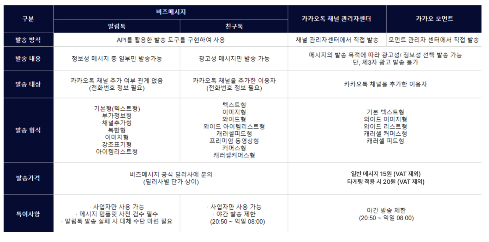
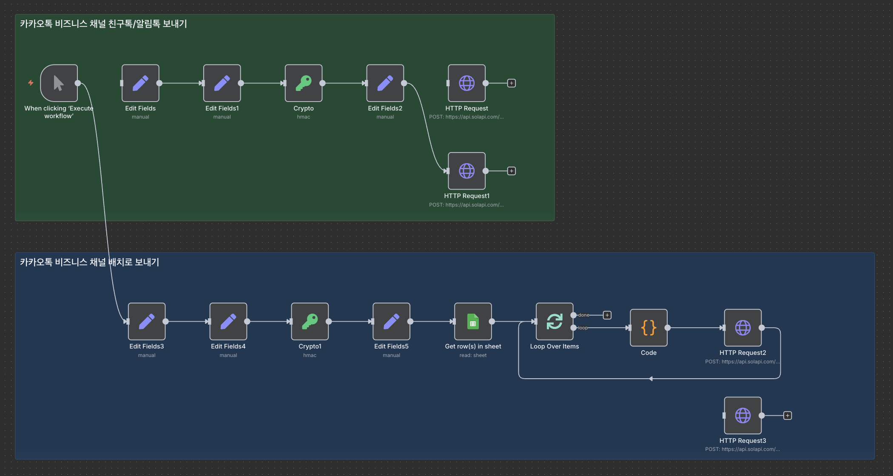

# n8n + Solapi로 카카오톡 비즈니스 메시지 자동화 가이드


n8n과 Solapi를 활용하여 카카오톡 비즈니스 채널의 친구톡과 알림톡을 자동화하는 종합 가이드입니다. 고객에게 중요한 안내사항을 효율적으로 전달하고, 마케팅 메시지를 자동으로 발송할 수 있는 시스템을 구축해보세요.

## 목차

- [시스템 개요](#시스템-개요)
- [카카오톡 메시지 유형 이해](#카카오톡-메시지-유형-이해)
- [1단계: 카카오톡 비즈니스 채널 생성](#1단계-카카오톡-비즈니스-채널-생성)
- [2단계: Solapi 설정 및 채널 연동](#2단계-solapi-설정-및-채널-연동)
- [3단계: n8n에서 인증 시스템 구축](#3단계-n8n에서-인증-시스템-구축)
- [4단계: 메시지 자동 발송 시스템](#4단계-메시지-자동-발송-시스템)
- [5단계: 배치 처리 시스템](#5단계-배치-처리-시스템)

## 시스템 개요

이 자동화 시스템을 통해 다음과 같은 작업을 자동화할 수 있습니다:

- **주문 완료 알림**: 고객이 주문 시 자동으로 카카오톡 확인 메시지 발송
- **예약 확인**: 예약 완료 시 자동으로 안내 메시지 전송
- **마케팅 메시지**: 특정 시간에 자동으로 프로모션 메시지 발송
- **정기 안내**: 주/월 단위로 고객에게 정기 정보 제공
- **이벤트 알림**: 새로운 서비스나 이벤트 출시 시 일괄 안내

## 카카오톡 메시지 유형 이해



비즈니스 채널에서 메시지를 보내는 방법은 3가지가 있습니다:

### 1. 채널 관리자 센터 직접 발송
- **장점**: 채널 추가한 전체 사용자에게 발송 가능
- **단점**: 자동화 불가능, 수동 발송만 가능
- **용도**: 간헐적인 공지사항 발송

### 2. 친구톡 (Friend Talk)
- **조건**: 카카오톡 채널 추가 + 전화번호 보유
- **장점**: 자동화 가능, 자유로운 메시지 내용
- **단점**: 채널 추가가 전제 조건
- **용도**: 기존 고객 대상 마케팅, 안내 메시지

### 3. 알림톡 (Notification Talk)
- **조건**: 전화번호만 있으면 발송 가능 (채널 추가 불필요)
- **장점**: 높은 도달률, 스팸 필터링 없음
- **단점**: 승인된 템플릿만 사용 가능
- **용도**: 주문 확인, 배송 알림 등 정보성 메시지

## 1단계: 카카오톡 비즈니스 채널 생성

### 채널 생성 과정

1. **카카오톡 비즈니스 대시보드 접속**
   - [business.kakao.com/dashboard](https://business.kakao.com/dashboard)에 접속하여 로그인

2. **채널 기본 설정**
   - "채널" 탭에서 "채널 생성" 클릭
   - 채널명을 비즈니스명과 일치시켜 설정
   - 카테고리 및 기본 정보 입력

3. **프로필 설정**
   - 프로필 탭에서 "채널 공개 ON", "검색허용 ON" 설정
   - 채널홈 설정에서 브랜드에 맞는 프로필 이미지 업로드
   - 고객이 이해하기 쉬운 채널 소개글 작성

4. **메시지 기본 설정**
   - "메시지 보내기" → "기본 텍스트"에서 고객센터 연락처 설정
   - 자동 응답 메시지 설정 (선택사항)

### 비즈니스 채널 전환 (필수)

**중요**: 알림톡/친구톡 자동 발송을 위해서는 반드시 비즈니스 채널로 전환해야 합니다.

1. **전환 신청**
   - 대시보드 탭에서 "비즈니스 채널로 전환" 선택
   - 사업자등록증 업로드
   - 비즈니스 정보 입력

2. **심사 대기**
   - 카카오 심사 과정: 1-2일 소요
   - 승인 완료 후에만 다음 단계 진행 가능

## 2단계: Solapi 설정 및 채널 연동

### Solapi 계정 설정

1. **회원가입**
   - [solapi.com](https://solapi.com)에 접속하여 회원가입
   - [console.solapi.com](https://console.solapi.com)으로 관리 콘솔 접속

2. **채널 연동**
   - "카카오/네이버/RCS" → "채널/그룹" 메뉴 이동
   - "채널 연동" 클릭 후 생성한 채널 검색
   - 휴대폰 번호 인증을 통해 채널 등록

3. **API 인증 정보 생성**
   - "개발자 허브" → "API Key 생성" 메뉴
   - API Key와 API Secret 생성 후 안전한 곳에 보관
   - 이 정보는 n8n 연동 시 필요

### 알림톡 템플릿 등록

알림톡 발송을 위해서는 사전에 템플릿 승인이 필요합니다.

1. **템플릿 등록**
   - "카카오" → "템플릿" 메뉴 이동
   - "정보성 메시지" 유형으로 템플릿 등록
   - 변수는 `#{변수명}` 형식으로 작성

2. **템플릿 예시 (회원가입 확인)**
   ```
   안녕하세요 #{회사명}입니다.
   #{고객명}님의 회원가입이 완료되었습니다.

   서비스 이용 문의: #{고객센터번호}
   감사합니다.
   ```

3. **승인 과정**
   - 템플릿 심사: 1-2일 소요
   - 정보성 메시지 가이드라인 준수 필요
   - 마케팅성 내용은 승인 불가

## 3단계: n8n에서 인증 시스템 구축



Solapi는 HMAC-SHA256 방식의 인증을 사용하므로, 매번 요청 시 서명을 생성해야 합니다.

### 인증 워크플로우 구성

#### 1) 트리거 설정
- **Schedule Trigger**: 정기 발송용 (예: 매주 월요일)
- **Webhook Trigger**: 실시간 발송용 (주문 완료 시 등)
- **Google Sheets Trigger**: 시트 업데이트 시 발송

#### 2) Set 노드 - 기본 정보 설정
```json
{
  "apiKey": "YOUR_API_KEY",
  "apiSecret": "YOUR_API_SECRET",
  "pfId": "KA01PFxxxxxxxxxxxxxxxx",
  "templateId": "KA01TPxxxxxxxxxxxxxxxx"
}
```

#### 3) Set 노드 - 날짜와 Salt 생성
```json
{
  "date": "={{ $now.toISO().replace('+00:00','Z') }}",
  "salt": "={{ (Math.random().toString(16).slice(2)+Math.random().toString(16).slice(2)).slice(0,32) }}"
}
```

#### 4) Crypto 노드 - HMAC 서명 생성
- **Operation**: HMAC
- **Algorithm**: SHA256
- **Value**: `{{ $json.date + $json.salt }}`
- **Secret**: `{{ $json.apiSecret }}`

#### 5) Set 노드 - Authorization 헤더 조립
```json
{
  "authorization": "{{ `HMAC-SHA256 apiKey=${$('Edit Fields').item.json.apiKey}, date=${$json.date}, salt=${$json.salt}, signature=${$json.signature}` }}"
}
```

## 4단계: 메시지 자동 발송 시스템

### 단일 발송 워크플로우

#### HTTP Request 노드 설정
- **Method**: POST
- **URL**: `https://api.solapi.com/messages/v4/send-many/detail`
- **Headers**:
  - `Authorization`: `{{ $json.authorization }}`
  - `Content-Type`: `application/json`

### 친구톡 발송

**요청 바디**
```json
{
  "messages": [
    {
      "to": "01000000000",
      "text": "친구톡 본문입니다.",
      "kakaoOptions": {
        "pfId": "KA01PFxxxxxxxxxxxxxxxx",
        "adFlag": false,
        "disableSms": true
      }
    }
  ]
}
```

**주요 설정값**:
- `pfId`: Solapi에서 복사한 채널 ID
- `adFlag`: 광고 여부 (false 권장)
- `disableSms`: SMS 대체 발송 비활성화

### 알림톡 발송

**요청 바디**
```json
{
  "messages": [
    {
      "to": "01000000000",
      "kakaoOptions": {
        "pfId": "KA01PFxxxxxxxxxxxxxxxx",
        "templateId": "KA01TPxxxxxxxxxxxxxxxx",
        "variables": {
          "#{이름}": "구씨"
        },
        "disableSms": false
      }
    }
  ]
}
```

**주요 설정값**:
- `templateId`: 승인된 템플릿 ID
- `variables`: 템플릿 변수값 매핑
- `disableSms`: false 설정 시 실패 시 SMS로 대체 발송

## 5단계: 배치 처리 시스템

대량 발송 시에는 배치 처리를 통해 안정적으로 메시지를 전송할 수 있습니다.

### Google Sheets에서 고객 리스트 관리

**시트 구조 예시**:
| 고객명 | 전화번호 | 정보성카톡수신동의 |
|--------|----------|-------------------|
| 홍길동 | 010-1234-5678 | Y |
| 김철수 | 010-2345-6789 | N |
| 이영희 | 010-3456-7890 | Y |

### 배치 처리 워크플로우

#### 1) Google Sheets 노드 (Get Rows)
- **Filter**: `정보성카톡수신동의 = "Y"` (동의한 고객만 필터링)
- 수신 동의한 고객 리스트만 가져오기

#### 2) Split In Batches 노드
- **Batch Size**: 200 (한 번에 200명씩 처리)
- API 호출 제한을 고려한 적절한 배치 크기 설정

#### 3) Code 노드 - 친구톡 메시지 배열 생성
```javascript
return [{
  json: {
    messages: $items().map(item => ({
      to: String(item.json.전화번호).replace(/-/g,''), // 하이픈 제거
      text: '친구톡 본문입니다.',
      kakaoOptions: {
        pfId: 'KA01PFxxxxxxxxxxxxxxxx',
        adFlag: false,
        disableSms: true
      }
    }))
  }
}];
```

#### 4) Code 노드 - 알림톡 메시지 배열 생성
```javascript
return [{
  json: {
    messages: $items().map(item => ({
      to: String(item.json.전화번호 || '').replace(/-/g,''), // 숫자만
      kakaoOptions: {
        pfId: 'KA01PFxxxxxxxxxxxxxxxx',
        templateId: 'KA01TPxxxxxxxxxxxxxxxx', // 승인된 템플릿
        variables: {
          '#{고객명}': String(item.json.고객명 || ''),
          '#{회사명}': '내 회사명'
        },
        disableSms: false
      }
    }))
  }
}];
```

#### 5) HTTP Request 노드 - 배치 발송
- **Body**: `{{ $json }}` (코드 노드에서 생성된 JSON 사용)
- 각 배치마다 자동으로 API 호출 실행

### 디버깅 팁

1. **단계별 테스트**: 각 노드별로 Test Step 실행하여 데이터 흐름 확인
2. **로그 활용**: HTTP Request 노드의 응답 코드와 메시지 확인
3. **소량 테스트**: 대량 발송 전 소량으로 테스트 발송
4. **에러 처리**: Error Trigger 노드로 실패 시 알림 설정


## 결론

이 가이드를 통해 n8n과 Solapi를 활용한 카카오톡 비즈니스 메시지 자동화 시스템을 구축할 수 있습니다. 핵심 포인트는 다음과 같습니다:

### 핵심 성공 요소
1. **사전 준비의 중요성**: 비즈니스 채널 승인과 템플릿 승인이 선행되어야 함
2. **인증 시스템의 정확성**: HMAC 서명 생성 로직을 정확히 구현
3. **배치 처리**: 대량 발송 시 안정성을 위한 배치 크기 조절
4. **에러 처리**: 실패 케이스에 대한 대응 방안 수립

### 비즈니스 활용 방안
- **고객 서비스 향상**: 주문/예약 확인 등 즉시 안내
- **마케팅 효과 극대화**: 높은 열람률의 카카오톡 활용
- **업무 효율성 증대**: 수동 발송 작업의 자동화
- **개인화 서비스**: 고객별 맞춤 메시지 제공

한번만 시스템을 구축해두면 다양한 비즈니스 시나리오에 활용할 수 있으니, 여러분의 비즈니스에 맞게 응용해보시기 바랍니다.

## 참고 자료

- [Solapi 개발자 문서](https://developers.solapi.com/)
- [카카오톡 비즈니스 가이드](https://business.kakao.com/info/)
- [n8n 공식 문서](https://docs.n8n.io/)
- [카카오톡 알림톡 가이드라인](https://business.kakao.com/info/bizmessage/)
