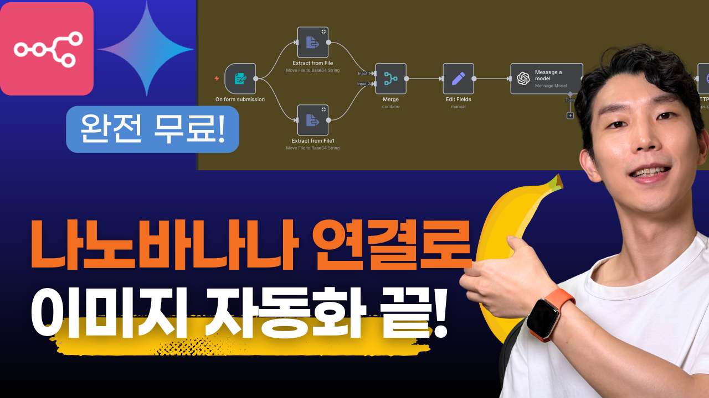
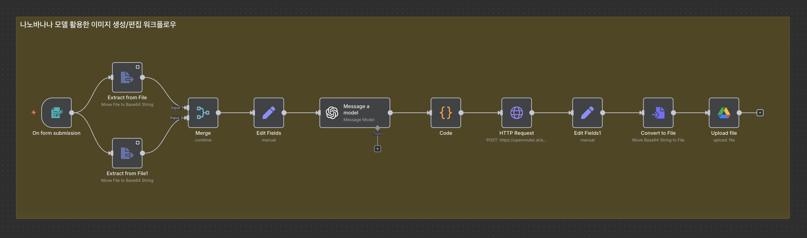

# n8n으로 구글 나노바나나(Gemini 2.5 Flash) 이미지 편집 자동화 가이드



구글의 최신 AI 모델인 Gemini 2.5 Flash(나노바나나)를 n8n과 연결하여 이미지 편집부터 파일 업로드까지 완전 자동화하는 시스템 구축 가이드입니다.

## 목차

- [나노바나나란?](#나노바나나란)
- [OpenRouter 소개 및 설정](#openrouter-소개-및-설정)
- [시스템 개요](#시스템-개요)
- [사전 준비사항](#사전-준비사항)
- [워크플로우 구축 단계](#워크플로우-구축-단계)
  - [1. 폼 입력 설정](#1-폼-입력-설정)
  - [2. 이미지 데이터 추출](#2-이미지-데이터-추출)
  - [3. 데이터 병합](#3-데이터-병합)
  - [4. 이미지 존재 여부 확인](#4-이미지-존재-여부-확인)
  - [5. AI 프롬프트 생성](#5-ai-프롬프트-생성)
  - [6. 나노바나나 연결](#6-나노바나나-연결)
  - [7. 결과 이미지 처리](#7-결과-이미지-처리)
  - [8. 구글 드라이브 업로드](#8-구글-드라이브-업로드)
- [테스트 및 활용](#테스트-및-활용)
- [주의사항 및 팁](#주의사항-및-팁)

## 나노바나나란?

**나노바나나**는 구글의 Gemini 2.5 Flash Image 모델의 별명으로, 최근 AI 업계에서 가장 주목받고 있는 이미지 편집 모델입니다.

### 주요 특징
- **뛰어난 성능**: 기존 이미지 생성 모델 대비 월등한 벤치마크 스코어
- **빠른 속도**: ChatGPT보다 빠른 처리 속도
- **우수한 품질**: AI 커뮤니티에서 높은 평가를 받는 이미지 편집 품질
- **자연스러운 편집**: 기존 이미지의 스타일 변경, 레퍼런스 기반 새 이미지 생성 등

### 접근 방법
- **Google AI Studio**: 무료 테스트 가능
- **Google API**: 유료 서비스
- **OpenRouter**: 현재 무료로 제공 중

## OpenRouter 소개 및 설정

[OpenRouter](https://openrouter.ai/)는 다양한 AI 모델을 하나의 플랫폼에서 통합 관리할 수 있는 서비스입니다. AI 모델들의 구글플레이/앱스토어 같은 개념이라고 생각하시면 됩니다.

### OpenRouter 설정 방법

1. **회원가입**
   - [OpenRouter 웹사이트](https://openrouter.ai/)에서 계정 생성

2. **API 키 발급**
   - 대시보드에서 API 키 생성
   - 생성된 키를 안전하게 저장

3. **모델 확인**
   - `google/gemini-2.5-flash-image-preview:free` 모델이 무료로 제공되는지 확인

## 시스템 개요

이 자동화 시스템은 다음과 같은 프로세스로 작동합니다:

1. **입력**: 폼을 통해 레퍼런스 이미지, 원본 이미지, 편집 요청사항 입력
2. **프롬프트 최적화**: AI가 나노바나나에 최적화된 편집 프롬프트 생성
3. **이미지 편집**: 나노바나나가 이미지 편집 수행
4. **파일 처리**: 편집된 이미지를 파일로 변환
5. **업로드**: 구글 드라이브에 최종 결과물 자동 업로드

## 사전 준비사항

### 1. API 키 준비
- **OpenRouter API 키**: OpenRouter에서 발급받은 API 키
- **OpenAI API 키**: GPT-4.1 모델 사용을 위한 API 키 (프롬프트 최적화용)

### 2. Google 서비스 설정
- **Google Drive API**: Google Cloud Console에서 Drive API 활성화
- **OAuth 인증**: Google Drive 접근을 위한 OAuth 설정
- [Oauth 설정 참고 영상](https://youtu.be/VlsgHC5xkPA?si=p9pJRH7QsCU4RM5D&t=593)


### 3. n8n 환경
- n8n이 로컬 또는 서버에 설치되어 있어야 합니다

## 워크플로우 구축 단계



### 1. 폼 입력 설정

**Form 트리거 노드 추가**
- Form Title: "나노바나나 이미지 편집"
- Form Description: "이미지 편집에 필요한 정보를 입력해주세요"

**Form Elements 설정**
```
Reference Image (파일): 레퍼런스 이미지 업로드 [선택사항]
Original Image (파일): 편집할 원본 이미지 업로드 [선택사항]
Request (텍스트): 편집 요청사항 입력 [필수]
```

### 2. 이미지 데이터 추출

**첫 번째 Extract from File 노드 (레퍼런스 이미지용)**
- Binary Property: `Reference_image`
- Extract to: `reference_data`
- Settings > Always Output Data: 활성화

**두 번째 Extract from File 노드 (원본 이미지용)**
- Binary Property: `Original_image`
- Extract to: `original_data`
- Settings > Always Output Data: 활성화

### 3. 데이터 병합

**Merge 노드 추가**
- Mode: Combine
- Combine: Position
- 두 Extract from File 노드의 출력을 병합

### 4. 이미지 존재 여부 확인

**Edit Fields 노드 추가**
새로운 필드 생성:
- 필드명: `image_exist`
- 값:
```javascript
{{
  $('Merge').item.json.reference_data
    ? "reference image exists"
    : ( ($('Merge').item.json.Original_data || $('Merge').item.json.original_data)
        ? "source image exists"
        : "image does not exist"
      )
}}
```

### 5. AI 프롬프트 생성

**OpenAI 노드 추가 (GPT-4.1 사용)**

**시스템 메시지:**
```
You are an image generation/editing prompt engineer. Your job is to output exactly ONE English prompt text.
The prompt should be written as a natural paragraph (or a few sentences), not as separated sections.
However, you must incorporate the key aspects of the template when relevant: goal, input resources, scene description, style/reference, composition/camera, lighting/mood, edit instructions, output specs, and negative prompts.
Only include elements that are necessary; omit missing ones naturally.
Do not output explanations, markdown, or quotation marks.

Branching rules:

Case 1 (reference image exists): Write a prompt that edits the source image to match the style, mood, colors, and composition of the reference image. Mention that the reference image guides the overall style transfer.

Case 2 (source image exists): Write a prompt that edits the source image according to the text instructions, describing the intended outcome clearly.

Case 3 (image does not exist): Write a prompt that creates a new image directly based on the text instructions. Formulate it as a descriptive generation prompt rather than an edit.

Important:

Always add a short negative instruction like: "Avoid distorted fingers, broken text, or unwanted artifacts."

Output only the final natural-language prompt, nothing else.
```

**유저 메시지:**
```
Generate a single English image generation/editing prompt based on the following form inputs. 
Follow the branching rules from the system prompt. 
The output must be a natural paragraph (not separated by sections) but should include the relevant aspects if available.
Output only the final structured prompt text.

- image_availability: {{ $json.image_exist }}
- edit_instructions_text: {{ $('On form submission').item.json.Request }}
```

### 6. 나노바나나 연결

**Code 노드 추가 (유연한 요청 처리)**
```javascript
// Code node: Run Once for All Items / JavaScript

// 1) Read the user prompt (fallback if missing)
const text =
  ($json?.message && $json.message.content) ||
  "Edit the source image using reference style if available. Avoid distorted fingers, broken text, or unwanted artifacts.";

// 2) Pull items from other nodes (ADJUST names!)
const refItems = $items("Extract from File", 0, 0);   // node with reference image
const srcItems = $items("Extract from File1", 0, 0);  // node with source image

const ref = refItems?.[0]?.json?.reference_data;
const refName = refItems?.[0]?.json?.fileName || "";  // optional filename for MIME detection

const src = srcItems?.[0]?.json?.Original_data ?? srcItems?.[0]?.json?.original_data;
const srcName = srcItems?.[0]?.json?.fileName || "";  // optional filename for MIME detection

// 3) Helper: guess MIME from filename or fallback
function guessMime(name, fallback = "image/png") {
  const lower = name.toLowerCase();
  if (lower.endsWith(".jpg") || lower.endsWith(".jpeg")) return "image/jpeg";
  if (lower.endsWith(".png")) return "image/png";
  if (lower.endsWith(".webp")) return "image/webp";
  return fallback;
}

// 4) Helper: wrap base64 in data URL
function toDataURL(b64, mime = "image/png") {
  if (!b64) return null;
  return b64.startsWith("data:") ? b64 : `data:${mime};base64,${b64}`;
}

// 5) Build content array
const contents = [{ type: "text", text }];

// add reference image if exists
if (ref) {
  contents.push({
    type: "image_url",
    image_url: { url: toDataURL(ref, guessMime(refName)) },
  });
}

// add source image if exists
if (src) {
  contents.push({
    type: "image_url",
    image_url: { url: toDataURL(src, guessMime(srcName)) },
  });
}

// 6) Final body
const body = {
  model: "google/gemini-2.5-flash-image-preview:free",
  messages: [
    {
      role: "user",
      content: contents,
    },
  ],
};

// 7) Return in n8n shape
return [{ json: body }];
```

**HTTP Request 노드 추가**
- Method: `POST`
- URL: `https://openrouter.ai/api/v1/chat/completions`
- Authentication: Predefined Credential Type으로 OpenRouter API 키 설정
- Headers: `Content-Type: application/json`
- Body: `{{ $json }}`

### 7. 결과 이미지 처리

**Edit Fields 노드 추가 (base64 데이터 추출)**
- 필드명: `base`
- 값: `{{ $json.choices[0].message.images[0].image_url.url.split(",")[1] }}`

**Convert to File 노드 추가**
- Mode: Text to Binary
- Input Data: `base`
- Binary Property Name: `data`

### 8. 구글 드라이브 업로드

**Google Drive 노드 추가**
- Operation: Upload a file
- Binary Data: `data`
- Name: `edited_image_{{ new Date().getTime() }}.png`
- Parents: 원하는 폴더 선택

## 테스트 및 활용

### 테스트 예시

1. **스타일 변환**
   - 레퍼런스 이미지와 원본 이미지 업로드
   - 요청: "레퍼런스 이미지 스타일로 원본 이미지를 변환해줘"

2. **배경 변경**
   - 원본 이미지만 업로드
   - 요청: "배경을 AI/자동화에 어울리는 느낌으로 변경해줘"

3. **새 이미지 생성**
   - 이미지 없이 텍스트만 입력
   - 요청: "시민개발자 구씨 브랜드의 로고를 생성해줘"

### 활용 사례

- **블로그/SNS 콘텐츠**: 일관된 브랜드 이미지로 자동 변환
- **마케팅 자료**: 다양한 스타일의 제품 이미지 생성
- **썸네일 제작**: 유튜브 등 영상 플랫폼용 썸네일 자동 생성

## 주의사항 및 팁

### 제한사항
1. **이미지 크기**: 큰 이미지는 context limit에 걸릴 수 있으므로 적절한 크기로 리사이징 권장
2. **사용량 한도**: 무료 버전에는 일일 사용량 제한이 있음
3. **한글 처리**: 한글 텍스트가 포함된 이미지는 제대로 생성되지 않을 수 있음

### 최적화 팁
1. **프롬프트 조정**: 결과가 만족스럽지 않다면 시스템 프롬프트를 상황에 맞게 수정
2. **케이스별 분리**: 자주 사용하는 경우 Switch 노드로 케이스별 처리 고려
3. **오류 처리**: HTTP Request 노드에 오류 처리 로직 추가 권장


이 가이드를 통해 구글의 나노바나나를 활용한 강력한 이미지 편집 자동화 시스템을 구축할 수 있습니다. 개인 브랜딩부터 비즈니스 마케팅까지, 다양한 용도로 활용해보세요! 🚀

## 참고 자료

- [OpenRouter 공식 사이트](https://openrouter.ai/)
- [Google 나노바나나 API 문서](https://ai.google.dev/gemini-api/docs/image-generation?hl=ko#image_generation_text-to-image)
- [n8n 공식 문서](https://docs.n8n.io/)
