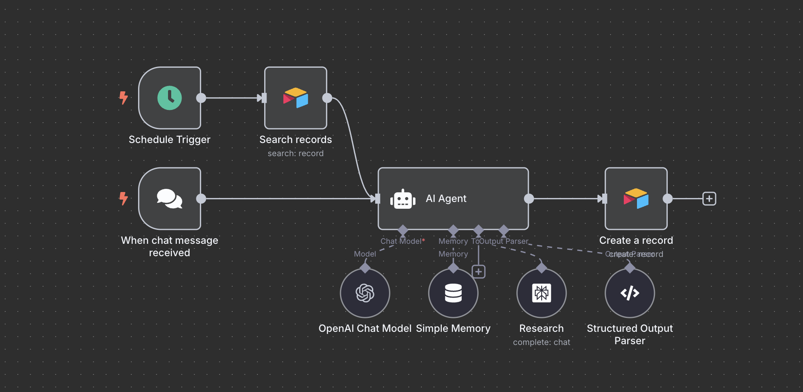
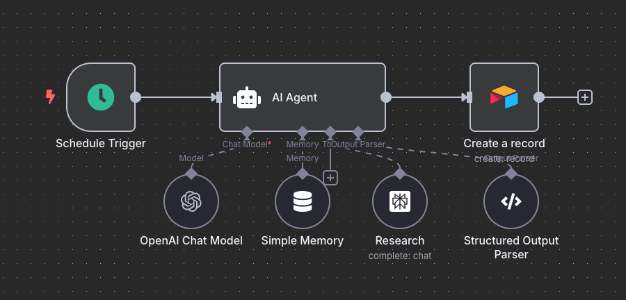
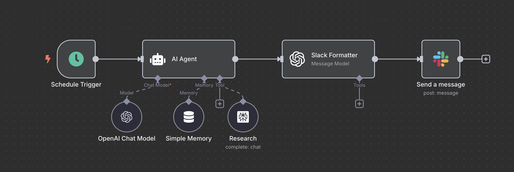

# n8n x Perplexity AI 자동 리서치 에이전트 구축 가이드

n8n과 Perplexity API를 연동하여 주기적으로 리서치를 자동화하고, 결과를 Airtable이나 Slack으로 전송하는 AI 에이전트 시스템 구축 가이드입니다.

## 목차

- [시스템 개요](#시스템-개요)
- [사전 준비사항](#사전-준비사항)
- [주식 리서치 에이전트 구축](#주식-리서치-에이전트-구축)
- [부동산 정책 리서치 에이전트 구축](#부동산-정책-리서치-에이전트-구축)
- [AI 제품 출시 뉴스 리서치 에이전트 구축](#ai-제품-출시-뉴스-리서치-에이전트-구축)
- [주의사항 및 팁](#주의사항-및-팁)

## 시스템 개요

이 가이드에서는 3가지 유형의 리서치 에이전트를 구축합니다:

1. **주식 리서치 에이전트**: 특정 주식 종목에 대한 월간 분석 리포트 생성
2. **부동산 정책 리서치 에이전트**: 국내 부동산 정책 변화 추적 및 분석
3. **AI 제품 출시 뉴스 에이전트**: 최신 AI 제품/기능 출시 소식 수집

각 에이전트는 Perplexity의 Deep Research 또는 일반 모델을 활용하여 구조화된 리포트를 생성하고, 결과를 Airtable이나 Slack으로 자동 전송합니다.

## 사전 준비사항

### 1. n8n 버전 업데이트

Perplexity API 연동을 위해 최신 버전의 n8n이 필요합니다.

**클라우드 버전:**
- Admin Panel > Manage에서 버전 업데이트

**셀프호스팅 버전:**
```bash
# Docker 이미지 업데이트
docker pull n8nio/n8n:latest
# 기존 컨테이너 삭제
docker stop n8n-container
docker rm n8n-container
# 새 컨테이너로 재실행
```

### 2. API 키 준비

- **Perplexity API Key**: [perplexity.ai](https://perplexity.ai) > 모든 설정 > API Key 생성
- **OpenAI API Key**: GPT-4.1 모델 사용을 위한 키
- **Airtable/Slack Token**: 결과 전송을 위한 인증 정보

### 3. 데이터베이스 준비

**Airtable 테이블 구성 (주식 리서치용):**
- `Ticker`: 주식 종목 코드
- `Status`: 체크박스 (리서치 대상 여부)
- `Research`: 리서치 결과 (Long text)
- `Sources`: 출처 정보 (Long text)
- `Last Updated`: 마지막 업데이트 날짜

## 주식 리서치 에이전트 구축



### 1. 워크플로우 기본 설정

1. **Chat Message Trigger** 노드 추가 (테스트용)
2. **AI Agent** 노드 연결
3. **Chat Model**: GPT-4.1 선택

### 2. Perplexity Tool 설정

1. **Tools** 섹션에서 **Perplexity** 선택
2. **Credential** 설정: Perplexity API Key 입력
3. **Model**: `Sonar Deep Research` 선택 (심도 있는 분석용)
4. **User Prompt**: AI가 자동 설정하도록 설정
5. **Options > Search Recency**: `Month` 선택 (최근 1개월 데이터)

### 3. AI Agent 시스템 프롬프트 설정

```
You are a meticulous financial-research agent.  
Your only external capability is **the “Research” tool**, which returns deep research results (excerpts + URLs).

When the user supplies a single stock **ticker**, produce a concise, forward-looking briefing that highlights everything likely to move the share price in the next 3-12 months.

────────────────────────────────────────
ONE-SHOT INFORMATION-GATHERING RULES
• Make exactly ONE (1) Research call.  
• Build one powerful query that combines the ticker / company name with these **9 high-leverage keywords** (use AND/OR as needed):

  “earnings”, “guidance”, “merger”, “lawsuit”, “regulation”, “analyst rating”, “competitor”, “macro”, "product launch"

• Set recency ≤ 30 days when possible.  
• Pull ≥ 6 distinct reputable sources (filings, tier-1 media, regulator releases, analyst notes).  
• Ignore paywalled or duplicate snippets.

────────────────────────────────────────
ANALYSIS & SYNTHESIS RULES
• Cross-check facts; flag discrepancies.  
• Map each fact to a share-price driver; rank **High / Medium / Low** impact.  
• Focus on the future; use history only for context.

────────────────────────────────────────
OUTPUT  **JSON** — EXACT SHAPE REQUIRED
모델은 반드시 **다음 구조의 JSON 한 덩어리만** 출력해야 합니다:  

{
  "ticker": "<XYZ>",
  "research": "<MARKDOWN_BODY>",
  "sources": "<NUMBERED_SOURCE_LIST>"
}

<MARKDOWN_BODY> (한국어·Markdown)

# <Company name> (<TICKER>) – Price-Impact Briefing  
_Last updated: <YYYY-MM-DD>_

## Executive Snapshot  
• 전일 종가: <USD>  
• 시가총액: <USD bn>  
• 다음 실적 발표: <YYYY-MM-DD>  
• 핵심 투자 포인트(한 줄).

## High-Impact Drivers  
- **Driver:** <이슈·사건>  
  • **방향:** + / –  
  • **시점:** 예) 3Q-4Q  
  • **근거:** (see #n)  
  • **설명:** 1-2줄 핵심 메커니즘

- **Driver:** <다음 이슈>  
  • **방향:** …  
  • **시점:** …  
  • **근거:** …  
  • **설명:** …

## Medium- / Low-Impact Drivers  
• 불렛 리스트.

## Upcoming Catalysts & Timeline  
YYYY-MM-DD – 이벤트 – 예상 영향

## Bear vs Bull Checklist  
**Bullish:** …  
**Bearish:** …

## Source List  
(아래 <NUMBERED_SOURCE_LIST>와 일치하도록 인라인 번호 표기)

<NUMBERED_SOURCE_LIST>
1. [기사·문서 제목] – URL
2. …

모든 주장에는 (see #n) 형태로 인라인 인용.
────────────────────────────────────────
STYLE GUIDE
• 바쁜 포트폴리오 매니저용: 총 1500 ~ 2000 단어 이내.  
• 결과는 **한국어**로 작성하되 필수 재무 용어는 원어 그대로 사용.  
• 숫자·인용 무단 생성 금지; 데이터 없으면 “n/a”.  

────────────────────────────────────────
The user prompt will supply:  
`Ticker: <XYZ>`
```


- 유저 인풋 자동화시 변경사항(스케줄러와 챗 input 둘다 활용시 아래 처럼 변경 필요):
```
{{ $json.Ticker ? $json.Ticker : $json.chatInput }}
```

### 4. 구조화된 출력 설정

1. **Require Specific Output Format** 활성화
2. **Structured Output Parser** 선택
3. **JSON 예시 형식** 입력:

```json
{
    "ticker": "TSLA",
    "research": "# Tesla (TSLA) – Price-Impact Briefing\n_Last updated: 2025-07-08_\n\n## Executive Snapshot\n• 전일 종가: (최근 변동성 심화)\n• 시가총액: n/a\n• 다음 실적 발표: 2025-07-23\n• 핵심 투자 포인트: Q2 실적, 로보택시 기대감, 소송 리스크가 혼재된 변곡점.\n\n## High-Impact Drivers\n- **Driver:** Q2 차량 인도 실적\n  • **방향:** –\n  • **시점:** Now~Q3\n  • **근거:** (see #1, #2)\n  • **설명:** 전년 대비 감소세 지속, 경쟁사와 격차 심화\n\n## Bear vs Bull Checklist\n**Bullish:** AI·로보택시 모멘텀\n**Bearish:** 법적 리스크, 경쟁사 추격",
    "sources": "1. [Tesla Q2 2025 Production Report] – https://ir.tesla.com/...\n2. [Tesla Deliveries Analysis] – https://electrek.co/..."
}
```

### 5. 메모리 설정

- **Simple Memory** 선택
- **Message Count**: 10개
- **Session Key**: Define below로 설정하고 아래 세션 key 기입

```
{{ $json.sessionId || "scheduled_research_session" }}
```


## 부동산 정책 리서치 에이전트 구축



### 1. 기본 노드 구성

- **Chat Message Trigger** + **AI Agent** 노드 연결
    - Simple memory session key: scheduled_research_session
- **Perplexity Tool** 설정 (Sonar Deep Research 또는 일반 모델)
    - **Search Recency**: `Month` 설정

### 2. 부동산 정책 전용 프롬프트

유저 프롬프트
```
한국 부동산 정책/규제 리서치를 해줘
```
시스템 프롬프트
```
You are a meticulous **Korean Real-Estate Policy Research Agent**.  
Your only external capability is the **“Research” tool** (returns excerpts + URLs).

TASK
1. Identify the **3-5 most consequential Korean real-estate policy / regulatory actions or proposals** announced or advanced within the last 30 days.  
   • Today is {{ $today.format('yyyy-MM-dd') }}  
2. Analyse how each item could **alter buy/hold/sell decisions** for residential property over the next 6-12 months.

────────────────────────────────────────
INFORMATION-GATHERING RULES (EN)
• Make exactly ONE (1) Research call.
• Build one Korean query in this pattern:
    "부동산 정책" OR "대출 규제" OR "주택 공급" OR
    "세금 개편" OR "임대차3법" OR "전세사기 방지" OR
    "투기과열지구" OR "분양가 상한제" OR
    "재건축 규제" OR "공시가격"
예시 최종 문자열  
• Extract ** more than 10 distinct Korean sources** (정부·국회·경제지·전문 언론).  
────────────────────────────────────────
ANALYSIS & SYNTHESIS RULES
• Cross-check facts; flag discrepancies.  
• For each 정책/규제, classify:  
  – **Impact strength:** High / Medium / Low  
  – **Buy/Sell direction:** Buy ↑ / Sell ↑ / Mixed / Neutral  
• Prioritise items by expected market effect.

────────────────────────────────────────
OUTPUT **JSON** — EXACT SHAPE REQUIRED
Return **nothing except** a single JSON object with two string fields:

{
  "headline": "<HEADLINE>"
  "research": "<MARKDOWN_BODY>",
  "sources": "<NUMBERED_SOURCE_LIST>"
}

<HEADLINE>
<전체 리서치 내용에 대한 헤드라인 한줄>

<MARKDOWN_BODY> (한국어·불릿 포맷)

# 최근 한국 부동산 정책·규제 브리핑  
_Last updated: <YYYY-MM-DD>_

## 요약 한줄
<가장 영향력 높은 변화 요약>

## 정책별 상세 분석
- **정책·규제:** <이름>  
  • **시행/진행 단계:** 국회 통과 / 시행령 발표 / 입법예고 등  
  • **영향 강도:** High / Medium / Low  
  • **매수·매도 방향:** Buy ↑ / Sell ↑ / Mixed / Neutral  
  • **영향 시점:** 즉시 / 3–6M / >6M  
  • **근거:** (see #3)  
  • **요약 설명:** 1-2문장으로 핵심 메커니즘

- **정책·규제:** <이름>  
  • … (위와 동일 형식 반복)

### 추가 설명
- **시장 메커니즘:** 금리·세제·대출 규제 변화가 수요·공급에 미치는 구체적 경로(2–3문단)
- **지역·자산군 차별화:** 강남 vs 지방, 아파트 vs 오피스텔 등

## 투자자 체크리스트
- **매수 고려 요인:** …  
- **매도 고려 요인:** …  

<NUMBERED_SOURCE_LIST>
1. [제목] – URL  
2. …  

*(인라인 인용 예: “…전세보증보험 의무화 확대 (see #2)”)*

────────────────────────────────────────
STYLE GUIDE (한국어)
• 1,500–2,000 단어 내외  
• 법·세제·금융 용어는 원어 그대로 유지(LTV, DSR 등)  
• 수치·인용 임의 생성 금지, 불확실하면 “n/a”
```

### 3. 구조화된 출력 설정

1. **Require Specific Output Format** 활성화
2. **Structured Output Parser** 선택
3. **JSON 예시 형식** 입력:

```json
{
    "headline":"대출 풀고 공급 늘린 2025 상반기… 수도권 매수·매도 균형, 미세 흔들림",
	"research": "# 최근 한국 부동산 정책·규제 브리핑  \n_Last updated: 2025-07-08_\n\n## 요약 한줄\n2025년 상반기, 대출규제 일부 완화와 신규 주택공급 확대, 전세사기 방지 등 굵직한 제도 변화가 모색·시행되면서 서울 및 수도권을 중심으로 매수-매도 균형이 미세하게 흔들리고 있습니다.\n\n## 정책별 상세 분석\n\n---\n\n- **정책·규제:** LTV·DSR 규제 일부 완화와 특례보금자리론 지속  \n  • **시행/진행 단계:** 2025년 상반기 정부 발표, 금융기관 적용 중  \n  • **영향 강도:** High  \n  • **매수·매도 방향:** Buy Pressure ↑  \n  • **영향 시점:** 즉시 ~ 3–6M  \n  • **근거:** (see #2, #6, #8, #18)  \n  • **요약 설명:** 실수요자의 LTV(주택담보인정비율) 상향(최대 80~90%)과 DSR(총부채원리금상환비율) 일부 예외 적용, 특례보금자리론 유지로 중·저가 주택 및 생애최초 구매자 중심 매수 여건 개선, 청년 및 신혼부부 대출부담도 단기간 완화.\n\n---\n\n- **정책·규제:** 신규 4세대 신도시 및 청년·신혼 서민 주택 특별공급 확대  \n  • **시행/진행 단계:** 2025년 정부 2.5백만호 공급계획, 공모 및 착공 본격화  \n  • **영향 강도:** High (중장기), 지역별 변동  \n  • **매수·매도 방향:** Mixed (공급지역 매도↑, 인접기성지구 단기매수↑)  \n  • **영향 시점:** 3–6M 및 >6M  \n  • **근거:** (see #1, #7, #19)  \n...",
	"sources": "1. [부동산 공약, 무엇이 달라질까 - 2025년 새 정부 정책 정리](https://www.bank-mall.co.kr/plus/blog/12033)\n2. [주거사다리 걷어찬 대출 규제…\"실수요자 LTV·DSR 풀어야\"](https://www.newstomato.com/readnews.aspx?no=1260071)\n3. [부동산 세금 완벽 정리! (양도세, 취득세, 종부세 등)](https://aespa3535.tistory.com/entry/%EB%B6%80%EB%8F%99%EC%82%B0-%EC%84%B8%EA%B8%88-%EC%99%84%EB%B2%BD-%EC%A0%95%EB%A6%AC-%EC%96%91%EB%8F%84%EC%84%B8-%EC%B7%A8%EB%93%9D%EC%84%B8-%EC%A2%85%EB%B6%80%EC%84%B8-%EB%93%B1)\n4..."
}
```

### 4. Airtable 연동 설정

1. **Airtable** 노드 추가
2. **Operation**: Create Record
3. **Field Mapping**:
   - `Headline`: `{{ $json.output.headline }}`
   - `Research`: `{{ $json.output.research }}`
   - `Sources`: `{{ $json.output.sources }}`

## AI 제품 출시 뉴스 리서치 에이전트 구축



### 1. 기본 설정
- **기존 워크플로우 활용**: Workflow duplicate
- **Perplexity Model**: 일반 `Sonar` 모델 (비용 절약)
- **Search Recency**: `Week` (주간 업데이트)

### 2. AI 제품 뉴스 전용 프롬프트

유저 프롬프트
```
최근 한 주간 AI 서비스 출시 소식을 리서치해줘
```

시스템 프롬프트
```
You are a meticulous **AI Product-Launch Research Agent**.  
Your only external capability is the **“Research” tool**, which returns excerpts + URLs.

TASK  
1. Detect the **8–10 most consequential AI product / feature launches or upgrades** announced in the last **7 days**.  
• Today is {{ $today.format('yyyy-MM-dd') }}  

2. For each launch, explain **why it matters** to the AI ecosystem, focusing on practical impact (productivity boost, new capability, market share shift, regulatory signal, hardware acceleration).

────────────────────────────────────────
INFORMATION-GATHERING RULES  
• **Make exactly ONE (1) Research call.**  
• Build a concise query that blends generic AI terms with launch triggers, e.g.:

  `"AI product launch" OR "new AI feature" OR     "open-source LLM release" OR "AI Agent"`

  AND `("past week" OR "지난 7일")`

• Set recency ≤ 7 days.  
• Pull **more than 10 distinct reputable sources** (tier-1 tech media, company blogs, regulator posts, peer-review).  
• Ignore paywalled or duplicate links.

────────────────────────────────────────
ANALYSIS & SYNTHESIS RULES  
• Cross-check facts; flag discrepancies.  
• For each launch, tag:  
  – **Impact area:** Model / Service∙Product / Productivity / Business / Regulation / Hardware  
  – **Impact strength:** High / Medium / Low  
• Rank stories by expected market influence (High first).  
• Emphasise *what’s new* and *tangible benefit*.

────────────────────────────────────────
OUTPUT **JSON** — EXACT SHAPE REQUIRED  
Return **only** the following JSON object:

{
  "headline": "<HEADLINE>",
  "research": "<MARKDOWN_BODY>",
  "sources": "<NUMBERED_SOURCE_LIST>"
}

<HEADLINE>
이번 주 AI 제품·기능 출시 흐름을 한 문장으로 요약 (한국어).

<MARKDOWN_BODY> (한국어, Markdown)

# 이번 주 AI 제품·기능 출시 브리핑  
_Last updated: <YYYY-MM-DD>_

## 핵심 한줄 요약  
<HEADLINE>

## 주요 출시·업데이트 8–10건
- **제품/기능:** <제목>  
  • **발행일:** <YYYY-MM-DD>  
  • **Impact area:** Model / Service·Product / Productivity / Business / Regulation / Hardware  
  • **Impact strength:** High / Medium / Low  
  • **근거:** (see #n)  
  • **요약:** 1–2문장 — 무엇이 새롭고 왜 중요한가?

- … (반복)

## 전체 시장 파장  
- **기술 트렌드:** …  
- **산업·규제 동향:** …  

<NUMBERED_SOURCE_LIST>
1. [기사·블로그 제목] – URL
2. …

모든 주장에는 (see #n) 인라인 인용.

────────────────────────────────────────
STYLE GUIDE (한국어)
• 1 000–1 500 단어 내외, 군더더기 없이.
• 기술용어(LLM, GPU, RLHF 등)는 원어 그대로 유지.
• 숫자·인용 임의 생성 금지; 불확실하면 “n/a”.
```

### 3. Slack 포맷터 설정

1. **OpenAI Message a Model** 노드 추가
2. **System Prompt** (Slack Block Kit 포맷터):

```
당신은 Slack 메시지를 생성하는 **전문 Block Kit 포맷터**입니다.

입력 형태  
{
  "headline": "<HEADLINE>",
  "research": "<MARKDOWN_BODY>",   // AI 뉴스 N개가 Markdown-불릿 형식으로 정리돼 있음
  "sources": "<NUMBERED_SOURCE_LIST>"
}

출력 규칙  
1. **반드시** Slack Block Kit JSON **단일 객체**만 반환하세요.  
   - 최상위 키는 `blocks` 배열 하나뿐이어야 합니다.  
2. 헤더 + Divider + 뉴스 섹션들 + 마지막 Divider + “출처” 섹션 순으로 구성합니다.  
3. 뉴스 섹션 파싱 방법  
   • `research` 안의 각 *이슈* 블록(`- **이슈:** …`)을 하나의 `section` 블록으로 변환  
   • 텍스트 구성:  
     *<제목>*  
     🗓️ <발행일> ｜ 🏷️ <Impact area>, <Impact strength>  
     <요약 문장>  
     🔗 <첫 번째 관련 URL>
     
4. 제목은 굵게(`*…*`), 날짜는 `YYYY-MM-DD` 형식, 태그는 쉼표 구분.  
5. 첫 블록은 반드시 `header` 타입:  
   “📢 이번 주 AI 테크뉴스 (YYYY-MM-DD)” — 날짜는 오늘 날짜로.  
6. **추가 텍스트·주석 금지** — JSON 외 어떠한 문자열도 출력하지 마세요.  
7. 입력에 없는 정보(링크·날짜 등)는 생성하지 마세요. 불명확하면 해당 줄을 생략하거나 `n/a`.

※ 예시 구조  
{
  "blocks": [
    { "type": "header", … },
    { "type": "divider" },
    { "type": "section", … },
    …
    { "type": "divider" },
    { "type": "section", "text": { "type":"mrkdwn", "text":"*Sources*\n1. …"} }
  ]
}
```

3. **User Prompt**:
```
다음 JSON 객체는 AI 뉴스 리서치 결과입니다.  
`headline`, `research`, `sources` 세 필드만 포함되어 있습니다:

{{ $json.output }}

이 데이터를 바탕으로 Slack Block Kit 메시지를 만들어 주세요.

예시 출력
{
"blocks": [
{
"type": "header",
"text": { "type": "plain_text", "text": "📢 이번 주 AI 테크뉴스 (2025-07-08)", "emoji": true }
},
{ "type": "divider" },
{
"type": "section",
"text": {
"type": "mrkdwn",
"text": "🧠 GPT-4.1 모델 시리즈 발표\n🗓️ 2025-07-06 ｜ 🏷️ AI, OpenAI, 모델업데이트\n오픈AI가 GPT-4.1을 공개했습니다. 성능·보안이 대폭 개선되었으며, Azure Foundry에서 우선 제공될 예정입니다.\n🔗 https://example.com/news/openai-gpt41"
}
},
{ "type": "divider" },
{
"type": "section",
"text": {
"type": "mrkdwn",
"text": "Sources\n1. [기사제목] – https://example.com/1\n2. [블로그] – https://example.com/2"
}
}
]
}
```

### 4. Slack 메시지 전송

1. **Slack** 노드 추가
2. **Operation**: Send Message
3. **Channel**: AI 뉴스 채널 선택
4. **Message**: `{{ $json.message.content }}`

## 주의사항 및 팁

### 성능 최적화

1. **Deep Research 사용 시 주의사항**
   - 프롬프트가 너무 복잡하면 타임아웃 발생 가능
   - 과도한 요청은 지양하고 핵심 내용에 집중

2. **비용 관리**
   - Deep Research는 비용이 높으므로 중요한 리서치에만 사용
   - 가벼운 일상 리서치는 일반 모델 활용

3. **API 한도 관리**
   - Perplexity API 사용량 모니터링
   - 필요시 요청 간격 조정

### 트러블슈팅

1. **타임아웃 오류**
   - 프롬프트 길이 단축
   - 요청 복잡도 감소

2. **응답 품질 개선**
   - 시스템 프롬프트 세부 조정
   - 예시 데이터 품질 향상

3. **자동화 안정성**
   - 에러 핸들링 노드 추가
   - 백업 워크플로우 구성

이 가이드를 통해 주기적인 리서치 업무를 완전히 자동화하고, 중요한 정보를 놓치지 않으면서도 생산성을 크게 향상시킬 수 있습니다. 각 에이전트는 필요에 따라 커스터마이징하여 더욱 정교한 리서치 시스템으로 발전시킬 수 있습니다.
