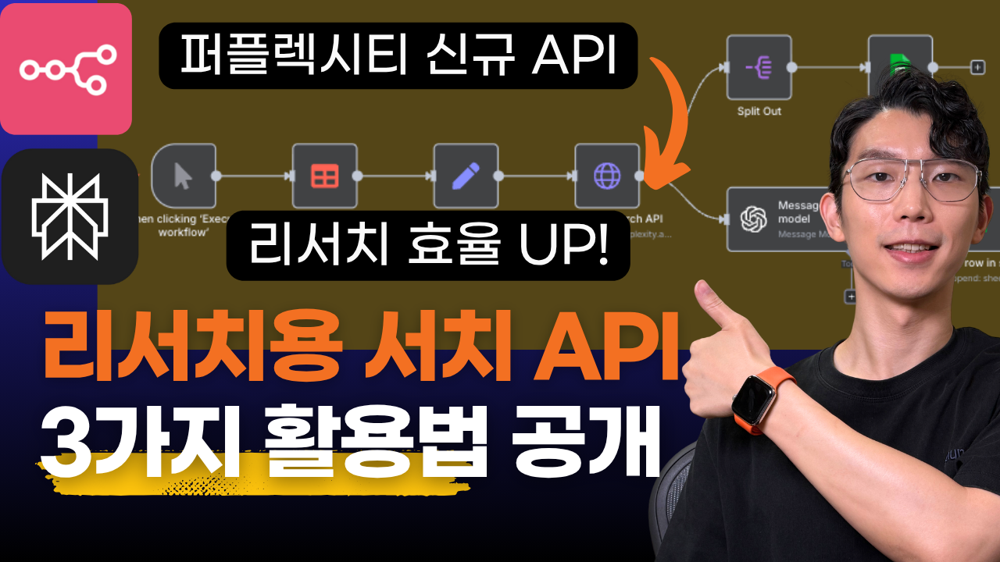
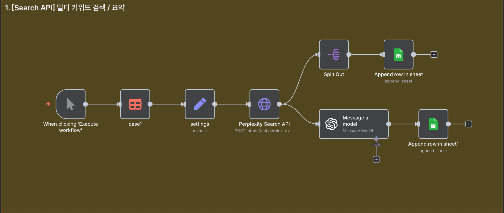
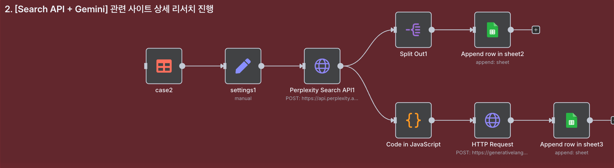
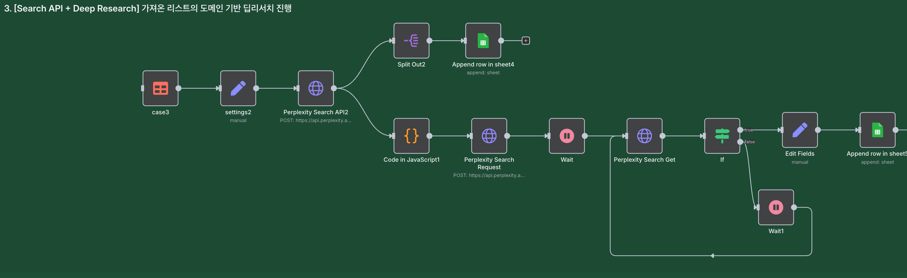

# Perplexity Search API를 활용한 AI 리서치 자동화 가이드



## 📋 목차

- [개요](#개요)
- [기존 AI 리서치의 문제점](#기존-ai-리서치의-문제점)
- [Perplexity Search API 소개](#perplexity-search-api-소개)
- [3가지 활용 패턴](#3가지-활용-패턴)
- [케이스 1: Multi-Query 뉴스 수집](#케이스-1-multi-query-뉴스-수집)
- [케이스 2: 제품 비교 (Search + Gemini)](#케이스-2-제품-비교-search--gemini)
- [케이스 3: Deep Research (도메인 필터링)](#케이스-3-deep-research-도메인-필터링)
- [패턴별 비교 및 선택 가이드](#패턴별-비교-및-선택-가이드)
- [결론](#결론)

---

## 개요

Gemini나 Perplexity로 리서치를 진행할 때, 그럴듯한 답변이 나오지만 실제로 확인해보면 문장별 출처가 불분명하거나 원하지 않는 사이트에서 정보를 가져와 결국 추가 검색이 필요한 경우가 많습니다.

이 가이드는 **AI에게 모든 것을 맡기는 대신, 사람이 구글에서 검색하는 과정을 자동화**하는 방식을 제안합니다. Perplexity Search API를 활용하면 n8n에서 이 모든 과정을 손쉽게 구현할 수 있습니다.

### 왜 리서치 프로세스를 쪼개야 할까?

리서치 작업을 단계별로 나누면 다음과 같은 이점이 있습니다:
- 출처를 직접 관리하고 검증 가능
- 최신 정보를 정확하게 수집
- 재현 가능한 결과 생성
- 환각(hallucination) 위험 감소

---

## 기존 AI 리서치의 문제점

### AI 자율 리서치의 4가지 치명적 단점

**1. 출처 컨트롤 불가**
- 어떤 웹사이트를 참고할지 통제 불가능
- 신뢰도 낮은 블로그나 광고성 기사가 섞일 수 있음
- 각 내용의 정확한 출처 매핑 어려움

**2. 최신 정보 누락**
- 최근 정보 요청 시에도 가장 최신 정보가 누락되는 경우 발생

**3. 재현 불가능**
- 동일한 질문에도 매번 다른 답변 생성
- 소스가 매번 달라져 일관성 부족

**4. 환각 위험**
- 사실이 아닌 내용을 그럴듯하게 생성하는 환각(hallucination) 현상 발생

### 해결책: 검색 과정의 자동화

사람이 리서치할 때의 프로세스를 그대로 자동화:
1. **키워드로 구글 검색**
2. **신뢰할 만한 사이트 선택**
3. **본문 읽고 정보 수집**
4. **여러 자료 종합 정리**

---

## Perplexity Search API 소개

### API 엔드포인트

Perplexity는 두 가지 주요 API를 제공합니다:

**1. Search API (`/search`)**
- 구글처럼 검색만 수행
- URL 리스트와 본문 일부 반환
- 빠르고 비용 효율적

**2. Chat Completions API (`/chat/completions`)**
- 검색 + AI 분석을 한 번에 수행
- Deep Research 모델 사용 가능
- 느리지만 심층 분석 가능

### Search API의 주요 기능

✅ **키워드 직접 지정**: 검색할 키워드를 사용자가 결정
✅ **도메인 필터링**: 신뢰할 수 있는 사이트만 선택 가능
✅ **국가 설정**: 검색할 국가 지정 가능
✅ **URL 리스트 확보**: 참고한 사이트를 투명하게 보존
✅ **본문 내용 추출**: 추출할 본문 길이 조절 가능

📖 **API 문서**: [https://docs.perplexity.ai/api-reference/search-post](https://docs.perplexity.ai/api-reference/search-post)

---

## 3가지 활용 패턴

### 패턴 1: Multi-Query 수집 방식
- **방식**: 여러 키워드로 동시 검색 → 시트에 아카이브 → AI로 요약
- **용도**: 간단한 주제 브리핑, 대량 정보 수집
- **특징**: 빠르고 저렴, 영구 보존 가능

### 패턴 2: URL 수집 + 본문 정독 방식
- **방식**: Search API로 URL 찾기 → Gemini로 각 URL 본문 읽기 → 종합 분석
- **용도**: 제품 비교, 상세 분석
- **특징**: 전체 본문 분석 가능

### 패턴 3: 도메인 발견 + Deep Research 방식
- **방식**: Search API로 신뢰 도메인 찾기 → Deep Research에 도메인 필터 적용
- **용도**: 심층 트렌드 리포트
- **특징**: 최고 품질 분석, 신뢰도 높음

---

## 케이스 1: Multi-Query 뉴스 수집

### 시나리오
AI 브라우저 경쟁에 대한 최신 정보를 다양한 키워드로 검색하고 요약

### 워크플로우 구조



**Click 트리거** → **데이터 테이블** → **Edit Fields** → **Perplexity Search API** → **Split Out** → **Google Sheets (출처 저장)** → **ChatGPT 요약** → **Google Sheets (결과 저장)**

### Step 1: 데이터 테이블 설정

**데이터 테이블 구성**:
- `case`: 케이스 구분 (예: case1)
- `query`: 검색 키워드 (쉼표로 구분)
  ```
  AI browser in 2025, AI browser chatgpt, AI browser gemini, AI browser claude
  ```
- `system_prompt`: AI 분석용 시스템 프롬프트

### Step 2: 검색어 전처리

**Edit Fields 노드 설정**:
```javascript
queries = {{ $json.query.split(',').map(s => s.trim()).filter(Boolean) }}
```

### Step 3: Perplexity Search API 호출

**HTTP Request 노드 설정**:
- Method: `POST`
- URL: `https://api.perplexity.ai/search`

**Headers**:
```
Authorization: Bearer {{YOUR_API_KEY}}
Content-Type: application/json
```

**Body (JSON)**:
```json
{
  "query": {{ $json.queries }},
  "max_results": 10,
  "max_tokens_per_page": 2048
}
```

**주요 파라미터**:
- `query`: 배열 형태로 여러 키워드 동시 검색 가능 (최대 5개)
- `max_results`: 각 쿼리당 최대 결과 수 (최대 20개)
- `max_tokens_per_page`: 각 페이지당 가져올 본문 길이 (2048 토큰)

### Step 4: 결과 저장

**Split Out 노드**:
- Item Lists to Split Out: `results`
- Include: `All Other Fields`

**Google Sheets 노드** (출처 저장):
- Operation: `Append Row`
- Sheet: "리서치출처"
- Columns:
  - 케이스: `{{ $('case1').item.json.case }}`
  - 검색 요청 쿼리: `{{ $('case1').item.json.query }}`
  - 제목: `{{ $json.results.title }}`
  - 출처: `{{ $json.results.url }}`
  - 스니펫: `{{ $json.results.snippet }}`
  - 날짜: `{{ $json.results.date }}`
  - 업데이트 날짜: `{{ $json.results.last_updated }}`

### Step 5: ChatGPT 요약

**OpenAI 노드 설정**:
- Model: `gpt-4.1-mini`

**System Prompt**:
```
[ROLE]
팩트 기반 리서치 에디터. 정확 인용, 중복 제거, 재현성을 최우선으로 한다.

[INPUT SHAPE]
사용자 메시지에 "참고 자료"로 제공되는 항목들은 다음 필드를 포함할 수 있다:
- title, url, source/domain, date(있으면), snippet(있으면)
항목은 [#1], [#2]처럼 번호가 매겨지거나 줄바꿈으로 구분된다.

[HARD RULES]
- 외부 검색/추가 지식 사용 금지. **오직 참고 자료에 포함된 내용만** 근거로 사용한다.
- **지어내지 말 것.** 스니펫에 없는 사실은 단정하지 않는다.
- 서로 유사한 전재/재송고/요약 재게시물은 **중복으로 묶어 하나로** 처리한다.
- 출처 신뢰도는 공식 문서/제품 블로그/헬프센터 > 주요 매체 > 개인 블로그 순으로 본다(단, 제공된 자료 범위 내에서만 판단).
- 불확실하거나 출처 간 상충이 있으면 **"불확실" 또는 "출처 상충"**으로 명시하고 각각에 [#]를 붙인다.

[WORKFLOW]
1) 참고 자료를 파싱해 항목별 핵심 주장·사실·수치·인용 가능 문장을 추출한다(스니펫은 단서로만 사용).
2) 제목/도메인/내용 유사도로 **중복·재송고**를 병합한다.
3) 주제를 구성하는 하위 토픽으로 **클러스터링**(예: 정의/핵심 기능·특징/사용처/가격·제약/보안·통합/사례/한계).
4) 과장 표현은 제거하고, **원문에 있는 정보만** 간결하게 정리한다.

[OUTPUT — 한국어]
- 제목: "<주제> 리서치 브리핑(참고 자료 기반)"
1) **핵심 요약 5줄** — 한 줄에 하나의 사실/포인트, 각 주장 끝에 [#] 인용
2) **핵심 포인트** (불릿 6–10개) — 기능/특징/차별점/제약 등, 각 항목에 [#] 1개 이상
3) **벤더/도구 스냅샷(해당 시)** — 표(열: 이름, 포지셔닝/특징, 주목 포인트, 근거[#])
4) **사용 시 고려사항·리스크 3가지** — 근거 [#]
5) **열린 쟁점/모르는 것 3가지** — "불확실"로 표시, 관련 [#]
6) **참고 자료 목록** — [#] 출처명(도메인), 제목 또는 주제, (날짜가 있으면) 날짜, 링크

[STYLE]
- 간결·정확. 마케팅 문구 제거.
- 날짜·가격 등 수치는 **원문 표기 그대로** 유지(있을 때만).
- 인용은 10~15단어 이내로 짧게, 가능하면 문장 요약으로 대체.
```

**User Prompt**:
```
검색 쿼리: {{ $('case1').item.json.query }}
아래 참고 자료만 근거로 시스템 지시에 따라 브리핑을 작성해줘.
참고 자료: {{JSON.stringify($json.results)}}
```

### Step 6: 결과 저장

**Google Sheets 노드** (결과 저장):
- Operation: `Append Row`
- Sheet: "리서치결과"
- Columns:
  - 케이스: `{{ $('case1').item.json.case }}`
  - 주제: `{{ $('case1').item.json.query }}`
  - 리서치 결과: `{{ $json.message.content }}`

### 케이스 1의 장점
- ✅ 빠른 실행 속도 (모든 키워드 병렬 검색)
- ✅ 비용 효율적
- ✅ 영구 보존 (시트에 원본 데이터 저장)
- ✅ 정확성 (실제 본문 기반 요약)

---

## 케이스 2: 제품 비교 (Search + Gemini)

### 시나리오
n8n과 Make.com 중 어떤 자동화 툴이 더 적합한지 비교 분석

### 워크플로우 구조



**Click 트리거** → **데이터 테이블** → **Edit Fields** → **Perplexity Search API** → **Split Out** → **Google Sheets (출처 저장)** → **Code (URL 추출)** → **Gemini API** → **Google Sheets (결과 저장)**

### Step 1-3: 기본 설정 (케이스 1과 동일)

데이터 테이블에서 case2 설정 값 가져오기 → Edit Fields로 전처리 → Perplexity Search API 호출

**HTTP Request Body**:
```json
{
  "query": {{ $json.queries }},
  "max_results": 5,
  "max_tokens_per_page": 1024
}
```

### Step 4: URL 리스트 추출

**Code 노드 (JavaScript)**:
```javascript
// n8n Code (JavaScript) — Perplexity Search API 결과에서 URL만 뽑아 텍스트 블록 생성

// 1) 현재 입력에서 JSON 추출
const data = $input.first().json;

// 2) 배열 경로 해석: results → results[]
const arr = (data.results && Array.isArray(data.results.results))
  ? data.results.results
  : (Array.isArray(data.results) ? data.results : []);

// 3) URL만 추출 → 공백제거 → 빈값 제거 → 중복 제거 → 상위 20개만
const urls = arr.map(r => (r && r.url) ? String(r.url).trim() : '').filter(Boolean);
const uniq = Array.from(new Set(urls)).slice(0, 20);

// 4) Gemini에 넣을 텍스트 블록 생성
const text = [
  '아래 URL들만 근거로, url_context로 각 본문을 확인하고 시스템 지시에 따라 비교·추천 리포트를 작성해 주세요.',
  '',
  'URL 리스트:',
  ...uniq.map((u, i) => `[#${i+1}] ${u}`)
].join('\n');

// 5) 다음 노드에서 쓸 수 있도록 반환 (필수: 배열 형태)
return [{ json: { source_block: text } }];
```

### Step 5: Gemini로 상세 분석

**HTTP Request 노드** (Gemini API):
- Method: `POST`
- URL: `https://generativelanguage.googleapis.com/v1beta/models/gemini-2.5-flash:generateContent`
- Credential: Predefined > Gemini

**Body (JSON)**:
```json
{
  "system_instruction": {
    "parts": [
      {
        "text": {{JSON.stringify($('settings1').item.json.system_prompt)}}
      }
    ]
  },
  "contents": [
    {
      "parts": [
        {
          "text": {{JSON.stringify($json.source_block)}}
        }
      ]
    }
  ],
  "generationConfig": {
    "temperature": 0.3
  },
  "tools": [
    {
      "url_context": {}
    }
  ]
}
```

**Gemini의 장점**:
- URL을 직접 읽고 분석 가능 (grounding 기능)
- 긴 문서 처리 가능 (2M 토큰 컨텍스트)
- 최신 정보 반영

📖 **Gemini URL Context 문서**: [https://ai.google.dev/gemini-api/docs/url-context](https://ai.google.dev/gemini-api/docs/url-context)

### Step 6: 결과 저장

Google Sheets에 케이스, 주제, 리서치 결과 저장

### 케이스 2의 장점
- ✅ URL이 투명하게 보존되어 검증 가능
- ✅ 전체 문서 내용 기반 분석
- ✅ 더 포괄적이고 상세한 리서치 가능

---

## 케이스 3: Deep Research (도메인 필터링)

### 시나리오
2025년 AI 자동화 시장 트렌드에 대한 심층 분석 리포트 작성 (신뢰할 수 있는 소스만 활용)

### 2단계 전략

**1단계**: Search API로 신뢰 도메인 발견
- 어떤 사이트들이 주제를 다루는지 파악
- 공식 리포트, 대형 매체, 리서치 기관 등 선별

**2단계**: Deep Research에 도메인 필터 적용
- 1단계에서 찾은 사이트만 대상으로
- Deep Research 모델로 심층 분석

### 워크플로우 구조



**Click 트리거** → **데이터 테이블** → **Edit Fields** → **Perplexity Search API** → **Split Out** → **Google Sheets (출처 저장)** → **Code (도메인 추출)** → **Deep Research API (비동기)** → **Wait** → **Deep Research Get** → **If** → **Wait (30초)** → **Loop** → **Google Sheets (결과 저장)**

### Step 1-3: 기본 설정 및 검색

**HTTP Request Body** (Search API):
```json
{
  "query": {{ $json.queries }},
  "max_results": 20,
  "country": "US"
}
```

### Step 4: 고품질 도메인 추출

**Code 노드 (JavaScript)**:
```javascript
// ===== 1) 입력 =====
const data = $input.first()?.json ?? {};
const arr = Array.isArray(data.results?.results)
  ? data.results.results
  : (Array.isArray(data.results) ? data.results : []);

// ===== 2) 기본 허용 도메인(항상 포함) =====
const trustedRootsDefault = [
  'mckinsey.com','stanford.edu','mit.edu','uipath.com',
  'gartner.com','forrester.com','techcrunch.com','venturebeat.com',
  'wired.com','arxiv.org'
];

// 외부에서 allowed_domains 배열이 들어오면 합집합으로 사용
const allowedRaw = Array.isArray(data.allowed_domains)
  ? [...data.allowed_domains, ...trustedRootsDefault]
  : [...trustedRootsDefault];

// ===== 3) 유틸 =====
const normHost = (h) => String(h).toLowerCase().replace(/^www\./,'');
const ensureProtocol = (u) => (/^[a-z]+:\/\//i.test(u) ? u : `https://${u}`);
const sanitize = (s) => String(s).replace(/[\u200B-\u200D\uFEFF]/g,'').trim().replace(/^<|>$/g,'');

const hostFromUrl = (u) => {
  const clean = sanitize(u);
  try {
    return normHost(new URL(ensureProtocol(clean)).hostname);
  } catch {
    return normHost(clean.replace(/^[a-z]+:\/\//i,'').split(/[/?#]/)[0]);
  }
};

// ===== 4) 결과에서 도메인 카운트 =====
const counts = {}; // host -> count
for (const r of arr) {
  const raw = r?.url || r?.href || r?.link || r?.sourceUrl || r?.uri;
  if (!raw) continue;
  const host = hostFromUrl(raw);
  if (!host) continue;
  counts[host] = (counts[host] || 0) + 1;
}

// ===== 5) 허용/다중/상위 도메인 계산 =====
const allowed = Array.from(new Set(allowedRaw.map(normHost)));

// 서브도메인 허용: host가 allowed 루트들로 끝나면 허용 취급
const isAllowed = (host) => allowed.some(root => host === root || host.endsWith('.' + root));

// 2회 이상 등장 도메인
const multi = Object.keys(counts).filter(h => counts[h] >= 2);

// 빈도 순 정렬
const topByCount = Object.keys(counts).sort((a,b) => counts[b] - counts[a]);

// ===== 6) 최종 20개: 허용(루트+서브) → 2회 이상 → 상위 =====
const ordered = [];
const pushUniq = (h) => { if (h && !ordered.includes(h)) ordered.push(h); };

// (a) 허용 루트 자체
allowed.forEach(pushUniq);

// (b) 결과 중 허용에 해당하는 호스트(서브도메인 포함)
Object.keys(counts).filter(isAllowed).forEach(pushUniq);

// (c) 2회 이상 등장
multi.forEach(pushUniq);

// (d) 상위 나머지
topByCount.forEach(pushUniq);

// 최대 20개로 컷
const finalDomains = ordered.slice(0, 20);

// ===== 7) 반환 =====
return [{
  json: {
    domains: finalDomains,             // ["mckinsey.com","hai.stanford.edu", ...] 등
    debug: {
      allowed_roots: allowed,
      total_urls: arr.length,
      sample_counts: Object.fromEntries(
        Object.entries(counts).sort((a,b)=>b[1]-a[1]).slice(0,8)
      )
    }
  }
}];
```

**필터링 로직**:
- 사전 정의한 신뢰 도메인
- 검색 결과에 2번 이상 등장한 도메인
- 나머지 도메인 추가
- 최대 20개로 제한

### Step 5: Deep Research 비동기 요청

**HTTP Request 노드** (Async Deep Research):
- Method: `POST`
- URL: `https://api.perplexity.ai/async/chat/completions`

**Body (JSON)**:
```json
{
  "request": {
    "model": "sonar-deep-research",
    "messages": [
      {
        "role": "system",
        "content": {{JSON.stringify($('settings2').item.json.system_prompt)}}
      },
      {
        "role": "user",
        "content": {{JSON.stringify($('settings2').item.json.queries)}}
      }
    ],
    "max_tokens": 12000,
    "reasoning_effort": "medium",
    "temperature": 0.2,
    "top_p": 0.9,
    "search_domain_filter": {{JSON.stringify($json.domains)}},
    "disable_search": false,
    "enable_search_classifier": false,
    "web_search_options": {
      "search_context_size": "high"
    }
  }
}
```

### Step 6: 대기 및 결과 확인

**Wait 노드**: 240초 대기

**HTTP Request 노드** (결과 확인):
- Method: `GET`
- URL: `https://api.perplexity.ai/async/chat/completions/{{ $json.id }}`

### Step 7: 완료 여부 확인 및 루프

**IF 노드**:
- Condition: `{{ $json.status }}` equals `COMPLETED`
- True: 결과 저장으로 이동
- False: 30초 대기 후 재확인

**루프 구조**:
- Wait 30초 → Deep Research Get → IF → (미완료 시 반복)

### Step 8: 결과 저장

Google Sheets에 최종 분석 결과 저장

### 케이스 3의 장점
- ✅ 신뢰할 수 있는 소스만 활용
- ✅ 고품질 심층 분석
- ✅ 저품질 소스 배제
- ✅ 분석 시간 단축 (도메인 필터링으로 중요 도메인에 집중)

---

## 패턴별 비교 및 선택 가이드

### 패턴 1: Search API + ChatGPT

**방식**:
- Search API로 관련 자료 리스트업
- 출처를 시트에 저장
- ChatGPT로 추출 정보 요약

**용도**: 뉴스 브리핑, 대량 수집

**장점**:
- ⚡ 빠르고 저렴
- 💾 영구 보존 (시트 저장)
- 🎯 정확한 출처 관리

**단점**:
- 📄 본문 일부만 분석 (2048 토큰)

### 패턴 2: Search API + Gemini

**방식**:
- Search API로 관련 자료 리스트업
- 출처를 시트에 저장
- Gemini로 각 URL 직접 확인 및 전체 내용 파악
- 리포트 작성

**용도**: 제품 비교, 상세 분석

**장점**:
- 📖 전체 본문 분석 가능
- ✅ URL 투명성 및 검증 가능
- 🔍 포괄적이고 상세한 리서치

**단점**:
- 💰 Gemini API 비용 발생

### 패턴 3: 도메인 필터 Deep Research

**방식**:
- Search API로 신뢰할 도메인 필터링
- 출처 시트에 저장
- 필터링된 도메인 기반 Deep Research 진행

**용도**: 심층 트렌드 리포트

**장점**:
- 🏆 최고 품질 분석
- 🛡️ 신뢰도 보장
- ⏱️ 일반 Deep Research 대비 시간 단축

**단점**:
- ⏳ 여전히 시간 소요 (10-15분)

### 선택 가이드

| 상황 | 추천 패턴 | 이유 |
|------|----------|------|
| 빠른 주제 브리핑 필요 | 패턴 1 | 속도와 비용 효율성 |
| 제품/서비스 상세 비교 | 패턴 2 | 전체 본문 분석 필요 |
| 심층 산업 트렌드 리포트 | 패턴 3 | 최고 품질의 분석 필요 |
| 예산 제약 있음 | 패턴 1 | 가장 저렴 |
| 출처 검증 중요 | 패턴 1, 2 | 명확한 URL 보존 |

---

## 결론

### 핵심 요약

Perplexity Search API를 활용한 리서치 자동화의 핵심은 **AI에게 모든 것을 맡기는 것이 아니라, 사람이 구글에서 검색하는 과정을 단계별로 자동화**하는 것입니다.

**3가지 핵심 원칙**:

1. **검색 과정 통제**: 키워드, 도메인, 기간을 직접 관리
2. **출처 투명성**: 모든 참고 자료를 시트에 보존
3. **단계별 처리**: 검색 → 저장 → 분석 → 요약으로 분리

### 시스템의 가치

❌ **잘못된 접근**: "AI야, 알아서 찾아와"
- 출처 불명확
- 최신 정보 누락
- 재현 불가능
- 환각 위험

✅ **올바른 접근**: "내가 검색하는 방식을 자동화"
- 출처 명확
- 최신 정보 확보
- 재현 가능
- 신뢰도 향상

### 생산성은 시스템에서 나온다

많은 사람들이 AI에게 리서치를 시키지만, 제대로 된 시스템 없이 사용하면 오히려 신뢰도만 떨어지고 팩트 체크에 시간을 허비하게 됩니다.

**검색 과정을 통제하고, AI에게는 분석과 요약만 맡기면**:
- 🎯 신뢰도 향상
- ⏱️ 시간 단축
- 💡 효율성 극대화

## 참고 자료

- [Perplexity Search API 문서](https://docs.perplexity.ai/api-reference/search-post)
- [Gemini URL Context 문서](https://ai.google.dev/gemini-api/docs/url-context)
- [n8n 공식 문서](https://docs.n8n.io/)
